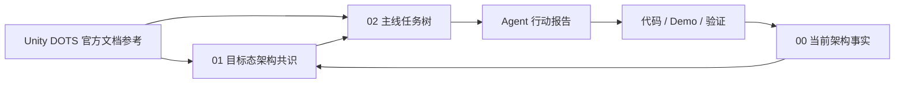

# Unity DOTS 官方文档参考

## 定位

本目录是 EX-GAS 2.0 架构路线的 **Unity DOTS 官方依据库**。它不属于目标态 Spec，也不属于任务树。

### 这个目录解决什么问题

当你在 EX-GAS 开发中遇到以下问题时，本目录提供有据可查的答案：

- "这个 DOTS API 到底应该怎么用？选 IJobEntity 还是 IJobChunk？"
- "为什么不能在 hot path 直接做结构变化？官方是怎么说的？"
- "ECB 和 Enableable 各适合什么场景？EX-GAS 项目里应该用哪个？"
- "官方文档说 DynamicBuffer 默认 128 字节容量，溢出了会怎样？"
- "NativeStream 做并行 fan-in 时，怎么保证输出是确定性的？"
- "Entity Graphics 的无头 Demo 等价性怎么保证？"

### 使用方式

1. **先读本 README**，定位你关心的问题属于哪个技术领域
2. **打开对应的技术领域文档**，读"核心概念"章节获取 API 机制
3. **读"EX-GAS 项目解读"章节**，获取该机制在本项目中的具体应用约束
4. **行动报告中引用具体规则编号**，如 `SC-01`、`BUF-02`、`CASE-03`

### 与本项目其他目录的关系



目标态架构共识回答"EX-GAS 应该怎么设计"；本目录回答"Unity DOTS/ECS 官方机制允许和推荐怎么做"。Runtime Core、Debugger、Luban、AutoChessDemo 相关任务在执行前必须先从本目录读取相关技术领域文档。

## 目录结构

```
UnityDOTS官方文档参考/
├── README.md                 ← 本文件（速查入口）
├── 维护规范.md                ← 提取/维护/模板/自检规范
├── 主题/                      ← 技术领域主题与当前权威流程
│   ├── System-World-SystemGroup/
│   │   ├── _index.md          ← 主题门户（核心概念 + 跨主题链接）
│   │   ├── API与EX-GAS解读.md  ← API 机制详解 + EX-GAS 项目解读
│   │   ├── SYS-01.md          ← 规范规则文件
│   │   └── CASE-01.md         ← 模式/反模式案例
│   ├── Query-Job-遍历/
│   ├── 结构变化-ECB/
│   ├── Enableable-Component选型/
│   ├── DynamicBuffer-Chunk-Archetype/
│   ├── Store选型-数据承载策略/
│   ├── Baking-BlobAsset/
│   ├── Prefab-Content管理/
│   ├── Diagnostics-Debugger/
│   ├── UnityPhysics/
│   ├── EntitiesGraphics/
│   ├── Burst-AOT/
│   ├── NativeContainer-Allocator/
│   ├── Mathematics-确定性/
│   ├── Transform-层级/
│   ├── 状态机策略/
│   ├── 数据流-系统生命周期/
│   ├── 20-GASRuntimeCore-API选型基线.md      ← API selection checkpoint 唯一正文
│   ├── 21-官方文档覆盖与流程闭环.md          ← 官方依据生成-消费-归档唯一正文
│   └── 90-规则编号索引.md
└── 元信息/                    ← 版本、模板和旧路径兼容入口
    ├── 版本与PackageCache.md
    ├── 行动报告模板.md
    ├── API选型基线.md          ← 兼容跳转，不维护正文
    └── 文档覆盖流程.md          ← 兼容跳转，不维护正文
```

## 第一性依据

当前项目以**本地 PackageCache 中实际安装包的 `Documentation~` 为第一性技术依据**。在线文档只能作为升级风险、版本差异或补充阅读入口。

| 包 | 实际版本 | 本地路径（包含 hash） | 官方在线入口 |
|---|---:|---|---|
| Entities | `1.4.6` | `Library/PackageCache/com.unity.entities@e90944159b94/Documentation~` | https://docs.unity3d.com/Packages/com.unity.entities@1.4/manual/ |
| Unity Physics | `1.4.6` | `Library/PackageCache/com.unity.physics@22d10f355559/Documentation~` | https://docs.unity3d.com/Packages/com.unity.physics@1.4/manual/ |
| Entities Graphics | `1.4.19` | `Library/PackageCache/com.unity.entities.graphics@1e91bb5cdef3/Documentation~` | https://docs.unity3d.com/Packages/com.unity.entities.graphics@1.4/manual/ |
| Burst | `1.8.29` | `Library/PackageCache/com.unity.burst@6bb9aca3ef38/Documentation~` | https://docs.unity3d.com/Packages/com.unity.burst@1.8/manual/ |
| Collections | `2.6.6` | `Library/PackageCache/com.unity.collections@9796e5ee0d9e/Documentation~` | https://docs.unity3d.com/Packages/com.unity.collections@2.6/manual/ |
| Mathematics | `1.3.3` | `Library/PackageCache/com.unity.mathematics@19a9377c4ffa/Documentation~` | https://docs.unity3d.com/Packages/com.unity.mathematics@1.3/manual/ |

**禁止修改 `Library/PackageCache` 中的任何文件。** 该目录变更会被 Unity 自动还原。

## 速查

### 按技术领域

| 你想知道... | 读这个文档 |
|---|---|
| System/World/SystemGroup 怎么组织，phase 怎么设计 | [System-World-SystemGroup](主题/System-World-SystemGroup/_index.md) |
| IJobEntity vs IJobChunk vs SystemAPI.Query 该用哪个 | [Query-Job-遍历](主题/Query-Job-遍历/_index.md) |
| ECB 怎么用，结构变化怎么避免 | [结构变化-ECB](主题/结构变化-ECB/_index.md) |
| Enableable 怎么替代 Tag Component | [Enableable-Component选型](主题/Enableable-Component选型/_index.md) |
| DynamicBuffer 容量策略，Archetype 布局 | [DynamicBuffer-Chunk-Archetype](主题/DynamicBuffer-Chunk-Archetype/_index.md) |
| Store 怎么选型，数据性质分类 | [Store选型-数据承载策略](主题/Store选型-数据承载策略/_index.md) |
| Baking/Blob 机制，config 怎么 immutable 化 | [Baking-BlobAsset](主题/Baking-BlobAsset/_index.md) |
| Prefab 怎么管理，资源引用怎么处理 | [Prefab-Content管理](主题/Prefab-Content管理/_index.md) |
| Profiler/Journaling/Debugger 诊断体系怎么搭 | [Diagnostics-Debugger](主题/Diagnostics-Debugger/_index.md) |
| Physics 范围检测、碰撞事件怎么接入 GAS | [UnityPhysics](主题/UnityPhysics/_index.md) |
| Entities Graphics 渲染桥接、无头/有头等价性 | [EntitiesGraphics](主题/EntitiesGraphics/_index.md) |
| Burst 编译条件、FunctionPointer、AOT 注意事项 | [Burst-AOT](主题/Burst-AOT/_index.md) |
| NativeStream/Allocator/ParallelWriter 怎么选 | [NativeContainer-Allocator](主题/NativeContainer-Allocator/_index.md) |
| Mathematics 确定性随机、battle hash | [Mathematics-确定性](主题/Mathematics-确定性/_index.md) |
| Transform 层级、LocalToWorld 正确用法 | [Transform-层级](主题/Transform-层级/_index.md) |
| ECS 状态机三种策略、GAS 选型映射 | [状态机策略](主题/状态机策略/_index.md) |
| 数据流确定性、Allocator 归属、System 生命周期 | [数据流-系统生命周期](主题/数据流-系统生命周期/_index.md) |
| 行动报告里引用哪个规则编号 | [90-规则编号索引](元信息/90-规则编号索引.md) |
| 执行任务前 API 选型 checkpoint | [20-GASRuntimeCore-API选型基线](主题/20-GASRuntimeCore-API选型基线.md) |
| 官方文档发现怎么反哺到项目文档 | [21-官方文档覆盖与流程闭环](主题/21-官方文档覆盖与流程闭环.md) |
| 当前 PackageCache 版本和 hash 证据 | [版本与PackageCache](元信息/版本与PackageCache.md) |
| Agent 执行 DOTS 任务的报告模板 | [行动报告模板](元信息/行动报告模板.md) |

### 按任务类型

| 任务类型 | 必读技术领域文档 | 最小行动报告内容 |
|---|---|---|
| **Runtime Core** | System-World-SystemGroup、Query-Job-遍历、结构变化-ECB、DynamicBuffer-Chunk-Archetype、Burst-AOT、NativeContainer-Allocator、状态机策略、数据流-系统生命周期、API选型基线 | API 选型表、query/buffer/job/structural metrics、状态机选型、规范检查清单 |
| **Debugger** | Query-Job-遍历、结构变化-ECB、DynamicBuffer-Chunk-Archetype、Diagnostics-Debugger、Burst-AOT、NativeContainer-Allocator、数据流-系统生命周期 | 分组归因、Profiler/Journaling 对照 |
| **Luban/SourceGenerator** | 版本与PackageCache、Baking-BlobAsset、Burst-AOT、Prefab-Content管理、API选型基线 | generated lookup、managed boundary 证据 |
| **AutoChessDemo** | Query-Job-遍历、结构变化-ECB、DynamicBuffer-Chunk-Archetype、UnityPhysics、EntitiesGraphics、NativeContainer-Allocator、Mathematics-确定性、状态机策略、数据流-系统生命周期、Transform-层级、API选型基线 | battle hash、core/physics/render profile、状态机选型 |
| **Presentation/Cue** | Baking-BlobAsset、EntitiesGraphics、NativeContainer-Allocator、数据流-系统生命周期、API选型基线 | outbox、resource binding 等价性 |
| **Physics 目标获取** | UnityPhysics、NativeContainer-Allocator、Mathematics-确定性、数据流-系统生命周期、API选型基线 | broadphase policy、query count |

## 渐进式阅读规则

1. **不全文重读**。先读本 README 定位任务相关技术领域，再只读那几篇。
2. **先读核心概念**章节（每篇的第一大节），理解 API 机制。
3. **再读 EX-GAS 项目解读**章节，理解本项目具体的约束和选择。
4. 行动报告中必须引用具体规则编号（如 `SC-01`、`BUF-02`），不能只写"读过官方文档"。

## 维护规则

1. 新增官方依据先进入对应技术领域文档，不直接塞进目标态 Spec。
2. 一个技术领域文档维护一个 DOTS 机制；如果开始同时承担两类职责，必须拆分（参见 [维护规范](维护规范.md) Part B）。
3. 每个技术领域文档包含：**核心概念**（最关键的章节）、编写规范、模式与反模式、EX-GAS 项目解读、常见陷阱、官方证据、验收指标。
4. PackageCache hash 变化时先更新 [版本与PackageCache](元信息/版本与PackageCache.md)，再更新受影响技术领域文档。
5. **不修改** `Library/PackageCache` 中的任何文件。
6. 官方依据改变目标设计 → 反哺 `01-目标态架构共识`。
7. 官方依据改变任务拆分或验收 → 反哺 `02-主线任务树`。
8. 官方依据暴露当前实现问题 → 反哺 `00-当前架构事实`。

## 验收标准

1. 任务执行者能从本目录找到所需 DOTS 机制的详细解释，不需要再去翻原始官方文档
2. 行动报告中的 API 选型和规则引用都定位到本目录的具体技术领域文档
3. 不再出现"看过官方文档但不知道怎么用"的反馈
4. PackageCache 版本更新时，版本与PackageCache 首先反映，再推送至各关联技术领域文档
