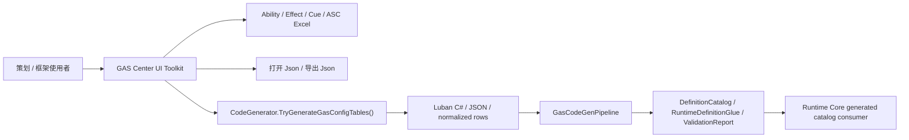

# Authoring / 编辑链事实

> 上次更新：2026-06-07 | 事实源：`Assets/GAS/Editor/GASCenterUIToolkit` + `Assets/GAS/Editor/GameplayAbilitySystem/GASSettingAsset.cs` + `Assets/GAS/Editor/CodeGen` + `Assets/GAS/Generated/CodeGen/Runtime`

本文件只记录当前业务编辑链和配置生成链的事实，不定义目标态交互。目标态业务编辑路径见 `../01-目标态架构共识/19-GAS业务编辑路径与配置链职责Spec.md`。

## 当前编辑链路

## 当前事实

1. `GASSettingAsset` 是路径集中点，维护 `ConfigProjectPath`、Luban JSON/C# 输出目录、CodeGen 输出目录，以及 Ability / Effect / Cue / ASC 等 Excel / JSON 路径。
2. `GASCenterAbilityPage` 直接读取 Ability Excel，通过 `GASCenterExcelTable` 载入 ID 列表，保存时写回 `ID / Name / Desc / Cost / CdEffect / Cd / Tag 列 / AbilityExecution`，并用 `SaveRowWithRawColumns(...)` 写回 execution 参数后续列。
3. `GASCenterEffectPage` 直接读取 Effect Excel，保存 `AssetTags / GrantedTags / TagRequirement / Duration / Period / Modifiers / Cue / GrantedAbility / Stacking`，其中大量字段仍以分号、逗号或 offset raw column 协议表达。
4. Ability / Effect 页都把“导出更新 Json 表”绑定到 `CodeGenerator.TryGenerateGasConfigTables()`，成功后刷新缓存。
5. 当前 UI 提供了一些 choice hint 和 ID 正规化，但主编辑体验仍是“表格行 + ID 列表 + 协议字符串 + 手动导出”，不是“业务能力包 + 图形化配置图 + 一键生成验证”。
6. `GasCodeGenPipeline` 已有 Core phases：asmdef、definition index、Blob schema、static lookup、catalog、runtime glue、Baker glue、component type set、query layout、validation report。
7. generated runtime glue 已能把 catalog definition 转成 `AbilityActivationPlanRecord`、`GECommandSeedRecord`、`ResolvedModifierRecord` 等 Runtime record。
8. 当前 CodeGen validation 已输出 generated runtime boundary / hot path gate，并已进入 `blocking-unclassified-migration-proof`；未分类回流会阻断，已分类 `MigrationProofOnly` 仍待退出，具体事实见 `CodeGen链路复审事实.md`。

## 当前业务编辑摩擦

| 摩擦点 | 当前表现 | 架构判定 |
|---|---|---|
| 业务意图分散 | 创建一个技能需要分别编辑 Ability、Effect、Tag、Cue、Attribute，且靠 ID 手工串联 | Editor 链缺少业务聚合入口 |
| 协议字段暴露 | Modifier、GrantedAbility、Duration、Stacking、TagRequirement 等仍暴露分号/offset 协议 | Raw table protocol 适合底层，不适合作为默认业务编辑界面 |
| 跨表验证后置 | 缺失引用、TagRequirement、Cue/Effect 链路主要依赖导出 / CodeGen 后再暴露 | 应前移到 Authoring Session 的 config graph validation |
| 编辑与生成分离 | 保存 Excel 和导出 JSON/CodeGen 是两个心理步骤 | 目标态应是业务保存后生成 validation snapshot，并可选择同步运行生成链 |
| Editor 链与 Runtime 链语义不一致 | Editor 以 Excel 列为中心，Runtime 以 command/spec/delta/fact 和 catalog 为中心 | 需要“业务草稿图 -> Definition row projection -> Runtime trace preview”的中间层 |

## 不能推出的结论

1. UI Toolkit 页能保存 Ability / Effect，不等于业务编辑路径已经短。
2. CodeGen pipeline 已能输出 catalog / glue，不等于 Editor 配置链已经能表达完整 GAS 业务语义。
3. `RuntimeForbiddenDependencyHits = 0` 或 generated hot path gate 通过，不等于跨表配置图、业务模板、Luban schema 和 Editor authoring 职责已经完成。
4. Excel 仍是权威输入，不意味着默认编辑体验必须长期暴露 Excel raw protocol。
