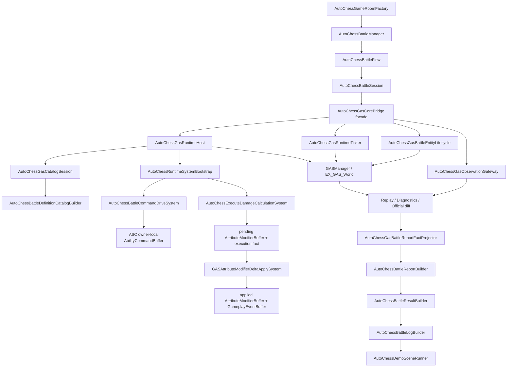

# AutoChessDemo 实现事实

> 上次更新：2026-06-08 | 状态：当前代码已恢复为可运行业务 Demo | 事实源：`Assets/AutoChessDemo`

本文件只记录当前代码事实。2026-05-26 旧文档中“已破坏性删除、待重构、HeadlessAutoChess/SHeadless* 系统清单”的结论已经过期，不能再作为当前架构事实。

2026-06-07 目录归位：`../01-目标态架构共识/10-AutoChess无头验收Spec.md` 不再维护“当前状态与剩余问题”。AutoChessDemo 的实现状态、运行证据、bridge 风险、catalog install 事实和规模门缺口统一写在本文件；`01/10` 只保留目标态验收能力和设计约束。

## 当前总览

`Assets/AutoChessDemo` 现在是一条业务导向的自走棋 demo 链路：

1. `GameRoom` 创建房间、玩家席位、阵容、棋子展示名、技能/GE/属性/tag 规则码。
2. `Battle` 定义对局输入、输出、统计、timing、unit snapshot 和业务日志。
3. `Battle/Flow` 承接对局生命周期、预热、测量窗口、tick 推进、胜负收口和 official diff 捕获。
4. `Battle/Report` 承接 Runtime structured log 到 AutoChess 业务战报的投影。
5. `Battle/Ecs` 提供 Demo 专用 ECS 系统和 `GASDefinitionCatalogBlob` 安装器。
6. `Integration/GasCore` 是 AutoChess 到 GAS Core 的唯一 adapter。
7. `AutoRunner` 提供 batchmode / player launch / system bootstrap。
8. `Presentation` 只显示战斗日志，不承载模拟，不回读 ECS World。

## 当前事实分层

| 层级 | 当前 owner | 事实 | 边界 |
|---|---|---|---|
| business-active | `GameRoom`、`Battle`、`Battle/Flow`、`Battle/Report`、`AutoRunner`、`Presentation` | demo 已恢复为可运行业务链，不是“删除后待重构”；同步 batchmode 与 stepped scene runner 已复用同一套 flow | 业务层不应直接散落调用 GAS Core |
| runtime-extension | `Battle/Ecs` 两个 `ISystem` | command drive 与 execute calculation 已插入当前 GAS group，并已迁到 scheduled job 路径 | 仍是 demo extension，不是通用 Runtime Core 终局证明 |
| bridge/direct-EM | `Integration/GasCore` facade + runtime host / catalog session / observation gateway / lifecycle / ticker / contracts | GAS init/tick/catalog/ASC lifecycle 已集中到 adapter；catalog install/uninstall 已收进 `AutoChessGasCatalogSession`，runtime host 不再为 catalog lifetime 解析 `EntityManager`；unit result snapshot 已改为从 structured log + report key 投影；driver public handle 已改为 opaque driver id + version，driver owner 证据通过 raw-Entity-free snapshot 输出 | assembly 内直接 `EntityManager` / driver runtime store 内部 `_driverEntity` / registry compatibility handle 是集中后的风险，不是目标态完成 |
| observation-only | Replay/Diagnostics/Official diff/structured log/report builder/result builder | 能导出日志和结果，方便业务验证；`Battle/Report` 只投影 Core facts，不补写伤害/死亡 | 不等于 CoreSimulation 性能证明 |
| generated catalog consumer | `AutoChessBattleDefinitionCatalogBuilder` | 安装通用 `GASGeneratedDefinitionCatalogBuilder.BuildCatalog()`，Ability/GE catalog 来自 Luban/sourcegen | 不能替代 unit/scenario/scale/validation expectation 配置链 |

## 官方规则对照

| Demo 层级 | 采用规则 | 当前判定 |
|---|---|---|
| business-active | `SYS-05`、`DBG-04` | 业务日志和结果可作为 Boundary 验证，不作为 Core hot path 成本 |
| runtime-extension systems | `SYS-02`、`QRY-01`、`PRF-05`、`PRF-09`、`CASE-01/02/03` | 插入当前 GAS groups 是正向事实；主线程单位扫描和执行伤害 buffer 写入已迁到 scheduled job |
| bridge/direct-EM | `SC-01`、`PRF-02`、`PRF-04`、`ECB-03` | adapter 集中可接受，但 unit/effect cleanup 不应长期绕过 structural commit owner |
| observation/export | `SYS-04`、`SYS-05`、`DBG-01..05` | Replay/Diagnostics/Official diff 必须和 CoreSimulation 分组报告 |
| generated catalog consumer | `CAT-01`、`BLOB-01/02`、`CASE-24`、`SEL-02` | AutoChess 已消费 generated catalog；runtime-created Blob 仍需明确安装/Dispose owner |

## 当前目录事实

| 路径 | 当前职责 | 关键文件 |
|---|---|---|
| `GameRoom` | 房间、阵容、棋子定义、规则码 | `AutoChessGameRoomDefinition.cs` |
| `Battle` | 对局契约、入口、session、结果、日志翻译 | `AutoChessBattleContracts.cs`, `AutoChessBattleManager.cs`, `AutoChessBattleSession.cs`, `AutoChessBattleResultBuilder.cs`, `AutoChessBattleLog.cs` |
| `Battle/Flow` | 对局 lifecycle、tick、测量窗口、胜负 flush、official diff 捕获 | `AutoChessBattleFlow.cs` |
| `Battle/Report` | AutoChess battle facts 到业务战报事件的投影 | `AutoChessBattleReportBuilder.cs` |
| `Battle/Ecs` | Demo ECS 扩展、catalog 安装、战斗指令驱动、斩杀 execution | `AutoChessBattleCommandDriveSystem.cs`, `AutoChessExecuteDamageCalculationSystem.cs`, `AutoChessBattleDefinitionCatalogBuilder.cs`, `AutoChessBattleDriverComponents.cs` |
| `Integration/GasCore` | GAS 初始化、ASC 创建/销毁、tick 推进、diagnostics/replay/official diff 导出，以及 structured log 到 battle fact 的边界投影 | 活动入口是 `AutoChessBattleRuntime.cs`, `AutoChessGasCoreBridge.cs`, `AutoChessGasRuntimeHost.cs`, `AutoChessGasCatalogSession.cs`, `AutoChessGasObservationGateway.cs`, `AutoChessGasBattleEntityLifecycle.cs`, `AutoChessGasRuntimeTicker.cs`, `AutoChessGasBattleReportFactProjector.cs`, `AutoChessGasCoreContracts.cs` |
| `AutoRunner` | 无头运行和 GAS 系统注册 | `AutoChessRuntimeRunner.cs`, `AutoChessRuntimeSystemBootstrap.cs` |
| `Presentation` | 日志场景、noop cue | `AutoChessDemoSceneRunner.cs`, `AutoChessNoopCue.cs`, `Scenes/AutoChessLogDemo.unity` |
| `Config` | 后续配置产物入口 | 当前无旧 Headless generated `.cs` 文件 |

## 当前执行链



## 已成立事实

1. `AutoChessRuntimeSystemBootstrap.RegisterSystems(World)` 不再使用旧 `GASCommandGroup / GASExecutionCalculationExtensionGroup` 名称；它从 `GASSystemGroups` 取当前 5 段主链 group，并把：
   - `AutoChessBattleCommandDriveSystem` 加入 `GASCommandResolveSystemGroup`
   - `AutoChessExecuteDamageCalculationSystem` 加入 `GEExecutionCalculationExtensionSystemGroup`
2. `AutoChessGasCoreBridge` 当前只是 facade；`AutoChessGasRuntimeHost.EnsureRuntimeInitialized()` 调用 `GASManager.Initialize(attachToPlayerLoop: false)`，注册 Demo systems，并通过 `AutoChessGasCatalogSession.TryInstall()` 安装 demo catalog / driver runtime store。catalog install / uninstall 的 `EntityManager` 解析现在由 `AutoChessGasCatalogSession` 持有，host 只保留 runtime bootstrap / world system registration / job drain capability。
3. `AutoChessBattleDefinitionCatalogBuilder` 通过 `GASGeneratedDefinitionCatalogBuilder.BuildCatalog(Allocator.Persistent)` 安装通用 GAS generated catalog；AutoChess ability `9101/9102/9103/9104` 和 GE `9201/9202/9203/9204/9207` 已来自 Luban JSON / normalized row / generated catalog 链。
4. `AutoChessBattleCommandDriveSystem` 是 `ISystem`，使用预创建 `_driverQuery` / `_unitQuery`，通过 scheduled `IJobChunk` 收集存活单位，并由 scheduled `IJob` 按 battle group target cache 写入 source ASC owner-local `AbilityCommandBuffer`、启用 `ASCCommandPendingComponent`。
5. `AutoChessExecuteDamageCalculationSystem` 是 `ISystem`，位于 execution extension slot，通过 scheduled `IJob` 读取 `GEEffectCommandBuffer`，处理 demo 斩杀公式并写目标 ASC owner-local pending `AttributeModifierBuffer` / execution `OwnerLocalGameplayFactBuffer`；属性写入已转交 `GASAttributeModifierDeltaApplySystem`，当前不再写 `AttributeValueBuffer`、singleton stream `GameplayEventBuffer` 或 legacy EventBus 兼容 observation。
6. `AutoChessBattleFlow` 负责同步 batchmode 和 stepped scene runner 共用的对局 tick、预热、采样窗口、victory flush 和 official diff 捕获。
7. `AutoChessBattleSession` 负责创建/缓存/销毁本场单位句柄，业务层不直接散落 `GASManager` 调用。
8. `AutoChessGasBattleReportFactProjector` 消费 runtime structured log，通过 `AutoChessRuntimeUnitResolver.ResolveUnitIndex(int reportKey)` 把 Core fact 转成 AutoChess battle facts；当前 projector 已消费 `SourceReportKey` / `TargetReportKey`，不再用 `ASCHandle.MatchesRuntimeEntity(...)` 匹配 raw ASC `Entity`。raw ASC `Entity` 仍会在 `GasStructuredLogExport.ResolveBoundaryReportKey(...)` 内部解析成 report key，属于 Boundary export owner。
9. `AutoChessBattleReportBuilder` 只消费 `AutoChessBattleReportFact[]` 和 unit result，把技能、伤害、死亡转成业务战报事件；当前不再直接持有 raw Entity 字典或读取 raw ECS identity。
10. `AutoChessBattleResultBuilder` 与 `AutoChessBattleLogBuilder` 消费 report 和 result snapshot，输出中文战斗叙述。
11. `AutoChessDemoSceneRunner` 只消费 `AutoChessBattleResult.BattleLog`，不会重新遍历 ECS World 推导表现状态。
12. 2026-06-07 batchmode 验收已把 period child GE 纳入结构化业务证据：稳定摘录见 `_归档/2026-06-07-GAS架构瘦身执行记录.md`，原始易失日志路径为 `Temp/AutoChessBattleValidation-PeriodGate.log`；`AutoChessDemoRuntimeRunner` 输出 `periodTickDamageFacts=150`、`periodTickDamageTotal=150`，`AutoChessDemoValidationRunResult` 输出 `passed=True`、`thresholdsPassed=True`、`runtimeChainPassed=True`，`AutoChessDemoRepeatRunEvidence` 输出 `firstPeriodTickDamageFacts=150` / `secondPeriodTickDamageFacts=150`。这说明毒跳伤不再只靠战斗日志旁证，而是 AutoChess validation gate 的机器字段。
13. 2026-06-07 batchmode 验收已把 active mutation 旧 carrier 与旧 random lookup 口径同时压入机器门：稳定摘录见 `_归档/2026-06-07-GAS架构瘦身执行记录.md` 的 `追加验收：ActiveMutation chunk-local apply`，原始日志路径为 `_归档/2026-06-07-AutoChessBattleValidation-ActiveMutationChunkApply-Run3.log`；`activeMutationCommands=200`、`activeMutationOwnerGroups=200`、`activeMutationMigrationCarriers=0`、`activeMutationEstimatedRandomLookups=0`、`activeMutationOwnerResourceLookups=0`，且 validation result 为 `passed=True` / `thresholdsPassed=True` / `runtimeChainPassed=True` / `repeatRunPassed=True`。当前仍不能把 ActiveMutation 写成 scale-ready 终局，因为 command source 仍来自 singleton `GEEffectCommandBuffer` carrier，且 `SourceAttribute` 跨 owner capture 已从 active mutation apply 移出，后续必须由 magnitude snapshot / resolve lane 承接。
14. 2026-06-07 batchmode 复测 `_归档/2026-06-07-AutoChessBattleValidation-PendingAttributeChunkApply-Run3.log` 已验证 pending AttributeDelta owner-local apply 进入 ASC chunk-local `IJobChunk`：`pendingAttributeDeltas=350`、`pendingAttributeAppliedDeltas=250`、`pendingAttributeSkippedDeltas=100`、`pendingAttributeTargetGroups=250`、`pendingAttributeEstimatedRandomLookups=0`、`pendingAttributeMigrationCarriers=0`；业务字段保持 `attributeChanges=898`、`executionOutputs=344`、`cueRequests=1404`、`periodTickDamageFacts=150`，且 validation result 为 `passed=True` / `thresholdsPassed=True` / `runtimeChainPassed=True` / `repeatRunPassed=True`。这证明 AutoChessDemo 可作为复杂 GAS 验证业务，但不应反向污染 GAS Core。
15. 2026-06-07 R1/R6 Boundary report key 复测 `Temp/AutoChessBattleValidation-BoundaryReportKey.log` 已把 report projection raw ASC matcher 退出写进机器门：`AutoChessDemoBoundaryReportKeys: passed=True, entries=4800, sourceAscRefs=4800, sourceReportKeys=4800, missingSourceReportKeys=0, targetAscRefs=4800, targetReportKeys=4800, missingTargetReportKeys=0`；同轮 `AutoChessDemoValidationRunResult` 为 `passed=True` / `runtimeChainPassed=True` / `repeatRunPassed=True`，`factsHash=0xA4A93C35`、`summaryHash=0x65FD3625`。这只证明战报投影稳定键已收口；当轮尚未证明 unit result live read、driver lifecycle 或 direct EM capability 退出，unit result 后续收口见本节第 17 条。
16. 2026-06-07 stream migration fallback 删除后复测 `_归档/2026-06-07-AutoChessBattleValidation-PendingAttributeNoStreamFallback-Run1.log` 通过：`passed=True` / `thresholdsPassed=True` / `runtimeChainPassed=True` / `repeatRunPassed=True`，业务字段保持 `attributeChanges=898`、`executionOutputs=344`、`cueRequests=1404`、`periodTickDamageFacts=150`；pending 字段保持 `pendingAttributeDeltas=350`、`pendingAttributeAppliedDeltas=250`、`pendingAttributeSkippedDeltas=100`、`pendingAttributeTargetGroups=250`、`pendingAttributeEstimatedRandomLookups=0`、`pendingAttributeMigrationCarriers=0`。这证明 `pendingAttributeMigrationCarriers=0` 已从“本轮未触发 fallback”升级为“fallback 已删除且静态门禁防回流”。
17. 2026-06-07 R1/R6 structured snapshot 切片已把 AutoChess unit result 从 `GASRuntimeShell.TryCaptureASCReadModel` live read 改为 `AutoChessGasBattleUnitSnapshotProjector`：`AutoChessBattleResultBuilder` 将 `coreObservation.StructuredLog` 传入 `AutoChessBattleSession.CreateUnitResults(...)`，snapshot projector 通过 unit report key 回放 `AttributeChange` 的 Health / Energy 最新值。`Verify-GAS-RuntimeCoreBoundary.ps1` 已加入防回流门，禁止 AutoChess session / bridge / lifecycle 重新出现 `ReadCombatAttributes`、`RefreshUnits` 或 `TryCaptureASCReadModel`。batchmode 原始日志已归档到 `_归档/2026-06-07-AutoChessBattleValidation-StructuredSnapshot-Run1.log`：`AutoChessDemoBoundaryOwners` 输出 `snapshotOwner=AutoChessGasBattleUnitSnapshotProjector.StructuredLog` / `passed=True` / `missingSourceReportKeys=0` / `missingTargetReportKeys=0`，`AutoChessDemoValidationRunResult` 输出 `passed=True` / `runtimeChainPassed=True` / `repeatRunPassed=True`，`AutoChessDemoRuntimeRunner` 输出 `blockingDebugErrors=0`、`factsHash=0xA4A93C35`、`summaryHash=0x6681A05F`。该切片不证明 driver lifecycle、catalog install、ObservationGateway singleton 写、driver runtime store 内部 `_driverEntity` owner、x100/x1000 规模或 Profiler 性能闭环已退出；同轮日志仍显示 `profiler disabled; Entities profiler modules collect no data`。
18. 2026-06-08 TagRequirement query 切片最终以 `_归档/2026-06-08-AutoChessBattleValidation-TagRequirementQuery-Run5.log` 为有效 x50 证据，证明当前 AutoChess 链路未被 TagRequirement catalog / evaluator 贯通破坏；它不证明所有 tag 组合、SourceAttribute 非零业务样本、Profiler enabled 或 x100/x1000 规模门完成。完整字段、代码证据和不能推出的结论集中维护在 [架构重划分审查事实/08-TagRequirementQueryDefinitionGlue事实.md](架构重划分审查事实/08-TagRequirementQueryDefinitionGlue事实.md)，本文件只保留 Demo 验收摘要。
19. 当前 `AutoChessGasBattleDriverHandle` 不再包装 raw `Entity`，而是保存 opaque `driverId/version`；`AutoChessBattleDriverRuntimeStore` 负责在 adapter implementation 内部解析 `_driverEntity`，并通过 `AutoChessBattleDriverOwnerSnapshot` 把 `driverOwnerInstalled`、`driverOwnerEnabled`、`driverOwnerHandleMatched`、`driverStructuralCreates`、`driverEnableRequests`、`driverDisableRequests`、`driverUninstallRequests` 输出到 validation summary。`Verify-GAS-RuntimeCoreBoundary.ps1` 已阻断旧 adapter entity resolver 和 public/internal static raw `Entity` 导出口回流。这是 R1/R6 raw driver identity 的正向收缩，但不证明 driver lifecycle 已进入 structural commit owner；`AutoChessBattleDriverRuntimeStore` 仍直接持有 `_driverEntity` 并通过 `EntityManager` 读写 driver component。
20. 2026-06-08 catalog lifetime Interface 收窄：`AutoChessGasRuntimeHost` 不再调用 `GASRuntimeShell.TryResolveRuntimeEntityManager`，只通过 `AutoChessGasCatalogSession.TryInstall()` / `Uninstall()` 管理 catalog lifetime；`AutoChessGasCatalogSession` 内部解析 `EntityManager` 并调用 internal `AutoChessBattleDefinitionCatalogBuilder.Install/Uninstall`。这集中了一处 shallow Module Interface，但仍不证明 runtime-created catalog entity / Blob dispose 已进入最终 `DefinitionCatalogLifetime` 目标态。
21. 2026-06-08 R6/R8 timing owner split 切片把 Runtime Debugger timing evidence 从纯 `PhysicalGroup` 扩展为 `OwnerSplit` 聚合：`AutoChessGasObservationGateway.RecordRuntimeTickTiming(...)` 现在额外发布 `CoreRuntimeOwner`、`BoundaryOwner`、`RunnerOwner` 三类 owner cost。`AutoChessBattleRuntimeTiming` / validation summary 已有 `CoreRuntimeOwner`、`BoundaryOwner`、`DebuggerOwner`、`RunnerOwner`、`PhysicsOwner`、`RenderOwner` 字段和 disabled reason 输出；本切片补的是 Debugger aggregate 层的同口径证据，而不是性能终局证明。
22. 2026-06-08 execution-only GE owner-local spec 链路已通过 AutoChess x50 无头验收，稳定摘录见 `_归档/2026-06-08-ExecutionFactOwnerLocalSpecChain.md`，原始日志路径为 `Temp/AutoChessBattleValidation-ExecutionFactOwnerLocal-FinalRun2.log`；`AutoChessDemoValidationRunResult` 输出 `passed=True` / `thresholdsPassed=True` / `runtimeChainPassed=True` / `repeatRunPassed=True`，`AutoChessDemoRuntimeRunner` 输出 `executionOutputs=350`、`executionSpecScans=1400`、`executionMatchedEffectSpecs=350`、`executionTargetOwnerMismatches=0`、`executionMissingAttributes=0`、`executionEvaluatorRejects=0`、`pendingAttributeDeltas=350`、`pendingAttributeAppliedDeltas=250`、`ownerLocalFacts=5200`、`coreRequests=0`、`coreFacts=5200`。当前 `coreRequests=0` 是 owner-local command/spec/fact 链路下的预期口径，runtime chain gate 应看 `SpecCount`、fact 和 pending apply，而不是 legacy request entity count。
23. 2026-06-08 R4/R6 RuntimeAccess contract evidence 切片把 `AutoChessGasRuntimeAccess` 的 direct ECS capability 固化为可机读 owner contract：validation evidence 现在输出 `runtimeAccessContractEntries=15`、`runtimeAccessEcsHandleProxies=15`、`runtimeAccessManualSync=1`、`runtimeAccessPerformancePassRisks=15`、`runtimeAccessBattleHashAffecting=4`、`runtimeAccessCapabilityMask=0x3F`。完整矩阵由 `AutoChessGasRuntimeAccessContract.CreateSummary()` 输出，覆盖 `RuntimeSession`、`DefinitionCatalogLifetime`、`CommandPort`、`DiagnosticsSink`、`RunnerSync`、`DriverLifecycle` 六类 capability。该切片只证明 wrapper 已从“集中调用点”升级为“可验收风险清单”，不证明 Thin Adapter、DefinitionCatalogLifetime owner、DiagnosticsSink owner、RunnerSync 或 driver structural owner 已完成。

## 代码证据矩阵

| 事实 | 代码证据 | 证据等级 |
|---|---|---|
| Demo systems 通过 bootstrap 插入当前 GAS group | `Assets/AutoChessDemo/AutoRunner/AutoChessRuntimeSystemBootstrap.cs:20-33` | runtime-extension |
| bridge facade 已把职责转发给 integration 子 owner | `Assets/AutoChessDemo/Integration/GasCore/AutoChessGasCoreBridge.cs:5-45` | adapter-facade；当前只负责 unit / driver / report / attribute facade，不再承载 runtime bootstrap / observation / ticker |
| runtime host 初始化 GAS、注册 systems、安装 catalog session | `Assets/AutoChessDemo/Integration/GasCore/AutoChessGasRuntimeHost.cs:7-29`、`AutoChessGasCatalogSession.cs:6-25` | host bootstrap + catalog session owner；host 不再直接解析 catalog `EntityManager` |
| observation gateway 负责 official diff、observation reset、diagnostics snapshot、PhysicalGroup timing counter 和 OwnerSplit timing aggregate | `Assets/AutoChessDemo/Integration/GasCore/AutoChessGasObservationGateway.cs:11-199`、`:201-286` | observation-only / diagnostics |
| runtime ticker 手动推进 5 段 GAS group 并记录 timing | `Assets/AutoChessDemo/Integration/GasCore/AutoChessGasRuntimeTicker.cs:9-37`、`:44-49`、`:53-113` | demo-runner/observation |
| adapter 对外 unit handle 已换成 battle unit key，driver handle 已换成 opaque id/version，report / unit result 投影已转 report key，driver owner 证据不暴露 raw `Entity` | `Assets/AutoChessDemo/Integration/GasCore/AutoChessGasCoreContracts.cs:7-76`、`AutoChessGasBattleEntityLifecycle.cs:49-103`、`:130-157`、`AutoChessGasBattleUnitSnapshotProjector.cs:8-56`、`AutoChessGasBattleReportFactProjector.cs:7-77`、`Assets/GAS/Runtime/Event/GasStructuredLogExport.cs:419-473`、`Assets/AutoChessDemo/Battle/Ecs/AutoChessBattleDriverComponents.cs:27-214`、`Assets/AutoChessDemo/Battle/Validation/AutoChessBattleValidationReport.cs:403-431`、`Tools/Diagnostics/Verify-GAS-RuntimeCoreBoundary.ps1` | adapter/report-key-projection；剩余 raw identity 风险在 registry compatibility handle / driver runtime store 内部 `_driverEntity`，但 adapter public raw driver `Entity` 已有脚本防回流 |
| command drive 是 `ISystem` 并挂入 CommandResolve | `Assets/AutoChessDemo/Battle/Ecs/AutoChessBattleCommandDriveSystem.cs:7-11` | runtime-extension |
| command drive 使用 scheduled `CollectUnitTargetStatesJob` 读取单位/属性 | `Assets/AutoChessDemo/Battle/Ecs/AutoChessBattleCommandDriveSystem.cs:52-60`、`:87-149` | runtime-extension |
| command drive 使用 scheduled `FlushCommandRequestsJob` 写 ASC owner-local `AbilityCommandBuffer` 并启用 pending marker | `Assets/AutoChessDemo/Battle/Ecs/AutoChessBattleCommandDriveSystem.cs:62-80`、`:152-236` | runtime-extension |
| execute calculation 插入 execution extension slot | `Assets/AutoChessDemo/Battle/Ecs/AutoChessExecuteDamageCalculationSystem.cs:8-10` | runtime-extension |
| execute calculation 使用 scheduled `ExecuteDamageCalculationJob` 读取 GE command、写 owner-local pending delta / execution fact | `Assets/AutoChessDemo/Battle/Ecs/AutoChessExecuteDamageCalculationSystem.cs:42-61`、`:75-182` | runtime-extension / pending-delta-producer；execution fact 写目标 ASC `OwnerLocalGameplayFactBuffer`，不再写 singleton stream fact buffer |
| Runtime Core 统一应用 AutoChess pending delta | `Assets/GAS/Runtime/System/Attribute/GASAttributeModifierDeltaApplySystem.cs:8-195` | runtime-core apply owner；owner-local path 已是 ASC chunk-local `IJobChunk`，旧 stream migration fallback 已删除；linked execution fact patch 改为扫描 ASC owner-local fact buffer |
| execute calculation 已停止写 legacy EventBus / singleton fact stream | `Assets/AutoChessDemo/Battle/Ecs/AutoChessExecuteDamageCalculationSystem.cs:98-106`、`:156-187` | owner-local typed-fact-only |
| demo 安装 generated catalog | `Assets/AutoChessDemo/Battle/Ecs/AutoChessBattleDefinitionCatalogBuilder.cs:12-24` | app-boundary/init |
| generated catalog 由 codegen 输出 | `Assets/GAS/Generated/CodeGen/Runtime/DefinitionCatalog.gen.cs:81`、`Assets/GAS/Editor/CodeGen/Phases/GasGlueCodeGenPhases.cs:833-856` | sourcegen-active |
| demo catalog entity 缓存失效时直接创建 catalog entity | `Assets/AutoChessDemo/Battle/Ecs/AutoChessBattleDefinitionCatalogBuilder.cs:51-58` | init-only direct create；旧 `ToEntityArray` singleton 查找事实已过期 |
| battle runtime 窄入口已从 flow 中抽出 | `Assets/AutoChessDemo/Integration/GasCore/AutoChessBattleRuntime.cs` | runtime-boundary facade；仍转发 host / observation / ticker |
| battle flow 已从 manager 中拆出 | `Assets/AutoChessDemo/Battle/Flow/AutoChessBattleFlow.cs` | business-lifecycle |
| battle report 已从 result builder 中拆出 | `Assets/AutoChessDemo/Battle/Report/AutoChessBattleReportBuilder.cs` | business report projection；消费 `AutoChessBattleReportFact[]`，不直接消费 raw `Entity` |
| structured log 到 report fact 的投影位于 Integration/GasCore | `Assets/AutoChessDemo/Integration/GasCore/AutoChessGasBattleReportFactProjector.cs`、`Assets/GAS/Runtime/Event/GasStructuredLogExport.cs:421-471` | boundary projection；projector 消费 `SourceReportKey` / `TargetReportKey`，report key 解析仍由 Boundary export 从 raw ASC `Entity` 派生 |
| lifecycle owner 直接创建 driver、给 ASC 附加 demo component、维护 battle unit registry | `Assets/AutoChessDemo/Integration/GasCore/AutoChessGasBattleEntityLifecycle.cs:10-247` | bridge/direct-EM |
| observation gateway 通过 `GASRuntimeShell` 取得 singleton 后读写 observation/debug buffer | `Assets/AutoChessDemo/Integration/GasCore/AutoChessGasObservationGateway.cs:19-58`、`:60-83`、`:85-168`、`:250-255` | observation-only |
| AutoRunner official diff summary 输出 captured / disabled 状态 | `Assets/AutoChessDemo/AutoRunner/AutoChessRuntimeRunner.cs:63-79`、`Assets/AutoChessDemo/Battle/Validation/AutoChessBattleValidationReport.cs:301-338`、`AutoChessBattleValidationRun.cs:400-418` | official-evidence |
| AutoChess timing contract 当前只覆盖 5 段 GAS group | `Assets/AutoChessDemo/Battle/AutoChessBattleContracts.cs:267-294`、`Assets/AutoChessDemo/Integration/GasCore/AutoChessGasRuntimeTicker.cs:9-37`、`Assets/AutoChessDemo/AutoRunner/AutoChessRuntimeRunner.cs:138-260` | timing-split-gap |
| period child GE 已进入 AutoChess 结构化验收门 | `EX_GAS_Config/ProjectConfigTable/exgas_config/Datas/AutoChessDemo/autochess.sourcegen.json:27`、`Assets/AutoChessDemo/Integration/GasCore/AutoChessGasObservationGateway.cs:180-236`、`Assets/AutoChessDemo/Battle/Validation/AutoChessBattleValidationRun.cs:351-367`、`00-当前架构事实/_归档/2026-06-07-GAS架构瘦身执行记录.md` | runtime-chain validation evidence |
| active mutation 已进入 ASC chunk-local apply | `Assets/GAS/Runtime/System/Effect/GEActiveEffectCommandNormalizeSystem.cs`、`Assets/GAS/Runtime/System/Effect/GASActiveEffectRuntime.cs`、`Assets/GAS/Runtime/System/Effect/GEActiveEffectLifecycleSystems.cs`、`Tools/Diagnostics/Verify-GAS-RuntimeCoreBoundary.ps1`、`00-当前架构事实/_归档/2026-06-07-AutoChessBattleValidation-ActiveMutationChunkApply-Run3.log` | runtime-chain validation evidence；`RuntimeActiveEffect.gen.cs` 当前只是 marker，active mutation 主体已转入 hand-written Runtime owner；`ActiveEffectLifecycleOwnerSystems.cs` 当前磁盘缺失；`activeMutationEstimatedRandomLookups=0` / `ownerResourceLookups=0` / `migrationCarriers=0`，剩余风险转为 singleton command carrier、SourceAttribute snapshot lane、capacity / spill 和 generated lifecycle 防回流 |
| pending AttributeDelta 已进入 ASC chunk-local apply | `Assets/GAS/Runtime/System/Attribute/GASAttributeModifierDeltaApplySystem.cs:37-195`、`Tools/Diagnostics/Verify-GAS-RuntimeCoreBoundary.ps1:82-101`、`00-当前架构事实/_归档/2026-06-07-AutoChessBattleValidation-PendingAttributeChunkApply-Run3.log` | runtime-chain validation evidence；`pendingAttributeEstimatedRandomLookups=0` / `pendingAttributeMigrationCarriers=0` / `pendingAttributeAppliedDeltas=250`，旧 stream migration fallback 已删除；剩余风险转为 singleton stream fact carrier、generated instant delta record 与 fan-in 证明 |

## DOTS 合规现状

| 项 | 当前状态 | 结论 |
|---|---|---|
| 系统数量 | AutoChessDemo 当前 2 个 Demo ECS `ISystem` | 不再是旧“16 个 SHeadless system” |
| 主链接入 | command drive 和 execute calculation 都挂入当前 GAS 5 段主链 | 正向 |
| Job 化 | command drive 与 execute calculation 主体已改为 scheduled job，避免主线程 `SystemAPI.Query` 和属性 buffer dependency 冲突 | 正向，但仍是 demo extension |
| `ToEntityArray` | AutoChessDemo 当前 0 命中 | 旧 catalog singleton query 已删除；catalog install / dispose capability 已集中到 `AutoChessGasCatalogSession`，但 builder 内 direct `CreateEntity` 初始化路径仍需最终 owner 证明 |
| 结构变化 | `AutoChessGasBattleEntityLifecycle` 仍直接创建 driver、切换 driver destroy request、给 ASC 添加 demo component，并维护 battle unit key -> `ASCHandle` registry；`DestroyBattleUnit()` 当前已走 `ASCCommandPort.RequestDestroy()`，不再直接销毁 ASC / granted ability / active effect；unit result 不再通过 live `ASCReadModel` 刷新 | Demo 集成层仍有 direct-EM P1 风险，但旧 cleanup direct destroy / granted ability cache / result live read 口径已过期 |
| Definition | 安装通用 generated catalog，不依赖旧 Headless generated rows | Luban/sourcegen catalog 链路已进入 AutoChess |
| Observation | 使用 Replay/Diagnostics/Official diff/structured log | 正向，但 observation 不等于性能证明 |
| Timing split | `AutoChessBattleRuntimeTiming` 已拆出 `CoreRuntime`、`Boundary`、`Runner`、`Debugger`、`Physics`、`Render` owner timing；validation summary 输出 owner split 与 physics/render/presentation disabled reason；Runtime Debugger 现在额外发布 `OwnerSplit/CoreRuntimeOwner`、`OwnerSplit/BoundaryOwner`、`OwnerSplit/RunnerOwner` aggregate | 证据口径已从纯 ECS group timing 推进到 owner cost split，但尚未证明 x100/x1000、Profiler enabled、physics/render 实测或 PlayerLoop 场景表现成本 |

## 当前风险

### AC-01：Integration/GasCore 仍是直接 EntityManager 集中点

`AutoChessBattleRuntime` 是 Flow 侧窄入口，`AutoChessGasCoreBridge` 当前已从单体实现变成 Session 侧 facade。真实 direct EM / internal ECS capability 分布在 `AutoChessGasObservationGateway`、`AutoChessGasBattleEntityLifecycle`、`AutoChessGasCatalogSession`、`AutoChessGasRuntimeTicker` 和 `AutoChessGasCoreContracts`；`AutoChessGasRuntimeHost` 当前只保留 runtime world bootstrap、tick group lookup 和 job drain capability，不再替 catalog lifetime 解析 `EntityManager`。report projection 与 unit result snapshot 已从 raw ASC matcher / live read 收缩为 Boundary report key + structured log 消费。这是正向集中：业务层不再散落调用 `GASManager.EntityManager`，但 `GASRuntimeShell` internal capability 仍会把 `World`、`EntityManager`、runtime singleton 和 job drain 能力交给 adapter implementation，`Integration/GasCore` 内部仍直接读写 ECS，并由 Boundary export 从 raw ASC `Entity` 解析 report key：

- `CreateBattleDriver()` 通过 `AutoChessBattleDriverRuntimeStore.ResetAndEnable()` 确保 session driver entity 并返回 opaque `driverId/version` handle；store 内部仍直接持有 `_driverEntity` 并写 driver component
- `AutoChessGasBattleUnitHandle` 当前只持有 battle unit key；旧 unit-handle raw-entity 导出口已无命中。lifecycle registry 仍保存内部 `ASCHandle` 供 command / destroy compatibility 使用，但 report projection 和 unit result snapshot 当前通过 `ASCBoundaryReportKeyComponent` -> structured log `SourceReportKey` / `TargetReportKey` 匹配 battle unit。
- `DestroyBattleDriver()` 不直接 `DestroyEntity()`，但仍直接写 driver component 并启用 destroy request marker
- `AddBattleUnitComponent()` 直接给 ASC 写 Demo component
- `BattleUnitRegistry` 以 battle unit key 缓存 `ASCHandle`，用于 command / destroy compatibility；unit result snapshot 不再通过 `ASCHandle` 捕获 ECS，而是从 structured log 的 `TargetReportKey` 回放 Health / Energy；report key 解析仍依赖 Boundary export 读取 ASC 上的 `ASCBoundaryReportKeyComponent`
- `DestroyBattleUnit()` 当前通过 `ASCCommandPort.RequestDestroy()` 写销毁请求，是正向收口，但仍依赖 Shell command port capability
- `ResetObservationState()` 直接清 buffer / set singleton data
- `AutoChessGasRuntimeTicker.UpdateTimed()` 在每个 physical group update 后调用 `CompleteAllTrackedJobs()`，这是 runner/debugger measurement sync，不能算作 CoreSimulation hot path 自身已优化的证明

这比旧代码“业务各处散落 GASManager”更好，但还不是目标态 command sink / structural commit owner。

当前分类必须细化：

| 操作 | 代码证据 | 分类 | 后续要求 |
|---|---|---|---|
| `EnsureRuntimeInitialized()` / `ShutdownRuntime()` | `AutoChessBattleRuntime.cs:35-39`、`:63-66`、`AutoChessGasRuntimeHost.cs:7-29`、`AutoChessGasCatalogSession.cs:6-25` | 初始化 adapter，可暂接受；catalog EM capability 已移到 catalog session | 保持唯一入口，但 `GASRuntimeShell.TryResolveRuntimeEntityManager` 仍是 internal Shell EM capability |
| `TickRuntime()` 手动 update groups / `CompleteAllTrackedJobs()` | `AutoChessBattleRuntime.cs:41-45`、`AutoChessGasRuntimeTicker.cs:8-39`、`:46-58` | demo runner / timing sync | 与 PlayerLoop/固定步 owner 分开；不计入 CoreSimulation hot path 优化证明 |
| `CreateBattleDriver()` / `DestroyBattleDriver()` | `AutoChessGasCoreBridge.cs:12-32`、`AutoChessGasBattleEntityLifecycle.cs:49-104`、`AutoChessBattleDriverComponents.cs:24-250` | 结构变化风险；对外 handle 已 opaque，driver owner snapshot 可机读，内部 store 仍持有 driver entity | 迁到 request/structural commit owner，或证明 driver 是 session-owned bootstrap entity；不得恢复 public raw `Entity` handle |
| `CreateBattleUnit()` / `DestroyBattleUnit()` | `AutoChessGasCoreBridge.cs:7-9`、`:35-37`、`AutoChessGasBattleEntityLifecycle.cs:14-46`、`:105-113`、`:122-205` | unit lifecycle adapter | unit create 仍经 Shell 拿 `EntityManager` 并写 demo component；unit destroy 已走 ASC destroy request，需要保留防回流 gate |
| `BattleUnitRegistry` / runtime unit resolver | `AutoChessGasBattleEntityLifecycle.cs:11-12`、`:67-80`、`:122-149`、`AutoChessGasCoreContracts.cs:7-58`、`GasStructuredLogExport.cs:419-473` | battle unit key registry / report key projection | 对外 key 已收缩为 battle unit key；report projection 和 unit result snapshot 已消费 report key，剩余风险是 registry 仍通过内部 `ASCHandle` 承接 command compatibility，后续需要 structural owner / stable report key coverage gate |
| `ResetObservationState()` / `ClearBuffer<T>()` | `AutoChessBattleRuntime.cs:35-39`、`AutoChessGasObservationGateway.cs:18-60`、`:233-237` | observation-only | 不计入 CoreSimulation 成本 |
| `CreateOfficialToolDiffSummary()` / `HasRequiredRuntimeChain()` | `AutoChessBattleValidationReport.cs:301-338`、`AutoChessBattleValidationRun.cs:400-418` | official-evidence | captured / disabled / unsupported 必须和性能口径分开 |

2026-06-07 R6 细化后的 direct `EntityManager` owner 分类如下：

| 使用面 | 代码证据 | 当前 owner 分类 | DOTS 风险判定 | 后续消费 |
|---|---|---|---|---|
| Runtime host 初始化 / 关闭 | `AutoChessBattleRuntime.cs:35-39`、`:63-66`、`AutoChessGasRuntimeHost.cs:7-29` | bootstrap capability owner | 只应存在于 battle session bootstrap / teardown；host 当前不再拥有 catalog `EntityManager` 解析 | R6 保留唯一 host 入口，补 world / fixed tick owner 说明 |
| Catalog install / uninstall | `AutoChessGasRuntimeHost.cs:16-26`、`AutoChessGasCatalogSession.cs:6-25`、`AutoChessBattleDefinitionCatalogBuilder.cs:12-31` | catalog bootstrap / catalog lifetime owner | runtime-created Blob 可接受为初始化路径，EM 解析已集中到 catalog session，但 builder 仍持有 create / dispose implementation | R5/R6 联动，补 catalog lifecycle evidence 与最终 DefinitionCatalogLifetime owner |
| Observation reset | `AutoChessBattleRuntime.cs:35-39`、`AutoChessGasObservationGateway.cs:18-60`、`:250-255` | observation reset | 清 singleton / buffer 只能作为 run boundary reset，不得算 Core hot path | `04` 保存验证语境，`00` 只保留当前事实 |
| Battle unit create + demo component attach | `AutoChessGasCoreBridge.cs:7-9`、`AutoChessGasBattleEntityLifecycle.cs:10-43`、`:140-180` | unit lifecycle adapter | `ASCCommandPort.Create(em)` 与 `em.SetComponentData` 仍暴露 live ECS 初始化面 | R1/R6 要替换为 opaque handle + structural owner |
| Battle driver create / destroy request | `AutoChessGasCoreBridge.cs:12-32`、`AutoChessGasBattleEntityLifecycle.cs:49-104`、`AutoChessBattleDriverComponents.cs:24-250` | driver lifecycle adapter | driver public handle 已 opaque，driver owner snapshot 已可导出；driver store 仍由 adapter implementation 直接写 ECS | R6 必须标注 bootstrap-only 或迁到 structural commit owner，并保持 `driverAdapterRawEntity=false` 防回流 |
| Battle unit registry / runtime unit resolver | `AutoChessGasCoreBridge.cs:17-22`、`AutoChessGasBattleEntityLifecycle.cs:67-80`、`:122-149`、`AutoChessGasCoreContracts.cs:7-58`、`AutoChessGasBattleReportFactProjector.cs:7-77`、`AutoChessGasBattleUnitSnapshotProjector.cs:8-56`、`GasStructuredLogExport.cs:419-473` | battle unit key registry / report fact projection / unit result snapshot | resolver 继续把 structured log report key 映射到 battle unit index；旧 raw ASC matcher、live result read 与 ability cache 口径已过期 | 固化 report key coverage，registry `ASCHandle` compatibility 和 driver runtime store 内部 `_driverEntity` owner 转 R1/R6 |
| Battle unit destroy request | `AutoChessGasCoreBridge.cs:35-37`、`AutoChessGasBattleEntityLifecycle.cs:106-115` | unit lifecycle adapter | 当前已走 `ASCCommandPort.RequestDestroy()`，不再直接销毁 runtime entity；仍依赖 Shell command port capability | 保留防回流 gate，后续证明销毁请求进入 ASC destroy / cleanup owner |
| Structured unit result snapshot | `AutoChessBattleResultBuilder.cs:25-29`、`AutoChessBattleSession.cs:64-85`、`:110-124`、`AutoChessGasBattleUnitSnapshotProjector.cs:8-56` | Boundary structured evidence consumer | unit result Health / Energy 从 `GasStructuredLogExportSnapshot` 的 `TargetReportKey` + `AttributeChange` 派生；`TryResolveWinner()` 只读 driver stats | 保留防回流 gate；后续推进 driver lifecycle / observation direct EM |
| Observation snapshot / report source | `AutoChessGasCoreBridge.cs:80-82`、`AutoChessGasObservationGateway.cs:62-87`、`AutoChessBattleResultBuilder.cs:21-30` | observation access | 读取 replay/debugger buffer 允许作为 Boundary 输出，但不能反向写 Core | 与 CoreSimulation timing 拆分 |
| Physical group timing sync | `AutoChessGasRuntimeTicker.cs:8-39`、`:46-58` | runner sync / debugger measurement | 每段 group 后 `CompleteAllTrackedJobs()` 是显式 sync，不能当 Core hot path 已优化证明 | R6/R8 timing split 必须单列 runner sync cost |
| Debugger timing write | `AutoChessGasRuntimeTicker.cs:53-113` | debugger timing | 写 `GasRuntimeDebugger.RecordSystemTimingAggregate` 是 diagnostics side effect | 不计入 gameplay authority |

raw ASC identity 已从 report projector 退出，但 Boundary / adapter 内部 raw handle 面仍未退出：

| 传播点 | 代码证据 | 当前用途 | 风险 |
|---|---|---|---|
| `BattleUnitRegistry` / `ASCHandle` | `AutoChessGasBattleEntityLifecycle.cs:11-12`、`:122-149` | 以 battle unit key 找回内部 `ASCHandle` | raw ECS identity 已不通过 unit handle public 方法导出，unit result 也不再 live read；adapter 内部仍保留 command / destroy compatibility handle |
| `AutoChessRuntimeUnitResolver` / `AutoChessRuntimeUnitLink.Matches(int reportKey)` | `AutoChessGasBattleEntityLifecycle.cs:211-251` | 以 battle unit report key 解析 battle unit index | report projection 已走 stable int key；后续 gate 应检查 missing report key，而不是继续查 `Matches(Entity)` |
| session runtime unit resolver input | `AutoChessBattleSession.cs:88-95`、`:110-124`、`AutoChessGasBattleEntityLifecycle.cs:67-80` | session 传入 unit handle，Integration/GasCore 内部转成 report-key link / structured snapshot link | report key 已从 `Battle/Report` 和 unit result builder 上游统一生成；仍需保证 Boundary report key coverage 不缺失 |
| alive / attribute refresh | `AutoChessBattleSession.cs:64-85`、`:110-124`、`AutoChessGasBattleUnitSnapshotProjector.cs:8-56` | final unit Health / Energy 由 structured log 派生，胜负由 driver stats 派生 | 旧 adapter live-read ECS 口径已过期；仍需确保 report key coverage gate 持续覆盖 attribute facts |
| report fact projector key / driver handle | `AutoChessGasBattleReportFactProjector.cs:7-77`、`AutoChessGasCoreContracts.cs:46-76`、`:113-133`、`GasStructuredLogView.cs:43-44`、`GasStructuredLogExport.cs:419-473`、`AutoChessBattleDriverComponents.cs:24-250` | structured log 中 `SourceReportKey` / `TargetReportKey` 经 resolver 转成 battle unit index；driver handle 以 `driverId/version` 校验，adapter public 面不再暴露 driver `Entity`，并通过 `AutoChessBattleDriverOwnerSnapshot` 导出 owner evidence；`AutoChessBattleReportBuilder.cs` 只消费 `AutoChessBattleReportFact[]` | report key coverage 与 driver public `Entity` 暴露已缓解；后续重点是 missing-key gate、driver runtime store 内部 `_driverEntity` owner 和 structural commit 收口 |

### AC-02：Demo command drive 已 job 化，但仍是 demo extension

`AutoChessBattleCommandDriveSystem` 已从主线程 `SystemAPI.Query` 单位扫描迁到 scheduled jobs：`CollectUnitTargetStatesJob` 读取单位/属性，`FlushCommandRequestsJob` 写 ASC owner-local `AbilityCommandBuffer` 并启用 pending marker。

需要注意的是，它已经避免了逐单位创建 request entity，也不再用主线程 query 作为 command drive 主体；但它仍是 Demo extension，不是 Runtime Core 的通用高规模模板。后续审查重点应放在 battle target cache 的容量、ordering、dependency policy 和 bridge 侧结构变化，而不是继续用“主线程扫描”旧口径描述。

### AC-03：Execution extension 已退为 pending delta producer

`AutoChessExecuteDamageCalculationSystem` 在 execution extension 中：

1. 读取 `GEEffectCommandBuffer`
2. 调用 `AutoChessGeneratedExecutionEvaluator.TryEvaluateExecuteDamage(...)` 计算 demo 斩杀输出
3. 写带 `AttributeModifierBufferFlags.RequiresCoreApply` 的 pending `AttributeModifierBuffer`
4. 写 `ExecutionCalculationOutputUpdated` execution fact
5. 不再直接修改目标 `AttributeValueBuffer`
6. 不再写 legacy gameplay EventBus

`GASAttributeModifierDeltaApplySystem` 已在 `GASCoreSimulationSystemGroup` 中接管 pending delta apply：它回填 delta 的 `OldValue` / `NewValue`，把 `Flags` 改为 `AppliedByCore`，点亮 `AttributeDirtyComponent`，并同步 patch 同一 `SourceDeltaSequence` 的 execution fact。`GameplayFactProjectionSystem` 已跳过未 apply 的 pending delta，避免 projection 提前把半成品 delta 写成 attribute change fact。

这比旧状态更接近目标态：AutoChess extension 不再是第二套 Attribute Apply owner。当前 owner-local pending delta 已由 `ApplyOwnerLocalPendingAttributeModifierDeltaChunkJob : IJobChunk` 在 ASC chunk 内应用，`AttributeDirtyComponent` 和 `PendingAttributeModifierComponent` 也通过 chunk `EnabledMask` 写入；x50 runner 显示 `pendingAttributeEstimatedRandomLookups=0`、`pendingAttributeMigrationCarriers=0`。旧 stream migration fallback 已删除，但 singleton `AttributeModifierBuffer` 仍作为 fact / generated instant delta record carrier 存在，不能写成 scale-ready 终局。后续 R3/R4 仍需要把 execution output / attribute delta fan-in 推向 `NativeStream` deterministic merge、target-grouped range 或更明确的 owner-local carrier，并输出 capacity、spill、merge cost 和 buffer pressure 证据。

### AC-04：Catalog 已来自 SourceGenerator，但安装 owner 仍是 demo adapter

`AutoChessBattleDefinitionCatalogBuilder` 不再手写 Ability/GE/Modifier catalog。它当前调用 `GASGeneratedDefinitionCatalogBuilder.BuildCatalog()`，并用 `GASGeneratedDefinitionCatalogInfo.SchemaVersion` 写入 `GASDefinitionCatalogComponent.Revision`。旧 `HeadlessAutoChessGeneratedDefinitionRows.cs`、`HeadlessAutoChessDefinitionSource.cs` 不存在，不能再作为当前 AutoChess facts。

它当前最有价值的证据是：demo 不依赖 managed registry，也不依赖手写 catalog 临时跑通，而是实际消费 Luban/sourcegen 生成的 `GASDefinitionCatalogBlob`。2026-06-08 后，host 不再为 catalog lifetime 解析 `EntityManager`，`AutoChessGasCatalogSession.TryInstall()` / `Uninstall()` 成为 catalog lifetime owner，`AutoChessBattleDefinitionCatalogBuilder` 也已降为 internal implementation。它当前最大的限制是：install/uninstall 仍由 demo adapter 持有 runtime-created catalog entity 和 Blob dispose owner；缓存失效时会直接 `CreateEntity(ComponentType.ReadWrite<GASDefinitionCatalogComponent>())`。业务房间、单位阵容、scale profile 和 validation expectation 仍不是配置表驱动。

### AC-05：业务设计已稳定为日志可视化 demo，不是资源表现 demo

当前场景 `AutoChessLogDemo.unity` 只显示日志。没有棋子模型、VFX、SFX 资源；这不是缺失的 gameplay 链路，而是当前 demo 的无资源表现约束。表现层不能被用来证明 CoreSimulation 性能。

### AC-06：Timing owner split 已结构化，但仍不是性能终局

`AutoChessBattleRuntimeTiming` 当前同时记录 physical group timing 与 owner split timing：

```text
TickTotal
FramePrepare
CommandResolve
CoreSimulation
StructuralCommit
BoundaryProjection
DependencyDrain
CoreRuntime
Boundary
Runner
Debugger
Physics
Render
```

`AutoChessGasRuntimeTicker.TickRuntime()` 对 5 段 GAS group 分别调用 `UpdateTimed()`，并在每段后调用 `CompleteAllTrackedJobs()`；`AutoChessBattleRuntimeTiming.Add(...)` 把 `FramePrepare + CommandResolve + CoreSimulation + StructuralCommit` 归入 `CoreRuntime`，把 `BoundaryProjection` 归入 `Boundary`，把 dependency drain sync 归入 `Runner`。`AutoChessBattleValidationReport.CreateTimingSummary(...)` 输出 `ownerSplit=core/boundary/debugger/runner/physics/render`、`PhysicsOwner`、`RenderOwner`、`physicsDisabledReason`、`renderDisabledReason`、`presentationDisabledReason`。本轮 `AutoChessGasObservationGateway.RecordRuntimeTickTiming(...)` 还向 Runtime Debugger 写入 `OwnerSplit/CoreRuntimeOwner`、`OwnerSplit/BoundaryOwner`、`OwnerSplit/RunnerOwner`，避免 debugger 侧只剩 physical group 口径。

因此当前 timing 证据已经可以说明 owner cost split 的结构化口径，但仍不能写成 DOTS 性能优秀：本切片没有运行 Unity headless、x100/x1000、Profiler/Journaling，也没有 physics/render 实测样本。后续交还应继续补 scale profile、Profiler enabled 数据、官方 Entities profiler / journaling 证据，并把 PlayerLoop / scene presentation 成本与 ECS runtime tick 成本保持分离。

## 与 Runtime Core 的边界

| 层 | 当前 owner | 不应越界 |
|---|---|---|
| 房间/阵容/胜负/日志 | AutoChessDemo | 不进入 `Assets/GAS/Runtime` |
| ASC/Ability/GE/Attribute/Cue 执行 | GAS Runtime | 不依赖 AutoChess 业务类型 |
| Demo 到 Core 的翻译 | `Integration/GasCore` facade + owner files | 上层业务不直接调用 `GASManager` |
| Demo ECS 扩展系统 | `Battle/Ecs` | 只通过 current GAS groups 插入，不发明旧 group |
| 表现 | `Presentation` | 只消费 result/log，不反向写 Core state |

## 当前结论

AutoChessDemo 已经不是“已删除后待重构”的状态。它现在是一条可运行的业务链，并且职责划分比旧 Headless 方案更清晰：业务层、battle flow、battle report、GAS adapter、Demo ECS 扩展和日志表现已经拆开。

但它仍不是 DOTS 目标态证明：

1. `Integration/GasCore` 内直接 `EntityManager` 是当前最集中的边界风险，虽已拆分 owner，但尚未变成 Thin Adapter。
2. 两个 Demo ECS 系统主体已 job 化，但仍是 demo extension，需要独立 query/dependency/ordering 证据。
3. execution extension 同时写 delta/fact，需要纳入 Runtime 写权限治理。
4. Demo catalog 已来自 generated builder；unit result live read 已退为 structured evidence projection；未完成的是 unit/scenario/scale/validation expectation 与 Baker/BlobAssetStore 目标态。
5. 当前日志场景证明业务可读性，不证明资源表现、不证明高规模性能。
6. 当前 timing summary 与 Runtime Debugger aggregate 已覆盖 core/boundary/debugger/runner/physics/render owner split 口径，但不证明 x100/x1000、Profiler enabled、physics/render 实测或 PlayerLoop 场景表现成本。
