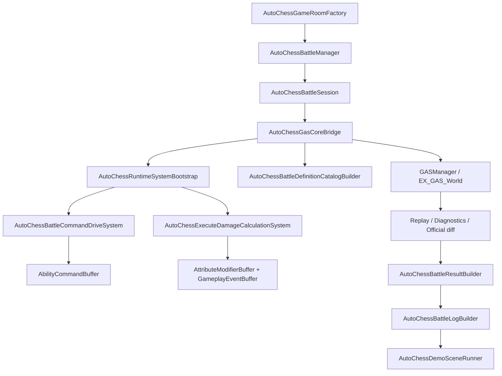

# AutoChessDemo 实现事实

> 上次更新：2026-06-02 | 状态：当前代码已恢复为可运行业务 Demo | 事实源：`Assets/AutoChessDemo`

本文件只记录当前代码事实。2026-05-26 旧文档中“已破坏性删除、待重构、HeadlessAutoChess/SHeadless* 系统清单”的结论已经过期，不能再作为当前架构事实。

## 当前总览

`Assets/AutoChessDemo` 现在是一条业务导向的自走棋 demo 链路：

1. `GameRoom` 创建房间、玩家席位、阵容、棋子展示名、技能/GE/属性/tag 规则码。
2. `Battle` 定义对局输入、输出、统计、timing、unit snapshot 和业务日志。
3. `Battle/Ecs` 提供 Demo 专用 ECS 系统和 `GASDefinitionCatalogBlob` 安装器。
4. `Integration/GasCore` 是 AutoChess 到 GAS Core 的唯一 adapter。
5. `AutoRunner` 提供 batchmode / player launch / system bootstrap。
6. `Presentation` 只显示战斗日志，不承载模拟，不回读 ECS World。

## 当前目录事实

| 路径 | 当前职责 | 关键文件 |
|---|---|---|
| `GameRoom` | 房间、阵容、棋子定义、规则码 | `AutoChessGameRoomDefinition.cs` |
| `Battle` | 对局契约、编排、session、结果、日志翻译 | `AutoChessBattleContracts.cs`, `AutoChessBattleManager.cs`, `AutoChessBattleSession.cs`, `AutoChessBattleResultBuilder.cs`, `AutoChessBattleLog.cs` |
| `Battle/Ecs` | Demo ECS 扩展、catalog 安装、战斗指令驱动、斩杀 execution | `AutoChessBattleCommandDriveSystem.cs`, `AutoChessExecuteDamageCalculationSystem.cs`, `AutoChessBattleDefinitionCatalogBuilder.cs`, `AutoChessBattleDriverComponents.cs` |
| `Integration/GasCore` | GAS 初始化、ASC 创建/销毁、tick 推进、diagnostics/replay/official diff 导出 | `AutoChessGasCoreBridge.cs` |
| `AutoRunner` | 无头运行和 GAS 系统注册 | `AutoChessRuntimeRunner.cs`, `AutoChessRuntimeSystemBootstrap.cs` |
| `Presentation` | 日志场景、noop cue | `AutoChessDemoSceneRunner.cs`, `AutoChessNoopCue.cs`, `Scenes/AutoChessLogDemo.unity` |
| `Config` | 后续配置产物入口 | 当前无旧 Headless generated `.cs` 文件 |

## 当前执行链

## 已成立事实

1. `AutoChessRuntimeSystemBootstrap.RegisterSystems(World)` 不再使用旧 `GASCommandGroup / GASExecutionCalculationExtensionGroup` 名称；它从 `GASSystemGroups` 取当前 5 段主链 group，并把：
   - `AutoChessBattleCommandDriveSystem` 加入 `GASCommandResolveSystemGroup`
   - `AutoChessExecuteDamageCalculationSystem` 加入 `GEExecutionCalculationExtensionSystemGroup`
2. `AutoChessGasCoreBridge.EnsureRuntimeInitialized()` 调用 `GASManager.Initialize(attachToPlayerLoop: false)`，注册 Demo systems，并安装 demo catalog。
3. `AutoChessBattleDefinitionCatalogBuilder` 直接构建并安装最小 `GASDefinitionCatalogBlob`，为 demo 提供 ability / GE / modifier / requirement / tag mask / granted ability catalog。
4. `AutoChessBattleCommandDriveSystem` 是 `ISystem`，使用预创建 `_driverQuery` / `_unitQuery`，按 battle group 收集存活单位，向 singleton stream 上的 `AbilityCommandBuffer` 写 ability command。
5. `AutoChessExecuteDamageCalculationSystem` 是 `ISystem`，位于 execution extension slot，读取 `GEEffectCommandBuffer`，处理 demo 斩杀伤害，写入 `AttributeModifierBuffer` 与 `GameplayEventBuffer`，并通过 EventBus writer 兼容 legacy observation。
6. `AutoChessBattleSession` 负责创建/缓存/销毁本场单位句柄，业务层不直接散落 `GASManager` 调用。
7. `AutoChessBattleResultBuilder` 与 `AutoChessBattleLogBuilder` 消费 runtime structured log 和 result snapshot，输出中文战斗叙述。
8. `AutoChessDemoSceneRunner` 只消费 `AutoChessBattleResult.BattleLog`，不会重新遍历 ECS World 推导表现状态。

## DOTS 合规现状

| 项 | 当前状态 | 结论 |
|---|---|---|
| 系统数量 | AutoChessDemo 当前 2 个 Demo ECS `ISystem` | 不再是旧“16 个 SHeadless system” |
| 主链接入 | command drive 和 execute calculation 都挂入当前 GAS 5 段主链 | 正向 |
| Job 化 | 两个系统主体仍是主线程 `SystemAPI.Query` / buffer for loop | 迁移期，不是 scale-ready |
| `ToEntityArray` | 只在 `AutoChessBattleDefinitionCatalogBuilder` 安装/卸载 catalog 时查询 singleton entity | 低频初始化路径，可接受但需后续 owner 化 |
| 结构变化 | `AutoChessGasCoreBridge` 创建/销毁 driver、ASC、granted ability、active effect 时直接用 `EntityManager` | Demo 集成层 P1/P0 边界风险 |
| Definition | 代码安装最小 catalog，不依赖旧 Headless generated rows | 当前事实已变更 |
| Observation | 使用 Replay/Diagnostics/Official diff/structured log | 正向，但 observation 不等于性能证明 |

## 当前风险

### AC-01：Bridge 仍是直接 EntityManager 集中点

`AutoChessGasCoreBridge` 是正确的 adapter seam，但内部仍大量使用 `GASManager.EntityManager`：

- `CreateBattleDriver()` 直接 `CreateEntity()` / `AddComponentData()`
- `DestroyBattleDriver()` / `DestroyBattleUnit()` 直接 `DestroyEntity()`
- `AddBattleUnitComponent()` 直接给 ASC 写 Demo component
- `DestroyGrantedAbilities()` / `DestroyActiveEffects()` 直接清理 runtime entity
- `ResetObservationState()` 直接清 buffer / set singleton data

这比旧代码“业务各处散落 GASManager”更好，但还不是目标态 command sink / structural commit owner。

### AC-02：Demo command drive 仍是主线程扫描

`AutoChessBattleCommandDriveSystem` 使用 `SystemAPI.Query` 遍历所有 battle unit，并通过 `NativeList`/`NativeArray` 做目标缓存。当前实现能表达业务，但不是 Burst job / chunk pipeline 终局。

### AC-03：Execution extension 同时写 delta/fact/legacy event

`AutoChessExecuteDamageCalculationSystem` 在 execution extension 中：

1. 读取 `GEEffectCommandBuffer`
2. 直接修改目标 `AttributeValueBuffer`
3. 写 `AttributeModifierBuffer`
4. 写 `GameplayEventBuffer`
5. 用 `EventBusHelper.BeginGameplayEventBatch()` 写 legacy event

这符合迁移期“typed fact + legacy bridge”现实，但后续需要明确 execution extension 的写权限和 deterministic ordering。

### AC-04：Catalog 安装仍是代码内最小样本

`AutoChessBattleDefinitionCatalogBuilder` 是当前 demo 的最小 catalog builder，不是完整 Luban/SourceGenerator 链路。旧 `HeadlessAutoChessGeneratedDefinitionRows.cs`、`HeadlessAutoChessDefinitionSource.cs` 不存在，不能再作为当前 AutoChess facts。

### AC-05：业务设计已稳定为日志可视化 demo，不是资源表现 demo

当前场景 `AutoChessLogDemo.unity` 只显示日志。没有棋子模型、VFX、SFX 资源；这不是缺失的 gameplay 链路，而是当前 demo 的无资源表现约束。表现层不能被用来证明 CoreSimulation 性能。

## 与 Runtime Core 的边界

| 层 | 当前 owner | 不应越界 |
|---|---|---|
| 房间/阵容/胜负/日志 | AutoChessDemo | 不进入 `Assets/GAS/Runtime` |
| ASC/Ability/GE/Attribute/Cue 执行 | GAS Runtime | 不依赖 AutoChess 业务类型 |
| Demo 到 Core 的翻译 | `AutoChessGasCoreBridge` | 上层业务不直接调用 `GASManager` |
| Demo ECS 扩展系统 | `Battle/Ecs` | 只通过 current GAS groups 插入，不发明旧 group |
| 表现 | `Presentation` | 只消费 result/log，不反向写 Core state |

## 当前结论

AutoChessDemo 已经不是“已删除后待重构”的状态。它现在是一条可运行的业务链，并且职责划分比旧 Headless 方案更清晰：业务层、GAS adapter、Demo ECS 扩展和日志表现已经拆开。

但它仍不是 DOTS 目标态证明：

1. Bridge 内直接 `EntityManager` 是当前最集中的边界风险。
2. 两个 Demo ECS 系统还没有 job/chunk 化。
3. execution extension 同时写 delta/fact/legacy event，需要纳入 Runtime 写权限治理。
4. Demo catalog 是代码安装的最小样本，不是完整 generated/baking 配置链。
5. 当前日志场景证明业务可读性，不证明资源表现、不证明高规模性能。
