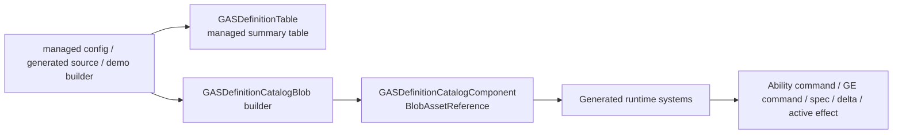

# Definition / 配置事实

> 上次更新：2026-06-06 | 事实源：`Assets/GAS/Runtime/Definition` + `Assets/GAS/Generated/CodeGen/Runtime` + 当前 `Assets/AutoChessDemo`

本文件只记录当前代码事实。旧文档中引用的 `Assets/AutoChessDemo/Config/Generated/HeadlessAutoChessGeneratedDefinitionRows.cs`、`HeadlessAutoChessDefinitionSource.cs`、`Assets/GAS/Runtime/DotsBaking/GASGeneratedDefinitionBakingSystem.cs` 当前不在代码树内，不能继续作为当前事实。

## 当前 Definition 链路

当前实际上并存两套层次：

1. **Managed summary / diagnostics 层**：`GASDefinitionTable`、`GASDefinitionGeneratedAdapter`、ConfigRegistry、BakePlan/Contract/Pipeline/IntegrationPlan。
2. **Runtime catalog blob 层**：`GASDefinitionCatalogBlob`、generated lookup/glue、generated runtime systems。

第一层适合初始化、诊断、过渡期生成链规划；第二层才是当前 generated runtime hot path 读取的事实源。

## Definition 事实分层

| 层级 | 当前文件/符号 | 当前状态 | 不能推出 |
|---|---|---|---|
| runtime-active catalog blob | `GASDefinitionCatalogComponent`、`GASDefinitionCatalogBlob`、`DefinitionCatalog.gen.cs`、`RuntimeDefinitionGlue.gen.cs` | 已进入 generated runtime 执行链 | 不能证明 Baker/SourceGenerator 全链完成 |
| generated runtime systems | `AbilityCatalogCommitSystem`、`GEEffectCommandCatalogNormalizeSystem`、`GEEffectSpecBuildSystem`、`GASAttributeSetReduceApplySystem`、active effect systems | 已由 generated registration 挂入 CommandResolve/CoreSimulation；ability commit 已用 chunk `EnabledMask`，instant spec/reduce 已是 `[BurstCompile] IJob` | 不能跳过 DOTS 热路径审查；已修复链路仍需 static validation 防回流 |
| managed diagnostics/table | `GASDefinitionTable`、`GASDefinitionGeneratedAdapter`、`ConfigRegistryDiagnostics` | 初始化、诊断、过渡层仍有效 | 不能写成 job/chunk hot path owner |
| contract-only bake plan | `GASGeneratedDefinitionBakingPlan`、`BakeContract`、`BakePipeline`、`RuntimeIntegrationPlan` | 只表达目标约束和 materialization 计划 | 不能作为 Unity `Baker<T>` 已落地证据 |
| editor template-only Baker | `GasGlueCodeGenPhases.cs` 模板字符串 | Editor CodeGen 可生成 Baker 文本 | 当前 Runtime/AutoChess 代码树没有实际生成物 |
| codegen partial generation | `GasCodeGenPipeline` + `RuntimeDefinitionGluePhase` | `Rows=0` 时仍执行不依赖 RowMetadata 的 runtime glue phase，并跳过 row-driven phase / manifest save / orphan cleanup | 不能把生成链路失败误判成 generated runtime 不可修复 |
| demo-only hand-written catalog | `AutoChessBattleDefinitionCatalogBuilder` | 让 AutoChessDemo 当前可运行 | 不能替代 Luban/SourceGenerator/ValidationExpectation 链 |

## 官方规则对照

| 事实层级 | 采用规则 | 当前判定 |
|---|---|---|
| runtime catalog blob | `BLOB-01`、`SEL-01`、`SEL-05` | 符合 runtime hot path 读取 Blob/generated lookup 的方向 |
| generated runtime systems | `QRY-01`、`JOB-01`、`PRF-05` | 已进入主链，因此必须接受 query/job/dependency 审查 |
| managed diagnostics/table | `SYS-05`、`DBG-01..05` | 可作为诊断/初始化层，不作为 Core hot path owner |
| baking plan/contract | `BAKE-01`、`BAKE-02`、`BAKE-03` | 只表达烘焙计划，不能替代实际 Baker/Baking System 产物 |
| `Baker<T>` template | `CASE-39`、`CASE-40` | 实际 Baker 必须无状态、只添加/声明依赖；模板字符串不是验收证据 |
| demo hand-written catalog | `CASE-24`、`BLOB-02`、`SEL-02` | `BlobBuilder` 构建方式可接受；但 demo-only/proof-only，且 runtime-created Blob 必须有 Dispose owner |

## 已成立事实

1. `GASDefinitionCatalogRuntimeTypes.cs` 定义 runtime catalog singleton：
   - `GASDefinitionCatalogComponent`
   - `GASDefinitionCatalogBlob`
   - ability / GE / modifier / requirement / tag mask / granted ability blob record
2. generated runtime systems 已通过 `state.RequireForUpdate<GASDefinitionCatalogComponent>()` 依赖 catalog：
   - `AbilityCatalogCommitSystem`
   - `GEEffectCommandCatalogNormalizeSystem`
   - `GEEffectSpecBuildSystem`
   - `GASAttributeSetReduceApplySystem`
   - `GASActiveEffectMutationApplySystem`
   - `GASActiveEffectPreTickSystem`
   - `GASActiveEffectRemoveSystem`
3. `DefinitionCatalog.gen.cs` 提供 generated catalog lookup：`TryGetAbilityIndex()`、`TryGetGameplayEffectIndex()`、`GetAbility()`、`GetGameplayEffect()`。
4. `RuntimeDefinitionGlue.gen.cs` 提供 runtime 对 catalog 的 ability / GE / requirement / modifier glue。
5. `GASDefinitionGeneratedAdapter` 仍存在，用 managed source 构建 `GASDefinitionTable` 并生成 diagnostics。
6. `GASDefinitionTable` 仍是 managed summary table，内部 summary / lookup 不是 blob/chunk/job 友好结构。
7. `GameplayEffectConfigRegistry`、`AbilityConfigRegistry`、`CueConfig` 等 registry 仍是迁移期 managed provider 入口。
8. `GameplayEffectConfigRegistry` 仍维护 prototype entity cache 和 `GEStaticDefinitionBlob` cache，适合初始化/prototype 路径，不应进入 hot path。
9. 当前 AutoChessDemo 没有依赖旧 Headless generated rows，而是由 `AutoChessBattleDefinitionCatalogBuilder` 在代码中安装最小 `GASDefinitionCatalogBlob`。
10. 当前 codegen pipeline 已有 partial generation 保护：当没有任何 `*DefinitionRow` 时，会执行 `RequiresRows == false` 的 phase（当前是 `RuntimeDefinitionGluePhase`），并跳过依赖 RowMetadata 的 phase；partial run 不保存 manifest、不做 orphan cleanup，避免在 rows=0 时误删旧 generated 文件。

## 代码证据矩阵

| 事实 | 代码证据 | 证据等级 |
|---|---|---|
| runtime catalog singleton 已定义 | `Assets/GAS/Runtime/Definition/GASDefinitionCatalogRuntimeTypes.cs:10-16` | runtime-active |
| generated lookup 提供 ability / GE index 和 definition 读取 | `Assets/GAS/Generated/CodeGen/Runtime/DefinitionCatalog.gen.cs:27-72` | runtime-active |
| generated runtime glue 读取 catalog | `Assets/GAS/Generated/CodeGen/Runtime/RuntimeDefinitionGlue.gen.cs:16-32`、`:72-80`、`:127-131` | runtime-active |
| generated systems require catalog | `Assets/GAS/Generated/CodeGen/Runtime/RuntimeAbilityActivation.gen.cs:26-32`、`RuntimeActiveEffect.gen.cs:22-27`、`RuntimeEffectInstant.gen.cs:20-25` | runtime-active |
| generated systems 真实注册进 GAS groups | `Assets/GAS/Generated/CodeGen/Runtime/RuntimeSystemRegistration.gen.cs:15-21`、`Assets/GAS/Runtime/System/SystemGroup/GASSystemScheduleContract.cs:309-317` | runtime-active |
| managed table/adapter 仍存在 | `Assets/GAS/Runtime/Definition/GASDefinitionTable.cs:289-353`、`GASDefinitionGeneratedAdapter.cs:165-189` | diagnostics/transition |
| config diagnostics 与 prototype cache 是 static managed 状态 | `Assets/GAS/Runtime/Effect/GameplayEffectConfigRegistry.cs:121-155`、`:491-540` | managed-init |
| bake plan/contract/pipeline/integration 是 contract code | `Assets/GAS/Runtime/Definition/GASGeneratedDefinitionBakingPlan.cs:63`、`GASGeneratedDefinitionBakeContract.cs:131`、`GASGeneratedDefinitionBakePipeline.cs:230`、`GASGeneratedDefinitionRuntimeIntegrationPlan.cs:117` | contract-only |
| `Baker<T>` 当前只在 Editor CodeGen 模板字符串中出现 | `Assets/GAS/Editor/CodeGen/Phases/GasGlueCodeGenPhases.cs:830`、`:4894` | template-only |
| rows=0 partial generation 已进入 pipeline | `Assets/GAS/Editor/CodeGen/Core/IGasCodeGenPhase.cs`、`Assets/GAS/Editor/CodeGen/GasCodeGenPipeline.cs`、`Assets/GAS/Editor/CodeGen/Phases/GasGlueCodeGenPhases.cs` | codegen-active |
| AutoChess 当前手写安装最小 catalog | `Assets/AutoChessDemo/Battle/Ecs/AutoChessBattleDefinitionCatalogBuilder.cs:59-112`、`:122-141` | demo-only/init |

## 当前实现文件

| 文件 | 当前职责 | 风险/备注 |
|---|---|---|
| `Assets/GAS/Runtime/Definition/GASDefinitionCatalogRuntimeTypes.cs` | runtime catalog blob 类型 | generated runtime hot path 读取入口 |
| `Assets/GAS/Generated/CodeGen/Runtime/DefinitionCatalog.gen.cs` | generated blob lookup | 当前 lookup 需要纳入生成代码审查 |
| `Assets/GAS/Generated/CodeGen/Runtime/RuntimeDefinitionGlue.gen.cs` | generated runtime glue | command/spec/active effect 依赖 |
| `Assets/GAS/Runtime/Definition/GASDefinitionTable.cs` | managed definition summary / lookup | O(n) / managed array / diagnostics 层 |
| `Assets/GAS/Runtime/Definition/GASDefinitionGeneratedAdapter.cs` | generated source -> table + diagnostics | 初始化/验证层，不是 hot path |
| `Assets/GAS/Runtime/Definition/GASGeneratedDefinitionBakingPlan.cs` | baking plan contract | contract-only，当前不等于实际 Unity Baker |
| `Assets/GAS/Runtime/Definition/GASGeneratedDefinitionBakeContract.cs` | bake writes/archetype contract | contract-only |
| `Assets/GAS/Runtime/Definition/GASGeneratedDefinitionBakePipeline.cs` | artifact materialization plan | contract-only / warmup plan |
| `Assets/GAS/Runtime/Definition/GASGeneratedDefinitionRuntimeIntegrationPlan.cs` | runtime integration plan | contract-only |
| `Assets/GAS/Runtime/Effect/GameplayEffectConfigRegistry.cs` | GE config registry、prototype、static blob cache、diagnostics | managed cache，生命周期需治理 |
| `Assets/GAS/Editor/CodeGen/GasCodeGenPipeline.cs` | CodeGen phase 编排、manifest、partial generation | `Rows=0` 时不再直接 return；只执行不依赖 RowMetadata 的 phase |
| `Assets/AutoChessDemo/Battle/Ecs/AutoChessBattleDefinitionCatalogBuilder.cs` | demo 最小 catalog 安装器 | 低频初始化路径，含 `ToEntityArray` singleton 查找 |

## 已失效的旧事实

| 旧口径 | 当前状态 |
|---|---|
| `HeadlessAutoChessGeneratedDefinitionRows.cs` 是当前 AutoChess generated source | 文件当前不存在 |
| `HeadlessAutoChessDefinitionSource.cs` 是当前 AutoChess Definition source | 文件当前不存在 |
| `GASGeneratedDefinitionBakingSystem` 位于 `Assets/GAS/Runtime/DotsBaking` | 当前 Runtime/DotsBaking 下没有该 `.cs` 实现 |
| 代码库中已有实际 `Baker<T>` runtime/baking 实现 | 当前 `Baker<T>` 只出现在 Editor CodeGen 模板字符串里，没有生成到当前 Runtime/AutoChess 代码树 |
| AutoChess 当前由 Luban generated rows 驱动 | 当前 demo 由代码内最小 catalog builder 驱动 |

## 当前缺口

### DEF-01：Managed summary table 与 runtime catalog blob 并存

`GASDefinitionTable` / `GASDefinitionGeneratedAdapter` 仍是有价值的诊断/过渡层，但它不是 generated runtime 的 hot path 数据结构。文档和任务拆分必须区分：

- 初始化/诊断事实：managed table、registry、diagnostics、plan。
- Runtime 执行事实：`GASDefinitionCatalogBlob` + generated lookup/glue。

### DEF-02：Baking contract 不是实际 Baker 集成

BakePlan / BakeContract / BakePipeline / RuntimeIntegrationPlan 目前是 contract/plan 代码。它们不能证明已经符合 Unity Entities Baker 机制。当前实际 `Baker<T>` 类未生成到代码树，`BlobAssetStore` 生命周期治理也未落地。

当前可接受的表述是“Editor CodeGen 模板中存在 Baker 生成能力”；不可接受的表述是“Runtime 已经完成 Unity Baker 集成”。后者需要在 `Assets/GAS/Generated` 或业务生成目录中看到实际 `Baker<TAuthoring>` 产物、authoring component、BlobAssetStore owner 和 baking-only assembly 依赖边界。

### DEF-03：ConfigRegistry 仍是全局 managed 状态

`ConfigRegistryDiagnostics` 使用静态 `List` / `HashSet`，`GameplayEffectConfigRegistry` 使用静态 `Dictionary<int, Entity>` 和 `Dictionary<int, BlobAssetReference<GEStaticDefinitionBlob>>`。这可以作为初始化/Editor/诊断路径，但不适合 Burst/job/runtime scale path。

### DEF-04：AutoChess catalog 是最小手写样本

`AutoChessBattleDefinitionCatalogBuilder` 能让 demo 跑通，但它没有证明 Spec 11 的配置表、SourceGenerator、Baker、ValidationExpectation、ScaleProfile 链路已经落地。

它的价值是提供当前业务 demo 的最小 runtime catalog proof：`BlobBuilder` 构建 catalog，`SetComponentData(GASDefinitionCatalogComponent)` 安装到 singleton entity。它的限制也同样明确：`ResolveCatalogEntity()` / `ResolveExistingCatalogEntity()` 通过临时 query + `ToEntityArray()` 查 singleton，且 catalog 内容在代码中手写，不是配置驱动产物。

### DEF-05：generated runtime 必须纳入同等审查

generated runtime 已读取 catalog 并修改 runtime state，因此生成代码要接受与 handwritten Runtime 一样的 DOTS 检查：

1. 主线程 `SystemAPI.Query` 是否可接受。
2. buffer for loop 是否有规模上限和 capacity 证据。
3. 是否重新引入 `state.Dependency.Complete()`；当前扫描为 0，后续 codegen 必须防回流。
4. generated serial buffer loop 是否可以拆成 job/store chain。
5. hot path job 是否 `[BurstCompile]`，enableable 是否优先 `EnabledRefRW` / chunk `EnabledMask`，`IJobChunk` 是否处理 enabled mask。
6. blob lookup 是否 deterministic 且 revision/lifecycle 明确。

## 与目标态的当前差距

| 目标项 | 当前事实 | 严重度 |
|---|---|---|
| Unity `Baker<T>` 实际接入 | 当前只有 Editor CodeGen 模板字符串，没有落地生成物 | P1 |
| BlobAsset 生命周期 owner | runtime/prototype 仍有静态 Dictionary 管理 | P1 |
| Generated catalog 完整配置源 | AutoChess 当前是手写最小 catalog，不是完整 Luban/SourceGenerator 链 | P1 |
| ScaleProfile / ValidationExpectation | 当前没有配置驱动验收链 | P1 |
| Physics/Render profile | 当前无资源表现链和 profile plan | P2 |
| Managed summary table hot path 隔离 | 文档需明确 `GASDefinitionTable` 不是 runtime hot path owner | P1 |

## 当前结论

Definition 层相比旧代码已经有重要进展：`GASDefinitionCatalogBlob` 和 generated runtime glue 已经进入真实执行链，Runtime 不再只能依赖 managed config/prototype 路径。

但当前不能宣称 Definition / Baking / SourceGenerator 目标态已完成。实际状态是：

1. Runtime hot path 使用 catalog blob。
2. Managed table/registry/plan 仍是初始化、诊断、迁移层。
3. AutoChess 只安装最小手写 catalog。
4. 实际 Baker / BlobAssetStore / 配置驱动验收链尚未闭合。
