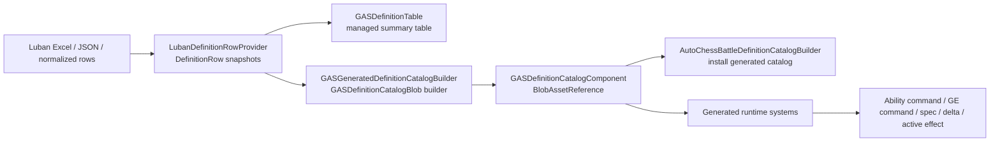

# Definition / 配置事实

> 上次更新：2026-06-06 | 事实源：`Assets/GAS/Runtime/Definition` + `Assets/GAS/Generated/CodeGen/Runtime` + 当前 `Assets/AutoChessDemo`

本文件只记录当前代码事实。旧文档中引用的 `Assets/AutoChessDemo/Config/Generated/HeadlessAutoChessGeneratedDefinitionRows.cs`、`HeadlessAutoChessDefinitionSource.cs`、`Assets/GAS/Runtime/DotsBaking/GASGeneratedDefinitionBakingSystem.cs` 当前不在代码树内，不能继续作为当前事实。

## 当前 Definition 链路

当前实际上并存两套层次：

1. **Managed summary / diagnostics 层**：`GASDefinitionTable`、`GASDefinitionGeneratedAdapter`、ConfigRegistry、BakePlan/Contract/Pipeline/IntegrationPlan。
2. **Runtime catalog blob 层**：`GASDefinitionCatalogBlob`、generated lookup/glue、generated runtime systems。

第一层适合初始化、诊断、过渡期生成链规划；第二层才是当前 generated runtime hot path 读取的事实源。

## Definition 事实分层

| 层级 | 当前文件/符号 | 当前状态 | 不能推出 |
|---|---|---|---|
| runtime-active catalog blob | `GASDefinitionCatalogComponent`、`GASDefinitionCatalogBlob`、`DefinitionCatalog.gen.cs`、`RuntimeDefinitionGlue.gen.cs` | 已进入 generated runtime 执行链 | 不能证明 runtime authoring/Baker 目标态完成 |
| generated runtime systems | `AbilityCatalogCommitSystem`、`GEEffectCommandCatalogNormalizeSystem`、`GEEffectSpecBuildSystem`、`GASAttributeSetReduceApplySystem`、active effect systems | 已由 `GASSystemScheduleContract` 的 generated type-name 列表挂入 CommandResolve/CoreSimulation；ability commit 已用 chunk `EnabledMask`，instant spec/reduce 与 active mutation 已是 `[BurstCompile] IJob`，ability seed scratch 已退场 | 不能跳过 DOTS 热路径审查；已修复链路仍需 static validation 防回流 |
| managed diagnostics/table | `GASDefinitionTable`、`GASDefinitionGeneratedAdapter`、`ConfigRegistryDiagnostics` | 初始化、诊断、过渡层仍有效 | 不能写成 job/chunk hot path owner |
| contract-only bake plan | `GASGeneratedDefinitionBakingPlan`、`BakeContract`、`BakePipeline`、`RuntimeIntegrationPlan` | 只表达目标约束和 materialization 计划 | 不能作为 Unity `Baker<T>` 已落地证据 |
| editor template-only Baker | `GasGlueCodeGenPhases.cs` 模板字符串 | Editor CodeGen 可生成 Baker 文本 | 当前 Runtime/AutoChess 代码树没有实际生成物 |
| dotnet sourcegen driver | `Tools/CodeGen/Generate-GAS-SourceGen.bat`、`Tools/GasCodeGenCli` | 不启动 Unity，直接驱动 Luban JSON/C# export + GAS CodeGen + validation report | 不能替代 Unity 编译域、asmdef import、`BeanUpdater`、`AssetDatabase` 验证 |
| codegen input gate | `GasCodeGenPipeline` | `Rows=0` 直接抛错阻断，禁止 partial generation 输出过期 artifact | 不能绕过 Luban/sourcegen 输入失败继续生成胶水代码 |
| AutoChess generated catalog consumer | `AutoChessBattleDefinitionCatalogBuilder` | 安装 `GASGeneratedDefinitionCatalogBuilder.BuildCatalog()` 生成的 catalog | 只证明 Ability/GE/Cue/Attribute catalog 链路已贯通；不能证明 unit/scenario/scale/validation expectation 已配置化 |

## 官方规则对照

| 事实层级 | 采用规则 | 当前判定 |
|---|---|---|
| runtime catalog blob | `BLOB-01`、`SEL-01`、`SEL-05` | 符合 runtime hot path 读取 Blob/generated lookup 的方向 |
| generated runtime systems | `QRY-01`、`JOB-01`、`PRF-05` | 已进入主链，因此必须接受 query/job/dependency 审查 |
| managed diagnostics/table | `SYS-05`、`DBG-01..05` | 可作为诊断/初始化层，不作为 Core hot path owner |
| baking plan/contract | `BAKE-01`、`BAKE-02`、`BAKE-03` | 只表达烘焙计划，不能替代实际 Baker/Baking System 产物 |
| `Baker<T>` template | `CASE-39`、`CASE-40` | 实际 Baker 必须无状态、只添加/声明依赖；模板字符串不是验收证据 |
| AutoChess generated catalog consumer | `CAT-01`、`BLOB-01`、`BLOB-02`、`SEL-02` | 已消费 SourceGenerator 生成的 sorted catalog；runtime-created Blob 仍由 demo installer 持有并 Dispose |
| sourcegen driver | `QRY-01`、`BUR-01`、`BAKE-01`、`BLOB-01` | 可作为模板/runtime 迭代与静态门禁驱动；Unity batchmode 仍负责 Unity 域验证 |

## 已成立事实

1. `GASDefinitionCatalogRuntimeTypes.cs` 定义 runtime catalog singleton：
   - `GASDefinitionCatalogComponent`
   - `GASDefinitionCatalogBlob`
   - ability / GE / modifier / requirement / tag mask / granted ability blob record
2. generated runtime systems 已通过 `state.RequireForUpdate<GASDefinitionCatalogComponent>()` 依赖 catalog：
   - `AbilityCatalogCommitSystem`
   - `GEEffectCommandCatalogNormalizeSystem`
   - `GEEffectSpecBuildSystem`
   - `GASAttributeSetReduceApplySystem`
   - `GASActiveEffectMutationApplySystem`
   - `GASActiveEffectPreTickSystem`
   - `GASActiveEffectRemoveSystem`
3. `DefinitionCatalog.gen.cs` 提供 generated catalog lookup：`TryGetAbilityIndex()`、`TryGetGameplayEffectIndex()`、`GetAbility()`、`GetGameplayEffect()`。
4. `RuntimeDefinitionGlue.gen.cs` 提供 runtime 对 catalog 的 ability / GE / requirement / modifier glue。
5. `GASDefinitionGeneratedAdapter` 仍存在，用 managed source 构建 `GASDefinitionTable` 并生成 diagnostics。
6. `GASDefinitionTable` 仍是 managed summary table，内部 summary / lookup 不是 blob/chunk/job 友好结构。
7. `GameplayEffectConfigRegistry`、`AbilityConfigRegistry`、`CueConfig` 等 registry 仍是迁移期 managed provider 入口。
8. `GameplayEffectConfigRegistry` 仍维护 prototype entity cache 和 `GEStaticDefinitionBlob` cache，适合初始化/prototype 路径，不应进入 hot path。
9. 当前 AutoChessDemo 没有依赖旧 Headless generated rows；`AutoChessBattleDefinitionCatalogBuilder` 现在直接安装 `GASGeneratedDefinitionCatalogBuilder.BuildCatalog(Allocator.Persistent)` 生成的 catalog。
10. 当前 codegen pipeline 已改为严格输入 gate：没有任何 `*DefinitionRow` 时直接抛错阻断，禁止 partial generation 继续输出过期 Runtime artifact。
11. `Tools/CodeGen/Generate-GAS-SourceGen.bat` 与 `Tools/GasCodeGenCli` 已提供不启动 Unity 的 sourcegen 驱动；默认 `--mode sourcegen`，可显式 `--mode unity` 调 Unity batchmode。
12. `GasCodeGenManifest` 与离线 row provider 已改为可由 dotnet host 使用的 `Newtonsoft.Json` / JSON row 输入；`GasCodeGenValidationReport.md` 当前 `RowCount: 7`、`RuntimeForbiddenDependencyHits: 0`、`GeneratedHotPathRegressionHits: 0`。
13. AutoChess 业务验证已经跑到 Runtime Core 消费端：`AutoChessRuntimeRunner` 日志显示 `completed=True`、`blockingDebugErrors=0`，且 commands/facts/deltas/cues 都由 generated catalog 链路驱动。
14. 本轮 sourcegen 模板修复后，generated editor asmdef 的 row source assembly 已从 CLI 宿主程序集归一化到 Unity 编译域真实 assembly，避免 `GasCodeGenCli` 泄入 Unity generated editor asmdef 引用。
15. generated runtime 模板中 stored query 已切到 `state.GetEntityQuery(EntityQueryDesc)`；`GEEffectCommandCatalogNormalizeJob` 已按 `PRF-22` 使用 `ChunkEntityEnumerator` 处理 enabled mask。
16. 本轮重新运行 `dotnet run --project .\Tools\GasCodeGenCli\GasCodeGenCli.csproj -- --mode sourcegen --projectRoot ...` 成功，输出 `Rows=7, Phases=10, OrphansDeleted=1`；未直接手改 `.gen.cs`。
17. 本轮顺序编译 `com.exhard.exgas.runtime.csproj`、`com.exhard.exgas.generated.runtime.csproj`、`com.exhard.exgas.autochessdemo.csproj` 均 0 error；仅保留既有 `MSB3277` Unity/code coverage 引用版本冲突 warning。
18. 本轮 runtime 泄漏扫描 `cfg.* / XLuban / SimpleJSON / Newtonsoft / DefinitionRow / Json` 在 `Assets/GAS/Generated/CodeGen/Runtime` 与 `Assets/GAS/Runtime` 无命中。

## 代码证据矩阵

| 事实 | 代码证据 | 证据等级 |
|---|---|---|
| runtime catalog singleton 已定义 | `Assets/GAS/Runtime/Definition/GASDefinitionCatalogRuntimeTypes.cs:10-16` | runtime-active |
| generated lookup 提供 ability / GE index 和 definition 读取 | `Assets/GAS/Generated/CodeGen/Runtime/DefinitionCatalog.gen.cs:27-72` | runtime-active |
| generated runtime glue 读取 catalog | `Assets/GAS/Generated/CodeGen/Runtime/RuntimeDefinitionGlue.gen.cs:16-32`、`:72-80`、`:127-131` | runtime-active |
| generated systems require catalog | `Assets/GAS/Generated/CodeGen/Runtime/RuntimeAbilityActivation.gen.cs:26-32`、`RuntimeActiveEffect.gen.cs:22-27`、`RuntimeEffectInstant.gen.cs:20-25` | runtime-active |
| generated systems 真实注册进 GAS groups | `Assets/GAS/Runtime/System/SystemGroup/GASSystemScheduleContract.cs:207-235`、`:323-328`、`:371-374`；`RuntimeSystemRegistration.gen.cs` 当前不在 output list | runtime-active |
| sourcegen CLI / bat 驱动已落地 | `Tools/GasCodeGenCli/Program.cs`、`Tools/CodeGen/Generate-GAS-SourceGen.bat`、`Tools/CodeGen/README.md` | tooling-active |
| generated hot path validation report | `Assets/GAS/Generated/CodeGen/GasCodeGenValidationReport.md`、`Assets/GAS/Editor/CodeGen/Phases/GasGlueCodeGenPhases.cs:6238-6278` | tooling-active |
| sourcegen asmdef assembly 归一化 | `Assets/GAS/Editor/CodeGen/Phases/GasGlueCodeGenPhases.cs`、`Assets/GAS/Generated/CodeGen/Editor/com.exhard.exgas.generated.editor.asmdef` | tooling-active |
| generated runtime query / enabled mask 模板已修复 | `Assets/GAS/Editor/CodeGen/Phases/GasGlueCodeGenPhases.cs`、`Assets/GAS/Generated/CodeGen/Runtime/RuntimeAbilityActivation.gen.cs`、`RuntimeActiveEffect.gen.cs` | runtime-active/generated |
| managed table/adapter 仍存在 | `Assets/GAS/Runtime/Definition/GASDefinitionTable.cs:289-353`、`GASDefinitionGeneratedAdapter.cs:165-189` | diagnostics/transition |
| config diagnostics 与 prototype cache 是 static managed 状态 | `Assets/GAS/Runtime/Effect/GameplayEffectConfigRegistry.cs:121-155`、`:491-540` | managed-init |
| bake plan/contract/pipeline/integration 是 contract code | `Assets/GAS/Runtime/Definition/GASGeneratedDefinitionBakingPlan.cs:63`、`GASGeneratedDefinitionBakeContract.cs:131`、`GASGeneratedDefinitionBakePipeline.cs:230`、`GASGeneratedDefinitionRuntimeIntegrationPlan.cs:117` | contract-only |
| `Baker<T>` 当前只在 Editor CodeGen 模板字符串中出现 | `Assets/GAS/Editor/CodeGen/Phases/GasGlueCodeGenPhases.cs:830`、`:4894` | template-only |
| rows=0 输入失败会阻断生成 | `Assets/GAS/Editor/CodeGen/GasCodeGenPipeline.cs:40-45` | codegen-active |
| AutoChess 安装 generated catalog | `Assets/AutoChessDemo/Battle/Ecs/AutoChessBattleDefinitionCatalogBuilder.cs:12-24` | app-boundary/runtime-init |
| AutoChess generated catalog 由 Luban rows 生成 | `Assets/GAS/Editor/CodeGen/Core/LubanDefinitionRowProvider.cs`、`Assets/GAS/Editor/CodeGen/Phases/GasGlueCodeGenPhases.cs:1024-1173`、`Assets/GAS/Generated/CodeGen/Runtime/DefinitionCatalog.gen.cs` | sourcegen-active |

## 当前实现文件

| 文件 | 当前职责 | 风险/备注 |
|---|---|---|
| `Assets/GAS/Runtime/Definition/GASDefinitionCatalogRuntimeTypes.cs` | runtime catalog blob 类型 | generated runtime hot path 读取入口 |
| `Assets/GAS/Generated/CodeGen/Runtime/DefinitionCatalog.gen.cs` | generated blob lookup | 当前 lookup 需要纳入生成代码审查 |
| `Assets/GAS/Generated/CodeGen/Runtime/RuntimeDefinitionGlue.gen.cs` | generated runtime glue | command/spec/active effect 依赖 |
| `Assets/GAS/Runtime/Definition/GASDefinitionTable.cs` | managed definition summary / lookup | O(n) / managed array / diagnostics 层 |
| `Assets/GAS/Runtime/Definition/GASDefinitionGeneratedAdapter.cs` | generated source -> table + diagnostics | 初始化/验证层，不是 hot path |
| `Assets/GAS/Runtime/Definition/GASGeneratedDefinitionBakingPlan.cs` | baking plan contract | contract-only，当前不等于实际 Unity Baker |
| `Assets/GAS/Runtime/Definition/GASGeneratedDefinitionBakeContract.cs` | bake writes/archetype contract | contract-only |
| `Assets/GAS/Runtime/Definition/GASGeneratedDefinitionBakePipeline.cs` | artifact materialization plan | contract-only / warmup plan |
| `Assets/GAS/Runtime/Definition/GASGeneratedDefinitionRuntimeIntegrationPlan.cs` | runtime integration plan | contract-only |
| `Assets/GAS/Runtime/Effect/GameplayEffectConfigRegistry.cs` | GE config registry、prototype、static blob cache、diagnostics | managed cache，生命周期需治理 |
| `Assets/GAS/Editor/CodeGen/GasCodeGenPipeline.cs` | CodeGen phase 编排、manifest、input gate | `Rows=0` 时直接阻断，防止继续生成过期胶水代码 |
| `Tools/CodeGen/Generate-GAS-SourceGen.bat` | 离线快速生成驱动 | 不启动 Unity；适合 Luban/sourcegen/template/runtime 迭代和静态门禁 |
| `Tools/CodeGen/Generate-GAS-CodeGen.bat` | Unity batchmode 验证驱动 | 不需要 Editor UI；验证 Unity 编译域、asmdef import、`BeanUpdater` 和 `AssetDatabase` 刷新 |
| `Tools/GasCodeGenCli/GasCodeGenCli.csproj` / `Program.cs` | dotnet-hosted CodeGen CLI | 默认 sourcegen，可切换 unity mode；项目文件必须作为工具链产物被跟踪 |
| `Assets/AutoChessDemo/Battle/Ecs/AutoChessBattleDefinitionCatalogBuilder.cs` | AutoChess generated catalog 安装器 | 低频初始化路径，缓存 catalog entity，缓存失效时直接 `CreateEntity`；catalog 内容来自 generated builder |

## 已失效的旧事实

| 旧口径 | 当前状态 |
|---|---|
| `HeadlessAutoChessGeneratedDefinitionRows.cs` 是当前 AutoChess generated source | 文件当前不存在 |
| `HeadlessAutoChessDefinitionSource.cs` 是当前 AutoChess Definition source | 文件当前不存在 |
| `GASGeneratedDefinitionBakingSystem` 位于 `Assets/GAS/Runtime/DotsBaking` | 当前 Runtime/DotsBaking 下没有该 `.cs` 实现 |
| 代码库中已有实际 `Baker<T>` runtime/baking 实现 | 当前 `Baker<T>` 只出现在 Editor CodeGen 模板字符串里，没有生成到当前 Runtime/AutoChess 代码树 |
| AutoChess 当前由旧 Headless generated rows 驱动 | 旧 Headless 文件不存在；当前由通用 Luban normalized rows -> GAS generated catalog 驱动 |

## 当前缺口

### DEF-01：Managed summary table 与 runtime catalog blob 并存

`GASDefinitionTable` / `GASDefinitionGeneratedAdapter` 仍是有价值的诊断/过渡层，但它不是 generated runtime 的 hot path 数据结构。文档和任务拆分必须区分：

- 初始化/诊断事实：managed table、registry、diagnostics、plan。
- Runtime 执行事实：`GASDefinitionCatalogBlob` + generated lookup/glue。

### DEF-02：Baking contract 不是实际 Baker 集成

BakePlan / BakeContract / BakePipeline / RuntimeIntegrationPlan 目前是 contract/plan 代码。它们不能证明已经符合 Unity Entities Baker 机制。当前实际 `Baker<T>` 类未生成到代码树，`BlobAssetStore` 生命周期治理也未落地。

当前可接受的表述是“Editor CodeGen 模板中存在 Baker 生成能力”；不可接受的表述是“Runtime 已经完成 Unity Baker 集成”。后者需要在 `Assets/GAS/Generated` 或业务生成目录中看到实际 `Baker<TAuthoring>` 产物、authoring component、BlobAssetStore owner 和 baking-only assembly 依赖边界。

### DEF-03：ConfigRegistry 仍是全局 managed 状态

`ConfigRegistryDiagnostics` 使用静态 `List` / `HashSet`，`GameplayEffectConfigRegistry` 使用静态 `Dictionary<int, Entity>` 和 `Dictionary<int, BlobAssetReference<GEStaticDefinitionBlob>>`。这可以作为初始化/Editor/诊断路径，但不适合 Burst/job/runtime scale path。

### DEF-04：AutoChess catalog 已切到 generated catalog，但业务输入尚未完全配置化

`AutoChessBattleDefinitionCatalogBuilder` 当前不再手写 `GASDefinitionCatalogBlob` 内容，而是安装 `GASGeneratedDefinitionCatalogBuilder.BuildCatalog()`。这说明 Luban Excel/JSON -> normalized DefinitionRow -> GasCodeGenPipeline -> generated catalog -> Runtime Core/AutoChess 的主链已经贯通。

它的限制也同样明确：`GameRoom` 的单位阵容、Ability code 选择、ScaleProfile、ValidationExpectation 仍是代码/runner 输入；`ResolveCatalogEntity()` 仍在缓存失效时直接 `CreateEntity(ComponentType.ReadWrite<GASDefinitionCatalogComponent>())`，catalog install / dispose owner 仍需 evidence。因此本轮只能关闭“AutoChess catalog 仍手写”和“AutoChess catalog 仍临时 query singleton”的旧诊断，不能宣称 Spec 11 的 unit/scenario/scale/validation 配置链全部完成。

### DEF-05：generated runtime 必须纳入同等审查

generated runtime 已读取 catalog 并修改 runtime state，因此生成代码要接受与 handwritten Runtime 一样的 DOTS 检查：

1. 主线程 `SystemAPI.Query` 是否可接受。
2. buffer for loop 是否有规模上限和 capacity 证据。
3. 是否重新引入 `state.Dependency.Complete()`；当前扫描为 0，后续 codegen 必须防回流。
4. generated serial buffer loop 是否可以拆成 job/store chain。
5. hot path job 是否 `[BurstCompile]`，enableable 是否优先 `EnabledRefRW` / chunk `EnabledMask`，`IJobChunk` 是否处理 enabled mask。
6. blob lookup 是否 deterministic 且 revision/lifecycle 明确。

当前已修复的 generated runtime 问题：

- stored `EntityQuery` 不再由 `SystemAPI.QueryBuilder().Build()` 创建，模板和生成结果均改为 `state.GetEntityQuery(EntityQueryDesc)`。
- `GEEffectCommandCatalogNormalizeJob` 不再直接 `for (0..chunk.Count)`，已使用 `ChunkEntityEnumerator`。
- ability activation seed 构建不再要求 generated runtime 分配/持有 `NativeList<GECommandSeedRecord>`，NativeContainer ownership 回到调用 system。
- sourcegen asmdef 不再引用 CLI 宿主 assembly。

仍需保留的审查项是 active mutation 的 singleton stream、Buffer/ComponentLookup random access store、capacity/ordering 证据，而不是继续把“generated runtime 没有反哺 Runtime Core”、“ability lifecycle 仍直接 cross-entity marker toggle”或“ASC dirty/present 仍是 random enableable”作为当前事实。

### DEF-06：sourcegen 已脱离 Unity Editor UI，但 Unity 域验证仍存在

当前生成链路已经拆成两条驱动：

| 驱动 | 当前用途 | 边界 |
|---|---|---|
| `Generate-GAS-SourceGen.bat` / `GasCodeGenCli --mode sourcegen` | 快速迭代 Luban/sourcegen/template/runtime；生成 manifest 与 validation report | 不启动 Unity，不跑 `BeanUpdater`，不刷新 `AssetDatabase`，不验证 asmdef import |
| `Generate-GAS-CodeGen.bat` / `GasCodeGenCli --mode unity` | Unity batchmode 验证编译域、`BeanUpdater`、asmdef import、AssetDatabase 刷新 | 仍依赖 Unity 可执行文件，但不需要打开 Editor UI 或点击菜单 |

因此“sourceGenerator 强制依赖 Unity Editor 驱动”已经不是当前事实；更准确的风险是：离线 sourcegen 与 Unity batchmode 验证必须同时保留，避免一个能跑而另一个编译域失败。

## 与目标态的当前差距

| 目标项 | 当前事实 | 严重度 |
|---|---|---|
| Unity `Baker<T>` 实际接入 | 当前已有 generated Editor/Baking 输出能力与 batchmode 验证驱动，但 runtime authoring/Baker 目标态仍未完成 | P1 |
| BlobAsset 生命周期 owner | runtime/prototype 仍有静态 Dictionary 管理 | P1 |
| Generated catalog 完整配置源 | Ability/GE/Attribute/Tag/Cue catalog 已由 Luban/sourcegen 生成并被 AutoChess 消费；unit/scenario/scale/validation expectation 尚未配置化 | P1 |
| ScaleProfile / ValidationExpectation | 当前没有配置驱动验收链 | P1 |
| Physics/Render profile | 当前无资源表现链和 profile plan | P2 |
| Managed summary table hot path 隔离 | 文档需明确 `GASDefinitionTable` 不是 runtime hot path owner | P1 |

## 当前结论

Definition 层相比旧代码已经有重要进展：`GASDefinitionCatalogBlob` 和 generated runtime glue 已经进入真实执行链，Runtime 不再只能依赖 managed config/prototype 路径。

但当前不能宣称 Definition / Baking / SourceGenerator 目标态已完成。实际状态是：

1. Runtime hot path 使用 catalog blob。
2. Managed table/registry/plan 仍是初始化、诊断、迁移层。
3. AutoChess 已安装 SourceGenerator 生成的 catalog。
4. Luban/sourcegen 已可用 bat/dotnet 离线驱动，不再强制依赖 Unity Editor UI。
5. 实际 runtime authoring/Baker / BlobAssetStore / unit-scenario-scale-validation 配置驱动验收链尚未闭合。
