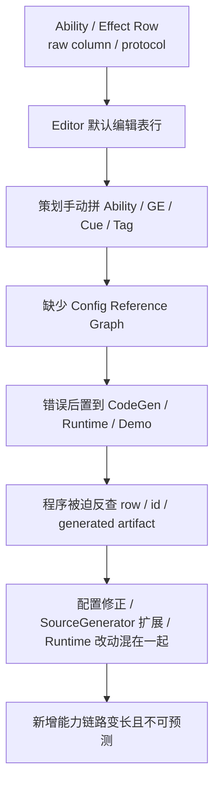

# ISSUE-013 新增能力业务推进链路过长

> 最近复核：2026-06-07 | 状态：Active | 严重度：P1 | 视角：策划 / 程序协作流程

## 当前结论

当前新增一个 GAS 能力没有被设计成清晰的业务工作流，而是散落在 Ability row、Effect row、Tag / Cue / ASC / Unit 绑定、手动导出、CodeGen validation、Runtime 验证和程序排错之间。策划想新增“盾击 / 毒刃 / 冰霜新星 / 圣光治疗”这类业务能力时，默认路径仍要求先理解表行、裸 ID、协议字符串、offset raw columns 和生成步骤。

这不是单纯的操作步骤多，而是配置链接口深度不足：业务意图没有被一个深的 Business Package 接口吸收，复杂实现泄露到策划和程序协作面。结果是程序经常被迫介入纯配置变化，策划也无法判断某次新增能力到底是“只配表即可”，还是“需要新增 generated evaluator”，还是“必须改 Runtime Core 语义”。

该问题是 ISSUE-012 的流程化延伸。ISSUE-012 说明默认编辑对象错误；本 issue 进一步指出：当前没有“新增能力”的 owner、分类门禁和最短业务路径。

## 问题来源

当前长链路不是偶然形成的，它来自几个架构选择叠加后的结果：

| 问题来源 | 当前表现 | 为什么会放大新增能力成本 |
|---|---|---|
| 存储 schema 反向驱动业务流程 | Editor 默认围绕 Ability / Effect 表行和 raw columns 运转 | 策划被迫按存储结构思考能力，而不是按“一个业务能力包”思考 |
| Luban / SourceGenerator 只反哺 Runtime | generated catalog、record、pure glue 已进入 Runtime 消费链，但 Editor / CI 默认没有消费同源 metadata | 生成链的知识没有回到模板字段、引用选择、诊断码和发布门禁 |
| 缺少新增能力分类门禁 | 配置变化、generated glue 缺口、Runtime 语义缺口都走同一条人工链路 | 程序无法判断该不该介入；策划无法判断自己能否独立完成 |
| 配置引用图缺位 | Ability、GE、Cue、Tag、Unit、Scenario 之间没有默认 Config Reference Graph | 漏配、孤儿引用、公共 GE 影响面只能在运行或人工 review 中发现 |
| 验证链后置 | CodeGen report、Runtime log、headless runner 是分离证据 | 错误不能在保存前聚合回 Business Package 字段 |
| 旧 GAS / OOP 心智残留 | 新能力容易被理解成“要写一个 ability class / effect lifecycle” | 配置型能力也会被拖入程序实现讨论 |
| DOTS Runtime 不透明 | ECS hot path 缺少配置期 Runtime Trace Preview | 策划不能在发布前知道配置会进入哪条 plan / seed / modifier / fact / cue 链 |

根因可以归纳为一句话：**当前新增能力流程的默认接口太浅，调用者知道的技术细节过多；真正应该隐藏复杂度的 Business Template、Generated Editor Binding、Config Reference Graph、Runtime Trace Preview 和 Impact-Scoped Validation 没有成为默认 owner。**

## 根因链条

这个链条解释了为什么只做“更好看的 Ability / Effect 页面”无法根治问题。只要默认接口仍是表行，新增能力就会继续把 storage、generation、runtime validation 和业务 intent 混在一起。

## 当前新增能力的真实行动链

以 AutoChess 或同类战斗业务新增一个能力为例，当前实际动作通常会膨胀成下表：

| 动作 | 主要执行者 | 当前必要性 | 问题 |
|---|---|---|---|
| 明确业务意图：伤害、目标、持续、表现、校验场景 | 策划 | 必要 | 当前没有结构化落点，只能写在需求或备注里 |
| 手动分配 Ability / GE / Cue / Tag ID | 策划 / 程序 | 不应手动 | ID 是稳定技术键，应由命名空间和 allocator 生成 |
| 新建 Ability row 并填写 Cost / CdEffect / Tag / AbilityExecution | 策划 | 当前被迫必要 | 保存接口是 row，不是业务包 |
| 新建伤害 GE、冷却 GE、状态 GE、周期子 GE | 策划 | 当前被迫必要 | 模板应投影这些 rows，策划不应逐表拼装 |
| 编写 `Modifiers`、`GrantedAbility`、TagRequirement、Duration / Period / Stacking 协议字段 | 策划 / 程序 | 不应作为默认路径 | raw protocol 泄露实现细节，且错误延后暴露 |
| 绑定 Cue / 表现 / 无头日志 marker | 策划 | 必要但应结构化 | Cue 是业务体验一部分，但只能进入 Boundary binding plan |
| 绑定 Unit / Scenario / Scale profile / validation expectation | 策划 / QA | 必要 | 当前不是能力发布默认动作，导致验收靠人工补 |
| 打开 Excel / JSON / 导出并触发 CodeGen | 策划 / 程序 | 不应割裂 | 生成链应由 Business Package publish 或 CI 驱动 |
| 阅读 CodeGen report / Runtime log 并定位 row 或 generated 错误 | 程序 | 当前经常发生 | 错误没有聚合回业务包和配置图 |
| 跑 demo / headless runner 并人工比对日志 | 程序 / QA | 必要但应 impact-scoped | 当前缺少按影响面选择最小场景的机制 |

链路过长的核心不是“步骤数量”，而是必要动作和可生成动作混在一起。策划必须做业务判断，但不应该维护 generated glue 的输入协议；程序必须维护 Runtime / SourceGenerator 能力，但不应该为每次数值、引用、冷却或 Cue 调整排错。

## 策划视角缺陷

| 缺陷 | 当前表现 | 业务后果 |
|---|---|---|
| 无法从业务意图开始 | 默认入口是 Ability / Effect row | 新增能力不是“选模板填参数”，而是“找表、填 ID、拼协议” |
| 无法判断最短路径 | 工具不告诉策划该能力属于配置型、胶水扩展型还是 Runtime 语义型 | 每个新能力都像可能需要程序支持 |
| 无法确认是否漏配 | 保存 row 不能证明 Damage GE、Cooldown GE、Cue、Requirement、Scenario 都齐 | 漏建引用和错误协议推迟到运行期 |
| 无法做发布前回归判断 | 修改一个 GE 不知道影响哪些 Ability / Unit / Scenario | 平衡调整只能依赖经验和全量回归 |
| 无法形成评审单元 | Excel diff 不能解释业务变化 | 配置协作时只能看列变化，不能看业务影响 |

从真实内容生产角度看，策划新增配置型能力的目标路径应是“选择模板 -> 填业务参数 -> 绑定验收样例 -> 看预览 -> 发布”。当前路径把这个接口拆成多张表和多个生成动作，属于浅接口：调用者知道的细节接近实现本身。

## 程序视角缺陷

| 缺陷 | 当前表现 | 技术后果 |
|---|---|---|
| 没有程序介入门槛 | 纯配置变更、generated evaluator 缺失、Runtime lane 缺失混在一起 | 程序无法快速判断该写配置 metadata、SourceGenerator glue，还是 Runtime Core |
| SourceGenerator 价值未反哺流程 | generated catalog 已进入 Runtime，但 Editor 默认仍复制协议和字段推断 | 生成链只在产物层发挥作用，没有变成工作流接口 |
| Runtime 语义扩展缺少预审 | 新 target / evaluator / state / carrier 可能直接被写进 demo 或 runtime helper | 容易绕过 `SYS-01`、`SC-01`、`BUR-01` 等 DOTS 约束 |
| 错误报告不按业务包归因 | CodeGen report 是技术报告，Runtime log 是运行报告 | 程序排查时要反向追 row / id / generated artifact |
| 缺少 impact-scoped validation | 每次新增能力容易退化为全量 runner 或人工测试 | 验证成本上升，导致真实项目中门禁被跳过 |

程序真正需要维护的是可复用能力边界：Business Template Catalog、Generated Editor Binding、generated evaluator / requirement / target rule、Runtime lane / store / structural policy。当前设计没有把这些边界做成新增能力流程的一等判定，所以程序接口也偏浅。

## 必要链路与可精简链路

| 链路 | 是否必须保留 | 目标判定 |
|---|---|---|
| 业务意图明确化 | 必须 | 没有 intent，无法生成正确 row projection 和验收样例 |
| 稳定 ID 分配 | 必须但自动化 | 策划不手填；由 namespace allocator / generated catalog 维护 |
| Ability / GE / Cue / Tag row projection | 必须 | 但应由 Business Template / Business Package 投影，不由策划逐表手建 |
| 引用图校验 | 必须 | Config Reference Graph 是保存前发现漏配的核心 |
| SourceGenerator validation | 必须 | 但错误必须回到业务包、模板字段和 generated artifact，不只输出技术报告 |
| Runtime Trace Preview | 必须 | 保存前证明配置会进入 plan / seed / modifier / fact / cue 链 |
| Scenario Validation Binding | 必须 | 发布必须绑定最小业务场景和规模验收 |
| 手写 raw protocol | 不应保留默认路径 | 只允许 Raw Table Advanced Mode |
| 手动导出 JSON / CodeGen | 不应割裂 | 应由保存、发布或 CI 触发，并输出 snapshot |
| 每次全量验证 | 不应默认 | Impact Analysis 决定最小 validation set |
| 程序参与数值 / 引用 / Cue 调整 | 不应发生 | 配置型能力必须做到程序 0 代码 |

## 官方规则对照

| 规则 | 对本 issue 的约束 |
|---|---|
| `BAKE-01`~`BAKE-03` / `CASE-39`~`CASE-41` | Editor draft / authoring 输入必须和 Runtime source 分离；新增能力的草稿不能绕过 Luban row projection |
| `BLOB-01` / `BLOB-02` / `CASE-07` / `CASE-24` | 发布后的静态定义必须进入 immutable Blob / catalog；新增能力流程必须能预览 catalog / range / index 消费链 |
| `BUR-01` / `CASE-11` | 新公式、requirement、magnitude evaluator 的目标扩展方式应优先是 generated static glue，而不是托管 delegate 或反射 |
| `SYS-01` / `SYS-03` / `SC-01` / `ECB-03` | 真正需要 Runtime 语义扩展时，必须先审查 SystemGroup、结构变化、ECB phase 和 system 数量，不能从配置需求直接生成 lifecycle system |
| `SEL-01` / `STORE-03` | 新能力涉及的数据必须先分类为 Definition 输入、Runtime record、Boundary 投影或 diagnostics；Business Package 不能进入 hot path |
| `DBG-01`~`DBG-05` / `SYS-05` | Runtime Trace Preview、Impact Analysis 和 Publish Validation Snapshot 是诊断证据，不能反向驱动 gameplay |
| `ODF-01`~`ODF-18` | 新增能力流程必须记录采用 / 拒绝的 DOTS 官方规则和覆盖主题，否则无法形成可复审的架构链路 |

## 为什么按 P1 处理

该问题不直接发生在 Runtime Core hot path，因此不是 P0。但它会持续制造 P1 风险：

1. 纯配置能力也需要程序参与，内容生产效率被架构接口拖慢。
2. 程序无法区分配置变化、generated glue 扩展和 Runtime 语义扩展，容易把问题修在错误层。
3. 新能力的最短路径没有被工具固化，导致真实项目中会回到 Excel row / raw protocol / 手动验证。
4. 业务验收与 DOTS 性能约束脱节，Runtime 重构缺少内容侧 evidence。
5. Luban / SourceGenerator 的性能和胶水优势没有转化为策划可用的发布能力。

## 退出条件

1. 新增能力必须先进入三档分类：配置型能力、胶水扩展型能力、Runtime 语义型能力。
2. 配置型能力新增必须做到程序 0 代码，只允许产生 Business Package Change Set、row projection、validation snapshot 和 scenario evidence。
3. 胶水扩展型能力只能修改 schema metadata、SourceGenerator pure glue、Generated Editor Binding 或 validation rules，不得生成 Runtime lifecycle / hidden query / hidden ECB。
4. Runtime 语义型能力必须先通过 DOTS Official Review Gate，明确 lane、store、carrier、SystemGroup phase、query contract、allocator owner、structural policy 和 evidence model。
5. 策划默认路径必须能说明哪些动作必要、哪些动作自动生成、哪些动作触发程序介入。
6. 新增 Ability / GE / Cue / Tag / Attribute 前后必须输出 Impact Analysis，并选择最小 scenario validation set。
7. 发布必须形成 Business Package Change Set 和 Publish Validation Snapshot，且 snapshot 可被 CI / headless runner 消费。
8. 详细目标态流程见 `../01-目标态架构共识/22-新增能力业务推进流程Spec.md`。
