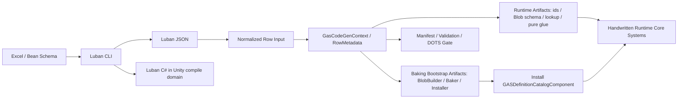

# Luban / SourceGenerator 链路复审与目标重划

## 结论

本轮复审结论是：当前链路已经走到了正确方向，但 SourceGenerator 的权限边界过大。

正确方向包括：Luban 输出保留在 Unity 编译域内，GAS generated Runtime 不直接引用 `cfg.*` / `SimpleJSON` / JSON reader，`GASDefinitionCatalogBlob`、sorted code lookup、`ref readonly` definition 访问已经出现。这说明链路不再只是 Excel 到 C# 的搬运。

必须修正的是：生成器不应继续生成 Runtime Core lifecycle system、system registration、隐藏结构变化或大量 runtime lookup 驱动逻辑。SourceGenerator 应服务 Runtime Core，而不是替 Runtime Core 拥有执行管线。

目标态一句话：

```text
Luban 提供配置事实；SourceGenerator 生成 definition / blob / lookup / pure glue；Baking 或 Bootstrap 安装 catalog；手写 Runtime Core System 拥有生命周期、查询、NativeContainer、ECB 和调度。
```

## 官方依据与论证标准

本重划不是“少生成代码更干净”的审美判断，而是由 Unity Entities 的运行时机制反推出来的边界调整。后续修改本链路时，必须先回答三件事：

1. 该 artifact 属于配置事实、Baking / Bootstrap，还是每帧 Runtime lifecycle。
2. 它是否拥有 query、dependency、NativeContainer、ECB 或结构变化。
3. 它是否会进入 Runtime Core hot path，是否能被 Debugger / Profiler / Journaling 归因。

官方依据矩阵：

| 设计选择 | 官方 / 本地规则依据 | 为什么更优秀 | 为什么必须做 |
|---|---|---|---|
| Runtime Core lifecycle 回到手写 `ISystem` | `SYS-01`、`SYS-02`、`SYS-03`、`PRF-07`；`01-Entities系统与World.md` 明确 SystemGroup 是 phase owner，system 数量和 lookup 刷新有固定成本 | lifecycle owner、query owner、dependency owner 都在业务 lane system 上，可被 Debugger 按 phase / lane 归因 | generated system 会把执行管线藏进模板，系统数量、UpdateOrder、lookup pressure 和 sync point 难以审计 |
| SourceGenerator 只生成 pure glue / unmanaged record | `QRY-01`、`QRY-04`、`PRF-05`、`PRF-06`、`PRF-19`；`02-查询遍历与Job.md` 要求 hot path 默认 job 化，random lookup 要有 owner-local / chunk-local 论证 | generated code 成为确定的纯解析函数，Runtime System 可按数据局部性选择 `IJobChunk`、`NativeStream`、owner buffer | 如果 generated glue 自己拿 `ComponentLookup` / `BufferLookup`，模板就绕过了 API 选型表，proof-only random lookup 会被固化 |
| 结构变化只属于 Runtime Core structural phase，不属于 generated glue | `SC-01`、`ECB-03`、`PRF-02`、`PRF-04`；`03-结构变化-ECB-Enableable.md` 要求结构变化集中到明确 playback phase | 所有 create / destroy / add / remove 都能由 Journaling / Profiler 对照 phase 归因，sync point 可控 | generated lifecycle system 若创建 ECB 或直接 `EntityManager` 写入，会制造隐藏结构变化 owner，破坏唯一 StructuralCommit gate |
| Catalog 构建放 Baking / Bootstrap，Runtime hot path 只读 Blob | `BLOB-01`、`BLOB-02`、`BAKE-01`~`BAKE-03`、`CASE-07`、`CASE-24`；`08` 已要求 definition 进入 Blob / Baker / catalog | 静态 definition 变成 immutable `GASDefinitionCatalogBlob`，Runtime 只拿 index / `ref readonly`，Burst 可读且不反查托管表 | `BlobBuilder`、row adapter、dispose owner 如果留在 runtime-visible hot path，会让配置构建、生命周期释放和 gameplay tick 混在一起 |
| 并行 fan-in 由 Runtime System 选择 `NativeStream` / owner-local range，不由 generated template 决定 | `BUF-02`、`NAT-03`、`20-GASRuntimeCore-API选型基线.md` 的 Ability command ingest / Effect fan-in / TypedFacts 选型 | 能根据 x50/x1000 证据调整承载：singleton proof、owner buffer、NativeStream merge、target grouped reduce 都有明确触发条件 | SourceGenerator 直接生成某种 fan-in store 会绕过 scale profile，尤其会把 singleton DynamicBuffer 或 random lookup 误升格为目标态 |
| generated validation gate 检查“职责越界”，不只检查 forbidden dependency | `ODF-06`、`ODF-18`、`20-GASRuntimeCore-API选型基线.md` 要求每个 Runtime Core 任务交还 API 选型表 | 报告能说明为什么这个 artifact 可进入 Runtime，而不是只证明它没有 `cfg.*` 字符串 | 当前 `RuntimeForbiddenDependencyHits = 0` 仍可能伴随 generated `ISystem` / `EntityManager` / system registration，这是自检盲区 |

因此，新架构更优秀的核心不是“生成少了”，而是：

1. **事实源更稳定**：Luban row 只在配置边界，Runtime 只看 Blob / index / record。
2. **性能证据更可归因**：query、lookup、NativeContainer、ECB、system count 都由手写 Runtime System 负责，Debugger 可以按 owner 统计。
3. **API 选型更可迭代**：当 x1000 或 command count > 1000/frame 触发重选型时，改的是 Runtime lane 的 store / merge 策略，不是大模板全链重生成。
4. **职责边界更硬**：SourceGenerator 不再通过 generated lifecycle 悄悄拥有 gameplay 时序。

## 审查范围

本复审只覆盖 Runtime 相关配置链路：

```text
Excel / Luban
  -> Luban JSON / C#
  -> LubanNormalizedRows / RowMetadata
  -> GasCodeGenPipeline phases
  -> generated Runtime / Baking / Editor artifacts
  -> Runtime Core consumption
```

不讨论 Editor UI 操作体验，不讨论 GAS Center 页面逻辑。`Assets/GAS/Editor/CodeGen/**` 属于生成链路实现，纳入审查。

## 当前链路事实

### 1. Luban process gate 已经接入主入口

`CodeGenerator.TryGenerateAllCode()` 当前先执行 `GasCodeGenProcessGate.RunDefault()`，再执行 `GasCodeGenPipeline.TryRunAll()`。

证据：

- `Assets/GAS/Editor/CodeGen/CodeGenerator.cs`
- `Assets/GAS/Editor/CodeGen/Core/GasCodeGenProcessGate.cs`

这条链路的价值是：Bean / Luban 任一失败会阻断 Core artifact 导出，避免旧生成物继续污染 Runtime。

### 2. Luban 输出边界方向正确

当前默认输出：

```text
Assets/DataGenerated/Luban/CSharp
Assets/DataGenerated/Luban/Json/GAS
```

这符合 `08-Luban-SourceGenerator配置生成链路Spec.md` 的约束：Luban C# 是 Unity 编译域内的配置事实边界，编译错误是真实 gate failure，不应通过挪出 `Assets` 隐藏。

### 3. Normalized Rows 是 Editor-only 输入转换层

`LubanNormalizedRowBootstrap` 从 Luban JSON 读取 `ability`、`gameplayEffect`、`attributeSet`、`gameplayTags` 等表，生成 `Assets/GAS/Generated/CodeGen/Editor/LubanNormalizedRows.gen.cs`。

这比 Runtime 直接读取 `cfg.*` 或 JSON 更合理。它把 Luban 表事实折叠成后续 `RowMetadata` 可扫描的 row literal factory，同时保持 Editor-only。

### 4. Catalog / Blob 方向已经出现

`Assets/GAS/Generated/CodeGen/Runtime/DefinitionCatalog.gen.cs` 已经生成：

- `GASDefinitionCatalogBlob`
- sorted `AbilityCodes` / `GameplayEffectCodes`
- `TryGetAbilityIndex()`
- `TryGetGameplayEffectIndex()`
- `GetAbility()` / `GetGameplayEffect()` 的 `ref readonly` 访问

这是目标态的核心收益：Runtime Core 不再把 Luban row 当表 API，而是读取 immutable catalog。

### 5. Validation report 只能证明局部边界

`GasCodeGenValidationReport.md` 当前显示：

```text
RuntimeForbiddenDependencyHits: 0
RuntimeGeneratedNamingDebtHits: 0
GeneratedNamingDebtHits: 0
```

这只能证明 generated Runtime 没有显式引用 `cfg.*` / JSON / managed row 等禁止依赖；不能证明 SourceGenerator 没有越权生成 Runtime lifecycle。

## 主要架构问题

### P0：Core pipeline 仍混入 Demo phase

`GasCodeGenPipeline.s_corePhases` 当前仍包含：

```csharp
new AutoChessDemoConfigPhase(),
```

这和 `14-CodeGen到Runtime新链路重构计划.md` 中“AutoChess 专用 phase 从 Core 收口范围移除”的结论不一致。

问题不是 AutoChessDemo 本身不重要，而是默认 Core CodeGen 不应该被 Demo 配置污染。通用 GAS Core 的 input hash、manifest、validation report 应只反映 GAS definition 主链。Demo phase 应有独立入口，例如：

```text
GasCodeGenPipeline.RunCore()
GasCodeGenPipeline.RunAutoChessDemo()
```

官方论证：`ODF-06` 要求每个 Runtime Core 任务进入 API selection checkpoint；Demo phase 混进 Core pipeline 后，Core input hash、manifest 和 validation report 同时承载框架 definition 与 Demo scenario，后续无法判断报告中的 query / buffer / lifecycle 债务属于通用 GAS 还是 AutoChess 业务。拆分入口能让 Core generated artifact 的层级、依赖和 API 选型独立审计。

### P0：RuntimeDefinitionGluePhase 生成了 lifecycle system

`RuntimeDefinitionGluePhase` 当前输出：

```text
Runtime/RuntimeDefinitionGlue.gen.cs
Runtime/RuntimeAbilityActivation.gen.cs
Runtime/RuntimeEffectInstant.gen.cs
Runtime/RuntimeActiveEffect.gen.cs
Runtime/RuntimeSystemRegistration.gen.cs
```

其中后四类不再是 definition glue，而是 Runtime Core 执行管线。它们包含 `ISystem`、`OnUpdate()`、`state.EntityManager`、`ComponentLookup`、`BufferLookup`、`Schedule()`、system registration。

这违反 `08-Luban-SourceGenerator配置生成链路Spec.md` 的硬约束：

1. Glue 只生成静态纯函数和 unmanaged record。
2. Glue 不隐藏结构变化。
3. Glue 不调用 `EntityManager`。
4. Glue 不创建或注册 lifecycle system。
5. Glue 不拥有 `NativeContainer`、依赖链、dispose/rewind。

目标态必须把这些 generated lifecycle system 收回到手写 Runtime Core。

官方论证：

1. `01-Entities系统与World.md` 把 `ISystem` 定义为 Runtime Core 热路径首选，并要求 system 在 `OnCreate` / `OnUpdate` 中拥有 query、lookup、allocator 和 dependency。generated glue 如果输出 `ISystem`，就不再是 glue，而是 lifecycle owner。
2. `02-查询遍历与Job.md` 说明 `SystemState.Dependency` 不会自动追踪 `NativeArray`、`NativeList`、`NativeStream` 这类 NativeContainer 之间的数据流，Fan-In / Target / Modifier record 管线必须由 owner system 明确串联 job handle。SourceGenerator 无法在模板层替每个业务 lane 证明 dependency ownership。
3. `03-结构变化-ECB-Enableable.md` 要求 hot path 结构变化集中到明确 ECB playback phase。generated lifecycle system 如果创建 ECB、调度 playback 或直接写 `EntityManager`，会绕过 `GASStructuralCommitSystemGroup` 的唯一结构变化屏障。
4. `13-DOTS编写规范与性能陷阱.md` 把 `EntityManager.CreateEntity/AddComponent/DestroyEntity`、主线程 `SystemAPI.Query`、高频 random lookup 都列为 hot path 风险。generated lifecycle 模板一旦包含这些 API，风险会被复制到所有 domain。

### P0：Validation gate 没有阻断生成 lifecycle

当前 hot path gate 会扫描一些字符串，例如 `SystemAPI.QueryBuilder()`、`CreateEntityQuery`、`.Run(`、`state.Dependency.Complete()` 等，但它没有把以下内容作为 SourceGenerator 职责越界处理：

```text
: ISystem
OnUpdate(ref SystemState state)
world.CreateSystem(...)
AddSystemToUpdateList(...)
SystemAPI.GetComponentLookup(...)
SystemAPI.GetBufferLookup(...)
state.EntityManager
```

因此报告可以写 `RuntimeForbiddenDependencyHits = 0`，同时 generated Runtime 仍然生成实际 gameplay lifecycle。这是自检盲区。

官方论证：`20-GASRuntimeCore-API选型基线.md` 明确禁止把 DynamicBuffer / ECB / Enableable 固化为唯一答案，并要求每个 Runtime Core 任务交还 API 选型表。validation gate 如果只查 `cfg.*` / JSON / managed row，就只能证明“没有托管配置泄漏”，不能证明“没有 lifecycle / query / structural owner 越权”。目标态 report 必须同时检查 dependency owner、query owner、NativeContainer owner 和 structural owner。

### P1：Catalog builder 的层级边界偏软

`GASGeneratedDefinitionCatalogBuilder.BuildCatalog()` 当前在 Runtime-visible generated 文件中调用 `BlobBuilder`。

如果它只在 world/bootstrap 初始化期调用，符合 `BLOB-02` 的“初始化期可用”下限；但目标态上更应该把 builder 移到 Baking / Bootstrap artifact：

```text
Runtime visible:
  GASDefinitionCatalogBlob
  GASGeneratedDefinitionCatalogLookup
  GASGeneratedRuntimeDefinitionResolver

Baking / Bootstrap visible:
  GASGeneratedDefinitionCatalogBuilder
  GASDefinitionCatalogInstaller
  Dispose owner contract
```

Runtime Core hot path 只应看到已经安装好的 `BlobAssetReference<GASDefinitionCatalogBlob>`。

官方论证：`CASE-07`、`CASE-24`、`BLOB-01`、`BLOB-02` 把静态 definition 指向 Blob / Baker / AddBlobAsset / custom hash；`BlobBuilder` 应只在 Baking 或初始化期出现。catalog builder 可以是 Bootstrap 工具，但不能作为 Runtime Core 每帧可见能力。更优目标是 Runtime 只读 `GASDefinitionCatalogComponent.Catalog`，并由 validation evidence 输出 schema hash、content hash、revision 和 dispose owner。

### P1：generated runtime hot path 仍有大量 random lookup

`RuntimeAbilityActivation.gen.cs`、`RuntimeEffectInstant.gen.cs`、`RuntimeActiveEffect.gen.cs` 里大量使用：

```text
ComponentLookup<T>
BufferLookup<T>
GetComponentLookup<T>()
GetBufferLookup<T>()
```

对照 `QRY-04`，高频路径中的跨 entity random lookup 需要重构为 owner-local、chunk-local 或 frame-local record merge。当前这些 generated system 即使可以作为 proof，也不能作为 scale-ready 目标态。

官方论证：`QRY-04`、`PRF-06`、`PRF-19` 都把高频 `ComponentLookup` / `BufferLookup` random access 视为需要 owner-local / chunk-local 重构的风险；`20-GASRuntimeCore-API选型基线.md` 对 Ability command ingest、Effect fan-in、Execution calculation 都给出重新选型触发条件。generated runtime system 的 random lookup 如果留在 RuntimeVisible artifact 中，后续 x1000 gate 只能改模板，无法在业务 lane 层按证据替换为 chunk-local summary、target grouped reduce 或 `NativeStream` deterministic merge。

### P1：SourceGenerator 生成内容太厚

当前 SourceGenerator 既生成 Blob / lookup，又生成 runtime command commit、instant spec build、active effect mutation、pre tick、remove system。这会造成三个长期问题：

1. Runtime Core 的职责 owner 变成模板文件，而不是清晰的手写 System。
2. 性能热点难以定位：Debugger 看见的是 generated system，不知道业务 owner 是谁。
3. 每次调整 DOTS API 选型，都要改大模板，变成高风险全链重生成。

这不是“模板大不好维护”的普通工程偏好，而是和 Unity DOTS 的调优方式冲突：DOTS 性能问题通常落在 query filter、chunk layout、lookup 刷新、NativeContainer 生命周期、ECB playback、enableable wait、buffer spill 上。这些都需要由具体 system owner 输出证据。模板越厚，实际 owner 越模糊，Profiler / Journaling / Debugger 越难把热点映射回业务 lane。

## 新架构分层

### Layer 1：Luban Fact Layer

职责：

- Excel / schema / bean / enum 事实输入
- Luban CLI 输出 JSON 与 C#
- 保证配置事实在 Unity 编译域可见

允许：

```text
cfg.*
Luban.Runtime
SimpleJSON
JSON table
managed row
```

禁止：

```text
Unity.Entities Runtime Core lifecycle
GAS Runtime hot path lookup
EntityManager
runtime system registration
```

### Layer 2：Definition CodeGen Layer

职责：

- 读取 Luban JSON / generated row factory
- 生成 `RowMetadata`
- 生成 stable id、definition index、Blob schema、Catalog layout
- 生成 `code -> index` lookup
- 生成 pure Runtime definition glue
- 生成 manifest / validation report

允许输出 Runtime-visible：

```text
GASDefinitionCatalogBlob
GASGeneratedDefinitionCatalogLookup
GASGeneratedRuntimeDefinitionResolver
GASGeneratedRequirementEvaluator
GASGeneratedMagnitudeEvaluator
GASGeneratedTargetRuleTable
GASGeneratedDefinitionComponentTypeSets
```

禁止输出 Runtime-visible：

```text
ISystem
ComponentSystemGroup
system registration
EntityManager write
ECB playback
NativeContainer owner
Schedule / Run
runtime query owner
```

### Layer 3：Baking / Bootstrap Layer

职责：

- 使用 `BlobBuilder` 构建 catalog
- 安装 `GASDefinitionCatalogComponent`
- 持有 `BlobAssetReference` dispose owner
- 可生成 Baker glue、Authoring glue、catalog installer

允许：

```text
BlobBuilder
AddBlobAsset()
Baker<TAuthoring>
Bootstrap installer
initialization-time BuildCatalog()
Dispose owner
```

禁止：

```text
每帧 BuildCatalog()
Runtime Core hot path 反查 row
Baker 读取其他 Baker 输出
把 diagnostics 当 gameplay 输入
```

### Layer 4：Runtime Core Layer

职责：

- 手写 `ISystem`
- 拥有 `EntityQuery`
- 拥有 `NativeStream` / `NativeList` / `DynamicBuffer` 使用策略
- 拥有 ECB playback phase
- 拥有 dependency / dispose / rewind
- 调用 generated pure glue 生成 frame-local record

允许调用：

```text
GASGeneratedDefinitionCatalogLookup.TryGetAbilityIndex()
GASGeneratedDefinitionCatalogLookup.GetAbility()
GASGeneratedRuntimeDefinitionResolver.TryBuildAbilityActivationPlan()
GASGeneratedRuntimeDefinitionResolver.TryBuildGECommandSeed()
GASGeneratedRuntimeDefinitionResolver.AppendModifierRecords()
```

禁止：

```text
cfg.*
Luban row
JSON reader
managed registry hot path
SourceGenerator generated lifecycle owner
```

## 目标数据流



## 真实业务流：AutoChess Ability 激活

目标态业务链路应如下：

```text
AutoChess room config
  -> Luban ability / GE / tag / cue rows
  -> SourceGenerator builds GASDefinitionCatalogBlob layout
  -> Bootstrap installs DefinitionCatalogSingleton
  -> AutoChess OOP shell sends boundary command
  -> handwritten AbilityCommandIngestSystem consumes command
  -> generated resolver builds AbilityActivationPlanRecord
  -> handwritten EffectFanInSystem writes GECommandSeedRecord / GEEffectCommandRecord
  -> handwritten GE / Attribute systems apply result
  -> Boundary projection emits logs / replay / debugger records
```

这里 SourceGenerator 不生成 AutoChess 战斗循环，不生成 Runtime lifecycle，不生成 presentation。它只把配置事实压缩成 Runtime Core 可读的不可变数据和纯解析函数。

## 目标代码形态

### Generated Runtime：只生成纯函数

```csharp
namespace GAS.Runtime.Generated
{
    public static class GASGeneratedRuntimeDefinitionResolver
    {
        public static bool TryBuildAbilityActivationPlan(
            ref GASDefinitionCatalogBlob catalog,
            int abilityCode,
            in AbilityActivationInputRecord input,
            out AbilityActivationPlanRecord plan)
        {
            plan = default;
            if (!GASGeneratedDefinitionCatalogLookup.TryGetAbilityIndex(
                    ref catalog,
                    abilityCode,
                    out var abilityIndex))
            {
                plan.FailureReasonCode = GASFailureReasonCodes.AbilityNotFound;
                return false;
            }

            ref readonly var ability =
                ref GASGeneratedDefinitionCatalogLookup.GetAbility(ref catalog, abilityIndex);

            plan = AbilityActivationPlanRecord.FromDefinition(in input, abilityIndex, in ability);
            return true;
        }
    }
}
```

### Handwritten Runtime Core：拥有 lifecycle

```csharp
[BurstCompile]
public partial struct AbilityCommandIngestSystem : ISystem
{
    private EntityQuery _query;

    public void OnCreate(ref SystemState state)
    {
        _query = state.GetEntityQuery(AbilityCommandIngestQuery.Desc);
        state.RequireForUpdate<GASDefinitionCatalogComponent>();
    }

    public void OnUpdate(ref SystemState state)
    {
        var catalogRef = SystemAPI.GetSingleton<GASDefinitionCatalogComponent>().Catalog;
        if (!catalogRef.IsCreated)
            return;

        var job = new AbilityCommandIngestJob
        {
            Catalog = catalogRef,
            // Runtime Core owns buffers, stream writers, ECB and dependencies.
        };

        state.Dependency = job.Schedule(_query, state.Dependency);
    }
}
```

### Bootstrap：拥有 catalog 构建与释放

```csharp
public sealed class GASDefinitionCatalogBootstrapOwner : IDisposable
{
    private BlobAssetReference<GASDefinitionCatalogBlob> _catalog;

    public Entity Install(EntityManager entityManager)
    {
        _catalog = GASGeneratedDefinitionCatalogBuilder.BuildCatalog(Allocator.Persistent);
        var entity = entityManager.CreateEntity(ComponentType.ReadWrite<GASDefinitionCatalogComponent>());
        entityManager.SetComponentData(entity, new GASDefinitionCatalogComponent
        {
            Catalog = _catalog,
            Revision = 1,
        });

        return entity;
    }

    public void Dispose()
    {
        if (_catalog.IsCreated)
            _catalog.Dispose();
    }
}
```

后续更优目标是把 `GASGeneratedDefinitionCatalogBuilder` 移入 Baking / Bootstrap asmdef，Runtime asmdef 只保留 catalog type、lookup 和 pure glue。

## DOTS 规则对照

| 规则 | 目标态判定 | 当前链路状态 | 必须修正 |
|---|---|---|---|
| `BLOB-01` | 静态定义进入 immutable Blob，Runtime 只读 | 方向正确，Catalog 已出现 | 补 content hash / schema hash / dispose owner 审计 |
| `BLOB-02` | `BlobBuilder` 只在 Baking 或初始化期 | 部分满足 | builder 不应作为 hot path 可见能力；移到 Baking / Bootstrap |
| `BAKE-01` / `BAKE-02` | Baker 只添加、不读其他 Baker 输出、无状态 | Baker glue 方向可接受 | 继续阻断 Baker 读 Runtime state |
| `BUR-01` | hot path job Burst 且无托管依赖 | pure glue 可满足；generated lifecycle 不应存在 | 手写 Runtime Core jobs 负责 Burst 证据 |
| `BUR-02` | FunctionPointer 只用于批处理粒度 | 当前 magnitude evaluator 是 static switch | 后续 MMC 大批量再引入 batch FunctionPointer |
| `QRY-01` | hot path 优先 job 化 | 当前 generated system 有 job，但职责 owner 错 | Runtime Core 手写 system 拥有 query |
| `QRY-04` | 高频 random lookup 改 owner-local / chunk-local | 当前 generated runtime 大量 ComponentLookup / BufferLookup | 不允许 SourceGenerator 生成 random lookup hot path |
| `BUF-02` | 单一全局 buffer 仅 proof / 低量 | 当前部分 stream / bus 仍 proof-only | Runtime Core 重新选型 NativeStream / owner-local range |
| `NAT-03` | NativeStream fan-in 定义 merge 顺序和预算 | generated glue 不应拥有 NativeContainer | 手写 EffectFanInSystem 负责预算和确定性 merge |
| `SC-01` / `ECB-03` | hot path 不直接结构变化；ECB playback 属于明确 phase | generated system 当前接触 ECB / EntityManager | SourceGenerator 不生成结构变化 owner |
| `SYS-03` | 系统数量是成本源 | generated registration 一次加多个 system | Runtime Core 根据 lane 设计决定 system 数量 |

## 新 validation gate

当前 report 应增加硬规则。Runtime-visible generated 文件若命中以下内容，默认失败：

```text
: ISystem
OnCreate(ref SystemState
OnUpdate(ref SystemState
World world
CreateSystem(
AddSystemToUpdateList(
state.EntityManager
SystemAPI.GetComponentLookup
SystemAPI.GetBufferLookup
EntityCommandBuffer
.Schedule(
.Run(
NativeList<
NativeStream
```

例外只能是：

1. 文件被 manifest 标注为 `MigrationProofOnly`。
2. 文件不在 `RuntimeVisible = true` 层。
3. Spec 明确允许该 artifact 暂时存在，并且任务树中有移除计划。

报告里应新增：

```text
GeneratedRuntimeLifecycleHits
GeneratedRuntimeOwnershipHits
GeneratedRuntimeRandomLookupHits
GeneratedRuntimeNativeContainerOwnerHits
GeneratedRuntimeStructuralChangeHits
```

这些指标比单纯 `RuntimeForbiddenDependencyHits` 更能证明 SourceGenerator 是否守住职责边界。

## 允许保留的 generated Runtime artifact

| Artifact | 是否允许 | 原因 |
|---|---:|---|
| `DefinitionIndex.gen.cs` | 是 | stable metadata / row-free |
| `BlobSchemas.gen.cs` | 是 | Runtime 可见 definition struct |
| `DefinitionCatalog.gen.cs` 的 lookup 部分 | 是 | code -> index / ref readonly 访问 |
| `RuntimeDefinitionGlue.gen.cs` | 是 | pure definition -> record 解析 |
| `ComponentTypeSets.gen.cs` | 有条件 | 只输出 `ComponentTypeSet` 常量，不隐藏结构变化 |
| `StaticLookups.gen.cs` | 迁移期 | 有 NativeArray owner，目标态优先 Catalog Blob |
| `RuntimeAbilityActivation.gen.cs` | 否 | lifecycle system |
| `RuntimeEffectInstant.gen.cs` | 否 | lifecycle system |
| `RuntimeActiveEffect.gen.cs` | 否 | lifecycle system |
| `RuntimeSystemRegistration.gen.cs` | 否 | system ownership / registration |

## 重构路线

### P0：SourceGenerator 收权

1. `GasCodeGenPipeline.RunCore()` 默认不包含 `AutoChessDemoConfigPhase`。
2. `RuntimeDefinitionGluePhase` 只输出 pure glue 文件。
3. 删除或迁移 `RuntimeAbilityActivation.gen.cs`、`RuntimeEffectInstant.gen.cs`、`RuntimeActiveEffect.gen.cs`、`RuntimeSystemRegistration.gen.cs`。
4. Validation report 增加 lifecycle / ownership hard gate。

### P1：Catalog bootstrap 收口

1. 将 `GASGeneratedDefinitionCatalogBuilder` 移到 Baking / Bootstrap 层。
2. 明确 catalog singleton 安装 owner。
3. 明确 runtime-created Blob 的 dispose owner。
4. 补 schema hash / content hash / row count / source hash 进入 catalog。

### P1：Runtime Core 手写消费链

1. 手写 `AbilityCommandIngestSystem` 消费 catalog + generated resolver。
2. 手写 `GASEffectFanInSystem` 消费 `GECommandSeedRecord`。
3. 手写 `GEEffectSpecBuildSystem` / `GASAttributeSetReduceApplySystem` 只调用 generated magnitude / modifier glue。
4. Runtime Core system 负责 query、NativeContainer、ECB、dependency、debugger markers。

### P2：Scale-ready 数据形态

1. 将 proof-only singleton buffer 迁为 owner-local range 或 `NativeStream` deterministic fan-in。
2. 将高频 `ComponentLookup` / `BufferLookup` random access 改成 chunk-local / owner-local。
3. 对 MMC / ExecutionCalculation 做 batch static switch 或 FunctionPointer batch 选型。
4. Debugger report 输出 generated glue 调用次数、catalog lookup 次数、random lookup 次数和 buffer spill。

## 最终不变量

1. GAS Runtime Core 不引用 `cfg.*`、`XLuban`、`SimpleJSON`、JSON reader 或 managed row。
2. SourceGenerator 不生成 `ISystem`、system registration、ECB playback、EntityManager write。
3. SourceGenerator 不拥有 NativeContainer 生命周期。
4. Runtime Core system 是 gameplay lifecycle owner。
5. Generated Runtime glue 只把 immutable definition 转换为 frame-local record。
6. Catalog 只读，world/bootstrap 完成后不可写。
7. `BlobBuilder` 只在 Baking / Bootstrap / initialization 出现，不在 hot path 出现。
8. Demo phase 不进入 Core pipeline 默认路径。
9. Validation report 必须检查职责边界，而不只是检查 forbidden dependency。
10. 每条 Ability / GE 业务链路必须能证明：

```text
AbilityCode
  -> AbilityDefinitionIndex
  -> ref readonly AbilityDefinitionBlob
  -> GECommandSeedRecord
  -> ResolvedModifierRecord
```

全程不反查 managed row、JSON、Dictionary 或 per-definition entity。
