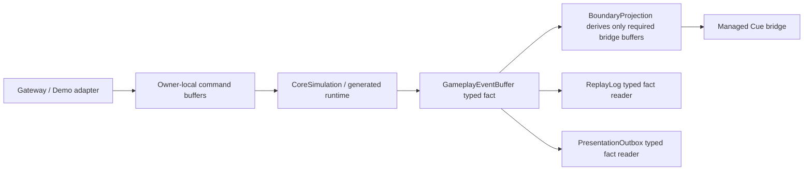

# GAS 架构瘦身执行记录与下一轮计划

> 设计日期：2026-06-06 | 最近执行：2026-06-06 | 范围：`Assets/GAS/Runtime`、`Assets/GAS/Editor/CodeGen/Phases`、`Assets/GAS/Generated/CodeGen/Runtime`、`Assets/AutoChessDemo`

本文件记录本轮破坏性瘦身的执行结果，并给出下一轮继续清理方向。不做兼容性重构，不保留旧 API 适配层，不手改 `.gen.cs`。涉及 generated runtime 的修复必须改 codegen 模板、manifest/report gate 和 bat/CLI 生成链路，再重新生成。

## 官方依据

本轮对照本项目当前 Entities 包文档 `Library/PackageCache/com.unity.entities@e90944159b94/Documentation~`：

| 官方文档 | 对本轮计划的约束 |
|---|---|
| `systems-looking-up-data.md` | `ComponentLookup` / `BufferLookup` 是任意实体随机访问工具；大量写入或重叠读写需要 owner iteration、分组 merge 或明确 race/capacity 证据，不能把 random lookup 当 scale-ready store。 |
| `systems-entity-command-buffer-use.md` | job 内结构变化要写 ECB；并行 job 用 `EntityCommandBuffer.ParallelWriter`；结构变化集中 playback 才能减少 sync point。 |
| `performance-sync-points.md` | 直接结构变化、`Run`、同步 foreach 都可能制造 sync point；结构变化应集中到明确 phase，并用证据证明来源和相位。 |
| `components-buffer-jobs.md` | DynamicBuffer 可在 job 中访问，但 singleton DynamicBuffer fan-in 只是迁移 carrier，不等价于高规模数据布局终局。 |
| `iterating-data-ijobchunk.md` / `components-enableable-use.md` | 高频 enableable 与 current-entity marker 写入优先使用 chunk iteration / `EnabledMask`，cross-entity marker 写入必须归并到 owner chunk applicator。 |

## 当前诊断

上一轮清理已经把旧 gameplay EventBus buffer、未注册旧系统、Core 中 Attribute/Cue/Tag 直接边界写入、主线程 `Complete()` 和多条 random enableable marker 链路清掉。本轮又删除了 Damage 边界缓冲、EventBus gameplay enqueue helper，以及 Presentation/Replay 双读逻辑。当前剩余问题更集中：

| 问题 | 当前证据 | 架构影响 |
|---|---|---|
| Boundary 派生缓冲仍挂在 EventBus owner | `GameplayEventBusComponent` 仍承载 Attribute/Cue/Tag 边界缓冲、presentation outbox owner 和 projection state | 这些缓冲必须保持 Boundary/Cue bridge 语义，不能回流为 gameplay truth。 |
| Presentation/Replay 已单一事实源，但 Debugger 仍报告边界压力 | `PresentationOutboxProjectionSystem`、`ReplayLogSystem` 只读 `GameplayEventBuffer`；`GasRuntimeDebugger` 仍统计 Attribute/Cue/Tag bridge pressure | Observation 成本仍需与 CoreSimulation 拆分。 |
| generated active mutation 仍是 singleton serial store | `RuntimeActiveEffect.gen.cs` 注册进主链，`GASActiveEffectMutationApplySystem` 仍以单 stream owner serial `IJob` + `BufferLookup/ComponentLookup` random access 承载 active mutation | 符合 job 化过渡，但不符合高规模 owner-local store 终局。 |
| `GASManager.EntityManager` 仍是全局写入口 | `ASCCommandGateway`、Cue managed boundary、prototype/cache、Debugger/demo bridge 仍依赖 global facade；`AbilityRuntimeActions` / `AttributeHelper` 无参 overload 与 config component 隐式 facade 已删除 | hot path、Boundary、初始化和 demo adapter 的 ownership 仍需继续分类，但 Runtime helper/config component 已不再偷取全局 world。 |

## 目标状态

下一轮结束时，Runtime Core 的事实源和写入口必须收敛为以下结构：

删除原则：

1. Core 和 runtime extension 不再写 `AttributeChangeEventBuffer` / `CueRequestBuffer` / `TagChangeEventBuffer` / `DamageEventBuffer`。
2. `DamageEventBuffer` 已退场；Damage 以 `GameplayEventBuffer` 的 `Domain=Damage` 承载。
3. `EventBusHelper` 不再提供 gameplay fact enqueue API；只保留 context id 分配、presentation outbox append、snapshot/read 这类 Boundary 工具，后续可继续拆分命名。
4. Presentation/Replay 的事实输入只使用 `GameplayEventBuffer`；边界缓冲只服务 managed Cue 或 debugger bridge pressure。
5. generated active mutation 的任何修复都走模板和重新生成，不改 `.gen.cs`。

## 执行批次

### Batch A：Damage 与 helper 旧事实源删除

状态：已完成。

目标：删除 EventBus 里的 Damage 兼容流，让 Damage 与 Attribute/Cue/Tag 一样进入 typed fact。

改动：

1. Damage 统一写 `GameplayEventBuffer { Domain = Damage, Value = amount }`。
2. `DamageEventBuffer` 类型、`EventBusHelper.EnqueueDamageEvent` overload、`GASManager.DamageEventCapacity` 对应 buffer 预分配、`GameplayEventBusClearSystem` 中 Damage clear、`GASRuntimeEntityArchetypes.GameplayEventBus` 中 Damage buffer 已删除。
3. `PresentationOutboxProjectionSystem` / `ReplayLogSystem` 已删除 `ProjectDamageEvents(DamageEventBuffer)`，只保留 typed fact Damage 分支。
4. `GasStructuredLogView` 与 `GasRuntimeDebugger` 已删除 `DamageEventBuffer` 专用读法，改为 typed fact / bridge pressure counters。
5. static validation gate 已禁止 runtime/generated/template 中出现 `DamageEventBuffer`、`EnqueueDamageEvent`。

退出条件：

- `rg "DamageEventBuffer|EnqueueDamageEvent" Assets/GAS/Runtime Assets/GAS/Editor/CodeGen/Phases Assets/GAS/Generated/CodeGen/Runtime` 只允许出现在防回流字符串或完全为 0。
- Presentation/Replay 中 Damage 输出来自 `GameplayEventBuffer` typed fact。

### Batch B：Attribute/Cue/Tag 边界缓冲降级为派生产物

状态：已完成。

目标：BoundaryProjection 成为 Attribute/Cue/Tag 边界缓冲唯一来源。

改动：

1. 已删除 `EventBusHelper.EnqueueAttributeChangeEvent`、`EnqueueCueRequest`、`EnqueueTagChangeEvent` 及 ECB overload。
2. `AttributeHelper.RecalculateCurrentValue` 不再写 `AttributeChangeEventBuffer`；观察事实由 scheduled attribute/fact path 生成。
3. generated active effect 模板中 Tag/Cue/Attribute fact 写入已收敛到 `GameplayEventBuffer` typed fact；同步修改模板后重新生成。
4. `GameplayFactBoundaryProjectionSystem` 保留 Attribute/Cue/Tag 派生逻辑，但明确只在 BoundaryProjection 给 managed Cue / observation bridge 使用。
5. static validation gate 禁止 runtime core/template 直接写 Attribute/Cue/Tag/Damage 边界缓冲。

退出条件：

- CoreSimulation、CommandResolve、generated runtime 中不存在 `AttributeChangeEventLookup`、`CueRequestLookup`、`TagChangeEventLookup` 作为写入依赖。
- helper 不再提供 gameplay observation enqueue API。

### Batch C：Presentation/Replay 事实输入瘦身

状态：已完成。

目标：删除双读和去重复杂度。

改动：

1. `PresentationOutboxProjectionSystem` 只从 typed fact 投影 presentation outbox；Cue managed bridge 如仍需 `CueRequestBuffer`，由 `GameplayFactBoundaryProjectionSystem` 单独派生，不再让 Presentation 重读。
2. `ReplayLogSystem` 只从 typed fact 生成 replay log；已删除 Attribute/Cue/Tag/Damage legacy buffer 投影与 `SourceFactSequence` 去重分支。
3. `GameplayEventLogSinkComponent` / `PresentationOutboxProjectionStateComponent` 已删除 legacy processed count 字段，保留 typed fact cursor。
4. Debugger counters 已收敛为 `typedFactCount`、`attributeDeltaCount` 和 boundary bridge pressure，不再把 legacy EventBus buffer 当事实源指标。

退出条件：

- Presentation/Replay 不再读取 `AttributeChangeEventBuffer`、`CueRequestBuffer`、`TagChangeEventBuffer`、`DamageEventBuffer`。
- `SourceFactSequence` 仅在临时 Cue bridge 或最终删除路径保留。

### Batch D：generated active mutation store 瘦身

目标：把最重的 generated runtime 风险从 “单 stream owner serial loop + random lookup” 推向 owner-grouped apply。

改动：

1. 只修改 `Assets/GAS/Editor/CodeGen/Phases/GasGlueCodeGenPhases.cs` 和相关 codegen report/gate，不手改 `RuntimeActiveEffect.gen.cs`。
2. 将 active mutation command 按 target ASC / active effect owner 分组，生成 deterministic range 或 owner-local apply buffer。
3. apply job 以 owner chunk 或 owner-local buffer 为主迭代，减少 `BufferLookup` / `ComponentLookup` arbitrary write。
4. 为容量和 ordering 加入显式 runtime counters：mutation count、group count、max owner range、dropped/overflow、merge sort cost。
5. 保留 bat/CLI 驱动：优先用 `Tools/CodeGen/Generate-GAS-SourceGen.bat` / `Tools/GasCodeGenCli` 生成，再用 Unity batchmode 做编译域验证。

退出条件：

- generated validation report 能捕获旧 active mutation helper、`.Run()`、`Complete()`、未 Burst hot job、legacy EventBus writer、random enableable 回流。
- active mutation 有 owner grouping 或明确 capacity/order proof，不再被文档写成“仅 job 化即完成”。

### Batch E：global facade ownership 收缩

目标：把 `GASManager.EntityManager` 从万能 runtime 写入口降级为 bootstrap/app boundary 工具。

状态：部分完成。

改动：

1. 给 `GASManager.EntityManager` 使用面分类：bootstrap、authoring/prototype、Boundary managed Cue、Debugger、Demo adapter、Runtime Core。
2. Runtime Core helper 中的全局 facade 写入要删除或改成显式 `EntityManager`/buffer 参数；`AttributeHelper`、`AbilityRuntimeActions` 无参全局 overload 已删除。
3. `ASCCommandGateway` 保留为 shell/boundary API，但写入 owner-local command buffer 的 dependency 和 lifecycle 需要明确；禁止创建 transient request entity。
4. Config/prototype 静态 helper 标注初始化/authoring-only，不能进入 Core hot path；`GameplayEffectComponentConfig` / `AbilityComponentConfig` 已改为显式 `EntityManager` 参数，config 子类不再通过 protected static `_entityManager` 访问 `GASManager.EntityManager`。
5. static gate 增加 Runtime Core/generated/template 对 `GASManager.EntityManager` 的禁止规则，允许白名单路径必须显式列出。

退出条件：

- `GASManager.EntityManager` 在 Runtime Core hot path 文件中清零或有明确白名单。
- Gateway / Demo / Debugger 使用面和 CoreSimulation 证据分开。
- `LoadToGameplayEffectEntity` / `LoadToGameplayAbilityEntity` 的所有实现都由调用方显式传入 `EntityManager`；禁止恢复 config component 全局 facade。

## 验证面

按“大功能完成后整体验证”执行：

1. 静态扫描：
   - `rg "DamageEventBuffer|EnqueueDamageEvent|EnqueueAttributeChangeEvent|EnqueueTagChangeEvent" Assets/GAS/Runtime Assets/GAS/Editor/CodeGen/Phases Assets/GAS/Generated/CodeGen/Runtime`
   - `rg "state.Dependency.Complete\\(|\\.Run\\(" Assets/GAS/Runtime Assets/GAS/Generated/CodeGen/Runtime`
   - `rg "GASManager\\.EntityManager" Assets/GAS/Runtime Assets/GAS/Generated/CodeGen/Runtime`
2. 生成链：
   - `Tools/CodeGen/Generate-GAS-SourceGen.bat`
   - `Tools/GasCodeGenCli` 对应 dotnet 驱动
   - Unity batchmode codegen/import 验证
3. 编译：
   - `dotnet build com.exhard.exgas.runtime.csproj --no-restore`
   - `dotnet build com.exhard.exgas.generated.runtime.csproj --no-restore`
   - `dotnet build com.exhard.exgas.autochessdemo.csproj --no-restore`
4. 运行：
   - AutoChess x50 作为回归门
   - AutoChess x100/x1000 作为 buffer pressure / ordering evidence
   - `GasRuntimeOfficialToolDiff` 输出 structural playback 相位和来源

## 风险接受

1. 允许破坏旧 API 和旧观察缓冲，不做兼容层。
2. 允许中间阶段编译失败，但不能提交半迁移状态作为完成。
3. 不把 Debugger/Presentation 的临时成本混入 CoreSimulation 性能结论。
4. 生成产物失败时修模板和生成链，不手修 `.gen.cs`。
