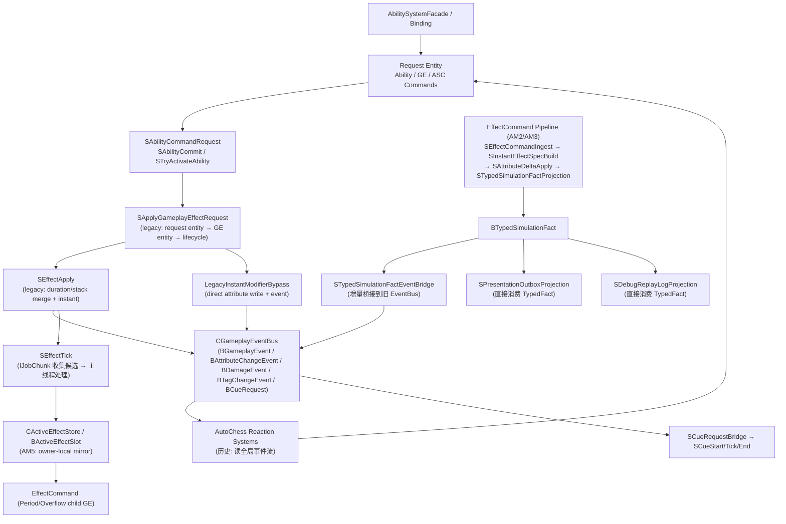
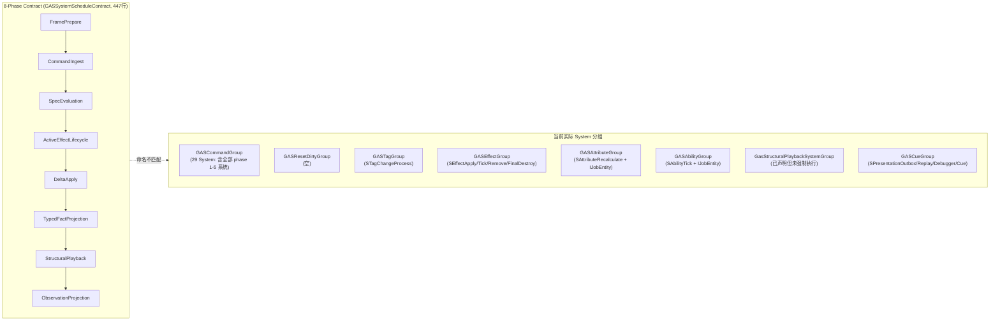
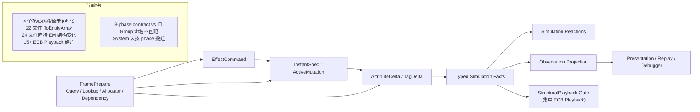

# 当前架构图

> 上次更新：2026-05-26 | 基于代码审查

## 当前实际链路（精确到具体 System）

## 当前问题边界

1. **双路径并存**：`EffectCommand Pipeline`（新）与 `SApplyGameplayEffectRequest → SEffectApply`（旧）同时活跃。
   旧路径仍是 simple instant 伤害/治疗的实际热路径（通过 `LegacyInstantModifierBypass`）。
2. **全主线程 foreach**（22 个文件）：`SAbilityCommit`、`SEffectApply`、`SEffectTick`（处理阶段）、`SApplyGameplayEffectRequest` 全部 `ToEntityArray` + `foreach`。
3. **结构变化散落**（24 个文件）：`em.SetComponentData`/`em.DestroyEntity`/`em.AddComponentData` 分散在热路径中，ECB Playback 在 `EffectRuntimeUtility` 中 15+ 处形成独立 sync point。
4. **仅 2 个 System 使用 IJobEntity**（`SAbilityTick`、`SAttributeRecalculate`），3 个使用 IJobChunk（含 `SEffectTick` 的收集阶段）。

## DOTS 规范对照热图

## 当前目标迁移方向

## 审查关键发现（2026-05-26 第二次审查）

### 正面范例

| 文件 | 亮点 |
|------|------|
| `SEffectCommandSpecStreamPhases.cs`(619行) | 6 个 partial ISystem，cursor 驱动 for 循环，零 ToEntityArray，零 ECB 碎片化 |
| `GASManager.cs`(130行) | 纯 ECS 启动器，9 个 SystemGroup 层次清晰 |
| `GASSystemScheduleContract.cs`(447行) | 完整 8-phase 契约，reads/writes/structuralPermission/observationBoundary 齐全 |
| `BTypedSimulationFact` 桥接 | 模拟事实 → Projection → EventBridge → 双出口，清晰分离 |

### 核心反模式

| 文件 | 问题 |
|------|------|
| `SAbilityCommit.cs`(515行) | ToEntityArray + foreach + 混合 ECB/直接 EM |
| `SEffectApply.cs`(174行) | ToEntityArray + foreach + 多次 PlaybackAndReset |
| `SApplyGameplayEffectRequest.cs`(881行) | ToEntityArray + foreach + 直接 em.DestroyEntity + 双路径并存 |
| `EffectRuntimeUtility.cs`(2125行) | 15+ ECB PlaybackAndReset 反模式 |
| `GasRuntimeDebugger.cs`(2389行) | 单体过于庞大，每帧临时 EntityQuery |
