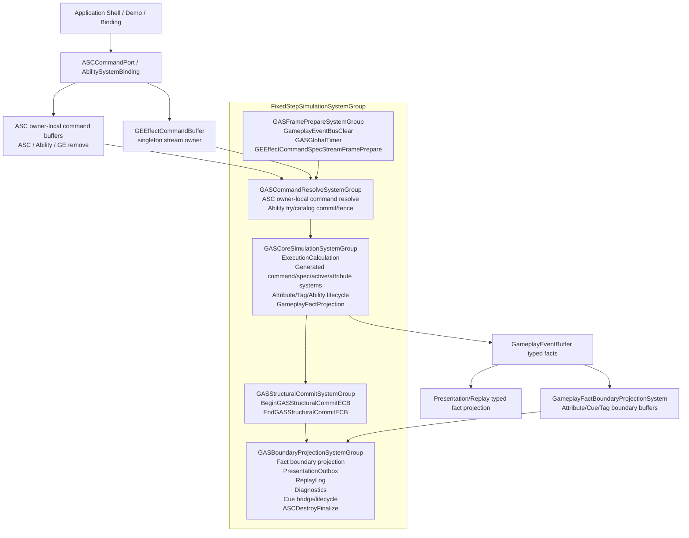
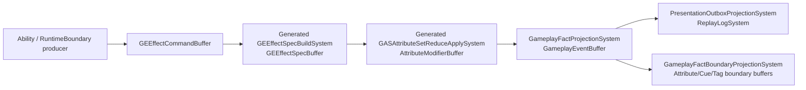

# 当前架构图

> 上次更新：2026-06-07 | 事实源：`Assets/GAS/Runtime` + `Assets/GAS/Generated/CodeGen/Runtime` 当前代码

## 当前实际主链

## 当前 EffectCommand / Spec / Delta / Fact 链路

这条链路已经不是纯文档 Contract，但仍是迁移期形态：

1. `Command/Spec/Delta/Fact` 当前仍由 singleton stream owner 的 DynamicBuffer 承载。
2. generated runtime 已接入 `GASDefinitionCatalogBlob`；ability commit/auto-end、explicit remove pending 已使用 chunk `EnabledMask`，ability lifecycle cancel/end/destroy-on-cleanup 已通过 frame-local request buffer 归并到 ability chunk applicator，ASC dirty / active modifier present 已通过 frame-local `AttributeOwnerMarkerRequestBuffer` 归并到 ASC chunk applicator，execution output applied 已由 effect chunk applicator 写入。spec-build/attribute reduce 已是 `[BurstCompile] IJob`，normalize/active pre-tick/active remove 已改为 scheduled `IJob` / `IJobChunk`；active mutation 当前为 gather `IJob` + ASC chunk-local `IJobChunk` apply，剩余问题是 singleton command carrier 与 SourceAttribute snapshot lane。
3. `state.Dependency.Complete()` 在 `Assets/GAS/**/*.cs` 当前扫描为 0；这只证明同步等待已退场，不证明 singleton stream 和 serial merge 已达终局。
4. typed fact 已能派生 Presentation/Replay；legacy gameplay EventBus、Damage 边界缓冲和 EventBus gameplay enqueue helper 已删除，Attribute/Cue/Tag 边界投影已移动到 BoundaryProjection。当前剩余风险不是双事实源，而是 Boundary 派生缓冲、Debugger/Presentation 成本和 CoreSimulation 证据仍需拆开报告。

## 当前 DOTS 对照热图

| 规则 | 当前状态 | 结论 |
|---|---|---|
| `SYS-01` | 权威状态主要在 ECS，但 `ASCCommandPort`、generated runtime、config/prototype 路径仍依赖 `GASManager.EntityManager` | 部分满足 |
| `SYS-02` | 5 个物理 phase group 已真实注册到 FixedStep | 满足当前骨架 |
| `SYS-03` | 物理 group 数量已收敛；generated/runtime system 数量和 lookup 刷新仍需计数 | 持续监控 |
| `QRY-01` | Core `Complete()` 与 active pre-tick / attribute recalc / ASC command resolve / generated ability commit / active remove / fact projection 主线程 Query 或 buffer loop 已退场；Cue managed boundary 当前是 stored query + `ToEntityArray` materialization，不是 `SystemAPI.Query` foreach；pending AttributeDelta owner-local path 已 chunk-local；active mutation singleton command carrier、stream fallback 和 source magnitude snapshot lane 仍需治理 | 部分满足 |
| `EN-03` / `CASE-20` | ASC owner-local marker、generated `AbilityCatalogCommitJob`、generated explicit remove pending、AbilityLifecycle/Cleanup current ability marker 已用 chunk `EnabledMask` 替代 random `ComponentLookup.SetComponentEnabled`；cross-entity ability lifecycle 请求已改为 frame-local request buffer + ability chunk applicator；ASC target dirty/present 已改为 `AttributeOwnerMarkerRequestBuffer` + ASC chunk applicator；execution output applied 已改为 effect chunk applicator | 当前 marker 链路满足，需防回流 |
| `BUR-01` | generated instant spec-build / attribute-reduce / active mutation gather 与 chunk apply 已输出 `[BurstCompile]` job；active mutation command carrier 仍非 hot path 终局 | 部分满足 |
| `SC-01` | StructuralCommit group 已存在；Boundary Gateway 和部分 helper/generated 路径仍直接结构变化或直接写 ECS | 未完全满足 |
| `PRF-04` | 单一 structural playback phase 已有物理 gate；完成度需用 Journaling 验证 | 方向成立，证据不足 |
| `BUF-02` | singleton DynamicBuffer 仍是 command/spec/delta/fact proof carrier | 不能作为 scale-ready 终局 |
| `NAT-02` / `NAT-03` | ExecutionCalculation / OutputModifier 已有部分 NativeStream + deterministic merge；stream 终局拆分仍未完成 | 部分满足 |
| `BLOB-01` | generated definition catalog blob 已参与 runtime | 正向信号 |

## 图中节点证据等级

上面的图是当前执行关系图，不表示所有节点都已经达到目标态。按当前代码证据，应分为：

| 节点/路径 | 当前证据等级 | 代码锚点 | 解读 |
|---|---|---|---|
| 5 段 GAS physical group | runtime-active | `Assets/GAS/Runtime/System/SystemGroup/GASSystemScheduleContract.cs:182-189`、`:286-317` | 当前真实 FixedStep 主链 |
| 8 个 logical phase contract | contract-active | `Assets/GAS/Runtime/System/SystemGroup/GASSystemScheduleContract.cs:105-156` | 映射到 5 段 group，不是 8 个 physical group |
| generated runtime systems | runtime-active | `Assets/GAS/Runtime/System/SystemGroup/GASSystemScheduleContract.cs:207-235`、`:323-328`、`:371-374` | 需要和 handwritten Runtime 同等审查；当前通过手写 generated type-name 列表注册，不再通过 `RuntimeSystemRegistration.gen.cs` |
| singleton command/spec/delta/fact stream | runtime-active but scale-risk | `Assets/GAS/Runtime/System/SystemGroup/GASRuntimeEntityArchetypes.cs:175-188` | 当前 proof carrier，不是终局 carrier |
| `ASCCommandPort` owner-local command 写入 | boundary-active | `Assets/GAS/Runtime/AbilitySystem/ASCCommandGateway.cs` | request entity 旧链路已退场，API 边界入口仍需防止 transient entity 回流；文件名暂未迁移，避免 Unity csproj 对 moved file 的增量风险 |
| Cue lifecycle bridge | boundary/managed | `Assets/GAS/Runtime/System/SystemGroup/GASSystemScheduleContract.cs:228-238`、`Assets/GAS/Runtime/Cue/Component/CueManagedInstanceComponent.cs:8-16` | Presentation 桥接，不能当 Burst gameplay core |
| Debugger / replay / official diff | observation-only | `Assets/GAS/Runtime/Debugger/GasRuntimeDebugger.cs:1925-1928`、`:1969`、`:2167` | 证明可观测性，不证明 hot path 成本 |
| AutoChess adapter | demo adapter | `Assets/AutoChessDemo/Integration/GasCore/AutoChessBattleRuntime.cs:24-66`、`AutoChessGasCoreBridge.cs:5-45`、`AutoChessGasRuntimeHost.cs:7-66`、`AutoChessGasCatalogSession.cs:6-16`、`AutoChessGasObservationGateway.cs:11-257`、`AutoChessGasBattleEntityLifecycle.cs:8-249`、`AutoChessGasRuntimeTicker.cs:8-78`、`AutoChessGasBattleReportFactProjector.cs:7-77`、`AutoChessGasCoreContracts.cs:7-133` | 集中 adapter 是正向事实；Flow runtime、Session facade、host、catalog、observation、lifecycle、ticker、report projection owner 内部仍通过 internal Shell capability 或 `ASCHandle` matcher 取得 live ECS 句柄，bootstrap、catalog、driver lifecycle、unit component attach、battle unit registry、read model、observation reset、debugger timing、job drain 和 report raw key 仍是 direct-EM / capability 分级风险 |
| AutoChess generated catalog install | app-boundary/runtime-init | `Assets/AutoChessDemo/Battle/Ecs/AutoChessBattleDefinitionCatalogBuilder.cs:12-24` | 已消费通用 generated catalog；不证明 Baker、unit/scenario/scale/validation 配置链 |

## 当前问题边界

1. **旧文档中的 `GASEffectGroup` / `GASAbilityGroup` / `GasStructuralPlaybackSystemGroup` 已不是当前主链。** 当前物理主链是 `GASFramePrepareSystemGroup -> GASCommandResolveSystemGroup -> GASCoreSimulationSystemGroup -> GASStructuralCommitSystemGroup -> GASBoundaryProjectionSystemGroup`。
2. **旧文档中的 “22 个 ToEntityArray 热路径” 不再成立。** 当前 `ToEntityArray` 运行命中 4 处：Debugger observation 和 Cue managed boundary；`GASGlobalTimerSystem` 当前是 `CreateEntityQuery + CalculateEntityCount + GetSingletonEntity` singleton fallback，不再是 `ToEntityArray` 命中；`ActiveEffectStore` global index owner 已改为 registered/cache owner，不再创建 fallback query。`Complete()` 当前已清零，`SystemAPI.Query<...>` / `SystemAPI.Query(...)` 在 Runtime + generated runtime 当前 0 命中。generated ability commit/current ability auto-end 的 random enableable、instant spec/reduce 的未 Burst 主线程诊断、active mutation 旧 `EntityManager` helper、旧 active mutation serial apply、explicit remove pending lookup、ability lifecycle cross-entity marker 写入、ASC dirty/present random enableable、execution output applied random enableable、pending AttributeDelta owner materialization、pending AttributeDelta stream migration fallback、GlobalTimer entity array materialization 和 ability seed scratch 均已退场。真正需要继续关注的是 active mutation singleton command carrier / SourceAttribute snapshot lane、全局 singleton stream、generated instant delta record / fan-in 证明、GlobalTimer singleton fallback owner 化、ActiveEffectStore capacity/cache integrity 证据和结构变化证据缺口。
3. **generated runtime 是当前事实的一部分。** 不能只审查 handwritten Runtime；`GASSystemScheduleContract` 当前通过 generated type-name 列表把 1 个 CommandResolve system 和 6 个 CoreSimulation systems 挂入主链，`RuntimeSystemRegistration.gen.cs` 已退场。
4. **Contract 不是完成证明。** `NeedsEcbMigration`、`TargetContract`、`DirectEntityManagerAllowed=false` 等字段只能作为任务约束；完成度必须来自当前执行链、Profiler/Journaling、Debugger counters 和规模验证。
