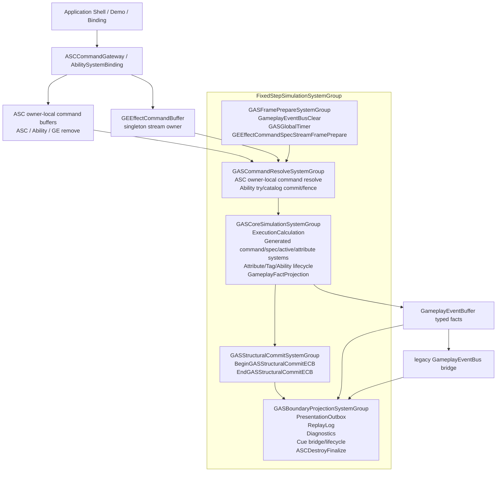
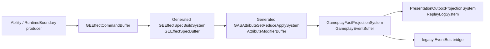

# 当前架构图

> 上次更新：2026-06-06 | 事实源：`Assets/GAS/Runtime` + `Assets/GAS/Generated/CodeGen/Runtime` 当前代码

## 当前实际主链

## 当前 EffectCommand / Spec / Delta / Fact 链路

这条链路已经不是纯文档 Contract，但仍是迁移期形态：

1. `Command/Spec/Delta/Fact` 当前仍由 singleton stream owner 的 DynamicBuffer 承载。
2. generated runtime 已接入 `GASDefinitionCatalogBlob`；ability commit 已使用 chunk `EnabledMask`，spec-build/attribute reduce 已是 `[BurstCompile] IJob`，normalize/active pre-tick/active remove 已改为 scheduled `IJob` / `IJobChunk`，但 active mutation 仍保留主线程 buffer loop 与 `EntityManager` helper 过渡实现，active lifecycle 也仍有 random enableable P1 残留。
3. `state.Dependency.Complete()` 在 `Assets/GAS/**/*.cs` 当前扫描为 0；这只证明同步等待已退场，不证明 singleton stream 和 serial merge 已达终局。
4. typed fact 已能派生 Presentation/Replay/legacy EventBus，但 gameplay reaction 是否完全脱离 observation bus 仍需逐链路复审。

## 当前 DOTS 对照热图

| 规则 | 当前状态 | 结论 |
|---|---|---|
| `SYS-01` | 权威状态主要在 ECS，但 `ASCCommandGateway`、generated runtime、config/prototype 路径仍依赖 `GASManager.EntityManager` | 部分满足 |
| `SYS-02` | 5 个物理 phase group 已真实注册到 FixedStep | 满足当前骨架 |
| `SYS-03` | 物理 group 数量已收敛；generated/runtime system 数量和 lookup 刷新仍需计数 | 持续监控 |
| `QRY-01` | Core `Complete()` 与 active pre-tick / attribute recalc / ASC command resolve / generated ability commit / active remove / fact projection 主线程 Query 或 buffer loop 已退场；Cue managed boundary 仍用 `SystemAPI.Query`，generated active mutation serial buffer loop 仍需治理 | 部分满足 |
| `EN-03` / `CASE-20` | generated `AbilityCatalogCommitJob` 已用 chunk `EnabledMask` 替代 random `ComponentLookup.SetComponentEnabled`；generated active lifecycle 仍有 random `SetComponentEnabled` 残留 | 部分满足 |
| `BUR-01` | generated instant spec-build / attribute-reduce 已输出 `[BurstCompile] IJob`；active mutation 仍有主线程 helper，不可写成 hot path 终局 | 部分满足 |
| `SC-01` | StructuralCommit group 已存在；Boundary Gateway 和部分 helper/generated 路径仍直接结构变化或直接写 ECS | 未完全满足 |
| `PRF-04` | 单一 structural playback phase 已有物理 gate；完成度需用 Journaling 验证 | 方向成立，证据不足 |
| `BUF-02` | singleton DynamicBuffer 仍是 command/spec/delta/fact proof carrier | 不能作为 scale-ready 终局 |
| `NAT-02` / `NAT-03` | ExecutionCalculation / OutputModifier 已有部分 NativeStream + deterministic merge；stream 终局拆分仍未完成 | 部分满足 |
| `BLOB-01` | generated definition catalog blob 已参与 runtime | 正向信号 |

## 图中节点证据等级

上面的图是当前执行关系图，不表示所有节点都已经达到目标态。按当前代码证据，应分为：

| 节点/路径 | 当前证据等级 | 代码锚点 | 解读 |
|---|---|---|---|
| 5 段 GAS physical group | runtime-active | `Assets/GAS/Runtime/System/SystemGroup/GASSystemScheduleContract.cs:182-189`、`:286-317` | 当前真实 FixedStep 主链 |
| 8 个 logical phase contract | contract-active | `Assets/GAS/Runtime/System/SystemGroup/GASSystemScheduleContract.cs:105-156` | 映射到 5 段 group，不是 8 个 physical group |
| generated runtime systems | runtime-active | `Assets/GAS/Generated/CodeGen/Runtime/RuntimeSystemRegistration.gen.cs:15-21` | 需要和 handwritten Runtime 同等审查 |
| singleton command/spec/delta/fact stream | runtime-active but scale-risk | `Assets/GAS/Runtime/System/SystemGroup/GASRuntimeEntityArchetypes.cs:175-188` | 当前 proof carrier，不是终局 carrier |
| `ASCCommandGateway` owner-local command 写入 | boundary-active | `Assets/GAS/Runtime/AbilitySystem/ASCCommandGateway.cs` | request entity 旧链路已退场，API 边界入口仍需防止 transient entity 回流 |
| Cue lifecycle bridge | boundary/managed | `Assets/GAS/Runtime/System/SystemGroup/GASSystemScheduleContract.cs:228-238`、`Assets/GAS/Runtime/Cue/Component/CueManagedInstanceComponent.cs:8-16` | Presentation 桥接，不能当 Burst gameplay core |
| Debugger / replay / official diff | observation-only | `Assets/GAS/Runtime/Debugger/GasRuntimeDebugger.cs:1925-1928`、`:1969`、`:2167` | 证明可观测性，不证明 hot path 成本 |
| AutoChess bridge | demo adapter | `Assets/AutoChessDemo/Integration/GasCore/AutoChessGasCoreBridge.cs:14-30`、`:145-211` | 集中接缝是正向事实，内部 direct-EM 仍是风险 |
| AutoChess demo catalog | demo-only/runtime-init | `Assets/AutoChessDemo/Battle/Ecs/AutoChessBattleDefinitionCatalogBuilder.cs:59-112` | 证明 demo 最小 catalog，不证明完整配置生成链 |

## 当前问题边界

1. **旧文档中的 `GASEffectGroup` / `GASAbilityGroup` / `GasStructuralPlaybackSystemGroup` 已不是当前主链。** 当前物理主链是 `GASFramePrepareSystemGroup -> GASCommandResolveSystemGroup -> GASCoreSimulationSystemGroup -> GASStructuralCommitSystemGroup -> GASBoundaryProjectionSystemGroup`。
2. **旧文档中的 “22 个 ToEntityArray 热路径” 不再成立。** 当前 `ToEntityArray` 主要出现在 `GasRuntimeDebugger` observation 路径和 budget contract 描述中；`Complete()` 当前已清零，`SystemAPI.Query<...>` 在 `Assets/GAS` 只剩 Cue managed boundary。generated ability commit 的 random enableable 与 instant spec/reduce 的未 Burst 主线程诊断也已退场。真正需要继续关注的是 generated active mutation serial buffer loop、active lifecycle random enableable、直接 `EntityManager` helper、全局 singleton stream 和结构变化证据缺口。
3. **generated runtime 是当前事实的一部分。** 不能只审查 handwritten Runtime；`RuntimeSystemRegistration.gen.cs` 已把 generated systems 挂入 CommandResolve/CoreSimulation。
4. **Contract 不是完成证明。** `NeedsEcbMigration`、`TargetContract`、`DirectEntityManagerAllowed=false` 等字段只能作为任务约束；完成度必须来自当前执行链、Profiler/Journaling、Debugger counters 和规模验证。
