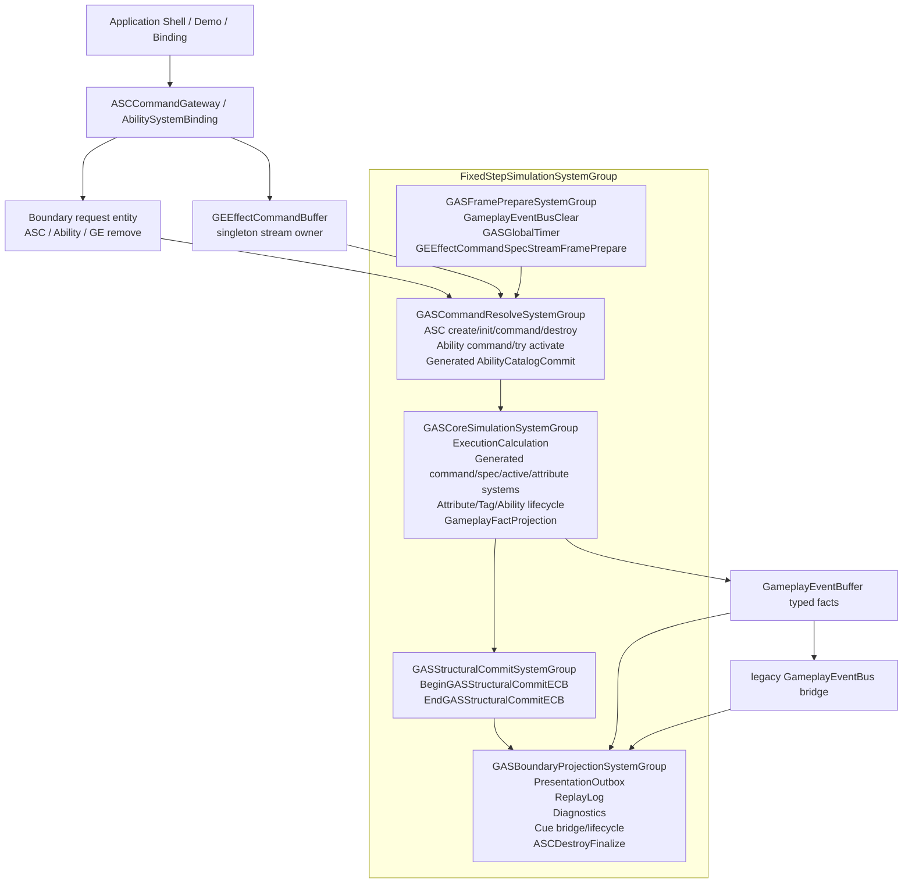
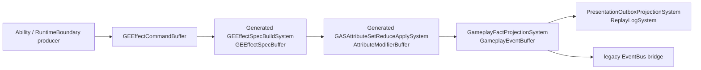

# 当前架构图

> 上次更新：2026-06-02 | 事实源：`Assets/GAS/Runtime` + `Assets/GAS/Generated/CodeGen/Runtime` 当前代码

## 当前实际主链

## 当前 EffectCommand / Spec / Delta / Fact 链路

这条链路已经不是纯文档 Contract，但仍是迁移期形态：

1. `Command/Spec/Delta/Fact` 当前仍由 singleton stream owner 的 DynamicBuffer 承载。
2. generated runtime 已接入 `GASDefinitionCatalogBlob`，但系统主体仍以主线程 `SystemAPI.Query` / buffer for 循环为主。
3. `GEExecutionCalculationSystem`、`GEExecutionCalculationOutputModifierSystem`、active effect generated systems、destroy/finalize 系统仍存在 `state.Dependency.Complete()`。
4. typed fact 已能派生 Presentation/Replay/legacy EventBus，但 gameplay reaction 是否完全脱离 observation bus 仍需逐链路复审。

## 当前 DOTS 对照热图

| 规则 | 当前状态 | 结论 |
|---|---|---|
| `SYS-01` | 权威状态主要在 ECS，但 `ASCCommandGateway`、generated runtime、config/prototype 路径仍依赖 `GASManager.EntityManager` | 部分满足 |
| `SYS-02` | 5 个物理 phase group 已真实注册到 FixedStep | 满足当前骨架 |
| `SYS-03` | 物理 group 数量已收敛；generated/runtime system 数量和 lookup 刷新仍需计数 | 持续监控 |
| `QRY-01` | 热路径仍有主线程 `SystemAPI.Query`、buffer for 循环和 `Complete()` | 未完全满足 |
| `SC-01` | StructuralCommit group 已存在；Boundary Gateway 和部分 helper/generated 路径仍直接结构变化或直接写 ECS | 未完全满足 |
| `PRF-04` | 单一 structural playback phase 已有物理 gate；完成度需用 Journaling 验证 | 方向成立，证据不足 |
| `BUF-02` | singleton DynamicBuffer 仍是 command/spec/delta/fact proof carrier | 不能作为 scale-ready 终局 |
| `NAT-02` / `NAT-03` | NativeStream 只是目标 carrier，当前未完成 deterministic merge 迁移 | 待迁移 |
| `BLOB-01` | generated definition catalog blob 已参与 runtime | 正向信号 |

## 当前问题边界

1. **旧文档中的 `GASEffectGroup` / `GASAbilityGroup` / `GasStructuralPlaybackSystemGroup` 已不是当前主链。** 当前物理主链是 `GASFramePrepareSystemGroup -> GASCommandResolveSystemGroup -> GASCoreSimulationSystemGroup -> GASStructuralCommitSystemGroup -> GASBoundaryProjectionSystemGroup`。
2. **旧文档中的 “22 个 ToEntityArray 热路径” 不再成立。** 当前 `ToEntityArray` 主要出现在 `GasRuntimeDebugger` observation 路径和 budget contract 描述中；真正需要关注的是主线程 `SystemAPI.Query`、buffer for 循环、`Complete()` 和全局 singleton stream。
3. **generated runtime 是当前事实的一部分。** 不能只审查 handwritten Runtime；`RuntimeSystemRegistration.gen.cs` 已把 generated systems 挂入 CommandResolve/CoreSimulation。
4. **Contract 不是完成证明。** `NeedsEcbMigration`、`TargetContract`、`DirectEntityManagerAllowed=false` 等字段只能作为任务约束；完成度必须来自当前执行链、Profiler/Journaling、Debugger counters 和规模验证。
