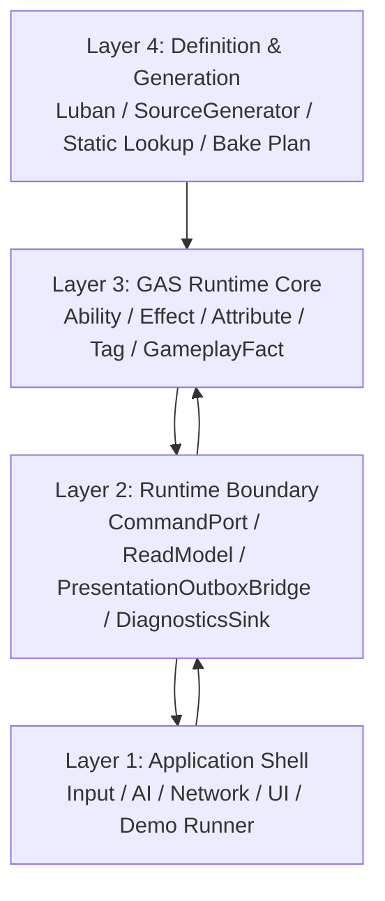

# 总览 Spec

## 目的

定义 EX-GAS 2.0 的目标态：用 Unity ECS/DOTS 表达 GAS 的核心语义，OOP 只保留在应用壳层和运行时边界层；Runtime Core 热路径只使用显式 ECS 数据流。

目标态的第一性技术约束来自 `90-目标态不变量.md`（核心不变量）和 `../../UnityDOTS官方文档参考/README.md`。GAS 概念、UE GAS / tranek 文档和历史方案参考只能作为业务语义参考；DOTS 相关设计必须先确认官方文档覆盖主题。Runtime Core 的最终承载机制必须对齐 `../../UnityDOTS官方文档参考/主题/01-Entities系统与World.md`，具体编码和业务系统编写必须遵守 `../../UnityDOTS官方文档参考/主题/90-规则编号索引.md`，具体 API 选型必须复核 `../../UnityDOTS官方文档参考/主题/20-GASRuntimeCore-API选型基线.md`，并用 `../../UnityDOTS官方文档参考/主题/12-官方案例模式.md` 对照官方示例实际写法，再用 `../../UnityDOTS官方文档参考/主题/21-官方文档覆盖与流程闭环.md` 检查官方文档覆盖矩阵和反哺流程。

## 官方依据与设计论证

目标态不是把 GAS OOP 类层级搬进 Unity，而是把 gameplay 权威压入 ECS 数据流。`SYS-01` 要求权威计算落在 ECS System / Job 数据流，`SYS-02` 要求 SystemGroup 成为 phase owner，`SYS-03` / `PRF-07` 又提醒 system / group 数量本身是成本源，因此本目录采用“四层工程边界 + 少量物理执行域 + 多条 kernel lane”，而不是每个 GAS 概念一个 manager / facade / group。

这套划分的必要性来自 hot path 约束：`SEL-01` 要求先按 Gameplay / Transient / Telemetry / Presentation 分类选型；`PRF-01`、`PRF-03`、`SC-01`、`ECB-03` 分别禁止瞬时状态实体化、高频 tag component 结构变化、hot path 直接结构变化和无 owner 的 ECB playback；`NAT-03` / `BUF-02` 要求并行 fan-in 有确定性 merge 和容量预算。换言之，Runtime Core 先建立 DOTS Physical Backbone，才能让 Ability / GE / Attribute / Fact 的语义扩展不退化成全局总线或 OOP 中间层。

Definition & Generation 的目标也必须由官方规则约束：`CASE-07`、`BLOB-02`、`CONTENT-01` 和 `BUR-01` 支持静态定义进入 Blob / Baker / Bootstrap / Burst-compatible glue，而不支持 generated lifecycle、runtime managed config lookup 或 hot path `BlobBuilder`。因此 Luban + SourceGenerator 的价值是把配置压缩成 Runtime Core 可消费的 immutable catalog 和 pure glue，而不是替 Runtime Core 生成调度 owner。

## 架构视图

目标态主架构采用四层命名：



| 层级 | 规范中文名 | 职责 |
|---|---|---|
| Layer 1 | 应用壳层 | UI、输入、AI、网络、场景、Demo runner、真实资源或无头 log marker |
| Layer 2 | 运行时边界层 | 命令写入、只读镜像、表现 outbox、诊断与 replay 导出 |
| Layer 3 | GAS 运行时核心层 | GAS 权威状态、规则计算、phase/stream、typed facts |
| Layer 4 | 定义与生成层 | Luban、SourceGenerator、静态定义、BakePlan、validation |

## 整体目标态重划分 Spec

目标态 EX-GAS 2.0 不是“ECS 内核外再包一个 OOP runtime 中间层”，而是把 gameplay 权威完全压入 Pure ECS Core，把 OOP 只保留为应用壳层与运行时边界层的交互外壳。四层之间必须只传递业务 intent、opaque handle、frame-local record、immutable definition、snapshot 和 evidence，不传递 `World`、`EntityManager`、raw `Entity`、`EntityQuery`、writable buffer、NativeContainer owner 或 generated lifecycle owner。

目标态责任链如下：

```text
Application Shell
  -> Runtime Boundary Capability
  -> Pure ECS Core Lane / Store
  -> Boundary Projection / Diagnostics Evidence
  -> Application Shell Derived Consumer

Definition & Generation
  -> immutable catalog / static lookup / pure evaluator
  -> Pure ECS Core Lane / Store
```

| 目标 owner | Interface 必须足够窄 | Implementation 必须足够深 | 禁止方向 |
|---|---|---|---|
| `RuntimeSession` | session id、install / dispose result、fixed tick result | World lifetime、SystemGroup install、bootstrap singleton、catalog install、timing split | 向 Shell 暴露 ECS handle 或承载 gameplay formula |
| `CommandPort` | intent、opaque target、request id、reject reason | target resolve、owner-local command append、sequence、write pressure evidence | 同步执行 damage / cooldown / requirement，或返回 writable buffer |
| `SnapshotReadModel` | immutable snapshot、version、cursor status | BoundaryProjection、snapshot ring、copy arena、staleness / drop counter | live `DynamicBuffer` getter、runtime query scan、raw `Entity` key |
| `GASFrameKernel` | command / target / spec / delta / fact record | `ISystem` / job、query owner、type handle、lookup refresh、allocator、dependency、carrier、structural policy、evidence counter | OOP manager、static helper、Debugger、SourceGenerator 或 Adapter 隐式代管 Runtime Core API |
| `EffectFanInStore` | deterministic merge result、owner-local range | `NativeStream` segment、sort key、merge cost、capacity / spill、battle hash、reselect trigger | singleton DynamicBuffer 或 managed list 作为 scale-ready 默认总线 |
| `ActiveEffectStore` | owner-local slot、period / stack / duration / granted state record | slot capacity、magnitude snapshot timing key、cleanup intent、fact evidence | generated lifecycle、static helper lifecycle、global index 反向驱动 state |
| `StructuralCommit` | structural intent、playback result、official diff source | ECB owner、bulk query、sort key、Journaling / Profiler route | 分散 `EntityManager.Create/Destroy/Add/Remove` |
| `DiagnosticsSink` | structured evidence snapshot、DataOrientedScorecard、official capture state、derived export handle | runtime metric families、GAS concept evidence、DOTS API health、TopN、buffer pressure、pass split、overhead owner | gameplay decision、command writer、hot path string log、单个稀疏大事件行 |
| `DefinitionCatalogLifetime` | catalog handle、schema/version、install / release result | Blob lifetime、schema validation、Baker / Bootstrap materialization、dispose owner | managed row read、hot path BlobBuilder、generated lifecycle / registration |
| `GeneratedDefinitionGlue` | code -> index -> immutable definition -> pure record | Blob schema、static lookup、pure evaluator、validation metadata | `ISystem`、`OnUpdate`、query、ECB、NativeContainer allocator、runtime lifecycle |
| `PresentationBridge` | presentation outbox / cue marker / replay marker | resource binding key、headless marker、rendered profile cost | Core gameplay write、Core 直接依赖资源 |

这套重划分的核心验收不是文件移动或类名更换，而是 deep interface：调用方只能知道业务意图、record、snapshot、evidence 和错误码；query、lookup、allocator、dependency、carrier、capacity、merge、structural playback 和 diagnostics owner 必须留在具体 implementation owner 内。删除任一 owner 时，复杂度应集中回一个明确 implementation，而不是扩散到 Shell、generated artifact、Debugger、Demo adapter 或多个 helper。

完整代码骨架的唯一正文入口是 [16-06A 完整端到端消息流代码骨架](16-纯ECS内核与边界重划分/16-06-端到端消息流代码骨架/16-06A-完整端到端消息流代码骨架Spec.md)。该骨架用于说明目标态代码如何把 Shell intent、Boundary command、Core `IJobChunk`、`NativeStream` deterministic fan-in、owner-local dispatch、spec / delta / fact、Definition pure glue、Diagnostics evidence 和 Derived export 串成单向消息流；本总览只维护总体 owner map，不复制第二份代码。

## 目标态 Owner 判定准则

目标态的 owner 判定必须先回答四个问题，再决定代码应该落在哪一层：

| 判定问题 | 合格答案 | 不合格答案 |
|---|---|---|
| 谁拥有写权限？ | 唯一 Core lane、StructuralCommit、BoundaryProjection 或 DefinitionLifetime owner | Shell、Debugger、generated artifact、helper 或多个 adapter 共同写 |
| 数据生命周期是什么？ | frame-local、owner-local、cross-frame authoritative、Boundary snapshot、immutable definition 之一 | 一个 carrier 同时解释 command、spec、delta、fact、diagnostics 和 presentation |
| 调用方需要知道多少实现细节？ | 调用方只知道 intent / handle / record / snapshot / evidence / reject reason | 调用方知道 query、lookup、allocator、dependency、buffer、singleton、raw entity 或 playback phase |
| 如何证明性能和正确性？ | 通过 owner-local counter、capacity / spill、deterministic merge、official capture state、battle hash 和 validation evidence | 通过运行通过、平均耗时、日志文本、facade 命名或 generated code 存在 |

任何目标态设计若不能给出上述四问的合格答案，即使使用了 `ISystem`、`IJobChunk`、`DynamicBuffer`、`NativeStream`、Blob 或 SourceGenerator，也只能判定为 proof-only 或迁移期设计，不能进入框架 Spec 的 release-ready 路线。

## Spec 纯粹性边界

本目录只定义目标态，不使用实现代码作为完成证明。实现事实、`MigrationProofOnly` 实现证据、已生成文件清单、profile 结果和缺陷诊断必须写入 `../00-当前架构事实/`；任务拆分和推进顺序必须写入 `../02-主线任务树/`。

因此，本 Spec 的约束以目标态形式表达：

1. Contract 字段不是完成度；只有实现验证能进入事实目录。
2. generated code 不是黑盒。任何 runtime-visible generated artifact 都必须接受与手写 Runtime 一致的 DOTS 规则审查。
3. 单一 forbidden dependency 字符串扫描不是 SourceGenerator 职责边界完成证明；目标态还必须通过职责分类 gate 证明没有 generated lifecycle、system registration、隐藏 query、隐藏 ECB / `EntityManager` 写入和 NativeContainer owner 越权。
4. 历史方案只作为设计来源，不能成为事实目录中的完成证明。

## 目标能力闭环

目标态 Spec 按能力域描述架构覆盖面，不使用任务代号作为架构概念。能力域之间可并行深化，但共享的 DOTS Physical Backbone 和 EffectCommand Contract 必须先作为验收基线存在。

| 能力域 | 目标 | 验收门 |
|---|---|---|
| DOTS Physical Backbone | 建立少量物理执行域 SystemGroup / Frame Prepare / Query ownership / Lookup / Allocator / Dependency / Structural Commit / Debugger evidence 的统一骨架 | DOTS Physical Backbone 验收通过 |
| Diagnostics Baseline | Runtime Core Debugger 完成 counters / timing / buffer pressure / sync point 采样 | Debugger summary 可与 Profiler/Journaling 对照 |
| EffectCommand Contract | EffectCommand / TargetData / AttributeModifier / GameplayFact 契约闭合，明确 owner-local 与 frame-local fan-in 边界 | simple instant GE 不创建 runtime entity |
| Fan-In to Attribute Apply | Instant GE 全链路进入 target resolve → effect fan-in → attribute reduce/apply → gameplay fact 主链 | simple instant producer 全部进入主链；复杂 GE fallback 有显式拒绝理由 |
| Scale-Ready Fan-In | 全局 singleton DynamicBuffer 替换为 `NativeStream` deterministic merge + compact owner-local range，parallel fan-in 确定性闭合 | merge cost / buffer pressure 达标；battle hash 稳定 |
| Active Effect Store | Duration/Stack/Period/Granted 的 store-driven lifecycle 闭合 | duration GE 进入 store；复杂 child GE 有清晰 owner 和 cleanup path |
| Full GAS Closure | TargetData / EffectContext / MagnitudeEvaluation / GameplayEvent 全部闭合 | ECS GAS 完整语义闭环 |
| Planner Configuration Capability | 策划通过业务能力包完成创建、校验、影响分析、Runtime trace preview、平衡预览和发布 | 默认路径不编辑 raw row；Publish Validation Snapshot 可驱动 CI / headless validation |

## 核心结论

1. Gameplay 权威只存在于 ECS 数据和显式 System 调度中。（`SYS-01`）
2. 外部写入只通过 request entity 或等价 command data。（`SEL-01`）
3. 外部观察只通过 fact stream、presentation outbox、replay sink、read model。（`SYS-05`）
4. Definition 不携带 runtime state。（`BAKE-01`）
5. Debugger / Replay / Presentation 只读派生，不反向驱动 Runtime Core。（`DBG-01` `SYS-05`）
6. 命名必须显式表达层级、读写方向和状态归属，禁止继续用万能 `Manager / Helper / Adapter / EventBus` 掩盖混合职责。（`STORE-01`）
7. Runtime Core 的 phase / stream 必须落到 Unity Entities 的 SystemGroup、ISystem、Job、ECB、Enableable、DynamicBuffer、Blob/Baker 和 Query filter 等具体机制。（`SYS-02` `QRY-01` `JOB-01` `ECB-01` `EN-01` `BUF-01` `BAKE-01`）
8. Runtime Core 业务代码必须能说明遵守了哪些 Unity Entities 使用规则，不允许只用”ECS 化”作为实现理由。（`PRF-01`~`PRF-34`）
9. Runtime Core 目标态必须把 Query / Filter / Allocator / Dependency / Chunk layout 当成架构输入，而不是调优阶段才补的实现细节。（`PRF-09` `NAT-01` `PRF-14`）
10. 无头 Demo 只省略真实资源和画面，不省略 Cue / UI / VFX / SFX 的 Boundary 链路；表现资源加载状态不能反向影响 Core simulation。（`ODF-18`）
11. Runtime Core 任务必须能把自己的实现写法映射到 Unity 官方 DocCodeSamples / Tests / PerformanceTests 中的案例模式；若拒绝官方常见模式，必须说明原因和重新选型触发条件。（`CASE-01`~`CASE-47`）
12. Runtime Core / Debugger / Luban / Demo 任务必须能把自己的实现取舍映射到 `../../UnityDOTS官方文档参考/主题/21-官方文档覆盖与流程闭环.md` 的官方文档覆盖主题和 `ODF-*` 规则；若某主题暂不相关，必须说明原因。（`ODF-01`~`ODF-18`）
13. Runtime Core 落地顺序遵守 `DOTS Physical Backbone First`：先建立少量物理执行域 SystemGroup / Frame Prepare / Query ownership / Lookup / Allocator / Dependency / Structural Commit / Debugger evidence，再继续扩展 Target Resolve、Effect Fan-In、State Evaluate、Attribute Reduce/Apply 等 GAS kernel lane。（`SYS-01` `SYS-02` `SYS-03` `PRF-04` `PRF-07` `CASE-16`）
14. Runtime Core 新任务必须按业务 kernel lane 归属，而不是按 OOP 类或旧 SpecStream phase 归属；默认 lane 为 Boundary Command Ingest、Target Resolve、Effect Fan-In、State Evaluate、Attribute Reduce/Apply、Gameplay Fact、Structural Commit、Boundary Projection；但 lane 不默认升格为 `ComponentSystemGroup`。
15. EffectCommand / Spec / Delta / Fact 是语义链，不是全局总线；scale-ready 默认是 `NativeStream` deterministic merge + compact owner-local buffer，proof-only singleton DynamicBuffer 不得固化为目标态。（`CASE-12` `NAT-03` `MAT-05` `BUF-02`）
16. Luban / SourceGenerator 进入 Runtime Core 的目标形态是 `GASDefinitionCatalogBlob` + generated code->index lookup + Generated Runtime Glue；Runtime lane 消费 `AbilityActivationPlanRecord`、`GECommandSeedRecord`、`ResolvedModifierRecord` 等 frame-local record，不反查 managed row / JSON / `Dictionary`。这不是审美选择：`BLOB-01` 要求静态定义进入 immutable Blob，`BLOB-02` 要求 `BlobBuilder` 只在 Baking / 初始化期，`SYS-01` 要求权威计算落在 ECS System/Job 数据流，`SYS-03` 指出 system 数量本身是成本源，`QRY-01` / `QRY-04` 要求 hot path job 化并避免高频 random lookup，`SC-01` / `ECB-03` 要求结构变化和 ECB playback 归属明确 phase，`NAT-03` 要求 NativeStream fan-in 有确定性 merge 和预算，`BUR-01` 要求 hot path Burst 且无托管依赖。因此 SourceGenerator 不得生成 Runtime Core lifecycle system、system registration、query owner、ECB owner、EntityManager write 或 NativeContainer owner。
17. SourceGenerator 只能生成 definition / Blob / lookup / pure glue / validation / Baker 或 Bootstrap artifact；不得生成 Runtime Core lifecycle system、system registration、隐藏结构变化、隐藏 query、NativeContainer owner 或 gameplay schedule owner。具体论证见 `15-SourceGenerator职责边界Spec.md`。
18. AutoChessDemo 是 Layer 1 业务验收 Demo，不是 Runtime Core 样例或测试 harness。它允许拥有一个面向业务的 Battle Runtime Adapter seam，但该 seam 必须是薄 interface、深 implementation：对外只暴露 battle runtime 动作，对内分类承载 RuntimeHost、CatalogSession、BattleEntityLifecycle、ObservationGateway；不得把 `EntityManager`、Debugger、catalog、业务决策和 validation policy 混成万能 adapter。
19. Validation evidence 是一等事实模型，不是字符串日志。Headless runner、scene runner、Profiler pass 和 official diff pass 必须导出同构 evidence，包含 world time policy、proof-only API、reselect trigger、官方工具证据、API health 和业务验收字段。
20. 新划分设计必须通过 `18-DOTS官方规范复核与性能红线Spec.md` 的官方复核门槛：四层划分只作为工程边界，Runtime Core API 选择必须逐项说明数据性质、owner、生命周期、拒绝理由、官方规则编号、重选型触发条件和 proof-only 退出条件。

## GAS 概念设计结论

概念设计审查后的新增共识见 [01B-GAS业务语义链路概念设计Spec](01B-GAS业务语义链路概念设计Spec.md)。任何 Runtime Core 设计或任务在讨论 Ability、GameplayEffect、Attribute、Tag、Cue、Debugger 或 Luban/SourceGenerator 时，必须先判断目标对象属于哪类事实：

| 类型 | 含义 | 允许 owner |
|---|---|---|
| ECS 权威状态 | 跨帧存在并决定 gameplay 结果 | Layer 3 GAS Runtime Core |
| frame-local record | 本帧 command / target / spec / delta / fact 的计算中间态 | Runtime Core lane system / job |
| Boundary 投影 | ReadModel、Presentation、Replay、Debugger、structured log | Layer 2 Runtime Boundary |
| Definition 输入 | 不可变配置、Blob、generated lookup、pure glue | Layer 4 Definition & Generation |

由此得到四条架构判断：

1. GAS 概念不能按 OOP 类层级评审；必须按 owner、生命周期、写入权限、承载 API 和 Debugger evidence 评审。
2. OOP Shell 是外部业务集成能力，不是 gameplay runtime 中间层；Thin Adapter 只翻译业务意图和导出观察结果。
3. Debugger 是证据系统，不是日志工具；它必须暴露性能热点和 DOTS API 健康度，而不是只描述“发生了什么”。
4. Luban + SourceGenerator 的目标价值是消除托管配置查询和重复 glue，不是生成 Runtime lifecycle。

## Runtime Core 物理执行域与 Kernel Lane 划分

| 物理执行域 SystemGroup | Kernel lane | 数据所有权 |
|---|---|---|
| `GASFramePrepareSystemGroup` | Frame Prepare | allocator、lookup refresh budget、dependency counters；不集中持有 query |
| `GASCommandResolveSystemGroup` | Boundary Command Ingest | 低频 Boundary request entity / Core 高频 `AbilityActivationCommandRecord` |
| `GASCommandResolveSystemGroup` | Target Resolve | `AbilityTargetRecord` NativeStream / request-owned `TargetDataBuffer`（低量物化）/ deterministic target sort key |
| `GASCoreSimulationSystemGroup` | Effect Fan-In | `NativeStream` producer + deterministic merge + compact owner-local command range |
| `GASCoreSimulationSystemGroup` | State Evaluate | `AbilityStateComponent`、`ActiveGameplayEffectBuffer`、status bit field、chunk skip cache |
| `GASCoreSimulationSystemGroup` | Attribute Reduce / Apply | target-grouped modifier reduce；attribute / tag / status 写入 |
| `GASCoreSimulationSystemGroup` | Gameplay Fact | Core reaction facts；Ability trigger / reactive GE |
| `GASStructuralCommitSystemGroup` | Structural Commit | custom ECB playback / EntityQuery bulk / `ComponentTypeSet` |
| `GASBoundaryProjectionSystemGroup` | Boundary Projection | read model、presentation outbox、replay、debugger samples |

## DOTS Physical Backbone First

四层架构只定义工程职责边界，不替代 Unity DOTS 的执行机制。Runtime Core 进入更多功能迁移前，必须先拥有可验收的 frame backbone：

1. `GASFramePrepareSystemGroup` 只负责 lookup refresh budget、frame scratch、allocator 和 dependency counters；EntityQuery 由各 `ISystem` 通过 `SystemState.GetEntityQuery` 自行拥有。
2. command / target / modifier / fact / active slot 必须声明 owner、clear phase、merge policy、deterministic ordering 和重新选型触发条件。
3. `GASStructuralCommitSystemGroup` 是 hot path 唯一结构变化屏障；其他 kernel 禁止直接做 `EntityManager` 结构变化。
4. Runtime Core Debugger 必须同时输出 physical group counters 与 kernel lane counters，并能与 Unity Profiler / Entities Journaling / Burst evidence 对照。
5. 任何扩展目标只能在该 backbone 上扩展，不允许继续把旧 lifecycle mirror、singleton SpecStream 或 runtime GE entity churn 当作目标态主线。
6. Frame Prepare 不能升级为中央 registry / service locator；query owner、buffer owner 和 stream owner 必须在具体 lane system 中声明。
7. 新增 SystemGroup 必须通过 `SYS-03` / `PRF-07` 审查：只有引入新的同步/结构变化/投影物理边界时才允许新增 group。

## 目标设计入口

1. [01B-GAS业务语义链路概念设计Spec](01B-GAS业务语义链路概念设计Spec.md) — GAS 概念设计、业务语义链路、OOP Shell / Thin Adapter / Debugger / SourceGenerator 边界
2. [03-RuntimeCore管线Spec](03-RuntimeCore管线Spec.md) — DOTS Kernel SystemGroup、Component 读写矩阵、Frame Prepare 物理设计、完整代码骨架
3. [13-EntityComponent物理布局Spec](13-EntityComponent物理布局Spec.md) — Entity/Component 布局、Archetype 审计、Buffer 容量策略
4. [04-EffectCommand-SpecStream-AttributeDeltaSpec](04-EffectCommand-SpecStream-AttributeDeltaSpec.md)
5. [07-RuntimeCoreDebuggerSpec](07-RuntimeCoreDebuggerSpec.md)
6. [08-Luban-SourceGenerator配置生成链路Spec](08-Luban-SourceGenerator配置生成链路Spec.md)
7. [14-DefinitionCodeGen目标链路Spec](14-DefinitionCodeGen目标链路Spec.md)
8. [15-SourceGenerator职责边界Spec](15-SourceGenerator职责边界Spec.md)
9. [18-DOTS官方规范复核与性能红线Spec](18-DOTS官方规范复核与性能红线Spec.md)
10. [19-GAS业务编辑路径与配置链职责Spec](19-GAS业务编辑路径与配置链职责Spec.md)
11. [20-策划配置能力交叉审查Spec](20-策划配置能力交叉审查Spec.md)
12. [21-AutoChessDemo策划配置验收样例Spec](21-AutoChessDemo策划配置验收样例Spec.md)
13. [22-新增能力业务推进流程Spec](22-新增能力业务推进流程Spec.md)
14. [23-能力配置链条与分析步骤Spec](23-能力配置链条与分析步骤Spec.md)
15. [24-GAS官方概念对照复核Spec](24-GAS官方概念对照复核Spec.md)
16. [12-命名规范Spec](12-命名规范Spec.md)
17. [UnityDOTS官方文档参考](../../UnityDOTS官方文档参考/README.md)
18. [GAS Runtime Core API 选型基线](../../UnityDOTS官方文档参考/主题/20-GASRuntimeCore-API选型基线.md)
19. [官方文档覆盖与流程闭环](../../UnityDOTS官方文档参考/主题/21-官方文档覆盖与流程闭环.md)
20. [DOTS编写规范与性能陷阱](../../UnityDOTS官方文档参考/主题/13-DOTS编写规范与性能陷阱.md)

## 禁止方向

1. 不恢复旧 OOP runtime 主链。
2. 不把托管 EventBus / Logger 作为 simulation 路由。
3. 不让 SourceGenerator 发明 gameplay lifecycle。
4. 不把自走棋 replay/log 当 simulation 输入。
5. 不用自定义 ECS 抽象绕过 Unity Entities 的结构变化、sync point、DynamicBuffer handle、query filter 和 baking 规则。
6. 不在缺少 Unity Entities 使用规则检查表的情况下推进 Runtime Core 代码任务。
7. 不在缺少 DOTS API 选型复核的情况下把 DynamicBuffer、ECB、Enableable、request entity 或 singleton 固化为最终承载。
8. 不用 `avgTickMs`、单个 system timing 或项目内部日志替代 Unity Profiler / Journaling / Burst Inspector 等官方证据。
9. 不让 generated code 隐藏 query、allocator、system 调度、结构变化或 runtime lifecycle。
10. 不把官方入门示例的主线程 foreach、ECB immediate playback、SceneSystem load 等边界用法直接搬进 Runtime Core hot path。
11. 不把官方文档结论只停留在摘要；必须通过 `../../UnityDOTS官方文档参考/主题/21-官方文档覆盖与流程闭环.md` 的覆盖矩阵和 `ODF-*` 规则进入行动报告、任务树和验收指标。
12. 不把 Frame Arena 写成 query/lookup/service registry；Runtime Core 不接受中央 manager 型 ECS 抽象。
13. 不把大容量全局 singleton DynamicBuffer 或大容量 per-ASC frame buffer 当作默认 scale-ready fan-in 方案。
14. 不把 AutoChessDemo 的 `GameRoomFactory`、runner serialized fields 或 generated managed row array 当作 unit/scenario/scale/validation 的长期权威来源；这些必须迁入 Luban / SourceGenerator 生成物。
15. 不把 hard-coded execution calculation code / formula 写在 Demo ECS system 中作为目标态；execution formula 必须进入 generated evaluator / batch path。

## 历史方案定位

1. 四层工程模型来自 `../历史方案参考/方案15.md:35-50`，但本路线将原始“业务层 / 适配层 / ECS核心层 / 数据配置层”重新命名为“应用壳层 / 运行时边界层 / GAS运行时核心层 / 定义与生成层”。
2. Luban / SourceGenerator 进入定义与生成层的设计信号来自 `../历史方案参考/方案14.md:100-118`。
3. 适配层“翻译而非计算”的边界来自 `../历史方案参考/方案15.md:473-490`。
4. OOP Shell 与 ECS Core 单向边界的缺失诊断来自 `../历史方案参考/方案15.md:2843-2857`。
