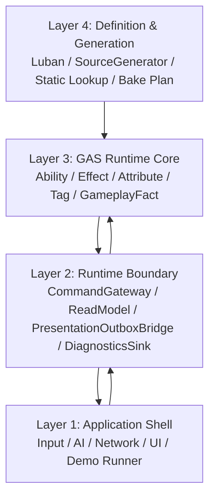

# 总览 Spec

## 目的

定义 EX-GAS 2.0 的目标态：用 Unity ECS/DOTS 表达 GAS 的核心语义，OOP 只保留在应用壳层和运行时边界层；Runtime Core 热路径只使用显式 ECS 数据流。

目标态的第一性技术约束来自 `90-目标态不变量.md`（P0/P1 不变量）和当前路线级 `../UnityDOTS官方文档参考/README.md`。GAS 概念、UE GAS / tranek 文档和历史方案参考只能作为业务语义参考；DOTS 相关设计必须先确认官方文档覆盖主题。Runtime Core 的最终承载机制必须对齐 `../UnityDOTS官方文档参考/主题/01-Entities系统与World.md`，具体编码和业务系统编写必须遵守 `../UnityDOTS官方文档参考/主题/90-规则编号索引.md`，具体 API 选型必须复核 `../UnityDOTS官方文档参考/主题/20-GASRuntimeCore-API选型基线.md`，并用 `../UnityDOTS官方文档参考/主题/12-官方案例模式.md` 对照官方示例实际写法，再用 `../UnityDOTS官方文档参考/主题/21-官方文档覆盖与流程闭环.md` 检查官方文档覆盖矩阵和反哺流程。

## 架构视图

目标态主架构采用四层命名：

| 层级 | 规范中文名 | 职责 |
|---|---|---|
| Layer 1 | 应用壳层 | UI、输入、AI、网络、场景、Demo runner、真实资源或无头 log marker |
| Layer 2 | 运行时边界层 | 命令写入、只读镜像、表现 outbox、诊断与 replay 导出 |
| Layer 3 | GAS 运行时核心层 | GAS 权威状态、规则计算、phase/stream、typed facts |
| Layer 4 | 定义与生成层 | Luban、SourceGenerator、静态定义、BakePlan、validation |

## 现实代码锚点与方案16吸收边界

截至 2026-06-02，目标态 Spec 不能再引用旧“当前架构事实”作为完成证明。当前锚点按现实代码重新定义：

1. **物理 backbone 已有正向基础**：`GASManager` 通过 `GASSystemScheduleContract` 注册 `GASFramePrepareSystemGroup -> GASCommandResolveSystemGroup -> GASCoreSimulationSystemGroup -> GASStructuralCommitSystemGroup -> GASBoundaryProjectionSystemGroup`。这是 `SYS-02` 的当前代码基础。
2. **generated runtime 不是完成证明，而是当前 P0 风险面**：`RuntimeSystemRegistration.gen.cs`、`RuntimeAbilityActivation.gen.cs`、`RuntimeEffectInstant.gen.cs`、`RuntimeActiveEffect.gen.cs` 已经生成并注册 Ability commit、Effect spec build、Attribute reduce/apply、ActiveEffect mutation/tick/remove 等 Runtime lifecycle system。它们只能作为迁移期 evidence，不能作为目标态主线。目标态必须把这些 lifecycle owner 收回到手写 ECS Runtime Core System；SourceGenerator 只保留 definition / blob / lookup / pure glue。
3. **Command/Spec/Delta/Fact 不是纯纸面 Contract**：`GEEffectCommandBuffer -> GEEffectSpecBuffer -> AttributeModifierBuffer -> GameplayEventBuffer` 已有 generated/runtime 执行链，但当前仍是 singleton DynamicBuffer proof carrier，不是 `BUF-02` 意义上的 scale-ready fan-in。
4. **StructuralCommit gate 已有物理承载，但完成度未证明**：`GASStructuralCommitSystemGroup` 和 Begin/End ECB systems 已存在；是否真正收口结构变化必须用 `GasRuntimeOfficialToolDiff` / Entities Journaling / Profiler 证明。
5. **方案16可吸收的部分只进入目标约束，不进入完成清单**：Contract-first、结构变化集中、singleton proof-only、NativeStream deterministic merge、Blob/generated catalog、Journaling 验证均可保留；但原方案中“DOTS 参考目录为空”“架构方向已正确只是实现欠债”“6 个 stream 无条件统一迁移”等判断必须废弃或收窄。

因此，本 Spec 的后续任务拆解必须遵守三个限制：

1. 不把 Contract 字段当实现完成度。
2. 不把 generated code 当黑盒。generated runtime 中的 `ISystem`、system registration、`SystemAPI.Query`、`ComponentLookup` / `BufferLookup`、`EntityManager`、ECB、singleton access、`Complete()` 与 handwritten runtime 接受同一套 DOTS 规则审查；除非标记为 `MigrationProofOnly` 且任务树包含移除计划，否则视为目标态违规。
3. 不把 `RuntimeForbiddenDependencyHits = 0` 当成 SourceGenerator 职责边界完成。generated runtime 还必须证明没有 lifecycle system、system registration、隐藏 query、隐藏 ECB / `EntityManager` 写入和 NativeContainer owner 越权。

## AM 阶段编号定义

本路线使用 AM（Architecture Milestone）作为目标态演进的阶段标记。每个 AM 代表一个可验收的架构里程碑，不表示简单的功能迭代。

| AM 编号 | 名称 | 目标 | 关键交付 |
|---|---|---|---|
| **AM0** | DOTS Physical Backbone | 建立少量物理执行域 SystemGroup / Frame Prepare / Query ownership / Lookup / Allocator / Dependency / Structural Commit / Debugger evidence 的统一骨架 | DOTS Physical Backbone 验收通过 |
| **AM1** | Diagnostics Baseline | Runtime Core Debugger 完成 counters / timing / buffer pressure / sync point 采样 | Debugger summary 可与 Profiler/Journaling 对照 |
| **AM2** | EffectCommand Contract | EffectCommand / TargetData / AttributeModifier / GameplayFact 契约落地，明确 owner-local 与 frame-local fan-in 边界 | simple instant GE 不创建 runtime entity |
| **AM3** | Fan-In to Attribute Apply | Instant GE 全链路迁入 target resolve → effect fan-in → attribute reduce/apply → gameplay fact 主链 | 所有 simple instant producer 迁入；旧 request fallback 仅余复杂 GE |
| **AM4** | Scale-Ready Fan-In | 全局 singleton DynamicBuffer 迁移到 `NativeStream` deterministic merge + compact owner-local range，parallel fan-in 确定性闭合 | merge cost / buffer pressure 达标；battle hash 稳定 |
| **AM5** | Active Effect Store | Duration/Stack/Period/Granted 的 store-driven lifecycle 闭合 | 全部 duration GE 迁入 store；复杂 child GE 闭合 |
| **AM6+** | Full GAS Closure | TargetData / EffectContext / MagnitudeEvaluation / GameplayEvent 全部闭合 | ECS GAS 完整语义闭环 |

AM 编号只表示目标态递进顺序，不代表严格的前置依赖。例如 AM3（Instant Spec）和 AM5（Active Store）可以部分并行推进，但共享的 backbone（AM0）和 contract（AM2）必须先完成。

## 核心结论

1. Gameplay 权威只存在于 ECS 数据和显式 System 调度中。（`SYS-01`）
2. 外部写入只通过 request entity 或等价 command data。（`SEL-01`）
3. 外部观察只通过 fact stream、presentation outbox、replay sink、read model。（`SYS-05`）
4. Definition 不携带 runtime state。（`BAKE-01`）
5. Debugger / Replay / Presentation 只读派生，不反向驱动 Runtime Core。（`DBG-01` `SYS-05`）
6. 命名必须显式表达层级、读写方向和状态归属，禁止继续用万能 `Manager / Helper / Adapter / EventBus` 掩盖混合职责。（`STORE-01`）
7. Runtime Core 的 phase / stream 必须落到 Unity Entities 的 SystemGroup、ISystem、Job、ECB、Enableable、DynamicBuffer、Blob/Baker 和 Query filter 等具体机制。（`SYS-02` `QRY-01` `JOB-01` `ECB-01` `EN-01` `BUF-01` `BAKE-01`）
8. Runtime Core 业务代码必须能说明遵守了哪些 Unity Entities 使用规则，不允许只用”ECS 化”作为实现理由。（`PRF-01`~`PRF-34`）
9. Runtime Core 目标态必须把 Query / Filter / Allocator / Dependency / Chunk layout 当成架构输入，而不是调优阶段才补的实现细节。（`PRF-09` `NAT-01` `PRF-14`）
10. 无头 Demo 只省略真实资源和画面，不省略 Cue / UI / VFX / SFX 的 Boundary 链路；表现资源加载状态不能反向影响 Core simulation。（`ODF-18`）
11. Runtime Core 任务必须能把自己的实现写法映射到 Unity 官方 DocCodeSamples / Tests / PerformanceTests 中的案例模式；若拒绝官方常见模式，必须说明原因和重新选型触发条件。（`CASE-01`~`CASE-47`）
12. Runtime Core / Debugger / Luban / Demo 任务必须能把自己的实现取舍映射到 `../UnityDOTS官方文档参考/主题/21-官方文档覆盖与流程闭环.md` 的官方文档覆盖主题和 `ODF-*` 规则；若某主题暂不相关，必须说明原因。（`ODF-01`~`ODF-18`）
13. Runtime Core 落地顺序遵守 `DOTS Physical Backbone First`：先建立少量物理执行域 SystemGroup / Frame Prepare / Query ownership / Lookup / Allocator / Dependency / Structural Commit / Debugger evidence，再继续扩展 Target Resolve、Effect Fan-In、State Evaluate、Attribute Reduce/Apply 等 GAS kernel lane。（`SYS-01` `SYS-02` `SYS-03` `PRF-04` `PRF-07` `CASE-16`）
14. Runtime Core 新任务必须按业务 kernel lane 归属，而不是按 OOP 类或旧 SpecStream phase 归属；默认 lane 为 Boundary Command Ingest、Target Resolve、Effect Fan-In、State Evaluate、Attribute Reduce/Apply、Gameplay Fact、Structural Commit、Boundary Projection；但 lane 不默认升格为 `ComponentSystemGroup`。
15. EffectCommand / Spec / Delta / Fact 是语义链，不是全局总线；scale-ready 默认是 `NativeStream` deterministic merge + compact owner-local buffer，proof-only singleton DynamicBuffer 不得固化为目标态。（`CASE-12` `NAT-03` `MAT-05` `BUF-02`）
16. Luban / SourceGenerator 进入 Runtime Core 的目标形态是 `GASDefinitionCatalogBlob` + generated code->index lookup + Generated Runtime Glue；Runtime lane 消费 `AbilityActivationPlanRecord`、`GECommandSeedRecord`、`ResolvedModifierRecord` 等 frame-local record，不反查 managed row / JSON / `Dictionary`。这不是审美选择：`BLOB-01` 要求静态定义进入 immutable Blob，`BLOB-02` 要求 `BlobBuilder` 只在 Baking / 初始化期，`SYS-01` 要求权威计算落在 ECS System/Job 数据流，`SYS-03` 指出 system 数量本身是成本源，`QRY-01` / `QRY-04` 要求 hot path job 化并避免高频 random lookup，`SC-01` / `ECB-03` 要求结构变化和 ECB playback 归属明确 phase，`NAT-03` 要求 NativeStream fan-in 有确定性 merge 和预算，`BUR-01` 要求 hot path Burst 且无托管依赖。因此 SourceGenerator 不得生成 Runtime Core lifecycle system、system registration、query owner、ECB owner、EntityManager write 或 NativeContainer owner。
17. SourceGenerator 只能生成 definition / Blob / lookup / pure glue / validation / Baker 或 Bootstrap artifact；不得生成 Runtime Core lifecycle system、system registration、隐藏结构变化、隐藏 query、NativeContainer owner 或 gameplay schedule owner。具体论证见 `15-Luban-SourceGenerator链路复审与目标重划.md`。
18. AutoChessDemo 是 Layer 1 业务验收 Demo，不是 Runtime Core 样例或测试 harness。它允许拥有一个面向业务的 Battle Runtime Adapter seam，但该 seam 必须是薄 interface、深 implementation：对外只暴露 battle runtime 动作，对内分类承载 RuntimeHost、CatalogSession、BattleEntityLifecycle、ObservationGateway；不得把 `EntityManager`、Debugger、catalog、业务决策和 validation policy 混成万能 adapter。
19. Validation evidence 是一等事实模型，不是字符串日志。Headless runner、scene runner、Profiler pass 和 official diff pass 必须导出同构 evidence，包含 world time policy、proof-only API、reselect trigger、官方工具证据、API health 和业务验收字段。

## Runtime Core 物理执行域与 Kernel Lane 划分

| 物理执行域 SystemGroup | Kernel lane | 数据所有权 |
|---|---|---|
| `GASFramePrepareSystemGroup` | Frame Prepare | allocator、lookup refresh budget、dependency counters；不集中持有 query |
| `GASCommandResolveSystemGroup` | Boundary Command Ingest | 低频 Boundary request entity / Core 高频 `AbilityActivationCommandRecord` |
| `GASCommandResolveSystemGroup` | Target Resolve | `AbilityTargetRecord` NativeStream / request-owned `TargetDataBuffer`（低量物化）/ deterministic target sort key |
| `GASCoreSimulationSystemGroup` | Effect Fan-In | `NativeStream` producer + deterministic merge + compact owner-local command range |
| `GASCoreSimulationSystemGroup` | State Evaluate | `AbilityStateComponent`、`ActiveGameplayEffectBuffer`、status bit field、chunk skip cache |
| `GASCoreSimulationSystemGroup` | Attribute Reduce / Apply | target-grouped modifier reduce；attribute / tag / status 写入 |
| `GASCoreSimulationSystemGroup` | Gameplay Fact | Core reaction facts；Ability trigger / reactive GE |
| `GASStructuralCommitSystemGroup` | Structural Commit | custom ECB playback / EntityQuery bulk / `ComponentTypeSet` |
| `GASBoundaryProjectionSystemGroup` | Boundary Projection | read model、presentation outbox、replay、debugger samples |

## DOTS Physical Backbone First

四层架构只定义工程职责边界，不替代 Unity DOTS 的执行机制。Runtime Core 进入更多功能迁移前，必须先拥有可验收的 frame backbone：

1. `GASFramePrepareSystemGroup` 只负责 lookup refresh budget、frame scratch、allocator 和 dependency counters；EntityQuery 由各 `ISystem` 通过 `SystemState.GetEntityQuery` 自行拥有。
2. command / target / modifier / fact / active slot 必须声明 owner、clear phase、merge policy、deterministic ordering 和重新选型触发条件。
3. `GASStructuralCommitSystemGroup` 是 hot path 唯一结构变化屏障；其他 kernel 禁止直接做 `EntityManager` 结构变化。
4. Runtime Core Debugger 必须同时输出 physical group counters 与 kernel lane counters，并能与 Unity Profiler / Entities Journaling / Burst evidence 对照。
5. AM3 / AM5 后续任务只能在该 backbone 上扩展，不允许继续把旧 lifecycle mirror、singleton SpecStream 或 runtime GE entity churn 当作目标态主线。
6. Frame Prepare 不能升级为中央 registry / service locator；query owner、buffer owner 和 stream owner 必须在具体 lane system 中声明。
7. 新增 SystemGroup 必须通过 `SYS-03` / `PRF-07` 审查：只有引入新的同步/结构变化/投影物理边界时才允许新增 group。

## 当前优先 Spec

1. [03-RuntimeCore管线Spec](03-RuntimeCore管线Spec.md) — DOTS Kernel SystemGroup、Component 读写矩阵、Frame Prepare 物理设计、完整代码骨架
2. [13-EntityComponent物理布局Spec](13-EntityComponent物理布局Spec.md) — Entity/Component 布局、Archetype 审计、Buffer 容量策略
3. [04-EffectCommand-SpecStream-AttributeDeltaSpec](04-EffectCommand-SpecStream-AttributeDeltaSpec.md)
4. [07-RuntimeCoreDebuggerSpec](07-RuntimeCoreDebuggerSpec.md)
5. [08-Luban-SourceGenerator配置生成链路Spec](08-Luban-SourceGenerator配置生成链路Spec.md)
6. [14-CodeGen到Runtime新链路重构计划](14-CodeGen到Runtime新链路重构计划.md)
7. [15-Luban-SourceGenerator链路复审与目标重划](15-Luban-SourceGenerator链路复审与目标重划.md)
8. [12-命名规范Spec](12-命名规范Spec.md)
9. [UnityDOTS官方文档参考](../UnityDOTS官方文档参考/README.md)
10. [GAS Runtime Core API 选型基线](../UnityDOTS官方文档参考/主题/20-GASRuntimeCore-API选型基线.md)
11. [官方文档覆盖与流程闭环](../UnityDOTS官方文档参考/主题/21-官方文档覆盖与流程闭环.md)
12. [DOTS编写规范与性能陷阱](../UnityDOTS官方文档参考/主题/13-DOTS编写规范与性能陷阱.md)

## 禁止方向

1. 不恢复旧 OOP runtime 主链。
2. 不把托管 EventBus / Logger 作为 simulation 路由。
3. 不让 SourceGenerator 发明 gameplay lifecycle。
4. 不把自走棋 replay/log 当 simulation 输入。
5. 不用自定义 ECS 抽象绕过 Unity Entities 的结构变化、sync point、DynamicBuffer handle、query filter 和 baking 规则。
6. 不在缺少 Unity Entities 使用规则检查表的情况下推进 Runtime Core 代码任务。
7. 不在缺少 DOTS API 选型复核的情况下把 DynamicBuffer、ECB、Enableable、request entity 或 singleton 固化为最终承载。
8. 不用 `avgTickMs`、单个 system timing 或项目内部日志替代 Unity Profiler / Journaling / Burst Inspector 等官方证据。
9. 不让 generated code 隐藏 query、allocator、system 调度、结构变化或 runtime lifecycle。
10. 不把官方入门示例的主线程 foreach、ECB immediate playback、SceneSystem load 等边界用法直接搬进 Runtime Core hot path。
11. 不把官方文档结论只停留在摘要；必须通过 `../UnityDOTS官方文档参考/主题/21-官方文档覆盖与流程闭环.md` 的覆盖矩阵和 `ODF-*` 规则进入行动报告、任务树和验收指标。
12. 不把 Frame Arena 写成 query/lookup/service registry；Runtime Core 不接受中央 manager 型 ECS 抽象。
13. 不把大容量全局 singleton DynamicBuffer 或大容量 per-ASC frame buffer 当作默认 scale-ready fan-in 方案。
14. 不把 AutoChessDemo 的 `GameRoomFactory`、runner serialized fields 或 generated managed row array 当作 unit/scenario/scale/validation 的长期事实源；这些必须迁入 Luban / SourceGenerator 生成物。
15. 不把 hard-coded execution calculation code / formula 写在 Demo ECS system 中作为目标态；execution formula 必须进入 generated evaluator / batch path。

## 历史方案定位

1. 四层工程模型来自 `../历史方案参考/方案15.md:35-50`，但本路线将原始“业务层 / 适配层 / ECS核心层 / 数据配置层”重新命名为“应用壳层 / 运行时边界层 / GAS运行时核心层 / 定义与生成层”。
2. Luban / SourceGenerator 进入定义与生成层的设计信号来自 `../历史方案参考/方案14.md:100-118`。
3. 适配层“翻译而非计算”的边界来自 `../历史方案参考/方案15.md:473-490`。
4. OOP Shell 与 ECS Core 单向边界的缺失诊断来自 `../历史方案参考/方案15.md:2843-2857`。
