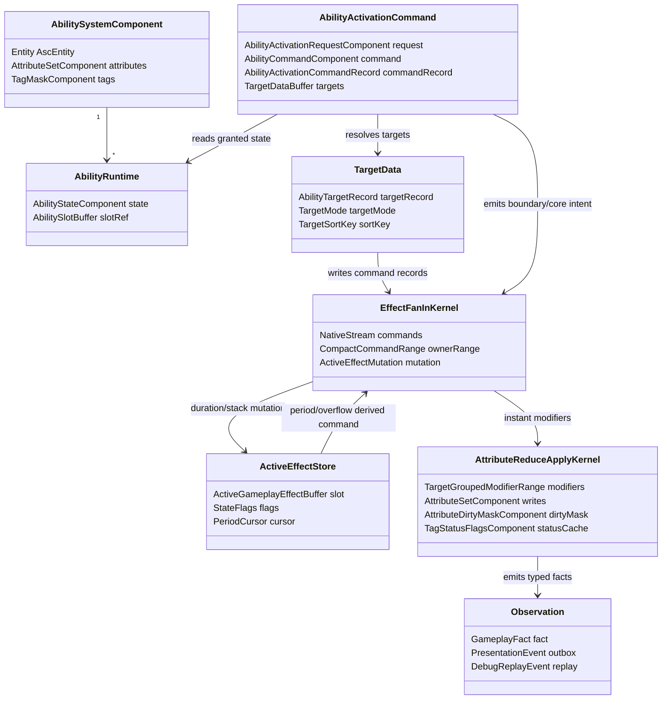

# GAS 概念模型 Spec

## 目的

定义 GAS 概念在 Unity ECS 版 EX-GAS 2.0 中的目标表达。

本文件只负责概念到 ECS 目标表达的静态映射。真实业务链路中的 owner、生命周期、临时 record、Boundary 投影和 OOP Shell 边界见 [01B-GAS业务语义链路概念设计Spec](01B-GAS业务语义链路概念设计Spec.md)。

## 概念映射

| GAS 概念 | Unity ECS 目标表达 | 权威边界 |
|---|---|---|
| ASC | Entity + ASC components / buffers | Simulation |
| Ability | Ability entity + cross-frame runtime state；Boundary request entity 或 frame-local command record 承载单次激活上下文 | Simulation |
| GameplayEffect | Effect fan-in command record / active effect slot / typed fact | Simulation |
| Attribute | generated AttributeSet family + target-grouped modifier reduce/apply + dirty mask | Simulation |
| GameplayTag | Dense tag mask / requirement query | Simulation / Definition |
| TargetData | command record target params / `AbilityTargetRecord` NativeStream / request-owned result buffer（低量物化）/ deterministic sort key | Simulation / Boundary |
| GameplayCue | Cue request + presentation marker | Observation / Presentation |
| EffectContext | Runtime context metadata | Simulation |
| Spec / Delta / Fact | 语义链路，不等同全局 stream；目标态由 Effect Fan-In、Attribute Reduce/Apply、Gameplay Fact 分段承载 | Simulation |
| Debug / Replay | Derived facts and diagnostics | Observation |

## 官方依据与设计论证

| 目标态选择 | 官方规则依据 | 为什么更优秀 | 为什么有必要 |
|---|---|---|---|
| ASC / Ability / Effect / Attribute / Tag 的权威状态只落在 Runtime Core ECS 数据上 | `SYS-01`、`SYS-02`、`QRY-01`、`JOB-01` | 让 gameplay 结果由 SystemGroup、System、Job、Component/Buffer/Blob 的显式数据流决定，Profiler/Journaling 可归因 | OOP `ASC` / Ability object 若持有权威状态，会把调度、依赖和写集合藏进托管对象，破坏 Burst 与确定性审查 |
| 单次 Ability Activation 是 frame-local command / target / spec record，不是 Ability Entity 状态字段 | `SC-01`、`SEL-01`、`PRF-01`、`QRY-04` | 把低频外部意图和高频 target/effect fan-in 拆开，避免每个 target/effect 都创建实体或随机写跨 owner 状态 | 真实业务中 AOE、连击、被动触发会产生大量临时上下文；默认实体化会制造 archetype churn 和结构变化热点 |
| Instant GE 默认是 EffectCommand / modifier record，Duration/Stack/Period 才进入 ActiveEffectStore | `CASE-12`、`NAT-03`、`BUF-01`、`FSM-02`、`FSM-05` | instant 路径可通过 NativeStream deterministic merge 和 target-grouped apply 批处理；跨帧 effect 则有明确 owner-local slot | 把 simple instant GE 默认做 runtime GE entity 会把瞬时计算伪装成生命周期对象，增加清理和同步成本 |
| Attribute / GameplayTag 默认按热路径布局为 AttributeSet family、dirty mask、tag/status bitset | `PRF-03`、`PRF-10`、`PRF-26`、`QRY-04`、`EN-01` | 读写字段分离、状态 bitset 和 owner-local buffer 能减少 archetype 数、误触发和 random lookup | “一属性一 component / 一 tag 一 component”在 GAS 规模下会放大 query、archetype 和 change filter 成本 |
| GameplayCue / Debug / Replay 只作为 Boundary 派生事实 | `SYS-05`、`DBG-01`、`ODF-07`、`ODF-18` | 表现、日志和回放可以复用同一 typed fact / diagnostics snapshot，不反向污染 simulation | UI/VFX/SFX/Debugger 若反向驱动 gameplay，会让无头验收、实机场景和 replay 的结果分叉 |

## UML 概念图

## 不变量

1. Ability Entity 保存 granted ability 的跨帧状态，不承载单次激活上下文，也不直接写 Attribute。
2. TargetData 承载目标选择结果和确定性排序键，从 frame-local command/target record 或 request/command entity 流入 Effect Fan-In；每个 target 可以产生 command record，但不等于每个 target 创建 request/runtime entity。
3. GameplayEffect 改变状态，但 instant effect 不应默认创建 runtime GE entity；duration/stack/period 默认进入 ASC owner-local active effect slot。
4. Attribute / Tag 是判定和聚合结果，不是 OOP callback 入口；Attribute 默认按真实 DOTS 热路径生成 AttributeSet family，不按每个属性生成一套 component/system；高频 status 默认进入 bitmask / status flags。
5. Spec / Delta / Fact 是语义链路，不是一个全局 bus；物理上分别归 Effect Fan-In、Attribute Reduce/Apply、Gameplay Fact kernel。
6. Cue / Presentation 观察事实，不决定 gameplay。
7. 任一 GAS 概念进入 Runtime Core 前，必须先分类为 ECS 权威状态、frame-local record、Boundary 投影或 Definition 输入；未分类的概念不得直接落成 component、system、adapter 或 generated artifact。
8. OOP 类型可以表达业务入口、外部资源或只读视图，但不能成为 Ability / Effect / Attribute / Tag 的 gameplay owner。

## 历史方案定位

1. Ability / Effect / Attribute / Tag 作为 ECS Core 的概念切分来自 `../历史方案参考/方案11.md:20-43`。
2. 用 unmanaged 数据和 Burst-friendly system 承载 Ability 语义的信号来自 `../历史方案参考/方案14.md:122-180`。
3. 外部业务只通过 facade / command 进入 GAS 的信号来自 `../历史方案参考/方案10.md:433-563`。
