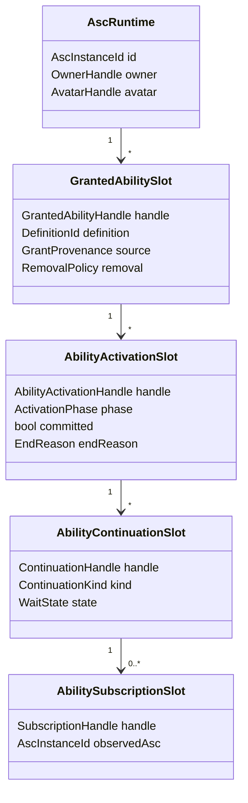

# GAS 概念模型 Spec

## 目的

定义 UE GAS 领域语义在 Unity DOTS 目标态中的静态映射。本文件只裁决“概念是什么、由谁拥有、生命周期如何关联”，物理 phase、Job、Tick Scratch 与结构提交分别引用 [03A-执行域与数据流](03-RuntimeCore管线/03A-执行域与数据流Spec.md)、[03C-SystemGroup合约与核心数据形态](03-RuntimeCore管线/03C-SystemGroup合约与核心数据形态Spec.md)、[03E-EffectFanIn-State-Attribute-Fact](03-RuntimeCore管线/03E-EffectFanIn-State-Attribute-FactSpec.md)、[03F-StructuralCommit与BoundaryProjection](03-RuntimeCore管线/03F-StructuralCommit与BoundaryProjectionSpec.md) 与 [03G-Component矩阵-TickScratch-Job拓扑](03-RuntimeCore管线/03G-Component矩阵-TickScratch-Job拓扑Spec.md)。

目标态保留 UE GAS 的领域分层，不迁移其 UObject、delegate、Actor 生命周期和网络实现偶然性：

```text
AbilityDefinition → GrantedAbilitySpec → AbilityActivation → Continuation
GameplayEffectDefinition → GameplayEffectApplicationSpec → ActiveEffect
```

## 概念映射

| GAS 概念 | Unity DOTS 目标表达 | 权威边界 |
|---|---|---|
| ASC | ASC Entity + `AscInstanceId` + Owner/Avatar binding + Attribute/Tag 状态 + owner-local slabs | Simulation |
| Ability Definition | immutable Blob definition + semantic version/content hash | Definition |
| Granted Ability Spec | ASC-local `GrantedAbilitySlot`，保存 definition、level、input、grant provenance 与 removal policy | Simulation |
| Ability Activation | ASC-local `AbilityActivationSlot`，每次激活独立保存 phase、commit、context、owned contributions 与结束原因 | Simulation |
| AbilityTask / Continuation | ASC-local `AbilityContinuationSlot`；外部等待另有目标 ASC-local `AbilitySubscriptionSlot` | Simulation |
| Cooldown Gate | source ASC-local `CooldownGateSlot`，保存 gate identity、Commit provenance、Start/EndTick 与可选 Tag contribution owner；不属于 Activation 或 ActiveEffect | Simulation |
| GameplayEffect Definition | immutable Blob definition，描述 modifier、execution、duration、stack、requirement、grant 与 cue | Definition |
| GameplayEffect Application Spec | 与 definition 分离的 runtime value，保存 source capture、SetByCaller、context；每目标产生独立 target application view | Simulation / Frame-local or continuation-owned |
| Active GameplayEffect | ASC-local `ActiveEffectSlot`，只表示已成功应用且跨帧存活的 duration/infinite/stack/period 状态 | Simulation |
| Instant GameplayEffect | 消费 Application Spec 后执行，不创建 ActiveEffectSlot | Simulation / Frame-local |
| Attribute / Aggregator | Session `AttributeLayout` + 固定长度 `AttributeValueSlot { Base, Current, Revision }` + contributor accumulator；generated 代码只提供 id/index/layout/init projection 与纯访问器，snapshot 由声明式 Capture contract 投影 | Simulation |
| GameplayTag | 层级 tag id、reference count、requirement/query 与稳定态 transition | Simulation / Definition |
| GameplayEvent | 带冻结 payload 的瞬时消息；不增加 OwnedTag count | Simulation |
| GameplayCue | OnActive / WhileActive / Executed / Removed 的 Boundary outbox | Observation / Presentation |
| TargetData | activation/continuation 拥有的不可变 payload，或 tick-local target record | Simulation / Boundary |
| EffectContext | Instigator、EffectCauser、SourceObject、origin/hit、Ability/Effect provenance 的不可变上下文 | Simulation |
| Debug / Replay | 从相同 identity、command 与 typed fact 派生的只读证据 | Observation |

## ASC-local Handle 与 Slab 模型

v1 的 GrantedAbility、Activation、Continuation、Subscription 与 ActiveEffect 都使用 ASC-local、非压缩、带代数的 slot：

```text
Handle = (OwnerAscInstanceId, SlotIndex, Generation)
```

句柄形状相同不代表类型可互换。Runtime、生成代码、命令和调试协议必须使用独立强类型：

- `GrantedAbilityHandle`
- `AbilityActivationHandle`
- `ContinuationHandle`
- `SubscriptionHandle`
- `ActiveEffectHandle`

若统一序列化为无类型字节布局，必须显式携带 `HandleKind`。`OwnerAscInstanceId` 必须与 `SimulationEpoch` 共同保证跨世界不复用；Generation 仅在 slot 真正回到 free-list 时递增。

Slab 生命周期固定为：

```text
Free → Live → Tombstone → Free(next Generation)
```

约束：

1. 禁止 compact、swap-back 或任何改变 Live SlotIndex 的整理。
2. Tombstone 仍属于旧 Generation；只有子记录、subscription、queued command 和 cleanup 引用全部释放后才能回收。
3. 队列必须复制所需 payload，不能长期依赖 tombstone 作为事件数据仓库。
4. stale handle 必须确定性失败，绝不能命中复用后的新对象。
5. Slab 是 gameplay 权威；projectile、aura 等需要空间查询或独立生命周期的派生 Entity 只能复制不可变 provenance，不反向成为 Activation/ActiveEffect authority。

## Ability 领域关系与并发


```mermaid
classDiagram
    class AscRuntime {
        AscInstanceId id
        OwnerHandle owner
        AvatarHandle avatar
    }
    class GrantedAbilitySlot {
        GrantedAbilityHandle handle
        DefinitionId definition
        GrantProvenance source
        RemovalPolicy removal
    }
    class AbilityActivationSlot {
        AbilityActivationHandle handle
        ActivationPhase phase
        bool committed
        EndReason endReason
    }
    class AbilityContinuationSlot {
        ContinuationHandle handle
        ContinuationKind kind
        WaitState state
    }
    class AbilitySubscriptionSlot {
        SubscriptionHandle handle
        AscInstanceId observedAsc
    }

    AscRuntime "1" --> "*" GrantedAbilitySlot
    GrantedAbilitySlot "1" --> "*" AbilityActivationSlot
    AbilityActivationSlot "1" --> "*" AbilityContinuationSlot
    AbilityContinuationSlot "1" --> "0..*" AbilitySubscriptionSlot
```

一个 GrantedAbilitySpec 可以按 activation policy 并发产生多个 Activation；一个 Activation 可以同时拥有多个 persistent/one-shot Continuation，同名 Continuation 也不得互相覆盖。外部 ASC 上的 Subscription 反向指向 `(AbilityActivationHandle, ContinuationHandle)`，投递和取消均校验两级 Generation。

Activation 至少区分 `RunningUncommitted / Committed / Ending / Ended`。CanActivate 与 Commit 是两个不同检查点：Ability 可以先激活、等待目标或输入，再在 Commit 时重新检查 cost/cooldown；Commit 只能成功一次。Activation End/Cancel 必须只撤销该 Activation 自己贡献的 tags、blocks、cues、subscriptions 与 continuations。已 Commit 冷却的 owner 是 `CooldownGateSlot`，它持续到 `EndTick` 或显式的 cooldown removal policy，不随 Activation Cancel/End 清理。

## GameplayEffect Spec 与 ActiveEffect 分离

`GameplayEffectApplicationSpec` 不是 `ActiveEffectSlot`：

1. Spec 在应用前保存 DefinitionId、Level、SetByCaller、source capture 与 EffectContext。
2. 同一 source Spec 应用到多个目标时，每个目标建立独立 target capture/application view；target 数据不得写回并污染其他目标。
3. Instant Effect 消费 Spec 后结束，不创建 ActiveEffectHandle，但仍必须有 `EffectApplicationId`。
4. Duration/Infinite Effect 成功应用后才创建或合并到 ActiveEffectSlot；stack 合并时 `EffectApplicationId` 与 `ActiveEffectHandle` 仍是两个身份。
5. 跨 tick 待应用 Spec 必须由 Continuation 拥有不可变 payload，或由专用持久 payload handle 拥有，不能引用 tick-local scratch。

ActiveEffectSlot 保存 target-local runtime copy、duration/period/stack、inhibition、modifier contributor、grant/cue ownership 与 removal reason。Definition 永远不可被 runtime slot 修改。

## 领域身份与 Provenance

即使 v1 不做网络预测和复制，也必须保留：

- `SimulationEpoch + AscInstanceId`
- DefinitionId、semantic version/content hash
- Granted/Activation/Continuation/Subscription/ActiveEffect typed handles
- `EffectSpecId`、`EffectApplicationId`、`ContributorId`、`CueLifecycleKey`
- SourceASC / TargetASC
- Owner / Avatar 的独立身份
- Instigator / EffectCauser / SourceObject
- Ability/Effect definition、level、SetByCaller、TargetData、origin/hit
- granting effect/source 与 removal policy
- parent causality、emit tick/phase/sequence、end/removal reason

`CausalityId` 只用于确定序、诊断与环检测，不表示预测确认关系。

## 时序语义边界

v1 采用 **stable-state deferred reaction**：GameplayEvent、OwnedTag 触发 Ability、外部 Continuation 唤醒和跨 ASC reaction 默认在下一 tick 投递。Payload/Context/TargetData 固定于发射时；投递时的 CanActivate 与当前状态检查读取下一 tick 的稳定状态。

以下仍属于同 tick kernel invariant：application requirement/immunity、stack 决策、commit、attribute execute/clamp、贡献增删、ongoing/inhibition 稳定化，以及生成期证明闭合、完全展开、有限且静态有界的 definition-local DirectEffectProgram。该选择与 UE GAS 默认同步、可重入回调存在明确时序差异；完整规则见 [01B-GAS业务语义链路概念设计](01B-GAS业务语义链路概念设计Spec.md)。

## 非预测 v1 边界

v1 schema 与 API 不得包含占位式 Prediction 字段，包括 `PredictionKey`、Base/Scoped PredictionKey、Predicting/Confirmed/Rejected、`IsPredicted`、`IncludePredictiveMods`、prediction journal、ack/caught-up/reject delegate、预测 instant overlay 和 redo suppression。

未来 Prediction/Replication 必须作为独立 correlation/reconciliation 层设计，不得复用 slot Handle 或 CausalityId。

## 不变量

1. Definition、GrantedSpec、Activation、Continuation 与 Effect Application Spec/ActiveEffect 必须保持分层，不能压成同一种 row 或 slot。
2. ASC owner-local slab 是 GrantedAbility、Activation 与 ActiveEffect 的唯一 gameplay authority；派生 Entity 只承载 projectile/aura 等结构对象。
3. 任一贡献必须带稳定 ContributorId，并能按所属 Activation 或 ActiveEffect 精确撤销。
4. Owner 与 Avatar、Instigator 与 EffectCauser 不得合并为单字段。
5. Instant Effect 不创建 ActiveEffectSlot；stack application 不以 ActiveEffectHandle 替代 EffectApplicationId。
6. Capture 只能按生成期封闭的投影契约读取；不能把“最终返回 float”自动解释成 ScalarSnapshot 安全。
7. GameplayEvent、OwnedTag 与 GameplayCue 是不同语义通道，不能互相替代。
8. 默认 reaction 下一 tick；需要 same-tick 正确性的逻辑必须属于 kernel invariant，或闭合、有限、静态有界且不读取 post-apply fact 的 DirectEffectProgram。
9. Cue / Presentation 观察事实，不决定 gameplay。
10. v1 不保留任何 Prediction schema 占位。

## 历史方案定位

1. Ability / Effect / Attribute / Tag 作为 ECS Core 的概念切分来自 `../历史方案参考/方案11.md:20-43`。
2. unmanaged、Burst-friendly Runtime Core 的设计信号来自 `../历史方案参考/方案14.md:122-180`。
3. 外部业务只通过 facade / command 进入 GAS 的信号来自 `../历史方案参考/方案10.md:433-563`。
4. 历史方案仅作为来源线索；本文件的 owner-local generational slab、Capture 与 deferred reaction 裁决优先。
