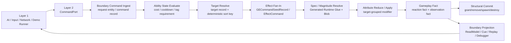

# GAS 业务语义链路概念设计 Spec

## 目的

本文件记录 GAS 架构概念设计审查后的目标态结论：EX-GAS 2.0 不是把 UE GAS 的 OOP 类层级迁移到 Unity ECS，也不是在 ECS 外包一层 OOP runtime facade。目标态必须把 GAS 概念拆成三类事实：

1. **ECS 权威状态**：跨帧存在、决定 gameplay 结果、必须由 Runtime Core System / Job 写入。
2. **frame-local record**：本帧 command / target / spec / delta / fact 的中间计算数据，优先由 buffer、`NativeStream`、chunk-local scratch 或 compact owner-local range 承载。
3. **Boundary 投影**：ReadModel、Presentation、Replay、Debugger、structured log 等只读派生结果，不反向驱动 simulation。

因此，目标态评审 GAS 概念时不再问“这个概念对应哪个类”，而是问：

| 问题 | 目标态回答 |
|---|---|
| 谁拥有权威状态？ | 只有 Layer 3 GAS Runtime Core 的 Entity / Component / Buffer / Blob / System / Job |
| 谁能写 gameplay？ | Runtime Core lane system；外部只能写 request / command data |
| 谁是临时上下文？ | frame-local record，不创建 runtime entity、不进入跨帧 store |
| 谁是观察事实？ | typed fact / outbox / read model / diagnostics snapshot |
| 谁能访问 OOP？ | Layer 1 / Layer 2 managed bridge；不得进入 Core hot path |

## 官方依据与设计论证

GAS 概念身份必须先按数据性质分类，而不是先找 OOP 类名。`SEL-01` 要求 Gameplay / Transient / Telemetry / Presentation 分别选型；`SYS-01` 要求 gameplay 权威由 ECS System / Job 数据流拥有；`SYS-05` 要求 Debugger / Demo / Presentation 只能通过 Boundary 观察 Core。因此 Ability、GameplayEffect、Attribute、Tag、Cue、Debugger 和 Replay 的 owner 必须先由权威状态、frame-local record、Boundary 投影或 Definition 输入决定。

这套身份矩阵比 OOP facade 更优，是因为它直接约束 hot path 形态：`PRF-01` 禁止临时状态默认实体化，`PRF-03` 禁止高频 tag/status 用 tag component add/remove，`SC-01` / `ECB-03` 要求结构变化归入明确 phase，`NAT-03` / `BUF-02` 要求 fan-in 承载有确定性 merge 与容量预算。没有这些分类，业务调用链会把 cost/cooldown/target/effect/fact/presentation 混到同一个 adapter 或 event bus 中，Debugger 也无法定位性能热点。

Luban + SourceGenerator 同样服务这套分类：`CASE-07`、`BLOB-02`、`CONTENT-01`、`BUR-01` 支持 definition 进入 immutable Blob 和 Burst-compatible glue；它们不支持 Runtime Core hot path 反查 managed row、JSON、`Dictionary` 或托管 delegate。因此 generated code 的目标是 pure record builder / lookup / evaluator，而不是 OOP runtime layer。

## 业务链路闭环

真实业务中的一次“棋子释放技能并造成伤害”在目标态必须按下列链路闭合：



这条链路的核心约束：

1. Ability 激活不是 OOP `Activate()` 回调，而是 Command Ingest + State Evaluate + Effect Fan-In 的 ECS 数据流。
2. GameplayEffect 不是默认 runtime entity；simple instant GE 默认是 frame-local command / spec / modifier record。
3. Attribute 不是散落回调入口；Attribute 写入必须在 target-grouped reduce/apply lane 中集中完成。
4. GameplayTag / status 不是高频 tag component add/remove；默认是 mask / enum / bit field，只有被 profiler 证明的 skip 场景才引入 enableable。
5. GameplayCue / UI / VFX / SFX 是 Boundary Projection，不允许反向决定 gameplay。
6. Gameplay Fact 是 reaction 的 typed input，但默认写 next-frame command seed；同帧连锁必须显式 bounded reaction pass。

## GAS 概念身份矩阵

| GAS 概念 | 目标身份 | 权威 owner | 允许承载 | 禁止承载 |
|---|---|---|---|---|
| ASC | gameplay owner entity | Runtime Core | stable archetype + AttributeSet family + tag/status mask + owner-local buffers | MonoBehaviour 状态副本、OOP `ASC` 中间层、逐组件临时拼装 |
| Ability Definition | 不可变定义 | Definition & Generation | `GASDefinitionCatalogBlob`、definition index、generated lookup | runtime managed row、`Dictionary`、ScriptableObject hot lookup |
| Granted Ability | 跨帧授权状态 | Runtime Core | Ability entity / owner slot / state component / cleanup path | 应用层对象持有可写 cooldown/cost/state |
| Ability Activation | 本帧意图与评估过程 | Runtime Core lane | request entity（低频）、command record、frame-local target/spec records | 每次激活一个 OOP action object 参与 Core hot path |
| TargetData | 本帧目标选择结果 | Target Resolve lane | `AbilityTargetRecord`、request-owned result buffer、deterministic sort key | OOP target catcher 直接写 Attribute / Effect |
| GameplayEffect Definition | 不可变效果定义 | Definition & Generation | Blob range、effect code、generated seed builder | runtime GE config registry hot path |
| Instant GameplayEffect | 本帧 effect command/spec/delta | Effect Fan-In / Attribute lane | `NativeStream`、compact owner-local range、chunk scratch | per-hit runtime GE entity、per-hit request entity |
| Duration / Stack / Period GE | 跨帧 active slot 状态 | ActiveEffectStore lane | ASC owner-local `ActiveGameplayEffectBuffer` + enum/bit flags | 每个 active effect 默认独立 entity 且高频结构变化 |
| Attribute | gameplay 数值权威 | Attribute Reduce/Apply lane | generated AttributeSet family、dirty mask、target-grouped modifier reduce | 一属性一 system 默认化、managed callback 写值 |
| GameplayTag / Status | 判定状态与 requirement 输入 | State / Tag lane | dense mask、requirement mask、status flags、必要的 enableable skip cache | 高频 tag component add/remove、OOP tag event bus |
| EffectContext | frame-local 上下文元数据 | Effect Fan-In lane | context id、source/target、level、set-by-caller slice | 托管对象引用、跨帧完整上下文对象 |
| Gameplay Fact | typed gameplay 事实 | Gameplay Fact lane | CoreReactionFact、BoundaryObservationFact、fact stream / range | 全局 OOP EventBus 作为 simulation 主路由 |
| GameplayCue | 表现请求 | Boundary Projection | presentation marker、outbox、resource load marker | Core 直接实例化资源或读取表现完成状态 |
| Debug / Replay | 诊断与回放事实 | Runtime Boundary | diagnostics snapshot、official tool diff、structured export | Debugger / log 反向修正 gameplay |

## OOP Shell 与 Thin Adapter 结论

OOP 层是必要的，但只能出现在 Layer 1 / Layer 2：

| 层 | 允许职责 | 禁止职责 |
|---|---|---|
| Application Shell | UI、输入、AI、网络、场景、Demo runner、业务用例编排 | 直接写 Runtime Core component / buffer；持有 gameplay 权威副本 |
| Runtime Boundary | command gateway、read model、presentation outbox、diagnostics/replay sink、official diff | 伤害、治疗、cost、cooldown、requirement、stack、period 等 gameplay 计算 |
| GAS Runtime Core | 纯 ECS gameplay 计算、状态写入、typed fact 产出 | 依赖 managed bridge、调用 MonoBehaviour、读取 UI / resource / log |

Thin Adapter 的目标不是“给 ECS 包一层好用 API”，而是把外部业务的生命周期差异隔离掉。它必须满足：

1. 对外 interface 用业务动作命名，例如 open battle、spawn unit、issue ability intent、tick、export snapshot。
2. 对内 implementation 可以接触 `EntityManager`，但必须按 RuntimeHost、CatalogSession、EntityLifecycle、ObservationGateway 等 owner 分类。
3. 任何 direct `EntityManager` 使用都必须标注 bootstrap、structural lifecycle、observation-only 或 core tick；不能混在一个万能 adapter 方法里。
4. Adapter 不做 gameplay 计算；它只把业务意图写成 request / command data，并把事实投影成 read model / marker。

## Debugger 概念结论

GAS Runtime Core 对 Debugger 的依赖不是“打日志”，而是产出可复核的诊断事实。目标态 Debugger 必须证明：

| 诊断问题 | 必须输出 |
|---|---|
| 业务语义发生了什么？ | command/spec/delta/fact/cue/presentation 的 typed counters 与 context id |
| 性能热点在哪个物理域？ | SystemGroup / lane / job timing、query matched chunks、lookup update、dependency wait |
| 哪个承载开始退化？ | buffer length/capacity/spill、NativeStream block/merge cost、random lookup ratio |
| 是否存在结构变化污染？ | ECB playback count、entity create/destroy/add/remove owner、sync point warning |
| 是否符合 DOTS 官方工具证据？ | Entities Journaling / Profiler / Burst / PackageCache evidence 或 disabled reason |

Debugger 是 Runtime Boundary 的证据出口，不是 Core 的控制入口。所有图表、时序图、中文战斗日志、Mermaid 数据流图都必须从同一个 validation evidence / diagnostics snapshot 派生。

## Luban + SourceGenerator 概念结论

Luban 配置链路的潜力不在于“少写 Runtime 代码”，而在于把配置事实压缩成 Runtime Core 可 Burst 消费的不可变数据和纯函数 glue。

目标职责：

| 生成物 | 允许 | 禁止 |
|---|---|---|
| stable id / code | 是 | 无 |
| Blob schema / catalog builder | 是，构建期 / bootstrap owner | Runtime Core hot path 调 builder |
| generated lookup | 是，返回 index / range / `ref readonly` blob | 返回 managed row / 按值复制 Blob 元素 |
| generated evaluator / static switch | 是，纯函数 + unmanaged record | 托管 delegate、strategy object、生命周期 system |
| Baker / Bootstrap glue | 是，构建不可变 catalog | 发明 gameplay lifecycle |
| validation report | 是，检查生成边界和 DOTS 规则 | 只检查命名，不检查 lifecycle / query / ECB / NativeContainer ownership |
| Runtime Core `ISystem` | 否 | 任何 generated `OnUpdate` / system registration 都不是目标态 |

因此，SourceGenerator 的正确输出是：

```csharp
public readonly struct AbilityActivationPlanRecord
{
    public readonly int AbilityDefinitionIndex;
    public readonly int CostEffectRangeStart;
    public readonly int CostEffectRangeCount;
    public readonly int CooldownEffectRangeStart;
    public readonly int CooldownEffectRangeCount;
}

public readonly struct GECommandSeedRecord
{
    public readonly int GameplayEffectDefinitionIndex;
    public readonly int ModifierRangeStart;
    public readonly int ModifierRangeCount;
    public readonly int RequirementMaskIndex;
}

public static class GASGeneratedRuntimeDefinitionGlue
{
    public static bool TryBuildAbilityActivationPlan(
        int abilityCode,
        in GASDefinitionCatalogBlob catalog,
        out AbilityActivationPlanRecord plan)
    {
        // Generated static lookup / switch. No EntityManager, no query, no runtime state.
        plan = default;
        return false;
    }
}
```

Runtime Core 手写 System 消费它：

```csharp
[BurstCompile]
[UpdateInGroup(typeof(GASCoreSimulationSystemGroup))]
public partial struct GASAbilityStateEvaluateSystem : ISystem
{
    private EntityQuery _query;

    [BurstCompile]
    public void OnCreate(ref SystemState state)
    {
        _query = state.GetEntityQuery(ComponentType.ReadOnly<AbilityActivationCommandRecord>());
        state.RequireForUpdate<GASDefinitionCatalogComponent>();
    }

    [BurstCompile]
    public void OnUpdate(ref SystemState state)
    {
        var catalog = SystemAPI.GetSingleton<GASDefinitionCatalogComponent>().Catalog;
        var job = new EvaluateAbilityJob
        {
            Catalog = catalog
        };

        state.Dependency = job.ScheduleParallel(_query, state.Dependency);
    }
}

[BurstCompile]
public partial struct EvaluateAbilityJob : IJobEntity
{
    [ReadOnly] public BlobAssetReference<GASDefinitionCatalogBlob> Catalog;

    public void Execute(
        in AbilityActivationCommandRecord command,
        ref AbilityStateComponent state)
    {
        if (!GASGeneratedRuntimeDefinitionGlue.TryBuildAbilityActivationPlan(
                command.AbilityCode,
                in Catalog.Value,
                out var plan))
        {
            return;
        }

        // State evaluate only. Effect command emission belongs to the next lane.
        state.LastEvaluatedAbilityDefinitionIndex = plan.AbilityDefinitionIndex;
    }
}
```

这段代码形态表达的是职责边界，不是要求立刻按此文件名落地。关键点是：generated glue 只做纯解析，query / job / dependency / timing / Debugger counters 归手写 Runtime Core System。

## DOTS 规则对照

| 结论 | 必须对照的规则 |
|---|---|
| Core 权威状态只在 ECS System / Job | `SYS-01`、`SYS-02`、`QRY-01`、`JOB-01` |
| OOP Shell 不能成为 gameplay 中间层 | `SYS-05`、`SEL-01` |
| instant GE 不默认创建 entity | `PRF-01`、`PRF-02`、`SC-01`、`SEL-02` |
| 结构变化集中在 Structural Commit | `SC-01`、`SC-03`、`ECB-03`、`PRF-04` |
| command/spec/delta/fact 不做全局总线 | `BUF-01`、`BUF-02`、`NAT-02`、`NAT-03`、`MAT-05` |
| Attribute / Tag 按热路径布局 | `QRY-04`、`PRF-03`、`PRF-10`、`PRF-26`、`FSM-05` |
| Debugger 只读派生，官方工具优先 | `DBG-01`~`DBG-05`、`ODF-07` |
| SourceGenerator 不生成 lifecycle | `SYS-03`、`PRF-07`、`BAKE-01`、`BLOB-01`、`BUR-01`、`NAT-01` |

规则细节以 `../../UnityDOTS官方文档参考/主题/90-规则编号索引.md` 和各主题文件为准。任何实现任务若不能给出“采用 / 拒绝 / 暂不相关”的规则解释，不能进入 Runtime Core 代码阶段。

## 概念设计验收

1. 任一新 GAS 概念进入 Runtime Core 前，必须先写明它属于 ECS 权威状态、frame-local record、Boundary 投影或 Definition 输入。
2. 任一新 runtime 数据结构必须声明 owner、生命周期、clear/dispose phase、读写 lane、Debugger counter 和 API 重新选型触发条件。
3. 任一 OOP API 必须证明只属于 Application Shell 或 Runtime Boundary，且不会把 gameplay calculation 放回 managed object。
4. 任一 generated artifact 必须通过 SourceGenerator Ownership Gate，证明没有 `ISystem` / `OnUpdate` / hidden query / ECB / `EntityManager` / NativeContainer owner。
5. 任一表现、日志、replay、debugger 需求必须先落成 BoundaryObservationFact 或 diagnostics snapshot，再导出成 UI / log / graph。
6. 任一同帧 gameplay reaction 必须声明 bounded reaction pass；默认 reaction 写 next-frame command seed。

## 历史方案定位

1. “业务层 / 适配层 / ECS 核心层 / 数据配置层”的思路吸收为 `02-四层架构Spec.md` 的四层命名；本文件进一步把它落到真实业务施法链路。
2. “ECS Core 必须纯血，OOP 只做外壳”的结论在本文件中具体化为 ECS 权威状态 / frame-local record / Boundary 投影三分法。
3. “Debugger 应发现 System 性能热点”的结论在本文件中具体化为 SystemGroup / lane / job / buffer / NativeStream / structural change / official tool evidence 的诊断矩阵。
4. “Luban + SourceGenerator 应批量生成性能胶水”的结论在本文件中具体化为 immutable catalog + generated lookup + static pure glue，而不是 generated Runtime lifecycle。
