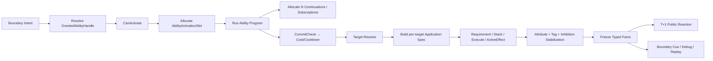

# GAS 业务语义链路概念设计 Spec

## 目的

定义 EX-GAS 2.0 在不复制 UE UObject 实现的前提下必须保留的 GAS 业务语义链。本文负责生命周期、并发、因果和可见时序；物理 SystemGroup、Job、Tick Scratch、Effect Fan-In 与结构提交分别由 [03A](03-RuntimeCore管线/03A-执行域与数据流Spec.md)、[03C](03-RuntimeCore管线/03C-SystemGroup合约与核心数据形态Spec.md)、[03E](03-RuntimeCore管线/03E-EffectFanIn-State-Attribute-FactSpec.md)、[03F](03-RuntimeCore管线/03F-StructuralCommit与BoundaryProjectionSpec.md)、[03G](03-RuntimeCore管线/03G-Component矩阵-TickScratch-Job拓扑Spec.md) 所有。

目标态采用四类数据身份：

1. **Definition 输入**：不可变 Ability、GameplayEffect、Tag、Cue、Calculation 定义。
2. **ASC 权威状态**：GrantedSpec、Activation、Continuation、Subscription、ActiveEffect、Attribute 与 OwnedTag。
3. **tick-local value**：Command、Target、Effect Application Spec、Modifier、Delta 与 Typed Fact。
4. **Boundary 投影**：Cue、ReadModel、Replay、Debugger、structured log。

## 两条核心生命周期链

### Ability 链

```text
AbilityDefinition
    ↓ grant
GrantedAbilitySpec
    ↓ activate 0..N
AbilityActivation
    ↓ spawn 0..N
Continuation
    ↓ observe 0..N external ASC
Subscription
```

| 对象 | 创建 | 存活 | 结束 |
|---|---|---|---|
| AbilityDefinition | bake/publish | catalog lifetime | catalog replacement |
| GrantedAbilitySpec | bootstrap、grant command、ActiveEffect grant | 可跨任意 tick，允许 0..N Activation | `CancelImmediately` / `RemoveWhenAllActivationsEnd` 时最终 tombstone；`LeaveGranted` 保持 Live |
| AbilityActivation | CanActivate 成功后分配 | instant 或跨 tick；可处于未 Commit 状态 | normal end/cancel/failure；只清理 owned contribution 与 Continuation，不隐式删除普通已发射 GE |
| Continuation | Activation program 进入 wait/async 节点 | timer/event/input/target/presentation fact 到达前 | complete/cancel/owner Activation end |
| Subscription | Continuation 监听本地或外部 ASC | one-shot 或 persistent | 显式 unsubscribe、Continuation/Activation end、observed ASC destroy |

### GameplayEffect 链

```text
GameplayEffectDefinition
    ↓ build source-bound value
GameplayEffectApplicationSpec
    ↓ apply per target
EffectApplication
    ├─ Instant → Execute → end
    └─ Duration/Infinite → create-or-stack ActiveEffect → remove/tombstone
```

GameplayEffectApplicationSpec 与 ActiveEffect 是不同对象。前者可以只在 tick-local scratch 存活，也可以由 Continuation 持有；后者只有在 duration/infinite effect 成功应用后才存在。一个 source Spec fan-out 到多个目标时，每个目标必须得到独立的 target capture/application view。

## ASC-local 权威模型

ASC Entity 持有 Attribute、OwnedTag 与五类逻辑 slab：GrantedAbility、Activation、Continuation、Subscription、ActiveEffect。所有 Handle 使用 `(OwnerAscInstanceId, SlotIndex, Generation)`，但必须是不同强类型。

### Slab 不变量

1. Live slot 禁止 compact、swap-back 和 index 重排。
2. `Live → Tombstone` 不增加 Generation；`Tombstone → Free` 才增加。
3. Tombstone 必须等子对象、反向 subscription、queued command 和 cleanup 引用归零后回收。
4. 所有跨 phase/cross-ASC 投递都验证 `SimulationEpoch + HandleKind + OwnerAscInstanceId + SlotIndex + Generation`。
5. 一个 ASC 每 tick 对自身 slab 只有一个逻辑 writer；跨 ASC 影响必须投递给目标 ASC，由目标 writer 提交。
6. projectile/aura 等派生 Entity 可以独立存在，但只能携带冻结 Spec/Context provenance，不能成为 Activation 或 ActiveEffect authority。

## GrantedSpec 与 Activation 语义

GrantedAbilitySlot 至少保存：

| 字段组 | 必保语义 |
|---|---|
| Definition | DefinitionId、version/hash、level、input binding |
| Grant provenance | GrantSourceKind、SourceObject、GrantingActiveEffectHandle、SetByCaller |
| Activation policy | reentry、retrigger、activate-on-granted、remove-after-activation |
| Runtime links | child Activation head/count、PendingRemove、`CancelImmediately / RemoveWhenAllActivationsEnd / LeaveGranted` removal policy |

AbilityActivationSlot 至少保存：

| 字段组 | 必保语义 |
|---|---|
| Identity | AbilityActivationHandle、GrantedAbilityHandle、CausalityId、start tick/sequence |
| Phase | RunningUncommitted、Committed、Ending、Ended |
| Inputs | EventDataId、TargetDataId、EffectContextId、source/avatar snapshot |
| Owned state | `OwnedContributionRanges`：activation-owned tags、block/cancel contributions、activation lifecycle Cue |
| Emitted refs | `EmittedApplicationRefs`：已发射 EffectSpec/Application/ActiveEffect 审计引用；默认不拥有其删除权 |
| Children | Continuation head/count、Subscription cleanup token |
| End | EndReason、WasCancelled、failure reason |

### CanActivate、AscOwnerCommandWave 与 CommitPlan

CanActivate 与 Commit 不能合并：

1. CanActivate 检查 grant 状态、activation tags、block policy 与基础资源可用性。
2. Activation 可以在未 Commit 状态等待输入、目标或时间。
3. 同一 ASC 的 Ability command 按 canonical order 串行解释；后一个 command 必须 read-your-writes 看到前一个 command 已提交的 grant、block、cancel、cost、cooldown gate 与 activation-owned contribution。
4. CommitPlan 只能修改 source ASC。它先全量验证 source-local requirement、capacity/reservation、cost、cooldown 与 Activation phase；任一失败都不提交任何部分。它不能预留 target ASC slot，也不能保证后续 target application 成功。
5. 全量预检成功后，`Committed + CostMutationContract + CooldownGateContract + CommitPlan activation-owned contribution` 作为 no-fail mutation 一次提交；禁止把 cost/cooldown 降成稍后 AscTargetStateWave 才处理的普通 self GE command。
6. `Committed` 只能从 false 变为 true 一次；重复 Commit 是显式错误。
7. Commit 失败不消费 cost/cooldown，由 Ability 程序决定继续等待还是 End。

普通 self-target GE 仍进入 AscTargetStateWave，不对本 AscOwnerCommandWave 中后续 CanActivate 提供同步反馈。这是正式 phase barrier：依赖“Ability A 同步应用普通 self GE 后，Ability B 在同 AscOwnerCommandWave 立即看见该 GE”的 Definition 必须 bake fail，或把该约束重写为显式 owner commit invariant。

`CostMutationContract` 是有界、生成期封闭的 owner-local Attribute mutation：它在 shadow 中验证并在 OwnerWave 直接写同一 ASC 的 `AttributeValueSlot { Base, Current, Revision }`，不建立 cost 镜像或 ActiveEffect。`CooldownGateContract` 则在 owner ASC 的 non-compacting `CooldownGateSlot` 中写入 `GateKey/AbilityDefinitionId、SourceCommitIdentity、StartTick、EndTick、Generation、State` 与可选的 owned Tag contribution range。CooldownGateSlot 不属于 Activation；Commit 后即使立即 Cancel/End/死亡，gate 仍持续到 EndTick 或显式 cooldown removal policy。

每个 gameplay Tick，`OwnerPlanBuild` 必须先把 tick-start 已 due 的 cooldown release 应用到 owner shadow，再解释当前请求；准入成功后 `AscOwnerCommandWave` 以 no-fail maintenance 先释放这些 gate/其 Tag contribution，再按 canonical order 提交 CommitPlan。OwnerWave 与后续 TargetWave 通过 JobHandle 串联后可以先后写同一 ASC 的 Attribute/Tag 权威；这是分阶段单写，不是双事实源。

Owner Commit 与每个 target application 不是分布式事务。target 后续因 requirement、immunity、TargetLifePolicy、stale binding 或业务 stack policy 拒绝，不回滚 source 已提交的 cost/cooldown；只有整 tick infrastructure admission 失败才在任何 gameplay mutation 前以零写 fault 结束。

### End / Cancel 屏障

1. `RunningUncommitted/Committed → Ending` 是单向屏障；首个 canonical End/Cancel 冻结 EndReason 与 WasCancelled，后续 End/Cancel 只产生 deterministic no-op/diagnostics。
2. 进入 Ending 后拒绝 Commit、新 Effect output 与新 Continuation；已有 Continuation 先标 Ending，再按 Subscription 契约取消。
3. `Commit → Cancel/owner death` 保留已经提交的 cost、cooldown 与 committed remote work；source 后续结束不撤回已 Commit 工作，Cancel 只终止剩余 Activation 生命周期。target 是否接受仍由各 application 的 TargetLifePolicy 决定。
4. `Cancel/End → Commit` 返回 `OwnerEnding`，不得消费 cost/cooldown 或产生 Effect application。
5. Activation End 只撤销 `OwnedContributionRanges`。普通 `EmittedApplicationRefs` 只是 provenance，不随 End 删除。
6. 显式 `RemoveOnActivationEnd` application 尚未落地时执行 cancel-before-apply；已经落地时只撤销该 application/contributor。若它合入共享 stack 且没有 per-application ledger，Definition 必须 bake fail，不得删除整个共享 slot。

### Granted removal 三态

- `CancelImmediately`：阻止新 Activation，取消所有 child；cleanup 完成后 tombstone Granted slot。
- `RemoveWhenAllActivationsEnd`：阻止新 Activation，等待全部 child 自然结束；随后 tombstone。
- `LeaveGranted`：Grant slot 保持 Live 且可继续激活；内部只 detach cleanup ownership，并冻结原 granting Definition/Application/Context provenance，不持有必须解引用的 dangling ActiveEffectHandle。

`SuspendWhileInhibited` 是独立的 inhibition policy，不得作为 `LeaveGranted` 的隐式含义。

## Continuation / Subscription 多实例模型

一个 Activation 不是单一程序计数器。它可以同时拥有多个 Continuation；同一 `InstanceNameId` 也允许有多个实例。AbilityContinuationSlot 至少保存：

- `OwnerActivationHandle`
- `ContinuationKind / ProgramCounter / WaitState`
- `WaitSemantic = Level / Edge / Event / HandleLifecycle / Timer`
- `InstanceNameId`
- `OneShot / Persistent`
- `WakeTick` 或观察条件
- `PayloadId / TargetDataId`
- `CompletionReason`
- Activation child-list linkage

AbilitySubscriptionSlot 位于“被观察 ASC”的 owner-local slab，至少保存：

- `ObservedAscInstanceId`
- `SubscriberAscInstanceId`
- `OwnerActivationHandle`
- `ContinuationHandle`
- exact/hierarchical Tag 或 Event query
- one-shot/persistent policy
- `PendingRegistration / Active / Consumed / Ending` 状态
- subscription generation、`ObservedRevisionAtRegister` 与 deterministic registration sequence
- persistent wait 的单调 `WakeOrdinal`

### 外部监听竞态规则

1. 本地或跨 ASC 注册都以 observed ASC single-writer 内的 `sample + register` 为线性化点；跨 ASC 使用 `PendingRegistration → Ack/Completion`，不得由 subscriber 先假定订阅已生效。
2. Level wait 若在线性化点已经满足，则 observed ASC 直接记录 completion，不留下 Subscription；completion 可在 T 形成，但 owner Continuation 一律最早 T+1 resume。
3. Edge/Event 不追溯注册线性化点之前的 transition/event；HandleLifecycle 对 invalid/already-removed handle 立即给出明确 completion；Timer 只按冻结 DueTick 完成。
4. one-shot 在 observed ASC 首次 match 时立即进入 Consumed；之后同 tick 的其他 match 不再产生 wake。persistent 每次 match 分配新的 WakeOrdinal。
5. Activation End 先把所有 Continuation 标记 Ending，再发 unsubscribe command；PendingRegistration、Ack、wake 与 unsubscribe 都携带 generation，晚到消息不得命中复用槽。
6. observed ASC 处理事件时复制冻结 payload，并记录 SubscriptionHandle/WakeOrdinal；subscriber ASC 投递前重新验证 Activation 与 Continuation Generation。
7. 事件、注册、match 与取消同 tick 的先后由正式 command order 决定；不能依赖 Job 完成顺序。
8. observed ASC 已销毁时，Subscription 产生确定性的 `ObservedOwnerGone` completion，不得永久悬挂。

这允许多个 Activation 同时监听同一 ASC，也允许一个 Activation 同时监听多个 ASC；N:N 关系由 Subscription 边表达，而不是把回调列表塞进 Ability 对象。

## Effect Spec、TargetData 与 Context

GameplayEffectApplicationSpec 至少保存：

- `EffectSpecId / EffectApplicationId`
- DefinitionId、version/hash、level
- SourceASC、source Granted/Activation identity
- SetByCaller 与 dynamic magnitude inputs
- 成功 Owner Commit 后建立的 `SourceSpecProjection`
- EffectContext
- duration/period、StackTemporalContract 与 application/TargetLife policy

Commit 前的 Ability 可以持有只含 Definition/输入的 non-authoritative SpecDraft；它没有可发射 EffectSpecId/Source Snapshot。OwnerPlanBuild 可在 shadow 中计算包含前序 CommitPlan、排除后序计划的 post-commit capture candidate，但只有对应 Owner Commit 成功后才由 `SourceSpecProjection` 建立权威 Source-bound Application Spec。

每目标 Application View 再增加 TargetASC、TargetData slice、stable binding、target capture contract、application sequence、non-authoritative precheck 与 target writer 最终填写的 typed ApplicationOutcome/blocker provenance。TargetResolve 不得预写 target capture、requirement/immunity/stack 结果；它们在每条 application 的目标 ASC 最终线性化点读取前序 canonical state。Instant Effect 仍保留 EffectApplicationId；stack 到已有 ActiveEffect 时也不得用 ActiveEffectHandle 替代本次 ApplicationId。

EffectContext 必须区分：

- Owner 与 Avatar
- Instigator 与 EffectCauser
- SourceObject
- Ability/Effect definition 与 level
- Origin/Hit/TargetData
- source Activation/Application causality

派生 Entity 晚于源 Activation 命中时，必须依赖已复制的不可变 Spec/Context，而不是解引用可能复用的 AbilityActivationSlot。

Capture 的数据形状、ScalarSnapshot 严格证明、AggregatorSnapshot 与 Live binding 由 [04-EffectCommand-SpecStream-AttributeDelta](04-EffectCommand-SpecStream-AttributeDeltaSpec.md) 定义。

## 业务链路闭环


```mermaid
flowchart LR
    Intent["Boundary Intent"] --> Grant["Resolve GrantedAbilityHandle"]
    Grant --> Can["CanActivate"]
    Can --> Activation["Allocate AbilityActivationSlot"]
    Activation --> Program["Run Ability Program"]
    Program --> Wait["Allocate N Continuations / Subscriptions"]
    Program --> Commit["CommitCheck → Cost/Cooldown"]
    Commit --> Target["Target Resolve"]
    Target --> Spec["Build per-target Application Spec"]
    Spec --> Apply["Requirement / Stack / Execute / ActiveEffect"]
    Apply --> Stabilize["Attribute + Tag + Inhibition Stabilization"]
    Stabilize --> Fact["Freeze Typed Facts"]
    Fact --> Next["T+1 Public Reaction"]
    Fact --> Cue["Boundary Cue / Debug / Replay"]
```

物理分组和 Job 依赖不在本文重复；本文只要求每一步保留 typed identity、owner 与失败原因。

## Stable-state Deferred Reaction 契约

### 可直接引用的规范措辞

> v1 采用 stable-state deferred reaction。GameplayEvent、OwnedTag 触发 Ability、外部 Continuation 唤醒与跨 ASC Reaction 在发射 tick 不重入；冻结后的事件最早在下一 tick 投递。Payload、EffectContext、TargetData、原始 EventTag 与 tag count transition 固定于发射时，CanActivate 及当前状态检查读取投递 tick 的 reaction 前稳定状态。每经过一条公开 Reaction 边至少增加一 tick。

这与 UE GAS 通常在当前调用栈内路由 GameplayEvent、OwnedTag trigger、AbilityTask delegate 和 conditional callback 的行为不同。v1 不得把它描述为 UE 同步时序等价。

### 同 tick kernel invariant

以下逻辑不属于 Deferred Reaction，必须在当前 tick 的权威事务内闭合：

- GameplayEffect application requirement 与 immunity
- stack merge/refresh/overflow 决策
- Commit、cost 与 cooldown
- Attribute execution、Base mutation、clamp、meta-to-real 转换
- modifier/tag/grant/block contribution 的增加和撤销
- ongoing requirement / inhibition 的 target-local 稳定化
- Ability program 在激活调用内自行 End
- 生成期证明闭合、完全展开、有限且静态有界的 definition-local DirectEffectProgram

### DirectEffectProgram 边界

v1 same-tick DirectEffectProgram 必须是静态 Definition 边、固定拓扑序、生成期可完全展开的闭合 DAG，不读取本 tick post-apply fact，无动态 effect 选择或任意事件/task recursion，并证明节点数与最大输出数静态有界。仅“无环”不足以排除指数展开。默认只允许当前 target ASC；若未来允许跨 ASC same-tick，必须另行定义全局 wave/barrier，而不能借用局部单 writer 契约。

需要同步 GameplayEvent→Ability 的玩法不能自动获得 UE 时序；应优先重写为 kernel invariant 或 DirectEffectProgram。无法重写者属于 v1 明确不支持的同步语义。

### Reaction payload 与顺序

Reaction 记录至少携带：

```text
SimulationEpoch, DeliverTick, TargetAscInstanceId,
SemanticPhaseOrdinal, WorkClassOrdinal, EmitTick,
SourceAscInstanceId, SourceSequence,
OriginalTag, old/new count,
EffectApplicationId, CausalityId,
frozen EventData/Context/TargetData,
RecipientKindPriority, MatchedTagDepth, RecipientStableId,
DefinitionOrdinal or RegistrationSequence, WakeOrdinal
```

投递先按事件因果键排序，再按 `RecipientKindPriority asc → MatchedTagDepth desc → RecipientStableId asc → DefinitionOrdinal/RegistrationSequence asc → WakeOrdinal asc` 排定同一事件的接收者全序。`MatchedTagDepth` 使用 Catalog depth，因此 exact/更深 tag 先于祖先；不能依赖容器遍历顺序。`WakeOrdinal` 对 persistent Subscription 单调递增；one-shot 在 observed ASC writer 首次匹配时即进入 `Consumed`，不再参与后续排序。不得用 chunk index、worker 顺序、ECB append 顺序或 slot 当前内容重建事件。

## Ongoing / Inhibition 稳定化

Definition 自身无环不保证多个运行时 Effect 组合存在固定点。target-local stabilization 必须：

1. 事务内迭代 requirement、inhibition、contribution 与 tag count。
2. 使用 state hash 检测重复状态，并设置最大迭代数。
3. 超限时显式产生 deterministic failure，不提交半稳定状态。
4. 中间试探产生的 Reaction/Cue 暂存在事务内，只发布最终稳定 transition。
5. 明确的“已提交 Add 后又 Remove”与稳定化内部试探不同；前者是否输出完整 Cue 生命周期由 Cue contract 决定。

跨 ASC Live dependency 不属于 target-local 闭包；要么按 [04](04-EffectCommand-SpecStream-AttributeDeltaSpec.md) 的跨 ASC dirty command 支持，要么在 bake 时拒绝。

## Tag / Event / Cue 语义隔离

| 概念 | 权威含义 | 生命周期 |
|---|---|---|
| OwnedTag | ASC 状态，叶 tag 与父 tag 都有引用计数/零边界 | contribution 存续期间 |
| GameplayEvent | 带原始 tag 与 payload 的瞬时消息，可按父 tag 路由 | queued reaction lifetime |
| GameplayCue | 表现通知，包含 OnActive/WhileActive/Executed/Removed | Boundary outbox lifetime |

OwnedTag 不能用 Event 替代，Event 不改变 OwnedTag，Cue 不反向写 gameplay。稳定化内部 tag 抖动不对外发 Reaction；提交后的 tag transition 必须保留 old/new count 和原始 sequence。

## OOP Shell 与生成边界

- Application Shell 只提交业务 intent、读取 ReadModel、消费 Cue/Diagnostics。
- Runtime Boundary 只做 handle 解析、命令封装和只读投影。
- Core 只消费 unmanaged state/value 和 immutable Blob。
- SourceGenerator 只生成 Definition lookup、typed record builder、Capture accessor、pure evaluator 与 bake validation；不得生成生命周期 System 或托管 task。
- 任何跨 tick 状态必须进入 ASC-local slot 或明确的派生 Entity；不得藏在 delegate、coroutine、managed state machine 或 tick-local scratch。

## 非预测 v1

v1 保留完整 identity/provenance，但 schema/API 明确删除：PredictionKey、Base/Scoped key、Predicting/Confirmed/Rejected、IsPredicted、IncludePredictiveMods、prediction journal、reject/caught-up delegate、predictive instant overlay 与 prediction-based cue dedup。

Authority execution domain 可以存在，但不能在每条记录上保留“将来可能预测”的双态字段。未来预测必须增加独立 correlation/reconciliation 层，不复用 Handle 或 CausalityId。

## 概念设计验收

1. 同一 GrantedSpec 的多个 Activation、同一 Activation 的多个 Continuation、跨 ASC N:N Subscription 均能独立结束和清理。
2. stale handle、late event、owner destroy 与 slot reuse 均不会误唤醒新对象。
3. 同 ASC 的 AscOwnerCommandWave 使用 canonical read-your-writes；两个竞争 CommitPlan 依稳定顺序决定胜者，失败者不留下 cost、cooldown、owned contribution 或半 Committed 状态。
4. `Commit → Cancel` 保留已消费 cost、cooldown 与已发射工作；`Cancel/End → Commit` 以 `OwnerEnding` 拒绝，EndReason 只冻结一次。
5. 普通 self-target GE 在 AscTargetStateWave 才可见；依赖它向本 AscOwnerCommandWave 后续 CanActivate 同步反馈的 Definition 在 bake 被拒绝。
6. Activation End 仅精确清理 `OwnedContributionRanges`；普通已落地 GE 不随 End 删除，`RemoveOnActivationEnd` 对 shared stack 缺少逐 application ledger 时 bake fail。
7. Level wait 已满足时在 T 完成且不遗留 Subscription，Continuation 统一 T+1 resume；Edge/Event 不追溯；persistent 每次唤醒具有唯一 WakeOrdinal。
8. 同一事件的多个 recipient 按完整 recipient key 得到唯一全序，one-shot 首次匹配后不可重复投递。
9. Instant、stack application 与 ActiveEffect 拥有不同 identity。
10. projectile/aura 晚到结果仍能恢复完整 Context/provenance。
11. GameplayEvent/OwnedTag/Continuation 在 T 不重入、T+1 依契约投递；payload 不读复用槽。
12. kernel invariant 与 DirectEffectProgram 在同 tick 闭合，公开 reaction 不偷渡进 same-tick 路径。
13. stabilization 收敛；无固定点时显式失败。
14. runtime schema 不包含 Prediction 占位字段。
15. 完整 UE 语义验收矩阵以 [24-GAS官方概念对照复核](24-GAS官方概念对照复核Spec.md) 为唯一 owner。

## 历史方案定位

1. 四层边界与 pure ECS Core 的历史信号保留为设计来源，但不覆盖本文件的领域生命周期裁决。
2. Ability Entity、Activation Entity、OOP AbilityTask 与全局 EventBus 均不属于 v1 权威模型。
3. 目标态以 ASC-local slab、typed value、stable-state deferred reaction 与 Boundary observation 为准。
