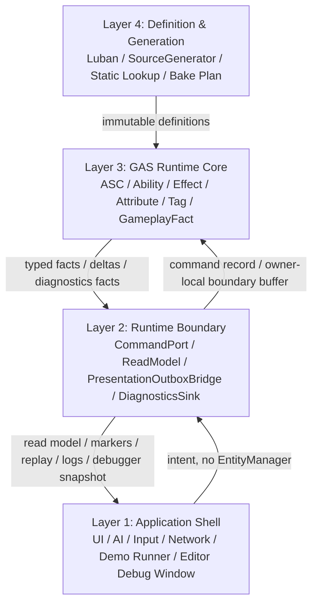

# 四层架构 Spec

## 目的

把 EX-GAS 2.0 的目标态主架构从旧“五平面”口径重构为四层工程架构，并给 Runtime Core、配置生成链、Debugger、AutoChess 验收 Demo 和任务树拆分提供统一边界。

旧五平面只能作为历史解释词汇，不再作为主 Spec。所有设计、任务领取和代码命名都应优先使用本文件的四层名称。

## 四层命名

| 层级 | 规范英文名 | 规范中文名 | 旧口径吸收 | 核心职责 |
|---|---|---|---|---|
| Layer 1 | Application Shell Layer | 应用壳层 | Extension / Presentation consumer | UI、输入、AI、网络、场景编排、Demo runner、真实资源和无头 log 占位 |
| Layer 2 | Runtime Boundary Layer | 运行时边界层 | Thin Adapter / Observation / Debugger | OOP/ECS 边界、command gateway、read model、presentation outbox、diagnostics/replay sink |
| Layer 3 | GAS Runtime Core Layer | GAS 运行时核心层 | Simulation | ASC、Ability、GameplayEffect、Attribute、Tag、Target、EffectCommand、StateEvaluate、AttributeReduceApply、GameplayFact |
| Layer 4 | Definition & Generation Layer | 定义与生成层 | Authoring / Definition / Generated | Luban source、schema、generated id、static lookup、Blob/Bake plan、validation summary |

层级编号沿用历史方案的表达习惯，不代表调用方向。目标态调用方向只有两条：应用壳层通过运行时边界层写入命令，GAS Runtime Core 只消费定义与生成层的不可变输入并输出事实。

## Debugger 与 AutoChessDemo 定位

1. Runtime Debugger 的采样、counter、timing、buffer pressure、official tool diff 和 replay export 归属 **Layer 2 Runtime Boundary Layer**，具体职责是 `DiagnosticsSink` / `ReplaySink` / read-only observation，不是 Runtime Core 输入。
2. Editor Debugger Window 归属 **Layer 1 Application Shell Layer** 的 Editor Extension。窗口只能消费 Layer 2 snapshot / export API，不直接写 Runtime Core component / buffer，也不放入 AutoChessDemo。
3. Headless runner 同样归属 **Layer 1 Application Shell Layer**，它和 Editor 窗口共享 Layer 2 Runtime Debugger 数据出口；区别只在输出目标是 batchmode log / CI summary，而不是编辑器窗口。
4. `Assets/AutoChessDemo` 整体归属 **Layer 1 Application Shell Layer** 的业务验收 Demo。它可以编排业务 AI、场景和验证 runner，但不能成为 GAS Runtime Core 的一部分，也不能私有化 Debugger 窗口。
5. Layer 3 只负责产出 Debugger 所需的只读事实、数值 counter 和 outbox marker；任何 Debugger / Replay / Presentation 结果都不得反向驱动 simulation。
6. AutoChessDemo 允许拥有面向业务的 Battle Runtime Adapter seam，但该 seam 只能负责把 Layer 1 业务流程接到 Layer 2 / Layer 3 运行时入口。它不是新的 OOP 中间层，也不能把 gameplay calculation、target selection、damage formula、validation policy 和 Runtime Core lifecycle 混成一个万能 `Adapter`。
7. Battle Runtime Adapter 的目标 interface 必须比 implementation 更窄：外部只看到 runtime init / battle open / fixed tick / battle close / snapshot export 这类业务动作；内部 direct `EntityManager`、catalog install/dispose、ASC/unit lifecycle、official diff 和 observation reset 必须按 owner 分类并被 validation evidence 标注。

## 总体数据流

## Unity Entities 校准

四层架构只是工程边界，不是自定义 ECS runtime。Layer 3 和 Layer 4 的实现必须遵守 `UnityDOTS官方文档参考/主题/01-Entities系统与World.md`：

1. Layer 3 的物理执行域必须映射到 Unity `ComponentSystemGroup` 和 update order；业务 kernel 只作为 lane system / job chain，不默认新增 group。
2. Layer 3 hot path 默认使用 unmanaged `ISystem` 和 job，不依赖 managed object。
3. Layer 3 结构变化集中到 `GASStructuralCommitSystemGroup`，不在 Target Resolve / Effect Fan-In / State Evaluate / Attribute Apply / Gameplay Fact kernel 直接 create / destroy entity。
4. Layer 4 的 generated artifact 优先落为 Blob、Baker output、static lookup 和 validation graph。
5. Layer 2 / Layer 1 可以有 managed bridge，但不能把 managed bridge 写回 Runtime Core 热路径。

## 官方依据与设计论证

| 分层选择 | 官方规则依据 | 为什么更优秀 | 为什么有必要 |
|---|---|---|---|
| Layer 3 只承载 GAS Runtime Core，且以 SystemGroup / `ISystem` / Job 表达物理执行域 | `SYS-01`、`SYS-02`、`SYS-03`、`PRF-07` | 把 runtime ownership、update order、依赖链和 sync point 暴露给 Entities 调度系统 | 如果把 OOP manager 或 adapter 作为中间层，Profiler 只能看到托管调用，无法定位真正的 ECS hot path |
| Layer 2 只做 command port、read model、outbox、diagnostics/replay sink | `SYS-05`、`DBG-01`、`SEL-01`、`ODF-07` | 外部业务可以用 OOP API，但 gameplay 写入仍收敛为 command data，观察结果仍来自 typed facts | UI、AI、网络、Debugger、Replay 生命周期不同；混成一个 adapter 会让业务逻辑、日志、缓存和写 Core 互相污染 |
| Layer 4 只生成 immutable definition、Blob、lookup、pure glue 和 validation artifact | `BAKE-01`、`BLOB-01`、`BLOB-02`、`CASE-07`、`BUR-01` | 配置链把 Luban row 压缩成 Burst-friendly 的只读输入，Runtime lane 不反查 managed row / JSON / Dictionary | GAS 配置量大且公式/条件多；若 Runtime 每帧查托管表，会直接违背 hot path job 化和 unmanaged 数据约束 |
| Layer 1 只能通过 Boundary 接入 Runtime，并消费 read model / marker / diagnostics snapshot | `SYS-05`、`ODF-18`、`CASE-17` | Demo、无头 runner、Editor 工具和真实产品可共用同一运行时证据模型 | 真实资源、窗口、场景和无头 CI 的生命周期不同；允许 Layer 1 直连 `EntityManager` 会让验收路径和产品路径分裂 |

## Layer 4: Definition & Generation Layer

### 职责

1. 维护 Luban Excel / JSON / schema / validation rule。
2. 生成稳定 id、静态 lookup、definition snapshot、bake plan 和 runtime integration plan。
3. 为 Runtime Core 提供不可变、可校验、可 Burst 消费的定义输入。
4. 维护生成链路的显式 pipeline、RowMetadata、Phase manifest、路径审计和 orphan generated file 清理策略。

### 禁止

1. 不生成 Ability / GameplayEffect lifecycle system。
2. 不携带 runtime state、spec、context、cooldown instance、active effect instance。
3. 不依赖 GameObject、MonoBehaviour、Editor window、Odin、XLua 或业务 UI。
4. 不把 Luban managed row、`cfg.*`、`XLuban`、`SimpleJSON` 或 JSON reader 暴露给 Runtime Core assembly。
5. 不用托管数组、managed dictionary 或可变 delegate registry 作为 Runtime Core hot path lookup。

## Layer 3: GAS Runtime Core Layer

### 职责

1. 承载 GAS 权威状态和 gameplay 规则，所有热路径以 unmanaged component、buffer、blob、lookup、command stream、typed fact 表达。
2. 以显式 DOTS kernel 处理 `Boundary Command Ingest -> Target Resolve -> Effect Fan-In -> State Evaluate -> Attribute Reduce/Apply -> Gameplay Fact -> Structural Commit -> Boundary Projection`。
3. 将 Cue、UI、VFX、SFX、FloatingText、Debugger 需要的信息输出为只读 facts / outbox marker。
4. 将 `EffectCommand / Spec / Delta / Fact` 作为语义链，而不是全局 singleton 总线；scale-ready fan-in 默认走 `NativeStream` deterministic merge + compact owner-local buffer。

### 禁止

1. 不持有托管业务对象，不调用 `GameObject`、`MonoBehaviour`、真实 UI/VFX/SFX 资源。
2. 不把全局 `EventBus` 当业务 reaction 主输入，不用 observation stream 反向驱动 simulation。
3. 不跨结构变化持有 `DynamicBuffer` / `ComponentLookup` / `BufferTypeHandle` 的旧句柄。
4. 不把 Frame Arena 写成 query registry / service locator；EntityQuery 归属各 `ISystem`。
5. 不把大容量 singleton DynamicBuffer 或大容量 per-ASC frame buffer 固化为目标态。

## Layer 2: Runtime Boundary Layer

### 职责

1. `CommandPort`：把应用壳层意图转换为 command record、owner-local boundary buffer 或等价 command data；公开方法必须使用 `Request*` 命名，避免伪装成立即执行的 OOP 对象操作。低频 request entity 只能作为显式 structural lifecycle 例外，不是高频 gameplay 默认承载。
2. `ReadModel`：提供只读镜像，不暴露 `EntityManager`、`EntityQuery`、runtime buffer 可写句柄。
3. `PresentationOutboxBridge`：消费 Core facts，输出 UI/Cue/VFX/SFX/log marker；无头 Demo 也必须走同一 outbox 语义。
4. `DiagnosticsSink` / `ReplaySink`：导出结构化日志、timing、buffer pressure、fact count、scale profile，不参与 gameplay routing。
5. `OfficialToolDiff`：在 Editor / Development 可用时用 Entities Journaling 形成官方差分；Unity Profiler modules 未启用时只记录 category / disabled reason，不伪造 captured 数据。

### 禁止

1. 不做伤害、治疗、Tag requirement、Cooldown、Cost、Stack、Period 等 gameplay 计算。
2. 不把 `Adapter` 写成“边界 + 缓存 + 业务反应 + 调试日志”的混合对象。
3. 不把 `Debugger` / `Logger` / `Replay` 作为 Runtime Core 的实时输入。
4. 不把 `EntityManager` / `GASManager` 作为 Layer 1 可以直接持有的工具。若某个 Application Shell Demo 需要创建/销毁 ASC、driver、catalog 或观测 singleton，必须通过 Battle Runtime Adapter seam，并标注该操作是否属于 bootstrap、structural lifecycle、observation-only 或 core tick。

## Layer 1: Application Shell Layer

### 职责

1. 面向产品、Demo、自动验收和真实资源接入，组织 UI、输入、AI、网络、场景、MonoBehaviour、Prefab、Timeline 等外部模块。
2. 调用运行时边界层 API 发起意图，订阅 read model、presentation marker、structured log。
3. AutoChess 无头验收 Demo 虽然没有真实画面资源，也必须完整保留 UI/Cue/VFX/SFX/FloatingText marker 逻辑。
4. Editor Debugger Window 属于本层 Editor Extension，只读消费 Layer 2 diagnostics snapshot；无头 runner 也属于本层业务验证入口。
5. AutoChess headless runner 与 scene runner 必须共享同一个 battle run loop Module。启动方式、输出路径、Profiler 驱动和资源 bridge 可以不同；warmup、measured window、official diff、completion rule、result build 和 validation evidence 不得复制两套。

### 禁止

1. 不直接写 Runtime Core component / buffer。
2. 不持有 GAS 权威状态副本。
3. 不通过 log/replay 反向修正 gameplay 结果。
4. 不把业务 Demo 退化为测试 harness。无头只替换最终表现 side effect，不删除真实业务流程、资源 marker、Cue marker、validation expectation 或 scale profile。

## 旧五平面到四层的吸收关系

| 旧术语 | 新归属 | 说明 |
|---|---|---|
| Authoring Plane | Definition & Generation Layer | Authoring 是定义与生成层的输入面，不再单独作为主层 |
| Definition Plane | Definition & Generation Layer | 继续保留“定义数据不可变”的约束 |
| Simulation Plane | GAS Runtime Core Layer | 统一改称 Runtime Core，强调 GAS 语义和 ECS 热路径 |
| Observation Plane | Runtime Boundary Layer | Observation 拆成 read model、presentation outbox、diagnostics/replay sink |
| Extension Plane | Application Shell Layer | Extension 是外部应用壳层，不直接进入 Runtime Core |

## 验收方式

1. 文档验收：目标态 Spec 和任务树不再以“五平面”作为主架构入口；引用旧术语时必须标注为旧口径。
2. Runtime 验收：Core hot path 不依赖 Editor / GameObject / Odin / managed gameplay object；system tick 目标保持 `0.0X - 0.X ms` 级别。
3. 边界验收：CommandPort 只写命令，ReadModel 只读，PresentationOutboxBridge / Diagnostics / Replay 不反向写 simulation。
4. 配置验收：Luban + SourceGenerator 只输出 Definition & Generation Layer artifact，不生成 runtime lifecycle。
5. Demo 验收：AutoChessDemo 位于 Runtime Core 外部的 Application Shell Layer，走真实业务流程，同时支持无头自动结算和十万级以上压力测试预演。
6. Adapter 验收：AutoChess Battle Runtime Adapter 对外 interface 不得暴露 GAS implementation 细节；direct `EntityManager` 使用面必须集中、分类、可审计，并且不能进入 `coreTickMs`。

## 历史方案定位

1. 四层原始模型来自 `../历史方案参考/方案15.md:35-50`，但本 Spec 将 `业务层 / 适配层 / ECS核心层 / 数据配置层` 重新命名为更精确的四层工程名。
2. 方案15 的 Layer 2 示例强调“接收 OOP 命令、转换为 ECS 标记/组件、不包含业务逻辑”，对应本 Spec 的 Runtime Boundary Layer：`../历史方案参考/方案15.md:473-490`。
3. 方案15 对四层架构与旧架构的对比指出 OOP 层必须退回外壳层、Ability 行为必须进入 Burst System：`../历史方案参考/方案15.md:1289-1315`。
4. 方案15 对边界单向性的总结可作为应用壳层、运行时边界层和 Runtime Core 的验收图：`../历史方案参考/方案15.md:2843-2857`。
5. 方案14 的四层职责总览和 Luban + SourceGenerator 生成链路提供了 Definition & Generation Layer 的来源参考：`../历史方案参考/方案14.md:100-118`。
6. 方案14 的“架构分层职责最终定义”提供了 Core 全 unmanaged、全 Burst、禁止反向查 OOP 的硬约束：`../历史方案参考/方案14.md:1038-1058`。
