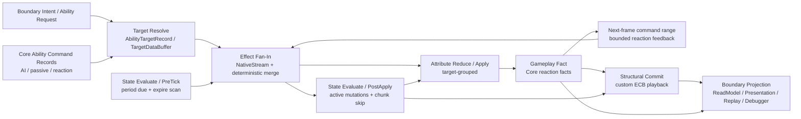
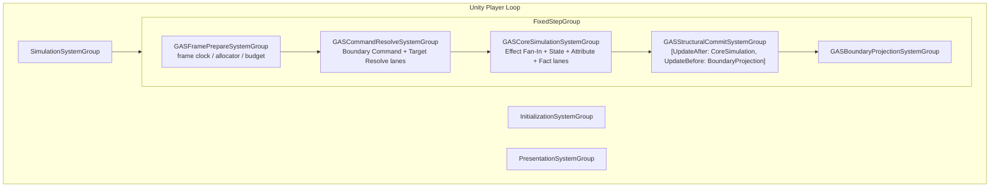
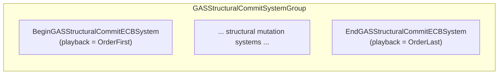
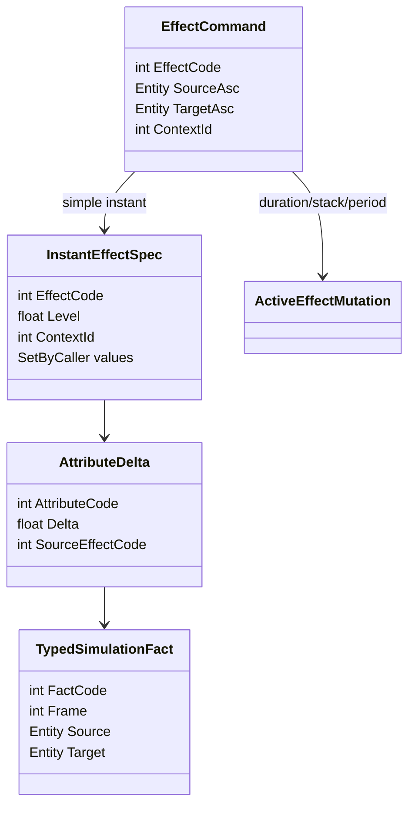
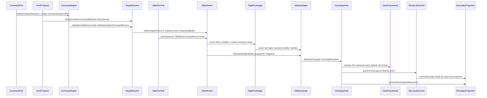

# 03A：执行域与数据流

> Owner：`01-目标态架构共识/03-RuntimeCore管线` | 状态：目标态子 Spec | 拆分来源：`../03-RuntimeCore管线Spec.md` | 最近拆分：2026-06-07

本文件只描述理想 Runtime Core 目标态。禁止写入当前代码事实、迁移流水、验证数字或下一步任务；现实证据必须回到 `../../00-当前架构事实/`，任务拆分必须回到 `../../02-主线任务树/`。

定位：目标态 Runtime Core 的目的、官方依据、物理执行域、数据流、SystemGroup、Phase 和官方交叉审查。

## 目的

定义未来 Runtime Core 的主流程，替代旧 GE lifecycle / global observation stream 混合管线。本 Spec 不仅定义概念流，还定义到 Unity Entities 的物理承载 —— SystemGroup 嵌套、Component 读写矩阵、Frame Arena 物理设计、Job 依赖拓扑和 Sync Point 预算。

## 官方依据与设计论证

Runtime Core 管线必须先服从 Unity Entities 的物理执行约束。`SYS-02` 要求 SystemGroup 是 phase owner，`SYS-03` / `PRF-07` 说明 system / group 数量是固定成本，`QRY-01` / `JOB-01` 要求 hot path 说明 job 化选择，`PRF-33` 要求 query 由 `SystemState.GetEntityQuery` 创建并被安全系统追踪。因此目标态采用 5 个物理执行域承载 8 条业务 kernel lane，而不是把 Ability、Target、Effect、State、Attribute、Fact 分别升级成一组 OOP taxonomy 式 SystemGroup。

主要性能风险来自写竞争、结构变化和临时数据生命周期：`SC-01` / `PRF-04` / `ECB-03` 要求结构变化集中在明确 playback phase；`NAT-03` 要求并行 fan-in 使用有预算的 `NativeStream` 与确定性 merge；`CASE-35` 要求并行 ECB 录制使用可确定回放的 sort key；`PRF-08` 禁止 hot path 使用 `EntityIndexInQuery`；`BUF-01` 要求 DynamicBuffer 有容量与 spill 监控。管线设计把这些规则前置为架构验收门，而不是后续 profiler 阶段才补的优化建议。

状态机和跳过策略也必须按官方约束收敛：`FSM-02` / `FSM-05` 支持轻量状态用 enum / bit field 合并，只有 profiler 证明 chunk/entity skip 收益时才引入 Enableable 或 Chunk Component。这样 ActiveEffect、period、cooldown、status 不会因“看起来更 ECS”而制造 archetype churn 或 enableable wait。

## Runtime Core 物理执行域划分

按 `UnityDOTS官方文档参考/主题/20-GASRuntimeCore-API选型基线.md`、`02-查询遍历与Job.md` 的 `SYS-03`、`System-World-SystemGroup/PRF-07`、`10-Collections-Allocator-NativeStream.md`、`16-官方案例模式-高级.md` 的 `CASE-45` 和 `15-数据流-系统生命周期规范.md` 校准，“每个业务 kernel 一个 SystemGroup”的划分属于 OOP taxonomy 式分组：职责名字清楚，但把 Target / Fan-In / State / Attribute / Fact 都升格为 `ComponentSystemGroup` 会放大 TypeHandle refresh、Lookup update 和 Dependency 链成本。

目标态修正为 **5 个物理执行域 + 8 条业务 kernel lane**：

| 业务 kernel lane | 业务问题 | 物理执行域 | DOTS 承载 | 官方约束 |
|---|---|---|---|---|
| Boundary Command Ingest | 外部/AI/Network/Timeline 意图进入 Core | `GASCommandResolveSystemGroup` | 低频 request entity 或等价 command data；高频 producer 禁止 request entity churn | `SYS-01` `SC-01` `PRF-01` `SEL-01` |
| Target Resolve | ability 目标、area query、self target、多目标扇出 | `GASCommandResolveSystemGroup` | `AbilityTargetRecord` NativeStream、低量 request-owned `TargetDataBuffer`、Unity Physics query 输入快照、确定性 target sort key | `QRY-01` `PHY-02` `MAT-05` |
| Effect Fan-In | 多来源产生 GE apply/period/passive/overflow command | `GASCoreSimulationSystemGroup` | `NativeStream` per producer/chunk 写入，按 `(TargetSortKey, Sequence)` deterministic merge；低量可落 owner-local compact buffer | `CASE-12` `NAT-02` `NAT-03` `MAT-05` |
| State Evaluate | Ability 状态、ActiveEffect slot、Period/Expire/Stack/Inhibit | `GASCoreSimulationSystemGroup` | PreTick 产生 seed，PostApply 提交 owner-local `ActiveGameplayEffectBuffer` + enum/bit flags；大量 idle 才引入 enableable/chunk skip | `FSM-02` `FSM-03` `FSM-05` `EN-01` |
| Attribute Reduce/Apply | 同一 target 的多个 modifier 归并并写属性 | `GASCoreSimulationSystemGroup` | target-grouped reduce，读写字段拆分，避免跨 entity random lookup | `QRY-04` `PRF-19` `PRF-26` |
| Gameplay Fact | Core 内部 reaction 事实，不等同表现事件 | `GASCoreSimulationSystemGroup` | typed fact buffer/stream；Ability trigger / GE reaction 只消费 Core fact | `SYS-05` `ECB-01` `STORE-03` |
| Structural Commit | grant/remove/spawn/destroy/cleanup | `GASStructuralCommitSystemGroup` | 自定义 ECB；批量同类变化优先 EntityQuery bulk / `ComponentTypeSet` | `PRF-04` `SC-03` `ECB-03` `PRF-25` |
| Boundary Projection | ReadModel、Presentation、Replay、Debugger | `GASBoundaryProjectionSystemGroup` | 只读 projection；可以采样/截断，不反写 simulation | `SYS-05` `DBG-01` `GFX-01` |

这意味着旧文档中的 `GASSpecEvaluationSystemGroup`、`GASDeltaApplySystemGroup`、`GASGameplayEventProjectionSystemGroup` 以及上一版新增的 `GASTargetResolveSystemGroup`、`GASEffectFanInSystemGroup`、`GASStateEvaluateSystemGroup` 等“每 kernel 一个 group”名称，只保留为历史 traceability；新增 Runtime Core 设计必须使用 **物理执行域 SystemGroup + lane system** 命名。`EffectCommand / Spec / Delta / Fact` 仍是语义链，但不能成为一个全局 singleton buffer 总线，也不能把所有业务都塞进 “Spec Evaluation” 这个中间层。

### 为什么旧划分不够好

1. `Command -> SpecStream -> Delta` 是概念流，不是足够好的 DOTS 物理划分；真实性能瓶颈发生在 fan-in 写竞争、target grouping、buffer spill、lookup random access、enableable wait 和 Structural Commit playback。
2. 大 `GEStreamOwnerSingleton` 或大容量 per-ASC frame buffers 都容易走向两种极端：全局扫描/写竞争，或每个 ASC 都背负 8KB 级 inline buffer，降低 chunk occupancy。
3. Ability、Target、Effect、ActiveEffect、Attribute 的读写模式不同，不能用一个 “Spec phase” 统一解释；应按数据所有权和批处理形态拆成 kernel。
4. ActiveEffect 生命周期状态数少且每状态工作轻，默认应是 owner-local slot enum/bit field，而不是 per-state tag component、per-state system、per-state group 或每个 runtime GE entity。
5. Boundary / Observation / Debugger 的事实投影必须与 Core reaction 分开；表现/Replay 需要的是可观察输出，不应成为 gameplay reaction 主输入。
6. SystemGroup 是物理同步域，不是业务目录。`SYS-03` / `PRF-07` 要求新增 system/group 前先证明它减少依赖复杂度或提升 chunk locality。

### 新目标态原则

1. **Owner-local 状态，frame-local fan-in。** 跨帧权威状态挂 ASC / Ability / optional stable active-effect entity；每帧高并发 fan-in 先用 `NativeStream` 或 chunk-local scratch，必要时确定性 merge 到 compact owner-local buffer。
2. **先按 target 分组，再写属性。** Attribute apply 以 target ASC 为归并单位，避免每条 delta 随机写另一个 entity。
3. **结构变化不是消息系统。** ECB 只用于结构变化，不承载 GameplayEvent；fact / delta / command 用 buffer / stream。
4. **SystemGroup 按物理执行域切，System/Job lane 按数据依赖切。** 一个物理域内可串联多个 lane system，但新增 system/group 必须证明减少依赖复杂度或提高 chunk locality，否则会增加 TypeHandle / Lookup / Dependency 固定成本。
5. **Frame Prepare 不是中心 manager。** EntityQuery 由各 `ISystem.OnCreate` 通过 `SystemState.GetEntityQuery` 创建；Frame Prepare 只负责 allocator、lookup refresh budget、dependency/debug counters，不集中保存 query registry。

## PackageCache 官方约束带来的目标态修正

以本项目采用的 `Library/PackageCache/com.unity.entities@e90944159b94/Documentation~` 作为 Unity Entities 版本第一性依据后，Runtime Core 目标态收紧为三条硬约束：

1. **Runtime Core 默认挂 `FixedStepSimulationSystemGroup`，不是直接挂 `SimulationSystemGroup`。** `systems-time.md` 明确 `FixedStepSimulationSystemGroup` 按固定间隔运行且一帧可多次 update。真实 GAS 战斗以 battle tick、frame index、replay hash 为权威时序，默认应跟固定步模拟绑定；variable-step profile 只能作为显式 profile，必须输出 `worldTimePolicy`、fixed-step count 和 hash 证据。
2. **5 个物理执行域是目标骨架，不是完成证明。** 目标态主链固定为 `GASFramePrepareSystemGroup -> GASCommandResolveSystemGroup -> GASCoreSimulationSystemGroup -> GASStructuralCommitSystemGroup -> GASBoundaryProjectionSystemGroup`。每个业务 lane 必须说明 query owner、lookup refresh、allocator owner、dependency budget、write set 和 deterministic output policy；实现承载状态只记录在 `../../00-当前架构事实/Runtime主链事实.md`。
3. **重新划分后的深 Module 不是“SpecStream 系统”，而是“GAS Frame Kernel”。** 其 Interface 是少量 lane contract：command records、target records、effect command records、active slot mutation、attribute modifier range、gameplay fact range 和 structural intents；Implementation 内部可使用多个 job、`NativeStream`、owner-local buffer、ECB/bulk commit。这样删除 singleton stream 后，复杂度不会回流到每个 producer；删除旧 EventBus 后，Core reaction 与 Boundary observation 也不会互相污染。

### 禁止固化的过渡式调用链

```text
Boundary command producers / passive producers / period producers
  -> singleton command/spec stream
  -> frame prepare clear/compact
  -> execution / attribute / fact systems
  -> global observation bus
  -> presentation / replay / cue bridge
```

这类链路的主要问题不是“缺少 phase 名称”，而是 Interface 过浅：调用者需要理解 singleton stream owner、cursor、buffer 容量、global observation bridge、frame context 和回退路径。按 Module deletion test 看，删掉 singleton stream 后，细节会散落回 producer、effect、attribute、fact、presentation 多个调用点，说明它承载了一些行为；但它的 Interface 也几乎暴露了 Implementation 的所有复杂度，因此不能作为目标态。

### 目标态调用链

```text
Boundary / AI / Passive / Period producers
  -> AbilityActivationCommandRecord / GEEffectCommandRecord NativeStream producers
  -> deterministic merge by (TargetSortKey, Sequence, ProducerIndex, LocalIndex)
  -> target-grouped modifier range
  -> owner-local AttributeSet write + ActiveGameplayEffectBuffer slot mutation
  -> Core GameplayFact range
  -> next-frame reaction seed + Boundary Projection
  -> Structural Commit ECB / EntityQuery bulk only for real structural changes
```

新的 Interface 只暴露“写什么 record、按什么排序、谁拥有生命周期、在哪个 lane 消费、何时清理”。具体使用 `NativeStream`、`NativeList`、compact owner-local buffer 或 ECB append，是 Implementation 内部的 API selection；每条 lane 必须在任务交付时给出拒绝其它 API 的理由和重新选型触发条件。

### 目标态重构验收门

目标态不记录某次实现修复，而记录每条 lane 必须越过的验收门：

1. Attribute / fact projection 禁止主线程全量 ASC 属性扫描；默认使用 `IJobChunk`、change filter、owner-local dirty set 或等价 batch 机制，并输出 `matchedChunks / changedChunks / dirtyOwners / projectionCount`。
2. Execution output modifier 禁止逐 effect 主线程随机写 target ASC；默认先形成 frame-local modifier record，再按 target ASC deterministic grouping，由 ASC-owned job 写自己的 AttributeSet / modifier range。
3. 任何保留 singleton stream、global observation bus 或 compatibility mirror 的切片，都只能在事实目录标记为 proof-only，目标态验收不能把它写成最终承载。

满足这些 gate 后，目标链路应收敛为 `Core fact range -> Boundary outbox`：CoreSimulation 只产出 typed fact / modifier / structural intent；BoundaryProjection 再负责 Presentation、Replay、Debugger 和导出格式。

## 数据流



默认单帧数据流必须是有向无环图：`Gameplay Fact` 触发的新 GE 默认进入下一帧 command range，避免 CoreSimulation 内出现无限 reaction loop。只有业务明确要求“同帧连锁”时，才允许在 `GASCoreSimulationSystemGroup` 内显式声明一个有预算上限的 bounded reaction pass，并由 Debugger 输出 pass count / command count / cutoff reason。

## SystemGroup 层级 — DOTS 物理执行域

以下 Mermaid 图定义 Runtime Core 在 Unity `FixedStepSimulationSystemGroup` 中的目标态嵌套结构和 UpdateOrder。SystemGroup 是物理执行域 owner（`SYS-02`），不是 OOP scheduler，也不是业务目录；业务 kernel lane 以 `ISystem` + `IJobChunk` / `IJobEntity` / `NativeStream` 组织在执行域内部，避免 `SYS-03` / `PRF-07` 指出的过度 system/group 拆分成本。



### SystemGroup 职责与排序声明

| SystemGroup | 父 Group | UpdateOrder 约束 | 职责 | 结构变化 |
|---|---|---|---|---|
| `GASFramePrepareSystemGroup` | `FixedStepSimulationSystemGroup` | `UpdateBefore: GASCommandResolveSystemGroup` | frame allocator、lookup refresh budget、dependency/debug counters；不集中管理 query | **禁止** |
| `GASCommandResolveSystemGroup` | `FixedStepSimulationSystemGroup` | `UpdateAfter: GASFramePrepareSystemGroup, UpdateBefore: GASCoreSimulationSystemGroup` | Boundary request 规范化 + Target Resolve；输入归一、目标解析、target sort key | **禁止** |
| `GASCoreSimulationSystemGroup` | `FixedStepSimulationSystemGroup` | `UpdateAfter: GASCommandResolveSystemGroup, UpdateBefore: GASStructuralCommitSystemGroup` | Effect Fan-In、State Evaluate、Attribute Reduce/Apply、Gameplay Fact 的 lane system / job chain | 禁止直接结构变化；仅 State lane 可维护 enableable/chunk skip |
| `GASStructuralCommitSystemGroup` | `FixedStepSimulationSystemGroup` | `UpdateAfter: GASCoreSimulationSystemGroup, UpdateBefore: GASBoundaryProjectionSystemGroup` | 唯一 hot path 结构变化屏障；grant/remove/spawn/destroy/cleanup | **唯一允许**（ECB playback / EntityQuery bulk） |
| `GASBoundaryProjectionSystemGroup` | `FixedStepSimulationSystemGroup` | `UpdateAfter: GASStructuralCommitSystemGroup` | 只读投影到 ReadModel / Presentation outbox / Replay / Debugger | **禁止**（不反写 simulation） |

### ECB System 摆放



**规则：**
1. `BeginGASStructuralCommitECBSystem` — 在 Structural Commit Group 最前面 playback。仅用于确有“本帧后续 Core kernel 必须看见”的结构变化；默认不使用。
2. `EndGASStructuralCommitECBSystem` — 在 Structural Commit Group 最后面 playback。用于 cleanup、destroy、grant/remove 等帧尾结构变化。
3. Core hot path systems 的 job 使用 `EndGASStructuralCommitECBSystem` 记录结构变化意图；每个并行 job 独立创建 ECB（`PRF-25`）。
4. **不使用** Unity 默认的 `BeginSimulationEntityCommandBufferSystem` / `EndSimulationEntityCommandBufferSystem` 做 Runtime Core 结构变化 —— 它们的 playback 位置在 Simulation 首尾，而 Core 需要的语义屏障位于 GameplayFact 之后、BoundaryProjection 之前。
5. 中间 structural mutation systems 必须通过 `[UpdateAfter(typeof(BeginGASStructuralCommitECBSystem))]` + `[UpdateBefore(typeof(EndGASStructuralCommitECBSystem))]` 显式声明调度约束，或嵌套在 `GASStructuralCommitSystemGroup` 的子 SystemGroup 中保证顺序。

---

## UML 类图



## 时序图：Ability 触发 Instant GE



## Phase 顺序

| Phase / Lane step | 输入 | 输出 |
|---|---|---|
| Frame Prepare | SystemGroup tick / world time | allocator、lookup refresh budget、dependency/debug counters；query 仍由各 ISystem 持有 |
| Boundary Command Ingest | external request / shell intent；Core producer command record | normalized ability command / `AbilityActivationCommandRecord` / boundary GE command |
| Target Resolve | validated ability command record、physics snapshot | deterministic `AbilityTargetRecord` NativeStream；低量物化路径可写 request-owned `TargetDataBuffer` |
| State Evaluate / PreTick | owner active-effect slots、ability state、previous-frame pending reaction | period due / expire seed、chunk skip cache |
| Effect Fan-In | target data、period/passive seed、previous-frame reaction seed | `NativeStream` 写入 `GEEffectCommandRecord` → sorted command ranges / specs / active mutations |
| State Evaluate / PostApply | active mutations、owner active-effect slots | active slot apply/remove/refresh、granted tag/ability state、chunk skip cache |
| Attribute Reduce / Apply | sorted specs / modifiers、target ASC attributes、active modifiers | attribute writes、tag/status writes、attribute facts |
| Gameplay Fact | attribute facts、state facts | Core reaction facts、structural intents、boundary facts、next-frame command seed |
| Structural Commit | structural intents | ECB playback / EntityQuery bulk committed state |
| Boundary Projection | committed state、boundary facts | read model、presentation outbox、replay、debugger |

> **Lane step 不等于必须新增 System。** 如果 PreTick period producer 与 Effect Fan-In 共享相同 `NativeStream`、lookup 和 sort/merge 预算，优先把它实现为 `GASEffectFanInSystem` 内的一个 `IJobChunk` producer，而不是为了命名纯度新增一个 system。只有当 query、依赖或 Debugger 归因真正需要独立边界时，才拆成 `GASActiveEffectPreTickSystem`。

---

## PackageCache 官方原文交叉审查结论

以 `Library/PackageCache/com.unity.entities@e90944159b94/Documentation~` 作为第一性依据，得到以下 Runtime Core 约束：

| 官方原文 | 对 GAS Runtime 的直接约束 |
|---|---|
| `systems-optimizing.md`：每个 system 都有固定开销，包括 `EntityTypeHandle`、lookup 更新和 `JobHandle.Dependency` 链 | 不把每个 GAS 概念、每种属性、每种 modifier 拆成独立 system；共享 query/lookup 的操作优先合并为同一 `ISystem` 内多个 job |
| `systems-data-granularity.md`：小 component 有利于 query/cache，但过度 component 粒度会增加 query/archetype/internal overhead | Attribute 不默认“一属性一 component type”；按真实热路径生成 AttributeSet family，同时把 Current 与 Base/Config 分离 |
| `performance-sync-points.md` / `systems-entity-command-buffer-use.md`：结构变化和 idiomatic foreach/Run 会产生 sync point，ECB 可把 job 中记录的结构变化合并到 playback | GAS hot path 不直接 `EntityManager` 结构变化；request entity、ability grant/revoke、destroy 统一进入 `GASStructuralCommitSystemGroup` |
| `systems-manage-structural-changes-intro.md`：`EntityQuery` bulk 是最有效的结构变化；job 中结构变化必须通过 ECB；结构变化是否需要同帧可见应由 system ordering 决定 | `Request Entity` 只作为 Boundary/网络/玩家输入的低频物化入口；AI autocast、period/passive、reaction 这类 Core 内部高频来源不得默认创建/销毁 request entity，而应写 frame-local command records |
| `concepts-safety.md`：`ExclusiveEntityTransaction` 主要服务 secondary/streaming World，不是通用 worker-thread `EntityManager` | Runtime Core 不把 EET 作为每帧结构变化 API；只有 loading/streaming secondary World 才进入 EET 评估 |
| `systems-systemapi-query.md` / `upgrade-guide.md`：`SystemAPI.Query` 是主线程 foreach，会自动完成依赖；可在合适上下文 Burst 编译但不是 worker job | Runtime Core 示例禁止用 `SystemAPI.Query` 表达主链；禁用原因是主线程串行 + dependency completion + 无 worker 并行，默认 `IJobEntity` / `IJobChunk` |
| `iterating-data-ijobchunk-implement.md`：optional component 用 `ArchetypeChunk.Has`；enableable 查询需处理 `useEnabledMask/chunkEnabledMask`；无 enableable 时可 `for` + assert | GAS Attribute/Effect lane 使用 chunk-local owner data；需要 optional 时在同一 `IJobChunk` 中 chunk 级分支；通用模板使用 `if (!useEnabledMask) for` 快路径，否则 `ChunkEntityEnumerator` |
| `components-enableable-intro.md` / `components-enableable-use.md`：enableable 适合频繁且不可预测的状态；低频且持续多帧的状态更适合 Add/Remove；同步 query 会等待 enableable 写 job | Ability grant/revoke、activating/cooldown 默认进入 `AbilityStateComponent.State/Flags` 和 Structural Commit；`AbilityExecutableTag` / `PeriodDueTag` 只在 profiler 证明 skip 收益时生成 |
| `components-add-to-entity.md` / `components-buffer-create.md`：AddComponent/AddBuffer 是结构变化，不能在 job 中直接执行；DynamicBuffer 本身是 component，需要在 entity archetype 中明确存在 | Boundary 创建 ability activation request 时一次性带齐 `AbilityActivationRequestComponent`、`AbilityCommandComponent`、`TargetDataBuffer`；Ingest/TargetResolve 只写已有 component/buffer，不在热路径补挂目标数据结构 |
| `systems-looking-up-data.md`：`ComponentLookup` / `BufferLookup` 是随机访问，重叠读写可能 race | Magnitude Resolve 可在写属性前只读 source/target snapshot；Attribute Apply 不用 lookup 随机写其他 ASC |
| `components-buffer-jobs.md`：job 中访问非当前 chunk 的 DynamicBuffer 需要 `BufferLookup`，默认应标记 `[ReadOnly]`，写 lookup 是随机写且需要明确依赖 | Target Resolve 直接写 request chunk 上的 `TargetDataBuffer`，或在高频路径写 `NativeStream` target records；只把 target ASC command append 限制在单线程 deterministic merge，避免在并行 producer 中随机写 BufferLookup |
| `components-buffer-introducing.md` / `components-buffer-set-capacity.md`：DynamicBuffer 超过 internal capacity 后会外移，之后访问变成间接访问并造成 chunk 内浪费；结构变化会让已获取 buffer 句柄失效 | `TargetDataBuffer` 只用于低/中量、需要物化 request 的路径；高目标数 AoE、连锁、period tick 默认写 `NativeStream`/NativeList target records，不把帧内大数组塞进 entity buffer |
| `blob-assets-concept.md` / `blob-assets-create.md`：BlobAsset immutable、unmanaged、Burst-compatible；含内部指针的数据必须通过 `ref` / `BlobAssetReference<T>` 访问；runtime 创建的 Blob 需要手动 Dispose；Baker 创建的 Blob 必须 `AddBlobAsset()` 注册，可用 custom hash 去重 | Luban/SourceGenerator 产物不进入 managed registry；Ability / GE / Tag / Attribute 静态定义进入 `GASDefinitionCatalogBlob`。Runtime lookup 返回 index / BlobRef，不把含 `BlobArray` 的 definition 按值返回 |
| `baking-overview.md` / `baking-baker-overview.md` / `baking-phases.md`：Baking 只在 Editor；Baker 实例会多次、无序执行，必须无状态；Baker 只向 primary/additional entity 添加输出，不读取其他 Baker 输出 | generated Baker glue 只把 Luban row / generated definition 转成 Blob 和 component；不生成 runtime lifecycle，不缓存 row 状态，不把 Editor/Baking 逻辑带入 Runtime Core |
| `components-singleton.md` / `systems-systemapi.md`：singleton API 不自动完成依赖；`GetSingletonRW` 可能绕过 ECS component safety；`GetBufferLookup` / `GetEntityTypeHandle` 不 sync，但 `SetBuffer` 这类写 API 会 sync | Definition Catalog singleton 必须在 bootstrap 后不可写；Runtime system 只 `RequireForUpdate` + 只读 `GetSingleton` 取得 BlobRef 并传入 job。禁止运行时写配置 singleton 或用 singleton buffer 做 command bus |

---
