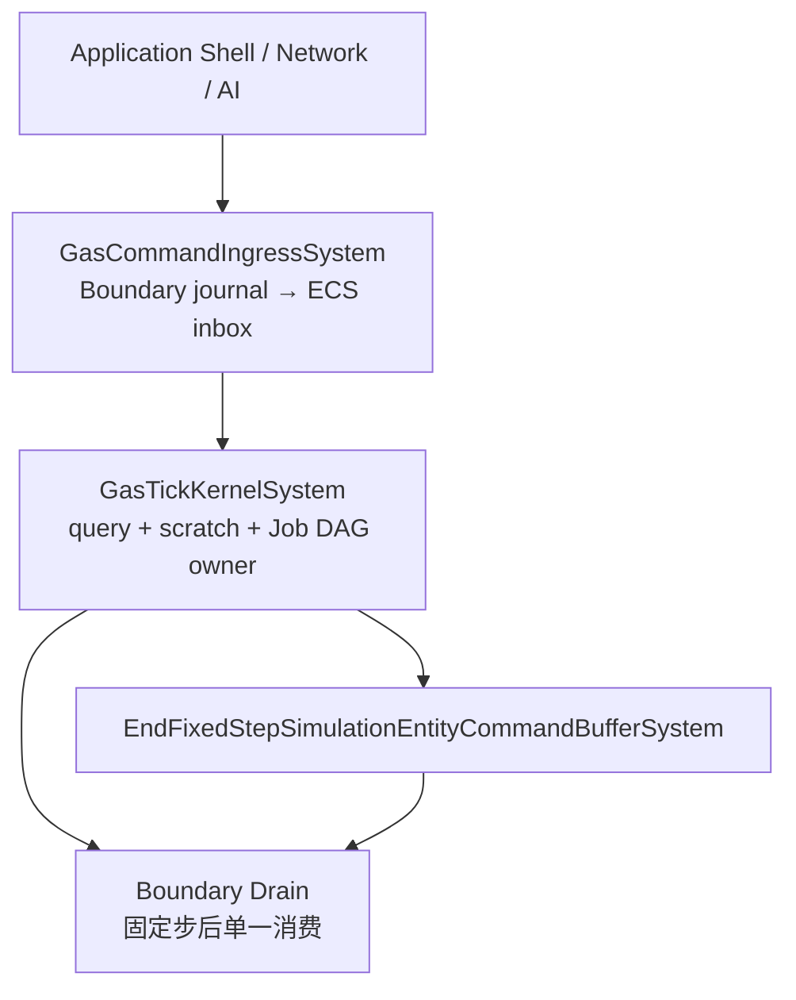

# 03A：执行域与数据流

> Owner：`01-目标态架构共识/03-RuntimeCore管线` | 状态：目标态子 Spec

本文件只描述 EX-GAS v1 的目标执行域、时序和数据流。Unity 官方事实由 `UnityDOTS官方文档参考` 承载；FixedStep、PostPhysics、same-tick 边界等均是项目裁决，不得引用成 Unity 强制要求。

## 结论

EX-GAS v1 采用以下唯一主链：

1. GAS 使用 `FixedStepSimulationSystemGroup`，所有权威时序使用整数 `SimulationTick`。
2. `GasFixedTickSystemGroup` 是 FixedStep 的直接子 Group，并排在主 `PhysicsSystemGroup` 之后。
3. Runtime Core 只有一个 `GasTickKernelSystem` 拥有 query、tick scratch 和完整 Job DAG；`GasCommandIngressSystem` 是 CommandPort 能力的必装配对，只在 pre-Fixed window 把 Boundary 持久 journal 搬入 ECS inbox，必须 `OrderFirst/UpdateBefore` Kernel。Kernel 读 inbox 时不允许任何 writer 以“不同 range”名义 append 同一 DynamicBuffer。
4. 每个渲染帧允许执行 `0..N` 个 simulation tick；render frame 不是 cooldown、duration、period 或 sequence 的时间单位。
5. 标准 `EndFixedStepSimulationEntityCommandBufferSystem` 是 v1 结构变化提交点；Core 不设置自定义中途 playback。
6. Ability 直接输出与生成期验证为闭合、有限、可定界的 pre-apply effect program 可以 same tick；Gameplay Fact reaction 默认下一 tick。
7. Attribute、Tag、ActiveEffect 的权威状态归其 ASC；GrantedAbility、Activation、Continuation、CooldownGate 归 owner ASC。OwnerWave 只能写显式 Cost/Cooldown commit contract 涉及的本 ASC Attribute/Tag/Gate，普通 Effect mutation 仍归后续 TargetPrepare/Publish。不同 ASC 并行，同一 ASC 在各 wave 内只有一个 writer，各 lane 由 JobHandle 严格串联。
8. 每个 World 同时只能有一个 active `GasSession` Tick domain；整 Tick 在任何 gameplay 权威写入前完成基础设施准入，准入失败只锁存 Session Fault，不发布半 Tick gameplay 状态。
9. OwnerWave 之后的 target 工作采用 `TargetPrepare -> SessionFaultReduce -> TargetPublish`：所有 target mutation、Fact/Cue/route/ECB intent 先进入 tick-local shadow；任一 fatal candidate 都丢弃本 Tick **全部 target shadow**，但不回滚已经提交的 owner cost/cooldown/activation 前缀。v1 的 infrastructure、stabilization、identity/proof overflow 均为 Session-fatal，不伪装成 battle-local rejection。

## 官方机制与项目裁决

| 结论 | 层级 | 依据或理由 |
|---|---|---|
| FixedStep 可能一帧更新多次 | 官方事实 | Entities 1.4.6 `systems-time.md` |
| FixedStep 已创建双 Rewindable group allocator | 官方事实 | Entities 1.4.6 `DefaultWorld.cs` 与 `allocators-system-group.md` |
| ECB 可集中结构变化，playback 在主线程执行 | 官方事实 | `performance-sync-points.md`、`systems-entity-command-buffer-use.md` |
| GAS v1 选择 FixedStep | EX-GAS 项目决策 | battle tick、period、replay hash 需要离散时序 |
| GAS v1 默认 PostPhysics | EX-GAS 项目决策 | target query 与碰撞事实读取本 tick 已导出的 PhysicsWorld |
| Gameplay Fact reaction 下一 tick | EX-GAS 项目决策 | 保持 tick 主链为有向无环图 |
| 一个 Group + 一个 Kernel | EX-GAS 项目决策 | 解决跨 System scratch owner，并控制 system 固定成本 |
| target fatal 先全局归约再发布 | EX-GAS 项目决策 | 保留 committed-work-wins，同时禁止并行 target 留下半 Session durable state |

## PlayerLoop 与 Physics 顺序

```csharp
/// <summary>
/// EX-GAS v1 的固定步物理执行域；它只负责排序和启停，不承载 gameplay 状态。
/// </summary>
[UpdateInGroup(typeof(FixedStepSimulationSystemGroup))]
[UpdateAfter(typeof(PhysicsSystemGroup))]
public partial class GasFixedTickSystemGroup : ComponentSystemGroup
{
}
```

`GasFixedTickSystemGroup` 必须是 `FixedStepSimulationSystemGroup` 的直接子 Group。不要把全局 GAS Runtime Core 直接挂进 `AfterPhysicsSystemGroup`：Unity Physics 会把该 Group 纳入 Custom Physics World 的复制/更新路径，未来存在多个 PhysicsWorld 时可能重复执行全局 GAS tick。

PostPhysics 的 v1 语义：

- Target Resolve 可以读取当前 physics step 导出的 transform、collision/query 结果。
- GAS 在本 tick 写入的 `PhysicsVelocity`、spawn、destroy 或 collider 变化默认从下一 physics tick 生效。
- Cancel 在 Core slot 中当 tick 生效，但派生 projectile/aura entity 到 EndFixed 才物理销毁。
- v1 不提供第二条 PrePhysics gameplay 主链；若产品要求同 tick 影响当前 physics step，必须另立 ADR。

## Tick 时钟契约

`SimulationTick` 是 `ulong`，仅在 Session=`Ready/Running` 且 Kernel接纳并执行一条完整 gameplay DAG时递增；`SpawnFinalize`、cleanup与teardown maintenance即使由同一 Kernel执行也不得递增。Session 启动后 tick rate不可变，并进入 Session/content hash。

当前 Entities FixedRate/RateManager 的首次 update会在absolute elapsed time `t=0`进入一次物理 FixedStep。Session Install必须显式消费该次`MaintenancePrime`：允许bootstrap/registry结构命令进入标准EndFixed，但不运行gameplay lane、不递增`SimulationTick`。初始业务权威投影进入`BootstrapSemanticHash`；raw Entity/chunk/playback timing只进入maintenance audit。

`TickBatch`只接受单调`absoluteElapsedTime`，调用结果至少返回`Previous/CurrentAbsoluteElapsed、PhysicalFixedUpdates、GameplayTicks、MaintenanceUpdates、First/LastSimulationTick、RemainingDebt、DrainBatchId/BoundaryStatus`。`MaximumDeltaTime`只限制单次追债量，不丢弃debt；实际gameplay fixed count超过`ScaleProfile.MaxGameplayTicksPerBatch`必须在业务写前产生runner/session fault。

每次未Disposed Kernel update都先运行`CleanupAcceptedPrepass`：Accepted live outbox owner折叠回Idle，Accepted cleanup shell的cleanup类型移除记录到本update标准EndFixed。随后才按Session lifecycle选择SpawnFinalize、完整gameplay DAG或teardown maintenance；Terminalizing/FinalDrain/Faulted不靠伪造gameplay Tick完成shell清理。

| 场景 | 必须行为 |
|---|---|
| render frame 没有 fixed update | Boundary command 保留，不清理、不伪造 tick |
| outer update 有 0 fixed update | Core/Physics/EndFixed均不运行；outer Drain仍运行一次，可重试冻结BatchId，不增加SimulationTick |
| render frame 有多个 gameplay fixed update | 每个接纳的 gameplay DAG独立递增、独立 apply；命令只消费一次；maintenance update不占 tick |
| duration / cooldown / period | 生成或 bootstrap 时量化为整数 tick |
| pause / time scale | 由 Session 时钟策略决定，不能混用 render delta |
| tick 溢出 | 显式 fatal fault，不回绕 |

外部命令必须携带producer-scoped `RequestKey/ProducerSourceSequence`；Accept receipt冻结`RequestSequence/AssignedAvailableTick`。Ingress将完整record写入跨tick journal/inbox；WorldUpdateAllocator scratch不能承担“等待下一个tick”的职责。

Fixed-rate catch-up 的 group allocator **不会在同一 outer World update 内的每个 `SimulationTick` 之间 rewind**。因此“scratch 项目所有权只到当前 Tick DAG”为访问契约，不代表内存在每个 Tick 后回收；一次 catch-up 批次的物理高水位会累积。版本化 `ScaleProfile` 必须声明 `MaxFixedTicksPerBatch` 与 `MaximumDeltaTime`，并按 `N × per-tick scratch/facts + period/热点目标/集体死亡 burst + double-rewind 高水位` 建立预算。Headless 整局回放必须分成有界 outer batch，禁止把整局 Tick 塞进一次 World update。

Session Tick domain 使用唯一生命周期：

```text
Install -> SpawnPending -> Ready -> Running -> Terminalizing -> FinalDrain -> Disposing -> Disposed
                         \---------------- Faulted ----------------/
```

`Faulted` 可以从准入、稳定化或基础设施故障进入；它停止新的 gameplay ingress，但仍必须完成既有 producer、标准 EndFixed、Boundary 最终接管和资源清理。`SpawnBatch` 只承诺 gameplay 可见性原子：setup update 记录新 ASC 与 Session `AscRegistrySlot` 为 Pending并在 EndFixed创建；下一 FixedStep 由同一 `GasTickKernelSystem` 的 `SpawnFinalize` maintenance lane全量校验，再 no-fail整批转 `Ready`并发布 Registry。该 maintenance update仍位于标准 Physics之后，但不递增 gameplay SimulationTick且不运行 gameplay DAG；ASC本身不承载 Physics/Transform，Pending batch也不得提前创建可参与 Physics的派生 gameplay Entity，必要派生结构只在 Ready后记录并于再下一 Tick可见。Drain/runner没有 Ready写权。ECB 不提供物理回滚，失败批次进入 `Faulted/Disposing` 并清理，任何成员都不得部分成为 gameplay 可见。

## 单 Kernel 物理架构


```mermaid
flowchart TD
    Shell["Application Shell / Network / AI"]
    Ingress["GasCommandIngressSystem\nBoundary journal → ECS inbox"]
    Kernel["GasTickKernelSystem\nquery + scratch + Job DAG owner"]
    EndFixed["EndFixedStepSimulationEntityCommandBufferSystem"]
    Drain["Boundary Drain\n固定步后单一消费"]

    Shell --> Ingress
    Ingress --> Kernel
    Kernel --> EndFixed
    Kernel --> Drain
    EndFixed --> Drain
```

`GasTickKernelSystem` 是物理 owner，不是巨型业务函数。业务实现拆成命名 Job struct 和 generated pure evaluator；`OnUpdate` 只负责取得 handles、分配 scratch、组装依赖和提交最终 `state.Dependency`。

允许拆出独立 System 的条件：

1. 需要不同 PlayerLoop 或 Physics 排序；
2. 独立拥有跨 tick ECS 状态；
3. 不需要跨 System 传递 tick-local NativeContainer；
4. profile 证明拆分收益大于 system/lookup/dependency 固定成本。

禁止通过 static container、unsafe system ref、singleton service locator 或 phase 间 `Complete()` 传递 scratch。

## Tick Job DAG


```mermaid
flowchart LR
    Gather["Gather / TickStartSnapshot\n+ PlanExpandScratchProvision"]
    Plan["OwnerPlanBuild\nASC-local shadow RYW；零权威写"]
    Resolve["TargetResolve / Expand"]
    Admit["WholeTickInfraAdmission\n全 Tick 上界预留"]
    Owner["AscOwnerCommandWave\nno-fail CommitPlan"]
    Source["SourceSpecProjection"]
    Group["GroupByTarget"]
    Prepare["TargetPrepare\nApply / Stabilize / Death in shadow"]
    Reduce["SessionFaultReduce\ndeterministic first fatal"]
    Publish["TargetPublish\nno-fail durable publish"]
    Fact["StableFactMerge / TerminalResolve"]
    Route["GroupNextTickRouteByDestination"]
    Boundary["BoundaryProject"]
    ECB["Record EndFixed"]

    Gather --> Plan --> Resolve --> Admit --> Owner --> Source --> Group --> Prepare --> Reduce --> Publish --> Fact --> Route --> Boundary --> ECB
```

所有箭头都是 `JobHandle` 数据依赖；实现可以把 target 的 apply/stabilize/death 内联进一个具名 target job，但不能改变语义先后，也不能在 lane 边界调用 `Complete()`。

### Lane 数据契约

| Lane | 输入 | 输出 | 生命周期 |
|---|---|---|---|
| Gather / TickStartSnapshot + PlanExpandScratchProvision | Boundary inbox、RunnableContinuation、上一 Tick PendingCommand、ASC 权威状态、Catalog per-definition maxima、ScaleProfile | 当前 Tick 冻结输入/ASC snapshot，以 sealed/due count + bake maxima 用 checked arithmetic 产生定长 `PlanExpandScratchEnvelopeToken`并在 Job 写前 provision 容器 | tick-local |
| OwnerPlanBuild | Tick-start snapshot、同 ASC 前序 shadow CommitPlan、Definition Blob | 完整 CommitPlan、target/program 上界；不写权威状态 | tick-local |
| TargetResolve / Expand | CommitPlan、PostPhysics snapshot、闭合 Definition program | 完整 target record/effect op 与生成上界 | tick-local |
| WholeTickInfraAdmission | 全 Tick 生成上界、pre-admission scratch envelope token、ScaleProfile 逻辑预算、当前 slab/payload/queue 高水位 | downstream scratch/slab/payload/pending/fact/outbox 预留凭证或 `InfraAdmissionFault`；失败时固定大小 `SessionFaultLatch` | tick-local + 物理容量 |
| AscOwnerCommandWave | 已准入 CommitPlan、tick-start due cooldown maintenance | owner-local Activation/Continuation/Subscription、Cost Attribute mutation、CooldownGate/owned Tag contribution 权威跃迁；不会因容量失败 | durable |
| SourceSpecProjection | admitted 且已 Commit 的计划、其 shadow post-commit capture candidate、committed source identity 与 live policy | 密封不可变 source-bound spec projection；不写 target 持久状态 | tick-local |
| GroupByTarget | target/effect ops、Catalog/CapacityProof work weights | per-target canonical range、`TargetWorkUnits` | tick-local |
| TargetPrepare / Stabilize / Death | target range、OwnerWave 后 durable snapshot、source projection、shadow/durable reservation | `PreparedTargetDelta`、shadow payload/capture、death/fact/cue/route/ECB intents 或固定大小 `FaultCandidate`；零 target durable 写 | tick-local shadow |
| SessionFaultReduce | 每个 target 固定大小 candidate、sealed input hash、`CommittedPrefixHash` | 成功 publish token，或按 `FaultCandidateKey` 归约的唯一 Session fault；不写 target durable state | tick-local + Session control |
| TargetPublish | 全部 prepared delta、publish token、预分配 durable slot/range | 按 target 并行、单 writer、无校验/分配失败的 Effect/Attribute/Tag/Grant/Activation cleanup/ledger/LiveDependency durable publish | durable |
| StableFactMerge / TerminalResolve | 已发布 target 的分区 facts/death candidates、BattleInstance registry | 稳定全序事实、per-BattleInstance 唯一终局裁决；仅当全部实例终局或显式 stop 时推进 Session Terminalizing | tick-local + Battle/Session registry |
| GroupNextTickRouteByDestination | next-tick facts/live dirty | 按 destination ASC 分组的 `PendingCommand(t+1)` | 跨 Tick |
| BoundaryProject | merged facts | ASC-scope → 对应 ASC outbox；Battle/Session-scope → 唯一 Session outbox | 跨 FixedStep，直到 managed 接管；每 fact 恰有一个 owner |
| Record EndFixed | 已准入结构 intent | 标准 EndFixed ECB commands | EndFixed playback |

`WholeTickInfraAdmission` 必须在任何 gameplay 权威写前完成：按 [25](../25-配置语义编译契约与CapacityProof统一裁决Spec.md) 的生成期 `CapacityProof` 和本 Tick 已解析目标，为 downstream scratch、target shadow overlay、shadow payload/capture/fact/cue/route/ECB intent、会增长的 durable slab/non-compacting range、PendingCommand、Fact partition 与 Boundary outbox 同时完成逻辑预算校验和物理预留。每个 target 的 `TargetWorkUnits` 必须用 checked arithmetic 计算并不超过版本化 ScaleProfile 的硬门槛；禁止因内存足够就放行无界单 bucket 串行工作。shadow credit 与 durable publish credit 是两份独立 credit，前者允许 Prepare 构造完整候选，后者给 Publish 预分配确定 slot/range；不得复用同一数字掩盖双份峰值。

下游 Job 仍预排在同一 `JobHandle` DAG 并依赖、读取 tick-local `AdmissionResult`；任一项失败时，Owner/Target/Fact/Structural 分支只走 no-op，gameplay 权威零写且不发布 gameplay fact/结构 intent，只有 `FaultLatchJob` 在 DAG 内写固定大小 `SessionFaultLatch=Detected`。它冻结 `FaultId/Epoch/FaultTick/Reason + sealed subset range/count/hash`；失败 Tick 不向可能正是耗尽资源的 fact/outbox 写逐 request 回执。DAG 完成后的 `FaultCloseHandshake` 与 CommandPort accept 在同一 `SessionIngressGate` 上线性化，将 latch 终结为 `IngressClosed`，并冻结关闭点前 accepted-outstanding 的 first/last/count/hash 摘要；精确 membership 由 Request ledger判定，包含 unsealed/future tail。关闭后请求同步拒绝，关闭前 outstanding 全部由同一 FaultId终结且不重放。禁止为决定是否调度下游而中途 `Complete()`；FaultClose 只复用 outer runner/Boundary已有 completion fence，不在 gameplay DAG中新增 fence。准入成功后，OwnerWave、TargetPrepare 与 TargetPublish不再把容量不足当作业务分支。

OwnerPlanBuild/TargetResolve 本身在 admission 之前写 variable scratch，因此不能由后续 admission 追溯保护。`PlanExpandScratchProvision` 只做内存 envelope，不是第二 gameplay admission：Gather 用 sealed command/due-work count、tick-start handle→Definition lookup 与 bake-time per-definition maxima 计算 plan/expand 最大元素/字节，验证 ScaleProfile 逻辑上限并在两个 Job 写入前建立容量。checked arithmetic/逻辑上限失败时 token 携带 fault candidate，已预排的 Plan/Expand 统一 no-op，后续 `WholeTickInfraAdmission` 将其提升为唯一 `AdmissionResult=Failed`；宿主 allocator/OOM 仍是 fatal environment failure。WholeTick admission 则验证 envelope token 并只预留实际展开后的 downstream scratch/durable stores。

多目标 Effect 不承诺跨目标业务事务：requirement、immunity、TargetLifePolicy、stack deny 等 typed business outcome 仍逐 target 独立，并作为正常 prepared result 一同发布。全 target shadow discard 只用于 Session-fatal infrastructure/stabilization/identity/proof fault，不把业务拒绝升级为分布式 rollback。

当下游调度需要上游动态长度时，使用 deferred array、scheduled construct、prefix sum 或等价依赖安全机制；禁止主线程完成上游 Job 只为读取长度。

## Same-tick 与 Next-tick

### 允许 same tick

- 当前 tick 开始前已存在的 Boundary/AI intent；
- 当前 tick resume 的 continuation 直接输出；
- Ability Activate/Commit 在 OwnerPlanBuild 中形成、通过整 Tick admission 后由 OwnerWave 提交的 CommitPlan；
- 生成期证明为闭合、无回边、静态可定界且不读取 post-apply facts 的 effect program。

“无环”不是充分条件。same-tick program 还必须有静态节点上限、输出上限、唯一拓扑顺序和 canonical tie-breaker；指数展开或间接 Definition dispatch 必须在发布门禁中拒绝。

OwnerPlanBuild 先在 shadow 释放 tick-start 已 due 的 CooldownGate，再只读取 Tick-start snapshot 和同一 ASC 更早的 shadow CommitPlan，形成 canonical read-your-writes；它不读取本 Tick 任何 incoming target effect。普通 self GE 也必须进入 TargetPrepare，所以不能反向影响本 Tick 后续 `CanActivate`。若 Definition 要求某个状态 same-tick 影响后续 `CanActivate`，该状态必须被声明为显式 owner commit invariant：Cost 直接更新同一 `AttributeValueSlot` 权威，Cooldown 使用 ASC-owned `CooldownGateSlot`，Activation-owned contribution 仍仅随 Activation 生存。它们不得镜像 Attribute/Tag/Effect 或借普通 self GE 提前可见；无法满足者在 Definition bake 时失败。Cost/Cooldown 的逐字段支持/拒绝矩阵、固定诊断码与 CapacityProof 唯一由 [25](../25-配置语义编译契约与CapacityProof统一裁决Spec.md) 定义，本文件不复制第二份矩阵。

### 必须 next tick

- Attribute/Tag/Death/Hit 等 Gameplay Fact 触发的新 Ability 或 GE；
- target apply 或 stabilization 阶段才产生的跨 target overflow/reaction；
- 依赖本 tick 最终 aggregator/tag 稳定态的程序；
- 需要查询 EndFixed 新建 entity 的逻辑。

`PendingCommand` 必须记录 `AvailableTick = CurrentTick + 1`，不得在同一次 Kernel update 中回读。

## TargetPrepare、SessionFaultReduce 与 TargetPublish

每个 target ASC 是唯一逻辑 writer。同一 target 的 command range 按 canonical key 串行，不同 target 并行；但 Prepare writer 只写该 target 的 sparse overlay、new-slot image、payload range 与 intent partition，不得写 durable Buffer、发布 live slot、写 Boundary outbox 或记录 ECB command。overlay 必须对同 target 前序 prepared application 提供 canonical read-your-writes，因此不是从同一 tick-start snapshot 独立计算每条 application。

已由 OwnerWave Commit 的远端工作采用 **committed-work-wins**：source 在后续 target transaction 中死亡，不撤回已提交的 application op。每条 application 在自己的 canonical 线性化点依据目标 `AscLifecycle` 和 Definition `TargetLifePolicy` 重新校验；`AliveOnly` 在首次死亡已冻结后对该 target range 的后续 application 输出 typed rejection。不得用 `EntityManager.Exists` 或 cleanup shell 存在性代替业务生命状态。

TargetPrepare 内部顺序：

1. 在 shadow 中应用初始 ability/effect/stack/remove mutation；
2. 更新 exact/inclusive Tag count；
3. 重评受影响的 ongoing/removal requirements；
4. 更新 inhibition、granted tags 和 aggregator dirty state；
5. 重复到稳定；
6. 重算 dirty Attribute channels 并递增相关 Revision；
7. 在本条 application transaction 内冻结首次 death crossing/provenance，再处理下一 canonical application；
8. 只为最终稳定状态形成 shadow facts/cues/routes/structural intents 与 `PreparedTargetDelta`。

生成期检查静态有符号依赖图并保守拒绝危险循环，同时由 [25](../25-配置语义编译契约与CapacityProof统一裁决Spec.md) 为可接受定义产出最大 transition/work、overlay/payload 与 publish delta 证明；运行时仍必须检测不收敛和 proof breach。每个 target 无论成功或失败都写一个固定大小 record；fatal record 的 canonical key 至少为：

```text
FaultCandidateKey =
  (SimulationEpoch, SimulationTick, TargetAscStableId,
   EffectApplicationIdOrZero, StabilizationRound,
   StateHash, FaultKindOrdinal)
```

`SessionFaultReduce` 在所有 Prepare 完成后按该 key 取字典序最小 fatal candidate；同 key payload/hash 不同本身是 deterministic identity fault。若存在 fatal，publish token 不生成，本 Tick 全部 target overlay、payload、Fact/Cue/route/ECB intent 一次丢弃；v1 锁存唯一 Session fault 并关闭 Session ingress，不允许只杀某个 BattleInstance。OwnerWave 已经提交的 cost/cooldown/activation source work 不回滚，而是以 `CommittedPrefixHash` 进入 fault semantic evidence；这正是 committed-work-wins 在 fatal 路径的边界。

只有 reduce 证明零 fatal 时，`TargetPublish` 才按 target 并行把 `PreparedTargetDelta` 写入 admission 预分配的 durable slot/range。Publish 不再执行 requirement、分配、grow、capture、stabilization 或业务回调；任何 reservation/delta mismatch 都是实现不变量破坏，不能返回局部 outcome。全部 target publish 完成后才允许 StableFactMerge、next-tick route、BoundaryProject 与 ECB record 消费对应 intents。

## 结构变化与可见性

v1 使用 Unity 标准 `EndFixedStepSimulationEntityCommandBufferSystem`：

| 变化 | 是否结构变化 | Core 可见性 |
|---|---:|---|
| Attribute/Tag/slot 内容写入 | 否 | 当前 target apply |
| GrantedAbility/Continuation/ActiveEffect slab 分配或释放 | 否 | 当前 target apply |
| Activate/Commit/Cancel 状态转换 | 否 | 当前 target apply |
| ASC/projectile/aura entity create/destroy | 是 | EndFixed 后；Core 默认下一 tick |
| Add/Remove 可选 component | 是 | EndFixed 后 |

Core 不得让 Activate/Commit 成功依赖 ECB-created entity 在当前 tick 可查询。

`SpawnBatch` 的原子性是 `Pending -> Ready` 的 Registry/gameplay 可见性，不是 ECB 的物理回滚。Registry authority 是 Session 的 non-compacting `AscRegistrySlot[]`；`SpawnFinalize` 是唯一 Ready publisher，首个 gameplay Tick的 Gather只从 Ready entry构建 tick-local `OwnerAscHandle -> Entity` lookup。`AscLifecycle` 至少区分 `Pending、Ready/Alive、Terminal、DestroyPending`；cleanup shell 没有业务存活资格。每个 BattleInstance 的终局由 `StableFactMerge/TerminalResolve` 在全部 target worker 完成后唯一裁决，只关闭该实例 ingress；仅当全部实例终局或显式 stop 时才推进 Session Terminalizing。任一 target worker 都不得抢先关闭 BattleInstance 或整个 Session。

独立 World、Headless runner 或手工 TickBatch 不得只手动 Update GAS 子 Group。TickBatch owner 必须更新完整的 FixedStep 父链，使 Physics、GAS、标准 EndFixed playback 与 allocator 切换按正式 PlayerLoop 顺序执行；否则验证结果不代表目标架构。

## 验收

1. runtime world 中只有一个 GAS 固定步 Group 和一个 tick scratch owner。
2. 一帧 0 tick 时命令不丢；多 tick 时命令、period、facts 不重复。
3. GAS 在主 PhysicsSystemGroup 后运行，且不会随 Custom PhysicsWorld 重复 tick。
4. 无 phase 间 `Complete()`、跨 System NativeContainer owner 或手写 FrameArena Rewind。
5. 所有 same-tick program 通过闭合性、无环、静态输出上限和 canonical order 门禁。
6. Gameplay Fact reaction 只进入下一 tick。
7. 手工 runner 更新完整 FixedStep 父链，标准 EndFixed command 确实 playback。
8. 整 Tick准入失败时权威状态零写且 Session 进入确定性 Fault；准入成功后 OwnerWave、TargetPrepare 与 TargetPublish 不出现容量分支。
9. source 死亡不撤回已 Commit 工作；`AliveOnly` 在目标 application 线性化点可复现地拒绝首死后的后续工作。
10. 一 World 只有一个 active GasSession，SpawnBatch 不会部分发布 Ready ASC。
11. ScaleProfile 声明 `MaxFixedTicksPerBatch/MaximumDeltaTime`；catch-up 与 headless 批次内存按 N Tick 累积验收。
12. 性能阈值只来自具名 ScaleProfile；本 Spec 不维护固定毫秒、容量或实体数量。
