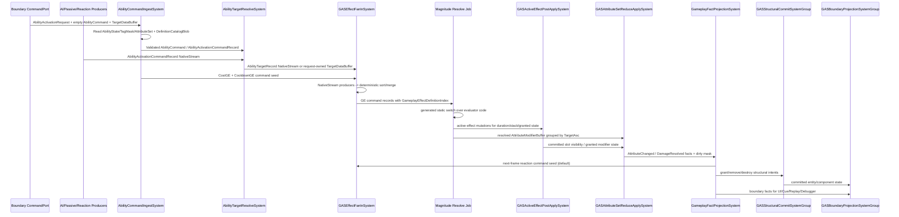

# 03B-01：业务调用链

> Owner：`01-目标态架构共识/03-RuntimeCore管线/03B-业务调用链与配置消费` | 状态：目标态 Spec | 最近拆分：2026-06-08

本文件只描述目标态 GAS DOTS 业务调用链。当前代码事实、迁移流水、验证数字和下一步任务必须回到对应 owner。

## 真实 GAS DOTS 业务调用链

以“单位释放技能造成伤害，并施加冷却/消耗/命中事实”为例，目标态调用链不是 OOP service 调用，而是 ECS 数据从一个 lane 流到下一个 lane：

1. Boundary / network / player input 创建 1 个 request/command entity，包含 `AbilityActivationRequestComponent`、占位 `AbilityCommandComponent` 和可选 `TargetDataBuffer`；它只表示一次外部激活意图，不为每个 target/effect/modifier 创建临时 entity。
2. AI autocast、passive、period、reaction 这类 Core 内部高频来源不创建 request entity；它们以 `IJobChunk` producer 写 `AbilityActivationCommandRecord` 到 `NativeStream`。
3. `AbilityCommandIngestSystem` 只读 `AbilityStateComponent`、`TagMaskComponent`、AttributeSet current/base 和 `GASDefinitionCatalogComponent` 的 BlobRef，校验外部 request；低量物化路径可写同一个 request entity 上的 `AbilityCommandComponent`，scale-ready 路径写 `AbilityActivationCommandRecord`。cost/cooldown 不直接写属性，而是生成成本 GE / 冷却 GE command seed。
4. `AbilityTargetResolveSystem` 处理 command record 或 request/command entity，按 `AbilityDefinitionBlob.TargetRuleCode`、显式目标或 physics snapshot 生成 deterministic target records；低量物化路径可写 request-owned `TargetDataBuffer`，高频路径写 `NativeStream` `AbilityTargetRecord`。Ability Entity 不承载单次激活上下文。
5. `GASEffectFanInSystem` 合并 ability payload、cost、cooldown、period tick、previous-frame reaction seed；多 producer 写 `NativeStream`，merge 后按 `(TargetSortKey, Sequence)` 确定性排序。GE command 携带 `GameplayEffectDefinitionIndex`，后续读取 `ref readonly GameplayEffectDefinitionBlob`。
6. Magnitude Resolve 读取 source/target AttributeSet snapshot 和 GE modifier definition，使用 generated static switch 默认计算 MMC；只有同 evaluator 大批量时才允许 FunctionPointer batch，禁止 per-entity invoke。
7. `GASActiveEffectPostApplySystem` 只更新 owner-local `ActiveGameplayEffectBuffer` slot、stack、duration、granted tag mask / ability state，不创建 effect entity；ability 可见性默认来自 `AbilityStateComponent.State/Flags`，不是 enableable grant/revoke。
8. `GASAttributeSetReduceApplySystem` 对 target grouped modifier 做 reduce/apply，写 AttributeSet current 和 `AttributeDirtyMaskComponent`，并追加 Core fact。
9. `GameplayFactProjectionSystem` 消费 dirty mask 和事实，生成 reaction fact、structural intent、boundary fact；默认新 GE command seed 进入下一帧，只有显式 bounded reaction pass 才允许同帧回流。
10. `GASStructuralCommitSystemGroup` 统一播放 ECB 或执行 bulk structural change。
11. `GASBoundaryProjectionSystemGroup` 只读 committed Core state 和 facts，写 read model / presentation outbox / replay/debug，不反向驱动 Core。

**逻辑链不变量：**

- Validation 只决定“能否进入 Core command”，不把 cost/damage/cooldown 散落写入多个系统。
- Ability Entity 只保存 granted ability 的跨帧状态；单次激活的 target、command status、cost/cooldown seed、target sort key 属于 Boundary request/command entity 或 Core frame-local command/target record，不属于 Ability Entity。
- Request entity 不是 runtime command bus。外部意图低频物化为 request entity；Core 内部高频触发默认写 `NativeStream` records。
- 所有影响 battle hash 的 fan-in 输出必须有显式 sort key，不依赖 worker 调度顺序。
- Attribute 写入只有 Attribute lane 负责；其他 lane 读取 AttributeSet snapshot 或写 modifier/fact。
- Fact 是 Core 内部 reaction 输入；Presentation event 是 Boundary 输出，两者不共用 event bus。
- 同帧主链默认无环；reaction 默认下一帧 seed，避免无界递归和不确定时序。
- Luban 配置只通过只读 Definition Catalog / generated lookup / Generated Runtime Glue 进入 Core；Runtime lane 不允许反查 managed row、JSON、`Dictionary` 或 per-definition entity query。

---
