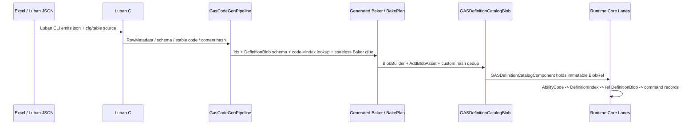

# 03B-02：Luban 配置生成链 Runtime 消费

> Owner：`01-目标态架构共识/03-RuntimeCore管线/03B-业务调用链与配置消费` | 状态：目标态 Spec | 最近拆分：2026-06-08

本文件只描述目标态 Luban / CodeGen / Baker / Definition Catalog 到 Runtime Core 的只读消费链。当前实现状态和验证结果必须回到对应 owner。

## Luban 配置生成链 Runtime 消费链

Luban 配置进入 GAS Runtime 的目标态不是“运行时拿 `cfg.*` 表、`Dictionary` 或 `GASDefinitionTable` 查配置”，而是把配置在 Baking / bootstrap 边界折叠成只读 Blob Catalog，Runtime lane 只按 DOTS 数据访问它。



**Runtime 消费原则：**

1. `cfg.*`、`XLuban`、`SimpleJSON`、JSON reader、managed row、row factory 不进入 GAS Runtime Core assembly。
2. `GASGeneratedDefinitionBlobComponent<T>` 可作为 baking output / bootstrap 收集入口，但 Runtime hot path 不查询“每个定义一个 entity”。
3. 每个 battle World 只有一个 `DefinitionCatalogSingleton`，持有 `GASDefinitionCatalogComponent`。它是只读 BlobRef 入口，不是可变 registry manager。
4. Ability grant 低频阶段将 `AbilityCode` 解析为 `AbilityDefinitionIndex`，写入 Ability Entity；Activation / Target / Fan-In / Magnitude 默认使用 index 读取 `ref readonly AbilityDefinitionBlob` / `ref readonly GameplayEffectDefinitionBlob`。
5. 小表 lookup 可生成 static switch；中大型表默认在 `BlobArray` 中按 code 排序并二分；只有大量 mod/content 且 profiler 证明需要时，才生成 perfect hash / range table。
6. 含 `BlobArray`、`BlobString`、`BlobPtr` 的 definition 不按值返回；lookup API 使用 `TryGet*Index()` + `Get*()` 的 index/ref readonly 模式。
7. Generated Runtime Glue 不只是 lookup。它必须把 Ability / GE / Modifier / Requirement / TargetRule definition 转换为 Runtime lane 可消费的 record：`AbilityActivationPlanRecord`、`GECommandSeedRecord`、`ResolvedModifierRecord`。Glue 只做纯解析和纯计算，不创建 entity、不播放 ECB、不查询 `EntityManager`、不拥有 `NativeContainer`。

**完整代码骨架：Definition Catalog 与 Runtime 读取**

```csharp
using Unity.Burst;
using Unity.Entities;

namespace GAS.Runtime
{
    public struct GASDefinitionCatalogComponent : IComponentData
    {
        public BlobAssetReference<GASDefinitionCatalogBlob> DefinitionCatalogBlob;
        public uint SchemaHash;
        public uint ContentHash;
    }

    public struct GASDefinitionCatalogBlob
    {
        public uint SchemaHash;
        public uint ContentHash;
        public BlobArray<int> AbilityCodes;
        public BlobArray<AbilityDefinitionBlob> Abilities;
        public BlobArray<int> GameplayEffectCodes;
        public BlobArray<GameplayEffectDefinitionBlob> GameplayEffects;
        public BlobArray<ModifierDefinitionBlob> Modifiers;
        public BlobArray<RequirementDefinitionBlob> Requirements;
        public BlobArray<TagMaskDefinitionBlob> TagMasks;
        public BlobArray<GrantedAbilityDefinitionBlob> GrantedAbilities;
        public BlobArray<GameplayTagDefinitionBlob> GameplayTags;
        public BlobArray<AttributeDefinitionBlob> Attributes;
    }

    public struct AbilityDefinitionBlob
    {
        public int AbilityCode;
        public int PrimaryGameplayEffectCode;
        public int CostGameplayEffectCode;
        public int CooldownGameplayEffectCode;
        public int TargetRuleCode;
        public int ActivationRequirementStart;
        public ushort ActivationRequirementCount;
        public short MaxLevel;
    }

    public struct GameplayEffectDefinitionBlob
    {
        public int GameplayEffectCode;
        public int DurationFrames;
        public int PeriodFrames;
        public int StackingPolicyCode;
        public int ModifierStart;
        public ushort ModifierCount;
        public int ApplicationRequirementStart;
        public ushort ApplicationRequirementCount;
        public int GrantedTagMaskIndex;
        public int GrantedAbilityStart;
        public ushort GrantedAbilityCount;
    }

    public struct ModifierDefinitionBlob
    {
        public int AttributeCode;
        public int MagnitudeEvaluatorCode;
        public int MagnitudeParameterStart;
        public ushort MagnitudeParameterCount;
        public float BaseMagnitude;
        public byte OperationCode;
        public byte TargetAttributeSetCode;
    }

    public struct RequirementDefinitionBlob
    {
        public int RequiredTagMaskIndex;
        public int BlockedTagMaskIndex;
        public int AttributeCode;
        public float Threshold;
        public int FailureReasonCode;
        public byte RequirementKind;
        public byte CompareOp;
    }

    public struct TagMaskDefinitionBlob
    {
        public ulong Word0;
        public ulong Word1;
        public ulong Word2;
    }

    public struct GrantedAbilityDefinitionBlob
    {
        public int AbilityCode;
        public short LevelDelta;
    }

    public struct GameplayTagDefinitionBlob
    {
        public int TagCode;
        public ulong AncestorMaskWord0;
        public ulong AncestorMaskWord1;
        public ulong AncestorMaskWord2;
    }

    public struct AttributeDefinitionBlob
    {
        public int AttributeCode;
        public int AttributeSetCode;
        public float DefaultBaseValue;
        public float MinValue;
        public float MaxValue;
    }

    public static class GASGeneratedDefinitionLookup
    {
        public static bool TryGetAbilityIndex(ref GASDefinitionCatalogBlob catalog, int abilityCode, out int index)
        {
            var lo = 0;
            var hi = catalog.AbilityCodes.Length - 1;

            while (lo <= hi)
            {
                var mid = (lo + hi) >> 1;
                var compare = catalog.AbilityCodes[mid].CompareTo(abilityCode);
                if (compare == 0)
                {
                    index = mid;
                    return true;
                }

                if (compare < 0)
                    lo = mid + 1;
                else
                    hi = mid - 1;
            }

            index = -1;
            return false;
        }

        public static ref readonly AbilityDefinitionBlob GetAbility(ref GASDefinitionCatalogBlob catalog, int index)
        {
            return ref catalog.Abilities[index];
        }

        public static bool TryGetGameplayEffectIndex(ref GASDefinitionCatalogBlob catalog, int gameplayEffectCode, out int index)
        {
            var lo = 0;
            var hi = catalog.GameplayEffectCodes.Length - 1;

            while (lo <= hi)
            {
                var mid = (lo + hi) >> 1;
                var compare = catalog.GameplayEffectCodes[mid].CompareTo(gameplayEffectCode);
                if (compare == 0)
                {
                    index = mid;
                    return true;
                }

                if (compare < 0)
                    lo = mid + 1;
                else
                    hi = mid - 1;
            }

            index = -1;
            return false;
        }

        public static ref readonly GameplayEffectDefinitionBlob GetGameplayEffect(ref GASDefinitionCatalogBlob catalog, int index)
        {
            return ref catalog.GameplayEffects[index];
        }
    }
}
```

这段代码的关键不是“新增一个全局服务”，而是把 Runtime 配置入口收窄为一个不可变 BlobRef：`GASDefinitionCatalogComponent` 可以作为 singleton 查询，但 singleton 本身没有写者，符合 PackageCache 对 singleton dependency 的限制；真正 hot path 只传 `BlobAssetReference<GASDefinitionCatalogBlob>` 给 job。Catalog 采用 range-based 布局：Ability / GE 只保存 `Start + Count`，Modifier / Requirement / GrantedAbility 等可变长数据集中在根 BlobArray 中。这样既符合 Blob 内部指针必须通过 `ref` 访问的官方约束，也避免每个 definition 形成小型嵌套对象图，Magnitude Resolve 可以按连续 range 顺序遍历。
