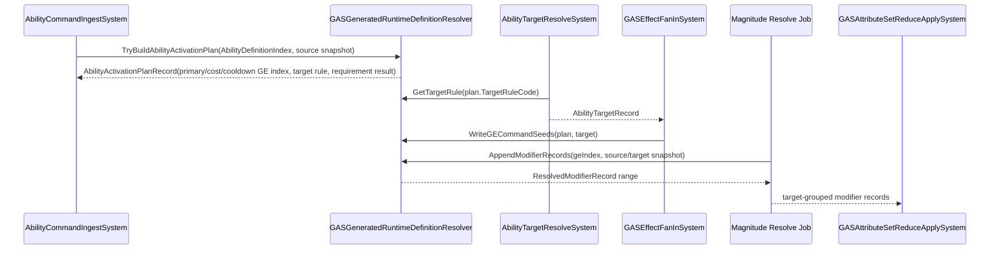

# 03B-03：Generated Runtime Glue 消费接口

> Owner：`01-目标态架构共识/03-RuntimeCore管线/03B-业务调用链与配置消费` | 状态：目标态 Spec | 最近拆分：2026-06-08

本文件只描述目标态 Generated Runtime Glue 的纯消费接口。它不是当前 generated artifact 清单，也不记录运行时迁移进度。

## Generated Runtime Glue：真实 GAS 业务消费接口

Luban / SourceGenerator 进入 Runtime Core 的目标不应停留在“生成 Blob schema + code lookup”。真实 GAS 业务中，每个 Runtime lane 都需要知道“从 Ability 定义如何得到可执行计划”“从 GE 定义如何展开 modifier range”“需求失败如何给出稳定 reason”“target rule code 对应哪些 unmanaged 参数”。如果这些逻辑散落在多个 System 中，调用者会反复理解 Luban 字段语义，最终又退回 OOP manager / registry 模式。

目标态把这层收束为 generated static glue。它不是 entity、不是 component、不是 singleton，也不是可变服务；它只接收 BlobRef、definition index、运行时快照和 frame-local writer，输出可排序的 record。



**完整代码骨架：Generated Runtime Glue**

```csharp
using Unity.Burst;
using Unity.Collections;
using Unity.Entities;

namespace GAS.Runtime
{
    public struct AttributeSnapshotRecord
    {
        public float Health;
        public float Mana;
        public float Shield;
        public float AttackPower;
    }

    public struct AbilityStateComponent : IComponentData
    {
        public int AbilityCode;
        public int AbilityDefinitionIndex;
        public short Level;
        public int NextAvailableFrame;
        public byte IsGranted;
    }

    public struct AbilityActivationPlanRecord
    {
        public Entity SourceAsc;
        public Entity AbilityEntity;
        public int AbilityCode;
        public int AbilityDefinitionIndex;
        public int PrimaryGameplayEffectDefinitionIndex;
        public int CostGameplayEffectDefinitionIndex;
        public int CooldownGameplayEffectDefinitionIndex;
        public int TargetRuleCode;
        public short Level;
        public int InputSequence;
        public int FailureReasonCode;
        public byte IsValid;
    }

    public struct AbilityTargetRecord
    {
        public Entity SourceAsc;
        public Entity TargetAsc;
        public int AbilityDefinitionIndex;
        public int TargetSortKey;
        public int InputSequence;
    }

    public struct GECommandSeedRecord
    {
        public Entity SourceAsc;
        public Entity TargetAsc;
        public int GameplayEffectDefinitionIndex;
        public int AbilityDefinitionIndex;
        public short Level;
        public int Frame;
        public int Sequence;
        public int TargetSortKey;
        public byte SeedKind;
    }

    public struct MagnitudeEvalContext
    {
        public Entity SourceAsc;
        public Entity TargetAsc;
        public AttributeSnapshotRecord SourceAttributes;
        public AttributeSnapshotRecord TargetAttributes;
        public TagMaskComponent SourceTags;
        public TagMaskComponent TargetTags;
        public short Level;
        public int Frame;
    }

    public struct ResolvedModifierRecord
    {
        public Entity SourceAsc;
        public Entity TargetAsc;
        public int GameplayEffectDefinitionIndex;
        public int ModifierDefinitionIndex;
        public int AttributeCode;
        public float Magnitude;
        public byte OperationCode;
        public int TargetSortKey;
    }

    public static class GASFailureReasonCodes
    {
        public const int CooldownNotReady = 1001;
        public const int MissingPrimaryGameplayEffect = 1002;
        public const int MissingCostGameplayEffect = 1003;
        public const int MissingCooldownGameplayEffect = 1004;
    }

    public static class GASGESeedKind
    {
        public const byte Primary = 1;
        public const byte Cost = 2;
        public const byte Cooldown = 3;
    }

    public static class GASRequirementKind
    {
        public const byte None = 0;
        public const byte AttributeAtLeast = 1;
    }

    public static class GASMagnitudeEvaluatorCodes
    {
        public const int Flat = 1;
        public const int ScaleByLevel = 2;
        public const int SourceAttackPower = 3;
    }

    public static class GASAttributeCodes
    {
        public const int Health = 1;
        public const int Mana = 2;
        public const int Shield = 3;
        public const int AttackPower = 4;
    }

    public static class GASGeneratedAttributeSnapshotAccessor
    {
        public static float GetValue(in AttributeSnapshotRecord snapshot, int attributeCode)
        {
            switch (attributeCode)
            {
                case GASAttributeCodes.Health:
                    return snapshot.Health;
                case GASAttributeCodes.Mana:
                    return snapshot.Mana;
                case GASAttributeCodes.Shield:
                    return snapshot.Shield;
                case GASAttributeCodes.AttackPower:
                    return snapshot.AttackPower;
                default:
                    return 0f;
            }
        }
    }

    [BurstCompile]
    public static class GASGeneratedRuntimeDefinitionResolver
    {
        public static bool TryBuildAbilityActivationPlan(
            BlobAssetReference<GASDefinitionCatalogBlob> catalogRef,
            Entity sourceAsc,
            Entity abilityEntity,
            in AbilityStateComponent abilityState,
            in TagMaskComponent sourceTags,
            in AttributeSnapshotRecord sourceAttributes,
            int currentFrame,
            int inputSequence,
            out AbilityActivationPlanRecord plan)
        {
            plan = default;
            if (!catalogRef.IsCreated || abilityState.IsGranted == 0)
                return false;

            if (abilityState.AbilityDefinitionIndex < 0 ||
                abilityState.AbilityDefinitionIndex >= catalogRef.Value.Abilities.Length)
                return false;

            ref var catalog = ref catalogRef.Value;
            ref readonly var ability = ref GASGeneratedDefinitionLookup.GetAbility(
                ref catalog,
                abilityState.AbilityDefinitionIndex);

            plan.SourceAsc = sourceAsc;
            plan.AbilityEntity = abilityEntity;
            plan.AbilityCode = ability.AbilityCode;
            plan.AbilityDefinitionIndex = abilityState.AbilityDefinitionIndex;
            plan.Level = abilityState.Level;
            plan.InputSequence = inputSequence;
            plan.TargetRuleCode = ability.TargetRuleCode;

            if (abilityState.NextAvailableFrame > currentFrame)
            {
                plan.FailureReasonCode = GASFailureReasonCodes.CooldownNotReady;
                return false;
            }

            if (!GASGeneratedRequirementEvaluator.PassesRequirements(
                    ref catalog,
                    ability.ActivationRequirementStart,
                    ability.ActivationRequirementCount,
                    in sourceTags,
                    in sourceAttributes,
                    out plan.FailureReasonCode))
            {
                return false;
            }

            if (!GASGeneratedDefinitionLookup.TryGetGameplayEffectIndex(
                    ref catalog,
                    ability.PrimaryGameplayEffectCode,
                    out plan.PrimaryGameplayEffectDefinitionIndex))
            {
                plan.FailureReasonCode = GASFailureReasonCodes.MissingPrimaryGameplayEffect;
                return false;
            }

            plan.CostGameplayEffectDefinitionIndex = -1;
            if (ability.CostGameplayEffectCode > 0 &&
                !GASGeneratedDefinitionLookup.TryGetGameplayEffectIndex(
                    ref catalog,
                    ability.CostGameplayEffectCode,
                    out plan.CostGameplayEffectDefinitionIndex))
            {
                plan.FailureReasonCode = GASFailureReasonCodes.MissingCostGameplayEffect;
                return false;
            }

            plan.CooldownGameplayEffectDefinitionIndex = -1;
            if (ability.CooldownGameplayEffectCode > 0 &&
                !GASGeneratedDefinitionLookup.TryGetGameplayEffectIndex(
                    ref catalog,
                    ability.CooldownGameplayEffectCode,
                    out plan.CooldownGameplayEffectDefinitionIndex))
            {
                plan.FailureReasonCode = GASFailureReasonCodes.MissingCooldownGameplayEffect;
                return false;
            }

            plan.IsValid = 1;
            return true;
        }

        public static void WriteGECommandSeeds(
            in AbilityActivationPlanRecord plan,
            in AbilityTargetRecord target,
            ref NativeStream.Writer writer,
            int frame)
        {
            if (plan.IsValid == 0)
                return;

            WriteSeed(plan, target, plan.PrimaryGameplayEffectDefinitionIndex, GASGESeedKind.Primary, ref writer, frame);

            if (plan.CostGameplayEffectDefinitionIndex >= 0)
                WriteSeed(plan, target, plan.CostGameplayEffectDefinitionIndex, GASGESeedKind.Cost, ref writer, frame);

            if (plan.CooldownGameplayEffectDefinitionIndex >= 0)
                WriteSeed(plan, target, plan.CooldownGameplayEffectDefinitionIndex, GASGESeedKind.Cooldown, ref writer, frame);
        }

        public static void AppendModifierRecords(
            ref GASDefinitionCatalogBlob catalog,
            in GECommandSeedRecord command,
            in MagnitudeEvalContext context,
            ref NativeList<ResolvedModifierRecord> modifiers)
        {
            ref readonly var ge = ref GASGeneratedDefinitionLookup.GetGameplayEffect(
                ref catalog,
                command.GameplayEffectDefinitionIndex);

            for (var i = 0; i < ge.ModifierCount; i++)
            {
                var modifierIndex = ge.ModifierStart + i;
                ref readonly var modifier = ref catalog.Modifiers[modifierIndex];

                var magnitude = GASGeneratedMagnitudeEvaluator.Evaluate(
                    ref catalog,
                    in modifier,
                    in context,
                    command.Level);

                modifiers.Add(new ResolvedModifierRecord
                {
                    SourceAsc = command.SourceAsc,
                    TargetAsc = command.TargetAsc,
                    GameplayEffectDefinitionIndex = command.GameplayEffectDefinitionIndex,
                    ModifierDefinitionIndex = modifierIndex,
                    AttributeCode = modifier.AttributeCode,
                    Magnitude = magnitude,
                    OperationCode = modifier.OperationCode,
                    TargetSortKey = command.TargetSortKey
                });
            }
        }

        private static void WriteSeed(
            in AbilityActivationPlanRecord plan,
            in AbilityTargetRecord target,
            int gameplayEffectDefinitionIndex,
            byte seedKind,
            ref NativeStream.Writer writer,
            int frame)
        {
            writer.Write(new GECommandSeedRecord
            {
                SourceAsc = plan.SourceAsc,
                TargetAsc = target.TargetAsc,
                GameplayEffectDefinitionIndex = gameplayEffectDefinitionIndex,
                AbilityDefinitionIndex = plan.AbilityDefinitionIndex,
                Level = plan.Level,
                Frame = frame,
                Sequence = plan.InputSequence,
                TargetSortKey = target.TargetSortKey,
                SeedKind = seedKind
            });
        }
    }

    [BurstCompile]
    public static class GASGeneratedRequirementEvaluator
    {
        public static bool PassesRequirements(
            ref GASDefinitionCatalogBlob catalog,
            int start,
            int count,
            in TagMaskComponent tags,
            in AttributeSnapshotRecord attributes,
            out int failureReasonCode)
        {
            for (var i = 0; i < count; i++)
            {
                ref readonly var requirement = ref catalog.Requirements[start + i];
                if (!PassesTagMasks(ref catalog, in requirement, in tags) ||
                    !PassesAttribute(in requirement, in attributes))
                {
                    failureReasonCode = requirement.FailureReasonCode;
                    return false;
                }
            }

            failureReasonCode = 0;
            return true;
        }

        private static bool PassesTagMasks(
            ref GASDefinitionCatalogBlob catalog,
            in RequirementDefinitionBlob requirement,
            in TagMaskComponent tags)
        {
            if (requirement.RequiredTagMaskIndex >= 0)
            {
                ref readonly var required = ref catalog.TagMasks[requirement.RequiredTagMaskIndex];
                if ((tags.Word0 & required.Word0) != required.Word0 ||
                    (tags.Word1 & required.Word1) != required.Word1 ||
                    (tags.Word2 & required.Word2) != required.Word2)
                    return false;
            }

            if (requirement.BlockedTagMaskIndex >= 0)
            {
                ref readonly var blocked = ref catalog.TagMasks[requirement.BlockedTagMaskIndex];
                if ((tags.Word0 & blocked.Word0) != 0 ||
                    (tags.Word1 & blocked.Word1) != 0 ||
                    (tags.Word2 & blocked.Word2) != 0)
                    return false;
            }

            return true;
        }

        private static bool PassesAttribute(
            in RequirementDefinitionBlob requirement,
            in AttributeSnapshotRecord attributes)
        {
            if (requirement.RequirementKind != GASRequirementKind.AttributeAtLeast)
                return true;

            var value = GASGeneratedAttributeSnapshotAccessor.GetValue(
                in attributes,
                requirement.AttributeCode);

            return value >= requirement.Threshold;
        }
    }

    [BurstCompile]
    public static class GASGeneratedMagnitudeEvaluator
    {
        public static float Evaluate(
            ref GASDefinitionCatalogBlob catalog,
            in ModifierDefinitionBlob modifier,
            in MagnitudeEvalContext context,
            short level)
        {
            switch (modifier.MagnitudeEvaluatorCode)
            {
                case GASMagnitudeEvaluatorCodes.Flat:
                    return modifier.BaseMagnitude;
                case GASMagnitudeEvaluatorCodes.ScaleByLevel:
                    return modifier.BaseMagnitude * level;
                case GASMagnitudeEvaluatorCodes.SourceAttackPower:
                    return context.SourceAttributes.AttackPower * modifier.BaseMagnitude;
                default:
                    return 0f;
            }
        }
    }
}
```

这段 glue 的合理性：

1. `TryBuildAbilityActivationPlan()` 是 Ingest lane 唯一需要理解 Ability 配置语义的入口；调用者只知道 ability state、tag/attribute snapshot 和 frame，不知道 Luban row 字段。
2. `WriteGECommandSeeds()` 把主 GE、cost GE、cooldown GE 统一成 command seed；扣 mana / 写 cooldown 不散落在 Ability 系统里，后续仍由 GE / Attribute lane 处理。
3. `AppendModifierRecords()` 只按 `GameplayEffectDefinitionIndex` 遍历连续 modifier range，不 query per-definition entity，也不随机写 target AttributeSet。
4. Requirement / Magnitude / TargetRule 由 generated static switch 或小型 lookup 表承载；默认不使用托管 delegate、虚函数策略对象或可变 registry。
5. Glue 方法不调度 job、不创建 `NativeContainer`、不隐藏结构变化。`NativeStream.Writer` / `NativeList<T>` 的 owner、依赖链和 dispose 仍归所在 System 管理，符合 PackageCache `scheduling-jobs-dependencies.md` 对 NativeContainer 依赖必须手动串联的要求。
