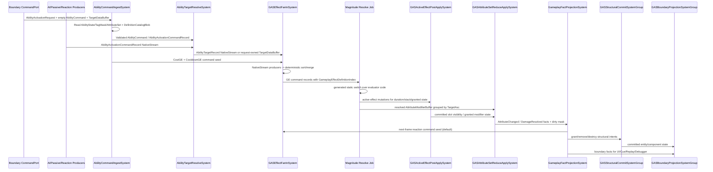
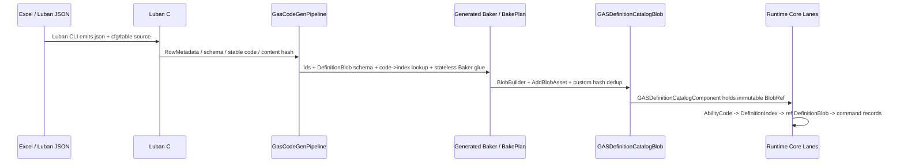
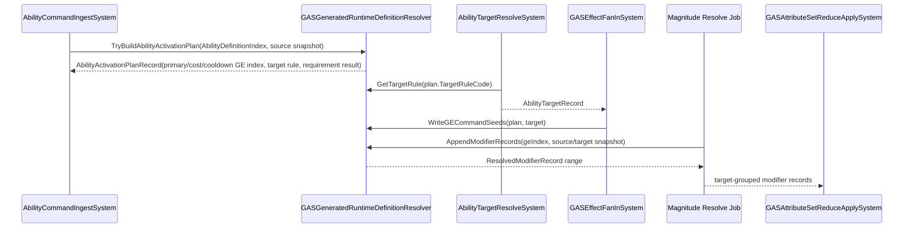

# 03B：业务调用链与配置消费

> Owner：`01-目标态架构共识/03-RuntimeCore管线` | 状态：目标态子 Spec | 拆分来源：`../03-RuntimeCore管线Spec.md` | 最近拆分：2026-06-07

本文件只描述理想 Runtime Core 目标态。禁止写入当前代码事实、迁移流水、验证数字或下一步任务；现实证据必须回到 `../../00-当前架构事实/`，任务拆分必须回到 `../../02-主线任务树/`。

定位：目标态业务调用链、Luban 配置生成链 Runtime 消费链和 Generated Runtime Glue 真实消费接口。

## 真实 GAS DOTS 业务调用链

以“单位释放技能造成伤害，并施加冷却/消耗/命中事实”为例，目标态调用链不是 OOP service 调用，而是 ECS 数据从一个 lane 流到下一个 lane：

1. Boundary / network / player input 创建 1 个 request/command entity，包含 `AbilityActivationRequestComponent`、占位 `AbilityCommandComponent` 和可选 `TargetDataBuffer`；它只表示一次外部激活意图，不为每个 target/effect/modifier 创建临时 entity。
2. AI autocast、passive、period、reaction 这类 Core 内部高频来源不创建 request entity；它们以 `IJobChunk` producer 写 `AbilityActivationCommandRecord` 到 `NativeStream`。
3. `AbilityCommandIngestSystem` 只读 `AbilityStateComponent`、`TagMaskComponent`、AttributeSet current/base 和 `GASDefinitionCatalogComponent` 的 BlobRef，校验外部 request；低量物化路径可写同一个 request entity 上的 `AbilityCommandComponent`，scale-ready 路径写 `AbilityActivationCommandRecord`。cost/cooldown 不直接写属性，而是生成成本 GE / 冷却 GE command seed。
4. `AbilityTargetResolveSystem` 处理 command record 或 request/command entity，按 `AbilityDefinitionBlob.TargetRuleCode`、显式目标或 physics snapshot 生成 deterministic target records；低量物化路径可写 request-owned `TargetDataBuffer`，高频路径写 `NativeStream` `AbilityTargetRecord`。Ability Entity 不承载单次激活上下文。
5. `GASEffectFanInSystem` 合并 ability payload、cost、cooldown、period tick、previous-frame reaction seed；多 producer 写 `NativeStream`，merge 后按 `(TargetSortKey, Sequence)` 确定性排序。GE command 携带 `GameplayEffectDefinitionIndex`，后续读取 `ref readonly GameplayEffectDefinitionBlob`。
6. Magnitude Resolve 读取 source/target AttributeSet snapshot 和 GE modifier definition，使用 generated static switch 默认计算 MMC；只有同 evaluator 大批量时才允许 FunctionPointer batch，禁止 per-entity invoke。
7. `GASActiveEffectPostApplySystem` 只更新 owner-local `ActiveGameplayEffectBuffer` slot、stack、duration、granted tag mask / ability state，不创建 effect entity；ability 可见性默认来自 `AbilityStateComponent.State/Flags`，不是 enableable grant/revoke。
8. `GASAttributeSetReduceApplySystem` 对 target grouped modifier 做 reduce/apply，写 AttributeSet current 和 `AttributeDirtyMaskComponent`，并追加 Core fact。
9. `GameplayFactProjectionSystem` 消费 dirty mask 和事实，生成 reaction fact、structural intent、boundary fact；默认新 GE command seed 进入下一帧，只有显式 bounded reaction pass 才允许同帧回流。
10. `GASStructuralCommitSystemGroup` 统一播放 ECB 或执行 bulk structural change。
11. `GASBoundaryProjectionSystemGroup` 只读 committed Core state 和 facts，写 read model / presentation outbox / replay/debug，不反向驱动 Core。



**逻辑链不变量：**

- Validation 只决定“能否进入 Core command”，不把 cost/damage/cooldown 散落写入多个系统。
- Ability Entity 只保存 granted ability 的跨帧状态；单次激活的 target、command status、cost/cooldown seed、target sort key 属于 Boundary request/command entity 或 Core frame-local command/target record，不属于 Ability Entity。
- Request entity 不是 runtime command bus。外部意图低频物化为 request entity；Core 内部高频触发默认写 `NativeStream` records。
- 所有影响 battle hash 的 fan-in 输出必须有显式 sort key，不依赖 worker 调度顺序。
- Attribute 写入只有 Attribute lane 负责；其他 lane 读取 AttributeSet snapshot 或写 modifier/fact。
- Fact 是 Core 内部 reaction 输入；Presentation event 是 Boundary 输出，两者不共用 event bus。
- 同帧主链默认无环；reaction 默认下一帧 seed，避免无界递归和不确定时序。
- Luban 配置只通过只读 Definition Catalog / generated lookup / Generated Runtime Glue 进入 Core；Runtime lane 不允许反查 managed row、JSON、`Dictionary` 或 per-definition entity query。

---

## Luban 配置生成链 Runtime 消费链

Luban 配置进入 GAS Runtime 的目标态不是“运行时拿 `cfg.*` 表、`Dictionary` 或 `GASDefinitionTable` 查配置”，而是把配置在 Baking / bootstrap 边界折叠成只读 Blob Catalog，Runtime lane 只按 DOTS 数据访问它。



**Runtime 消费原则：**

1. `cfg.*`、`XLuban`、`SimpleJSON`、JSON reader、managed row、row factory 不进入 GAS Runtime Core assembly。
2. `GASGeneratedDefinitionBlobComponent<T>` 可作为 baking output / bootstrap 收集入口，但 Runtime hot path 不查询“每个定义一个 entity”。
3. 每个 battle World 只有一个 `DefinitionCatalogSingleton`，持有 `GASDefinitionCatalogComponent`。它是只读 BlobRef 入口，不是可变 registry manager。
4. Ability grant 低频阶段将 `AbilityCode` 解析为 `AbilityDefinitionIndex`，写入 Ability Entity；Activation / Target / Fan-In / Magnitude 默认使用 index 读取 `ref readonly AbilityDefinitionBlob` / `ref readonly GameplayEffectDefinitionBlob`。
5. 小表 lookup 可生成 static switch；中大型表默认在 `BlobArray` 中按 code 排序并二分；只有大量 mod/content 且 profiler 证明需要时，才生成 perfect hash / range table。
6. 含 `BlobArray`、`BlobString`、`BlobPtr` 的 definition 不按值返回；lookup API 使用 `TryGet*Index()` + `Get*()` 的 index/ref readonly 模式。
7. Generated Runtime Glue 不只是 lookup。它必须把 Ability / GE / Modifier / Requirement / TargetRule definition 转换为 Runtime lane 可消费的 record：`AbilityActivationPlanRecord`、`GECommandSeedRecord`、`ResolvedModifierRecord`。Glue 只做纯解析和纯计算，不创建 entity、不播放 ECB、不查询 `EntityManager`、不拥有 `NativeContainer`。

**完整代码骨架：Definition Catalog 与 Runtime 读取**

```csharp
using Unity.Burst;
using Unity.Entities;

namespace GAS.Runtime
{
    public struct GASDefinitionCatalogComponent : IComponentData
    {
        public BlobAssetReference<GASDefinitionCatalogBlob> DefinitionCatalogBlob;
        public uint SchemaHash;
        public uint ContentHash;
    }

    public struct GASDefinitionCatalogBlob
    {
        public uint SchemaHash;
        public uint ContentHash;
        public BlobArray<int> AbilityCodes;
        public BlobArray<AbilityDefinitionBlob> Abilities;
        public BlobArray<int> GameplayEffectCodes;
        public BlobArray<GameplayEffectDefinitionBlob> GameplayEffects;
        public BlobArray<ModifierDefinitionBlob> Modifiers;
        public BlobArray<RequirementDefinitionBlob> Requirements;
        public BlobArray<TagMaskDefinitionBlob> TagMasks;
        public BlobArray<GrantedAbilityDefinitionBlob> GrantedAbilities;
        public BlobArray<GameplayTagDefinitionBlob> GameplayTags;
        public BlobArray<AttributeDefinitionBlob> Attributes;
    }

    public struct AbilityDefinitionBlob
    {
        public int AbilityCode;
        public int PrimaryGameplayEffectCode;
        public int CostGameplayEffectCode;
        public int CooldownGameplayEffectCode;
        public int TargetRuleCode;
        public int ActivationRequirementStart;
        public ushort ActivationRequirementCount;
        public short MaxLevel;
    }

    public struct GameplayEffectDefinitionBlob
    {
        public int GameplayEffectCode;
        public int DurationFrames;
        public int PeriodFrames;
        public int StackingPolicyCode;
        public int ModifierStart;
        public ushort ModifierCount;
        public int ApplicationRequirementStart;
        public ushort ApplicationRequirementCount;
        public int GrantedTagMaskIndex;
        public int GrantedAbilityStart;
        public ushort GrantedAbilityCount;
    }

    public struct ModifierDefinitionBlob
    {
        public int AttributeCode;
        public int MagnitudeEvaluatorCode;
        public int MagnitudeParameterStart;
        public ushort MagnitudeParameterCount;
        public float BaseMagnitude;
        public byte OperationCode;
        public byte TargetAttributeSetCode;
    }

    public struct RequirementDefinitionBlob
    {
        public int RequiredTagMaskIndex;
        public int BlockedTagMaskIndex;
        public int AttributeCode;
        public float Threshold;
        public int FailureReasonCode;
        public byte RequirementKind;
        public byte CompareOp;
    }

    public struct TagMaskDefinitionBlob
    {
        public ulong Word0;
        public ulong Word1;
        public ulong Word2;
    }

    public struct GrantedAbilityDefinitionBlob
    {
        public int AbilityCode;
        public short LevelDelta;
    }

    public struct GameplayTagDefinitionBlob
    {
        public int TagCode;
        public ulong AncestorMaskWord0;
        public ulong AncestorMaskWord1;
        public ulong AncestorMaskWord2;
    }

    public struct AttributeDefinitionBlob
    {
        public int AttributeCode;
        public int AttributeSetCode;
        public float DefaultBaseValue;
        public float MinValue;
        public float MaxValue;
    }

    public static class GASGeneratedDefinitionLookup
    {
        public static bool TryGetAbilityIndex(ref GASDefinitionCatalogBlob catalog, int abilityCode, out int index)
        {
            var lo = 0;
            var hi = catalog.AbilityCodes.Length - 1;

            while (lo <= hi)
            {
                var mid = (lo + hi) >> 1;
                var compare = catalog.AbilityCodes[mid].CompareTo(abilityCode);
                if (compare == 0)
                {
                    index = mid;
                    return true;
                }

                if (compare < 0)
                    lo = mid + 1;
                else
                    hi = mid - 1;
            }

            index = -1;
            return false;
        }

        public static ref readonly AbilityDefinitionBlob GetAbility(ref GASDefinitionCatalogBlob catalog, int index)
        {
            return ref catalog.Abilities[index];
        }

        public static bool TryGetGameplayEffectIndex(ref GASDefinitionCatalogBlob catalog, int gameplayEffectCode, out int index)
        {
            var lo = 0;
            var hi = catalog.GameplayEffectCodes.Length - 1;

            while (lo <= hi)
            {
                var mid = (lo + hi) >> 1;
                var compare = catalog.GameplayEffectCodes[mid].CompareTo(gameplayEffectCode);
                if (compare == 0)
                {
                    index = mid;
                    return true;
                }

                if (compare < 0)
                    lo = mid + 1;
                else
                    hi = mid - 1;
            }

            index = -1;
            return false;
        }

        public static ref readonly GameplayEffectDefinitionBlob GetGameplayEffect(ref GASDefinitionCatalogBlob catalog, int index)
        {
            return ref catalog.GameplayEffects[index];
        }
    }
}
```

这段代码的关键不是“新增一个全局服务”，而是把 Runtime 配置入口收窄为一个不可变 BlobRef：`GASDefinitionCatalogComponent` 可以作为 singleton 查询，但 singleton 本身没有写者，符合 PackageCache 对 singleton dependency 的限制；真正 hot path 只传 `BlobAssetReference<GASDefinitionCatalogBlob>` 给 job。Catalog 采用 range-based 布局：Ability / GE 只保存 `Start + Count`，Modifier / Requirement / GrantedAbility 等可变长数据集中在根 BlobArray 中。这样既符合 Blob 内部指针必须通过 `ref` 访问的官方约束，也避免每个 definition 形成小型嵌套对象图，Magnitude Resolve 可以按连续 range 顺序遍历。

### Generated Runtime Glue：真实 GAS 业务消费接口

Luban / SourceGenerator 进入 Runtime Core 的目标不应停留在“生成 Blob schema + code lookup”。真实 GAS 业务中，每个 Runtime lane 都需要知道“从 Ability 定义如何得到可执行计划”“从 GE 定义如何展开 modifier range”“需求失败如何给出稳定 reason”“target rule code 对应哪些 unmanaged 参数”。如果这些逻辑散落在多个 System 中，调用者会反复理解 Luban 字段语义，最终又退回 OOP manager / registry 模式。

目标态把这层收束为 generated static glue。它不是 entity、不是 component、不是 singleton，也不是可变服务；它只接收 BlobRef、definition index、运行时快照和 frame-local writer，输出可排序的 record。



**完整代码骨架：Generated Runtime Glue**

```csharp
using Unity.Burst;
using Unity.Collections;
using Unity.Entities;

namespace GAS.Runtime
{
    public struct AttributeSnapshotRecord
    {
        public float Health;
        public float Mana;
        public float Shield;
        public float AttackPower;
    }

    public struct AbilityStateComponent : IComponentData
    {
        public int AbilityCode;
        public int AbilityDefinitionIndex;
        public short Level;
        public int NextAvailableFrame;
        public byte IsGranted;
    }

    public struct AbilityActivationPlanRecord
    {
        public Entity SourceAsc;
        public Entity AbilityEntity;
        public int AbilityCode;
        public int AbilityDefinitionIndex;
        public int PrimaryGameplayEffectDefinitionIndex;
        public int CostGameplayEffectDefinitionIndex;
        public int CooldownGameplayEffectDefinitionIndex;
        public int TargetRuleCode;
        public short Level;
        public int InputSequence;
        public int FailureReasonCode;
        public byte IsValid;
    }

    public struct AbilityTargetRecord
    {
        public Entity SourceAsc;
        public Entity TargetAsc;
        public int AbilityDefinitionIndex;
        public int TargetSortKey;
        public int InputSequence;
    }

    public struct GECommandSeedRecord
    {
        public Entity SourceAsc;
        public Entity TargetAsc;
        public int GameplayEffectDefinitionIndex;
        public int AbilityDefinitionIndex;
        public short Level;
        public int Frame;
        public int Sequence;
        public int TargetSortKey;
        public byte SeedKind;
    }

    public struct MagnitudeEvalContext
    {
        public Entity SourceAsc;
        public Entity TargetAsc;
        public AttributeSnapshotRecord SourceAttributes;
        public AttributeSnapshotRecord TargetAttributes;
        public TagMaskComponent SourceTags;
        public TagMaskComponent TargetTags;
        public short Level;
        public int Frame;
    }

    public struct ResolvedModifierRecord
    {
        public Entity SourceAsc;
        public Entity TargetAsc;
        public int GameplayEffectDefinitionIndex;
        public int ModifierDefinitionIndex;
        public int AttributeCode;
        public float Magnitude;
        public byte OperationCode;
        public int TargetSortKey;
    }

    public static class GASFailureReasonCodes
    {
        public const int CooldownNotReady = 1001;
        public const int MissingPrimaryGameplayEffect = 1002;
        public const int MissingCostGameplayEffect = 1003;
        public const int MissingCooldownGameplayEffect = 1004;
    }

    public static class GASGESeedKind
    {
        public const byte Primary = 1;
        public const byte Cost = 2;
        public const byte Cooldown = 3;
    }

    public static class GASRequirementKind
    {
        public const byte None = 0;
        public const byte AttributeAtLeast = 1;
    }

    public static class GASMagnitudeEvaluatorCodes
    {
        public const int Flat = 1;
        public const int ScaleByLevel = 2;
        public const int SourceAttackPower = 3;
    }

    public static class GASAttributeCodes
    {
        public const int Health = 1;
        public const int Mana = 2;
        public const int Shield = 3;
        public const int AttackPower = 4;
    }

    public static class GASGeneratedAttributeSnapshotAccessor
    {
        public static float GetValue(in AttributeSnapshotRecord snapshot, int attributeCode)
        {
            switch (attributeCode)
            {
                case GASAttributeCodes.Health:
                    return snapshot.Health;
                case GASAttributeCodes.Mana:
                    return snapshot.Mana;
                case GASAttributeCodes.Shield:
                    return snapshot.Shield;
                case GASAttributeCodes.AttackPower:
                    return snapshot.AttackPower;
                default:
                    return 0f;
            }
        }
    }

    [BurstCompile]
    public static class GASGeneratedRuntimeDefinitionResolver
    {
        public static bool TryBuildAbilityActivationPlan(
            BlobAssetReference<GASDefinitionCatalogBlob> catalogRef,
            Entity sourceAsc,
            Entity abilityEntity,
            in AbilityStateComponent abilityState,
            in TagMaskComponent sourceTags,
            in AttributeSnapshotRecord sourceAttributes,
            int currentFrame,
            int inputSequence,
            out AbilityActivationPlanRecord plan)
        {
            plan = default;
            if (!catalogRef.IsCreated || abilityState.IsGranted == 0)
                return false;

            if (abilityState.AbilityDefinitionIndex < 0 ||
                abilityState.AbilityDefinitionIndex >= catalogRef.Value.Abilities.Length)
                return false;

            ref var catalog = ref catalogRef.Value;
            ref readonly var ability = ref GASGeneratedDefinitionLookup.GetAbility(
                ref catalog,
                abilityState.AbilityDefinitionIndex);

            plan.SourceAsc = sourceAsc;
            plan.AbilityEntity = abilityEntity;
            plan.AbilityCode = ability.AbilityCode;
            plan.AbilityDefinitionIndex = abilityState.AbilityDefinitionIndex;
            plan.Level = abilityState.Level;
            plan.InputSequence = inputSequence;
            plan.TargetRuleCode = ability.TargetRuleCode;

            if (abilityState.NextAvailableFrame > currentFrame)
            {
                plan.FailureReasonCode = GASFailureReasonCodes.CooldownNotReady;
                return false;
            }

            if (!GASGeneratedRequirementEvaluator.PassesRequirements(
                    ref catalog,
                    ability.ActivationRequirementStart,
                    ability.ActivationRequirementCount,
                    in sourceTags,
                    in sourceAttributes,
                    out plan.FailureReasonCode))
            {
                return false;
            }

            if (!GASGeneratedDefinitionLookup.TryGetGameplayEffectIndex(
                    ref catalog,
                    ability.PrimaryGameplayEffectCode,
                    out plan.PrimaryGameplayEffectDefinitionIndex))
            {
                plan.FailureReasonCode = GASFailureReasonCodes.MissingPrimaryGameplayEffect;
                return false;
            }

            plan.CostGameplayEffectDefinitionIndex = -1;
            if (ability.CostGameplayEffectCode > 0 &&
                !GASGeneratedDefinitionLookup.TryGetGameplayEffectIndex(
                    ref catalog,
                    ability.CostGameplayEffectCode,
                    out plan.CostGameplayEffectDefinitionIndex))
            {
                plan.FailureReasonCode = GASFailureReasonCodes.MissingCostGameplayEffect;
                return false;
            }

            plan.CooldownGameplayEffectDefinitionIndex = -1;
            if (ability.CooldownGameplayEffectCode > 0 &&
                !GASGeneratedDefinitionLookup.TryGetGameplayEffectIndex(
                    ref catalog,
                    ability.CooldownGameplayEffectCode,
                    out plan.CooldownGameplayEffectDefinitionIndex))
            {
                plan.FailureReasonCode = GASFailureReasonCodes.MissingCooldownGameplayEffect;
                return false;
            }

            plan.IsValid = 1;
            return true;
        }

        public static void WriteGECommandSeeds(
            in AbilityActivationPlanRecord plan,
            in AbilityTargetRecord target,
            ref NativeStream.Writer writer,
            int frame)
        {
            if (plan.IsValid == 0)
                return;

            WriteSeed(plan, target, plan.PrimaryGameplayEffectDefinitionIndex, GASGESeedKind.Primary, ref writer, frame);

            if (plan.CostGameplayEffectDefinitionIndex >= 0)
                WriteSeed(plan, target, plan.CostGameplayEffectDefinitionIndex, GASGESeedKind.Cost, ref writer, frame);

            if (plan.CooldownGameplayEffectDefinitionIndex >= 0)
                WriteSeed(plan, target, plan.CooldownGameplayEffectDefinitionIndex, GASGESeedKind.Cooldown, ref writer, frame);
        }

        public static void AppendModifierRecords(
            ref GASDefinitionCatalogBlob catalog,
            in GECommandSeedRecord command,
            in MagnitudeEvalContext context,
            ref NativeList<ResolvedModifierRecord> modifiers)
        {
            ref readonly var ge = ref GASGeneratedDefinitionLookup.GetGameplayEffect(
                ref catalog,
                command.GameplayEffectDefinitionIndex);

            for (var i = 0; i < ge.ModifierCount; i++)
            {
                var modifierIndex = ge.ModifierStart + i;
                ref readonly var modifier = ref catalog.Modifiers[modifierIndex];

                var magnitude = GASGeneratedMagnitudeEvaluator.Evaluate(
                    ref catalog,
                    in modifier,
                    in context,
                    command.Level);

                modifiers.Add(new ResolvedModifierRecord
                {
                    SourceAsc = command.SourceAsc,
                    TargetAsc = command.TargetAsc,
                    GameplayEffectDefinitionIndex = command.GameplayEffectDefinitionIndex,
                    ModifierDefinitionIndex = modifierIndex,
                    AttributeCode = modifier.AttributeCode,
                    Magnitude = magnitude,
                    OperationCode = modifier.OperationCode,
                    TargetSortKey = command.TargetSortKey
                });
            }
        }

        private static void WriteSeed(
            in AbilityActivationPlanRecord plan,
            in AbilityTargetRecord target,
            int gameplayEffectDefinitionIndex,
            byte seedKind,
            ref NativeStream.Writer writer,
            int frame)
        {
            writer.Write(new GECommandSeedRecord
            {
                SourceAsc = plan.SourceAsc,
                TargetAsc = target.TargetAsc,
                GameplayEffectDefinitionIndex = gameplayEffectDefinitionIndex,
                AbilityDefinitionIndex = plan.AbilityDefinitionIndex,
                Level = plan.Level,
                Frame = frame,
                Sequence = plan.InputSequence,
                TargetSortKey = target.TargetSortKey,
                SeedKind = seedKind
            });
        }
    }

    [BurstCompile]
    public static class GASGeneratedRequirementEvaluator
    {
        public static bool PassesRequirements(
            ref GASDefinitionCatalogBlob catalog,
            int start,
            int count,
            in TagMaskComponent tags,
            in AttributeSnapshotRecord attributes,
            out int failureReasonCode)
        {
            for (var i = 0; i < count; i++)
            {
                ref readonly var requirement = ref catalog.Requirements[start + i];
                if (!PassesTagMasks(ref catalog, in requirement, in tags) ||
                    !PassesAttribute(in requirement, in attributes))
                {
                    failureReasonCode = requirement.FailureReasonCode;
                    return false;
                }
            }

            failureReasonCode = 0;
            return true;
        }

        private static bool PassesTagMasks(
            ref GASDefinitionCatalogBlob catalog,
            in RequirementDefinitionBlob requirement,
            in TagMaskComponent tags)
        {
            if (requirement.RequiredTagMaskIndex >= 0)
            {
                ref readonly var required = ref catalog.TagMasks[requirement.RequiredTagMaskIndex];
                if ((tags.Word0 & required.Word0) != required.Word0 ||
                    (tags.Word1 & required.Word1) != required.Word1 ||
                    (tags.Word2 & required.Word2) != required.Word2)
                    return false;
            }

            if (requirement.BlockedTagMaskIndex >= 0)
            {
                ref readonly var blocked = ref catalog.TagMasks[requirement.BlockedTagMaskIndex];
                if ((tags.Word0 & blocked.Word0) != 0 ||
                    (tags.Word1 & blocked.Word1) != 0 ||
                    (tags.Word2 & blocked.Word2) != 0)
                    return false;
            }

            return true;
        }

        private static bool PassesAttribute(
            in RequirementDefinitionBlob requirement,
            in AttributeSnapshotRecord attributes)
        {
            if (requirement.RequirementKind != GASRequirementKind.AttributeAtLeast)
                return true;

            var value = GASGeneratedAttributeSnapshotAccessor.GetValue(
                in attributes,
                requirement.AttributeCode);

            return value >= requirement.Threshold;
        }
    }

    [BurstCompile]
    public static class GASGeneratedMagnitudeEvaluator
    {
        public static float Evaluate(
            ref GASDefinitionCatalogBlob catalog,
            in ModifierDefinitionBlob modifier,
            in MagnitudeEvalContext context,
            short level)
        {
            switch (modifier.MagnitudeEvaluatorCode)
            {
                case GASMagnitudeEvaluatorCodes.Flat:
                    return modifier.BaseMagnitude;
                case GASMagnitudeEvaluatorCodes.ScaleByLevel:
                    return modifier.BaseMagnitude * level;
                case GASMagnitudeEvaluatorCodes.SourceAttackPower:
                    return context.SourceAttributes.AttackPower * modifier.BaseMagnitude;
                default:
                    return 0f;
            }
        }
    }
}
```

这段 glue 的合理性：

1. `TryBuildAbilityActivationPlan()` 是 Ingest lane 唯一需要理解 Ability 配置语义的入口；调用者只知道 ability state、tag/attribute snapshot 和 frame，不知道 Luban row 字段。
2. `WriteGECommandSeeds()` 把主 GE、cost GE、cooldown GE 统一成 command seed；扣 mana / 写 cooldown 不散落在 Ability 系统里，后续仍由 GE / Attribute lane 处理。
3. `AppendModifierRecords()` 只按 `GameplayEffectDefinitionIndex` 遍历连续 modifier range，不 query per-definition entity，也不随机写 target AttributeSet。
4. Requirement / Magnitude / TargetRule 由 generated static switch 或小型 lookup 表承载；默认不使用托管 delegate、虚函数策略对象或可变 registry。
5. Glue 方法不调度 job、不创建 `NativeContainer`、不隐藏结构变化。`NativeStream.Writer` / `NativeList<T>` 的 owner、依赖链和 dispose 仍归所在 System 管理，符合 PackageCache `scheduling-jobs-dependencies.md` 对 NativeContainer 依赖必须手动串联的要求。
