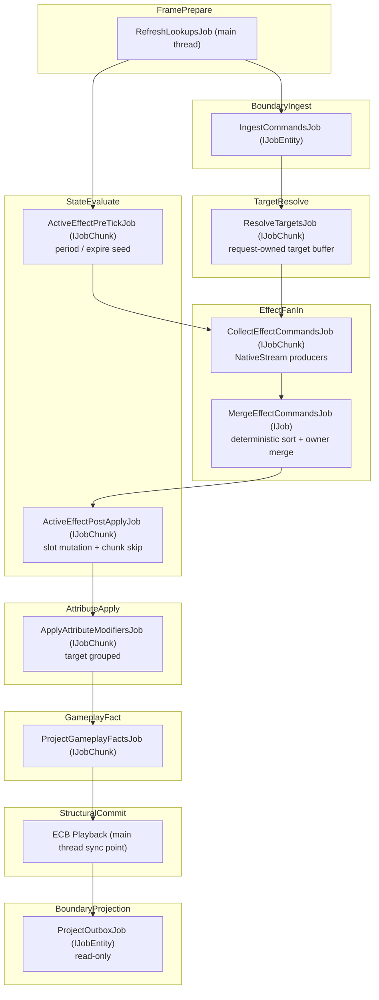

# 03G：Component 矩阵 / Frame Arena / Job 拓扑

> Owner：`01-目标态架构共识/03-RuntimeCore管线` | 状态：目标态子 Spec | 拆分来源：`../03-RuntimeCore管线Spec.md` | 最近拆分：2026-06-07

本文件只描述理想 Runtime Core 目标态。禁止写入当前代码事实、迁移流水、验证数字或下一步任务；现实证据必须回到 `../../00-当前架构事实/`，任务拆分必须回到 `../../02-主线任务树/`。

定位：目标态 per-phase component 读写矩阵、Frame Arena 物理设计、Unity Entities 承载映射和 Job 依赖拓扑。

## Per-Phase Component 读写矩阵

这是 Runtime Core 的物理安全契约。每个 phase 必须精确声明对每种 component type 的访问模式。

### 数据 Component（状态承载）

| Component | FramePrepare | BoundaryIngest | TargetResolve | EffectFanIn | StateEvaluate | AttributeApply | GameplayFact | StructuralCommit | BoundaryProjection |
|---|---|---|---|---|---|---|---|---|---|
| `CombatAttributeCurrentSetComponent` / `ResourceAttributeCurrentSetComponent` [(1)](#attr-footnote) | — | R（cost check） | R | R（MMC snapshot） | R | **RW** | R | — | R |
| `CombatAttributeBaseSetComponent` / `ResourceAttributeBaseSetComponent` [(1)](#attr-footnote) | — | R（cost/cap check） | R | R（MMC snapshot） | R | R | R | — | R |
| `AttributeDirtyMaskComponent` | W（clear frame mask） | — | — | — | — | **RW** | R | — | R |
| `AttributeModifierBuffer` (target grouped) | — | — | — | W | — | **RW / Clear** | R | — | — |
| `GEEffectCommandBuffer` (compact owner-local range) | — | W（低频 seed） | — | **W / Merge** | R（PostApply 不写；PreTick command seed 进入 `NativeStream`） | R | W（next-frame reaction seed） | — | — |
| `ActiveGameplayEffectBuffer` (per-ASC buffer) | — | — | — | R | **RW** | R | R | — | — |
| `GameplayEventBuffer` (Core fact) | — | — | — | — | W | W | **RW** | R | R |
| `PresentationEventBuffer` (boundary outbox) | — | — | — | — | — | — | — | — | **W** |
| `ASCActiveEffectsComponent` (per-ASC stats/version) | — | — | — | R | **RW** | R | R | R | R |
| `TagMaskComponent` (per-ASC authority) | — | — | R | R | R | **RW** | R | — | R |
| `TagStatusFlagsComponent` (cache) | — | — | R | R | **W** | R / W | R | — | R |
| `AbilityStateComponent` [(2)](#ability-footnote) | — | **R** | — | — | **RW** | — | R | **RW** | — |
| `AbilityExecutableTag` (optional enableable) [(2)](#ability-footnote) | — | R（可选 filter） | R（可选 filter） | R（可选 filter） | toggle（仅 profiler 证明必要时） | — | R（可选 filter） | — | — |
| `AbilityActivationRequestComponent` [(3)](#request-footnote) | — | R | R | — | — | — | — | Destroy | — |
| `AbilityCommandComponent` [(3)](#request-footnote) | — | **RW** | R | R | — | — | — | Destroy | — |
| `TargetDataBuffer` [(3)](#request-footnote) | — | Clear（request init） | **W / Clear** | R | — | — | — | Destroy | — |

**符号：** R = 只读、W = 只写、RW = 读写、— = 不访问

> <a id="attr-footnote">(1)</a> Attribute 默认实现为 generated AttributeSet family（如 `CombatAttributeCurrentSetComponent` / `CombatAttributeBaseSetComponent`），而不是 per-attribute component。划分依据是热路径 query 共现与写入频率；独立 per-attribute component 只作为 profiler/query contract 证明后的例外。命名与物理规则见 `12-命名规范Spec.md` 和 `13-EntityComponent物理布局Spec.md`。
>
> <a id="ability-footnote">(2)</a> Ability 相关跨帧 component 挂载在独立的 Ability Entity 上（非 ASC Entity），见 `13-EntityComponent物理布局Spec.md` Entity 3b。`AbilityStateComponent` 在 Boundary Command Ingest 中被读取以校验 ability 可用性，并用 `AbilityCode + AbilityDefinitionIndex` 指向只读 Definition Catalog，用 `State/Flags` 表达 granted、activating、cooldown、blocked、executable。grant/revoke 是低频生命周期变化，进入 Structural Commit 创建/销毁或更新 Ability Entity；不默认使用 enableable toggle。`AbilityExecutableTag` 只作为 profiler 证明后的 query skip cache。
>
> <a id="request-footnote">(3)</a> `AbilityActivationRequestComponent`、`AbilityCommandComponent`、`TargetDataBuffer` 挂载在 request/command entity 上，生命周期为一次激活请求。Boundary 创建 request archetype 时必须一次性带齐这些 component/buffer，避免 Ingest/TargetResolve 热路径 AddComponent；Target Resolve 写入 request-owned `TargetDataBuffer`，Effect Fan-In 只读消费，Structural Commit 统一销毁 request entity。
>
> `AbilityActivationCommandRecord` / `AbilityTargetRecord` 是 frame-local NativeContainer record，不是 `IComponentData`，因此不进入上表的 component 读写矩阵。它们是 Core 内部高频 producer 的默认载体，由 owner system 创建、传递、排序和 dispose。

### 数据 Component（定义/查找 — 只读）

| Component | FramePrepare | 其余 Phase |
|---|---|---|
| `GASDefinitionCatalogComponent` | R（校验 BlobRef / hash；不写） | R（只读 `BlobAssetReference<GASDefinitionCatalogBlob>`） |
| `GASDefinitionCatalogBlob` | — | R（通过 BlobRef + index + `ref` 访问 Ability/GE/Tag/Attribute definition） |
| `GASGeneratedDefinitionLookup` / generated static id → index lookup | — | R（code -> index；不承载 runtime state） |

### Enableable Component（状态标记）

| Enableable Component | 挂载 Entity | 切换 Phase | 切换频率 |
|---|---|---|---|
| `AbilityExecutableTag`（可选） | Ability entity | `GASCoreSimulationSystemGroup` 的 State lane | 只有 profiler 证明大量不可执行 ability 需要 query skip 时启用；grant/revoke 不使用它 |
| `PeriodDueTag`（可选） | ASC entity | `GASCoreSimulationSystemGroup` 的 State lane | 只有 profiler 证明大量 idle slot 需要 enableable skip 时启用 |

> **注：** Per-slot active/inhibited 标记使用 `ActiveGameplayEffectBuffer.Flags` bitmask（见 `13-EntityComponent物理布局Spec.md` 行221-223），不创建独立的 `CEffectSlotActive` enableable component。

### Chunk Component（chunk 级标记）

| Chunk Component | 使用目的 | 设置 Phase | 消费 Phase |
|---|---|---|---|
| `AllIdleChunkComponent` | 标记整个 chunk 的 ASC 所有 slot 都是 idle → 跳过整个 chunk | `GASCoreSimulationSystemGroup` 的 State lane | CoreSimulation 内 Effect Fan-In / Attribute lane |
| `NoActiveEffectsChunkComponent` | 标记整个 chunk 的 ASC 无 active effect | `GASCoreSimulationSystemGroup` 的 State lane | CoreSimulation 内 Attribute / Fact lane |

### 结构变化权限矩阵

| 操作 | 仅在 | 方式 |
|---|---|---|
| `CreateEntity` | `GASStructuralCommitSystemGroup` | ECB playback |
| `DestroyEntity` | `GASStructuralCommitSystemGroup` | ECB playback |
| `AddComponent<T>` | `GASStructuralCommitSystemGroup` | ECB playback 或 EntityQuery bulk |
| `RemoveComponent<T>` | `GASStructuralCommitSystemGroup` | ECB playback 或 EntityQuery bulk |
| `SetComponentEnabled<T>` | `GASCoreSimulationSystemGroup` 的 State lane 或 `GASStructuralCommitSystemGroup` | `EnabledRefRW` 或 ECB |
| `DynamicBuffer.Add/Remove` | 各 owning phase | 直接操作（不触发结构变化） |
| `DynamicBuffer` 首次添加 | `GASStructuralCommitSystemGroup` | ECB `AddComponent<T>` |

---

## Frame Arena 物理设计

### 定位

`GASFramePrepareSystemGroup` 不是"一个初始化 System"，也不是 query / lookup registry。它只拥有 Runtime Core 每帧的**公共预算和 scratch 生命周期**：frame index、allocator rewind、lookup refresh 计数、dependency/debug counters。EntityQuery、ComponentLookup、BufferLookup、TypeHandle 由真正访问数据的各 `ISystem` 自己在 `OnCreate` / `OnUpdate` 中通过 `SystemState` 获取和刷新（`PRF-33`），Frame Prepare 只统计预算，不集中发放句柄。

### Frame Arena 的三个职责

```
GASFramePrepareSystemGroup（帧首执行一次）
│
├── 1. Frame Clock / Budget
│     递增 frame index，重置 context sequence / budget counters
│     只记录各 ISystem 报告的 query、lookup、type-handle refresh 计数
│     不保存 query registry，不把 lookup/type handle 存到 singleton component
│
├── 2. Frame Scratch Allocator
│     维护 RewindableAllocator / WorldUpdateAllocator 使用预算
│     fan-in merge、debug sample、临时排序等从明确 owner 获取 allocator
│     帧末 Arena Teardown 统一 rewind / 输出峰值
│
└── 3. Dependency Budget
│     收集上帧 Dependency 链长度、enableable wait 次数
│     与 budget 对比，超标时输出 Debugger 告警
```

> **注：EntityQuery / Lookup / TypeHandle 不进入 Frame Arena 集中管理。** 各 ISystem 在自己的 `OnCreate` 中通过 `SystemState.GetEntityQuery` 创建 query，并在 `OnUpdate` 中调用 `state.GetComponentLookup<T>()` / `state.GetBufferLookup<T>()` / `state.GetComponentTypeHandle<T>()` 获取当帧句柄。Frame Prepare 只集中管理 scratch allocator 和预算计数；Query 的数量、匹配 archetype、lookup refresh 次数由 Debugger 归因统计，不依赖集中 registry。

### Arena 物理实现的两种候选

| 方案 | 描述 | 适用 |
|---|---|---|
| **A: Singleton Registry** | 所有 query/lookup 存在一个 singleton entity 的 DynamicBuffer 或 component 上；FramePrepare System 每帧刷新 | 看似简单；但 query 集中管理违反 `PRF-33`，lookup/type handle 也不应跨 system 复用，废弃 |
| **B: SystemState 缓存** | 每个 ISystem 在自己的 `OnCreate` 创建 query（`SystemState.GetEntityQuery`），在 `OnUpdate` 刷新自身 lookup/type handle；Frame Arena 仅集中管理 scratch allocator + budget counters | ECS 官方推荐模式；query 和数据访问由安全系统追踪 |

**目标态选择：方案 B**（SystemState 缓存 + Frame Prepare 预算）。EntityQuery、Lookup、TypeHandle 由各 ISystem 自行管理和刷新；Frame Prepare 负责 scratch allocator、frame clock、context sequence 和预算计数。两方案不再混合。

### Arena Allocator 生命周期

```
帧首 Arena Setup:
  1. RewindableAllocator.Rewind()          ← 清空上帧 scratch
  2. 重置 lookup/type-handle/query/dependency 预算计数
  3. 各 ISystem 在自己的 OnUpdate 刷新 ComponentLookup / BufferLookup / ComponentTypeHandle

  ↓ 后续 phase 使用 Arena allocator 分配 Temp/TempJob 数据 ↓
  ↓ 各 ISystem 通过自身 SystemState 管理的 EntityQuery 匹配 entity ↓

帧尾 Arena Teardown (在 Boundary Projection 之后):
  4. 确认所有 TempJob 已 Dispose
  5. RewindableAllocator.Rewind()           ← 回收本帧 scratch
  6. 输出 Arena 使用指标到 Debugger
```

### Arena 指标（Debugger 必须输出）

| 指标 | 说明 | 告警阈值 |
|---|---|---|
| `arena.lookupRefreshCount` | 本帧各 ISystem 刷新的 lookup / type handle 数 | > 30（考虑减少 system 或合并 query） |
| `arena.scratchAllocUsed` | Arena allocator 峰值使用量 | > 1 MB（检查泄漏） |
| `arena.tempJobLeakCount` | 未 Dispose 的 TempJob 数 | > 0（硬错误） |
| `arena.systemQueryCount` | 全帧各 ISystem 持有的 EntityQuery 总数（由 Debugger 归因统计） | > 20（评估 query 合并） |

---

## Unity Entities 承载映射

Runtime Core phase 必须落到 Unity Entities SystemGroup，而不是只停留在概念流：

| Phase | 目标 SystemGroup | 默认实现 | 结构变化权限 |
|---|---|---|---|
| Frame Prepare | `GASFramePrepareSystemGroup` | 维护 frame clock、allocator rewind、budget counters；query / lookup / type handle 由 owner `ISystem` 自己创建和刷新 | 禁止 |
| Boundary Command Ingest | `GASCommandResolveSystemGroup` / Boundary lane | `ISystem` + low-frequency request consume / command seed；Core 内部高频 producer 直接写 `AbilityActivationCommandRecord` | 读取边界 request；不直接 playback |
| Target Resolve | `GASCommandResolveSystemGroup` / Target lane | `IJobChunk` / `IJobParallelFor` / Physics query input snapshot / `AbilityTargetRecord` NativeStream；低量物化路径可用 request-owned `TargetDataBuffer` | 禁止 |
| Effect Fan-In | `GASCoreSimulationSystemGroup` / Fan-In lane | `NativeStream` producer + deterministic merge + compact owner-local command range | 禁止 |
| State Evaluate | `GASCoreSimulationSystemGroup` / State lane | PreTick 生成 period/expire seed；PostApply 提交 owner-local active slot / ability state / optional enableable skip | 禁止直接结构变化 |
| Attribute Reduce / Apply | `GASCoreSimulationSystemGroup` / Attribute lane | target-grouped reduce + per-target write | 禁止 |
| Gameplay Fact | `GASCoreSimulationSystemGroup` / Fact lane | typed Core fact buffer / reaction cursor | 禁止 |
| Structural Commit | `GASStructuralCommitSystemGroup` | custom ECB playback / EntityQuery bulk / ComponentTypeSet | 唯一 hot path structural boundary |
| Boundary Projection | `GASBoundaryProjectionSystemGroup` | read-only projection job / boundary sink | 不反写 simulation |

详细规则见 `UnityDOTS官方文档参考/主题/01-Entities系统与World.md`、`UnityDOTS官方文档参考/主题/90-规则编号索引.md`、`UnityDOTS官方文档参考/主题/20-GASRuntimeCore-API选型基线.md` 和 `UnityDOTS官方文档参考/主题/12-官方案例模式.md`。

---

## Job 依赖拓扑

### 帧内 Job Chain



### 并行机会

- Target resolve 可按 ability chunk 并行；Effect fan-in producer 可按 chunk 并行写 `NativeStream`。
- State Evaluate 在同一 physical group 内拆成 PreTick / PostApply 两个 lane system：PreTick 只产生 seed，PostApply 只提交 owner-local store，避免在 Fan-In 后绕过 deterministic merge。
- Gameplay fact 与 Boundary projection 分离：Core reaction 消费 Gameplay fact；默认写 next-frame command seed，不形成同帧无界循环。

### Sync Point 预算

| Sync Point 来源 | 位置 | 触发条件 | 目标预算（60fps = 16.67ms） |
|---|---|---|---|
| ECB playback | `GASStructuralCommitSystemGroup` | 每帧 1 次（结构变化合并） | < 1.0ms |
| Enableable-filtered query（如有） | 使用同步 query 的 phase | 写 enableable 的 job 未完成 + 同步 query | **目标：0 次** — 全部使用 `IgnoreFilter` 或异步 query |
| `SystemAPI.Query` foreach | 禁止在 hot path | — | **0 次** |
| **总计** | | | **< 1.0ms，1 个 sync point** |

**降级策略：**
- 若 ECB playback > 1.0ms → 审计 ECB command 数量，评估 EntityQuery bulk 替代逐 entity ECB
- 若出现意外的 enableable sync → 检查哪个 phase 的同步 query 未使用 `IgnoreComponentEnabledState`
- 若出现意外的结构变化 sync → **P0 违规**，Debugger 告警

---
