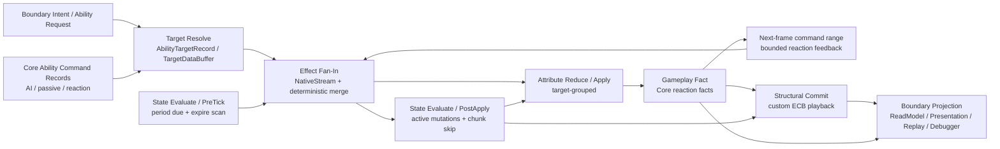
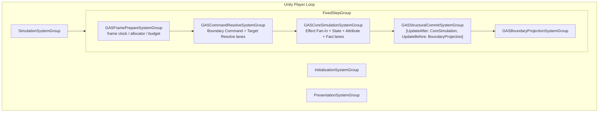
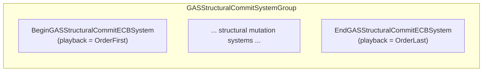
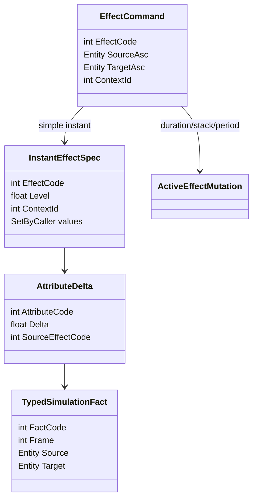
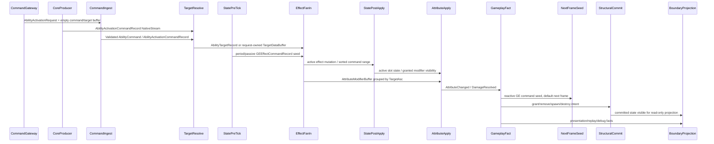
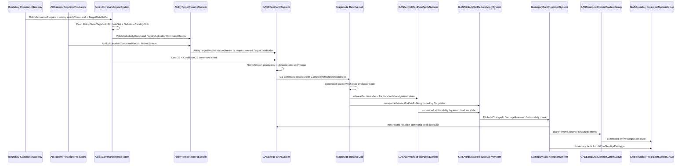
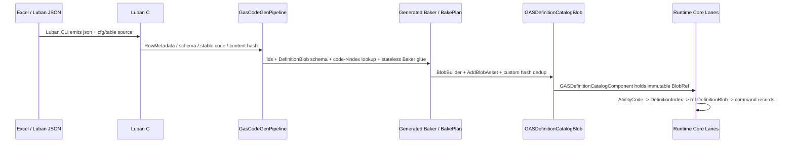
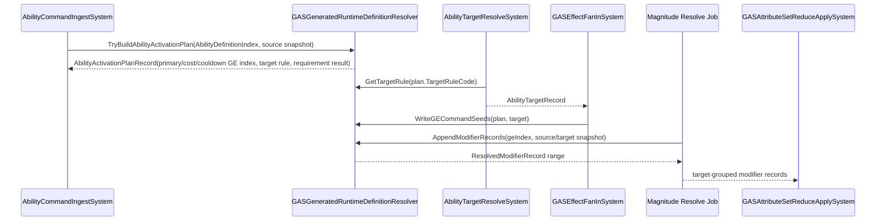
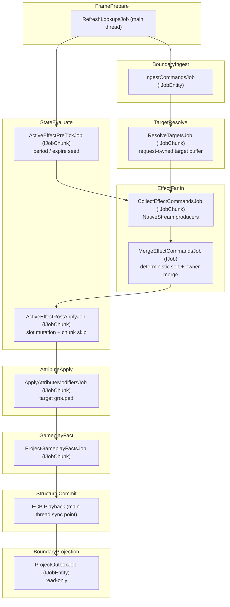

# Runtime Core 管线 Spec

## 目的

定义未来 Runtime Core 的主流程，替代旧 GE lifecycle / global observation stream 混合管线。本 Spec 不仅定义概念流，还定义到 Unity Entities 的物理承载 —— SystemGroup 嵌套、Component 读写矩阵、Frame Arena 物理设计、Job 依赖拓扑和 Sync Point 预算。

## 2026-05-28 Runtime Core 二次审查结论

本次按 `UnityDOTS官方文档参考/主题/20-GASRuntimeCore-API选型基线.md`、`02-查询遍历与Job.md` 的 `SYS-03`、`System-World-SystemGroup/PRF-07`、`10-Collections-Allocator-NativeStream.md`、`16-官方案例模式-高级.md` 的 `CASE-45` 和 `15-数据流-系统生命周期规范.md` 重新审查后，上一版“每个业务 kernel 一个 SystemGroup”的划分仍然偏 OOP taxonomy：职责名字清楚，但把 Target / Fan-In / State / Attribute / Fact 都升格为 `ComponentSystemGroup` 会放大 TypeHandle refresh、Lookup update 和 Dependency 链成本。

目标态修正为 **5 个物理执行域 + 8 条业务 kernel lane**：

| 业务 kernel lane | 业务问题 | 物理执行域 | DOTS 承载 | 官方约束 |
|---|---|---|---|---|
| Boundary Command Ingest | 外部/AI/Network/Timeline 意图进入 Core | `GASCommandResolveSystemGroup` | 低频 request entity 或等价 command data；高频 producer 禁止 request entity churn | `SYS-01` `SC-01` `PRF-01` `SEL-01` |
| Target Resolve | ability 目标、area query、self target、多目标扇出 | `GASCommandResolveSystemGroup` | `AbilityTargetRecord` NativeStream、低量 request-owned `TargetDataBuffer`、Unity Physics query 输入快照、确定性 target sort key | `QRY-01` `PHY-02` `MAT-05` |
| Effect Fan-In | 多来源产生 GE apply/period/passive/overflow command | `GASCoreSimulationSystemGroup` | `NativeStream` per producer/chunk 写入，按 `(TargetSortKey, Sequence)` deterministic merge；低量可落 owner-local compact buffer | `CASE-12` `NAT-02` `NAT-03` `MAT-05` |
| State Evaluate | Ability 状态、ActiveEffect slot、Period/Expire/Stack/Inhibit | `GASCoreSimulationSystemGroup` | PreTick 产生 seed，PostApply 提交 owner-local `ActiveGameplayEffectBuffer` + enum/bit flags；大量 idle 才引入 enableable/chunk skip | `FSM-02` `FSM-03` `FSM-05` `EN-01` |
| Attribute Reduce/Apply | 同一 target 的多个 modifier 归并并写属性 | `GASCoreSimulationSystemGroup` | target-grouped reduce，读写字段拆分，避免跨 entity random lookup | `QRY-04` `PRF-19` `PRF-26` |
| Gameplay Fact | Core 内部 reaction 事实，不等同表现事件 | `GASCoreSimulationSystemGroup` | typed fact buffer/stream；Ability trigger / GE reaction 只消费 Core fact | `SYS-05` `ECB-01` `STORE-03` |
| Structural Commit | grant/remove/spawn/destroy/cleanup | `GASStructuralCommitSystemGroup` | 自定义 ECB；批量同类变化优先 EntityQuery bulk / `ComponentTypeSet` | `PRF-04` `SC-03` `ECB-03` `PRF-25` |
| Boundary Projection | ReadModel、Presentation、Replay、Debugger | `GASBoundaryProjectionSystemGroup` | 只读 projection；可以采样/截断，不反写 simulation | `SYS-05` `DBG-01` `GFX-01` |

这意味着旧文档中的 `GASSpecEvaluationSystemGroup`、`GASDeltaApplySystemGroup`、`GASGameplayEventProjectionSystemGroup` 以及上一版新增的 `GASTargetResolveSystemGroup`、`GASEffectFanInSystemGroup`、`GASStateEvaluateSystemGroup` 等“每 kernel 一个 group”名称，只保留为迁移期 traceability；新增 Runtime Core 设计必须使用 **物理执行域 SystemGroup + lane system** 命名。`EffectCommand / Spec / Delta / Fact` 仍是语义链，但不能成为一个全局 singleton buffer 总线，也不能把所有业务都塞进 “Spec Evaluation” 这个中间层。

### 为什么旧划分不够好

1. `Command -> SpecStream -> Delta` 是概念流，不是足够好的 DOTS 物理划分；真实性能瓶颈发生在 fan-in 写竞争、target grouping、buffer spill、lookup random access、enableable wait 和 Structural Commit playback。
2. 大 `GEStreamOwnerSingleton` 或大容量 per-ASC frame buffers 都容易走向两种极端：全局扫描/写竞争，或每个 ASC 都背负 8KB 级 inline buffer，降低 chunk occupancy。
3. Ability、Target、Effect、ActiveEffect、Attribute 的读写模式不同，不能用一个 “Spec phase” 统一解释；应按数据所有权和批处理形态拆成 kernel。
4. ActiveEffect 生命周期状态数少且每状态工作轻，默认应是 owner-local slot enum/bit field，而不是 per-state tag component、per-state system、per-state group 或每个 runtime GE entity。
5. Boundary / Observation / Debugger 的事实投影必须与 Core reaction 分开；表现/Replay 需要的是可观察输出，不应成为 gameplay reaction 主输入。
6. SystemGroup 是物理同步域，不是业务目录。`SYS-03` / `PRF-07` 要求新增 system/group 前先证明它减少依赖复杂度或提升 chunk locality。

### 新目标态原则

1. **Owner-local 状态，frame-local fan-in。** 跨帧权威状态挂 ASC / Ability / optional stable active-effect entity；每帧高并发 fan-in 先用 `NativeStream` 或 chunk-local scratch，必要时确定性 merge 到 compact owner-local buffer。
2. **先按 target 分组，再写属性。** Attribute apply 以 target ASC 为归并单位，避免每条 delta 随机写另一个 entity。
3. **结构变化不是消息系统。** ECB 只用于结构变化，不承载 GameplayEvent；fact / delta / command 用 buffer / stream。
4. **SystemGroup 按物理执行域切，System/Job lane 按数据依赖切。** 一个物理域内可串联多个 lane system，但新增 system/group 必须证明减少依赖复杂度或提高 chunk locality，否则会增加 TypeHandle / Lookup / Dependency 固定成本。
5. **Frame Prepare 不是中心 manager。** EntityQuery 由各 `ISystem.OnCreate` 通过 `SystemState.GetEntityQuery` 创建；Frame Prepare 只负责 allocator、lookup refresh budget、dependency/debug counters，不集中保存 query registry。

## 2026-05-29 PackageCache 原文再审查后的追加修正

本轮直接复核 `Library/PackageCache/com.unity.entities@e90944159b94/Documentation~` 后，目标态再收紧三点：

1. **Runtime Core 默认挂 `FixedStepSimulationSystemGroup`，不是直接挂 `SimulationSystemGroup`。** `systems-time.md` 明确 `FixedStepSimulationSystemGroup` 按固定间隔运行且一帧可多次 update。真实 GAS 战斗以 battle tick、frame index、replay hash 为权威时序，默认应跟固定步模拟绑定；variable-step profile 只能作为显式 profile，必须输出 `worldTimePolicy`、fixed-step count 和 hash 证据。
2. **当前实现的 5 个物理执行域方向正确，但 lane 仍未完全 scale-ready。** `GASGroups.cs` 已建立 `GASFramePrepareSystemGroup -> GASCommandResolveSystemGroup -> GASCoreSimulationSystemGroup -> GASStructuralCommitSystemGroup -> GASBoundaryProjectionSystemGroup`，并且当前代码已挂在 `FixedStepSimulationSystemGroup`。本轮已把 `GEExecutionCalculationOutputModifierSystem` 从逐 effect 主线程 target buffer 写入改为 target-grouped modifier reduce，把 `AttributeChangeEventProjectionSystem` 从主线程全量属性扫描改为 `IJobChunk + NativeStream` 收集。剩余迁移态集中在 `GEEffectCommandSpecStream` singleton DynamicBuffer proof、`GameplayEventBusComponent` 全局 observation/fallback buffer，以及 `AbilityCommandRequestSystem`、`AbilityTryActivateSystem`、`GEExecutionCalculationSystem` 这类“job 收集后主线程语义处理”的 lane。
3. **重新划分后的深 Module 不是“SpecStream 系统”，而是“GAS Frame Kernel”。** 其 Interface 是少量 lane contract：command records、target records、effect command records、active slot mutation、attribute modifier range、gameplay fact range 和 structural intents；Implementation 内部可使用多个 job、`NativeStream`、owner-local buffer、ECB/bulk commit。这样删除 singleton stream 后，复杂度不会回流到每个 producer；删除旧 EventBus 后，Core reaction 与 Boundary observation 也不会互相污染。

### 当前实现调用链问题

```text
ASCCommandGateway / AbilityRuntimeActions / Period / Overflow
  -> GEEffectCommandSpecStream singleton DynamicBuffer
  -> GEEffectCommandSpecStreamFramePrepareSystem 清空上一帧
  -> GEExecutionCalculationOutputModifierSystem / AttributeRecalculateSystem / GameplayFactProjectionSystem
  -> GameplayFactEventBridgeSystem / GEInstantEffectCueRequestProjectionSystem
  -> GameplayEventBusComponent singleton + Presentation / Replay / Cue bridge
```

这条链的主要问题不是“缺少 phase 名称”，而是 Interface 过浅：调用者仍需要知道 singleton stream entity、cursor、buffer 容量、legacy EventBus bridge、frame context 和回退路径。按 Module 的 deletion test 看，删掉 `GEEffectCommandSpecStream` 后，这些细节会散落回 producer、effect、attribute、fact、presentation 多个调用点，说明它承载了一些行为；但它的 Interface 也几乎暴露了 Implementation 的所有复杂度，因此还不够 deep。

### 目标态调用链

```text
Boundary / AI / Passive / Period producers
  -> AbilityActivationCommandRecord / GEEffectCommandRecord NativeStream producers
  -> deterministic merge by (TargetSortKey, Sequence, ProducerIndex, LocalIndex)
  -> target-grouped modifier range
  -> owner-local AttributeSet write + ActiveGameplayEffectBuffer slot mutation
  -> Core GameplayFact range
  -> next-frame reaction seed + Boundary Projection
  -> Structural Commit ECB / EntityQuery bulk only for real structural changes
```

新的 Interface 只暴露“写什么 record、按什么排序、谁拥有生命周期、在哪个 lane 消费、何时清理”。具体使用 `NativeStream`、`NativeList`、compact owner-local buffer 或 ECB append，是 Implementation 内部的 API selection；每条 lane 必须在任务交付时给出拒绝其它 API 的理由和重新选型触发条件。

### 2026-05-29 Runtime 修复回写

本轮实现收敛了两个具体反模式：

1. `AttributeChangeEventProjectionSystem` 不再使用 `SystemAPI.Query<DynamicBuffer<AttributeValueBuffer>>()` 主线程 foreach 扫描全量 ASC 属性。当前实现改为 `IJobChunk + NativeStream` 并行收集 `AttributeChangeEventBuffer`，在 job 内清理 `CurrentValueChangePending`，主线程只保留一次 legacy `GameplayEventBusComponent` append。
2. `GEExecutionCalculationOutputModifierSystem` 不再逐 effect 回到主线程通过 `EntityManager` 随机写 target ASC 属性。当前实现先在 effect chunk job 内解析输出 modifier 并写入 frame-local record，再按 `TargetAsc` 排序建 range，由 ASC chunk job 只写自己 chunk 内的 `AttributeValueBuffer`，最后主线程仅为旧 `AttributeModifierBuffer` 分配 sequence 并通过 ECB 标记 `GEExecutionCalculationOutputModifierAppliedComponent`。

这两个切片仍保留 `GEEffectCommandSpecStream` / EventBus 兼容层，因此不是最终 `Core fact range -> Boundary outbox` 形态；后续债务收敛为：把 EventBus append 下沉到 Boundary Projection outbox，把 `GEExecutionCalculationSystem` 的输出计算迁移到 effect chunk job + read-only lookup，并把 Ability command lane 的主线程语义处理改成 command record merge。

## 数据流



默认单帧数据流必须是有向无环图：`Gameplay Fact` 触发的新 GE 默认进入下一帧 command range，避免 CoreSimulation 内出现无限 reaction loop。只有业务明确要求“同帧连锁”时，才允许在 `GASCoreSimulationSystemGroup` 内显式声明一个有预算上限的 bounded reaction pass，并由 Debugger 输出 pass count / command count / cutoff reason。

## SystemGroup 层级 — DOTS 物理执行域

以下 Mermaid 图定义 Runtime Core 在 Unity `FixedStepSimulationSystemGroup` 中的目标态嵌套结构和 UpdateOrder。SystemGroup 是物理执行域 owner（`SYS-02`），不是 OOP scheduler，也不是业务目录；业务 kernel lane 以 `ISystem` + `IJobChunk` / `IJobEntity` / `NativeStream` 组织在执行域内部，避免 `SYS-03` / `PRF-07` 指出的过度 system/group 拆分成本。



### SystemGroup 职责与排序声明

| SystemGroup | 父 Group | UpdateOrder 约束 | 职责 | 结构变化 |
|---|---|---|---|---|
| `GASFramePrepareSystemGroup` | `FixedStepSimulationSystemGroup` | `UpdateBefore: GASCommandResolveSystemGroup` | frame allocator、lookup refresh budget、dependency/debug counters；不集中管理 query | **禁止** |
| `GASCommandResolveSystemGroup` | `FixedStepSimulationSystemGroup` | `UpdateAfter: GASFramePrepareSystemGroup, UpdateBefore: GASCoreSimulationSystemGroup` | Boundary request 规范化 + Target Resolve；输入归一、目标解析、target sort key | **禁止** |
| `GASCoreSimulationSystemGroup` | `FixedStepSimulationSystemGroup` | `UpdateAfter: GASCommandResolveSystemGroup, UpdateBefore: GASStructuralCommitSystemGroup` | Effect Fan-In、State Evaluate、Attribute Reduce/Apply、Gameplay Fact 的 lane system / job chain | 禁止直接结构变化；仅 State lane 可维护 enableable/chunk skip |
| `GASStructuralCommitSystemGroup` | `FixedStepSimulationSystemGroup` | `UpdateAfter: GASCoreSimulationSystemGroup, UpdateBefore: GASBoundaryProjectionSystemGroup` | 唯一 hot path 结构变化屏障；grant/remove/spawn/destroy/cleanup | **唯一允许**（ECB playback / EntityQuery bulk） |
| `GASBoundaryProjectionSystemGroup` | `FixedStepSimulationSystemGroup` | `UpdateAfter: GASStructuralCommitSystemGroup` | 只读投影到 ReadModel / Presentation outbox / Replay / Debugger | **禁止**（不反写 simulation） |

### ECB System 摆放



**规则：**
1. `BeginGASStructuralCommitECBSystem` — 在 Structural Commit Group 最前面 playback。仅用于确有“本帧后续 Core kernel 必须看见”的结构变化；默认不使用。
2. `EndGASStructuralCommitECBSystem` — 在 Structural Commit Group 最后面 playback。用于 cleanup、destroy、grant/remove 等帧尾结构变化。
3. Core hot path systems 的 job 使用 `EndGASStructuralCommitECBSystem` 记录结构变化意图；每个并行 job 独立创建 ECB（`PRF-25`）。
4. **不使用** Unity 默认的 `BeginSimulationEntityCommandBufferSystem` / `EndSimulationEntityCommandBufferSystem` 做 Runtime Core 结构变化 —— 它们的 playback 位置在 Simulation 首尾，而 Core 需要的语义屏障位于 GameplayFact 之后、BoundaryProjection 之前。
5. 中间 structural mutation systems 必须通过 `[UpdateAfter(typeof(BeginGASStructuralCommitECBSystem))]` + `[UpdateBefore(typeof(EndGASStructuralCommitECBSystem))]` 显式声明调度约束，或嵌套在 `GASStructuralCommitSystemGroup` 的子 SystemGroup 中保证顺序。

---

## UML 类图



## 时序图：Ability 触发 Instant GE



## Phase 顺序

| Phase / Lane step | 输入 | 输出 |
|---|---|---|
| Frame Prepare | SystemGroup tick / world time | allocator、lookup refresh budget、dependency/debug counters；query 仍由各 ISystem 持有 |
| Boundary Command Ingest | external request / shell intent；Core producer command record | normalized ability command / `AbilityActivationCommandRecord` / boundary GE command |
| Target Resolve | validated ability command record、physics snapshot | deterministic `AbilityTargetRecord` NativeStream；低量物化路径可写 request-owned `TargetDataBuffer` |
| State Evaluate / PreTick | owner active-effect slots、ability state、previous-frame pending reaction | period due / expire seed、chunk skip cache |
| Effect Fan-In | target data、period/passive seed、previous-frame reaction seed | `NativeStream` 写入 `GEEffectCommandRecord` → sorted command ranges / specs / active mutations |
| State Evaluate / PostApply | active mutations、owner active-effect slots | active slot apply/remove/refresh、granted tag/ability state、chunk skip cache |
| Attribute Reduce / Apply | sorted specs / modifiers、target ASC attributes、active modifiers | attribute writes、tag/status writes、attribute facts |
| Gameplay Fact | attribute facts、state facts | Core reaction facts、structural intents、boundary facts、next-frame command seed |
| Structural Commit | structural intents | ECB playback / EntityQuery bulk committed state |
| Boundary Projection | committed state、boundary facts | read model、presentation outbox、replay、debugger |

> **Lane step 不等于必须新增 System。** 如果 PreTick period producer 与 Effect Fan-In 共享相同 `NativeStream`、lookup 和 sort/merge 预算，优先把它实现为 `GASEffectFanInSystem` 内的一个 `IJobChunk` producer，而不是为了命名纯度新增一个 system。只有当 query、依赖或 Debugger 归因真正需要独立边界时，才拆成 `GASActiveEffectPreTickSystem`。

---

## PackageCache 官方原文交叉审查结论

本轮以 `Library/PackageCache/com.unity.entities@e90944159b94/Documentation~` 作为第一性依据，得到以下 Runtime Core 约束：

| 官方原文 | 对 GAS Runtime 的直接约束 |
|---|---|
| `systems-optimizing.md`：每个 system 都有固定开销，包括 `EntityTypeHandle`、lookup 更新和 `JobHandle.Dependency` 链 | 不把每个 GAS 概念、每种属性、每种 modifier 拆成独立 system；共享 query/lookup 的操作优先合并为同一 `ISystem` 内多个 job |
| `systems-data-granularity.md`：小 component 有利于 query/cache，但过度 component 粒度会增加 query/archetype/internal overhead | Attribute 不默认“一属性一 component type”；按真实热路径生成 AttributeSet family，同时把 Current 与 Base/Config 分离 |
| `performance-sync-points.md` / `systems-entity-command-buffer-use.md`：结构变化和 idiomatic foreach/Run 会产生 sync point，ECB 可把 job 中记录的结构变化合并到 playback | GAS hot path 不直接 `EntityManager` 结构变化；request entity、ability grant/revoke、destroy 统一进入 `GASStructuralCommitSystemGroup` |
| `systems-manage-structural-changes-intro.md`：`EntityQuery` bulk 是最有效的结构变化；job 中结构变化必须通过 ECB；结构变化是否需要同帧可见应由 system ordering 决定 | `Request Entity` 只作为 Boundary/网络/玩家输入的低频物化入口；AI autocast、period/passive、reaction 这类 Core 内部高频来源不得默认创建/销毁 request entity，而应写 frame-local command records |
| `concepts-safety.md`：`ExclusiveEntityTransaction` 主要服务 secondary/streaming World，不是通用 worker-thread `EntityManager` | Runtime Core 不把 EET 作为每帧结构变化 API；只有 loading/streaming secondary World 才进入 EET 评估 |
| `systems-systemapi-query.md` / `upgrade-guide.md`：`SystemAPI.Query` 是主线程 foreach，会自动完成依赖；可在合适上下文 Burst 编译但不是 worker job | Runtime Core 示例禁止用 `SystemAPI.Query` 表达主链；禁用原因是主线程串行 + dependency completion + 无 worker 并行，默认 `IJobEntity` / `IJobChunk` |
| `iterating-data-ijobchunk-implement.md`：optional component 用 `ArchetypeChunk.Has`；enableable 查询需处理 `useEnabledMask/chunkEnabledMask`；无 enableable 时可 `for` + assert | GAS Attribute/Effect lane 使用 chunk-local owner data；需要 optional 时在同一 `IJobChunk` 中 chunk 级分支；通用模板使用 `if (!useEnabledMask) for` 快路径，否则 `ChunkEntityEnumerator` |
| `components-enableable-intro.md` / `components-enableable-use.md`：enableable 适合频繁且不可预测的状态；低频且持续多帧的状态更适合 Add/Remove；同步 query 会等待 enableable 写 job | Ability grant/revoke、activating/cooldown 默认进入 `AbilityStateComponent.State/Flags` 和 Structural Commit；`AbilityExecutableTag` / `PeriodDueTag` 只在 profiler 证明 skip 收益时生成 |
| `components-add-to-entity.md` / `components-buffer-create.md`：AddComponent/AddBuffer 是结构变化，不能在 job 中直接执行；DynamicBuffer 本身是 component，需要在 entity archetype 中明确存在 | Boundary 创建 ability activation request 时一次性带齐 `AbilityActivationRequestComponent`、`AbilityCommandComponent`、`TargetDataBuffer`；Ingest/TargetResolve 只写已有 component/buffer，不在热路径补挂目标数据结构 |
| `systems-looking-up-data.md`：`ComponentLookup` / `BufferLookup` 是随机访问，重叠读写可能 race | Magnitude Resolve 可在写属性前只读 source/target snapshot；Attribute Apply 不用 lookup 随机写其他 ASC |
| `components-buffer-jobs.md`：job 中访问非当前 chunk 的 DynamicBuffer 需要 `BufferLookup`，默认应标记 `[ReadOnly]`，写 lookup 是随机写且需要明确依赖 | Target Resolve 直接写 request chunk 上的 `TargetDataBuffer`，或在高频路径写 `NativeStream` target records；只把 target ASC command append 限制在单线程 deterministic merge，避免在并行 producer 中随机写 BufferLookup |
| `components-buffer-introducing.md` / `components-buffer-set-capacity.md`：DynamicBuffer 超过 internal capacity 后会外移，之后访问变成间接访问并造成 chunk 内浪费；结构变化会让已获取 buffer 句柄失效 | `TargetDataBuffer` 只用于低/中量、需要物化 request 的路径；高目标数 AoE、连锁、period tick 默认写 `NativeStream`/NativeList target records，不把帧内大数组塞进 entity buffer |
| `blob-assets-concept.md` / `blob-assets-create.md`：BlobAsset immutable、unmanaged、Burst-compatible；含内部指针的数据必须通过 `ref` / `BlobAssetReference<T>` 访问；runtime 创建的 Blob 需要手动 Dispose；Baker 创建的 Blob 必须 `AddBlobAsset()` 注册，可用 custom hash 去重 | Luban/SourceGenerator 产物不进入 managed registry；Ability / GE / Tag / Attribute 静态定义进入 `GASDefinitionCatalogBlob`。Runtime lookup 返回 index / BlobRef，不把含 `BlobArray` 的 definition 按值返回 |
| `baking-overview.md` / `baking-baker-overview.md` / `baking-phases.md`：Baking 只在 Editor；Baker 实例会多次、无序执行，必须无状态；Baker 只向 primary/additional entity 添加输出，不读取其他 Baker 输出 | generated Baker glue 只把 Luban row / generated definition 转成 Blob 和 component；不生成 runtime lifecycle，不缓存 row 状态，不把 Editor/Baking 逻辑带入 Runtime Core |
| `components-singleton.md` / `systems-systemapi.md`：singleton API 不自动完成依赖；`GetSingletonRW` 可能绕过 ECS component safety；`GetBufferLookup` / `GetEntityTypeHandle` 不 sync，但 `SetBuffer` 这类写 API 会 sync | Definition Catalog singleton 必须在 bootstrap 后不可写；Runtime system 只 `RequireForUpdate` + 只读 `GetSingleton` 取得 BlobRef 并传入 job。禁止运行时写配置 singleton 或用 singleton buffer 做 command bus |

---

## 真实 GAS DOTS 业务调用链

以“单位释放技能造成伤害，并施加冷却/消耗/命中事实”为例，目标态调用链不是 OOP service 调用，而是 ECS 数据从一个 lane 流到下一个 lane：

1. Boundary / network / player input 创建 1 个 request/command entity，包含 `AbilityActivationRequestComponent`、占位 `AbilityCommandComponent` 和可选 `TargetDataBuffer`；它只表示一次外部激活意图，不为每个 target/effect/modifier 创建临时 entity。
2. AI autocast、passive、period、reaction 这类 Core 内部高频来源不创建 request entity；它们以 `IJobChunk` producer 写 `AbilityActivationCommandRecord` 到 `NativeStream`。
3. `AbilityCommandIngestSystem` 只读 `AbilityStateComponent`、`TagMaskComponent`、AttributeSet current/base 和 `GASDefinitionCatalogComponent` 的 BlobRef，校验外部 request；低量物化路径可写同一个 request entity 上的 `AbilityCommandComponent`，scale-ready 路径写 `AbilityActivationCommandRecord`。cost/cooldown 不直接写属性，而是生成成本 GE / 冷却 GE command seed。
4. `AbilityTargetResolveSystem` 处理 command record 或 request/command entity，按 `AbilityDefinitionBlob.TargetRuleCode`、显式目标或 physics snapshot 生成 deterministic target records；低量物化路径可写 request-owned `TargetDataBuffer`，高频路径写 `NativeStream` `AbilityTargetRecord`。Ability Entity 不承载单次激活上下文。
5. `GASEffectFanInSystem` 合并 ability payload、cost、cooldown、period tick、previous-frame reaction seed；多 producer 写 `NativeStream`，merge 后按 `(TargetSortKey, Sequence)` 确定性排序。GE command 携带 `GameplayEffectDefinitionIndex`，后续读取 `ref readonly GameplayEffectDefinitionBlob`。
6. Magnitude Resolve 读取 source/target AttributeSet snapshot 和 GE modifier definition，使用 generated static switch 默认计算 MMC；只有同 evaluator 大批量时才允许 FunctionPointer batch，禁止 per-entity invoke。
7. `GASActiveEffectPostApplySystem` 只更新 owner-local `ActiveGameplayEffectBuffer` slot、stack、duration、granted tag mask / ability state，不创建 effect entity；ability 可见性默认来自 `AbilityStateComponent.State/Flags`，不是 enableable grant/revoke。
8. `GASAttributeSetReduceApplySystem` 对 target grouped modifier 做 reduce/apply，写 AttributeSet current 和 `AttributeDirtyMaskComponent`，并追加 Core fact。
9. `GameplayFactProjectionSystem` 消费 dirty mask 和事实，生成 reaction fact、structural intent、boundary fact；默认新 GE command seed 进入下一帧，只有显式 bounded reaction pass 才允许同帧回流。
10. `GASStructuralCommitSystemGroup` 统一播放 ECB 或执行 bulk structural change。
11. `GASBoundaryProjectionSystemGroup` 只读 committed Core state 和 facts，写 read model / presentation outbox / replay/debug，不反向驱动 Core。



**逻辑链不变量：**

- Validation 只决定“能否进入 Core command”，不把 cost/damage/cooldown 散落写入多个系统。
- Ability Entity 只保存 granted ability 的跨帧状态；单次激活的 target、command status、cost/cooldown seed、target sort key 属于 Boundary request/command entity 或 Core frame-local command/target record，不属于 Ability Entity。
- Request entity 不是 runtime command bus。外部意图低频物化为 request entity；Core 内部高频触发默认写 `NativeStream` records。
- 所有影响 battle hash 的 fan-in 输出必须有显式 sort key，不依赖 worker 调度顺序。
- Attribute 写入只有 Attribute lane 负责；其他 lane 读取 AttributeSet snapshot 或写 modifier/fact。
- Fact 是 Core 内部 reaction 输入；Presentation event 是 Boundary 输出，两者不共用 event bus。
- 同帧主链默认无环；reaction 默认下一帧 seed，避免无界递归和不确定时序。
- Luban 配置只通过只读 Definition Catalog / generated lookup / Generated Runtime Glue 进入 Core；Runtime lane 不允许反查 managed row、JSON、`Dictionary` 或 per-definition entity query。

---

## Luban 配置生成链 Runtime 消费链

本轮新增审查点是 Luban 配置如何真实进入 GAS Runtime。目标态不是“运行时拿 `cfg.*` 表、`Dictionary` 或 `GASDefinitionTable` 查配置”，而是把配置在 Baking / bootstrap 边界折叠成只读 Blob Catalog，Runtime lane 只按 DOTS 数据访问它。



**Runtime 消费原则：**

1. `cfg.*`、`XLuban`、`SimpleJSON`、JSON reader、managed row、row factory 不进入 GAS Runtime Core assembly。
2. `GASGeneratedDefinitionBlobComponent<T>` 可作为 baking output / bootstrap 收集入口，但 Runtime hot path 不查询“每个定义一个 entity”。
3. 每个 battle World 只有一个 `DefinitionCatalogSingleton`，持有 `GASDefinitionCatalogComponent`。它是只读 BlobRef 入口，不是可变 registry manager。
4. Ability grant 低频阶段将 `AbilityCode` 解析为 `AbilityDefinitionIndex`，写入 Ability Entity；Activation / Target / Fan-In / Magnitude 默认使用 index 读取 `ref readonly AbilityDefinitionBlob` / `ref readonly GameplayEffectDefinitionBlob`。
5. 小表 lookup 可生成 static switch；中大型表默认在 `BlobArray` 中按 code 排序并二分；只有大量 mod/content 且 profiler 证明需要时，才生成 perfect hash / range table。
6. 含 `BlobArray`、`BlobString`、`BlobPtr` 的 definition 不按值返回；lookup API 使用 `TryGet*Index()` + `Get*()` 的 index/ref readonly 模式。
7. Generated Runtime Glue 不只是 lookup。它必须把 Ability / GE / Modifier / Requirement / TargetRule definition 转换为 Runtime lane 可消费的 record：`AbilityActivationPlanRecord`、`GECommandSeedRecord`、`ResolvedModifierRecord`。Glue 只做纯解析和纯计算，不创建 entity、不播放 ECB、不查询 `EntityManager`、不拥有 `NativeContainer`。

**完整代码骨架：Definition Catalog 与 Runtime 读取**

```csharp
using Unity.Burst;
using Unity.Entities;

namespace GAS.Runtime
{
    public struct GASDefinitionCatalogComponent : IComponentData
    {
        public BlobAssetReference<GASDefinitionCatalogBlob> DefinitionCatalogBlob;
        public uint SchemaHash;
        public uint ContentHash;
    }

    public struct GASDefinitionCatalogBlob
    {
        public uint SchemaHash;
        public uint ContentHash;
        public BlobArray<int> AbilityCodes;
        public BlobArray<AbilityDefinitionBlob> Abilities;
        public BlobArray<int> GameplayEffectCodes;
        public BlobArray<GameplayEffectDefinitionBlob> GameplayEffects;
        public BlobArray<ModifierDefinitionBlob> Modifiers;
        public BlobArray<RequirementDefinitionBlob> Requirements;
        public BlobArray<TagMaskDefinitionBlob> TagMasks;
        public BlobArray<GrantedAbilityDefinitionBlob> GrantedAbilities;
        public BlobArray<GameplayTagDefinitionBlob> GameplayTags;
        public BlobArray<AttributeDefinitionBlob> Attributes;
    }

    public struct AbilityDefinitionBlob
    {
        public int AbilityCode;
        public int PrimaryGameplayEffectCode;
        public int CostGameplayEffectCode;
        public int CooldownGameplayEffectCode;
        public int TargetRuleCode;
        public int ActivationRequirementStart;
        public ushort ActivationRequirementCount;
        public short MaxLevel;
    }

    public struct GameplayEffectDefinitionBlob
    {
        public int GameplayEffectCode;
        public int DurationFrames;
        public int PeriodFrames;
        public int StackingPolicyCode;
        public int ModifierStart;
        public ushort ModifierCount;
        public int ApplicationRequirementStart;
        public ushort ApplicationRequirementCount;
        public int GrantedTagMaskIndex;
        public int GrantedAbilityStart;
        public ushort GrantedAbilityCount;
    }

    public struct ModifierDefinitionBlob
    {
        public int AttributeCode;
        public int MagnitudeEvaluatorCode;
        public int MagnitudeParameterStart;
        public ushort MagnitudeParameterCount;
        public float BaseMagnitude;
        public byte OperationCode;
        public byte TargetAttributeSetCode;
    }

    public struct RequirementDefinitionBlob
    {
        public int RequiredTagMaskIndex;
        public int BlockedTagMaskIndex;
        public int AttributeCode;
        public float Threshold;
        public int FailureReasonCode;
        public byte RequirementKind;
        public byte CompareOp;
    }

    public struct TagMaskDefinitionBlob
    {
        public ulong Word0;
        public ulong Word1;
        public ulong Word2;
    }

    public struct GrantedAbilityDefinitionBlob
    {
        public int AbilityCode;
        public short LevelDelta;
    }

    public struct GameplayTagDefinitionBlob
    {
        public int TagCode;
        public ulong AncestorMaskWord0;
        public ulong AncestorMaskWord1;
        public ulong AncestorMaskWord2;
    }

    public struct AttributeDefinitionBlob
    {
        public int AttributeCode;
        public int AttributeSetCode;
        public float DefaultBaseValue;
        public float MinValue;
        public float MaxValue;
    }

    public static class GASGeneratedDefinitionLookup
    {
        public static bool TryGetAbilityIndex(ref GASDefinitionCatalogBlob catalog, int abilityCode, out int index)
        {
            var lo = 0;
            var hi = catalog.AbilityCodes.Length - 1;

            while (lo <= hi)
            {
                var mid = (lo + hi) >> 1;
                var compare = catalog.AbilityCodes[mid].CompareTo(abilityCode);
                if (compare == 0)
                {
                    index = mid;
                    return true;
                }

                if (compare < 0)
                    lo = mid + 1;
                else
                    hi = mid - 1;
            }

            index = -1;
            return false;
        }

        public static ref readonly AbilityDefinitionBlob GetAbility(ref GASDefinitionCatalogBlob catalog, int index)
        {
            return ref catalog.Abilities[index];
        }

        public static bool TryGetGameplayEffectIndex(ref GASDefinitionCatalogBlob catalog, int gameplayEffectCode, out int index)
        {
            var lo = 0;
            var hi = catalog.GameplayEffectCodes.Length - 1;

            while (lo <= hi)
            {
                var mid = (lo + hi) >> 1;
                var compare = catalog.GameplayEffectCodes[mid].CompareTo(gameplayEffectCode);
                if (compare == 0)
                {
                    index = mid;
                    return true;
                }

                if (compare < 0)
                    lo = mid + 1;
                else
                    hi = mid - 1;
            }

            index = -1;
            return false;
        }

        public static ref readonly GameplayEffectDefinitionBlob GetGameplayEffect(ref GASDefinitionCatalogBlob catalog, int index)
        {
            return ref catalog.GameplayEffects[index];
        }
    }
}
```

这段代码的关键不是“新增一个全局服务”，而是把 Runtime 配置入口收窄为一个不可变 BlobRef：`GASDefinitionCatalogComponent` 可以作为 singleton 查询，但 singleton 本身没有写者，符合 PackageCache 对 singleton dependency 的限制；真正 hot path 只传 `BlobAssetReference<GASDefinitionCatalogBlob>` 给 job。Catalog 采用 range-based 布局：Ability / GE 只保存 `Start + Count`，Modifier / Requirement / GrantedAbility 等可变长数据集中在根 BlobArray 中。这样既符合 Blob 内部指针必须通过 `ref` 访问的官方约束，也避免每个 definition 形成小型嵌套对象图，Magnitude Resolve 可以按连续 range 顺序遍历。

### Generated Runtime Glue：真实 GAS 业务消费接口

Luban / SourceGenerator 进入 Runtime Core 的目标不应停留在“生成 Blob schema + code lookup”。真实 GAS 业务中，每个 Runtime lane 都需要知道“从 Ability 定义如何得到可执行计划”“从 GE 定义如何展开 modifier range”“需求失败如何给出稳定 reason”“target rule code 对应哪些 unmanaged 参数”。如果这些逻辑散落在多个 System 中，调用者会反复理解 Luban 字段语义，最终又退回 OOP manager / registry 模式。

目标态把这层收束为 generated static glue。它不是 entity、不是 component、不是 singleton，也不是可变服务；它只接收 BlobRef、definition index、运行时快照和 frame-local writer，输出可排序的 record。



**完整代码骨架：Generated Runtime Glue**

```csharp
using Unity.Burst;
using Unity.Collections;
using Unity.Entities;

namespace GAS.Runtime
{
    public struct AttributeSnapshotRecord
    {
        public float Health;
        public float Mana;
        public float Shield;
        public float AttackPower;
    }

    public struct AbilityStateComponent : IComponentData
    {
        public int AbilityCode;
        public int AbilityDefinitionIndex;
        public short Level;
        public int NextAvailableFrame;
        public byte IsGranted;
    }

    public struct AbilityActivationPlanRecord
    {
        public Entity SourceAsc;
        public Entity AbilityEntity;
        public int AbilityCode;
        public int AbilityDefinitionIndex;
        public int PrimaryGameplayEffectDefinitionIndex;
        public int CostGameplayEffectDefinitionIndex;
        public int CooldownGameplayEffectDefinitionIndex;
        public int TargetRuleCode;
        public short Level;
        public int InputSequence;
        public int FailureReasonCode;
        public byte IsValid;
    }

    public struct AbilityTargetRecord
    {
        public Entity SourceAsc;
        public Entity TargetAsc;
        public int AbilityDefinitionIndex;
        public int TargetSortKey;
        public int InputSequence;
    }

    public struct GECommandSeedRecord
    {
        public Entity SourceAsc;
        public Entity TargetAsc;
        public int GameplayEffectDefinitionIndex;
        public int AbilityDefinitionIndex;
        public short Level;
        public int Frame;
        public int Sequence;
        public int TargetSortKey;
        public byte SeedKind;
    }

    public struct MagnitudeEvalContext
    {
        public Entity SourceAsc;
        public Entity TargetAsc;
        public AttributeSnapshotRecord SourceAttributes;
        public AttributeSnapshotRecord TargetAttributes;
        public TagMaskComponent SourceTags;
        public TagMaskComponent TargetTags;
        public short Level;
        public int Frame;
    }

    public struct ResolvedModifierRecord
    {
        public Entity SourceAsc;
        public Entity TargetAsc;
        public int GameplayEffectDefinitionIndex;
        public int ModifierDefinitionIndex;
        public int AttributeCode;
        public float Magnitude;
        public byte OperationCode;
        public int TargetSortKey;
    }

    public static class GASFailureReasonCodes
    {
        public const int CooldownNotReady = 1001;
        public const int MissingPrimaryGameplayEffect = 1002;
        public const int MissingCostGameplayEffect = 1003;
        public const int MissingCooldownGameplayEffect = 1004;
    }

    public static class GASGESeedKind
    {
        public const byte Primary = 1;
        public const byte Cost = 2;
        public const byte Cooldown = 3;
    }

    public static class GASRequirementKind
    {
        public const byte None = 0;
        public const byte AttributeAtLeast = 1;
    }

    public static class GASMagnitudeEvaluatorCodes
    {
        public const int Flat = 1;
        public const int ScaleByLevel = 2;
        public const int SourceAttackPower = 3;
    }

    public static class GASAttributeCodes
    {
        public const int Health = 1;
        public const int Mana = 2;
        public const int Shield = 3;
        public const int AttackPower = 4;
    }

    public static class GASGeneratedAttributeSnapshotAccessor
    {
        public static float GetValue(in AttributeSnapshotRecord snapshot, int attributeCode)
        {
            switch (attributeCode)
            {
                case GASAttributeCodes.Health:
                    return snapshot.Health;
                case GASAttributeCodes.Mana:
                    return snapshot.Mana;
                case GASAttributeCodes.Shield:
                    return snapshot.Shield;
                case GASAttributeCodes.AttackPower:
                    return snapshot.AttackPower;
                default:
                    return 0f;
            }
        }
    }

    [BurstCompile]
    public static class GASGeneratedRuntimeDefinitionResolver
    {
        public static bool TryBuildAbilityActivationPlan(
            BlobAssetReference<GASDefinitionCatalogBlob> catalogRef,
            Entity sourceAsc,
            Entity abilityEntity,
            in AbilityStateComponent abilityState,
            in TagMaskComponent sourceTags,
            in AttributeSnapshotRecord sourceAttributes,
            int currentFrame,
            int inputSequence,
            out AbilityActivationPlanRecord plan)
        {
            plan = default;
            if (!catalogRef.IsCreated || abilityState.IsGranted == 0)
                return false;

            if (abilityState.AbilityDefinitionIndex < 0 ||
                abilityState.AbilityDefinitionIndex >= catalogRef.Value.Abilities.Length)
                return false;

            ref var catalog = ref catalogRef.Value;
            ref readonly var ability = ref GASGeneratedDefinitionLookup.GetAbility(
                ref catalog,
                abilityState.AbilityDefinitionIndex);

            plan.SourceAsc = sourceAsc;
            plan.AbilityEntity = abilityEntity;
            plan.AbilityCode = ability.AbilityCode;
            plan.AbilityDefinitionIndex = abilityState.AbilityDefinitionIndex;
            plan.Level = abilityState.Level;
            plan.InputSequence = inputSequence;
            plan.TargetRuleCode = ability.TargetRuleCode;

            if (abilityState.NextAvailableFrame > currentFrame)
            {
                plan.FailureReasonCode = GASFailureReasonCodes.CooldownNotReady;
                return false;
            }

            if (!GASGeneratedRequirementEvaluator.PassesRequirements(
                    ref catalog,
                    ability.ActivationRequirementStart,
                    ability.ActivationRequirementCount,
                    in sourceTags,
                    in sourceAttributes,
                    out plan.FailureReasonCode))
            {
                return false;
            }

            if (!GASGeneratedDefinitionLookup.TryGetGameplayEffectIndex(
                    ref catalog,
                    ability.PrimaryGameplayEffectCode,
                    out plan.PrimaryGameplayEffectDefinitionIndex))
            {
                plan.FailureReasonCode = GASFailureReasonCodes.MissingPrimaryGameplayEffect;
                return false;
            }

            plan.CostGameplayEffectDefinitionIndex = -1;
            if (ability.CostGameplayEffectCode > 0 &&
                !GASGeneratedDefinitionLookup.TryGetGameplayEffectIndex(
                    ref catalog,
                    ability.CostGameplayEffectCode,
                    out plan.CostGameplayEffectDefinitionIndex))
            {
                plan.FailureReasonCode = GASFailureReasonCodes.MissingCostGameplayEffect;
                return false;
            }

            plan.CooldownGameplayEffectDefinitionIndex = -1;
            if (ability.CooldownGameplayEffectCode > 0 &&
                !GASGeneratedDefinitionLookup.TryGetGameplayEffectIndex(
                    ref catalog,
                    ability.CooldownGameplayEffectCode,
                    out plan.CooldownGameplayEffectDefinitionIndex))
            {
                plan.FailureReasonCode = GASFailureReasonCodes.MissingCooldownGameplayEffect;
                return false;
            }

            plan.IsValid = 1;
            return true;
        }

        public static void WriteGECommandSeeds(
            in AbilityActivationPlanRecord plan,
            in AbilityTargetRecord target,
            ref NativeStream.Writer writer,
            int frame)
        {
            if (plan.IsValid == 0)
                return;

            WriteSeed(plan, target, plan.PrimaryGameplayEffectDefinitionIndex, GASGESeedKind.Primary, ref writer, frame);

            if (plan.CostGameplayEffectDefinitionIndex >= 0)
                WriteSeed(plan, target, plan.CostGameplayEffectDefinitionIndex, GASGESeedKind.Cost, ref writer, frame);

            if (plan.CooldownGameplayEffectDefinitionIndex >= 0)
                WriteSeed(plan, target, plan.CooldownGameplayEffectDefinitionIndex, GASGESeedKind.Cooldown, ref writer, frame);
        }

        public static void AppendModifierRecords(
            ref GASDefinitionCatalogBlob catalog,
            in GECommandSeedRecord command,
            in MagnitudeEvalContext context,
            ref NativeList<ResolvedModifierRecord> modifiers)
        {
            ref readonly var ge = ref GASGeneratedDefinitionLookup.GetGameplayEffect(
                ref catalog,
                command.GameplayEffectDefinitionIndex);

            for (var i = 0; i < ge.ModifierCount; i++)
            {
                var modifierIndex = ge.ModifierStart + i;
                ref readonly var modifier = ref catalog.Modifiers[modifierIndex];

                var magnitude = GASGeneratedMagnitudeEvaluator.Evaluate(
                    ref catalog,
                    in modifier,
                    in context,
                    command.Level);

                modifiers.Add(new ResolvedModifierRecord
                {
                    SourceAsc = command.SourceAsc,
                    TargetAsc = command.TargetAsc,
                    GameplayEffectDefinitionIndex = command.GameplayEffectDefinitionIndex,
                    ModifierDefinitionIndex = modifierIndex,
                    AttributeCode = modifier.AttributeCode,
                    Magnitude = magnitude,
                    OperationCode = modifier.OperationCode,
                    TargetSortKey = command.TargetSortKey
                });
            }
        }

        private static void WriteSeed(
            in AbilityActivationPlanRecord plan,
            in AbilityTargetRecord target,
            int gameplayEffectDefinitionIndex,
            byte seedKind,
            ref NativeStream.Writer writer,
            int frame)
        {
            writer.Write(new GECommandSeedRecord
            {
                SourceAsc = plan.SourceAsc,
                TargetAsc = target.TargetAsc,
                GameplayEffectDefinitionIndex = gameplayEffectDefinitionIndex,
                AbilityDefinitionIndex = plan.AbilityDefinitionIndex,
                Level = plan.Level,
                Frame = frame,
                Sequence = plan.InputSequence,
                TargetSortKey = target.TargetSortKey,
                SeedKind = seedKind
            });
        }
    }

    [BurstCompile]
    public static class GASGeneratedRequirementEvaluator
    {
        public static bool PassesRequirements(
            ref GASDefinitionCatalogBlob catalog,
            int start,
            int count,
            in TagMaskComponent tags,
            in AttributeSnapshotRecord attributes,
            out int failureReasonCode)
        {
            for (var i = 0; i < count; i++)
            {
                ref readonly var requirement = ref catalog.Requirements[start + i];
                if (!PassesTagMasks(ref catalog, in requirement, in tags) ||
                    !PassesAttribute(in requirement, in attributes))
                {
                    failureReasonCode = requirement.FailureReasonCode;
                    return false;
                }
            }

            failureReasonCode = 0;
            return true;
        }

        private static bool PassesTagMasks(
            ref GASDefinitionCatalogBlob catalog,
            in RequirementDefinitionBlob requirement,
            in TagMaskComponent tags)
        {
            if (requirement.RequiredTagMaskIndex >= 0)
            {
                ref readonly var required = ref catalog.TagMasks[requirement.RequiredTagMaskIndex];
                if ((tags.Word0 & required.Word0) != required.Word0 ||
                    (tags.Word1 & required.Word1) != required.Word1 ||
                    (tags.Word2 & required.Word2) != required.Word2)
                    return false;
            }

            if (requirement.BlockedTagMaskIndex >= 0)
            {
                ref readonly var blocked = ref catalog.TagMasks[requirement.BlockedTagMaskIndex];
                if ((tags.Word0 & blocked.Word0) != 0 ||
                    (tags.Word1 & blocked.Word1) != 0 ||
                    (tags.Word2 & blocked.Word2) != 0)
                    return false;
            }

            return true;
        }

        private static bool PassesAttribute(
            in RequirementDefinitionBlob requirement,
            in AttributeSnapshotRecord attributes)
        {
            if (requirement.RequirementKind != GASRequirementKind.AttributeAtLeast)
                return true;

            var value = GASGeneratedAttributeSnapshotAccessor.GetValue(
                in attributes,
                requirement.AttributeCode);

            return value >= requirement.Threshold;
        }
    }

    [BurstCompile]
    public static class GASGeneratedMagnitudeEvaluator
    {
        public static float Evaluate(
            ref GASDefinitionCatalogBlob catalog,
            in ModifierDefinitionBlob modifier,
            in MagnitudeEvalContext context,
            short level)
        {
            switch (modifier.MagnitudeEvaluatorCode)
            {
                case GASMagnitudeEvaluatorCodes.Flat:
                    return modifier.BaseMagnitude;
                case GASMagnitudeEvaluatorCodes.ScaleByLevel:
                    return modifier.BaseMagnitude * level;
                case GASMagnitudeEvaluatorCodes.SourceAttackPower:
                    return context.SourceAttributes.AttackPower * modifier.BaseMagnitude;
                default:
                    return 0f;
            }
        }
    }
}
```

这段 glue 的合理性：

1. `TryBuildAbilityActivationPlan()` 是 Ingest lane 唯一需要理解 Ability 配置语义的入口；调用者只知道 ability state、tag/attribute snapshot 和 frame，不知道 Luban row 字段。
2. `WriteGECommandSeeds()` 把主 GE、cost GE、cooldown GE 统一成 command seed；扣 mana / 写 cooldown 不散落在 Ability 系统里，后续仍由 GE / Attribute lane 处理。
3. `AppendModifierRecords()` 只按 `GameplayEffectDefinitionIndex` 遍历连续 modifier range，不 query per-definition entity，也不随机写 target AttributeSet。
4. Requirement / Magnitude / TargetRule 由 generated static switch 或小型 lookup 表承载；默认不使用托管 delegate、虚函数策略对象或可变 registry。
5. Glue 方法不调度 job、不创建 `NativeContainer`、不隐藏结构变化。`NativeStream.Writer` / `NativeList<T>` 的 owner、依赖链和 dispose 仍归所在 System 管理，符合 PackageCache `scheduling-jobs-dependencies.md` 对 NativeContainer 依赖必须手动串联的要求。

## 目标代码骨架 — Runtime Core DOTS Kernel

以下代码不是 Editor 逻辑，也不是当前半成品 Runtime 的镜像，而是目标态 Runtime Core 的最小可解释骨架。它展示每个 kernel 如何落到 Unity Entities 的真实机制：`SystemGroup`、`ISystem`、`IJobChunk`、`NativeStream`、owner-local `DynamicBuffer`、自定义 ECB 和只读 projection。默认同帧主链是无环的；`Gameplay Fact` 到新 GE command 的反馈写入下一帧 seed，除非显式声明 bounded reaction pass。

### SystemGroup 合约

```csharp
using Unity.Entities;
using Unity.Mathematics;

namespace GAS.Runtime
{
    [UpdateInGroup(typeof(FixedStepSimulationSystemGroup))]
    [UpdateBefore(typeof(GASCommandResolveSystemGroup))]
    public partial class GASFramePrepareSystemGroup : ComponentSystemGroup { }

    [UpdateInGroup(typeof(FixedStepSimulationSystemGroup))]
    [UpdateAfter(typeof(GASFramePrepareSystemGroup))]
    [UpdateBefore(typeof(GASCoreSimulationSystemGroup))]
    public partial class GASCommandResolveSystemGroup : ComponentSystemGroup { }

    [UpdateInGroup(typeof(FixedStepSimulationSystemGroup))]
    [UpdateAfter(typeof(GASCommandResolveSystemGroup))]
    [UpdateBefore(typeof(GASStructuralCommitSystemGroup))]
    public partial class GASCoreSimulationSystemGroup : ComponentSystemGroup { }

    [UpdateInGroup(typeof(FixedStepSimulationSystemGroup))]
    [UpdateAfter(typeof(GASCoreSimulationSystemGroup))]
    [UpdateBefore(typeof(GASBoundaryProjectionSystemGroup))]
    public partial class GASStructuralCommitSystemGroup : ComponentSystemGroup { }

    [UpdateInGroup(typeof(GASStructuralCommitSystemGroup), OrderLast = true)]
    public partial class EndGASStructuralCommitECBSystem : EntityCommandBufferSystem { }

    [UpdateInGroup(typeof(FixedStepSimulationSystemGroup))]
    [UpdateAfter(typeof(GASStructuralCommitSystemGroup))]
    public partial class GASBoundaryProjectionSystemGroup : ComponentSystemGroup { }
}
```

合理性：

1. `ComponentSystemGroup` 只表达物理执行域和 update order，符合 `SYS-02`；不手写 manager tick，不手动调用其他 system 的 `Update()`（`PRF-27`）。
2. 业务 lane 不再一一建立 SystemGroup，避免 `SYS-03` / `PRF-07` 的固定调度成本；lane 内用 system update order + job dependency 表达数据流。
3. 结构变化集中到 `GASStructuralCommitSystemGroup`，符合 `PRF-04` / `ECB-03`；默认只保留帧尾 ECB。
4. `GASFramePrepareSystemGroup` 不保存 query registry；各 `ISystem` 自己在 `OnCreate` 通过 `SystemState.GetEntityQuery` 建 query（`PRF-33`）。

### 核心数据形态

```csharp
using Unity.Entities;

namespace GAS.Runtime
{
    public struct ASCIdentityComponent : IComponentData
    {
        public int PlayerId;
        public int TeamId;
    }

    public struct TagMaskComponent : IComponentData
    {
        public ulong Word0;
        public ulong Word1;
        public ulong Word2;
    }

    public struct TagStatusFlagsComponent : IComponentData
    {
        public ulong Flags;
    }

    public static class AttributeCodes
    {
        public const int Health = 1;
        public const int Shield = 2;
        public const int Attack = 3;
        public const int Defense = 4;
        public const int MagicPower = 5;
        public const int Mana = 101;
        public const int Energy = 102;
    }

    public struct CombatAttributeCurrentSetComponent : IComponentData
    {
        public float Health;
        public float Shield;
        public float Attack;
        public float Defense;
        public float MagicPower;
    }

    public struct CombatAttributeBaseSetComponent : IComponentData
    {
        public float MaxHealth;
        public float MaxShield;
        public float BaseAttack;
        public float BaseDefense;
        public float BaseMagicPower;
    }

    public struct ResourceAttributeCurrentSetComponent : IComponentData
    {
        public float Mana;
        public float Energy;
    }

    public struct ResourceAttributeBaseSetComponent : IComponentData
    {
        public float MaxMana;
        public float MaxEnergy;
        public float ManaRegen;
    }

    public struct AttributeDirtyMaskComponent : IComponentData
    {
        public ulong CombatWord;
        public ulong ResourceWord;
    }

    public static class AttributeDirtyBits
    {
        public const ulong Health = 1ul << 0;
        public const ulong Shield = 1ul << 1;
        public const ulong Attack = 1ul << 2;
        public const ulong Defense = 1ul << 3;
        public const ulong MagicPower = 1ul << 4;
        public const ulong Mana = 1ul << 0;
        public const ulong Energy = 1ul << 1;
    }

    public struct GlobalTimer : IComponentData
    {
        public int Frame;
    }

    public enum AbilityRuntimeState : byte
    {
        Granted = 0,
        Ready = 1,
        Active = 2,
        Cooldown = 3,
        Ending = 4
    }

    [System.Flags]
    public enum AbilityRuntimeFlags : ushort
    {
        None = 0,
        Executable = 1 << 0,
        Activating = 1 << 1,
        Blocked = 1 << 2
    }

    public enum AbilityCommandStatus : byte
    {
        Pending = 0,
        Valid = 1,
        Rejected = 2,
        Consumed = 3
    }

    public struct AbilityStateComponent : IComponentData
    {
        public Entity OwnerAsc;
        public int AbilityCode;
        public int AbilityDefinitionIndex;
        public short Level;
        public AbilityRuntimeState State;
        public AbilityRuntimeFlags Flags;
        public int ActivationFrame;
        public int CooldownEndFrame;
    }

    public struct AbilityActivationRequestComponent : IComponentData
    {
        public Entity SourceAsc;
        public Entity AbilityEntity;
        public Entity ExplicitTargetAsc;
        public int InputSequence;
        public int RequestFrame;
        public int TargetGroupSortKey;
        public byte TargetMode;
    }

    public struct AbilityCommandComponent : IComponentData
    {
        public Entity SourceAsc;
        public Entity AbilityEntity;
        public Entity ExplicitTargetAsc;
        public int AbilityDefinitionIndex;
        public int PrimaryGameplayEffectCode;
        public int PrimaryGameplayEffectDefinitionIndex;
        public int CostGameplayEffectCode;
        public int CostGameplayEffectDefinitionIndex;
        public int CooldownGameplayEffectCode;
        public int CooldownGameplayEffectDefinitionIndex;
        public short Level;
        public int InputSequence;
        public int RequestFrame;
        public int TargetGroupSortKey;
        public byte TargetMode;
        public AbilityCommandStatus Status;
    }

    public struct AbilityActivationCommandRecord
    {
        public int Sequence;
        public int Frame;
        public Entity SourceAsc;
        public Entity AbilityEntity;
        public Entity ExplicitTargetAsc;
        public int AbilityDefinitionIndex;
        public int PrimaryGameplayEffectCode;
        public int PrimaryGameplayEffectDefinitionIndex;
        public int CostGameplayEffectCode;
        public int CostGameplayEffectDefinitionIndex;
        public int CooldownGameplayEffectCode;
        public int CooldownGameplayEffectDefinitionIndex;
        public short Level;
        public int TargetGroupSortKey;
        public byte TargetMode;
    }

    public struct AbilityTargetRecord
    {
        public int Sequence;
        public int TargetIndex;
        public int TargetSortKey;
        public Entity SourceAsc;
        public Entity SourceAbility;
        public Entity TargetAsc;
        public int GameplayEffectCode;
        public int GameplayEffectDefinitionIndex;
        public short Level;
    }

    public struct AbilityPendingDestroyComponent : IComponentData
    {
        public int ReasonCode;
    }

    public static class GameplayEventCodes
    {
        public const int AttributeChanged = 1;
        public const int DamageResolved = 2;
        public const int CueRequested = 3;
    }

    public enum ActiveEffectSlotState : byte
    {
        Empty = 0,
        PendingApply = 1,
        Active = 2,
        Inhibited = 3,
        PendingRemove = 4
    }

    [System.Flags]
    public enum ActiveEffectSlotFlags : ushort
    {
        None = 0,
        HasDuration = 1 << 0,
        HasPeriod = 1 << 1,
        HasStacking = 1 << 2,
        HasGrantedTags = 1 << 3,
        HasGrantedAbilities = 1 << 4,
        TicksWhenInhibited = 1 << 5
    }

    [InternalBufferCapacity(8)]
    public struct ActiveGameplayEffectBuffer : IBufferElementData
    {
        public int Sequence;
        public int GameplayEffectCode;
        public Entity SourceAsc;
        public Entity TargetAsc;
        public Entity SourceAbility;
        public ActiveEffectSlotState State;
        public ActiveEffectSlotState PreviousState;
        public ActiveEffectSlotFlags Flags;
        public short StackCount;
        public int StartFrame;
        public int RemainingFrame;
        public int PeriodFrame;
        public int LastPeriodFrame;
    }

    [InternalBufferCapacity(4)]
    public struct TargetDataBuffer : IBufferElementData
    {
        public Entity TargetAsc;
        public int TargetSortKey;
    }

    public struct GEEffectCommandRecord
    {
        public int Sequence;
        public int SortKey;
        public int Frame;
        public int GameplayEffectCode;
        public int GameplayEffectDefinitionIndex;
        public Entity SourceAsc;
        public Entity TargetAsc;
        public Entity SourceAbility;
        public short Level;
    }

    [InternalBufferCapacity(4)]
    public struct GEEffectCommandBuffer : IBufferElementData
    {
        public int Sequence;
        public int SortKey;
        public int Frame;
        public int GameplayEffectCode;
        public int GameplayEffectDefinitionIndex;
        public Entity SourceAsc;
        public Entity TargetAsc;
        public Entity SourceAbility;
        public short Level;
    }

    [InternalBufferCapacity(8)]
    public struct AttributeModifierBuffer : IBufferElementData
    {
        public int Sequence;
        public int AttributeCode;
        public Entity SourceAsc;
        public Entity TargetAsc;
        public float Magnitude;
    }

    public readonly struct MagnitudeEvalContext
    {
        public readonly CombatAttributeCurrentSetComponent SourceCombat;
        public readonly CombatAttributeCurrentSetComponent TargetCombat;
        public readonly ResourceAttributeCurrentSetComponent SourceResource;
        public readonly ResourceAttributeCurrentSetComponent TargetResource;
        public readonly float BaseMagnitude;
        public readonly short Level;

        public MagnitudeEvalContext(
            in CombatAttributeCurrentSetComponent sourceCombat,
            in CombatAttributeCurrentSetComponent targetCombat,
            in ResourceAttributeCurrentSetComponent sourceResource,
            in ResourceAttributeCurrentSetComponent targetResource,
            float baseMagnitude,
            short level)
        {
            SourceCombat = sourceCombat;
            TargetCombat = targetCombat;
            SourceResource = sourceResource;
            TargetResource = targetResource;
            BaseMagnitude = baseMagnitude;
            Level = level;
        }
    }

    public static class MagnitudeEvaluatorCodes
    {
        public const int Flat = 0;
        public const int AttackScaleDamage = 1;
        public const int MagicPowerVsDefenseDamage = 2;
        public const int ManaCost = 101;
    }

    public static class GASMagnitudeEvaluator
    {
        public static float Evaluate(in MagnitudeEvalContext context, int evaluatorCode)
        {
            return evaluatorCode switch
            {
                MagnitudeEvaluatorCodes.Flat => context.BaseMagnitude,
                MagnitudeEvaluatorCodes.AttackScaleDamage => -(context.SourceCombat.Attack * context.BaseMagnitude),
                MagnitudeEvaluatorCodes.MagicPowerVsDefenseDamage => -math.max(1f, context.SourceCombat.MagicPower * context.BaseMagnitude - context.TargetCombat.Defense * 0.3f),
                MagnitudeEvaluatorCodes.ManaCost => -math.abs(context.BaseMagnitude),
                _ => context.BaseMagnitude
            };
        }
    }

    [InternalBufferCapacity(4)]
    public struct GameplayEventBuffer : IBufferElementData
    {
        public int Sequence;
        public int EventCode;
        public Entity SourceAsc;
        public Entity TargetAsc;
        public float Value;
    }

    [InternalBufferCapacity(4)]
    public struct PresentationEventBuffer : IBufferElementData
    {
        public int Sequence;
        public int EventCode;
        public Entity TargetAsc;
        public float Value;
    }
}
```

合理性：

1. ASC 的跨帧权威状态是 `ASCIdentityComponent`、attribute component、`TagMaskComponent`、`ActiveGameplayEffectBuffer`；每帧瞬时数据默认小容量 owner-local buffer 或 `NativeStream`，不再默认大 singleton buffer。
2. `AbilityStateComponent` 保存 `AbilityCode` + `AbilityDefinitionIndex`，不是复制整份 Ability config；Ability grant 低频解析 index，activation hot path 通过 Definition Catalog 读 `ref readonly AbilityDefinitionBlob`。
3. `ActiveGameplayEffectBuffer` 使用 enum + bit flags，符合 `FSM-02` / `FSM-05`；不为每个状态或 buff/debuff 建独立 component。
4. `InternalBufferCapacity` 小而明确，符合 `BUF-01` / `PRF-10`；大规模 fan-in 用 `NativeStream`，不是把每个 ASC 都塞进大 inline buffer。

### Ability Command Ingest：request-owned command normalization

```csharp
using Unity.Burst;
using Unity.Collections;
using Unity.Entities;

namespace GAS.Runtime
{
    [BurstCompile]
    [UpdateInGroup(typeof(GASCommandResolveSystemGroup))]
    public partial struct AbilityCommandIngestSystem : ISystem
    {
        private EntityQuery _requestQuery;

        [BurstCompile]
        public void OnCreate(ref SystemState state)
        {
            _requestQuery = state.GetEntityQuery(new EntityQueryDesc
            {
                All = new[]
                {
                    ComponentType.ReadOnly<AbilityActivationRequestComponent>(),
                    ComponentType.ReadWrite<AbilityCommandComponent>(),
                    ComponentType.ReadWrite<TargetDataBuffer>()
                }
            });

            state.RequireForUpdate(_requestQuery);
            state.RequireForUpdate<GASDefinitionCatalogComponent>();
        }

        [BurstCompile]
        public void OnUpdate(ref SystemState state)
        {
            var definitionCatalog = SystemAPI.GetSingleton<GASDefinitionCatalogComponent>().DefinitionCatalogBlob;
            if (!definitionCatalog.IsCreated)
                return;

            state.Dependency = new IngestAbilityCommandsJob
            {
                RequestType = state.GetComponentTypeHandle<AbilityActivationRequestComponent>(true),
                CommandType = state.GetComponentTypeHandle<AbilityCommandComponent>(false),
                AbilityStates = state.GetComponentLookup<AbilityStateComponent>(true),
                DefinitionCatalogBlob = definitionCatalog
            }.ScheduleParallel(_requestQuery, state.Dependency);
        }

        [BurstCompile]
        private struct IngestAbilityCommandsJob : IJobChunk
        {
            [ReadOnly] public ComponentTypeHandle<AbilityActivationRequestComponent> RequestType;
            public ComponentTypeHandle<AbilityCommandComponent> CommandType;
            [ReadOnly] public ComponentLookup<AbilityStateComponent> AbilityStates;
            [ReadOnly] public BlobAssetReference<GASDefinitionCatalogBlob> DefinitionCatalogBlob;

            public void Execute(in ArchetypeChunk chunk, int unfilteredChunkIndex, bool useEnabledMask, in Unity.Burst.Intrinsics.v128 chunkEnabledMask)
            {
                Unity.Assertions.Assert.IsFalse(useEnabledMask);
                var requests = chunk.GetNativeArray(ref RequestType);
                var commands = chunk.GetNativeArray(ref CommandType);
                ref var catalog = ref DefinitionCatalogBlob.Value;

                for (var entityIndex = 0; entityIndex < chunk.Count; entityIndex++)
                {
                    var request = requests[entityIndex];
                    var command = new AbilityCommandComponent
                    {
                        SourceAsc = request.SourceAsc,
                        AbilityEntity = request.AbilityEntity,
                        ExplicitTargetAsc = request.ExplicitTargetAsc,
                        InputSequence = request.InputSequence,
                        RequestFrame = request.RequestFrame,
                        TargetGroupSortKey = request.TargetGroupSortKey,
                        TargetMode = request.TargetMode,
                        Status = AbilityCommandStatus.Rejected
                    };

                    if (!AbilityStates.HasComponent(request.AbilityEntity))
                    {
                        commands[entityIndex] = command;
                        continue;
                    }

                    var ability = AbilityStates[request.AbilityEntity];
                    var executable = (ability.Flags & AbilityRuntimeFlags.Executable) != 0;
                    var blocked = (ability.Flags & AbilityRuntimeFlags.Blocked) != 0;
                    var abilityDefinitionIndex = ability.AbilityDefinitionIndex;

                    if (ability.OwnerAsc != request.SourceAsc ||
                        ability.State != AbilityRuntimeState.Ready ||
                        !executable ||
                        blocked)
                    {
                        commands[entityIndex] = command;
                        continue;
                    }

                    if (abilityDefinitionIndex < 0 ||
                        abilityDefinitionIndex >= catalog.Abilities.Length)
                    {
                        if (!GASGeneratedDefinitionLookup.TryGetAbilityIndex(ref catalog, ability.AbilityCode, out abilityDefinitionIndex))
                        {
                            commands[entityIndex] = command;
                            continue;
                        }
                    }
                    else
                    {
                        ref readonly var cachedAbilityDefinition = ref catalog.Abilities[abilityDefinitionIndex];
                        if (cachedAbilityDefinition.AbilityCode != ability.AbilityCode &&
                            !GASGeneratedDefinitionLookup.TryGetAbilityIndex(ref catalog, ability.AbilityCode, out abilityDefinitionIndex))
                        {
                            commands[entityIndex] = command;
                            continue;
                        }
                    }

                    ref readonly var abilityDefinition = ref GASGeneratedDefinitionLookup.GetAbility(ref catalog, abilityDefinitionIndex);
                    if (!GASGeneratedDefinitionLookup.TryGetGameplayEffectIndex(
                            ref catalog,
                            abilityDefinition.PrimaryGameplayEffectCode,
                            out var primaryEffectIndex))
                    {
                        commands[entityIndex] = command;
                        continue;
                    }

                    var costEffectIndex = -1;
                    if (abilityDefinition.CostGameplayEffectCode != 0)
                    {
                        GASGeneratedDefinitionLookup.TryGetGameplayEffectIndex(
                            ref catalog,
                            abilityDefinition.CostGameplayEffectCode,
                            out costEffectIndex);
                    }

                    var cooldownEffectIndex = -1;
                    if (abilityDefinition.CooldownGameplayEffectCode != 0)
                    {
                        GASGeneratedDefinitionLookup.TryGetGameplayEffectIndex(
                            ref catalog,
                            abilityDefinition.CooldownGameplayEffectCode,
                            out cooldownEffectIndex);
                    }

                    command.AbilityDefinitionIndex = abilityDefinitionIndex;
                    command.PrimaryGameplayEffectCode = abilityDefinition.PrimaryGameplayEffectCode;
                    command.PrimaryGameplayEffectDefinitionIndex = primaryEffectIndex;
                    command.CostGameplayEffectCode = abilityDefinition.CostGameplayEffectCode;
                    command.CostGameplayEffectDefinitionIndex = costEffectIndex;
                    command.CooldownGameplayEffectCode = abilityDefinition.CooldownGameplayEffectCode;
                    command.CooldownGameplayEffectDefinitionIndex = cooldownEffectIndex;
                    command.Level = ability.Level;
                    command.Status = AbilityCommandStatus.Valid;
                    commands[entityIndex] = command;
                }
            }
        }
    }
}
```

合理性：

1. Boundary 创建 request archetype 时一次性带上 `AbilityActivationRequestComponent`、`AbilityCommandComponent`、`TargetDataBuffer`，Ingest 阶段只写同 chunk 的 command component，不在热路径中 AddComponent。
2. `ComponentLookup<AbilityStateComponent>` 只读访问 request 指向的 Ability Entity，符合官方 `systems-looking-up-data.md` 对 lookup 的约束：lookup 是随机访问，除非必须不要用；这里的随机读是边界 request → granted ability 的必要校验，写入仍保持 request-local。
3. Definition Catalog singleton 只读获取 BlobRef 后传入 job；singleton API 不完成依赖的风险由“bootstrap 后无 writer”这个不变量消除，不能在 Runtime tick 中写 `GASDefinitionCatalogComponent`。
4. Ingest 通过 `AbilityDefinitionIndex` 优先读取 `ref readonly AbilityDefinitionBlob`；index 无效才回退到 generated code -> index lookup。这样把 Luban 配置消费压缩到一次 Blob 读取，不反查 managed row / dictionary。
5. Ingest 只归一化命令和生成 GE seed，不把目标解析结果塞回 Ability Entity；Rejected / Consumed request 由 Structural Commit 统一销毁。

### Core Ability Producer：NativeStream command records

`AbilityActivationRequestComponent` 是 Boundary 入口，不是 Core 内部高频 command bus。AI autocast、passive、period、reaction 这类来源应直接在 Core lane 中并行写 record，避免每次触发都创建/销毁 request entity。

```csharp
using Unity.Burst;
using Unity.Collections;
using Unity.Entities;

namespace GAS.Runtime
{
    [BurstCompile]
    [UpdateInGroup(typeof(GASCommandResolveSystemGroup))]
    public partial struct GASAbilityCommandRecordProduceSystem : ISystem
    {
        private EntityQuery _autoCastAbilityQuery;

        [BurstCompile]
        public void OnCreate(ref SystemState state)
        {
            _autoCastAbilityQuery = state.GetEntityQuery(new EntityQueryDesc
            {
                All = new[]
                {
                    ComponentType.ReadOnly<AbilityStateComponent>()
                }
            });

            state.RequireForUpdate<GASDefinitionCatalogComponent>();
        }

        [BurstCompile]
        public void OnUpdate(ref SystemState state)
        {
            var definitionCatalog = SystemAPI.GetSingleton<GASDefinitionCatalogComponent>().DefinitionCatalogBlob;
            if (!definitionCatalog.IsCreated)
                return;

            var chunkCount = _autoCastAbilityQuery.CalculateChunkCount();
            if (chunkCount == 0)
                return;

            var commandStream = new NativeStream(chunkCount, Allocator.TempJob);
            var commands = new NativeList<AbilityActivationCommandRecord>(Allocator.TempJob);

            var produceJob = new ProduceAutoCastAbilityCommandsJob
            {
                EntityType = state.GetEntityTypeHandle(),
                AbilityType = state.GetComponentTypeHandle<AbilityStateComponent>(true),
                CommandWriter = commandStream.AsWriter(),
                Frame = SystemAPI.GetSingleton<GlobalTimer>().Frame,
                DefinitionCatalogBlob = definitionCatalog
            }.ScheduleParallel(_autoCastAbilityQuery, state.Dependency);

            var mergeJob = new MergeAbilityCommandRecordsJob
            {
                CommandReader = commandStream.AsReader(),
                Commands = commands
            }.Schedule(produceJob);

            // 真实目标态中，同一个 owner pipeline 会继续把 commands 交给 Target Resolve。
            // 示例只展示 producer/merge 生命周期；下游 job 完成后再 dispose。
            var disposeStreamJob = commandStream.Dispose(mergeJob);
            state.Dependency = commands.Dispose(disposeStreamJob);
        }

        [BurstCompile]
        private struct ProduceAutoCastAbilityCommandsJob : IJobChunk
        {
            [ReadOnly] public EntityTypeHandle EntityType;
            [ReadOnly] public ComponentTypeHandle<AbilityStateComponent> AbilityType;
            public NativeStream.Writer CommandWriter;
            public int Frame;
            [ReadOnly] public BlobAssetReference<GASDefinitionCatalogBlob> DefinitionCatalogBlob;

            public void Execute(in ArchetypeChunk chunk, int unfilteredChunkIndex, bool useEnabledMask, in Unity.Burst.Intrinsics.v128 chunkEnabledMask)
            {
                Unity.Assertions.Assert.IsFalse(useEnabledMask);
                var entities = chunk.GetNativeArray(EntityType);
                var abilities = chunk.GetNativeArray(ref AbilityType);
                ref var catalog = ref DefinitionCatalogBlob.Value;

                CommandWriter.BeginForEachIndex(unfilteredChunkIndex);

                for (var entityIndex = 0; entityIndex < chunk.Count; entityIndex++)
                {
                    var ability = abilities[entityIndex];
                    if (ability.State != AbilityRuntimeState.Ready ||
                        (ability.Flags & AbilityRuntimeFlags.Executable) == 0 ||
                        (ability.Flags & AbilityRuntimeFlags.Blocked) != 0)
                    {
                        continue;
                    }

                    var abilityDefinitionIndex = ability.AbilityDefinitionIndex;
                    if (abilityDefinitionIndex < 0 ||
                        abilityDefinitionIndex >= catalog.Abilities.Length)
                    {
                        if (!GASGeneratedDefinitionLookup.TryGetAbilityIndex(ref catalog, ability.AbilityCode, out abilityDefinitionIndex))
                            continue;
                    }
                    else
                    {
                        ref readonly var cachedAbilityDefinition = ref catalog.Abilities[abilityDefinitionIndex];
                        if (cachedAbilityDefinition.AbilityCode != ability.AbilityCode &&
                            !GASGeneratedDefinitionLookup.TryGetAbilityIndex(ref catalog, ability.AbilityCode, out abilityDefinitionIndex))
                        {
                            continue;
                        }
                    }

                    ref readonly var abilityDefinition = ref GASGeneratedDefinitionLookup.GetAbility(ref catalog, abilityDefinitionIndex);
                    if (!GASGeneratedDefinitionLookup.TryGetGameplayEffectIndex(
                            ref catalog,
                            abilityDefinition.PrimaryGameplayEffectCode,
                            out var primaryEffectIndex))
                    {
                        continue;
                    }

                    var costEffectIndex = -1;
                    if (abilityDefinition.CostGameplayEffectCode != 0)
                    {
                        GASGeneratedDefinitionLookup.TryGetGameplayEffectIndex(
                            ref catalog,
                            abilityDefinition.CostGameplayEffectCode,
                            out costEffectIndex);
                    }

                    var cooldownEffectIndex = -1;
                    if (abilityDefinition.CooldownGameplayEffectCode != 0)
                    {
                        GASGeneratedDefinitionLookup.TryGetGameplayEffectIndex(
                            ref catalog,
                            abilityDefinition.CooldownGameplayEffectCode,
                            out cooldownEffectIndex);
                    }

                    CommandWriter.Write(new AbilityActivationCommandRecord
                    {
                        Sequence = (unfilteredChunkIndex << 16) | entityIndex,
                        Frame = Frame,
                        SourceAsc = ability.OwnerAsc,
                        AbilityEntity = entities[entityIndex],
                        ExplicitTargetAsc = Entity.Null,
                        AbilityDefinitionIndex = abilityDefinitionIndex,
                        PrimaryGameplayEffectCode = abilityDefinition.PrimaryGameplayEffectCode,
                        PrimaryGameplayEffectDefinitionIndex = primaryEffectIndex,
                        CostGameplayEffectCode = abilityDefinition.CostGameplayEffectCode,
                        CostGameplayEffectDefinitionIndex = costEffectIndex,
                        CooldownGameplayEffectCode = abilityDefinition.CooldownGameplayEffectCode,
                        CooldownGameplayEffectDefinitionIndex = cooldownEffectIndex,
                        Level = ability.Level,
                        TargetGroupSortKey = 0,
                        TargetMode = 1
                    });
                }

                CommandWriter.EndForEachIndex();
            }
        }

        [BurstCompile]
        private struct MergeAbilityCommandRecordsJob : IJob
        {
            [ReadOnly] public NativeStream.Reader CommandReader;
            public NativeList<AbilityActivationCommandRecord> Commands;

            public void Execute()
            {
                for (var forEachIndex = 0; forEachIndex < CommandReader.ForEachCount; forEachIndex++)
                {
                    CommandReader.BeginForEachIndex(forEachIndex);
                    while (CommandReader.RemainingItemCount > 0)
                    {
                        Commands.Add(CommandReader.Read<AbilityActivationCommandRecord>());
                    }
                    CommandReader.EndForEachIndex();
                }

                Commands.Sort(new AbilityCommandRecordComparer());
            }
        }

        private struct AbilityCommandRecordComparer : System.Collections.Generic.IComparer<AbilityActivationCommandRecord>
        {
            public int Compare(AbilityActivationCommandRecord x, AbilityActivationCommandRecord y)
            {
                return x.Sequence.CompareTo(y.Sequence);
            }
        }
    }
}
```

合理性：

1. 这条路径没有 request entity 创建/销毁，没有 ECB playback 压力，也不需要给每个内部触发挂 `TargetDataBuffer`。
2. `AbilityStateComponent` 仍然是跨帧 Ability Entity 状态；单次激活上下文变成 frame-local record，生命周期由 owner system 的 `Allocator.TempJob` 控制。
3. 多个 producer 可以使用不重叠的 `NativeStream` for-each index range，或各自独立 stream 后统一 merge；无论哪种方式，都必须在 merge 后生成 deterministic sequence。

### Target Resolve：NativeStream target records

高目标数 AoE、链式技能、period/passive 批量触发默认输出 `AbilityTargetRecord`，而不是把所有 target 塞进 request entity buffer。

```csharp
using Unity.Burst;
using Unity.Collections;
using Unity.Entities;
using Unity.Jobs;

namespace GAS.Runtime
{
    [BurstCompile]
    public struct ResolveAbilityCommandTargetsJob : IJobParallelFor
    {
        [ReadOnly] public NativeArray<AbilityActivationCommandRecord> Commands;
        public NativeStream.Writer TargetWriter;

        public void Execute(int index)
        {
            var command = Commands[index];
            TargetWriter.BeginForEachIndex(index);

            if (command.ExplicitTargetAsc != Entity.Null)
            {
                TargetWriter.Write(new AbilityTargetRecord
                {
                    Sequence = command.Sequence,
                    TargetIndex = 0,
                    TargetSortKey = command.TargetGroupSortKey,
                    SourceAsc = command.SourceAsc,
                    SourceAbility = command.AbilityEntity,
                    TargetAsc = command.ExplicitTargetAsc,
                    GameplayEffectCode = command.PrimaryGameplayEffectCode,
                    GameplayEffectDefinitionIndex = command.PrimaryGameplayEffectDefinitionIndex,
                    Level = command.Level
                });
            }

            // AoE / physics query path writes N AbilityTargetRecord values here,
            // each with an explicit TargetIndex and deterministic TargetSortKey.

            TargetWriter.EndForEachIndex();
        }
    }
}
```

合理性：

1. DynamicBuffer 的 internal capacity 适合稳定小数组；官方文档明确超过 capacity 后会外移并产生长期间接访问。高目标数目标解析属于 frame-local fan-out，不应默认用 entity buffer 承载。
2. `AbilityTargetRecord` 把 `Sequence / TargetIndex / TargetSortKey` 显式化，Fan-In merge 不依赖 chunk 顺序、worker 调度顺序或 ECB append playback 顺序。
3. request-owned `TargetDataBuffer` 保留为 Boundary 物化路径和低/中量目标解析路径；Profiler 发现 spill 或 request structural pressure 后，应切到本 record path。

### Target Resolve：request-owned TargetDataBuffer

```csharp
using Unity.Burst;
using Unity.Collections;
using Unity.Entities;
using Unity.Jobs;

namespace GAS.Runtime
{
    [BurstCompile]
    [UpdateInGroup(typeof(GASCommandResolveSystemGroup))]
    public partial struct AbilityTargetResolveSystem : ISystem
    {
        private EntityQuery _commandQuery;

        [BurstCompile]
        public void OnCreate(ref SystemState state)
        {
            _commandQuery = state.GetEntityQuery(new EntityQueryDesc
            {
                All = new[]
                {
                    ComponentType.ReadOnly<AbilityCommandComponent>(),
                    ComponentType.ReadWrite<TargetDataBuffer>()
                }
            });

            state.RequireForUpdate(_commandQuery);
        }

        [BurstCompile]
        public void OnUpdate(ref SystemState state)
        {
            state.Dependency = new ResolveExplicitTargetsJob
            {
                CommandType = state.GetComponentTypeHandle<AbilityCommandComponent>(true),
                TargetBufferType = state.GetBufferTypeHandle<TargetDataBuffer>(false)
            }.ScheduleParallel(_commandQuery, state.Dependency);
        }

        [BurstCompile]
        private struct ResolveExplicitTargetsJob : IJobChunk
        {
            [ReadOnly] public ComponentTypeHandle<AbilityCommandComponent> CommandType;
            public BufferTypeHandle<TargetDataBuffer> TargetBufferType;

            public void Execute(in ArchetypeChunk chunk, int unfilteredChunkIndex, bool useEnabledMask, in Unity.Burst.Intrinsics.v128 chunkEnabledMask)
            {
                Unity.Assertions.Assert.IsFalse(useEnabledMask);
                var commands = chunk.GetNativeArray(ref CommandType);
                var targetsByRequest = chunk.GetBufferAccessor(ref TargetBufferType);

                for (var entityIndex = 0; entityIndex < chunk.Count; entityIndex++)
                {
                    var command = commands[entityIndex];
                    var targets = targetsByRequest[entityIndex];

                    targets.Clear();

                    if (command.Status != AbilityCommandStatus.Valid ||
                        command.ExplicitTargetAsc == Entity.Null)
                    {
                        continue;
                    }

                    targets.Add(new TargetDataBuffer
                    {
                        TargetAsc = command.ExplicitTargetAsc,
                        TargetSortKey = command.TargetGroupSortKey
                    });
                }
            }
        }
    }
}
```

合理性：

1. 目标解析结果写在 request/command entity 的 `TargetDataBuffer`，Effect Fan-In 顺序消费；不需要每个 target 创建 request entity，但也不把单次调用上下文写回跨帧 Ability Entity（`PRF-01`）。
2. Physics / Area query 可替换 `ResolveExplicitTargetsJob` 的输入，但输出仍是 deterministic `TargetDataBuffer`，符合 `PHY-02` / `MAT-05`。
3. Target sort key 在 Target Resolve 阶段产生，后续 fan-in merge 不依赖 entity index 或 chunk 顺序。

### Effect Fan-In：NativeStream + deterministic merge

```csharp
using Unity.Burst;
using Unity.Collections;
using Unity.Entities;
using Unity.Jobs;

namespace GAS.Runtime
{
    [BurstCompile]
    [UpdateInGroup(typeof(GASCoreSimulationSystemGroup))]
    public partial struct GASEffectFanInSystem : ISystem
    {
        private EntityQuery _producerQuery;

        [BurstCompile]
        public void OnCreate(ref SystemState state)
        {
            _producerQuery = state.GetEntityQuery(new EntityQueryDesc
            {
                All = new[]
                {
                    ComponentType.ReadOnly<AbilityCommandComponent>(),
                    ComponentType.ReadOnly<TargetDataBuffer>()
                }
            });

            state.RequireForUpdate<GlobalTimer>();
        }

        [BurstCompile]
        public void OnUpdate(ref SystemState state)
        {
            var chunkCount = _producerQuery.CalculateChunkCount();
            if (chunkCount == 0)
                return;

            var commandStream = new NativeStream(chunkCount, Allocator.TempJob);
            var sortedCommands = new NativeList<GEEffectCommandRecord>(Allocator.TempJob);
            var collectJob = new CollectEffectCommandsJob
            {
                CommandType = state.GetComponentTypeHandle<AbilityCommandComponent>(true),
                TargetBufferType = state.GetBufferTypeHandle<TargetDataBuffer>(true),
                CommandWriter = commandStream.AsWriter(),
                Frame = SystemAPI.GetSingleton<GlobalTimer>().Frame
            }.ScheduleParallel(_producerQuery, state.Dependency);

            var ownerCommands = state.GetBufferLookup<GEEffectCommandBuffer>(false);
            var mergeJob = new MergeEffectCommandsJob
            {
                CommandReader = commandStream.AsReader(),
                SortedCommands = sortedCommands,
                OwnerCommandBuffers = ownerCommands
            }.Schedule(collectJob);

            var disposeStreamJob = commandStream.Dispose(mergeJob);
            state.Dependency = sortedCommands.Dispose(disposeStreamJob);
        }

        [BurstCompile]
        private struct CollectEffectCommandsJob : IJobChunk
        {
            [ReadOnly] public ComponentTypeHandle<AbilityCommandComponent> CommandType;
            [ReadOnly] public BufferTypeHandle<TargetDataBuffer> TargetBufferType;
            public NativeStream.Writer CommandWriter;
            public int Frame;

            public void Execute(in ArchetypeChunk chunk, int unfilteredChunkIndex, bool useEnabledMask, in Unity.Burst.Intrinsics.v128 chunkEnabledMask)
            {
                Unity.Assertions.Assert.IsFalse(useEnabledMask);
                var commands = chunk.GetNativeArray(ref CommandType);
                var targets = chunk.GetBufferAccessor(ref TargetBufferType);

                CommandWriter.BeginForEachIndex(unfilteredChunkIndex);

                for (var entityIndex = 0; entityIndex < chunk.Count; entityIndex++)
                {
                    var command = commands[entityIndex];
                    if (command.Status != AbilityCommandStatus.Valid)
                        continue;

                    WriteEffectCommand(
                        command,
                        (command.InputSequence << 16) ^ (unfilteredChunkIndex << 8) ^ 0x01,
                        command.TargetGroupSortKey,
                        command.CostGameplayEffectCode,
                        command.CostGameplayEffectDefinitionIndex,
                        command.SourceAsc);

                    WriteEffectCommand(
                        command,
                        (command.InputSequence << 16) ^ (unfilteredChunkIndex << 8) ^ 0x02,
                        command.TargetGroupSortKey,
                        command.CooldownGameplayEffectCode,
                        command.CooldownGameplayEffectDefinitionIndex,
                        command.SourceAsc);

                    var targetList = targets[entityIndex];

                    for (var targetIndex = 0; targetIndex < targetList.Length; targetIndex++)
                    {
                        var target = targetList[targetIndex];
                        var sequence = (command.InputSequence << 16) ^ (unfilteredChunkIndex << 8) ^ (targetIndex + 0x100);
                        WriteEffectCommand(
                            command,
                            sequence,
                            target.TargetSortKey,
                            command.PrimaryGameplayEffectCode,
                            command.PrimaryGameplayEffectDefinitionIndex,
                            target.TargetAsc);
                    }
                }

                CommandWriter.EndForEachIndex();
            }

            private void WriteEffectCommand(
                in AbilityCommandComponent command,
                int sequence,
                int sortKey,
                int gameplayEffectCode,
                int gameplayEffectDefinitionIndex,
                Entity targetAsc)
            {
                if (gameplayEffectCode == 0 || gameplayEffectDefinitionIndex < 0)
                    return;

                CommandWriter.Write(new GEEffectCommandRecord
                {
                    Sequence = sequence,
                    SortKey = sortKey,
                    Frame = Frame,
                    GameplayEffectCode = gameplayEffectCode,
                    GameplayEffectDefinitionIndex = gameplayEffectDefinitionIndex,
                    SourceAsc = command.SourceAsc,
                    TargetAsc = targetAsc,
                    SourceAbility = command.AbilityEntity,
                    Level = command.Level
                });
            }
        }

        [BurstCompile]
        private struct MergeEffectCommandsJob : IJob
        {
            [ReadOnly] public NativeStream.Reader CommandReader;
            public NativeList<GEEffectCommandRecord> SortedCommands;
            public BufferLookup<GEEffectCommandBuffer> OwnerCommandBuffers;

            public void Execute()
            {
                for (var forEachIndex = 0; forEachIndex < CommandReader.ForEachCount; forEachIndex++)
                {
                    CommandReader.BeginForEachIndex(forEachIndex);
                    while (CommandReader.RemainingItemCount > 0)
                    {
                        SortedCommands.Add(CommandReader.Read<GEEffectCommandRecord>());
                    }
                    CommandReader.EndForEachIndex();
                }

                SortedCommands.Sort(new EffectCommandComparer());

                for (var i = 0; i < SortedCommands.Length; i++)
                {
                    var command = SortedCommands[i];
                    if (!OwnerCommandBuffers.HasBuffer(command.TargetAsc))
                        continue;

                    OwnerCommandBuffers[command.TargetAsc].Add(new GEEffectCommandBuffer
                    {
                        Sequence = command.Sequence,
                        SortKey = command.SortKey,
                        Frame = command.Frame,
                        GameplayEffectCode = command.GameplayEffectCode,
                        GameplayEffectDefinitionIndex = command.GameplayEffectDefinitionIndex,
                        SourceAsc = command.SourceAsc,
                        TargetAsc = command.TargetAsc,
                        SourceAbility = command.SourceAbility,
                        Level = command.Level
                    });
                }
            }
        }

        private struct EffectCommandComparer : System.Collections.Generic.IComparer<GEEffectCommandRecord>
        {
            public int Compare(GEEffectCommandRecord x, GEEffectCommandRecord y)
            {
                var sortCompare = x.SortKey.CompareTo(y.SortKey);
                return sortCompare != 0 ? sortCompare : x.Sequence.CompareTo(y.Sequence);
            }
        }
    }
}
```

合理性：

1. Producer 并行写 `NativeStream` 的 `GEEffectCommandRecord`，避免全局 DynamicBuffer 写竞争（`CASE-12`）。
2. Primary GE 按目标列表写入 target；cost/cooldown GE 是同一次 activation 的 source-side command seed，目标为 `SourceAsc`。它们共用 Definition Catalog 解析出的 GE index，不在 Fan-In 阶段再查 managed config。
3. Ability command、period/passive command、previous-frame reaction command 都应按同一 record 形态进入 Fan-In；不同 producer 可以使用独立 `NativeStream` 后统一 merge，或使用不重叠的 `forEachIndex` range，禁止用 ECB / singleton buffer 充当 gameplay command bus。
4. Merge 阶段按 deterministic `TargetSortKey / Sequence` 排序，避免依赖 worker thread、entity index 或 `ParallelWriter` 的不确定顺序（`MAT-05` `NAT-02`）。
5. Merge 阶段通过 `BufferLookup<GEEffectCommandBuffer>` 对 target ASC 做单线程确定性 append；这仍是随机访问，但被限制在 merge job 内。如果 merge 成本或随机写压力超过 budget，应按 `TargetAsc` 排序后切成 target range，再改为 chunk-local / range-local apply。

### State Evaluate：PostApply active effect store

```csharp
using Unity.Burst;
using Unity.Entities;

namespace GAS.Runtime
{
    [BurstCompile]
    [UpdateInGroup(typeof(GASCoreSimulationSystemGroup))]
    [UpdateAfter(typeof(GASEffectFanInSystem))]
    public partial struct GASActiveEffectPostApplySystem : ISystem
    {
        private EntityQuery _ascQuery;

        [BurstCompile]
        public void OnCreate(ref SystemState state)
        {
            _ascQuery = state.GetEntityQuery(new EntityQueryDesc
            {
                All = new[]
                {
                    ComponentType.ReadWrite<ActiveGameplayEffectBuffer>()
                }
            });

            state.RequireForUpdate(_ascQuery);
        }

        [BurstCompile]
        public void OnUpdate(ref SystemState state)
        {
            state.Dependency = new TickActiveEffectsJob
            {
                EffectBufferType = state.GetBufferTypeHandle<ActiveGameplayEffectBuffer>(false),
                Frame = SystemAPI.GetSingleton<GlobalTimer>().Frame
            }.ScheduleParallel(_ascQuery, state.Dependency);
        }

        [BurstCompile]
        private struct TickActiveEffectsJob : IJobChunk
        {
            public BufferTypeHandle<ActiveGameplayEffectBuffer> EffectBufferType;
            public int Frame;

            public void Execute(in ArchetypeChunk chunk, int unfilteredChunkIndex, bool useEnabledMask, in Unity.Burst.Intrinsics.v128 chunkEnabledMask)
            {
                Unity.Assertions.Assert.IsFalse(useEnabledMask);
                var effectsByAsc = chunk.GetBufferAccessor(ref EffectBufferType);

                for (var entityIndex = 0; entityIndex < chunk.Count; entityIndex++)
                {
                    var effects = effectsByAsc[entityIndex];

                    for (var slotIndex = 0; slotIndex < effects.Length; slotIndex++)
                    {
                        var slot = effects[slotIndex];

                        switch (slot.State)
                        {
                            case ActiveEffectSlotState.Active:
                                TickActiveSlot(ref slot, Frame);
                                break;

                            case ActiveEffectSlotState.Inhibited:
                                if ((slot.Flags & ActiveEffectSlotFlags.TicksWhenInhibited) != 0)
                                    TickActiveSlot(ref slot, Frame);
                                break;

                            case ActiveEffectSlotState.PendingRemove:
                                slot.RemainingFrame = 0;
                                break;
                        }

                        effects[slotIndex] = slot;
                    }
                }
            }

            private static void TickActiveSlot(ref ActiveGameplayEffectBuffer slot, int frame)
            {
                if ((slot.Flags & ActiveEffectSlotFlags.HasDuration) != 0)
                {
                    slot.RemainingFrame -= 1;
                    if (slot.RemainingFrame <= 0)
                    {
                        slot.PreviousState = slot.State;
                        slot.State = ActiveEffectSlotState.PendingRemove;
                    }
                }

                // Period due detection is owned by GASActiveEffectPreTickSystem so
                // period commands enter the same deterministic Fan-In merge as all
                // other GE commands. PostApply only mutates owner-local store state.
            }
        }
    }
}
```

合理性：

1. ActiveEffect 生命周期状态数少，单 job enum switch 是默认策略（`FSM-02` `FSM-06`）。
2. period due 的 `GEEffectCommandRecord` 由 Effect Fan-In lane 的 producer 写入 `NativeStream`；本系统只提交 owner-local slot 时间状态和 chunk skip 元数据，避免 State lane 在 Fan-In 之后绕过 deterministic merge。
3. expire / remove 不创建临时 entity；真正的 destroy / add / remove 进入 Structural Commit，避免 `PRF-01` / `SC-01`。
4. slot flags 表达 granted tags/abilities/period/stack 等状态，不按状态增删 component，避免 archetype 爆炸（`FSM-01` `FSM-05`）。

### Attribute Reduce / Apply：AttributeSet target grouped 写入

```csharp
using Unity.Burst;
using Unity.Collections;
using Unity.Entities;
using Unity.Mathematics;

namespace GAS.Runtime
{
    [BurstCompile]
    [UpdateInGroup(typeof(GASCoreSimulationSystemGroup))]
    [UpdateAfter(typeof(GASActiveEffectPostApplySystem))]
    public partial struct GASAttributeSetReduceApplySystem : ISystem
    {
        private EntityQuery _targetQuery;

        [BurstCompile]
        public void OnCreate(ref SystemState state)
        {
            _targetQuery = state.GetEntityQuery(new EntityQueryDesc
            {
                All = new[]
                {
                    ComponentType.ReadWrite<CombatAttributeCurrentSetComponent>(),
                    ComponentType.ReadOnly<CombatAttributeBaseSetComponent>(),
                    ComponentType.ReadWrite<ResourceAttributeCurrentSetComponent>(),
                    ComponentType.ReadOnly<ResourceAttributeBaseSetComponent>(),
                    ComponentType.ReadWrite<AttributeDirtyMaskComponent>(),
                    ComponentType.ReadWrite<AttributeModifierBuffer>(),
                    ComponentType.ReadWrite<GameplayEventBuffer>()
                }
            });

            state.RequireForUpdate(_targetQuery);
        }

        [BurstCompile]
        public void OnUpdate(ref SystemState state)
        {
            state.Dependency = new ApplyAttributeSetModifiersJob
            {
                CombatCurrentType = state.GetComponentTypeHandle<CombatAttributeCurrentSetComponent>(false),
                CombatBaseType = state.GetComponentTypeHandle<CombatAttributeBaseSetComponent>(true),
                ResourceCurrentType = state.GetComponentTypeHandle<ResourceAttributeCurrentSetComponent>(false),
                ResourceBaseType = state.GetComponentTypeHandle<ResourceAttributeBaseSetComponent>(true),
                DirtyMaskType = state.GetComponentTypeHandle<AttributeDirtyMaskComponent>(false),
                ModifierBufferType = state.GetBufferTypeHandle<AttributeModifierBuffer>(false),
                FactBufferType = state.GetBufferTypeHandle<GameplayEventBuffer>(false)
            }.ScheduleParallel(_targetQuery, state.Dependency);
        }

        [BurstCompile]
        private struct ApplyAttributeSetModifiersJob : IJobChunk
        {
            public ComponentTypeHandle<CombatAttributeCurrentSetComponent> CombatCurrentType;
            [ReadOnly] public ComponentTypeHandle<CombatAttributeBaseSetComponent> CombatBaseType;
            public ComponentTypeHandle<ResourceAttributeCurrentSetComponent> ResourceCurrentType;
            [ReadOnly] public ComponentTypeHandle<ResourceAttributeBaseSetComponent> ResourceBaseType;
            public ComponentTypeHandle<AttributeDirtyMaskComponent> DirtyMaskType;
            public BufferTypeHandle<AttributeModifierBuffer> ModifierBufferType;
            public BufferTypeHandle<GameplayEventBuffer> FactBufferType;

            public void Execute(in ArchetypeChunk chunk, int unfilteredChunkIndex, bool useEnabledMask, in Unity.Burst.Intrinsics.v128 chunkEnabledMask)
            {
                var combatValues = chunk.GetNativeArray(ref CombatCurrentType);
                var combatBaseValues = chunk.GetNativeArray(ref CombatBaseType);
                var resourceValues = chunk.GetNativeArray(ref ResourceCurrentType);
                var resourceBaseValues = chunk.GetNativeArray(ref ResourceBaseType);
                var dirtyMasks = chunk.GetNativeArray(ref DirtyMaskType);
                var modifiersByTarget = chunk.GetBufferAccessor(ref ModifierBufferType);
                var factsByTarget = chunk.GetBufferAccessor(ref FactBufferType);

                if (!useEnabledMask)
                {
                    for (var entityIndex = 0; entityIndex < chunk.Count; entityIndex++)
                    {
                        ApplyEntity(
                            entityIndex,
                            unfilteredChunkIndex,
                            combatValues,
                            combatBaseValues,
                            resourceValues,
                            resourceBaseValues,
                            dirtyMasks,
                            modifiersByTarget,
                            factsByTarget);
                    }

                    return;
                }

                var enumerator = new ChunkEntityEnumerator(true, chunkEnabledMask, chunk.Count);
                while (enumerator.NextEntityIndex(out var entityIndex))
                {
                    ApplyEntity(
                        entityIndex,
                        unfilteredChunkIndex,
                        combatValues,
                        combatBaseValues,
                        resourceValues,
                        resourceBaseValues,
                        dirtyMasks,
                        modifiersByTarget,
                        factsByTarget);
                }
            }

            private static void ApplyEntity(
                int entityIndex,
                int unfilteredChunkIndex,
                NativeArray<CombatAttributeCurrentSetComponent> combatValues,
                NativeArray<CombatAttributeBaseSetComponent> combatBaseValues,
                NativeArray<ResourceAttributeCurrentSetComponent> resourceValues,
                NativeArray<ResourceAttributeBaseSetComponent> resourceBaseValues,
                NativeArray<AttributeDirtyMaskComponent> dirtyMasks,
                BufferAccessor<AttributeModifierBuffer> modifiersByTarget,
                BufferAccessor<GameplayEventBuffer> factsByTarget)
            {
                var combat = combatValues[entityIndex];
                var combatBase = combatBaseValues[entityIndex];
                var resource = resourceValues[entityIndex];
                var resourceBase = resourceBaseValues[entityIndex];
                var dirty = dirtyMasks[entityIndex];
                var modifiers = modifiersByTarget[entityIndex];
                var facts = factsByTarget[entityIndex];

                if (modifiers.Length == 0)
                    return;

                for (var i = 0; i < modifiers.Length; i++)
                {
                    if (!ApplyModifier(ref combat, in combatBase, ref resource, in resourceBase, ref dirty, modifiers[i], out var appliedDelta))
                        continue;

                    facts.Add(new GameplayEventBuffer
                    {
                        Sequence = ((unfilteredChunkIndex & 0x7FFF) << 17) | (entityIndex << 8) | (i & 0xFF),
                        EventCode = GameplayEventCodes.AttributeChanged,
                        SourceAsc = modifiers[i].SourceAsc,
                        TargetAsc = modifiers[i].TargetAsc,
                        Value = appliedDelta
                    });
                }

                combatValues[entityIndex] = combat;
                resourceValues[entityIndex] = resource;
                dirtyMasks[entityIndex] = dirty;
                modifiers.Clear();
            }

            private static bool ApplyModifier(
                ref CombatAttributeCurrentSetComponent combat,
                in CombatAttributeBaseSetComponent combatBase,
                ref ResourceAttributeCurrentSetComponent resource,
                in ResourceAttributeBaseSetComponent resourceBase,
                ref AttributeDirtyMaskComponent dirty,
                in AttributeModifierBuffer modifier,
                out float appliedDelta)
            {
                appliedDelta = 0f;

                switch (modifier.AttributeCode)
                {
                    case AttributeCodes.Health:
                    {
                        var oldValue = combat.Health;
                        combat.Health = math.clamp(oldValue + modifier.Magnitude, 0f, combatBase.MaxHealth);
                        appliedDelta = combat.Health - oldValue;
                        if (appliedDelta != 0f)
                            dirty.CombatWord |= AttributeDirtyBits.Health;
                        return appliedDelta != 0f;
                    }
                    case AttributeCodes.Shield:
                    {
                        var oldValue = combat.Shield;
                        combat.Shield = math.clamp(oldValue + modifier.Magnitude, 0f, combatBase.MaxShield);
                        appliedDelta = combat.Shield - oldValue;
                        if (appliedDelta != 0f)
                            dirty.CombatWord |= AttributeDirtyBits.Shield;
                        return appliedDelta != 0f;
                    }
                    case AttributeCodes.Attack:
                    {
                        var oldValue = combat.Attack;
                        combat.Attack = math.max(0f, oldValue + modifier.Magnitude);
                        appliedDelta = combat.Attack - oldValue;
                        if (appliedDelta != 0f)
                            dirty.CombatWord |= AttributeDirtyBits.Attack;
                        return appliedDelta != 0f;
                    }
                    case AttributeCodes.Defense:
                    {
                        var oldValue = combat.Defense;
                        combat.Defense = math.max(0f, oldValue + modifier.Magnitude);
                        appliedDelta = combat.Defense - oldValue;
                        if (appliedDelta != 0f)
                            dirty.CombatWord |= AttributeDirtyBits.Defense;
                        return appliedDelta != 0f;
                    }
                    case AttributeCodes.MagicPower:
                    {
                        var oldValue = combat.MagicPower;
                        combat.MagicPower = math.max(0f, oldValue + modifier.Magnitude);
                        appliedDelta = combat.MagicPower - oldValue;
                        if (appliedDelta != 0f)
                            dirty.CombatWord |= AttributeDirtyBits.MagicPower;
                        return appliedDelta != 0f;
                    }
                    case AttributeCodes.Mana:
                    {
                        var oldValue = resource.Mana;
                        resource.Mana = math.clamp(oldValue + modifier.Magnitude, 0f, resourceBase.MaxMana);
                        appliedDelta = resource.Mana - oldValue;
                        if (appliedDelta != 0f)
                            dirty.ResourceWord |= AttributeDirtyBits.Mana;
                        return appliedDelta != 0f;
                    }
                    case AttributeCodes.Energy:
                    {
                        var oldValue = resource.Energy;
                        resource.Energy = math.clamp(oldValue + modifier.Magnitude, 0f, resourceBase.MaxEnergy);
                        appliedDelta = resource.Energy - oldValue;
                        if (appliedDelta != 0f)
                            dirty.ResourceWord |= AttributeDirtyBits.Energy;
                        return appliedDelta != 0f;
                    }
                    default:
                        return false;
                }
            }
        }
    }
}
```

合理性：

1. 每个 job 只写自己 chunk 内 target ASC 的 AttributeSet 和 fact buffer，避免 `ComponentLookup` 随机写竞态。官方 `systems-looking-up-data.md` 明确说随机 lookup 低效且可能与直接读写数据重叠产生 race condition。
2. Attribute current 与 base/config 分离，符合官方 `systems-data-granularity.md` 的 read-only / read-write 分离要求；写 Current 不再把 Base 的 reactive consumer 误触发。
3. 不再按 `Health/Mana/Attack/...` 生成同形 apply system，避免 `systems-optimizing.md` 所说的 system 固定成本、重复 lookup/type handle 和更复杂 `JobHandle` 链。
4. `AttributeModifierBuffer` 是 Effect Fan-In / Magnitude Resolve 后的 target grouped 输入；MMC 读取 source/target snapshot 的随机访问发生在写属性之前，Apply lane 不再 random write 其他 ASC。
5. `if (!useEnabledMask) for ... else ChunkEntityEnumerator` 同时保留无 enableable query 的普通 for 快路径，以及未来加入 enableable filter 时的 disabled entity 正确性，符合官方 `iterating-data-ijobchunk-implement.md` 的 IJobChunk 迭代写法。

### Gameplay Fact：Core reaction facts

```csharp
using Unity.Burst;
using Unity.Collections;
using Unity.Entities;

namespace GAS.Runtime
{
    [BurstCompile]
    [UpdateInGroup(typeof(GASCoreSimulationSystemGroup))]
    [UpdateAfter(typeof(GASAttributeSetReduceApplySystem))]
    public partial struct GASDeathFactProjectionSystem : ISystem
    {
        private EntityQuery _targetQuery;

        [BurstCompile]
        public void OnCreate(ref SystemState state)
        {
            _targetQuery = state.GetEntityQuery(new EntityQueryDesc
            {
                All = new[]
                {
                    ComponentType.ReadOnly<CombatAttributeCurrentSetComponent>(),
                    ComponentType.ReadOnly<AttributeDirtyMaskComponent>(),
                    ComponentType.ReadWrite<GameplayEventBuffer>()
                }
            });

            state.RequireForUpdate(_targetQuery);
        }

        [BurstCompile]
        public void OnUpdate(ref SystemState state)
        {
            state.Dependency = new ProjectDeathFactsJob
            {
                EntityType = state.GetEntityTypeHandle(),
                CombatCurrentType = state.GetComponentTypeHandle<CombatAttributeCurrentSetComponent>(true),
                DirtyMaskType = state.GetComponentTypeHandle<AttributeDirtyMaskComponent>(true),
                FactBufferType = state.GetBufferTypeHandle<GameplayEventBuffer>(false)
            }.ScheduleParallel(_targetQuery, state.Dependency);
        }

        [BurstCompile]
        private struct ProjectDeathFactsJob : IJobChunk
        {
            [ReadOnly] public EntityTypeHandle EntityType;
            [ReadOnly] public ComponentTypeHandle<CombatAttributeCurrentSetComponent> CombatCurrentType;
            [ReadOnly] public ComponentTypeHandle<AttributeDirtyMaskComponent> DirtyMaskType;
            public BufferTypeHandle<GameplayEventBuffer> FactBufferType;

            public void Execute(in ArchetypeChunk chunk, int unfilteredChunkIndex, bool useEnabledMask, in Unity.Burst.Intrinsics.v128 chunkEnabledMask)
            {
                var entities = chunk.GetNativeArray(EntityType);
                var combatValues = chunk.GetNativeArray(ref CombatCurrentType);
                var dirtyMasks = chunk.GetNativeArray(ref DirtyMaskType);
                var factsByTarget = chunk.GetBufferAccessor(ref FactBufferType);

                if (!useEnabledMask)
                {
                    for (var entityIndex = 0; entityIndex < chunk.Count; entityIndex++)
                    {
                        ProjectEntity(entityIndex, unfilteredChunkIndex, entities, combatValues, dirtyMasks, factsByTarget);
                    }

                    return;
                }

                var enumerator = new ChunkEntityEnumerator(true, chunkEnabledMask, chunk.Count);
                while (enumerator.NextEntityIndex(out var entityIndex))
                {
                    ProjectEntity(entityIndex, unfilteredChunkIndex, entities, combatValues, dirtyMasks, factsByTarget);
                }
            }

            private static void ProjectEntity(
                int entityIndex,
                int unfilteredChunkIndex,
                NativeArray<Entity> entities,
                NativeArray<CombatAttributeCurrentSetComponent> combatValues,
                NativeArray<AttributeDirtyMaskComponent> dirtyMasks,
                BufferAccessor<GameplayEventBuffer> factsByTarget)
            {
                var dirty = dirtyMasks[entityIndex];
                if ((dirty.CombatWord & AttributeDirtyBits.Health) == 0)
                    return;

                var combat = combatValues[entityIndex];
                if (combat.Health > 0f)
                    return;

                factsByTarget[entityIndex].Add(new GameplayEventBuffer
                {
                    Sequence = unfilteredChunkIndex << 16 | entityIndex,
                    EventCode = GameplayEventCodes.DamageResolved,
                    SourceAsc = Entity.Null,
                    TargetAsc = entities[entityIndex],
                    Value = 0f
                });
            }
        }
    }
}
```

合理性：

1. Gameplay Fact 是 Core reaction 输入，不是 Presentation event bus；Ability trigger / reactive GE 可以消费该 fact 并重新进入 Effect Fan-In。
2. 该 system 只读 committed AttributeSet 与 dirty mask、写本 target 的 fact buffer，不做结构变化；死亡销毁、grant/remove 等进入 Structural Commit。
3. `AttributeDirtyMaskComponent` 将 AttributeSet 打包后的业务变化重新收敛到具体 AttributeCode，避免 Boundary / Fact 因 set 打包而全量扫描所有属性字段。
4. Fact projection 与 Boundary Projection 分离，Presentation / Replay / Debugger 只能观察 fact，不反向驱动 simulation（`SYS-05`）。

### Structural Commit：只提交结构变化

```csharp
using Unity.Burst;
using Unity.Collections;
using Unity.Entities;

namespace GAS.Runtime
{
    [BurstCompile]
    [UpdateInGroup(typeof(GASStructuralCommitSystemGroup))]
    public partial struct GASExpiredAbilityDestroySystem : ISystem
    {
        private EntityQuery _expiredAbilityQuery;

        [BurstCompile]
        public void OnCreate(ref SystemState state)
        {
            _expiredAbilityQuery = state.GetEntityQuery(new EntityQueryDesc
            {
                All = new[]
                {
                    ComponentType.ReadOnly<AbilityStateComponent>(),
                    ComponentType.ReadOnly<AbilityPendingDestroyComponent>()
                }
            });

            state.RequireForUpdate(_expiredAbilityQuery);
        }

        [BurstCompile]
        public void OnUpdate(ref SystemState state)
        {
            var ecbSystem = SystemAPI.GetSingleton<EndGASStructuralCommitECBSystem.Singleton>();
            var ecb = ecbSystem.CreateCommandBuffer(state.WorldUnmanaged).AsParallelWriter();

            state.Dependency = new DestroyExpiredAbilitiesJob
            {
                EntityType = state.GetEntityTypeHandle(),
                ECB = ecb
            }.ScheduleParallel(_expiredAbilityQuery, state.Dependency);
        }

        [BurstCompile]
        private struct DestroyExpiredAbilitiesJob : IJobChunk
        {
            [ReadOnly] public EntityTypeHandle EntityType;
            public EntityCommandBuffer.ParallelWriter ECB;

            public void Execute(in ArchetypeChunk chunk, int unfilteredChunkIndex, bool useEnabledMask, in Unity.Burst.Intrinsics.v128 chunkEnabledMask)
            {
                Unity.Assertions.Assert.IsFalse(useEnabledMask);
                var entities = chunk.GetNativeArray(EntityType);

                for (var entityIndex = 0; entityIndex < chunk.Count; entityIndex++)
                {
                    ECB.DestroyEntity(unfilteredChunkIndex, entities[entityIndex]);
                }
            }
        }
    }
}
```

合理性：

1. ECB 只用于 `DestroyEntity` 这类结构变化，不当 Gameplay Event Bus（`ECB-01`）。
2. Playback 位置属于明确的 `GASStructuralCommitSystemGroup`（`ECB-03`）。
3. 若有多个并行 job 产生结构变化，每个 job 单独创建 ECB；不复用同一个 ECB 造成 sortKey 域交错（`PRF-25`）。

### Boundary Projection：只读派生

```csharp
using Unity.Burst;
using Unity.Collections;
using Unity.Entities;

namespace GAS.Runtime
{
    [BurstCompile]
    [UpdateInGroup(typeof(GASBoundaryProjectionSystemGroup))]
    public partial struct GASPresentationOutboxProjectionSystem : ISystem
    {
        private EntityQuery _factQuery;

        [BurstCompile]
        public void OnCreate(ref SystemState state)
        {
            _factQuery = state.GetEntityQuery(new EntityQueryDesc
            {
                All = new[]
                {
                    ComponentType.ReadOnly<GameplayEventBuffer>(),
                    ComponentType.ReadWrite<PresentationEventBuffer>()
                }
            });

            state.RequireForUpdate(_factQuery);
        }

        [BurstCompile]
        public void OnUpdate(ref SystemState state)
        {
            state.Dependency = new ProjectPresentationEventsJob
            {
                FactBufferType = state.GetBufferTypeHandle<GameplayEventBuffer>(true),
                PresentationBufferType = state.GetBufferTypeHandle<PresentationEventBuffer>(false)
            }.ScheduleParallel(_factQuery, state.Dependency);
        }

        [BurstCompile]
        private struct ProjectPresentationEventsJob : IJobChunk
        {
            [ReadOnly] public BufferTypeHandle<GameplayEventBuffer> FactBufferType;
            public BufferTypeHandle<PresentationEventBuffer> PresentationBufferType;

            public void Execute(in ArchetypeChunk chunk, int unfilteredChunkIndex, bool useEnabledMask, in Unity.Burst.Intrinsics.v128 chunkEnabledMask)
            {
                Unity.Assertions.Assert.IsFalse(useEnabledMask);
                var factsByAsc = chunk.GetBufferAccessor(ref FactBufferType);
                var presentationByAsc = chunk.GetBufferAccessor(ref PresentationBufferType);

                for (var entityIndex = 0; entityIndex < chunk.Count; entityIndex++)
                {
                    var facts = factsByAsc[entityIndex];
                    var presentation = presentationByAsc[entityIndex];

                    for (var i = 0; i < facts.Length; i++)
                    {
                        var fact = facts[i];
                        presentation.Add(new PresentationEventBuffer
                        {
                            Sequence = fact.Sequence,
                            EventCode = fact.EventCode,
                            TargetAsc = fact.TargetAsc,
                            Value = fact.Value
                        });
                    }
                }
            }
        }
    }
}
```

合理性：

1. Projection 只读 Core fact，写 boundary outbox，不参与 gameplay reaction（`SYS-05` `DBG-01`）。
2. 不访问 GameObject / VFX / UI 资源；真实 side effect 留给 Runtime Boundary / Application Shell。
3. Debugger / Replay 可在同组中采样或截断，但不得反向写 Core state。

## Per-Phase Component 读写矩阵

这是 Runtime Core 的物理安全契约。每个 phase 必须精确声明对每种 component type 的访问模式。

### 数据 Component（状态承载）

| Component | FramePrepare | BoundaryIngest | TargetResolve | EffectFanIn | StateEvaluate | AttributeApply | GameplayFact | StructuralCommit | BoundaryProjection |
|---|---|---|---|---|---|---|---|---|---|
| `CombatAttributeCurrentSetComponent` / `ResourceAttributeCurrentSetComponent` [(1)](#attr-footnote) | — | R（cost check） | R | R（MMC snapshot） | R | **RW** | R | — | R |
| `CombatAttributeBaseSetComponent` / `ResourceAttributeBaseSetComponent` [(1)](#attr-footnote) | — | R（cost/cap check） | R | R（MMC snapshot） | R | R | R | — | R |
| `AttributeDirtyMaskComponent` | W（clear frame mask） | — | — | — | — | **RW** | R | — | R |
| `AttributeModifierBuffer` (target grouped) | — | — | — | W | — | **RW / Clear** | R | — | — |
| `GEEffectCommandBuffer` (compact owner-local range) | — | W（低频 seed） | — | **W / Merge** | R（PostApply 不写；PreTick command seed 进入 `NativeStream`） | R | W（next-frame reaction seed） | — | — |
| `ActiveGameplayEffectBuffer` (per-ASC buffer) | — | — | — | R | **RW** | R | R | — | — |
| `GameplayEventBuffer` (Core fact) | — | — | — | — | W | W | **RW** | R | R |
| `PresentationEventBuffer` (boundary outbox) | — | — | — | — | — | — | — | — | **W** |
| `ASCActiveEffectsComponent` (per-ASC stats/version) | — | — | — | R | **RW** | R | R | R | R |
| `TagMaskComponent` (per-ASC authority) | — | — | R | R | R | **RW** | R | — | R |
| `TagStatusFlagsComponent` (cache) | — | — | R | R | **W** | R / W | R | — | R |
| `AbilityStateComponent` [(2)](#ability-footnote) | — | **R** | — | — | **RW** | — | R | **RW** | — |
| `AbilityExecutableTag` (optional enableable) [(2)](#ability-footnote) | — | R（可选 filter） | R（可选 filter） | R（可选 filter） | toggle（仅 profiler 证明必要时） | — | R（可选 filter） | — | — |
| `AbilityActivationRequestComponent` [(3)](#request-footnote) | — | R | R | — | — | — | — | Destroy | — |
| `AbilityCommandComponent` [(3)](#request-footnote) | — | **RW** | R | R | — | — | — | Destroy | — |
| `TargetDataBuffer` [(3)](#request-footnote) | — | Clear（request init） | **W / Clear** | R | — | — | — | Destroy | — |

**符号：** R = 只读、W = 只写、RW = 读写、— = 不访问

> <a id="attr-footnote">(1)</a> Attribute 默认实现为 generated AttributeSet family（如 `CombatAttributeCurrentSetComponent` / `CombatAttributeBaseSetComponent`），而不是 per-attribute component。划分依据是热路径 query 共现与写入频率；独立 per-attribute component 只作为 profiler/query contract 证明后的例外。命名与物理规则见 `12-命名规范Spec.md` 和 `13-EntityComponent物理布局Spec.md`。
>
> <a id="ability-footnote">(2)</a> Ability 相关跨帧 component 挂载在独立的 Ability Entity 上（非 ASC Entity），见 `13-EntityComponent物理布局Spec.md` Entity 3b。`AbilityStateComponent` 在 Boundary Command Ingest 中被读取以校验 ability 可用性，并用 `AbilityCode + AbilityDefinitionIndex` 指向只读 Definition Catalog，用 `State/Flags` 表达 granted、activating、cooldown、blocked、executable。grant/revoke 是低频生命周期变化，进入 Structural Commit 创建/销毁或更新 Ability Entity；不默认使用 enableable toggle。`AbilityExecutableTag` 只作为 profiler 证明后的 query skip cache。
>
> <a id="request-footnote">(3)</a> `AbilityActivationRequestComponent`、`AbilityCommandComponent`、`TargetDataBuffer` 挂载在 request/command entity 上，生命周期为一次激活请求。Boundary 创建 request archetype 时必须一次性带齐这些 component/buffer，避免 Ingest/TargetResolve 热路径 AddComponent；Target Resolve 写入 request-owned `TargetDataBuffer`，Effect Fan-In 只读消费，Structural Commit 统一销毁 request entity。
>
> `AbilityActivationCommandRecord` / `AbilityTargetRecord` 是 frame-local NativeContainer record，不是 `IComponentData`，因此不进入上表的 component 读写矩阵。它们是 Core 内部高频 producer 的默认载体，由 owner system 创建、传递、排序和 dispose。

### 数据 Component（定义/查找 — 只读）

| Component | FramePrepare | 其余 Phase |
|---|---|---|
| `GASDefinitionCatalogComponent` | R（校验 BlobRef / hash；不写） | R（只读 `BlobAssetReference<GASDefinitionCatalogBlob>`） |
| `GASDefinitionCatalogBlob` | — | R（通过 BlobRef + index + `ref` 访问 Ability/GE/Tag/Attribute definition） |
| `GASGeneratedDefinitionLookup` / generated static id → index lookup | — | R（code -> index；不承载 runtime state） |

### Enableable Component（状态标记）

| Enableable Component | 挂载 Entity | 切换 Phase | 切换频率 |
|---|---|---|---|
| `AbilityExecutableTag`（可选） | Ability entity | `GASCoreSimulationSystemGroup` 的 State lane | 只有 profiler 证明大量不可执行 ability 需要 query skip 时启用；grant/revoke 不使用它 |
| `PeriodDueTag`（可选） | ASC entity | `GASCoreSimulationSystemGroup` 的 State lane | 只有 profiler 证明大量 idle slot 需要 enableable skip 时启用 |

> **注：** Per-slot active/inhibited 标记使用 `ActiveGameplayEffectBuffer.Flags` bitmask（见 `13-EntityComponent物理布局Spec.md` 行221-223），不创建独立的 `CEffectSlotActive` enableable component。

### Chunk Component（chunk 级标记）

| Chunk Component | 使用目的 | 设置 Phase | 消费 Phase |
|---|---|---|---|
| `AllIdleChunkComponent` | 标记整个 chunk 的 ASC 所有 slot 都是 idle → 跳过整个 chunk | `GASCoreSimulationSystemGroup` 的 State lane | CoreSimulation 内 Effect Fan-In / Attribute lane |
| `NoActiveEffectsChunkComponent` | 标记整个 chunk 的 ASC 无 active effect | `GASCoreSimulationSystemGroup` 的 State lane | CoreSimulation 内 Attribute / Fact lane |

### 结构变化权限矩阵

| 操作 | 仅在 | 方式 |
|---|---|---|
| `CreateEntity` | `GASStructuralCommitSystemGroup` | ECB playback |
| `DestroyEntity` | `GASStructuralCommitSystemGroup` | ECB playback |
| `AddComponent<T>` | `GASStructuralCommitSystemGroup` | ECB playback 或 EntityQuery bulk |
| `RemoveComponent<T>` | `GASStructuralCommitSystemGroup` | ECB playback 或 EntityQuery bulk |
| `SetComponentEnabled<T>` | `GASCoreSimulationSystemGroup` 的 State lane 或 `GASStructuralCommitSystemGroup` | `EnabledRefRW` 或 ECB |
| `DynamicBuffer.Add/Remove` | 各 owning phase | 直接操作（不触发结构变化） |
| `DynamicBuffer` 首次添加 | `GASStructuralCommitSystemGroup` | ECB `AddComponent<T>` |

---

## Frame Arena 物理设计

### 定位

`GASFramePrepareSystemGroup` 不是"一个初始化 System"，也不是 query / lookup registry。它只拥有 Runtime Core 每帧的**公共预算和 scratch 生命周期**：frame index、allocator rewind、lookup refresh 计数、dependency/debug counters。EntityQuery、ComponentLookup、BufferLookup、TypeHandle 由真正访问数据的各 `ISystem` 自己在 `OnCreate` / `OnUpdate` 中通过 `SystemState` 获取和刷新（`PRF-33`），Frame Prepare 只统计预算，不集中发放句柄。

### Frame Arena 的三个职责

```
GASFramePrepareSystemGroup（帧首执行一次）
│
├── 1. Frame Clock / Budget
│     递增 frame index，重置 context sequence / budget counters
│     只记录各 ISystem 报告的 query、lookup、type-handle refresh 计数
│     不保存 query registry，不把 lookup/type handle 存到 singleton component
│
├── 2. Frame Scratch Allocator
│     维护 RewindableAllocator / WorldUpdateAllocator 使用预算
│     fan-in merge、debug sample、临时排序等从明确 owner 获取 allocator
│     帧末 Arena Teardown 统一 rewind / 输出峰值
│
└── 3. Dependency Budget
│     收集上帧 Dependency 链长度、enableable wait 次数
│     与 budget 对比，超标时输出 Debugger 告警
```

> **注：EntityQuery / Lookup / TypeHandle 不进入 Frame Arena 集中管理。** 各 ISystem 在自己的 `OnCreate` 中通过 `SystemState.GetEntityQuery` 创建 query，并在 `OnUpdate` 中调用 `state.GetComponentLookup<T>()` / `state.GetBufferLookup<T>()` / `state.GetComponentTypeHandle<T>()` 获取当帧句柄。Frame Prepare 只集中管理 scratch allocator 和预算计数；Query 的数量、匹配 archetype、lookup refresh 次数由 Debugger 归因统计，不依赖集中 registry。

### Arena 物理实现的两种候选

| 方案 | 描述 | 适用 |
|---|---|---|
| **A: Singleton Registry** | 所有 query/lookup 存在一个 singleton entity 的 DynamicBuffer 或 component 上；FramePrepare System 每帧刷新 | 看似简单；但 query 集中管理违反 `PRF-33`，lookup/type handle 也不应跨 system 复用，废弃 |
| **B: SystemState 缓存** | 每个 ISystem 在自己的 `OnCreate` 创建 query（`SystemState.GetEntityQuery`），在 `OnUpdate` 刷新自身 lookup/type handle；Frame Arena 仅集中管理 scratch allocator + budget counters | ECS 官方推荐模式；query 和数据访问由安全系统追踪 |

**目标态选择：方案 B**（SystemState 缓存 + Frame Prepare 预算）。EntityQuery、Lookup、TypeHandle 由各 ISystem 自行管理和刷新；Frame Prepare 负责 scratch allocator、frame clock、context sequence 和预算计数。两方案不再混合。

### Arena Allocator 生命周期

```
帧首 Arena Setup:
  1. RewindableAllocator.Rewind()          ← 清空上帧 scratch
  2. 重置 lookup/type-handle/query/dependency 预算计数
  3. 各 ISystem 在自己的 OnUpdate 刷新 ComponentLookup / BufferLookup / ComponentTypeHandle

  ↓ 后续 phase 使用 Arena allocator 分配 Temp/TempJob 数据 ↓
  ↓ 各 ISystem 通过自身 SystemState 管理的 EntityQuery 匹配 entity ↓

帧尾 Arena Teardown (在 Boundary Projection 之后):
  4. 确认所有 TempJob 已 Dispose
  5. RewindableAllocator.Rewind()           ← 回收本帧 scratch
  6. 输出 Arena 使用指标到 Debugger
```

### Arena 指标（Debugger 必须输出）

| 指标 | 说明 | 告警阈值 |
|---|---|---|
| `arena.lookupRefreshCount` | 本帧各 ISystem 刷新的 lookup / type handle 数 | > 30（考虑减少 system 或合并 query） |
| `arena.scratchAllocUsed` | Arena allocator 峰值使用量 | > 1 MB（检查泄漏） |
| `arena.tempJobLeakCount` | 未 Dispose 的 TempJob 数 | > 0（硬错误） |
| `arena.systemQueryCount` | 全帧各 ISystem 持有的 EntityQuery 总数（由 Debugger 归因统计） | > 20（评估 query 合并） |

---

## Unity Entities 承载映射

Runtime Core phase 必须落到 Unity Entities SystemGroup，而不是只停留在概念流：

| Phase | 目标 SystemGroup | 默认实现 | 结构变化权限 |
|---|---|---|---|
| Frame Prepare | `GASFramePrepareSystemGroup` | 维护 frame clock、allocator rewind、budget counters；query / lookup / type handle 由 owner `ISystem` 自己创建和刷新 | 禁止 |
| Boundary Command Ingest | `GASCommandResolveSystemGroup` / Boundary lane | `ISystem` + low-frequency request consume / command seed；Core 内部高频 producer 直接写 `AbilityActivationCommandRecord` | 读取边界 request；不直接 playback |
| Target Resolve | `GASCommandResolveSystemGroup` / Target lane | `IJobChunk` / `IJobParallelFor` / Physics query input snapshot / `AbilityTargetRecord` NativeStream；低量物化路径可用 request-owned `TargetDataBuffer` | 禁止 |
| Effect Fan-In | `GASCoreSimulationSystemGroup` / Fan-In lane | `NativeStream` producer + deterministic merge + compact owner-local command range | 禁止 |
| State Evaluate | `GASCoreSimulationSystemGroup` / State lane | PreTick 生成 period/expire seed；PostApply 提交 owner-local active slot / ability state / optional enableable skip | 禁止直接结构变化 |
| Attribute Reduce / Apply | `GASCoreSimulationSystemGroup` / Attribute lane | target-grouped reduce + per-target write | 禁止 |
| Gameplay Fact | `GASCoreSimulationSystemGroup` / Fact lane | typed Core fact buffer / reaction cursor | 禁止 |
| Structural Commit | `GASStructuralCommitSystemGroup` | custom ECB playback / EntityQuery bulk / ComponentTypeSet | 唯一 hot path structural boundary |
| Boundary Projection | `GASBoundaryProjectionSystemGroup` | read-only projection job / boundary sink | 不反写 simulation |

详细规则见 `UnityDOTS官方文档参考/主题/01-Entities系统与World.md`、`UnityDOTS官方文档参考/主题/90-规则编号索引.md`、`UnityDOTS官方文档参考/主题/20-GASRuntimeCore-API选型基线.md` 和 `UnityDOTS官方文档参考/主题/12-官方案例模式.md`。

---

## Job 依赖拓扑

### 帧内 Job Chain



### 并行机会

- Target resolve 可按 ability chunk 并行；Effect fan-in producer 可按 chunk 并行写 `NativeStream`。
- State Evaluate 在同一 physical group 内拆成 PreTick / PostApply 两个 lane system：PreTick 只产生 seed，PostApply 只提交 owner-local store，避免在 Fan-In 后绕过 deterministic merge。
- Gameplay fact 与 Boundary projection 分离：Core reaction 消费 Gameplay fact；默认写 next-frame command seed，不形成同帧无界循环。

### Sync Point 预算

| Sync Point 来源 | 位置 | 触发条件 | 目标预算（60fps = 16.67ms） |
|---|---|---|---|
| ECB playback | `GASStructuralCommitSystemGroup` | 每帧 1 次（结构变化合并） | < 1.0ms |
| Enableable-filtered query（如有） | 使用同步 query 的 phase | 写 enableable 的 job 未完成 + 同步 query | **目标：0 次** — 全部使用 `IgnoreFilter` 或异步 query |
| `SystemAPI.Query` foreach | 禁止在 hot path | — | **0 次** |
| **总计** | | | **< 1.0ms，1 个 sync point** |

**降级策略：**
- 若 ECB playback > 1.0ms → 审计 ECB command 数量，评估 EntityQuery bulk 替代逐 entity ECB
- 若出现意外的 enableable sync → 检查哪个 phase 的同步 query 未使用 `IgnoreComponentEnabledState`
- 若出现意外的结构变化 sync → **P0 违规**，Debugger 告警

---

## DOTS API 选型修正

Runtime Core phase 不等于固定 API。后续实现前必须按下表完成 API selection ladder：

| Kernel | 首选问题 | 候选 DOTS API | 适用规则 | 必须输出的证据 |
|---|---|---|---|---|
| Frame Prepare | 本帧是否需要 frame clock / scratch / budget，生命周期多长 | `WorldUpdateAllocator`、system group allocator、Rewindable allocator、system-associated entity data、budget counter | `SYS-02` `SYS-03` `CASE-16` `CASE-45` `NAT-01` `NAT-04` `NAT-05` `PRF-14` | allocator owner、rewind 生命周期、lookup update count、query count、dependency wait |
| Definition Consumption | 静态配置是低频 bootstrap 数据还是每帧可变状态 | `GASDefinitionCatalogComponent` singleton + `BlobAssetReference<GASDefinitionCatalogBlob>`、generated code -> index lookup、`ref readonly` Blob access、optional perfect hash | `BLOB-01` `BLOB-02` `CASE-07` `CASE-24` `CASE-46` `PRF-34` | forbidden dependency scan、schema/content hash、lookup complexity、singleton write count = 0、Blob dispose owner |
| Boundary Command Ingest | 命令来自低频边界还是高频 fan-in | request entity、Boundary buffer、owner DynamicBuffer、`NativeStream` | `SEL-01` `SEL-02` `CASE-04` `CASE-12` `BUF-01` `NAT-03` `PRF-13` | command count、request churn、fan-in source、determinism |
| Target Resolve | target 是否能按 command/request 顺序解析 | `IJobChunk`、`IJobParallelFor`、`AbilityTargetRecord` NativeStream、request-owned `TargetDataBuffer`（低量物化）、Physics query input snapshot、deterministic sort key | `QRY-01` `QRY-03` `QRY-04` `PHY-02` `MAT-05` `CASE-03` | target count、physics query cost、sort key、buffer spill、random lookup count |
| Effect Fan-In | 多 producer 是否需要并行写入和确定性归并 | `NativeStream`、per-thread stream、chunk-local scratch、compact owner-local command range | `CASE-12` `NAT-02` `NAT-03` `MAT-05` `BUF-02` `SEL-02` | stream segment count、merge cost、buffer pressure、battle hash |
| State Evaluate | 状态切换是高频开关还是生命周期变化 | enum / bit field、DynamicBuffer slot、enableable（仅高频 query skip）、Chunk Component、stable effect entity | `EN-01` `EN-02` `FSM-01`~`FSM-06` `CASE-06` `CASE-20` `CASE-28` `PRF-01` `PRF-03` | slot count、state distribution、enableable wait、chunk skip count |
| Attribute Reduce / Apply | 是否需要随机访问或可按 target 分组 | sorted stream、per-target buffer、chunk-local apply、只读 Blob/static lookup | `QRY-03` `QRY-04` `PRF-06` `PRF-19` `PRF-26` `CASE-04` | random lookup count、write component set、change version risk |
| Gameplay Fact | fact 是 Core reaction 还是 Boundary observation | typed fact buffer、reaction cursor、`NativeStream` + deterministic merge、sampled sink | `SYS-05` `CASE-12` `CASE-18` `CASE-38` `DBG-03` `STORE-03` | fact count、consumer count、reaction source、projection lag |
| Structural Commit | 是否可批量而非逐实体 | EntityQuery bulk、`ComponentTypeSet`、`EntityQueryCaptureMode.AtPlayback`、custom ECB playback；`ExclusiveEntityTransaction` 仅限 secondary/streaming World | `SC-01`~`SC-03` `ECB-01`~`ECB-04` `CASE-05` `CASE-21` `CASE-33`~`CASE-35` `PRF-02` `PRF-04` `PRF-21` `PRF-25` | structural count、sync point、origin system、是否 secondary/streaming World |
| Boundary Projection | 是否进入表现/Replay/Debugger 边界 | read-only projection job、outbox buffer、sampled sink、WeakObjectReference / UnityObjectRef boundary | `SYS-05` `DBG-01` `DBG-02` `GFX-01` `CONTENT-01` `CASE-10` `CASE-11` `PRF-32` | presentation marker、replay sink、GC alloc |

执行规则：

1. AM3 前，`EffectCommand` 承载必须复核 `NativeStream` / per-owner stream / DynamicBuffer / request entity / ECB 的取舍（`CASE-04` `CASE-05` `CASE-12` `CASE-47` `SEL-01` `SEL-02`）。
2. AM5 每个小闭环前，ActiveEffectStore 必须复核 slot、stable entity、cleanup component、enableable、enum state、chunk component 的取舍（`CASE-06` `CASE-15` `CASE-20` `CASE-28` `CASE-37` `FSM-01`~`FSM-06`）。
3. T4 Debugger 必须能解释 API 选型是否健康，而不是只输出 `avgTickMs`（`DBG-01`~`DBG-05`）。
4. 每个 phase 的实现写法必须对照具体 `CASE-*`：hot path 遍历对照 `CASE-02`/`CASE-03`（禁止 `CASE-01` 主线程 foreach），结构变化对照 `CASE-05`/`CASE-21`/`CASE-33`~`CASE-35`，buffer 对照 `CASE-04`/`CASE-36`/`CASE-47`，bake/resource 对照 `CASE-07`/`CASE-39`~`CASE-44`，chunk 优化对照 `CASE-18`/`CASE-26`~`CASE-28`/`CASE-38`。
5. Structural Commit 必须声明 `sortKey` 策略（`CASE-35` `[ChunkIndexInQuery]`）和独立 ECB per job 策略（`PRF-25`）。
6. `IJobChunk` 迭代必须按 `useEnabledMask` 分支：无 mask 走普通 `for` 快路径；有 mask 使用 `ChunkEntityEnumerator`（`CASE-26`），批量 enable/disable 操作使用 `EnabledMask`（`CASE-20`）。

---

## Enableable 全局策略

### 为什么需要全局策略

`IEnableableComponent` 是 Unity ECS 避免高频状态结构变化和 archetype 爆炸的工具（参见 `PRF-03`），但它不是生命周期状态的默认表达。PackageCache `components-enableable-intro.md` 将它限定在频繁、不可预测、高排列状态上；enableable 的同步查询也不是免费的，写 job 未完成时会等待依赖。因此需要全局策略：**哪些 component 是 enableable、哪些 query 用 IgnoreFilter、在哪个 phase 做 toggle。**

### Enableable Component 清单

| Enableable Component | 挂载 Entity | Toggle Phase | Toggle 方式 | 消费 Query 的 IgnoreFilter? |
|---|---|---|---|---|
| `PeriodDueTag`（optional） | ASC entity | `GASCoreSimulationSystemGroup` / State lane | `EnabledRefRW` | 仅当 profiler 证明 skip 收益时启用 |
| `AbilityExecutableTag`（optional） | Ability entity | `GASCoreSimulationSystemGroup` / State lane | `EnabledRefRW` | 仅当 profiler 证明 query skip 收益时启用 |
| `FactReadyTag`（optional） | fact stream | `GASCoreSimulationSystemGroup` / Fact lane | `EnabledRefRW` | 消费者用 `IgnoreFilter` 或异步 query |

### Query IgnoreFilter 策略

| Query 用途 | 是否 IgnoreFilter | 原因 |
|---|---|---|
| Attribute Reduce / Apply 读取 Attribute（非 enableable） | N/A | Attribute 本身不是 enableable |
| State Evaluate 遍历 active slot | 默认 N/A；只有启用 `PeriodDueTag` 时才评估过滤 | ActiveEffect 默认用 slot enum / bit flags，不为每个 slot 创建 enableable；大量 idle 且 profiler 证明收益时才引入 enableable skip |
| Gameplay Fact 消费 modifier / fact（非 enableable） | N/A | Modifier / fact buffer 不是 enableable |
| Debugger 快照 | **是** — IgnoreFilter | Debug 用途不做 enableable 过滤，避免等待写 job |
| Boundary Projection outbox 投影 | **是** — IgnoreFilter 或用异步 query | Boundary 不阻塞 Core |

### Enableable Wait 监控

Debugger 必须报告：
- `enableableWriteJobCount` per phase
- `enableableSyncQueryCount` — 使用了同步 query + 未用 IgnoreFilter + 有未完成的 enableable 写 job
- **若 `enableableSyncQueryCount > 0` 告警** —— 表示本帧有额外的 sync point

---

## Chunk Component 策略

### 使用场景

| Chunk Component | 目的 | 设置 Phase | 设置条件 | 消费 Phase |
|---|---|---|---|---|
| `AllIdleChunkComponent` | 整个 chunk 的 ASC 的所有 effect slot 都是 idle | `GASCoreSimulationSystemGroup` / State lane | 遍历 chunk 确认所有 slot 状态 | CoreSimulation 内 Fan-In / Attribute lane 跳过整个 chunk |
| `NoActiveEffectsChunkComponent` | 整个 chunk 的 ASC 无 active effect | `GASCoreSimulationSystemGroup` / State lane | 遍历 chunk 确认无 active | CoreSimulation 内 Attribute / Fact lane |
| `PeriodDueChunkComponent`（可选） | 整个 chunk 的 ASC 的 period due 状态统一 | `GASCoreSimulationSystemGroup` / State lane | 按 period 时长分组 ASC 到不同 chunk | CoreSimulation 内 Fan-In lane |

### Chunk Skip 实现模式

```csharp
// IJobChunk.Execute 开头：
public void Execute(in ArchetypeChunk chunk, ...)
{
    // 检查 chunk component — 如果整个 chunk idle 则跳过
    if (chunk.Has<AllIdleChunkComponent>())
        return;  // 零 entity 遍历成本

    // ... 正常遍历
}
```

**注意：** Chunk Component 是优化，不是正确性依赖。如果 Attribute Reduce/Apply 依赖 `NoActiveEffectsChunkComponent` 跳过，但 State Evaluate 忘记更新该标记，会导致逻辑错误而非 crash。因此 Chunk Component 的使用必须有 Debugger 验证。

### Chunk Component 一致性验证算法

Debugger 在 `GASBoundaryProjectionSystemGroup` 中执行轻量级采样验证（不阻塞 hot path）：

1. **采样策略**：每 N 帧（N=60，约 1 秒一次）随机选取 10% 的 chunk，对其中的全部 entity 做全量状态扫描。
2. **验证逻辑**：
   ```
   for each sampled chunk:
       if chunk.Has<AllIdleChunkComponent>():
           // 验证：该 chunk 中不应有任何 active slot
           for each entity in chunk:
               for each slot in ActiveGameplayEffectBuffer:
                   if slot.Flags & Active: → 报告 "AllIdleChunkComponent 错误标记"
       if chunk.Has<NoActiveEffectsChunkComponent>():
           // 验证：该 chunk 中不应有任何 active effect
           for each entity in chunk:
               if HasAnyActiveSlot(entity): → 报告 "NoActiveEffectsChunkComponent 错误标记"
   ```
3. **输出指标**：
   - `chunkComponentMismatchCount` — 标记与实际状态不一致的 chunk 数
   - **若 > 0 → P0 告警**（逻辑错误，可能导致 entity 被错误跳过）
   - `chunkSkipSavings` — chunk skip 实际节省的处理量（skipped entities / total entities）
4. **降级策略**：若 `chunkComponentMismatchCount > 0`，消费者 phase 应在该帧自动 fallback 到 per-entity 检查（忽略 Chunk Component），并向 Debugger 输出降级事件。

---

## DOTS Backbone First 落地顺序

`Frame Prepare` 不是可选优化阶段，而是 Runtime Core 后续功能迁移的前置骨架。继续扩展 `Effect Fan-In`、`State Evaluate`、`Attribute Reduce/Apply`、`Gameplay Fact` 或 Debugger 之前，必须先完成 `Runtime Core Frame Backbone`：

1. SystemGroup：建立 `GASFramePrepareSystemGroup`、`GASCommandResolveSystemGroup`、`GASCoreSimulationSystemGroup`、`GASStructuralCommitSystemGroup`、`GASBoundaryProjectionSystemGroup` 的显式顺序；业务 kernel 作为 lane system 排序。
2. Frame owner：每类 command / spec / delta / fact / active mutation stream 都必须声明 owner、clear phase、writer phase、reader phase 和 merge phase。
3. Query / lookup budget：每帧 query 数、lookup update 数、random lookup 数、filtered / unfiltered query 数和 enableable wait 必须可统计。
4. Allocator / dependency budget：每帧 scratch allocator、`WorldUpdateAllocator` / `RewindableAllocator` 使用者、job dependency wait 和 manual NativeContainer dependency 必须可归因。
5. Determinism：并行 fan-in 必须声明 sort key、partition、merge order、battle hash 或等价 deterministic output policy。
6. Structural commit：hot path 结构变化只允许进入 `GASStructuralCommitSystemGroup`，并输出 playback count、ECB command count、bulk query count 和 origin system。
7. Debug evidence：Debugger 至少输出 frame backbone counters；性能结论必须能和 Profiler / Entities Journaling / Burst Inspector 证据对照。

该顺序不新增架构层级，只规定 Runtime Core 的实现前置条件。AM3 / AM5 可以保留当前已落地的小闭环，但继续扩张前必须先补齐该 backbone。

## Runtime Core API 预算

每个 phase 除了功能验收，还必须给出 API 预算和重新选型触发条件：

| 预算项 | 必须记录 | 重新选型触发 |
|---|---|---|
| buffer pressure | length / capacity / peak / spill / clear phase | spill 或 x50 起峰值持续增长 |
| lookup pressure | lookup update count / random lookup count / read-write lookup count | random lookup 成为 TopN 热点或随实体数线性爆炸 |
| chunk efficiency | matched chunks / skipped chunks / utilization / enabled-aware count | 大量 idle/no-op 仍全量扫描 |
| structural cost | query bulk count / ECB command count / playback count / sync point | 大批量变化表现为 per-entity ECB |
| output determinism | sort key / partition / post-sort / hash | battle hash 不稳定或无序 ParallelWriter 影响 gameplay |
| native allocation | allocator / lifetime / dispose / merge cost | TempJob 越界、Persistent 无 owner、merge cost 高于主计算 |
| proof-only API | proof marker / scale-ready marker / reselect trigger | proof API 被用于 x1000 以上却无替代方案 |
| dependency budget | read/write component set / enableable wait / SystemAPI foreach sync / manual NativeContainer dependency | 无意义等待成为 TopN 或 query/filter 触发主线程阻塞 |

## DOTS 深读后的管线修正

1. Runtime Core 每帧必须显式归因 query / lookup / allocator / dependency 成本；EntityQuery 和 Lookup 由 owner system 自己创建/刷新，Frame Prepare 负责预算计数和 allocator 生命周期。
2. `Command Ingest` 只负责把 Boundary request 翻译为 Core command，不负责 spec 计算、不负责表现 projection、不直接结构变化。
3. `Effect Fan-In` 和 `Attribute Reduce / Apply` 的目标形态是 target-grouped 顺序 pass；若必须 random lookup，必须解释为什么不能按 target 分组或使用 owner-local buffer。
4. `Structural Commit` 是唯一热路径结构变化语义屏障；大批量同类结构变化优先 EntityQuery bulk / `ComponentTypeSet`，job 内发现的少量变化才进入 ECB。
5. `Boundary Projection` 不再承担 Debugger 全量日志；只投影必要 outbox / replay / sampled sink，性能分析由 Debugger counters 与 Unity Profiler / Journaling 对照完成。
6. AutoChess 无头验收若使用隔离 world 或固定 tick，应明确 world time / `ICustomBootstrap` / manual runner，不隐式依赖 Editor frame delta。
7. **更新：** Enableable toggle 只能发生在明确拥有状态的 lane：`GASCoreSimulationSystemGroup` 的 State lane（高频状态）或 `GASStructuralCommitSystemGroup`（grant/revoke/destroy）；Target / Fan-In / Attribute Apply 只读 enableable。
8. **更新：** Chunk Component 由 CoreSimulation 的 State lane 维护；消费者 lane 的 `IJobChunk` 在 `Execute` 开头检查 Chunk Component 决定是否跳过整个 chunk。

---

## 附录：System 清单

以下清单以物理执行域 SystemGroup + kernel lane system 命名为准。旧 `GASSpecEvaluationSystemGroup` / `GASDeltaApplySystemGroup` / `GASGameplayEventProjectionSystemGroup` 以及上一版每 kernel 一个 group 的名称只作为迁移期 traceability，不再作为新任务的目标命名。

### GASFramePrepareSystemGroup

| System | 状态 | 职责 |
|---|---|---|
| `GASFrameArenaSetupSystem` | 计划中 | 帧首刷新 lookup handle、rewind scratch allocator、输出 dependency budget |

### GASCommandResolveSystemGroup

| Lane | System | 状态 | 职责 |
|---|---|---|---|
| Boundary Command Ingest | `AbilityCommandIngestSystem` | 计划中 | 消费 Boundary ability request + Definition Catalog → normalized ability command / cost / cooldown seed |
| Boundary Command Ingest | `GEBoundaryCommandIngestSystem` | 计划中 | 消费低频外部 GE apply request → normalized GE command seed |
| Target Resolve | `AbilityTargetResolveSystem` / `ResolveAbilityCommandTargetsJob` | 计划中 | command record / request target rule / physics snapshot / self target → `AbilityTargetRecord` NativeStream；低量物化路径可写 request-owned `TargetDataBuffer` |
| Target Resolve | `TargetSortSystem` | 计划中 | 按 battle-deterministic key 排序 target，避免依赖 query/chunk 隐式顺序 |

### GASCoreSimulationSystemGroup

| Lane | System | 状态 | 职责 |
|---|---|---|---|
| Effect Fan-In | `GASEffectFanInSystem` | 计划中 | 多来源 command producer → `NativeStream` → deterministic merge |
| Effect Fan-In | `GEEffectSpecBuildSystem` | 已落地（迁移期） | command + GE definition → resolved modifier candidate；后续并入 fan-in / attribute reduce |
| Effect Fan-In / Attribute Reduce | `GEExecutionCalculationOutputModifierSystem` | 已落地（迁移期，已 target-grouped） | execution output → resolved modifier record → target ASC chunk job apply；仍通过旧 `AttributeModifierBuffer` / applied marker 兼容 |
| Effect Fan-In | `PeriodOverflowCommandDeriveSystem` | 已落地（迁移期） | period / overflow producer，目标态作为 fan-in producer |
| State Evaluate / PreTick | `GASActiveEffectPreTickSystem` 或 `GASEffectFanInSystem` 内 producer job | 计划中 | owner-local active effect period / expire seed → Effect Fan-In producer；是否独立 system 由 `SYS-03` / `PRF-07` 决定 |
| State Evaluate / PostApply | `GASActiveEffectPostApplySystem` | 计划中 | owner-local active effect slot enum / duration / stack / inhibit / chunk skip |
| State Evaluate | `AbilityStateEvaluateSystem` | 计划中 | ability active / cooldown / cancel / end state |
| State Evaluate | `ChunkComponentMaintainSystem` | 计划中 | 维护 `AllIdleChunkComponent` / `NoActiveEffectsChunkComponent` |
| State Evaluate | `ActiveEffectSlotSyncSystem` | 已落地（迁移期） | 旧 runtime GE entity 状态 → `ActiveGameplayEffectBuffer` 镜像同步 |
| Attribute Reduce/Apply | `GASAttributeSetReduceApplySystem` | 计划中 | target-grouped AttributeSet modifier reduce / apply |
| Attribute Reduce/Apply | `AttributeModifierApplySystem` | 已落地（迁移期） | legacy `AttributeModifierBuffer` → Attribute 写入；新 execution output 已按 target ASC 分组，旧通用 buffer apply 后续继续收敛 |
| Gameplay Fact | `GameplayFactProjectionSystem` | 已落地（迁移期） | Attribute / Cue / Damage fact projection |
| Gameplay Fact | `GameplayReactionSystem` | 计划中 | Core reaction：Ability trigger / reactive GE command seed（默认 next-frame，不进入 Boundary） |
| Gameplay Fact | `CueRequestProjectionSystem` | 已落地（迁移期） | Cue fact 进入 boundary fact，不直接表现 side effect |

### GASStructuralCommitSystemGroup

| System | 状态 | 职责 |
|---|---|---|
| `BeginGASStructuralCommitECBSystem` | 计划中 | ECB playback（OrderFirst，默认少用） |
| `EndGASStructuralCommitECBSystem` | 计划中 | ECB playback（OrderLast）— destroy、cleanup、grant/revoke ability |
| `GASAbilityDestroyCommitSystem` | 计划中 | pending destroy ability → ECB destroy |
| `FrameEndCleanupSystem` | 计划中 | frame-local compact owner buffer 清空、stream counter 重置 |

### GASBoundaryProjectionSystemGroup

| System | 状态 | 职责 |
|---|---|---|
| `PresentationOutboxSystem` | 已落地 | `GameplayEventBuffer` → `PresentationEventBuffer` |
| `ReplayLogSystem` | 已落地 | `GameplayEventBuffer` → `BDebugReplayEvent` |
| `DiagnosticsSnapshotSystem` | 已落地（AM1 baseline） | Debugger counters → `RuntimeDiagnosticsSnapshot` |

> **`PRF-07` 说明 —— 不拆分 Group**：三个 System 共享相同的输入 Query（`GameplayEventBuffer`），合并在同一 SystemGroup 是正确的。每个 System 有固定的 TypeHandle 刷新 + Lookup 创建 + Dependency 链开销，不必要地拆分为多个 Group 会增加固定成本（`PRF-07`）。
>
> **`DiagnosticsSnapshotSystem` 采样频率控制**：不同于 `PresentationOutboxSystem` 需要每帧执行（低延迟 UI 反馈），`DiagnosticsSnapshotSystem` 应在其内部用帧计数器控制采样频率（如每 60 帧采样一次），而非通过拆分 Group 实现。三个 System 的写入频率、消费者和性能预算不同，通过**内部采样控制**而非**Group 拆分**来解决。
>
> ```
> PresentationOutboxSystem:  每帧执行（UI 低延迟要求）
> ReplayLogSystem:           每帧执行（确定性回放要求）
> DiagnosticsSnapshotSystem: 每 N 帧采样（N 可配置，默认 60）
> ```

---

## 禁止方向

1. Simple instant GE 默认创建 runtime GE entity。
2. 业务 reaction 扫描全局 observation event 作为主输入。
3. Presentation / Replay / Debugger 混入 core simulation tick。
4. 在 Target Resolve / Effect Fan-In / State Evaluate / Attribute Apply / Gameplay Fact 中直接执行 `EntityManager` 结构变化。
5. 把 request entity 当作高频 instant GE 的默认 command 载体。
6. **更新：** 在 Target Resolve / Effect Fan-In / Attribute Apply / Gameplay Fact 中做 enableable toggle。
7. **新增：** 使用 Unity 默认的 `BeginSimulationEntityCommandBufferSystem` / `EndSimulationEntityCommandBufferSystem` 做 Runtime Core 结构变化（playback 位置不对）。
8. **新增：** 在 hot path 临时创建 EntityQuery，或把 ComponentLookup / BufferLookup / TypeHandle 放进中央 singleton registry；EntityQuery 必须由 owner `ISystem.OnCreate` 通过 `SystemState.GetEntityQuery` 创建，Lookup / TypeHandle 必须由 owner `ISystem.OnUpdate` 刷新并计数。
9. **新增：** 使用同步 enableable-filtered query 而不评估 sync point 成本。
10. **新增：** 把 proof-only `GEStreamOwnerSingleton` / 大容量 singleton DynamicBuffer / 大容量 per-ASC frame buffer 当成 scale-ready 目标态。
11. **新增：** Runtime Core 反查 Luban managed row、JSON、`Dictionary`、`Func<>` registry，或把 per-definition entity query 当成每帧配置 lookup。

## 历史方案定位

1. Ability command 作为纯 ECS 激活入口的设计信号来自 `../历史方案参考/方案15.md:199-232`。
2. OOP 只通过边界层 command gateway 发命令、ECS 侧写 request 的边界来自 `../历史方案参考/方案14.md:265-335`。
3. Command Buffer / Event Buffer 单向边界来自 `../历史方案参考/方案11.md:20-43`。
4. Attribute 计算从托管 helper 迁移到 unmanaged / Burst-friendly 计算的信号来自 `../历史方案参考/方案15.md:350-466`。
