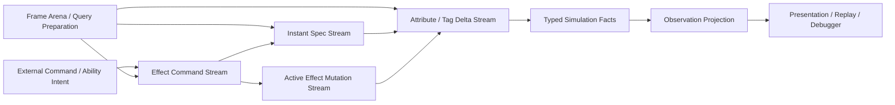
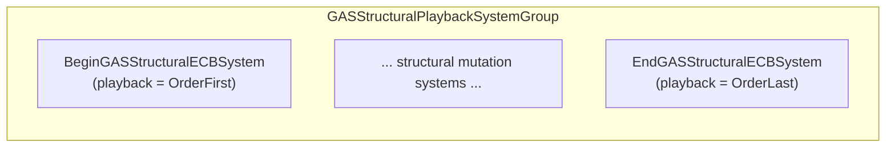
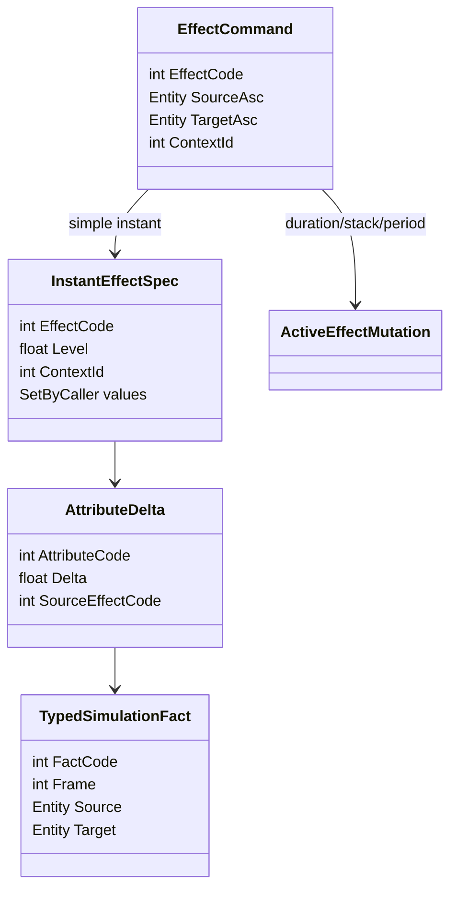
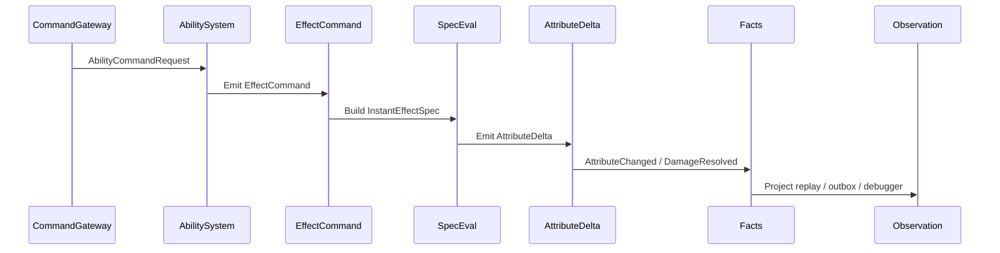
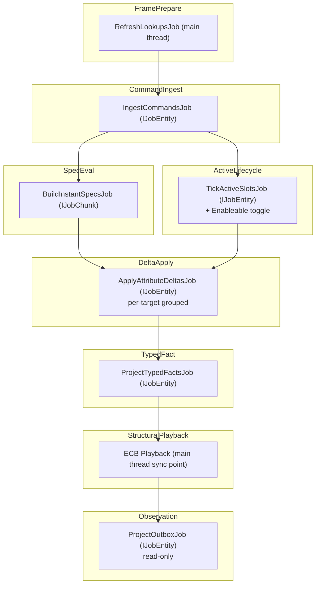

# Runtime Core 管线 Spec

## 目的

定义未来 Runtime Core 的主流程，替代旧 GE lifecycle / global observation stream 混合管线。本 Spec 不仅定义概念流，还定义到 Unity Entities 的物理承载 —— SystemGroup 嵌套、Component 读写矩阵、Frame Arena 物理设计、Job 依赖拓扑和 Sync Point 预算。

## 数据流



## SystemGroup 层级 — 运行时物理骨架

以下 Mermaid 图定义 Runtime Core 在 Unity `SimulationSystemGroup` 中的精确嵌套结构和 UpdateOrder。这不是示意——这就是目标态的代码结构。

```mermaid
flowchart TD
    subgraph UnityPlayerLoop["Unity Player Loop"]
        InitGroup["InitializationSystemGroup"]
        SimGroup["SimulationSystemGroup"]
        PresGroup["PresentationSystemGroup"]
    end

    subgraph SimGroup
        BeginSimECB["BeginSimulationEntityCommandBufferSystem"]
        GasFramePrepare["GASFramePrepareSystemGroup\n[UpdateBefore: GASCommandIngest]"]
        GasCommandIngest["GASCommandIngestSystemGroup"]
        GasSpecEval["GASSpecEvaluationSystemGroup"]
        GasActiveLifecycle["GASActiveEffectLifecycleSystemGroup"]
        GasDeltaApply["GASDeltaApplySystemGroup"]
        GasTypedFact["GASGameplayEventProjectionSystemGroup"]
        GasStructural["GASStructuralPlaybackSystemGroup\n[UpdateAfter: GASGameplayEventProjection, UpdateBefore: GASObservation]"]
        GasObservation["GASObservationProjectionSystemGroup"]
        EndSimECB["EndSimulationEntityCommandBufferSystem"]
    end

    BeginSimECB --> GasFramePrepare
    GasFramePrepare --> GasCommandIngest
    GasCommandIngest --> GasSpecEval
    GasSpecEval --> GasActiveLifecycle
    GasActiveLifecycle --> GasDeltaApply
    GasDeltaApply --> GasTypedFact
    GasTypedFact --> GasStructural
    GasStructural --> GasObservation
    GasObservation --> EndSimECB
```



### SystemGroup 职责与排序声明

| SystemGroup | 父 Group | UpdateOrder 约束 | 职责 | 结构变化 |
|---|---|---|---|---|
| `GASFramePrepareSystemGroup` | `SimulationSystemGroup` | `UpdateBefore: GASCommandIngestSystemGroup` | 预创建所有 query、lookup、type handle；初始化 frame scratch allocator | **禁止** |
| `GASCommandIngestSystemGroup` | `SimulationSystemGroup` | `UpdateAfter: GasRuntimeFramePrepare` | 翻译 Boundary request → Core EffectCommand | 只读外部 request；不直接 playback |
| `GASSpecEvaluationSystemGroup` | `SimulationSystemGroup` | `UpdateAfter: GASCommandIngest` | Build InstantEffectSpec；解析 magnitude/execution | **禁止** |
| `GASActiveEffectLifecycleSystemGroup` | `SimulationSystemGroup` | `UpdateAfter: GASSpecEvaluation` | Tick duration/period/stack；enableable toggle | **禁止**直接结构变化；允许 enableable toggle |
| `GASDeltaApplySystemGroup` | `SimulationSystemGroup` | `UpdateAfter: GASActiveEffectLifecycle` | Apply AttributeDelta/TagDelta；deterministic reduce | **禁止** |
| `GASGameplayEventProjectionSystemGroup` | `SimulationSystemGroup` | `UpdateAfter: GASDeltaApply` | 从 delta 投影 typed simulation facts | **禁止** |
| `GASStructuralPlaybackSystemGroup` | `SimulationSystemGroup` | `UpdateAfter: GASGameplayEventProjection, UpdateBefore: GASObservation` | **唯一 hot path 结构变化屏障** | **唯一允许**（仅限 ECB playback） |
| `GASObservationProjectionSystemGroup` | `SimulationSystemGroup` | `UpdateAfter: GASStructuralPlayback` | 只读投影 → outbox / replay / debugger | **禁止**（不反写 simulation） |

### ECB System 摆放



**规则：**
1. `BeginGASStructuralECBSystem` — 在 Structural Group 最前面 playback。用于需要在 Delta Apply 和 Typed Fact 之前完成的结构变化（如 spawn entity）。
2. `EndGASStructuralECBSystem` — 在 Structural Group 最后面 playback。用于 cleanup、destroy、grant/remove 等"帧尾清理"。
3. Core hot path systems（Spec/Delta/Lifecycle）的 job 使用 `EndGASStructuralECBSystem` 记录结构变化意图。
4. **不使用** Unity 默认的 `BeginSimulationEntityCommandBufferSystem` / `EndSimulationEntityCommandBufferSystem` —— 因为它们的 playback 位置在 Simulation 首尾，而我们需要的 playback 在 Typed Fact 之后、Observation 之前。
5. 中间 structural mutation systems 必须通过 `[UpdateAfter(typeof(BeginGASStructuralECBSystem))]` + `[UpdateBefore(typeof(EndGASStructuralECBSystem))]` 显式声明调度约束（符合不变量 7），或嵌套在 `GASStructuralPlaybackSystemGroup` 的子 SystemGroup 中保证顺序。

---

## UML 类图



## 时序图：Ability 触发 Instant GE



## Phase 顺序

| Phase | 输入 | 输出 |
|---|---|---|
| Frame Arena / Query Preparation | SystemGroup tick / world time | query handles、lookup handles、frame scratch、dependency budget |
| Command Ingest | external request | ability/effect command |
| Spec Evaluation | effect command | instant spec / active mutation |
| Delta Apply | spec / active mutation | attribute/tag delta |
| Typed Fact Projection | delta / lifecycle | typed simulation facts |
| Observation Projection | typed facts | replay/outbox/debugger |

---

## Per-Phase Component 读写矩阵

这是 Runtime Core 的物理安全契约。每个 phase 必须精确声明对每种 component type 的访问模式。

### 数据 Component（状态承载）

| Component | FramePrepare | CommandIngest | SpecEval | ActiveLifecycle | DeltaApply | TypedFact | StructuralPlayback | Observation |
|---|---|---|---|---|---|---|---|---|
| `AttributeComponent` (per-ASC, IComponentData, 每种属性一个独立type) [(1)](#attr-footnote) | — | — | R | — | **RW** | R | — | R |
| `AttributeModifierBuffer` (per-target buffer) | — | — | — | — | **W** | R | — | — |
| `GEEffectCommandBuffer` (stream) | — | **W** | R | — | — | — | — | — |
| `GEEffectSpecBuffer` (stream) | — | — | **W** | — | R | — | — | — |
| `ActiveEffectMutationBuffer` (stream) | — | — | — | **W** | R | — | — | — |
| `ActiveGameplayEffectBuffer` (per-ASC buffer) | — | — | — | **RW** | R | R | — | — |
| `GameplayEventBuffer` (stream) | — | — | — | — | — | **W** | — | R |
| `PresentationEventBuffer` (outbox) | — | — | — | — | — | — | — | **W** |
| `ASCActiveEffectsComponent` (per-ASC) | — | — | — | R | — | — | R | — |
| `TagMaskComponent` (per-ASC) | — | — | — | R | **RW** | R | — | R |
| `AbilityStateComponent` [(2)](#ability-footnote) | — | **R** | — | R | — | — | **RW** | — |
| `AbilityActiveTag` (enableable) [(2)](#ability-footnote) | — | **R**（只读filter） | — | — | — | — | **toggle** | — |
| `TargetDataBuffer` [(2)](#ability-footnote) | — | **W** | R（consumer 读取target list 生成 command） | — | — | — | — | — |

**符号：** R = 只读、W = 只写、RW = 读写、— = 不访问

> <a id="attr-footnote">(1)</a> `AttributeComponent` 是占位符，实际实现为 per-attribute-type 的多个独立 `IComponentData`（如 `HealthAttribute`, `ManaAttribute`, `StrengthAttribute`）。每种属性一个 component type 保证 Query 精确性和 Job 依赖精确性，见 `13-EntityComponent物理布局Spec.md` 行84。本矩阵使用统称以保持可读性。命名遵循 `[属性名]Attribute` 格式（`IComponentData`），`Buffer` 后缀严格保留给 `IBufferElementData`。
>
> <a id="ability-footnote">(2)</a> Ability 相关 component 挂载在独立的 Ability Entity 上（非 ASC Entity），见 `13-EntityComponent物理布局Spec.md` Entity 3b。`AbilityStateComponent` 在 CommandIngest 被读取以校验 ability 可用性，在 StructuralPlayback 被 grant/revoke。`AbilityActiveTag` 是 enableable，grant/revoke 时 toggle。`TargetDataBuffer` 由目标解析系统写入，由 EffectCommand 生成系统消费。

### 数据 Component（定义/查找 — 只读）

| Component | FramePrepare | 其余 Phase |
|---|---|---|
| BlobAssetReference (GE/Ability def) | **Lookup 创建** | R（通过 lookup） |
| Generated static id → index lookup | **Lookup 创建** | R |

### Enableable Component（状态标记）

| Enableable Component | 挂载 Entity | 切换 Phase | 切换频率 |
|---|---|---|---|
| `AbilityActiveTag` | ASC entity | ActiveLifecycle / StructuralPlayback | 低频（ability grant/revoke） |
| `PeriodDueTag` (per-slot) | ASC entity | ActiveLifecycle | 每帧（period tick 到期时置位） |

> **注：** Per-slot active/inhibited 标记使用 `ActiveGameplayEffectBuffer.Flags` bitmask（见 `13-EntityComponent物理布局Spec.md` 行221-223），不创建独立的 `CEffectSlotActive` enableable component。

### Chunk Component（chunk 级标记）

| Chunk Component | 使用目的 | 设置 Phase | 消费 Phase |
|---|---|---|---|
| `AllIdleChunkComponent` | 标记整个 chunk 的 ASC 所有 slot 都是 idle → 跳过整个 chunk | ActiveLifecycle | SpecEval, DeltaApply |
| `NoActiveEffectsChunkComponent` | 标记整个 chunk 的 ASC 无 active effect | ActiveLifecycle | DeltaApply, TypedFact |

### 结构变化权限矩阵

| 操作 | 仅在 | 方式 |
|---|---|---|
| `CreateEntity` | `GASStructuralPlaybackSystemGroup` | ECB playback |
| `DestroyEntity` | `GASStructuralPlaybackSystemGroup` | ECB playback |
| `AddComponent<T>` | `GASStructuralPlaybackSystemGroup` | ECB playback 或 EntityQuery bulk |
| `RemoveComponent<T>` | `GASStructuralPlaybackSystemGroup` | ECB playback 或 EntityQuery bulk |
| `SetComponentEnabled<T>` | `GASActiveEffectLifecycleSystemGroup` 或 `GASStructuralPlaybackSystemGroup` | IJobEntity `EnabledRefRW` 或 ECB |
| `DynamicBuffer.Add/Remove` | 各 owning phase | 直接操作（不触发结构变化） |
| `DynamicBuffer` 首次添加 | `GASStructuralPlaybackSystemGroup` | ECB `AddComponent<T>` |

---

## Frame Arena 物理设计

### 定位

`GASFramePrepareSystemGroup` 不是"一个初始化 System"，而是 Runtime Core 每帧的**公共基础设施层**。它为后续所有 phase 预创建和缓存 ECS lookup/allocator 结构，避免各 phase 临时创建 lookup 或分配 scratch 内存导致不可归因的 sync point 和 allocator 碎片。EntityQuery 由各 ISystem 通过 `SystemState.GetEntityQuery` 自行管理（`PRF-33`），不进入 Frame Arena。

### Frame Arena 的三个职责

```
GASFramePrepareSystemGroup（帧首执行一次）
│
├── 1. Lookup / TypeHandle Registry
│     每帧刷新所有 ComponentLookup / BufferLookup / ComponentTypeHandle
│     因为结构变化后所有 handle 失效
│     后续 phase 的 job 从 registry 取 lookup，不自行创建
│
├── 2. Frame Scratch Allocator
│     分配本帧 scratch：RewindableAllocator 或 WorldUpdateAllocator
│     所有 Temp/TempJob 分配从此 allocator 派生
│     帧末 Arena Teardown 统一 rewind/dispose
│
└── 3. Dependency Budget
│     收集上帧 Dependency 链长度、enableable wait 次数
│     与 budget 对比，超标时输出 Debugger 告警
```

> **注：EntityQuery 不进入 Frame Arena 集中管理。** 各 ISystem 在自己的 `OnCreate` 中通过 `SystemState.GetEntityQuery` 创建 query（符合 `PRF-33`），SystemState 自动维护 query 有效性。Frame Arena 只集中管理跨 system 共享的资源：lookup handle、scratch allocator 和 dependency budget。Query 的数量和匹配 archetype 由 Debugger 归因统计，不依赖集中 registry。

### Arena 物理实现的两种候选

| 方案 | 描述 | 适用 |
|---|---|---|
| **A: Singleton Registry** | 所有 query/lookup 存在一个 singleton entity 的 DynamicBuffer 或 component 上；FramePrepare System 每帧刷新 | 简单、易诊断；但 query 集中管理违反 `PRF-33`，仅限 proof |
| **B: SystemState 缓存** | 每个 ISystem 在自己的 `OnCreate` 创建 query（`SystemState.GetEntityQuery`），SystemState 自动维护；Frame Arena 仅集中管理 scratch allocator + lookup refresh + dependency budget | ECS 官方推荐模式；query 由安全系统追踪 |

**目标态选择：方案 B**（SystemState 缓存 + Frame Arena 管理 allocator/lookup）。EntityQuery 由各 ISystem 自行管理，Frame Arena 负责跨 system 共享的 scratch allocator、lookup handle 刷新和 dependency budget。两方案不再混合。

### Arena Allocator 生命周期

```
帧首 Arena Setup:
  1. RewindableAllocator.Rewind()          ← 清空上帧 scratch
  2. 刷新所有 ComponentLookup / BufferLookup（handle 在结构变化后失效）
  3. 各 ISystem 通过 SystemState 自动获取 ComponentTypeHandle

  ↓ 后续 phase 使用 Arena allocator 分配 Temp/TempJob 数据 ↓
  ↓ 各 ISystem 通过自身 SystemState 管理的 EntityQuery 匹配 entity ↓

帧尾 Arena Teardown (在 Observation 之后):
  4. 确认所有 TempJob 已 Dispose
  5. RewindableAllocator.Rewind()           ← 回收本帧 scratch
  6. 输出 Arena 使用指标到 Debugger
```

### Arena 指标（Debugger 必须输出）

| 指标 | 说明 | 告警阈值 |
|---|---|---|
| `arena.lookupRefreshCount` | 本帧 Arena 刷新的 lookup 数 | > 30（考虑减少 system） |
| `arena.scratchAllocUsed` | Arena allocator 峰值使用量 | > 1 MB（检查泄漏） |
| `arena.tempJobLeakCount` | 未 Dispose 的 TempJob 数 | > 0（硬错误） |
| `arena.systemQueryCount` | 全帧各 ISystem 持有的 EntityQuery 总数（由 Debugger 归因统计） | > 20（评估 query 合并） |

---

## Unity Entities 承载映射

Runtime Core phase 必须落到 Unity Entities SystemGroup，而不是只停留在概念流：

| Phase | 目标 SystemGroup | 默认实现 | 结构变化权限 |
|---|---|---|---|
| Frame Arena / Query Preparation | `GASFramePrepareSystemGroup` | `ISystem` 更新 query / lookup / type handle，准备 `WorldUpdateAllocator` / group allocator scratch | 禁止 |
| Command Ingest | `GASCommandIngestSystemGroup` | `ISystem` + command buffer / DynamicBuffer ingest | 读取边界 request；不直接 playback |
| Spec Evaluation | `GASSpecEvaluationSystemGroup` | `ISystem` + `IJobEntity` / `IJobChunk` | 禁止 |
| Delta Apply | `GASDeltaApplySystemGroup` | `ISystem` + parallel delta apply job | 禁止 |
| Active Effect Lifecycle | `GASActiveEffectLifecycleSystemGroup` | stable slot / enableable / DynamicBuffer | 禁止直接结构变化 |
| Typed Fact Projection | `GASGameplayEventProjectionSystemGroup` | typed fact buffer / enableable fact marker | 禁止 |
| Structural Playback | `GASStructuralPlaybackSystemGroup` | ECB playback | 唯一 hot path structural boundary |
| Observation Projection | `GASObservationProjectionSystemGroup` | read-only projection job / boundary sink | 不反写 simulation |

详细规则见 `UnityDOTS官方文档参考/主题/01-Entities系统与World.md`、`UnityDOTS官方文档参考/主题/90-规则编号索引.md`、`UnityDOTS官方文档参考/主题/20-GASRuntimeCore-API选型基线.md` 和 `UnityDOTS官方文档参考/主题/12-官方案例模式.md`。

---

## Job 依赖拓扑

### 帧内 Job Chain



### 并行机会

- `BuildSpecs` 和 `TickSlots` **可以并行**（读不同 component 集：Spec 读 `GEEffectCommandBuffer`；Lifecycle 读 `ActiveGameplayEffectBuffer`）
- `ApplyDeltas` 必须等待两者都完成（`CombineDependencies`）

### Sync Point 预算

| Sync Point 来源 | 位置 | 触发条件 | 目标预算（60fps = 16.67ms） |
|---|---|---|---|
| ECB playback | `GASStructuralPlaybackSystemGroup` | 每帧 1 次（结构变化合并） | < 1.0ms |
| Enableable-filtered query（如有） | 使用同步 query 的 phase | 写 enableable 的 job 未完成 + 同步 query | **目标：0 次** — 全部使用 `IgnoreFilter` 或异步 query |
| `SystemAPI.Query` foreach | 禁止在 hot path | — | **0 次** |
| **总计** | | | **< 1.0ms，1 个 sync point** |

**降级策略：**
- 若 ECB playback > 1.0ms → 审计 ECB command 数量，评估 EntityQuery bulk 替代逐 entity ECB
- 若出现意外的 enableable sync → 检查哪个 phase 的同步 query 未使用 `IgnoreComponentEnabledState`
- 若出现意外的结构变化 sync → **P0 违规**，Debugger 告警

---

## DOTS API 选型修正

Runtime Core phase 不等于固定 API。后续实现前必须按下表完成 API selection ladder：

| Phase | 首选问题 | 候选 DOTS API | 适用规则 | 必须输出的证据 |
|---|---|---|---|---|
| Frame Arena / Query Preparation | 本帧是否需要 query result / lookup / scratch，生命周期多长 | `WorldUpdateAllocator`、system group allocator、Rewindable allocator、`EntityQueryBuilder`、TypeHandle、Lookup、async query result | `SYS-02` `SYS-03` `CASE-16` `NAT-01` `NAT-04` `NAT-05` `PRF-14` `PRF-35` | allocator owner、rewind 生命周期、lookup update count、query count、dependency wait |
| Command Ingest | 命令来自低频边界还是高频 fan-in | request entity、owner DynamicBuffer、`NativeStream`、per-thread stream、ECB `AppendToBuffer` | `SEL-01` `SEL-02` `CASE-04` `CASE-05` `CASE-12` `CASE-47` `BUF-01` `NAT-03` `PRF-13` | command count、fan-in source、buffer pressure、determinism |
| Spec Evaluation | 是否能按 chunk 顺序批处理 | `IJobEntity`、`IJobChunk`、`ChunkEntityEnumerator`、Blob lookup、static lookup | `QRY-01` `JOB-01` `JOB-02` `JOB-04` `CASE-02` `CASE-03` `CASE-26` `PRF-05` | matched chunks/entities、lookup count、Burst target |
| Delta Apply | 是否需要随机访问或可按目标分组 | sorted stream、per-target buffer、`ComponentLookup`、chunk-local apply | `QRY-03` `QRY-04` `PRF-06` `PRF-19` `PRF-26` `CASE-04` | random lookup count、write component set、change version risk |
| Active Effect Lifecycle | 状态切换是高频开关还是生命周期变化 | enableable、enum state、DynamicBuffer slot、stable effect entity、Cleanup Component、Chunk Component | `EN-01` `EN-02` `FSM-01`~`FSM-06` `CASE-06` `CASE-15` `CASE-20` `CASE-28` `CASE-37` `PRF-01` `PRF-03` | archetype count、enabled count、cleanup count、chunk skip count |
| Typed Fact Projection | fact 是 Core reaction 还是 Boundary observation | typed component、enableable marker、`NativeStream`、outbox buffer、sampled sink | `SYS-05` `CASE-12` `CASE-18` `CASE-38` `DBG-03` `STORE-03` | fact count、consumer count、projection lag |
| Structural Playback | 是否可批量而非逐实体 | EntityQuery bulk、`ComponentTypeSet`、`EntityQueryCaptureMode.AtPlayback`、ECB playback | `SC-01`~`SC-03` `ECB-01`~`ECB-04` `CASE-05` `CASE-21` `CASE-33`~`CASE-35` `PRF-02` `PRF-04` `PRF-21` `PRF-25` | structural count、sync point、origin system |
| Observation Projection | 是否进入表现/Replay/Debugger 边界 | read-only projection job、sampled sink、WeakObjectReference / UnityObjectRef boundary | `SYS-05` `DBG-01` `DBG-02` `GFX-01` `CONTENT-01` `CASE-10` `CASE-11` `PRF-32` | presentation marker、replay sink、GC alloc |

执行规则：

1. AM3 前，`EffectCommand` 承载必须复核 `NativeStream` / per-owner stream / DynamicBuffer / request entity / ECB 的取舍（`CASE-04` `CASE-05` `CASE-12` `CASE-47` `SEL-01` `SEL-02`）。
2. AM5 每个小闭环前，ActiveEffectStore 必须复核 slot、stable entity、cleanup component、enableable、enum state、chunk component 的取舍（`CASE-06` `CASE-15` `CASE-20` `CASE-28` `CASE-37` `FSM-01`~`FSM-06`）。
3. T4 Debugger 必须能解释 API 选型是否健康，而不是只输出 `avgTickMs`（`DBG-01`~`DBG-05`）。
4. 每个 phase 的实现写法必须对照具体 `CASE-*`：hot path 遍历对照 `CASE-02`/`CASE-03`（禁止 `CASE-01` 主线程 foreach），结构变化对照 `CASE-05`/`CASE-21`/`CASE-33`~`CASE-35`，buffer 对照 `CASE-04`/`CASE-36`/`CASE-47`，bake/resource 对照 `CASE-07`/`CASE-39`~`CASE-44`，chunk 优化对照 `CASE-18`/`CASE-26`~`CASE-28`/`CASE-38`。
5. Structural Playback 必须声明 `sortKey` 策略（`CASE-35` `[ChunkIndexInQuery]`）和独立 ECB per job 策略（`PRF-25`）。
6. Enableable 迭代优先使用 `ChunkEntityEnumerator`（`CASE-26`），批量操作使用 `EnabledMask`（`CASE-20`）。

---

## Enableable 全局策略

### 为什么需要全局策略

`IEnableableComponent` 是 Unity ECS 避免 archetype 爆炸的核心机制（参见 `PRF-03`）。但 enableable 的查询不是免费的 —— 同步 query 在有 enableable 写 job 未完成时会触发 sync point。因此需要全局策略：**哪些 component 是 enableable、哪些 query 用 IgnoreFilter、在哪个 phase 做 toggle。**

### Enableable Component 清单

| Enableable Component | 挂载 Entity | Toggle Phase | Toggle 方式 | 消费 Query 的 IgnoreFilter? |
|---|---|---|---|---|
| `PeriodDueTag` | ASC entity | `GASActiveEffectLifecycleSystemGroup` | `EnabledRefRW` | 否 — 消费者只处理到期的 |
| `AbilityActiveTag` | ASC entity | `GASStructuralPlaybackSystemGroup`（grant/revoke 时通过 ECB） | ECB `SetComponentEnabled` | 否 |
| `FactReadyTag`（optional） | fact stream | `GASGameplayEventProjectionSystemGroup` | `EnabledRefRW` | 消费者用 `IgnoreFilter` 或异步 query |

### Query IgnoreFilter 策略

| Query 用途 | 是否 IgnoreFilter | 原因 |
|---|---|---|
| DeltaApply 读取 Attribute（非 enableable） | N/A | Attribute 本身不是 enableable |
| ActiveLifecycle 遍历 active slot | **否** — 需要过滤 | 只处理 active slot，idle 的不需处理 |
| TypedFact 消费 delta（非 enableable） | N/A | Delta buffer 不是 enableable |
| Debugger 快照 | **是** — IgnoreFilter | Debug 用途不做 enableable 过滤，避免等待写 job |
| Observation outbox 投影 | **是** — IgnoreFilter 或用异步 query | Boundary 不阻塞 Core |

### Enableable Wait 监控

Debugger 必须报告：
- `enableableWriteJobCount` per phase
- `enableableSyncQueryCount` — 使用了同步 query + 未用 IgnoreFilter + 有未完成的 enableable 写 job
- **若 `enableableSyncQueryCount > 0` 告警** —— 表示本帧有额外的 sync point

---

## Chunk Component 策略

### 使用场景

| Chunk Component | 目的 | 设置 Phase | 设置条件 | 消费 Phase |
|---|---|---|---|---|
| `AllIdleChunkComponent` | 整个 chunk 的 ASC 的所有 effect slot 都是 idle | `GASActiveEffectLifecycleSystemGroup` | 遍历 chunk 确认所有 slot 状态 | `GASSpecEvaluationSystemGroup`、`GASDeltaApplySystemGroup` — 跳过整个 chunk |
| `NoActiveEffectsChunkComponent` | 整个 chunk 的 ASC 无 active effect | `GASActiveEffectLifecycleSystemGroup` | 遍历 chunk 确认无 active | `GASDeltaApplySystemGroup`、`GASGameplayEventProjectionSystemGroup` |
| `PeriodDueChunkComponent`（可选） | 整个 chunk 的 ASC 的 period due 状态统一 | `GASActiveEffectLifecycleSystemGroup` | 按 period 时长分组 ASC 到不同 chunk | `GASSpecEvaluationSystemGroup` |

### Chunk Skip 实现模式

```csharp
// IJobChunk.Execute 开头：
public void Execute(in ArchetypeChunk chunk, ...)
{
    // 检查 chunk component — 如果整个 chunk idle 则跳过
    if (chunk.Has<AllIdleChunkComponent>())
        return;  // 零 entity 遍历成本

    // ... 正常遍历
}
```

**注意：** Chunk Component 是优化，不是正确性依赖。如果 DeltaApply 依赖 NoActiveEffectsChunkComponent 跳过，但 ActiveLifecycle 忘记更新该标记，会导致逻辑错误而非 crash。因此 Chunk Component 的使用必须有 Debugger 验证。

### Chunk Component 一致性验证算法

Debugger 在 `GASObservationProjectionSystemGroup` 中执行轻量级采样验证（不阻塞 hot path）：

1. **采样策略**：每 N 帧（N=60，约 1 秒一次）随机选取 10% 的 chunk，对其中的全部 entity 做全量状态扫描。
2. **验证逻辑**：
   ```
   for each sampled chunk:
       if chunk.Has<AllIdleChunkComponent>():
           // 验证：该 chunk 中不应有任何 active slot
           for each entity in chunk:
               for each slot in ActiveGameplayEffectBuffer:
                   if slot.Flags & Active: → 报告 "AllIdleChunkComponent 错误标记"
       if chunk.Has<NoActiveEffectsChunkComponent>():
           // 验证：该 chunk 中不应有任何 active effect
           for each entity in chunk:
               if HasAnyActiveSlot(entity): → 报告 "NoActiveEffectsChunkComponent 错误标记"
   ```
3. **输出指标**：
   - `chunkComponentMismatchCount` — 标记与实际状态不一致的 chunk 数
   - **若 > 0 → P0 告警**（逻辑错误，可能导致 entity 被错误跳过）
   - `chunkSkipSavings` — chunk skip 实际节省的处理量（skipped entities / total entities）
4. **降级策略**：若 `chunkComponentMismatchCount > 0`，消费者 phase 应在该帧自动 fallback 到 per-entity 检查（忽略 Chunk Component），并向 Debugger 输出降级事件。

---

## DOTS Backbone First 落地顺序

`Frame Arena / Query Preparation` 不是可选优化阶段，而是 Runtime Core 后续功能迁移的前置骨架。继续扩展 `Instant Spec Evaluation`、`Active Effect Store`、`Typed Fact Projection` 或 Debugger 之前，必须先完成 `Runtime Core Frame Backbone`：

1. SystemGroup：建立 `GASFramePrepareSystemGroup`、各 Runtime Core phase group 和 `GASStructuralPlaybackSystemGroup` 的显式顺序。
2. Frame owner：每类 command / spec / delta / fact / active mutation stream 都必须声明 owner、clear phase、writer phase、reader phase 和 merge phase。
3. Query / lookup budget：每帧 query 数、lookup update 数、random lookup 数、filtered / unfiltered query 数和 enableable wait 必须可统计。
4. Allocator / dependency budget：每帧 scratch allocator、`WorldUpdateAllocator` / `RewindableAllocator` 使用者、job dependency wait 和 manual NativeContainer dependency 必须可归因。
5. Determinism：并行 fan-in 必须声明 sort key、partition、merge order、battle hash 或等价 deterministic output policy。
6. Structural playback：hot path 结构变化只允许进入 `GASStructuralPlaybackSystemGroup`，并输出 playback count、ECB command count、bulk query count 和 origin system。
7. Debug evidence：Debugger 至少输出 frame backbone counters；性能结论必须能和 Profiler / Entities Journaling / Burst Inspector 证据对照。

该顺序不新增架构层级，只规定 Runtime Core 的实现前置条件。AM3 / AM5 可以保留当前已落地的小闭环，但继续扩张前必须先补齐该 backbone。

## Runtime Core API 预算

每个 phase 除了功能验收，还必须给出 API 预算和重新选型触发条件：

| 预算项 | 必须记录 | 重新选型触发 |
|---|---|---|
| buffer pressure | length / capacity / peak / spill / clear phase | spill 或 x50 起峰值持续增长 |
| lookup pressure | lookup update count / random lookup count / read-write lookup count | random lookup 成为 TopN 热点或随实体数线性爆炸 |
| chunk efficiency | matched chunks / skipped chunks / utilization / enabled-aware count | 大量 idle/no-op 仍全量扫描 |
| structural cost | query bulk count / ECB command count / playback count / sync point | 大批量变化表现为 per-entity ECB |
| output determinism | sort key / partition / post-sort / hash | battle hash 不稳定或无序 ParallelWriter 影响 gameplay |
| native allocation | allocator / lifetime / dispose / merge cost | TempJob 越界、Persistent 无 owner、merge cost 高于主计算 |
| proof-only API | proof marker / scale-ready marker / reselect trigger | proof API 被用于 x1000 以上却无替代方案 |
| dependency budget | read/write component set / enableable wait / SystemAPI foreach sync / manual NativeContainer dependency | 无意义等待成为 TopN 或 query/filter 触发主线程阻塞 |

## DOTS 深读后的管线修正

1. Runtime Core 每帧必须显式准备 query / lookup / allocator / dependency，不允许各 helper 临时创建 query、临时分配 container、临时读取 singleton 后再让 Debugger 无法归因。
2. `Command Ingest` 只负责把 Boundary request 翻译为 Core command，不负责 spec 计算、不负责表现 projection、不直接结构变化。
3. `Spec Evaluation` 和 `Delta Apply` 的目标形态是 query 顺序 pass；若必须 random lookup，必须解释为什么不能按 target 分组或使用 owner-local buffer。
4. `Structural Playback` 是唯一热路径结构变化语义屏障；大批量同类结构变化优先 EntityQuery bulk / `ComponentTypeSet`，job 内发现的少量变化才进入 ECB。
5. `Observation Projection` 不再承担 Debugger 全量日志；只投影必要 outbox / replay / sampled sink，性能分析由 Debugger counters 与 Unity Profiler / Journaling 对照完成。
6. AutoChess 无头验收若使用隔离 world 或固定 tick，应明确 world time / `ICustomBootstrap` / manual runner，不隐式依赖 Editor frame delta。
7. **新增：** Enableable toggle 集中在 `GASActiveEffectLifecycleSystemGroup`；其他 phase 对 enableable component 只有只读访问。不允许在 Spec Evaluation 或 Delta Apply 中做 enableable toggle。
8. **新增：** Chunk Component 由 `GASActiveEffectLifecycleSystemGroup` 维护；消费者 phase 的 IJobChunk 在 `Execute` 开头检查 Chunk Component 决定是否跳过整个 chunk。

---

## 附录：System 清单

以下为 Runtime Core 各 SystemGroup 中已落地和计划中的 ISystem 类名清单，提供从 Spec phase 到具体代码的 traceability。

### GASFramePrepareSystemGroup

| System | 状态 | 职责 |
|---|---|---|
| `GASFrameArenaSetupSystem` | 计划中 | 帧首刷新 lookup handle、rewind scratch allocator、输出 dependency budget |

### GASCommandIngestSystemGroup

| System | 状态 | 职责 |
|---|---|---|
| `AbilityCommandIngestSystem` | 计划中 | 消费 Boundary ability request → 写入 `AbilityCommandRequest` 消费 |
| `GEEffectCommandIngestSystem` | 已落地 | 翻译 Boundary request + ability output → `GEEffectCommandBuffer` |
| `PeriodOverflowCommandDeriveSystem` | 已落地 | period due / stack overflow → 派生 `GEEffectCommandBuffer(Source=Period/Overflow)` |

### GASSpecEvaluationSystemGroup

| System | 状态 | 职责 |
|---|---|---|
| `GEEffectSpecBuildSystem` | 已落地 | `GEEffectCommandBuffer` + GE definition → `GEEffectSpecBuffer` |
| `ActiveEffectMutationApplySystem` | 已落地 | duration/stack/period 命令 → `ActiveEffectMutationBuffer`（AM5 store 迁移中） |

### GASActiveEffectLifecycleSystemGroup

| System | 状态 | 职责 |
|---|---|---|
| `ActiveEffectTickSystem` | 已落地（部分迁入 AM5） | duration tick、period accumulator、expire 检测 |
| `ActiveEffectSlotSyncSystem` | 已落地 | 旧 runtime GE entity 状态 → `ActiveGameplayEffectBuffer` 镜像同步 |
| `ChunkComponentMaintainSystem` | 计划中 | 维护 `AllIdleChunkComponent` / `NoActiveEffectsChunkComponent` 标记 |

### GASDeltaApplySystemGroup

| System | 状态 | 职责 |
|---|---|---|
| `AttributeModifierApplySystem` | 已落地 | `GEEffectSpecBuffer` → `AttributeModifierBuffer` → `AttributeComponent` 写入 |

### GASGameplayEventProjectionSystemGroup

| System | 状态 | 职责 |
|---|---|---|
| `GameplayEventProjectionSystem` | 已落地 | `AttributeModifierBuffer` → `GameplayEventBuffer` |
| `CueRequestProjectionSystem` | 已落地 | `GEEffectSpecBuffer.CueRequestOnApplyCode` → `GameplayEventBuffer(CueRequested)` |
| `GameplayEventLegacyBridgeSystem` | 已落地（迁移期） | 旧 `BAttributeChangeEvent` / `BCueRequest` / `BGameplayEvent` 兼容出口 |

### GASStructuralPlaybackSystemGroup

| System | 状态 | 职责 |
|---|---|---|
| `BeginGASStructuralECBSystem` | 计划中 | ECB playback（OrderFirst）— spawn entity、grant ability |
| `EndGASStructuralECBSystem` | 计划中 | ECB playback（OrderLast）— destroy、cleanup、revoke ability |
| `FrameEndCleanupSystem` | 计划中 | frame-local buffer 清空、stream counter 重置 |

### GASObservationProjectionSystemGroup

| System | 状态 | 职责 |
|---|---|---|
| `PresentationOutboxSystem` | 已落地 | `GameplayEventBuffer` → `PresentationEventBuffer` |
| `ReplayLogSystem` | 已落地 | `GameplayEventBuffer` → `BDebugReplayEvent` |
| `DiagnosticsSnapshotSystem` | 已落地（AM1 baseline） | Debugger counters → `RuntimeDiagnosticsSnapshot` |

---

## 禁止方向

1. Simple instant GE 默认创建 runtime GE entity。
2. 业务 reaction 扫描全局 observation event 作为主输入。
3. Presentation / Replay / Debugger 混入 core simulation tick。
4. 在 Spec Evaluation / Delta Apply / Typed Fact Projection 中直接执行 `EntityManager` 结构变化。
5. 把 request entity 当作高频 instant GE 的默认 command 载体。
6. **新增：** 在 Spec Evaluation / Delta Apply / Typed Fact 中做 enableable toggle。
7. **新增：** 使用 Unity 默认的 `BeginSimulationEntityCommandBufferSystem` / `EndSimulationEntityCommandBufferSystem` 做 Runtime Core 结构变化（playback 位置不对）。
8. **新增：** 在 hot path 临时创建 EntityQuery 或 ComponentLookup（必须通过 Frame Arena 预创建）。
9. **新增：** 使用同步 enableable-filtered query 而不评估 sync point 成本。

## 历史方案定位

1. Ability command 作为纯 ECS 激活入口的设计信号来自 `../历史方案参考/方案15.md:199-232`。
2. OOP 只通过边界层 command gateway 发命令、ECS 侧写 request 的边界来自 `../历史方案参考/方案14.md:265-335`。
3. Command Buffer / Event Buffer 单向边界来自 `../历史方案参考/方案11.md:20-43`。
4. Attribute 计算从托管 helper 迁移到 unmanaged / Burst-friendly 计算的信号来自 `../历史方案参考/方案15.md:350-466`。
