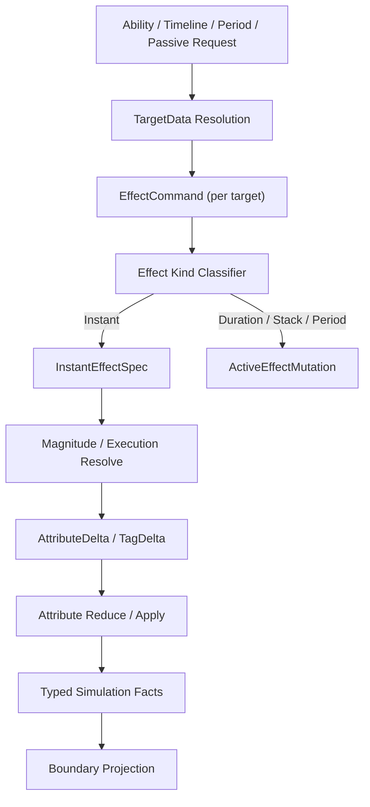

# EffectCommand / Spec-Delta-Fact 语义链 Spec

## 目的

定义目标态 Runtime Core 的 Effect Command / Spec / Delta / Fact 语义链。这里的 Spec、Delta、Fact 是语义阶段，不是要求建立一个全局 SpecStream 总线。

## 数据流图



## 核心契约

| 契约 | 职责 |
|---|---|
| `TargetData` | 承载 Ability 的目标选择结果和确定性 sort key，按 target 派生 command record |
| `EffectCommand` | 表达施加意图，携带 source/target/context/effect code；不是 Unity entity |
| `InstantEffectSpec` | 承载一次 instant GE 的只读计算输入；目标态可以是 `NativeStream` / compact range 中的中间 record |
| `ActiveEffectMutation` | 承载 duration/stack/period/granted state 变更；默认写 ASC owner-local slot |
| `AttributeDelta` | 承载 attribute 变更语义；目标态按 target grouped modifier reduce/apply 落地 |
| `TypedSimulationFact` | 供 Runtime Core reaction 消费的稳定事实；Boundary observation 从它派生 |

## 官方依据与设计论证

EffectCommand / Spec / Delta / Fact 是 GAS 语义链，不是一个全局事件总线。`ECB-01` 明确 ECB 是延迟结构变化工具，不是 gameplay event bus；`SC-01` / `ECB-03` 要求结构变化和 playback phase 归属明确；`SEL-01` 要求先区分 Gameplay / Transient / Telemetry / Presentation 数据。因此 instant GE、period tick、passive trigger 等高频效果必须优先落在 frame-local record、owner-local range 或 fan-in stream，而不是默认创建 request entity / runtime GE entity。

高并发 fan-in 的默认选型由 `NAT-03` 驱动：并行 producer 可以写 `NativeStream`，但必须定义 deterministic merge 顺序和内存预算。低量 proof 或边界意图可以使用 DynamicBuffer，但 `BUF-02` 禁止把单一全局 buffer 固化为百万实体 fan-in 方案；`BUF-01` 要求 capacity / spill 指标。Attribute apply 侧则受 `QRY-04` / `PRF-19` 约束，必须避免跨 entity 随机写与遍历数据重叠导致的竞态。

确定性不是日志层补丁，而是 Runtime Core contract。`PRF-08` 禁止 hot path 用 `EntityIndexInQuery`，`CASE-35` 要求并行 ECB 录制使用 `[ChunkIndexInQuery]` sort key；非结构变化的 command / delta / fact 也必须用 source/target/sequence/local index 等显式 key 保持 battle hash 与 replay 稳定。

## EffectContext 定义

`EffectContext` 是 EffectCommand 携带的运行时上下文元数据。它在 Effect Fan-In / Attribute Reduce-Apply / Gameplay Fact kernel 中按需消费，为 magnitude 计算、tag 判定和事实投影提供完整上下文。

### 字段清单

| 字段 | 类型 | 来源 | 消费者 | 说明 |
|---|---|---|---|---|
| `SourceAsc` | `Entity` | Ability activation / GE source | Magnitude Resolver, Fact Projection | 效果来源 ASC |
| `TargetAsc` | `Entity` | TargetData resolution | Attribute Reduce/Apply, Gameplay Fact | 效果目标 ASC |
| `Instigator` | `Entity` | Ability activation | Fact Projection | 发起者（可与 Source 不同，如召唤物） |
| `SourceAbilityCode` | `int` | Ability activation | Magnitude Resolver, Tag Check | 来源 Ability 定义 id |
| `SourceEffectCode` | `int` | GE definition ref | Stacking, Overflow, Fact Projection | 来源 GE 定义 id |
| `ContextId` | `int` | Boundary Command Ingest / Effect Fan-In（生成） | 全链路 trace | 本次施加的唯一上下文 id，command→spec→delta→fact 连续传递 |
| `Level` | `float` | Ability level / GE spec | Magnitude Resolver | 影响 magnitude 计算的等级 |
| `SetByCallerValues` | `GESetByCallerValueBuffer` range | Boundary request / period derivation | Magnitude Resolver | SetByCaller magnitude 的数据源 |
| `HitResultRef` | `int`（index into target data） | TargetData resolution | Cue Projection | 命中结果引用（位置/方向等） |

### 物理承载

EffectContext 不作为独立 entity 或 component type 存在。字段按性质拆分到不同承载：

| 承载 | 包含字段 | 生命周期 | 目标态说明 |
|---|---|---|---|
| `NativeStream` command record / per-producer stream | SourceAsc, TargetAsc, SourceEffectCode, ContextId, Level, TargetSortKey, Sequence | frame-local | 高并发 producer 默认承载，merge 后才进入 owner-local range |
| Compact owner-local command range / small `GEEffectCommandBuffer` | 合并后的少量 target-local command | frame-local | 只保存 merge 后消费范围，不复制 proof 阶段的大容量 singleton buffer |
| `GESetByCallerValueBuffer` range / fixed set-by-caller slice | SetByCaller values | frame-local | 必须记录 owner、range、capacity、spill 指标 |
| `GEEffectSpecRecord` / target-grouped modifier record | 从 EffectCommand 复制的计算输入、resolved modifier | frame-local | 可以是 `NativeList` / `NativeStream` / compact buffer，不固定为全局 `GEEffectSpecBuffer` |
| Ability Entity component | SourceAbilityCode, Instigator | 跨帧（ability 激活期间） | 由 Ability 状态拥有，不反查 managed authoring |

### ContextId 生成机制

ContextId 在 Boundary Command Ingest / Effect Fan-In kernel 由主线程预分配，保证帧内唯一、跨帧唯一、Burst 可用：

```
ContextId (int, 32 bits)
├── 高 20 位 = FrameIndex（约 100 万帧 ≈ 4.6 小时 @ 60fps）
└── 低 12 位 = 帧内序号（每帧最多 4096 个 context）
```

**生成流程：**
1. `GASFrameArenaSetupSystem`（主线程）每帧递增 `FrameIndex`，重置 `NextContextSequence = 0`
2. Boundary Command Ingest / Effect Fan-In 阶段，主线程调用 `AllocateContextRange(count)` 预分配一批 ContextId，Job 通过参数接收 `FrameIndex + ContextSequenceBase`
3. Job 内编码：`contextId = (FrameIndex << 12) | (sequenceBase + i)`，无需原子操作

**设计要点：**
- 主线程预分配范围，避免 Job 内 `Interlocked` 原子争用；`ContextSequenceBase` 由 owner System 作为 Job 参数传入
- `FrameIndex` 和 `ContextSequenceBase` 作为 Job 参数传入，Job 不通过 `ComponentLookup` 访问 `FrameArenaStateComponent`
- 解码（Debugger 追踪用）：`(frameIndex, seq) = (contextId >> 12, contextId & 0xFFF)`

### 不变量

1. ContextId 在 command→spec→delta→fact 中连续传递，不可断裂。
2. SetByCaller 属于 EffectContext（command/spec 侧），不进入 GE definition。
3. EffectContext 字段不混入 `ActiveGameplayEffectBuffer`（Store 侧只记录 source/target/context id 引用，不展开全部 context）。
4. EffectContext 不持有托管对象引用。

## Unity Entities 校准

`EffectCommand` 是 GAS 语义，不等同于 Unity entity。目标态按频率选择承载：

| 命令类型 | 默认承载 | 适用场景 |
|---|---|---|
| 低频边界意图 | request entity / command component | 玩家输入、AI 决策、测试 runner |
| 高频 instant GE | frame-local command DynamicBuffer / Native stream / chunk-local command | 普攻、伤害、治疗、period tick、passive trigger |
| 结构变化命令 | ECB + `GASStructuralCommitSystemGroup` | spawn、destroy、grant ability、owner cleanup |

普通 instant GE 不能因为“写入口统一”而默认创建 request entity 或 runtime GE entity。高频路径必须能被 `ISystem` + job 批处理，并由 Debugger 输出 command/spec/delta/fact 计数。

## DOTS 深读后的承载分层

`EffectCommand` 目标态必须拆成四类承载，不允许用一个全局 stream owner 覆盖全部语义：

| 分层 | 职责 | 候选 API | 适用规则 | 禁止 |
|---|---|---|---|---|
| Boundary request | 玩家输入、AI 决策、测试 runner、网络等低频外部意图 | request entity、command component、Boundary buffer | `CASE-08` `SEL-01` | 按 hit / modifier 数量创建 request entity |
| Core frame command | 本帧 Core 内部要处理的 instant / period / passive command | owner buffer、frame-local DynamicBuffer、`NativeStream`、per-thread stream | `CASE-04` `CASE-12` `BUF-01` | 无容量预算的全局大 buffer |
| Parallel fan-in stream | 多 job producer 产生的 command / spec / delta / fact | `NativeStream`、per-thread list + merge、post-sort | `CASE-12` `NAT-02` `NAT-03` `PRF-13` | 无序 `ParallelWriter` 直接影响 battle hash |
| Structural mutation request | grant/remove/spawn/destroy/cleanup 等结构变化意图 | EntityQuery bulk、`ComponentTypeSet`、ECB ParallelWriter、`EntityQueryCaptureMode.AtPlayback` | `CASE-05` `CASE-33`~`CASE-35` `SC-03` `PRF-04` | job 内 `EntityManager` 或逐实体 ECB 表达大批量同类变化 |

执行含义：

1. 全局 singleton DynamicBuffer 只能是 proof / 低量承载；x50 后若出现 global buffer pressure，必须切到 owner-local 或 `NativeStream` 复核。
2. `GESetByCallerValueBuffer` 这类变长附属数据必须有 internal capacity / range / spill 指标；不能无限追加到一个全局 buffer。
3. Attribute target 不能默认 `BufferLookup` 随机写；优先按 target grouped stream / per-target buffer / chunk apply 设计。
4. 确定性排序机制选型（三种不同用途，不可混用）：
   - **`[EntityIndexInQuery]`** — IJobEntity 属性，全局 entity 索引。**禁止在 hot path 使用**（`PRF-08`），即使在不做结构变化的 phase 中也因其内部 `CalculateBaseEntityIndexArray` 成本不推荐。
   - **`[EntityIndexInChunk]`** — IJobEntity 属性，chunk 内 entity 索引。可在 IJobEntity 中用作 per-chunk 稳定序号，不适用于 ECB sortKey。
   - **`[ChunkIndexInQuery] int sortKey`** — ECB playback 的确定性排序键（`CASE-35`）。在 `GASStructuralCommitSystemGroup` 中，ECB 命令使用 `sortKey = [ChunkIndexInQuery]` 保证同一 playback 内顺序确定且可复现。**前置条件**：使用 `EntityQueryCaptureMode.AtPlayback` 的 ECB 在 playback 时刻评估 query，此时 chunk 索引可能因前期结构变化而偏移；若需要严格跨帧确定性，必须额外附加 command sequence / frame index 作为二级排序键。
5. ExecutionCalculation 不使用托管 delegate；目标形态是 generated id + Burst job/static switch。FunctionPointer 只有在单次调用处理足够多 modifier 时才可作为候选。

## EffectCommand API 选型矩阵

`EffectCommand` 是语义契约，不是固定数据结构。进入 Runtime Core 主链前必须完成下列选型复核：

| 候选承载 | 适用 | 风险 | 适用规则 | 验收指标 |
|---|---|---|---|---|
| ASC owner `DynamicBuffer<GEEffectCommandBuffer>` | per-owner command 较少、consumer 明确、需要持久 owner 语义 | buffer spill、并行写复杂、结构变化后 handle 失效 | `CASE-04` `BUF-01` `BUF-03` | per-owner length / capacity / peak / spill |
| 全局 stream owner `DynamicBuffer<GEEffectCommandBuffer>` | proof / 低规模验证、需要最小接入成本 | 全局 buffer pressure、scan 成本、百万实体下 fan-in 瓶颈 | `SEL-02`（proof-only，禁止固化为 scale-ready）`BUF-02` | global length / capacity / clear phase |
| `NativeStream` / per-thread stream | 多 job 并行 fan-in、压测、需要减少全局写竞争 | merge phase、allocator / dispose 责任、排序需求 | `CASE-12` `NAT-03` `NAT-02` `PRF-13` | stream for-each count、merge cost、deterministic order |
| request entity | 玩家输入、AI 决策、测试 runner 等低频边界意图 | 高频 create/destroy、archetype churn、sync point | `CASE-08` `PRF-11` `SEL-01` | request entity create/destroy 不随 hit 数线性增长 |
| ECB `AppendToBuffer` | 结构变化 phase 后追加到已存在 owner buffer | playback 可见性屏障、sort key 确定性 | `CASE-05` `CASE-47` `CASE-35` `ECB-02` | ECB playback count、sort key policy |
| EntityQuery bulk / `EntityQueryCaptureMode.AtPlayback` | 大批量 grant/remove/cleanup 派生 command | 不适合每条 command 携带复杂上下文 | `CASE-33` `CASE-34` `SC-03` | structural batch count、per-entity command count |
| target grouped stream / per-target buffer | delta apply 可按 target 顺序批处理 | 需要排序 / grouping phase，buffer 容量需预算 | `CASE-04` `CASE-23` `QRY-04` | random lookup count 下降、target group count |
| Burst static switch / generated function id | magnitude / execution calculation | 生成表升级成本、函数过多时分支或代码体积 | `CASE-11` `BUR-01` `PRF-15` | Burst target、branch distribution、vectorization |

默认策略：低规模 proof 可以保留全局 stream owner 作为契约承载；进入目标态性能方案前必须按 `SEL-01` / `SEL-02` / `SEL-04` 重新选型。

### 规模扩展路径与替代方案

proof-only 全局 singleton DynamicBuffer 的目标态替代路径（对应 `SEL-02` / `SEL-04`）：

| 替代阶段 | 触发条件 | 替代方案 | 选型依据 | 关键风险 |
|---|---|---|---|---|
| proof→owner-local | 全局 buffer length > 50% capacity 持续 10+ 帧 | **per-owner (ASC) DynamicBuffer**：每个 ASC entity 持有自己的 compact command / modifier range | `CASE-04` `BUF-01`：按 owner 分组消费者，无全局 scan | per-owner buffer 总内存 = N_ASC × capacity；需监控总 externalized 比例 |
| proof→stream | 多 job 并行 producer fan-in 时全局 buffer 写竞争 | **NativeStream + deterministic merge**：producer job 写 per-thread stream → merge phase 按 target ASC 排序合并 | `CASE-12` `NAT-02` `NAT-03`：并行无锁写，确定性 merge | merge phase 增加 1 个同步边界；需明确 merge 排序键和 allocator |
| owner-local→chunk-local | 百万实体规模下 per-owner buffer 也出现 pressure | **target-grouped chunk-local buffer**：按 (target ASC chunk, attribute type) 分组，在 chunk 内批量 apply | `QRY-04` `CASE-23`：chunk 内顺序访问，消除 random lookup | 需要 grouping pre-pass；chunk 结构变化后 buffer 失效 |

每个承载的**重新选型触发条件**（`SEL-04`）：
1. **buffer pressure 触发**：Debugger 报告 `GEEffectCommandBuffer` 或 `AttributeModifierBuffer` 的 `spillCount > 0` 或 `peakLength > capacity × 50%` 持续超过 10 帧
2. **merge cost 触发**：若引入 parallel fan-in，merge phase 耗时 > Effect Fan-In 主计算耗时的 30%
3. **deterministic ordering 触发**：battle hash 在 x50 规模下连续 3 次运行结果不一致
4. **random lookup 触发**：Debugger 报告 `randomLookupCount / totalEntityProcessed > 10%`

## ECS 数据目标承载

目标态把 GAS 语义映射到 Unity Entities 数据承载。全局 singleton stream 只允许作为 proof-only 低量承载，scale-ready 以 `GASCoreSimulationSystemGroup` 的 Effect Fan-In lane 使用 `NativeStream` producer、deterministic merge 和 compact owner-local range 为准：

| GAS 契约 | 允许的 proof 承载 | 目标态收敛方向 |
|---|---|---|
| Stream owner | singleton owner / version cursor | scale-ready 不依赖全局 owner；owner 在具体 lane system |
| Effect command | small buffer / proof stream | `NativeStream` 写入 `GEEffectCommandRecord` → deterministic merge → compact owner-local range |
| SetByCaller | range buffer / fixed slice | range/slice 必须随 command record 传递，禁止无限追加到全局 buffer |
| Instant spec | intermediate spec record | `GEEffectSpecRecord` / modifier candidate，靠 CoreSimulation 内 Effect Fan-In lane 或 Attribute Reduce/Apply lane 的中间数据承载 |
| Attribute delta | compact modifier range | target-grouped modifier range，按 target chunk / owner 局部 apply |
| Active mutation | owner-local mutation buffer | ASC `ActiveGameplayEffectBuffer` slot mutation，必要时 `NativeStream` fan-in |
| Typed facts | local fact buffer / stream | Core reaction fact / Boundary observation fact 分流，必要时 `NativeStream` merge 或 per-owner fact buffer |

Instant spec 的目标承载必须遵守 owner-local 原则：spec record 可以落在 target owner 的 bounded buffer、chunk-local scratch 或 deterministic fan-in merge 输出的 compact range 中；不得把全局 singleton spec buffer 作为 scale-ready 默认入口。SetByCaller range 必须和 command/spec 同 owner、同 sequence、同 frame 生命周期，不得成为另一个无上限全局 payload buffer。

显式 target kernel skeleton 使用 `AbilityCommandIngestSystem`、`GASEffectFanInSystem`、`GASActiveEffectPreTickSystem`（或 Fan-In 内 producer job）/ `GASActiveEffectPostApplySystem`、`GASAttributeSetReduceApplySystem`、`GameplayFactProjectionSystem`，并进入 `GASSystemScheduleContract`。新任务按 `12-命名规范Spec.md` 收敛到 Effect Fan-In、Attribute Reduce/Apply、Gameplay Fact kernel；目标态业务 reaction 直接消费 GameplayFact，默认写 next-frame command seed。

## Instant Evaluation 目标验收门

Instant GE 主链的目标验收：

1. simple instant GE 不创建 request entity 或 runtime GE entity。
2. command/spec/delta/fact 之间必须保留 `ContextId`、`Sequence`、SetByCaller range 和 source/target。
3. Magnitude Resolve 使用 generated static switch / Burst job / batch FunctionPointer 候选，不使用托管 delegate。
4. Attribute Apply 使用 target-grouped reduce/apply，不默认 `BufferLookup` 随机写目标 ASC。
5. TypedSimulationFact 先进入 Core reaction fact，再由 Boundary Projection 投影到 Presentation / Replay / Debugger。
6. 若仍使用 proof-only singleton DynamicBuffer，validation evidence 必须标记 proof-only、规模上限、重选型触发条件和移除任务。
7. Spec build 与 Attribute reduce/apply 的 owner 必须属于手写 Core lane；generated artifact 只能提供 immutable definition lookup、requirement evaluator、magnitude evaluator 和 validation metadata。

## Period / Overflow Derived Command 目标验收门

ActiveEffectStore 的 period / overflow 派生输出遵守同一 command/spec/delta/fact 主链：

1. `EEffectCommandSource.Period` 表示 active GE 的 period due 派生 simple instant child GE；`EEffectCommandSource.Overflow` 表示 stack overflow 派生 simple instant child GE。
2. 派生 child GE 若满足 simple instant 条件，必须优先写入 `GEEffectCommandBuffer`，并复制派生 runtime GE 上的 `BSetByCallerValue` 到 `GESetByCallerValueBuffer` range。
3. 派生命令不得直接写 Attribute，也不得默认创建 `CApplyGameplayEffectRequest` / child runtime GE entity；复杂 child GE 才允许完整回退旧 request。
4. period cursor 是 active effect lifecycle 状态，`GEPeriodStateComponent.StartTime` 更新后必须同步 owner-local `ActiveGameplayEffectBuffer.LastPeriodFrame`，避免 store 镜像和派生命令证据不同步。
5. 若承载仍是 singleton DynamicBuffer proof-only，x50 / x1000 出现 global buffer pressure、buffer spill、merge cost 或 deterministic ordering 风险时，必须按 `NativeStream` / owner-local command buffer 重新选型。

## 不变量

1. ContextId 在 command/spec/delta/fact 中连续传递。
2. SetByCaller 属于 command/spec，不进入 definition。
3. AttributeDelta 应可批量 apply，不依赖 managed callback。
4. Boundary observation event 从 typed facts 派生，不作为 reaction 主输入。
5. 高频 `EffectCommand` 承载不得引入 per-hit structural change。
6. `EffectCommand` 具体承载必须有 API 选型表，不能把 proof-only 全局 DynamicBuffer 当作最终答案。
7. `EffectCommand` 任务必须报告 allocator、buffer spill、query/filter、lookup、deterministic ordering 和 Burst calculation 证据。
8. period / overflow 派生命令必须保留 `Source`，并与 SetByCaller range、context、sequence 连续传递。
9. EffectCommand / Spec / Delta / Fact 是语义链路，不是旧 `B* / C* / S*` 命名或单一 singleton buffer 的实现承诺；新代码和新文档必须使用 `12-命名规范Spec.md` 的目标命名。
10. EffectCommand 派生出的结构变化意图不得写入任意默认 ECB System；目标态必须进入 `GASStructuralCommitSystemGroup`，并声明 sortKey、独立 ECB per job 和 playback phase。

## 验收

1. 默认 AutoChess x1 全业务链路通过。
2. x50 输出 command/spec/delta/fact 计数。
3. simple instant GE runtime entity create/destroy 数量随迁移下降。
4. simple instant GE request entity create/destroy 数量也应随迁移下降；目标态高频路径只保留 command data。
## 历史方案定位

1. ApplyEffectRequest / GE 命令实体的早期设计信号来自 `../历史方案参考/方案14.md:317-335`。
2. AbilityCommand / unmanaged activation param 的设计信号来自 `../历史方案参考/方案15.md:199-212`。
3. 历史方案中的 Thin Adapter 将 OOP 命令转成 ECS 标记，本路线吸收为 Runtime Boundary Layer 的 CommandPort 职责：`../历史方案参考/方案15.md:473-521`。
4. GEFactory / generated GE entity 示例来自 `../历史方案参考/方案14.md:580-624`，本路线只吸收配置生成信号，不吸收“simple instant GE 默认实体化”方向。
