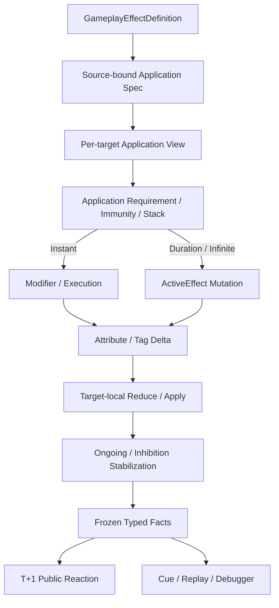

# EffectCommand / Spec-Delta-Fact 语义链 Spec

## 目的

定义 GameplayEffect Definition、Application Spec、Capture、Modifier/Execution、AttributeDelta 与 Typed Fact 的目标语义。这里的 Spec/Delta/Fact 是领域阶段，不要求建立全局 SpecStream 或事件总线。

物理 producer、merge、SystemGroup、Tick Scratch、Attribute Apply 与 Boundary Projection 分别引用 [03A](03-RuntimeCore管线/03A-执行域与数据流Spec.md)、[03C](03-RuntimeCore管线/03C-SystemGroup合约与核心数据形态Spec.md)、[03E](03-RuntimeCore管线/03E-EffectFanIn-State-Attribute-FactSpec.md)、[03F](03-RuntimeCore管线/03F-StructuralCommit与BoundaryProjectionSpec.md)、[03G](03-RuntimeCore管线/03G-Component矩阵-TickScratch-Job拓扑Spec.md)。本文不复制具体 Job/NativeContainer 调度。

## 领域链


```mermaid
flowchart TD
    Definition["GameplayEffectDefinition"] --> SourceSpec["Source-bound Application Spec"]
    SourceSpec --> TargetView["Per-target Application View"]
    TargetView --> Requirement["Application Requirement / Immunity / Stack"]
    Requirement -->|Instant| Execute["Modifier / Execution"]
    Requirement -->|Duration / Infinite| Active["ActiveEffect Mutation"]
    Execute --> Delta["Attribute / Tag Delta"]
    Active --> Delta
    Delta --> Apply["Target-local Reduce / Apply"]
    Apply --> Stable["Ongoing / Inhibition Stabilization"]
    Stable --> Fact["Frozen Typed Facts"]
    Fact --> Reaction["T+1 Public Reaction"]
    Fact --> Boundary["Cue / Replay / Debugger"]
```

## 核心对象

| 对象 | 身份与 owner | 生命周期 |
|---|---|---|
| GameplayEffectDefinition | DefinitionId + version/content hash；catalog owner | immutable catalog lifetime |
| Source-bound Application Spec | EffectSpecId；source Activation/Continuation 或 tick owner | tick-local，或由 Continuation 持有跨 tick payload |
| Per-target Application View | EffectApplicationId + TargetASC | 单次 target application |
| ActiveEffect | ActiveEffectHandle；TargetASC slab | duration/infinite 跨 tick |
| Modifier Contribution | ContributorId；TargetASC accumulator | owning Activation/ActiveEffect contribution lifetime |
| AttributeDelta | EffectApplicationId + AttributeId + stable order | current authoritative transaction |
| Typed Fact | CausalityId + frozen payload | reaction/boundary queue lifetime |

Instant、rejected application 与 stack merge 都必须有 EffectApplicationId；ActiveEffectHandle 只标识成功存活的 target-local slot。

## GameplayEffect Application Spec

### Source-bound 字段

- EffectSpecId
- DefinitionId、version/content hash、level
- SourceAscInstanceId
- source GrantedAbilityHandle / AbilityActivationHandle（可选审计引用）
- SetByCaller 与 dynamic magnitude inputs
- source captured tags
- Source Capture values/snapshots
- immutable EffectContext
- duration/period 与完整 StackTemporalContract identity/seed
- parent CausalityId 与 source sequence

Ability 可在 Commit 前持有只含 Definition/输入的 non-authoritative `SpecDraft`。成功 `AscOwnerCommandWave` CommitPlan 的同一线性化点才提升正式 EffectSpecId/EffectApplicationId并写 owner emitted-audit ref；随后 `SourceSpecProjection` 才建立可发射的 Source-bound Spec与Source Snapshot。失败 CanActivate/Commit不得留下权威 ID、audit ref、Source Snapshot或半初始化 Application Spec。period、aura、system等非 Ability source则在各自 canonical source-creation boundary建立 Spec，并显式记录 SourceKind；不能伪造 Ability Commit provenance。

### Per-target 字段

- EffectApplicationId
- TargetAscInstanceId
- TargetData slice
- stable target binding 与 binding generation
- target capture contract/slot（由 target writer 在 pre-application 填充）
- application requirement/immunity input 与 non-authoritative precheck evidence
- stack key/payload input 与 StackTemporalContract
- target-local deterministic order
- target writer 最终填写的 typed ApplicationOutcome/blocker provenance

同一 Source Spec fan-out 到多个目标时，不得把 TargetTags、Target Capture、stack result 或 application failure 写回共享 source value。每个 target view 必须独立；TargetResolve 只能建立 binding、TargetData 与 precheck evidence，不能提前写最终 capture/result。

### Per-target application 最终线性化

每条 `EffectApplicationId` 只在目标 ASC single-writer `TargetPrepare` overlay 的 canonical application order 中取得一次最终业务线性化点：

1. 读取该目标此前 application 已提交的 Attribute、OwnedTag、ActiveEffect、immunity 与 lifecycle 状态。
2. 建立 Target pre-application captured tags 与 CaptureProjection。
3. 重新执行完整 requirement/immunity/TargetLifePolicy；precheck 命中不能跳过，precheck 失败也只能作为提前拒绝证据而不能写 gameplay state。
4. 校验 WholeTickInfraAdmission 的 shadow/durable 双份 reservation token、完成 stack business policy 决策，再形成 Instant、ActiveEffect create/merge/overflow 或 typed rejection 的 `PreparedTargetDelta`；本阶段不得再因基础设施容量不足失败，也不得写 target durable state。

`ApplicationOutcome` 至少区分 `AppliedInstant / CreatedActive / MergedStack / OverflowApplied / RejectedRequirement / RejectedImmunity / RejectedTargetLife / RejectedStackPolicy / RejectedStaleBinding`。Immunity rejection 必须保留 blocker Definition、ActiveEffectHandle/ContributorId 与 matched requirement/tag provenance。失败不允许暴露 Target Capture dependency、slot、stack、Attribute、Cue 或 contributor 的部分 mutation。基础设施容量不足必须在任何 Owner/Target 权威写前形成 WholeTick `InfraAdmissionFault`，不是 per-target outcome。

所有 target Prepare 完成后先执行 `SessionFaultReduce`；任一 stabilization/identity/proof fatal 都丢弃本 Tick 全部 target capture/dependency/slot/Attribute/Grant/Fact/Cue/route/ECB shadow，v1 锁存 Session-fatal，但保留 OwnerWave 已提交的 cost/cooldown/activation source prefix。只有 reduce 成功后 TargetPublish 才使用预分配 range 无失败发布。requirement/immunity/life/stack typed rejection 是正常 prepared outcome，不触发跨 target rollback。

AutoChess 默认 `TargetLifePolicy=AliveOnly` 时，canonical 序列中首次 Death crossing 后的后续 application typed reject；致死 application 本身完成全部节点，后续拒绝的 damage/overkill/assist 为 0。Death 数值证据见 [03E-03](03-RuntimeCore管线/03E-EffectFanIn-State-Attribute-Fact/03E-03-AttributeReduceApplySpec.md)。

## EffectContext 与 Provenance

EffectContext 是不可变 gameplay provenance，不是托管对象或临时 pointer。至少保留：

| 字段 | 语义 |
|---|---|
| `SimulationEpoch` | 跨 world identity guard |
| `SourceAsc / TargetAsc` | effect source 与 target writer |
| `Owner / Avatar` | GAS owner 与当前表现/控制载体分离 |
| `Instigator` | 拥有/发起整条能力因果链的对象 |
| `EffectCauser` | 物理施加者，如武器/projectile/aura |
| `SourceObject` | 装备、物品或业务来源 |
| `AbilityDefinitionId / Level` | ability provenance |
| `EffectDefinitionId / Level` | effect provenance |
| `Origin / Hit / TargetData` | 空间与命中信息 |
| `EffectSpecId / EffectApplicationId` | spec 与每次应用身份 |
| `CausalityId / EmitTick / SemanticPhaseOrdinal / WorkClassOrdinal / SourceSequence` | 内容定义的确定序、trace 与环检测；不编码物理 Job/System |

Owner 不得与 Avatar 合并；Instigator 不得与 EffectCauser 合并。projectile/aura 晚于源 Activation 命中时，Entity 必须携带这份冻结 provenance，而不是只保存 ActivationHandle。

## Capture Definition

每个捕获声明必须生成：

```text
CaptureDefinition =
    AttributeId
    + CaptureSource(Source | Target)
    + CaptureMode(Snapshot | Live | PhaseSample)
    + CaptureProjectionContract
```

`Snapshot` 固定捕获边界的 Attribute Aggregator 语义；`Live` 建立依赖并随 captured accumulator revision 更新；`PhaseSample` 只在声明 phase 重新读取当前值，不能冒充 Live。

### Capture phase 边界

| CaptureSource / Mode | 正式相位 | 可见状态 |
|---|---|---|
| Source Snapshot | `SourceSpecProjection` | Ability source 的 per-plan shadow post-commit candidate：包含前序 CommitPlan、排除后序计划；仅在对应 Owner Commit 成功后密封。非 Ability source 使用 canonical spec-creation state |
| Target Snapshot | `TargetPreApplicationProjection` | 当前 target application 之前、同目标前序 application 已进入同一 TargetPrepare overlay 后的 canonical state |
| 同 ASC Live | `TargetPrepareStabilization` | 当前 target overlay 的 read-your-writes，反复重算至稳定 |
| 跨 ASC Live | `CrossAscDirtyDelivery` | source revision 于 T 改变，destination 于 T+1 按稳定序消费；不能冒充 same-tick Live |
| PhaseSample | Definition 声明的唯一 phase | 该 phase 当前值；不登记依赖 |

Capture phase 是语义组成部分，不是 profiler label。生成器必须拒绝“Source Snapshot 在 CanActivate/Commit 前捕获”“Target Snapshot 在 TargetResolve 预写”或“跨 ASC 随机读取当前值却标记 Live”的 Definition。

## CaptureProjectionContract

仅用 `ProjectionKind = Scalar/Aggregator` 不足以证明语义。生成期必须同时声明三轴：

### 1. ValueView

```text
Base
Final
Bonus
ToChannel(channel)
Contribution(contributor)
ModList
```

### 2. EvaluationBinding

```text
FrozenAtCapture
LateSpecSourceTags
LateSpecTargetTags
LateAppliedSourceFilter
LateAppliedTargetFilter
LateIgnoreSet
LateAlternateBase
```

这些是 flags；一个捕获可有多个 late-bound 输入。

### 3. Lifetime

```text
OneShot
PeriodicReevaluate
LiveDependency
```

生成器据此产生强类型 accessor。Runtime Calculation 只能访问契约声明的视图与 evaluator inputs；通用“运行时任意查询完整 Aggregator”的接口不属于 v1。

## ScalarSnapshot 严格证明

### 可直接引用的规范措辞

> ScalarSnapshot 只有在生成器能证明所请求数值在捕获边界已经唯一确定时才合法。“Calculation 最终返回 float”不构成证明。只要 Source/Target tags、Applied filters、Ignore set、alternate base、channel/contribution 选择或周期重评估中的任一输入在捕获后绑定，就必须保存足以重新评估的 AggregatorSnapshot，或由 bake 明确拒绝该定义。

### 合法条件

ScalarSnapshot 只允许：

1. `ValueView=Base`；或
2. `ValueView=Final` 且 `EvaluationBinding=FrozenAtCapture`、`Lifetime=OneShot`，所有 contributor qualifier/filter/ignore 输入已冻结；
3. 生成 accessor 不暴露 Bonus/Channel/Contribution/ModList/alternate-base 查询；
4. Definition/Calculation 是闭世界生成物，不存在反射、动态 capture id 或 arbitrary evaluator params。

### 必须升级 AggregatorSnapshot 的典型情况

- Source Snapshot 在 Spec 创建时捕获，但 TargetTags 到 apply/execute 时才绑定。
- contributor 带 Source/Target tag requirements。
- Calculation 使用 AppliedSource/Target filter。
- Calculation 可忽略指定 Contributor/ActiveEffect。
- 查询 Bonus、ToChannel、Contribution 或 ModList。
- periodic execution 会重新捕获 TargetTags。
- 自定义 execution 在运行时改变 evaluator inputs。

无法静态证明时必须保守选择 AggregatorSnapshot；不能以性能理由静默压成 scalar。

## Normalized AggregatorSnapshot

目标态不复制 UE Aggregator 的指针、delegate 和 dirty 状态，而是保存闭合投影所需的规范化数据。

### 不可省头部

| 字段 | 目的 |
|---|---|
| `CapturedAttributeId` | 捕获属性身份 |
| `CaptureSource` | Source/Target 语义 |
| `CapturedAscInstanceId` | 捕获 owner |
| `CaptureTick / CapturePhase / AttributeRevision` | 捕获边界与诊断 |
| `BaseValue` | Final/Bonus/Channel 计算起点 |
| `AggregationPolicyId / FormulaVersion` | 固定公式可由 Runtime version 隐含；可变公式必须显式 |

### 每个 contribution 不可省字段

| 字段 | 目的 |
|---|---|
| `ContributorId` | Contribution/Ignore/精确 provenance |
| `ModifierOp` | Add/Multiply/Divide/Override 等 |
| `Channel` | channel/depth 顺序 |
| `EffectiveMagnitude` | 捕获时已解析并考虑 stack 的 magnitude |
| `OrderKey` | 保留定义好的应用/插入顺序，尤其是首个合格 Override |
| `SourceTagRequirementId` | 用晚绑定 Spec SourceTags 重算 qualifier |
| `TargetTagRequirementId` | 用晚绑定 Spec TargetTags 重算 qualifier |

### 按契约条件保存

- AppliedSource/TargetFilter 需要 contributor 捕获时的 source/target tag provenance。
- Contribution/Ignore 需要稳定 ContributorId。
- ToChannel 需要 channel；若生成期可证明只读至某 channel，可裁掉其后 channel。
- ModList 需要 modifier ordinal/debug provenance。
- alternate base 不改变 snapshot Base，但 accessor 必须声明该能力。

Spec 的 late-bound SourceTags/TargetTags 可以保存在 per-target Application View，而非重复进每份 snapshot；但 evaluator 必须能取得与 CaptureProjectionContract 匹配的冻结/晚绑定输入。

### 可以省略

- 临时 `IsQualified`：每次评估重算。
- dirty/dependent list、NetUpdateId、UE global handle map。
- UObject/requirement pointer；用 Definition/Requirement id 替代。
- 原始 stack count；若 EffectiveMagnitude 已规范化且 Calculation 未声明 stack introspection。
- Prediction flag 与 IncludePredictiveMods。

稳定排序不能随意按 ContributorId 重排。OrderKey 必须重现项目定义的 contribution 顺序，例如：

```text
(Channel, ModifierOp, EffectApplicationSequence, ModifierOrdinal)
```

Override 返回该顺序中首个 qualified contributor；加乘除的浮点累积也使用固定顺序。

## Generated Capture Accessor 门禁

生成器必须为每个 CaptureDefinition 产生只能执行声明操作的 accessor，并在 bake/CI 拒绝：

- 动态 Attribute/CaptureDefinition 选择。
- 未声明的 Bonus/Channel/Contribution/ModList 查询。
- 未声明的 late tags/filter/ignore/alternate-base 输入。
- arbitrary full-Aggregator access。
- Snapshot Calculation 请求 Live revision。
- Source Live 跨 ASC 但项目未启用跨 ASC dependency。
- Prediction evaluator input。

字段裁剪应按实际 contract field mask 进行，而不只是“复制整个 Aggregator”与“一个 float”二选一。

## Live Capture

### Binding

```text
LiveCaptureBinding =
    CapturedAscInstanceId
    + AttributeId
    + ProjectionContractId
    + CaptureOrdinal
    + ConsumerNodeId
    + ConsumerFieldId
    + LastSeenRevision
    + DependentActiveEffectHandle
    + SourceGonePolicy
    + EdgeOrdinal
    + CyclePolicyId / PropagationBudgetClass
```

`CaptureOrdinal + ConsumerNodeId + ConsumerFieldId` 使同一 ActiveEffect 对同一 source attribute 的多个计算字段分别可寻址；不得只按 `(AttributeId, ActiveEffectHandle)` 去重。`SourceGonePolicy` 必须是 Definition 声明的 remove-dependent、freeze-last-value、typed failure 等策略之一，禁止隐式 fallback self、0 或 target current value。

跨 ASC route 传递的是冻结投影值，不是“请 destination 下 Tick 再读取 source 当前状态”的裸 dirty flag：

```text
LiveDirtyPayload =
    SimulationEpoch + DeliverTick
    + CapturedAscHandle + AttributeId + ProjectionContractId
    + DestinationAscHandle + DependentActiveEffectHandle
    + CaptureOrdinal + ConsumerNodeId + ConsumerFieldId
    + SourceRevision
    + FrozenProjectionKind
    + FrozenScalarOrAggregatorSnapshotRange
    + ProjectionPayloadHash
    + EdgeOrdinal + CausalityId
```

source ASC 必须在同一 revision 线性化点原子建立 `{SourceRevision, FrozenProjection, ProjectionPayloadHash}`；Scalar 与 normalized AggregatorSnapshot 都必须满足对应 ProjectionContract。payload range 在 destination Ack、stale terminal 或 cleanup Ack 前不可复用，Generation/Kind/Owner 任一不匹配即拒绝。

### 同 ASC

captured accumulator revision 变化后，将 dependent ActiveEffect/consumer field 标记 dirty；target ASC writer 在 `TargetLocalStabilization` 使用同一 ProjectionContract 与 canonical read-your-writes 重算 modifier magnitude，并精确替换该字段拥有的旧 contributions。

### 跨 ASC

Source Live Capture 可能从 source ASC 指向 target ASC 的 ActiveEffect。支持它必须具备：

1. captured/source ASC 保存 dependency edge与生成期 ProjectionContract/route 上界。
2. source revision 在 T 变化后冻结上述 `LiveDirtyPayload` 并发出 dirty command，`DeliverTick = T + 1`；destination 不跨 ASC 读取 source accumulator。
3. target ASC writer 校验 DependentActiveEffectHandle Generation。
4. destination 在同 tick 语义序上先消费 dirty，再 claim/execute `PeriodDue`；目标仅用 payload 中与 revision 原子配对的冻结投影重算自己的 accumulator。
5. source gone 按 SourceGonePolicy 处理；ActiveEffect remove/tombstone 时双向清理 edge。
6. Ack/cleanup 晚到时校验 binding/handle/payload range Generation，不能命中新 slot。

同一 DeliverTick 允许 coalesce，但 canonical key 必须完整为 `(DestinationAscHandle, DependentActiveEffectHandle, CapturedAscHandle, AttributeId, ProjectionContractId, CaptureOrdinal, ConsumerNodeId, ConsumerFieldId, DeliverTick)`；每个 consumer field 独立保留。winner 取最大 `SourceRevision`，同 revision 的 payload hash 不同是 deterministic identity fault；revision/hash 必须作为一个整体替换，禁止留下“新 revision + 旧 value”。低于或等于 `LastSeenRevision` 的晚到 command 只产生 stale diagnostic。

[25](25-配置语义编译契约与CapacityProof统一裁决Spec.md) 必须为每个 Definition 输出 `MaxProjectionBytes`、`MaxCrossAscLiveFanout`、`MaxLiveDirtyCommandsPerTick`、`MaxCoalescedDirtyPerTarget` 与 route/payload/ack cleanup work；WholeTick admission 同时预留 shadow route 和 durable dependency/payload credit。任一证明缺失或运行时 N+1 都不得静默丢 dirty：配置 publish fail，或在 OwnerWave 前形成 Session-fatal admission failure。

若任一环节未实现，Definition 必须 bake fail。仅在目标 phase 读取 source 当前 scalar 是 `PhaseSample`，不是 Live Capture。

### 环与收敛

同 ASC Live dependency 纳入 target-local stabilization。跨 ASC dependency 可能形成运行时环；v1 不提供全局 same-tick wave/SCC 时，必须在 bake 拒绝静态 cycle，并在运行时检测重复 CausalityId/edge、source churn 与传播预算超限，禁止无限次 next-tick dirty ping-pong。SourceGonePolicy 可以产生声明的 typed removal/freeze；cycle、identity 或 proof budget breach 是 Session-fatal，并遵守 TargetPrepare 全 shadow discard，不能提交一半 consumer 字段。

## Attribute / Modifier 语义

1. Attribute 同时保留 Base 与 Current/Final。
2. Instant modifier/execution 修改 Base，并在同一事务内执行 clamp/meta-to-real 规则。
3. Duration non-period modifier 以 ContributorId 进入 accumulator，只影响 Current/Final；remove/inhibit 精确撤销。
4. Periodic Effect 到期时执行一次新的 application/execution，通常修改 Base，不把 period modifier永久留在 accumulator。
5. Aggregation 依次处理 channel；Override、Add/Multiply/Divide 的顺序和公式由 FormulaVersion 固定。
6. Calculation/Execution 只输出显式 Modifier/Delta/Effect application，不在托管 callback 内直接写 Attribute。

## Application、Execution 与 DirectEffect

Application requirement、immunity、target capture、stack、modifier execution、attribute execute/clamp 与 ongoing/inhibition 稳定化属于同 tick TargetPrepare overlay invariant。普通 self-target GE 仍在 TargetPrepare/Publish 执行，不对同一 AscOwnerCommandWave 中后续 CanActivate 提供同步 read-your-writes；依赖这种反馈的 Definition 必须 bake fail，或将所需状态改写为 source-local CommitPlan/activation-owned invariant。Cost/Cooldown 专用 owner-local contract 的支持矩阵、固定诊断码与 CapacityProof 只引用 [25](25-配置语义编译契约与CapacityProof统一裁决Spec.md)，普通 GE 字段不得在此处被再次压平为第二份矩阵。

duration/period/stack 字段必须引用完整 `StackTemporalContract`：StackKey、StackPayload、DurationRefresh、PeriodReset、ExecuteOnApply、AtLimit/Overflow/Clear、Expiration、FinalPeriod、InhibitResume 与 StackCue policy。异质毒层若需要逐 application magnitude/source/expiry，必须声明并持有 per-entry ledger；只有同质 `payload × StackCount` 才能使用 count-only slot。完整生命周期 owner 见 [05](05-ActiveEffectStoreSpec.md) 与 [03E-02](03-RuntimeCore管线/03E-EffectFanIn-State-Attribute-Fact/03E-02-StateEvaluateActiveEffectStoreSpec.md)。

Execution 生成的 definition-local conditional effect 可以 same-tick 继续执行，但必须属于生成期闭合、可完全展开、有限且静态有界的 pre-apply DAG：

- 固定 Definition edge 与 edge ordinal
- 无动态 effect 选择
- 无 Event/Task/Ability recursion
- 固定拓扑序与最大展开数
- 不读取本 tick post-apply fact；节点数和最大输出数均可静态定界
- 仅无环不构成放行条件，指数展开同样拒绝
- 默认同 target ASC

ExecuteOnApplyPolicy 可以让当前 application 在本 target transaction 执行一次自身 period body；该 body 本身属于当前 application，可经 target single writer 产生本次 delta/fact。只有该 body或运行时 apply、overflow、period、reaction **动态派生的 child application** 不属于静态闭合 DAG，默认 `DueTick = CurrentTick + 1`。

公开 GameplayEvent、OwnedTag trigger、Continuation wakeup 与跨 ASC reaction 仍遵守 [01B](01B-GAS业务语义链路概念设计Spec.md) 的 stable-state deferred reaction，在下一 tick 投递。

### Activation emission ownership

Activation 的 `EmittedApplicationRefs` 在成功 Owner Commit 时按每个 planned target 写入 `TargetAscHandle + EffectApplicationId + RefKind + RetentionState + Generation`，记录 application attempt。`RefKind` 只分为 `AuditOnly` 与拥有 `RemoveOnActivationEnd` 权利的 `CleanupRight`；TargetPrepare/Publish outcome 与 ActiveEffectHandle 仍由 target ledger/Fact 关联，不允许 target Job 跨 ASC 直接回写 owner ref。普通 GE 成功应用后由 target application/ActiveEffect 生命周期拥有，不随 Activation End 删除。只有 Definition 明确声明 `RemoveOnActivationEnd` 时：

- application 尚未线性化：以原 EffectApplicationId 执行 cancel-before-apply，结果仍可审计；
- application 已线性化：只撤销该 EffectApplicationId/ContributorId 精确拥有的结果；
- application 已合并进 shared stack：必须存在逐 application payload/contributor/removal ledger；否则 Definition bake fail。

retention 与释放由 owner ASC 单 writer 处理：

- `AuditOnly`：target 以 `EffectApplicationId` 经 T+1 PendingCommand 返回强类型 terminal ApplicationOutcome Ack；当 attempt/outcome 已进入 Boundary receipt 保护的 audit handoff watermark 后释放 owner 热槽。完整审计记录的后续 retention 属于 Session/Boundary，不得继续占用 Activation slab。
- `CleanupRight`：Activation End 前保持权利；End 时生成 cancel-before-apply 或精确 remove work。只有 target 返回 cleanup terminal Ack，或以 ledger 证明 application 已 Rejected/自然 terminal 且无可撤销贡献后，才释放。
- `ApplicationTerminalAck` 至少携带 `SimulationEpoch、OwnerRefHandle/Generation、EffectApplicationId、OutcomeKind、CleanupTerminal、TargetLedgerGeneration、AckOrdinal`。late/duplicate Ack 只可 stale no-op；不能命中复用 ref。
- Session fatal 发生在 Owner Commit 后、TargetPublish 前时，由 fault audit 以 `CommittedPrefixHash + EffectApplicationId range/hash` 终结 AuditOnly；CleanupRight 由 Terminalizing cleanup/ack 链终结。禁止因为 target 没发布 outcome 就静默丢 ref。
- [25](25-配置语义编译契约与CapacityProof统一裁决Spec.md) 必须提供 per Definition/Activation/ASC 的 ref、pending Ack、retention watermark/duration 与 cleanup work 上界；admission 在 Commit 前预留，N+1 为 Session-fatal，禁止静默淘汰。

Activation 自身的 `OwnedContributionRanges` 是 source-local CommitPlan 产物，与上述普通 GE/application refs 分离。

## Typed Fact

Typed Fact 至少保留：

- EffectSpecId / EffectApplicationId
- ActiveEffectHandle（若存在）
- ContributorId（若相关）
- Source/Target ASC
- DefinitionId/version
- Context/TargetData snapshot
- Attribute mutation 的 RequestedDelta、PreClamp Base/Current、UnclampedResult、PostClamp Base/Current、EffectiveDelta 与 DeathTransitionId（若相关）
- old/new Tag count 或 stack/inhibition transition
- CausalityId、emit tick、SemanticPhaseOrdinal、WorkClassOrdinal、source sequence
- typed ApplicationOutcome、immunity blocker provenance、failure/removal reason

AttributeMutationFact 与首次 Death crossing 的唯一详细 owner 是 [03E-03](03-RuntimeCore管线/03E-EffectFanIn-State-Attribute-Fact/03E-03-AttributeReduceApplySpec.md)。Fact 是 Reaction 与 Boundary 的共同证据源，但两者消费不同投影；Boundary fact 不反向成为 gameplay 输入。

## 非预测 v1

Spec、Capture、AggregatorSnapshot、Modifier、ActiveEffect mutation 与 Fact schema 不得包含 PredictionKey、PredictionMode、IsPredicted、IncludePredictiveMods、reject/caught-up、prediction overlay 或 redo suppression。`CausalityId` 不是 PredictionId。

未来 Prediction/Replication 必须作为独立 correlation/reconciliation layer 增加，不能改变 v1 EffectApplicationId、ContributorId 或 ActiveEffectHandle 的含义。

## 失败模型

| 失败 | 结果 |
|---|---|
| ScalarSnapshot 无法完成静态证明 | bake fail 或升级 AggregatorSnapshot |
| Calculation 请求未声明视图 | generate/bake fail |
| Snapshot 缺 late-bound qualifier provenance | validation fail，不允许运行时默认 true/false |
| Cross-ASC Live 未支持 | Definition bake fail |
| stale DependentActiveEffectHandle | dirty command deterministic no-op + diagnostics |
| dependency cycle/预算超限 | 显式 deterministic failure，不提交半重算结果 |
| Target ASC/epoch 不存在 | application rejected，保留 ApplicationId fact |
| WholeTick infrastructure capacity 不足 | `InfraAdmissionFault`；预排的 Owner/Target 下游 Job 读取 `AdmissionResult` 后 no-op，gameplay 零写，仅 FaultLatch 写 Session 控制证据 |
| TargetResolve precheck 与最终状态不同 | 目标 writer 重新评估，以最终 typed ApplicationOutcome 为准 |
| Immunity block | `RejectedImmunity`，保留 blocker Definition/handle/contributor/requirement provenance |
| 异质 stack payload/expiry 无逐 application ledger | Definition bake fail |
| RemoveOnActivationEnd 合并进无 ledger 的 shared stack | Definition bake fail |
| Source Snapshot 请求早于成功 Commit | 只允许无权威 identity/capture 的 SpecDraft；捕获请求 generate/bake fail |
| DirectEffect graph 有环/动态边 | publish/bake fail |

## 验收矩阵

| 场景 | 预期 |
|---|---|
| Base-only Snapshot | 使用 ScalarSnapshot，与捕获时 Base 相同 |
| Final + 全输入冻结 | 允许 ScalarSnapshot；生成 accessor 不能升级查询 |
| Final + late TargetTags | 必须 AggregatorSnapshot |
| Bonus/ToChannel | Base、channel、contribution 顺序结果正确 |
| AppliedSource/TargetFilter | 使用冻结 contributor provenance |
| Contribution/Ignore | 按 ContributorId 精确选择/排除 |
| Override 多候选 | 返回 OrderKey 最前的 qualified Override |
| source snapshot 后 source 改变 | snapshot 结果不变 |
| Ability Commit 失败 | 可丢弃 SpecDraft；不创建权威 EffectSpecId/ApplicationId、EmittedApplicationRef或SourceSpecProjection，无 Source Snapshot 残留 |
| 同 target 前序 application 改变 requirement/immunity | 后序在最终线性化点读取 canonical read-your-writes 并给出 typed outcome |
| TargetResolve precheck 过期 | 不预写结果；target writer 重新 capture/evaluate |
| Immunity rejection | blocker Definition/handle/contributor/匹配规则可审计 |
| periodic 重捕 TargetTags | 当前 execute 使用最新声明 phase 的 TargetTags |
| 同 ASC Live | revision 变化后 dependent magnitude 更新 |
| 跨 ASC Live | T revision 与 FrozenProjection 原子配对 → T+1 destination dirty；按完整 consumer-field key coalesce，dirty 先于 PeriodDue |
| Live source gone/cycle/budget | SourceGonePolicy 显式处理；cycle/identity/proof breach Session-fatal，不 fallback self/0/target |
| Live effect remove | dependency 双向清理，晚到 dirty 不命中新 slot |
| 同一 Spec 多目标 | target captures/requirements/stack 互不污染 |
| Instant/stack/reject | 均有独立 EffectApplicationId |
| 异质毒 stack | 逐 application magnitude/source/expiry ledger；count-only 定义 bake fail |
| RemoveOnActivationEnd | 未 apply 则 cancel；已 apply 精确撤销；shared stack 无 ledger bake fail |
| EmittedRef retention | AuditOnly 在 terminal Ack + audit handoff 后释放；CleanupRight 在 cleanup terminal Ack 后释放；N+1 admission fault，不静默淘汰 |
| TargetPrepare fatal | 任一 target fatal 时全部 target shadow/intents 丢弃，Owner committed prefix 保留；TargetPublish 不运行 |
| Duration modifier remove | 仅撤销对应 ContributorId，Current 恢复 |
| Death 后 AliveOnly application | typed reject，damage/overkill/assist 为 0；致死 application 自身完整完成 |
| DirectEffect DAG | 同 tick 固定拓扑执行；非闭合、非静态有界、环/动态边或 post-apply feedback 被拒绝 |
| Public reaction | 发射 tick 不重入，下一 tick 使用冻结 fact |
| Schema inspection | 不存在 Prediction 字段与任意 full-Aggregator Runtime API |

## 不变量

1. Definition、Application Spec 与 ActiveEffect 必须分离。
2. Source-bound Spec 与 per-target Application View 必须分离。
3. EffectApplicationId 在 instant、stack merge、reject 路径均不丢失。
4. ScalarSnapshot 必须有生成期证明；最终输出类型是 float 不构成证明。
5. AggregatorSnapshot 只裁剪未声明能力，不能丢失未来评估所需 qualifier/provenance/order。
6. PhaseSample 不得标记为 Live。
7. Source Snapshot 在成功 Commit 后创建；Target Snapshot 在每条 application 的最终 pre-application 线性化点创建。
8. TargetResolve 不拥有 application outcome；TargetPrepare writer 的完整 requirement/immunity/capture/stack/life 评估形成 prepared result，`SessionFaultReduce` 成功后才发布。
9. 任一 target fatal 必须丢弃全部 target shadow/intents；OwnerWave committed prefix 不回滚，FaultCandidate/CommittedPrefixHash 不随 worker/batch 变化。
10. 跨 ASC Live 要么以原子 `{Revision,FrozenProjection}`、完整 consumer-field coalesce key、generation、cleanup、source-gone/cycle/budget 闭环支持，要么 bake fail。
11. EmittedRef 必须区分 AuditOnly/CleanupRight，具有 terminal Ack、handoff watermark 与硬上界；不得绑定 Activation 寿命无界保留。
12. StackTemporalContract 必须完整；异质 payload/expiry 与 RemoveOnActivationEnd shared stack 必须有逐 application ledger。
13. Attribute Base/Current、unclamped/effective delta、首次 Death crossing 与 contributor 精确撤销语义必须保留。
14. Public reaction 默认下一 tick；kernel invariant/DirectEffect 才可 same-tick。
15. v1 schema 不包含 Prediction 占位。
