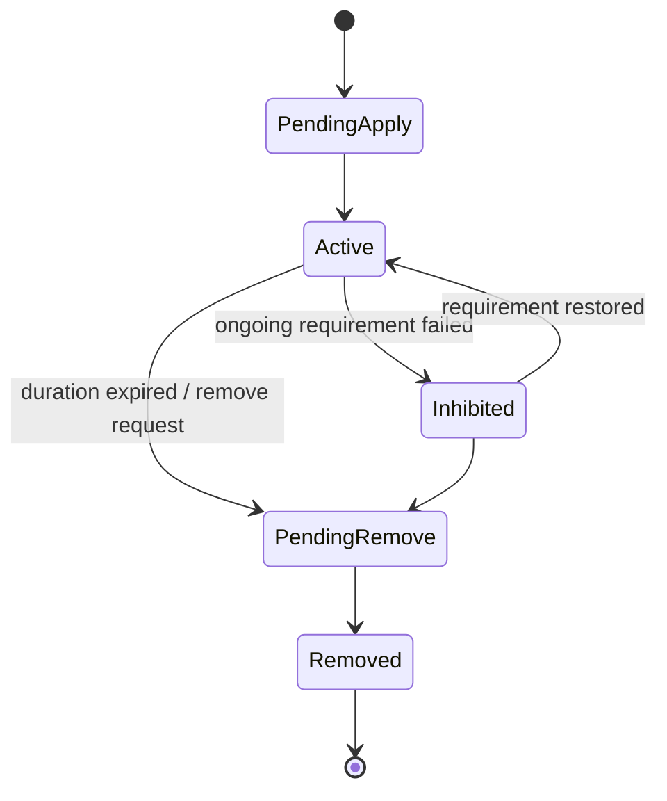

# Active Effect Store Spec

## 目的

定义 duration、stack、period、granted tag、granted ability 等跨帧状态的目标存储方式。

## 状态图



## 核心契约

1. Active effect store 只承载跨帧状态。
2. Period / Overflow 只派生 EffectCommand，不直接写 Attribute。
3. Granted tag / ability 必须有明确 owner 和 cleanup path。
4. StackCount 影响 magnitude 时，必须通过 spec/active mutation 同步。

## Unity Entities 存储校准

ActiveEffectStore 的目标不是“把每个 active effect 都实体化”，而是用 Unity Entities 机制表达跨帧状态：

| 状态类型 | 推荐承载 | 说明 |
|---|---|---|
| active effect slot | ASC entity 上的 DynamicBuffer slot / stable child entity | 高频读写优先稳定布局 |
| inhibited / ready / expired | `IEnableableComponent` 或 slot state flag | 频繁开关不触发 archetype 迁移 |
| period due | enableable marker / frame command | 到期时派生 `EffectCommand` |
| stack count / remaining time | unmanaged component / buffer element | 不混入 definition |
| granted tag / granted ability owner | owner id + cleanup command | cleanup 进入 structural playback phase |

结构变化只允许发生在明确 lifecycle 边界，例如首次创建 owner state、最终 cleanup、grant ability 等；普通 tick / inhibited 切换 / period due 不应 add / remove component。

## DOTS 深读后的 Store 分层

ActiveEffectStore 不再讨论“buffer 还是 entity”二选一，而是拆成四个可组合存储面：

| Store 面 | 职责 | 候选 API | 适用判断 | 必须指标 |
|---|---|---|---|---|
| OwnerLocalStore | ASC owner 上少量 active effect slot、stack、remaining time、owner-local period | ASC `DynamicBuffer` slot、small unmanaged component、FixedList-like generated small state | 每 owner active effect 数量可控、主要按 owner 顺序处理 | slot count、capacity、spill、compact count |
| GlobalIndexedStore | 需要跨 owner 查询、统一 period bucket、全局生命周期扫描的 active effect | stable active effect entity、chunk component bucket、shared low-frequency group | effect 数量大或跨 owner query 多，且创建/销毁是低频边界 | active entity count、archetype count、chunk utilization |
| LifecycleCleanupStore | owner destroyed / effect removed 后仍需释放 granted tag / ability / cue / spawned bundle | Cleanup Component、Cleanup Shared Component、LinkedEntityGroup boundary | destroy 后仍需上下文；同类清理信息可共享 | cleanup retained count、cleanup latency、shared unique value |
| ChunkSkipIndex | 大量 idle / not due / inhibited effect 的 chunk 级跳过索引 | Chunk Component、enableable mask、`IJobChunk` precheck、change version | 可按 chunk 判断整批无需处理 | matched chunks、skipped chunks、unused entities、skip reason |

执行含义：

1. `OwnerLocalStore` 的 DynamicBuffer 必须明确 `InternalBufferCapacity`。超过 capacity 外置后不会自动回到 chunk，若 active effect 数量波动大，应考虑 stable entity 或 `InternalBufferCapacity(0)`。**当 `InternalBufferCapacity(0)` 时**：spill 监控改为 "total external buffer element count"（非百分比），告警阈值：> 32 slots → 考虑 GlobalIndexedStore，> 64 slots → 架构告警。此约束与 `13-EntityComponent物理布局Spec.md` 行255-258 的 buffer 容量策略一致。
2. `GlobalIndexedStore` 不是“每 tick 创建 GE entity”。它只适合生命周期稳定、需要全局 query 的 effect；period due / inhibited / ready 不通过 add/remove component 表达。
3. `CleanupStore` 只处理 destroy 后清理，不替代 Active 生命周期状态机；cleanup component 不能 baked 到 definition。
4. `ChunkSkipIndex` 的目标是让 idle effect 在 chunk 级跳过，而不是给每个 entity 重复写相同 fact。
5. 状态机选择顺序：enableable 适合高频开关；enum / bit field 适合状态多且同 job 轻分支；tag / archetype 只适合低频且数据差异大的生命周期阶段。
6. **`FSM-04`：单 entity 上多 FSM 叠加时拆分 Job，而非拆分 Entity。** ASC entity 的 `ActiveGameplayEffectBuffer` buffer 同时承载多套独立 FSM（inhibit/tick/expire、stack push/pop、grant tag/ability cleanup 等）。`FSM-04` 的官方判断标准是：**同一 entity 上 > 3 个独立的生命期决策，且各决策依赖不同的 component 读取集**。`ActiveGameplayEffectBuffer` 完全命中这个条件。

   **修正策略 —— 按 FSM 职责拆分 Job（不增加 Archetype）：**
   ```
   Job A: Duration lifecycle FSM（读 RemainingDuration，写 State/Flags）
   Job B: Period cursor FSM（读 PeriodAccumulator，写 PeriodDueTag）
   Job C: Stack overflow check（读 StackCount，写 ActiveEffectMutationBuffer）
   Job D: Granted tag/ability cleanup（读 Flags.PendingRemove，写 ECB）

   Job 依赖链：
   A → B（Inhibited 状态不应 tick period）
   A → D（需要知道哪些 effect 进入 PendingRemove）
   C 与 A 并行（不依赖 duration state）
   ```

   **不拆分 Entity 的原因**：拆分为独立 Entity 会增加 archetype 数量和 entity 数量，与 Archetype < 10 目标矛盾。拆分 Job 保持同一 Entity/Archetype，仅通过 Job 依赖链管理 FSM 间的数据依赖。每个 Job 只读写自己关心的字段，依赖链清晰，可独立 Profile。

## ActiveEffectStore API 选型矩阵

ActiveEffectStore 不能预设为“每个 active effect 一个 entity”或“全部塞进 ASC buffer”。AM5 每个小闭环前都必须按状态类型选型：

| 候选承载 | 适用 | 风险 | 验收指标 |
|---|---|---|---|
| ASC `DynamicBuffer` slot | 每个 ASC active effect 数量有限、按 owner 顺序批处理 | buffer spill、slot compact、并行写冲突 | slot count、capacity、spill、compact count |
| stable active effect entity | 每个 effect 状态复杂、需要独立 query / timer / stack | entity 数量增加、query 数增加、生命周期 cleanup | active entity count、archetype count、query match |
| enableable marker | inhibited、period due、ready 等高频开关 | query enabled state 成本、状态语义不足 | enabled count、ignore-filter count |
| enum state / bit field | 状态很多但每状态工作轻、适合同一 job 分支 | 分支影响 vectorization、可读性下降 | branch distribution、job cost |
| Cleanup Component | owner destroy 后仍需释放 granted tag / ability / cue | cleanup 生命周期必须明确移除 | cleanup retained count、cleanup latency |
| Chunk Component / chunk counters | 大量 idle/no-op effect 可整体跳过 | 只适合 per-chunk 优化事实，不替代 per-entity state | chunk skip count、matched chunk reduction |
| LinkedEntityGroup | prefab-like group、表现/authoring 组合实例化和销毁 | 不进入 Core hot path 决策 | group instantiate/destroy count |

### `CASE-37` LinkedEntityGroup 在 ASC→Ability Entity 生命周期中的应用

**评估结论**：`LinkedEntityGroup` 适合用于 ASC → Ability Entity 的**生命周期级联销毁**，但不适合用于**迭代顺序依赖**的场景。

**适用场景 —— ASC Entity 销毁时的级联清理：**
- 当 ASC Entity 被销毁时，其所有 Ability Entity 也应当被销毁
- 使用 `LinkedEntityGroup` 后，`EntityManager.DestroyEntity(ascEntity)` 自动级联销毁所有 Ability Entity
- 替代当前需要 `SAscDestroyRequest` System 手动查找并销毁的 O(N_abilities_global) 操作

**不适用场景：**
- 需要按特定顺序逐 Ability Entity 执行清理逻辑（如先 revoke 后 destroy）
- `PRF-31`：Child Buffer 迭代顺序不保证确定，不应依赖 sibling index 做排序

**当前状态**：Spec 已在 "不进入 Core hot path 决策" 中提及 `LinkedEntityGroup`。目标态建议在 ASC Entity 创建时将 Ability Entity 加入 `LinkedEntityGroup`，销毁时利用级联机制减少手动清理代码。此选项应在 Structural Playback phase 中实现，不影响 hot path 性能。

AM5 验收必须能证明：普通 tick、period due、inhibit 切换不触发 archetype churn；grant/remove/cleanup 进入 structural playback；Debugger 能解释 slot pressure、enabled state、cleanup 和 chunk skip。

## AM5 第一落点约束

当前允许的第一落点是 `OwnerLocalStore`：ASC owner 持有 `ASCActiveEffectsComponent` 和 `ActiveGameplayEffectBuffer`，用 slot 镜像 duration active effect 的跨帧状态。该落点是 migration proof，不是完整目标态终局。

约束：

1. Store 创建只发生在 ASC factory / bootstrap 等低频结构阶段；helper 在 hot path 发现缺少 store 时必须返回失败，不允许隐式 add component / add buffer。
2. Slot 可以记录 `Active / Inhibited / PendingRemove` 等 enum state、duration、remaining、period cursor、stack count、source / target / context 和 legacy entity 引用。
3. `LegacyEntityBacked` flag 表示该 slot 仍由旧 runtime GE entity 生命周期驱动；它不是 active effect entity lifecycle 已迁移完成的证明。
4. Slot buffer 不能把逻辑上限直接等同为 chunk 内联容量；heavy slot element 应使用小 `InternalBufferCapacity`，逻辑上限通过 store helper / validation gate 控制。
5. `BGameplayEffect`、runtime GE entity、granted tag / ability cleanup path 在第一落点仍可保留；period due / overflow simple instant 派生命令已进入 EffectCommand proof 主链，后续应继续迁移复杂 active child GE、granted cleanup 和 store-driven lifecycle。
6. Debugger 必须输出 slot pressure、state distribution、legacy-backed count 和 DynamicBuffer externalized owner count，避免把 slot mirror 误判为 scale-ready store；compact count、cleanup retained count 和 chunk skip count 随后续 store lifecycle / cleanup / chunk index 引入后补齐。

## AM5 Period / Overflow 派生输出落点

当前 period / overflow 的 simple instant child GE 已作为 ActiveEffectStore 的派生输出 proof：

1. period due 时，旧 duration runtime GE 仍负责到期判断，但 simple instant child GE 不再默认创建 request/runtime child entity，而是写入 `GEEffectCommandBuffer(Source=Period)`。
2. stack overflow 派生 simple instant child GE 同样写入 `GEEffectCommandBuffer(Source=Overflow)`；复杂 child GE 保持旧 request fallback。
3. 派生命令复制 child GE runtime buffer 上的 SetByCaller values，保持 command/spec/delta/fact 的 magnitude 输入连续性。
4. `GEPeriodStateComponent.StartTime` 与 owner-local `ActiveGameplayEffectBuffer.LastPeriodFrame` 必须同步刷新；store cursor 是后续 store-driven lifecycle 和 Debugger 证据的一部分。
5. 该落点仍是 `OwnerLocalStore + singleton command stream` proof，不是完整 scale-ready store；granted cleanup、slot compact、chunk skip、复杂 child GE 和真实 parallel fan-in 仍是后续 AM5 / AM3 缺口。

## 禁止方向

1. active effect 直接持有子 effect runtime entity。
2. 把 instant GE 和 duration GE 都塞进同一重 lifecycle。
3. 把 definition 字段和 runtime timer / stack state 混写。
4. 用 add / remove component 表达每帧 inhibited、period due、ready 等高频状态切换。
5. 不定义 DynamicBuffer 容量、清空策略和 buffer pressure 计数就把 ActiveEffectStore 作为高规模目标结构。
6. 未复核 Cleanup Component、Chunk Component、enum state、stable entity 等候选 API 就固定单一存储形态。
## 历史方案定位

1. GameplayEffectConfigBlob 中 Duration / Period / Stack 字段的设计信号来自 `../历史方案参考/方案11.md:393-406`。
2. GE Blob 构建和 `CEffectConfigRef` 参考来自 `../历史方案参考/方案11.md:510-522`。
3. Duration GE、GrantedTags 和 modifier blob 的生成例子来自 `../历史方案参考/方案14.md:611-624`。
4. unmanaged modifier buffer 替代托管 modifier 的信号来自 `../历史方案参考/方案15.md:451-466`。
