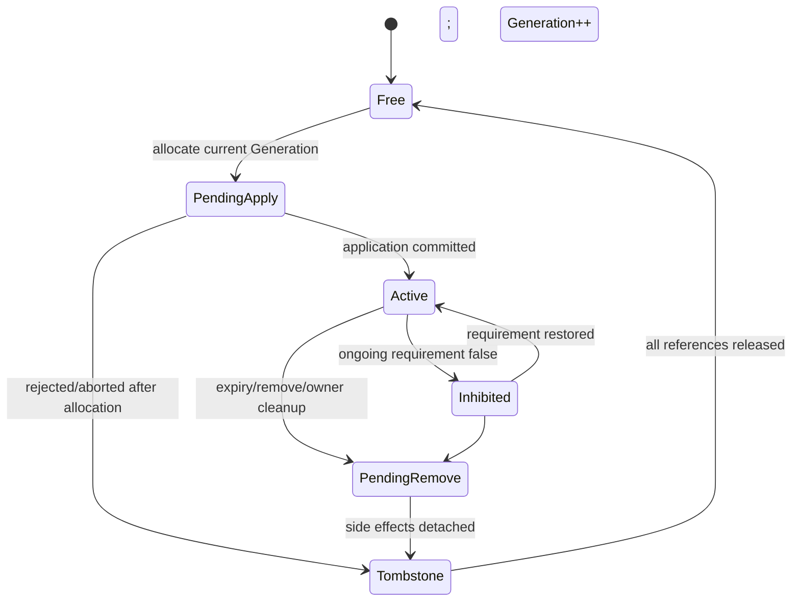

# Active Effect Store Spec

## 目的

定义 duration、infinite、stack、period、ongoing/inhibition、granted tag/ability/cue 等跨帧 GameplayEffect 状态的唯一目标存储。v1 统一使用目标 ASC-local、非压缩 generational slab；不把每个 ActiveEffect 实体化，也不维护 Ability/Activation Entity 权威。

物理 phase/Job/Tick Scratch/Structural Commit 分别引用 [03A](03-RuntimeCore管线/03A-执行域与数据流Spec.md)、[03C](03-RuntimeCore管线/03C-SystemGroup合约与核心数据形态Spec.md)、[03E](03-RuntimeCore管线/03E-EffectFanIn-State-Attribute-FactSpec.md)、[03F](03-RuntimeCore管线/03F-StructuralCommit与BoundaryProjectionSpec.md) 与 [03G](03-RuntimeCore管线/03G-Component矩阵-TickScratch-Job拓扑Spec.md)。

## 领域边界

```text
GameplayEffectDefinition
    ↓ build
GameplayEffectApplicationSpec
    ↓ successful duration/infinite application
ActiveEffectSlot
```

1. Definition 是不可变配置。
2. Application Spec 是施加前/施加中的 runtime value。
3. ActiveEffectSlot 是目标 ASC 上已成功应用且跨帧存活的状态。
4. Instant Effect 不创建 ActiveEffectSlot。
5. 新 Application stack 到已有 slot 时保留新的 `EffectApplicationId`，但 ActiveEffectHandle 可以不变。

## Handle 与 Slab

```text
ActiveEffectHandle =
    (OwnerAscInstanceId, SlotIndex, Generation)
```

ActiveEffectHandle 是独立强类型，不能与 GrantedAbilityHandle、AbilityActivationHandle、ContinuationHandle 或 SubscriptionHandle 互换。

### 状态图


```mermaid
stateDiagram-v2
    [*] --> Free
    Free --> PendingApply: allocate current Generation
    PendingApply --> Active: application committed
    PendingApply --> Tombstone: rejected/aborted after allocation
    Active --> Inhibited: ongoing requirement false
    Inhibited --> Active: requirement restored
    Active --> PendingRemove: expiry/remove/owner cleanup
    Inhibited --> PendingRemove
    PendingRemove --> Tombstone: side effects detached
    Tombstone --> Free: all references released; Generation++
```

### Slab 不变量

1. Live SlotIndex 永不改变；禁止 compact、`RemoveAtSwapBack`、swap-back free 或排序重排。
2. free-list 只复用 `Free` slot；`PendingRemove/Tombstone` 不能提前复用。
3. Generation 仅在 `Tombstone → Free` 时递增。
4. Tombstone 等待 modifier/tag/grant/cue cleanup、Live dependency、queued fact/command 与外部引用全部释放。
5. 所有访问校验 `SimulationEpoch + HandleKind + OwnerAscInstanceId + SlotIndex + Generation`。
6. stale handle 是可诊断的确定性失败，不能解析到同 index 的新 effect。
7. ASC destroy 前必须先关闭 store、冻结 removal facts、清理外部 dependency/subscription，再提交 Entity destroy。

## ActiveEffectSlot 必保字段

| 字段组 | 必保字段 | 语义 |
|---|---|---|
| Identity | Handle、DefinitionId、version/hash、first/latest EffectApplicationId | 区分存活实例与每次应用 |
| Owner | TargetAscInstanceId、SourceAscInstanceId | target ASC 是唯一 writer |
| Provenance | source Activation/Granted handle（可 stale）、EffectContextId、Instigator、EffectCauser、SourceObject | 晚期 tick/remove/cue 仍可解释来源 |
| Runtime Spec | level、SetByCaller snapshot、source/target capture、dynamic tags/inputs | target-local active runtime copy |
| Time | start tick、duration/remaining、period/next due、DueClaim、PeriodExecutionOrdinal | integer-tick 生命周期与一次性 due claim |
| Stack | stack count/limit、StackTemporalContract、可选 per-application payload/expiry ledger | 合并、刷新、溢出、逐层到期 |
| State | PendingApply/Active/Inhibited/PendingRemove/Tombstone、首次冻结的 removal reason | inhibition 不是 removal；terminal reason 只写一次 |
| Contributions | modifier contributor ids、owned tag contribution ids、grant handles、ActiveCycleOrdinal/CueDefinition ranges | 精确增加/撤销与 Cue lifecycle |
| Dependencies | LiveCaptureBinding ids/consumer fields、dirty revision、source-gone/cycle/budget、external cleanup tokens | live magnitude 更新与闭环 |
| Free-list | next free index、Generation | 稳定 slot 管理 |

UE 风格对象指针、delegate、timer handle、global handle map、PredictionKey 与复制状态都不属于目标字段。

## EffectApplicationId 与 ContributorId

`ActiveEffectHandle` 只标识存活 slot，不能替代应用和贡献身份：

- `EffectApplicationId`：每次 apply attempt/commit 唯一；instant、rejected、stack merge 也存在。
- `ContributorId`：至少由 ActiveEffectHandle、modifier ordinal 与稳定 application/order provenance 构成。
- `CueLifecycleKey = (SimulationEpoch, ActiveEffectHandle, ActiveCycleOrdinal, CueDefinitionOrdinal)`：只配对同一 active cycle 的 OnActive/WhileActive/Removed。
- `ExecutedCueKey`：使用具体 EffectApplicationId；period 使用 `(ActiveEffectHandle, PeriodExecutionOrdinal, CueDefinitionOrdinal)`，不得借用 lifecycle key。

精确撤销必须按 ContributorId 或 ActiveEffectHandle 所拥有的贡献集合执行。不能通过“重新查找同 Definition 的 effect”删除，因为同 Definition 可以有多个 source、stack group 或 target-local instance。

## Apply / Stack 契约

Effect Fan-In 对每个 EffectApplicationId 按以下顺序处理：

1. 在 target writer 最终线性化点建立 Target pre-application capture，并读取同目标前序 canonical state。
2. 重新校验完整 application requirement、immunity 与 TargetLifePolicy；TargetResolve precheck 不是结果。
3. 解析 stacking key/payload 和完整 StackTemporalContract，校验 WholeTickInfraAdmission reservation token；基础设施容量不足不得在本阶段成为业务分支。
4. 若命中既有 slot，按 policy 更新 stack、payload、duration、period 与 runtime magnitude；记录新的 ApplicationId fact/ledger entry。
5. 若不命中，分配 PendingApply slot，复制 target-local Application Spec，再一次性提交 contributions。
6. 任一业务失败均输出 typed ApplicationOutcome 且不暴露半 Active slot；已分配 slot 进入 Tombstone 后安全回收。InfraAdmissionFault 则发生在本阶段前且整 Tick gameplay 零写。
7. overflow child effect 只派生新的 EffectCommand/ApplicationId，不直接写 Attribute。

StackCount 影响 magnitude 时，ActiveEffect runtime spec、modifier contributions 与 typed facts 必须在同一权威事务内一致更新。

### StackTemporalContract

每个 Definition 必须在生成期完整声明以下轴，Runtime 不得从 duration/period 是否为 0 或配置缺省值猜语义：

| 轴 | 契约 |
|---|---|
| StackKey | Definition/TargetASC/SourceASC/source object/显式 group 的合并键 |
| StackPayload | 同质共享 payload × count，或逐 EffectApplication payload/source/apply tick/expiry ledger |
| DurationRefresh | 首次、每次成功 stack、at-limit、overflow 时是否及如何刷新 |
| PeriodReset | stack/refresh/reactivate 后 next due 保持、重置或明确对齐 |
| ExecuteOnApply | 首次 apply、每次 stack apply 是否立即执行 period body |
| AtLimit | deny、refresh-only、replace、overflow、clear 的确定顺序与 outcome |
| Overflow/Clear | overflow child、deny、clear one/all 的先后与失败原子性 |
| Expiration | 整槽移除、移除一层、按逐 application ledger entry 到期 |
| FinalPeriod | expiry 与 due 同 tick 时 final execute 或先 remove |
| InhibitResume | duration/period 暂停、跳过、累计、重置及 reactivate 行为 |
| StackCue | count 变化是无 Cue、参数更新还是 Executed；不得建立新的 lifecycle cycle |

`HomogeneousCount` 仅适用于所有 stack 共享 magnitude、source-sensitive inputs、duration 与 expiry 的定义。毒、充能等若每次 application 有独立 magnitude/source/expiry，必须持有逐 application ledger；否则 Definition bake fail。相同 Definition/Target/Source 的 stack key 并不能证明 payload 同质。

Activation 的普通 `EmittedApplicationRefs` 只是审计引用，ActiveEffect 不因 source Activation End 自动删除。`RemoveOnActivationEnd` 必须遵守：尚未线性化时 cancel-before-apply；已线性化时按 EffectApplicationId/ContributorId/ledger entry 精确撤销；已经合并进无逐 application ledger 的 shared stack 时 Definition bake fail。

## Active 与 Inhibited

Inhibited 保留：

- ActiveEffectHandle 与 Generation
- duration/period/stack/context
- runtime spec/capture
- removal/refresh policy

Inhibited 撤销或暂停：

- persistent attribute modifiers
- granted OwnedTags
- block/cancel contributions
- 按 policy 生效的 granted abilities
- active Cue 状态
- period execute

稳定 `Active → Inhibited` 必须结束当前 Cue active cycle 并发送一次 `Removed(CueLifecycleKey)`，但不回收 ActiveEffectSlot。稳定恢复 Active 时用同一 ActiveEffectHandle 重新提交贡献，`ActiveCycleOrdinal++`，并以新的 CueLifecycleKey 发送 OnActive + WhileActive。若 effect 在 Inhibited 状态直接 Remove，当前 cycle 已结束，不得再次发送 Removed。duration/period 在 inhibition 期间的暂停、跳过、累计或 reset 只由 StackTemporalContract 决定。

### Target-local Stabilization

Ongoing requirements、inhibition、OwnedTag 与 modifier contribution 可能互相影响，必须在目标 ASC 内求稳定态：

1. 以提交前稳定状态开始事务内迭代。
2. 每轮计算 requirement → inhibition → contribution/tag counts。
3. 使用 state hash 检测振荡，并设置最大迭代数。
4. 无固定点时显式 deterministic failure，不发布半稳定 state。
5. 中间试探的 Reaction/Cue 不离开事务；只发布最终稳定 transition。

静态 Definition DAG 不能证明任意运行时组合可收敛，因此 runtime cycle/iteration guard 不可省。

## Period / Overflow 派生

1. owner-local period 在 `DueTick` 当前 tick 由唯一 `DueClaim` claim；每次成功 claim 分配单调 `PeriodExecutionOrdinal`。重复扫描、retry 或 catch-up 不得再次执行同一 ordinal。
2. 跨 ASC Live dirty 的 destination T+1 work 在同一目标的语义序上先于 `PeriodDue`，因此 period 读取重算后的 canonical state。
3. claim 后、执行前校验 Handle Generation 与 `Active && !Removing`；执行后再次检查，因为 period body、execution 或 meta conversion 可能 self-remove。
4. Inhibited effect 不执行 period；暂停/跳过/累计/reset 与恢复行为由 StackTemporalContract 固定。
5. expiry 与 period 同 tick时，FinalPeriodPolicy 必须在 removal arbitration 中先确定，不能依赖 Job 完成顺序。
6. 已进入 PendingRemove/Removing 的 slot 不再刷新 duration、reset next due 或 claim 新 period；contribution/cue/grant terminal cleanup 只执行一次。
7. ExecuteOnApplyPolicy 决定当前 application 是否立即执行一次自身 period body；该 body 是当前 target transaction 的工作，可经 target single writer 写本次 Attribute delta/fact。该 body或普通 apply、period/overflow/reaction 动态派生的 child application 才生成新 EffectCommand/ApplicationId，并默认 `DueTick = CurrentTick + 1`。
8. overflow child effect 走完整 Application Spec/target capture/requirement/immunity/stack 链，并复制 Definition/version、source/target、SetByCaller、Context、capture provenance 与 causality。

## Granted Tag / Ability / Cue Ownership

### Granted Tag

OwnedTag 使用引用计数/贡献集合。ActiveEffect Active 时增加自己的 contribution，Inhibit/Remove 时只撤销自己的 contribution；父 tag count 与零边界由 Tag lane 统一派生。

### Granted Ability

ActiveEffect grant Ability 时记录得到的 GrantedAbilityHandle 与公开 removal policy。该 policy 只有三态：

- `CancelImmediately`：阻止新 Activation，取消全部 child；Continuation/Subscription cleanup 完成后 tombstone Granted slot。
- `RemoveWhenAllActivationsEnd`：立即阻止新 Activation，保留现有 child；最后一个 child 结束并 cleanup 后 tombstone Granted slot。
- `LeaveGranted`：Granted slot 继续保持 Live 且可激活。它只 detach 原 ActiveEffect 的 cleanup ownership，冻结 granting Definition/Application/Context provenance，不保留必须解引用的 dangling ActiveEffectHandle。

`LeaveGranted` 不是 “DoNothing”，也不等于保留旧 Activation 后再 tombstone。`SuspendWhileInhibited` 是独立 inhibition policy，用于临时禁止/恢复激活；不得塞进 removal policy 或作为 LeaveGranted 的隐式副作用。

### GameplayCue

- 首次稳定进入 Active：`ActiveCycleOrdinal=0`，用 `CueLifecycleKey=(SimulationEpoch, ActiveEffectHandle, ActiveCycleOrdinal, CueDefinitionOrdinal)` 发送 OnActive + WhileActive。
- 从稳定 Active 进入 Inhibited：对当前 CueLifecycleKey 发送一次 Removed，结束该 cycle，但保留 ActiveEffect identity。
- reactivate：`ActiveCycleOrdinal++`，以新 CueLifecycleKey 发送 OnActive + WhileActive；reactivate 不是旧 lifecycle 的重复投递。
- Active 状态 Remove：对当前未结束 cycle 发送一次 Removed；Inhibited 状态 Remove 不再发送 Removed。
- stack count 改变本身不增加 ActiveCycleOrdinal；StackCuePolicy 决定参数更新或 Executed。
- instant/普通 execution 的 Executed 使用 EffectApplicationId；period Executed 使用 ActiveEffectHandle + PeriodExecutionOrdinal + CueDefinitionOrdinal。

稳定化内部试探不发 Cue。`BoundaryEventId` 只负责交付/去重，不得代替 CueLifecycleKey、EffectApplicationId 或 PeriodExecution identity。显式已提交 Add→Remove 保留正式 lifecycle transition；未提交试探态不泄漏。

## Live Capture Dependency

ActiveEffectSlot 只保存 binding/dependency identity，不复制 source accumulator 的可变引用。binding 至少区分 `CaptureOrdinal + ConsumerNodeId + ConsumerFieldId`，并保存 LastSeenRevision、SourceGonePolicy、EdgeOrdinal、CyclePolicy/PropagationBudget。完整 CaptureProjectionContract 见 [04](04-EffectCommand-SpecStream-AttributeDeltaSpec.md)。

同 ASC Live Capture 可由 target-local revision 触发重算。Source Live Capture 跨 ASC 时必须：

1. 在 captured/source ASC 登记 dependency edge。
2. source revision 在 T 变化后产生发往 target ASC、`DeliverTick=T+1` 的 deterministic dirty command。
3. target ASC writer 校验 binding 与 DependentActiveEffectHandle Generation；在同 tick PeriodDue 前按 consumer field 重算。
4. source 消失按 SourceGonePolicy 显式 remove/freeze/fault；不得 fallback self、0 或 target 当前值。
5. Remove/Tombstone 双向清理 dependency；晚到 dirty/Ack 只产生 stale no-op diagnostics。
6. 静态 cycle 在 bake 拒绝；运行时重复 edge/CausalityId 或 propagation budget 超限为 deterministic fault。

若实现不提供这条跨 ASC 闭环，Definition 必须 bake fail；不得退化为悄悄的 phase scalar read 并仍命名为 Live。

## Owner-local 承载约束

v1 baseline 与权威终局都是 ASC owner-local non-compacting slab。Unity 物理上可由预安装 DynamicBuffer/owner component 组合承载，但必须保持逻辑 slot index、free-list 与 tombstone；buffer 扩容只能搬迁内存，不能改变逻辑 handle。

结构 Entity 只用于 projectile、aura、zone 等需要空间查询或独立结构生命周期的派生对象。禁止：

- ActiveEffect Entity authority
- Ability/Activation Entity authority
- 用 LinkedEntityGroup 表达 ASC→Ability/ActiveEffect 权威层级
- 用 enableable/tag component 代替每个 slot 的 Active/Inhibited/PendingRemove 状态
- 为便于查询复制第二份可写 ActiveEffect 状态

跨 owner 索引、period bucket 或 debugger index 只能是可重建的只读派生索引，不能改变 slot authority。

## Capacity 与诊断

物理 buffer capacity 由 [13-03 Buffer容量与Phase映射](13-EntityComponent物理布局/13-03-Buffer容量与Phase映射Spec.md) 所有。本 Store 必须暴露：

- live/free/tombstone count 与 high-water mark
- grow count 与 externalized bytes
- stale-handle rejection count
- Generation wrap risk
- Active/Inhibited/PendingRemove 分布
- stack/period due/overflow counts
- stabilization iteration/cycle failures
- Live dependency local/cross-ASC edge count与dirty latency
- grant/subscription cleanup latency

`compact count` 不应存在；任何非零 compact/swap-back 指标都表示违反设计。

## 非预测 v1

ActiveEffectSlot、modifier contribution 与 evaluation API 不得包含 PredictionKey、IsPredicted、IncludePredictiveMods、prediction state、ack/reject/caught-up 或 predictive instant overlay。Authority 是执行域事实，不是每 slot 的 prediction mode。

未来 Prediction/Replication 必须新增独立 network correlation/reconciliation 数据，不修改 ActiveEffectHandle 语义。

## 验收

1. slot 回收后旧 ActiveEffectHandle 被 Generation 拒绝。
2. Live slot 在 grow、remove、stack、period 与 cleanup 后 SlotIndex 不变。
3. Instant application 不分配 ActiveEffect slot，但拥有 EffectApplicationId。
4. stack merge 保持 ActiveEffectHandle，记录独立 ApplicationId，并按完整 StackTemporalContract 更新 payload/duration/period/cue。
5. 异质 poison/charge payload 与 expiry 使用逐 application ledger；count-only 定义在 bake 被拒绝。
6. target requirement/immunity/life/stack policy 在最终线性化点读取前序 canonical state；失败输出 typed outcome/immunity blocker 且无部分 mutation；infra capacity 失败整 Tick 零写。
7. 普通 GE 不随 Activation End 删除；RemoveOnActivationEnd 在 apply 前 cancel、apply 后精确撤销、shared stack 无 ledger 时 bake fail。
8. Duration modifier 只影响 Current/contribution；Remove 后精确恢复。
9. Inhibit 保留 slot/time/stack/context，撤销贡献并停止 period；Removed 结束旧 Cue cycle，恢复使用同一 handle 与新 cycle。
10. DueClaim/PeriodExecutionOrdinal 防重复；expiry/final-period/self-remove/overflow clear 不双执行或双删，动态 child 默认 T+1。
11. Granted removal 精确区分 CancelImmediately、RemoveWhenAllActivationsEnd、LeaveGranted；SuspendWhileInhibited 独立。
12. Cue lifecycle key 含 SimulationEpoch/ActiveEffectHandle/ActiveCycleOrdinal/CueDefinitionOrdinal；stack 不新 cycle，Inhibited remove 不重复 Removed，Executed 使用 application/period identity。
13. ActiveEffect grant 的 tag/ability/cue 只清理自己的贡献。
14. target-local stabilization 收敛；振荡显式失败且不泄漏中间 Reaction/Cue。
15. 同 ASC Live 变更触发重算；跨 ASC Live 在 T+1 且先于 PeriodDue，或 bake fail；source gone/cycle/budget 不隐式回退。
16. owner destroy 前完成外部 dependency/grant/subscription cleanup。
17. Runtime 不存在 ActiveEffect Entity authority、compact/swap-back 或 Prediction schema。

## 历史方案定位

1. Duration/Period/Stack 与 unmanaged modifier 的历史方案只作为字段来源线索。
2. stable active effect entity、Ability Entity、LinkedEntityGroup authority 与可 compact slot 均被 v1 裁决取代。
3. 本文件的 generational slab、tombstone、EffectApplicationId 与稳定化契约优先。
