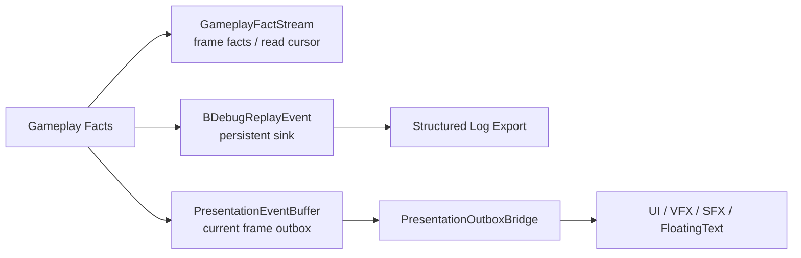

# Runtime Boundary Observation / Presentation / Replay Spec

## 目的

明确 GAS Runtime Core facts、Presentation outbox、Replay sink 与 Structured log 在 Runtime Boundary Layer 中的分工。

## 数据流

## 核心契约

| 流 | 生命周期 | 消费者 | 禁止 |
|---|---|---|---|
| Typed facts | frame-local / cursor | Simulation reaction | presentation side effect |
| GameplayFactStream | frame-local / cursor | replay / presentation projection / read model | high frequency reaction 主输入 |
| Presentation outbox | current frame | UI/VFX/SFX outbox bridge | gameplay mutation |
| Replay sink | persistent | debugger / export | runtime decision |

`CGameplayEventBus` 只能作为过渡命名参考；目标态命名应向 `GameplayFactStream`、`GameplayFactReadCursor`、`PresentationOutboxBridge` 收敛。

## 官方依据与设计论证

| 目标态选择 | 官方规则依据 | 为什么更优秀 | 为什么有必要 |
|---|---|---|---|
| CoreReactionFact 与 BoundaryObservationFact 拆分 | `SYS-05`、`DBG-01`、`SEL-01` | Core 内部 reaction 可以保持 ECS 数据流，Boundary 可以按 read model / outbox / replay 各自采样 | 同一个全局 EventBus 同时服务 gameplay reaction、UI、日志和 replay，会让表现层反向影响 simulation |
| 多 job fact fan-in 默认用 `NativeStream` / per-thread stream + deterministic merge | `CASE-12`、`NAT-03`、`BUF-02`、`MAT-05` | 并行 producer 不争用单一全局 buffer，merge 顺序可被 replay hash 和 Debugger 复核 | GAS 的 damage、cue、death、passive trigger 会在同帧多来源产生；全局 buffer 会成为串行热点 |
| Presentation / Replay / Debugger 只消费 Boundary 投影 | `SYS-05`、`DBG-01`、`ODF-07` | UI/VFX/SFX、replay 和诊断可以有不同采样率与持久化策略，不影响 Core tick | 无头验收、实机场景和 Editor 工具的输出形态不同；它们必须共享事实来源但不能共享写 Core 权限 |
| 表现资源引用只在 Boundary / Presentation 出现 | `ODF-18`、`CASE-11`、`CONTENT-01` | Runtime Core 只输出 marker / request，资源加载状态可被单独诊断 | 弱引用、内容加载和渲染状态有异步生命周期；进入 Core 决策会破坏 deterministic simulation |

## Unity Entities 校准

Typed facts 必须继续拆分为 Core 内部 reaction 与 Boundary 观察输出：

| 类型 | 目标消费者 | 推荐承载 | 禁止 |
|---|---|---|---|
| CoreReactionFact | Runtime Core 内部 system | typed component / enableable marker / command stream / local DynamicBuffer | 全局 observation buffer 扫描 |
| BoundaryObservationFact | ReadModel / Replay / Presentation / Debugger | fact stream / outbox buffer / diagnostics sink | 反向写 simulation |

EntityQuery change filter 只能作为 chunk 级优化，不能当作实体级事件语义。若需要精确 gameplay reaction，应使用 typed fact / command data / enableable state，而不是依赖某个 component “被写过”的 chunk 过滤结果。

## Observation API 选型修正

| 使用情形 | 推荐 API / 承载 | 边界 |
|---|---|---|
| Core 内部 reaction | typed component、enableable marker、local command stream、per-owner buffer | 只能在 Runtime Core 内消费，不进入表现副作用 |
| 多 job 并行 fact fan-in | `NativeStream` / per-thread stream + merge | merge 后再投影到 Boundary，避免热路径全局托管日志 |
| Boundary observation | outbox buffer、sampled sink、replay sink | 只读 Core facts，不反向写 simulation |
| Presentation resource | `WeakObjectReference` / `UnityObjectRef` | 仅 Runtime Boundary / Presentation 使用 |
| Replay / Debug sample | sampled ring、persistent sink、structured export | hot path 只写 numeric / fixed-size 数据 |
| 大规模压力观察 | sampling、chunk counters、projection cursor | 避免每实体每帧全量日志 |

无头不代表删除表现链路。UI / VFX / SFX / Cue 仍走真实 Boundary 语义，只是 resource 和 side effect 由结构化日志占位。

## Observation 目标验收门

1. Attribute、Cue、Damage 和 generic gameplay fact 都必须先成为 typed Core / Boundary fact，再投影到 Presentation outbox 和 Replay sink。
2. 同一 fact 投影到多个边界输出时必须携带 source sequence / context，Boundary Projection 能避免重复投影。
3. CoreReactionFact consumer 不能从 Presentation outbox、Replay sink、legacy EventBus 或托管日志反向读取 simulation 输入。
4. 若 fact 承载仍使用 singleton DynamicBuffer，validation evidence 必须标记 proof-only、规模上限、cursor lag、buffer pressure、重选型触发条件和移除任务。
5. x50 / x1000 profile 出现 fact scan cost、outbox count > fact count、global buffer pressure、buffer spill、cursor lag 或 deterministic merge 风险时，必须重新评估 owner-local fact buffer、`NativeStream` / per-thread stream + merge 或 sampling sink。

## DOTS 深读后的观察链路修正

| 链路点 | 目标态设计 | 候选 API / 机制 | Debugger 证据 |
|---|---|---|---|
| CoreReactionFact | 只服务 Core 内部 reaction，按消费者就近组织 | typed component、enableable marker、owner-local buffer、`NativeStream` merge | fact consumer count、local stream count |
| BoundaryObservationFact | 只读 Core facts，投影到表现 / replay / read model | outbox DynamicBuffer、sampled sink、cursor、read model component | cursor lag、backpressure、projection ms |
| Replay sample | 用 sampled / ring / persistent sink 保存可回放摘要，不在热路径拼托管字符串 | fixed-size sample、NativeStream sampled export、Persistent owner container | sample rate、dropped count、allocator owner |
| Presentation resource | Cue/UI/VFX/SFX 的资源句柄和加载状态只在 Boundary | WeakObjectReference、UntypedWeakReferenceId、RuntimeContentManager、log marker | load requested / ready / released、missing resource |
| Query export | 低频导出可用 async query result，但不能阻塞 Core tick | `ToEntityListAsync`、`CreateArchetypeChunkArrayAsync`、dependent export job | gather job ms、NativeList capacity、dependency wait |
| Streaming / scene observation | 场景 / section 加载状态属于 Shell / Boundary，不进入 Core 决策 | SceneSystem、Scene meta entity、SceneSection metadata | scene load state、structural count |

设计约束：

1. Boundary outbox 可以反映 UI / VFX / SFX / FloatingText / Cue，但不能作为 gameplay reaction 主输入。
2. 无头自动测试也必须输出 Presentation marker，证明真实表现链路存在；只是 side effect 由日志占位。
3. Replay 和 Debugger 不共享同一个无限增长 buffer；Replay 偏持久样本，Debugger 偏当前帧 counters 和 TopN。
4. 大规模压测默认不输出每实体每帧观察日志；用 sampling、chunk counters 和 cursor lag 解释链路健康。
5. weak resource 未加载时只能影响表现 marker，不影响 Core simulation 结果。

## 验收

1. 无头 AutoChess 仍输出 UI/VFX/SFX/FloatingText/Cue marker。
2. replay/export 可解释发生了什么。
3. core simulation tick 与 Runtime Boundary projection tick 可以分开报告。
4. AutoChess summary 能区分 CoreReactionFact、BoundaryObservationFact、Presentation marker 和 Replay sink 数量。
5. Debugger 能输出 projection cursor lag，证明 Boundary 消费不会反压 Core hot path。
6. Presentation summary 能输出 weak resource load / release / missing marker，即使无头模式只用日志占位。

## 历史方案定位

1. Event Buffer / GameplayCue / AbilityEventLog / AttributeChangeLog 的观察层信号来自 `../历史方案参考/方案11.md:34-37`。
2. Presentation dispatcher 消费事件并触发表现的例子来自 `../历史方案参考/方案11.md:176-227`。
3. Demo 中 UI 更新只消费事件、与 ECS 解耦的业务信号来自 `../历史方案参考/方案12.md:713-752`。
4. 方案14 的 GASEventBus 示例位于 `../历史方案参考/方案14.md:367-426`，本路线只吸收“ECS -> 表现观察”信号，不吸收托管 EventBus 作为实时 gameplay 路由。
5. 方案15 中 GASEventBus / GASDebugger 的命名属于历史雏形，本路线按 `12-命名规范Spec.md` 拆分为 fact stream、outbox bridge、diagnostics sink 和 replay sink：`../历史方案参考/方案15.md:61-65`。
