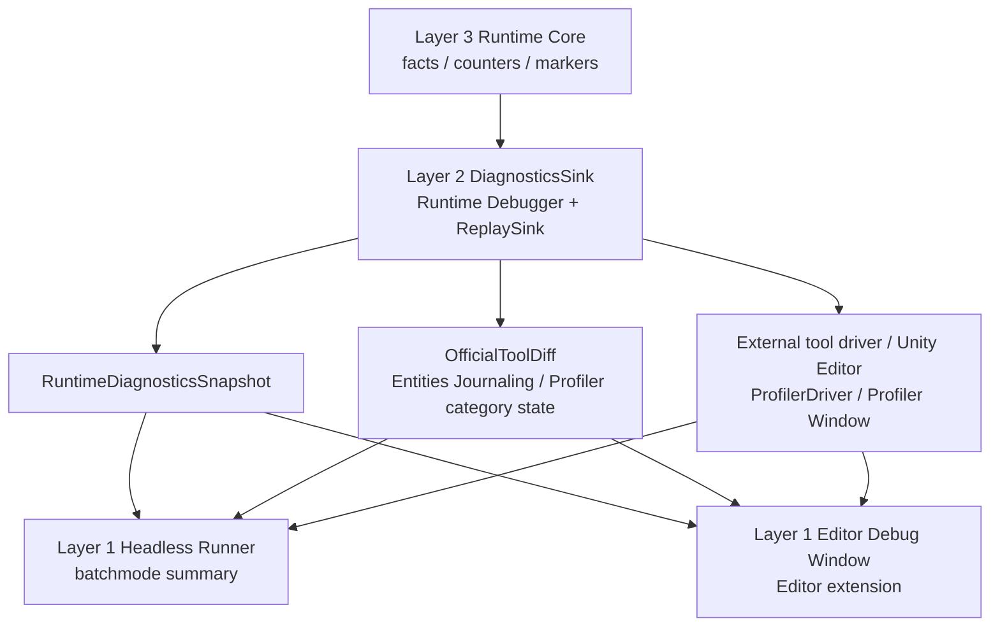
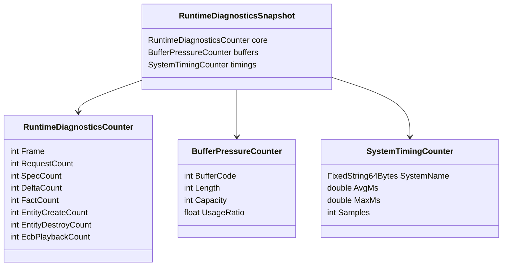
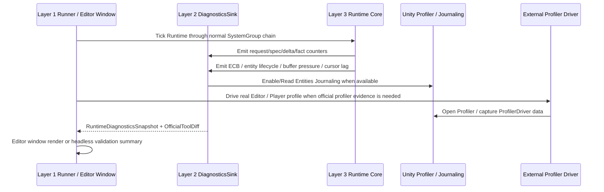

# Runtime Core Debugger Spec

## 目的

Runtime Core Debugger 用于回答“GAS 语义上发生了什么、哪些 Core 计数异常、哪些数据可以和 Unity 官方工具对齐”。在四层架构中，它的 Runtime 采样、snapshot、official tool diff 和 replay/export API 归属 **Layer 2 Runtime Boundary Layer** 的 `DiagnosticsSink` / `ReplaySink`，不是 simulation input，也不是 Unity Profiler 的替代品。

Editor Debugger Window 归属 **Layer 1 Application Shell Layer** 的 Editor Extension；无头 runner、外部 profiler driver 和实机 Editor profile runner 也归属 Layer 1。二者必须消费同一套 Layer 2 `RuntimeDiagnosticsSnapshot` / official diff API，不能把窗口实现放入 Demo，也不能让 Demo 私有化 Debugger 数据链。

性能判断采用 **官方工具优先**：能用 Unity Profiler、Entities Profiler Modules、Entities Journaling、ProfilerRecorder / ProfilerDriver 和外部 Editor / Player Runtime Bridge 获取的数据，不在项目内重复造完整 profiler。项目内 Debugger 只保留 GAS 语义 counter、thin snapshot、official tool diff 标记、无头可调用导出和必要的 runtime safety gate。

## 官方依据与设计论证

Debugger 的职责是生成可复核证据，不是成为 Runtime Core 控制层。`SYS-05` 要求 Debugger / Demo / Presentation 只能通过 Boundary 观察 Core，`DBG-01` 要求诊断输出能和官方工具对齐。因此本 Spec 把 Debugger 归入 Layer 2 DiagnosticsSink / ReplaySink：Core 只产出 counters、typed facts 和 marker，Layer 1 的 Editor window、headless runner 或 profiler driver 只消费同一份 snapshot / official diff。

这些证据必须覆盖 DOTS 性能风险，而不是只打印业务日志。`PRF-04` / `ECB-03` 对应 structural playback 与 sync point 归因，`PRF-10` / `BUF-01` 对应 DynamicBuffer spill 与容量压力，`NAT-03` 对应 `NativeStream` block / merge cost，`PRF-08` / `CASE-35` 对应 deterministic key，`PRF-33` 对应 query owner 可追踪性。没有这些字段，Debugger 不能回答“哪个 System / lane 造成热点”，也不能证明新架构比 OOP 中间层或全局总线更适合优化。

无头 AutoChess 验收还必须遵守 `CASE-17` 的多 World / bootstrap 口径：Profiler、Journaling、fixed-step policy、warmup / measurement / cleanup 信息要进入同构 evidence model。这样 CLI、Editor 和 Player 采样可以互相对照，而不是各自输出一套不可比较的日志。

## 数据流图



## 数据导向 Debugger 重构架构

目标态 Debugger 不是“GAS 日志中心”，而是 **GAS concept aware + DOTS data-oriented** 的 evidence pipeline。它必须同时回答两类问题：

1. GAS 概念视角：Ability、GameplayEffect、Attribute、Tag、Cue、GameplayFact 在本帧发生了什么，语义链是否完整。
2. DOTS 数据视角：这些语义成本落在哪个 phase / lane / system / job / component / buffer / lookup / allocator / structural playback / sync point 上，是否符合 `QRY/JOB/BUF/NAT/PRF/DBG` 规则。

目标态分成五个 owner，任何实现不得再把它们塞回同一个大类或单个稀疏事件行：

| Owner | 允许职责 | 禁止职责 |
|---|---|---|
| `DiagnosticsConfigOwner` | 采样开关、pass mode、sampling interval、overhead budget、retention budget | 保存 runtime 业务计数、执行 query、导出字符串 |
| `RuntimeMetricSink` | hot path 写固定宽度 numeric metric、FixedString id、sample count、min/max/total | `ToEntityArray`、`Dictionary`、托管字符串、Profiler/Journaling 开关 |
| `DiagnosticMaterializationPass` | diagnostic pass 中做 query materialization、TopN、active store 深扫、observation 物化成本归因 | 被 performance pass 隐式开启，或把 materialization 成本并入 CoreSimulation |
| `OfficialCorrelationPass` | separate pass 读取 Entities Journaling / Profiler state / official TopN，并与 metric id 对齐 | 替代 runtime counter，或在 strict performance pass 中启用 Journaling |
| `DerivedExportSink` | 文本、Mermaid、sequence、Editor chart、中文日志、报告摘要 | 成为机器验收源，或被 Runtime Core 读取改变 gameplay |

### Pass Mode

Debugger 采样必须显式声明 pass mode。pass mode 是 performance 结论的前置条件，不是报告注释：

| Mode | 用途 | 允许开销 | 典型输出 |
|---|---|---|---|
| `Off` | 生产或极限 benchmark | 0 | 仅保留必要 battle hash / result |
| `PerfCounter` | strict headless performance pass | 低开销 numeric counter、timing split、必要 facts | `DataOrientedScorecard`、owner split、failure mask |
| `DiagnosticSample` | 架构定位 / x50 复诊 | query materialization、buffer 深扫、TopN、raw snapshot | hotspot matrix、buffer pressure、materialization owner |
| `OfficialCapture` | official diff separate pass | Profiler/Journaling/Burst evidence 开销 | Journaling TopN、Profiler state、official disabled reason |
| `DerivedExport` | 人读报告 / Editor Window | 字符串和图表导出 | text / Mermaid / chart，不参与机器 gate |

解释规则：

1. Performance pass 只能消费 `PerfCounter` 级 evidence；如果 Debugger materialization、official capture 或 derived export 开启，该样本只能作为 diagnostic evidence。
2. Diagnostic pass 可以重，但必须输出 `overheadOwner=Debugger` / `Observation` / `OfficialTool`，并保留 materialized query/entity/time。
3. Official capture pass 必须与 performance pass 分离，并对照 commands/facts/cues/hash，证明采样窗口业务等价。

### Metric Family

目标态不再使用单个 `DiagnosticEvent` 大结构体承载全部字段。metric 必须按数据访问模式分族，便于 Burst-friendly 写入和边界导出：

| Metric family | 物理形态 | 示例字段 | 数据导向目的 |
|---|---|---|---|
| `CostMetric` | compact DynamicBuffer / frame aggregate | domain、phase、lane、system id、samples、total/min/max us | 找到 cost owner |
| `WorkloadMetric` | frame aggregate | units、commands、specs、deltas、facts、cues、measured ticks | 归一化 us / unit / command / fact |
| `GasConceptMetric` | concept id + counter | ability commits、GE specs、active slots、attribute deltas、tag requirement、cue requests | 保留 GAS 语义链 |
| `DataShapeMetric` | owner-local range / chunk / buffer counter | owner groups、max range、chunk count、buffer length/capacity/spill | 判断 chunk locality / buffer pressure |
| `ApiHealthMetric` | fixed id counter | query count、lookup refresh、random lookup、sync query、dependency wait | 识别 DOTS API 选型问题 |
| `StructuralMetric` | structural phase aggregate | ECB commands、playback us、create/destroy/add/remove、official structural records | 判断结构变化是否集中 |
| `OverheadMetric` | pass-local counter | debugger enabled、materialized queries、Journaling enabled、export bytes | 阻断观测污染 |
| `OfficialCorrelationMetric` | official source id + TopN id | Journaling RW TopN、Profiler state、Burst/AOT state | 与 Unity 官方工具对齐 |

Metric family 必须能被 scorecard 压缩成机器字段：`metricFamilyMask` 表示本次证据覆盖的 workload / GAS concept / data shape / API health / timing / overhead 族，`dominantRisk` 表示当前最应优先领取的 DOTS 数据风险。它们是任务路由字段，不替代底层 typed buffers，也不能只从字符串 summary 反推。

### 目标代码形态

代码形态重点是 **小 component + typed buffer + evidence id**。下列代码是目标结构示意，不是当前实现事实：

```csharp
public enum GASDiagnosticPassMode : byte
{
    Off,
    PerfCounter,
    DiagnosticSample,
    OfficialCapture,
    DerivedExport,
}

public enum GASDiagnosticCostDomain : byte
{
    Core,
    Boundary,
    Debugger,
    Runner,
    Physics,
    Render,
    Presentation,
}

public enum GASDiagnosticEvidenceTier : byte
{
    RuntimeCounter,
    DiagnosticMaterialization,
    OfficialCapture,
    ValidationEvidence,
    DerivedExport,
}

public struct GASDiagnosticsConfigComponent : IComponentData
{
    public GASDiagnosticPassMode PassMode;
    public int SamplingInterval;
    public int OverheadBudgetMicroseconds;
    public int MaxMetricRows;
}

public struct GASDiagnosticsFrameStateComponent : IComponentData
{
    public int Frame;
    public int Sequence;
    public int DroppedMetricRows;
    public int EvidenceMask;
}

[InternalBufferCapacity(64)]
public struct GASCostMetricBuffer : IBufferElementData
{
    public int EvidenceId;
    public GASDiagnosticCostDomain Domain;
    public GASDiagnosticEvidenceTier Tier;
    public ushort PhaseId;
    public ushort LaneId;
    public ushort SystemId;
    public int Samples;
    public int TotalMicroseconds;
    public int MaxMicroseconds;
}

[InternalBufferCapacity(64)]
public struct GASApiHealthMetricBuffer : IBufferElementData
{
    public int EvidenceId;
    public ushort PhaseId;
    public ushort LaneId;
    public ushort SourceId;
    public int QueryCount;
    public int LookupRefreshCount;
    public int RandomLookupReadCount;
    public int RandomLookupWriteCount;
    public int SyncQueryCount;
    public int DependencyWaitCount;
}

[InternalBufferCapacity(64)]
public struct GASDataShapeMetricBuffer : IBufferElementData
{
    public int EvidenceId;
    public ushort ConceptId;
    public ushort CarrierId;
    public int OwnerGroupCount;
    public int MaxOwnerRange;
    public int BufferLength;
    public int BufferCapacity;
    public int ExternalizedOrSpillCount;
}

public readonly ref struct GASMetricWriter
{
    private readonly GASDiagnosticPassMode _mode;
    private readonly DynamicBuffer<GASCostMetricBuffer> _costs;

    public GASMetricWriter(
        GASDiagnosticPassMode mode,
        DynamicBuffer<GASCostMetricBuffer> costs)
    {
        _mode = mode;
        _costs = costs;
    }

    public void AddCost(
        int evidenceId,
        GASDiagnosticCostDomain domain,
        ushort phaseId,
        ushort laneId,
        ushort systemId,
        int elapsedMicroseconds)
    {
        if (_mode == GASDiagnosticPassMode.Off)
            return;

        _costs.Add(new GASCostMetricBuffer
        {
            EvidenceId = evidenceId,
            Domain = domain,
            Tier = GASDiagnosticEvidenceTier.RuntimeCounter,
            PhaseId = phaseId,
            LaneId = laneId,
            SystemId = systemId,
            Samples = 1,
            TotalMicroseconds = elapsedMicroseconds,
            MaxMicroseconds = elapsedMicroseconds,
        });
    }
}
```

关键约束：

1. Hot path writer 不接收 `string`，只接收 generated / static id、numeric counter、FixedString 短 id 或 enum。
2. `DiagnosticMaterializationPass` 可以把 id 解析成人读名称；Runtime Core 不做解析。
3. metric family 允许按实现继续拆 buffer；不允许退回单个稀疏大 event row。
4. `DerivedExportSink` 只能从 snapshot / metric buffers 生成文本，不允许自行扫描 Runtime Core 数据。

## GAS 概念到 DOTS 指标映射

目标态 Debugger 必须保留 GAS 语言，但它的性能解释必须落到 DOTS 数据形状：

| GAS 概念 | 必须输出的语义 evidence | 必须绑定的 DOTS evidence |
|---|---|---|
| Ability | activation requests、commit accepted/rejected、cost/cooldown/tag requirement result | command owner、target resolve lane、query/lookup count、commit system cost |
| GameplayEffect Instant | command seed、spec build、modifier count、cue-only spec、requirement pass/fail | fan-in carrier、NativeStream segment、spec buffer pressure、deterministic merge |
| GameplayEffect Duration | active slot count/state、period due、duration due、stack policy、granted tag/ability | owner-local slot capacity、chunk skip、global index pressure、cleanup structural phase |
| Magnitude / ExecutionCalculation | captured value hit、capture miss、fallback value/fact、source/target lookup、execution input | snapshot lane owner、random lookup TopN、owner range、cache miss budget |
| Attribute | pending/applied/skipped delta、target groups、max target range、dirty owners | target-grouped reduce/apply cost、owner-local fact flush、buffer spill |
| GameplayTag / Requirement | tag mask changes、requirement query result、blocked reason | chunk locality、enableable / mask policy、query filter health |
| Cue / Presentation | cue request、presentation marker、outbox count/drop | Boundary cost、managed bridge count、render/presentation disabled reason |
| GameplayFact / Replay | fact count、sequence、domain/event type、hash | deterministic order、stream carrier、BoundaryProjection cost |

解释规则：

1. GAS concept metric 只回答“发生了什么”；DOTS metric 回答“为什么快/慢”。
2. 每条 hotspot 必须同时有 concept id 和 data-shape id。只有其中一侧时，只能作为 partial evidence。
3. `avgTickMs` 只能作为入口信号；任务 owner 必须由 phase/lane/system/component/buffer/lookup/official source 推出。

## DataOrientedScorecard

Runtime Debugger 必须直接生成或支持生成同构 scorecard，AutoChess、Scene Runner、Editor Window 和 CI 只消费它，不各自拼字段。scorecard 至少包含：

| Scorecard 维度 | 必填字段 |
|---|---|
| Workload-normalized cost | units、measured ticks、commands/facts per tick、us per unit / command / fact |
| Chunk locality | owner groups、max owner range、chunk count、enabled mask skip、chunk skip reason |
| Lookup pressure | lookup refresh、random read/write、GetComponentDataRW / GetBufferRW TopN、snapshot miss |
| Buffer pressure | length、capacity、externalized / spill、overflow、clear phase |
| Structural phase | required / recorded playback、ECB commands、Journaling structural records、playback us |
| Sync / materialization | dependency drain us、sync query count、ToEntityArray count、materialized entity count |
| Burst / managed boundary | Burst warmup state、managed allocation、managed bridge count、SystemBase / callback hit |
| Debugger overhead | pass mode、Debugger enabled、Journaling enabled、Profiler state、export bytes、overhead us |
| Evidence routing | metric family mask、dominant risk、failure mask、next owner |

验收规则：

1. strict performance pass 必须输出 scorecard，即使 Debugger raw trace 关闭。
2. 任何失败项必须给出 failure mask 和 next owner：`CommandPort`、`EffectFanInStore`、`ActiveEffectStore`、`AttributeApply`、`StructuralCommit`、`DiagnosticsSink`、`OfficialCapture`、`RunnerSync` 等。
3. scorecard 字段必须以 machine evidence 为源；中文 summary、Mermaid、Editor 图表只能引用 evidence id。
4. `metricFamilyMask` 和 `dominantRisk` 必须由 metric family / counter / validation evidence 计算，不允许由人读文案或导出文本硬编码。

## UML 类图



## 时序图：x50 性能诊断



## 四层职责边界

1. **Layer 3 Runtime Core**：只产出数值 counter、typed fact、presentation marker、replay marker，不读取 Debugger 结果改变 gameplay。
2. **Layer 2 Runtime Boundary**：维护 `GasRuntimeDebugger`、`RuntimeDiagnosticsSnapshot`、`GasRuntimeOfficialToolDiffCapture` 等采样与导出 API；可读 Unity Entities Journaling，Profiler module 未启用时只能输出 disabled reason。
3. **Layer 1 Editor Extension**：实现 Debugger Window、图表、筛选、导出按钮；窗口不得直接写 Runtime Core component / buffer。
4. **Layer 1 Headless Runner**：复用 Layer 2 API 输出 batchmode log、Mermaid 数据流图、时序图和 CI gate；它不是 Debugger 数据源。
5. **AutoChessDemo**：作为 Layer 1 业务验收 Demo，只消费 DiagnosticsSink，不拥有 Runtime Debugger 模块。
6. **Validation Evidence**：Headless runner、scene runner、profile runner 必须把 DiagnosticsSink、OfficialToolDiff、Runtime timing 和业务结果合并成同一个 evidence model；字符串 summary、Mermaid 图和日志文件只是该 model 的导出格式，不是机器依据。

## 证据源分层

目标态 Debugger evidence 必须把证据来源分成五类，并在导出时保留来源标签：

1. **Contract / Plan Evidence**：phase、stream、structural playback、cost split 和 policy 的设计约束，只能说明应当验证什么。
2. **Runtime Counter Evidence**：Core / Boundary / Debugger / Adapter 在运行时写入的数值 counter，用于解释 owner、phase、query、lookup、buffer、allocator、dependency 和 timing。
3. **Official Capture Evidence**：Unity Profiler、Entities Journaling、ProfilerRecorder / ProfilerDriver 或等价官方工具的 captured / disabled / unsupported 状态。
4. **Validation Evidence**：headless、scene、Profiler pass 和 official diff pass 的同构机器字段，用于判断业务闭环、确定性、性能口径和 blocking debug errors。
5. **Derived Export**：中文日志、summary、Mermaid dataflow、sequence diagram 和 Editor 图表，只能从前四类 evidence 派生，不反向参与验收。

任何性能结论必须显式区分 performance pass 与 diagnostic pass。若 Debugger、Journaling、Profiler 或图表导出改变了采样成本，evidence 必须标记 overhead owner，并禁止把该样本直接消费为 Core tick 优秀证明。

## Hotspot Attribution Evidence Contract

目标态 Debugger 的核心 Interface 不是“输出更多日志”，而是把热点归因压缩成一张可机读矩阵。这个矩阵必须能让执行 Agent 直接回答：热点属于哪个 SystemGroup、lane、system、job、component、buffer / lookup、carrier、allocator、dependency、structural phase、official tool source 和后续任务 owner。

每条 hotspot evidence 至少包含以下字段族：

| 字段族 | 必填语义 | 目标 |
|---|---|---|
| Cost domain | core、boundary、diagnostics、runner、presentation、physics、render | 防止把 Debugger / Presentation / Runner 成本混入 Runtime Core |
| Phase / lane | frame phase、data lane、structural phase、fan-in / reduce / apply / projection | 把平均 tick 拆成可行动 owner |
| Source identity | system group、system、job、component / buffer / lookup、carrier id | 让 TopN 能落到具体实现单元 |
| Evidence tier | contract、runtime counter、official capture、validation evidence、derived export | 防止用 contract 或派生文本替代运行证据 |
| API health | proof-only / scale-ready、reselect trigger、query / lookup / buffer / allocator / dependency markers | 把 API 选型风险转为任务树可领取项 |
| Official diff | profiler state、journaling state、TopN source、disabled / unsupported reason | 让官方工具和项目 counter 可对照 |
| Overhead owner | sampling switch、debugger enabled、journaling enabled、export enabled、measured window | 区分 performance pass 与 diagnostic pass |
| Determinism | warmup ticks、measurement ticks、fixed-step policy、hash / order violation | 支撑 AutoChess scale gate 与 replay 判定 |
| Derived output source | summary、Mermaid、sequence、Editor chart 的 source evidence id | 确保图表和中文日志只从机器 evidence 派生 |

解释规则：

1. TopN 必须以 evidence id 连接 runtime counter 与 official capture；无法连接时输出 disabled / unsupported reason，而不是静默降级为文本说明。
2. Performance pass 只允许消费 low-overhead runtime counter、hash、必要 facts 和 timing split；Diagnostic pass 才允许 observation materialization、full Debugger snapshot、Journaling、Profiler capture、raw export 和 derived diagram。
3. Hotspot evidence 必须能生成任务 owner 建议：例如 Shell / Adapter、CommandPort、EffectFanInStore、ActiveEffectStore、StructuralCommit、DiagnosticsSink、GeneratedDefinitionGlue、RunnerSync 或 DefinitionCatalogLifetime。
4. `avgTickMs`、`blockingDebugErrors=0`、字符串 summary、Mermaid 图和 Editor UI 状态都不是 hotspot evidence 的权威源；它们只能引用矩阵中的 evidence id。
5. Debugger 自身的采样成本必须可被度量和关闭；无法度量时，该样本不得用于 DOTS 性能优秀结论。

## 必备 counters

1. request/spec/delta/fact/cue/presentation 计数。
2. entity create/destroy 与 ECB playback 次数。
3. transient buffer length/capacity/peak。
4. cursor lag / projection lag。
5. group/system timing aggregate（项目内只做薄采样，TopN / Timeline 以 Unity Profiler 为准）。
6. sync point / structural change phase / hot path structural violation。
7. query matched entity / chunk 数。
8. GC alloc per tick 与 managed callback count。
9. ActiveEffectStore owner / slot / capacity / state distribution / legacy-backed / externalized owner 计数。
10. official package version、PackageCache hash path、manifest / lock / actual version skew。
11. Burst AOT / Player 口径：Enable Burst、OptimizeFor、Safety Checks、CPU architecture、warning policy、warmup dropped ticks。
12. Boundary resource / managed component / Baking / prefab load state：managed bridge count、weak resource load state、`RequestEntityPrefabLoaded` / `PrefabLoadResult`、`IncludePrefab` policy。
13. Unity Physics 口径：physics step count、fixed-step cost、query count / batch size、broadphase sync count、collision event / trigger event count、event dropped / converted count。
14. Entities Graphics 口径：presentation marker cost、render proxy count、draw command、instances per draw、BRG marker、material override write count、render disabled reason。
15. bounded reaction pass 口径：pass count、command count、cutoff reason、next-frame seed count。

## Unity Entities 证据对齐

Runtime Core Debugger 是项目内证据源，但必须能与 Unity 官方工具对照：

| Unity 证据 | 项目内对应 |
|---|---|
| Profiler system markers | Unity Profiler / external tool-triggered `.data` capture 为主，`SystemTimingCounter` / group timing 只作无头兜底 |
| Entities Structural Changes | entity create/destroy/add/remove / ECB playback counters |
| Entities Journaling | structural event timeline / owner system |
| GC Alloc | `gcAllocBytesPerTick` |
| sync point | `syncPointCount` / `GASStructuralCommitSystemGroup` playback |
| query match | matched chunks / matched entities |

Debugger 不直接替代 Unity Profiler；它负责把 GAS 语义计数与 Unity ECS 机制计数绑定起来。实机 Editor / Player 调试默认通过外部 profiler driver 驱动 Unity 官方 Profiler 工具链，而不是在 GAS Runtime 内重复实现 profiler UI、timeline 或采样存储。

PackageCache 官方文档交叉检查后的硬约束：

1. Entities Journaling 可通过 `Unity.Entities.EntitiesJournaling` API 程序化读取，因此是无头验证链路的最小官方差分来源。
2. Unity Profiler / Entities Profiler Modules 是官方性能证据源；batchmode 未启用 module 时只能输出 disabled reason，真实 Editor / Player 则通过外部 profiler driver 调用 Profiler Window / `ProfilerDriver` 保存官方 `.data` capture。
3. Runtime Debugger 是项目自诊断，不能替代 Profiler / Entities Journaling / Burst Inspector；结论必须保留两套证据的差异。凡是官方工具能直接给出的数据，不在项目内重复造轮子。
4. Entities Journaling 会分配自己的记录内存；Layer 2 无头 official diff 若在 batchmode 中临时开启 Journaling，结束时必须恢复状态并清理本次采样产生的官方工具持久状态，避免污染 Runtime Core leak 验证。

## DOTS API 选型健康指标

Runtime Core Debugger 必须能解释 API 选型是否健康，而不只是记录运行结果：

| 选型维度 | Counter / Snapshot | 用途 |
|---|---|---|
| global buffer pressure | length / capacity / peak / spill / clear phase | 判断全局 DynamicBuffer 是否成为热点 |
| `NativeStream` merge | foreach count / block count / merge ms / allocator | 判断多 job fan-in 是否健康 |
| per-chunk skip | matched chunks / skipped chunks / skip reason | 判断 Chunk Component / chunk precheck 是否减少工作 |
| structural query batch | EntityQuery bulk count / `ComponentTypeSet` count / ECB playback count | 判断是否退化为逐实体结构变化 |
| singleton / system-associated state | singleton access count / dependency completion warning / cursor owner | 判断 singleton 和 system state 是否引入同步 |
| query / lookup | query count / lookup update count / random lookup count | 判断是否过多依赖随机访问 |
| reaction feedback | bounded pass count / next-frame seed count / cutoff reason | 判断 Gameplay Fact 是否形成同帧无界循环 |
| Burst evidence | Burst target count / warmup state / synchronous compile flag | 判断 hot path 是否真的 Burst 化 |
| deterministic output | sort key policy / stream partition / post-sort count / order violation count | 判断 gameplay 并行输出是否可复现 |
| NativeContainer owner | owner system / singleton / allocator / dispose state | 判断 Persistent / sampled container 是否泄漏或隐藏同步 |
| API proof marker | proofOnlyApi / scaleReadyApi / reselectTrigger | 区分 AM proof 承载和目标态承载 |
| query filter health | filtered / unfiltered entity count、changed chunk count、enableable wait | 判断 filter 是否真的降低工作量，是否隐藏同步等待 |
| chunk memory health | archetype count、chunk count、chunk capacity、unused entities、external components | 判断是否出现 chunk fragmentation、shared misuse 或过多 tag |
| DynamicBuffer storage | inline capacity、spill count、externalized buffer count、EnsureCapacity count | 判断 buffer 是否已经从 chunk-local 退化为外置 cache miss |
| allocator / arena | WorldUpdateAllocator、group allocator、TempJob、Persistent、rewind count、dispose handle | 判断 frame scratch 与长期 sink 生命周期是否正确 |
| dependency budget | read/write component set、system dependency wait、manual NativeContainer dependency | 判断 system/job 拆分是否造成无意义等待 |
| content / scene boundary | weak resource load state、SceneSystem structural count、SceneSection metadata count | 判断表现 / streaming 是否污染 Core hot path |
| official package evidence | package name / actual version / PackageCache hash path / manifest-lock skew | 判断官方文档证据是否可复核 |
| Burst AOT evidence | Editor or Player、Enable Burst、OptimizeFor、Safety Checks、CPU architecture、warning suppression、Inspector target | 判断性能数据是否混入 Burst 编译 / 设置差异 |
| managed boundary | managed component count、managed shared count、clone/dispose policy、GC allocation | 判断 Boundary / Presentation 是否反向污染 Core |
| prefab / baking boundary | embedded prefab count、EntityPrefabReference load state、PrefabLoadResult missing count、IncludePrefab query count | 判断 Demo / Cue / Summon 的资源和生命周期边界是否完整 |
| Unity Physics | physics step count / fixed step ms / query count / event count / broadphase sync | 判断物理输入是否成为热点，或是否错帧消费 |
| Entities Graphics | draw command / instances per draw / material override writes / BRG marker / render cost | 判断真实表现层是否健康，或是否污染 Core tick |

长期 cursor、phase state、sample sink owner 优先存 system-associated entity 或明确 singleton。Debugger hot path 只能写 numeric、FixedString、小型 counter 或 sampled stream；托管字符串 export 放 Boundary。

## AutoChess Validation Evidence Model

AutoChessDemo 是 Runtime Core、Debugger、Luban/SourceGenerator 和官方工具证据的交叉验收点。目标态不允许 headless runner、scene runner、Profiler pass、official diff pass 各自拼接不同字段。它们必须共享一个 `AutoChessValidationEvidence` 或等价结构，至少包含：

| 字段族 | 必填字段 | 目的 |
|---|---|---|
| battle result | completed、winner、expectedWinner、battleTicks、totalTicks、units、scale、summaryHash、factsHash | 验证业务闭环和确定性 |
| core counters | commandCount、specCount、deltaCount、factCount、cueCount、presentationCount | 验证 GAS 语义链 |
| timing split | coreTickMs、observationTickMs、presentationTickMs、debuggerTickMs、exportMs、bootstrapMs | 防止把 Boundary / export / Editor 成本混入 Core |
| API health | proofOnlyApi、scaleReadyApi、reselectTrigger、globalBufferPressure、randomLookupCount、lookupUpdateCount、nativeStreamMergeMs、deterministicOrderPolicy | 证明 proof 承载没有被盲目固化为目标态 |
| magnitude source | currentValueLookups、capturedValueHits、captureMisses、captureMissLiveLookups、fallbackValues、fallbackFacts、sourceAttributeLookups、targetAttributeLookups、executionInputLookups | 证明 SourceAttribute / TargetAttribute / ExecutionCalculation 的 live lookup、fallback 和 snapshot miss 可以被机器归因 |
| official evidence | journalingAvailable、journalingCaptured、profilerAvailable、profilerCaptureState、packageCachePath、packageVersion、manifestLockSkew | 与 Unity 官方工具和本地 PackageCache 对齐 |
| world policy | worldTimePolicy、fixedStepRate、fixedStepCount、editorFrameDeltaUsed、warmupDroppedTicks、measurementTicks | 固定步和 performance measurement 口径 |
| boundary profiles | physicsDisabledReason / physics metrics、entitiesGraphicsDisabledReason / render metrics、managedBoundaryPolicy、prefabLoadResultState | 确认无头没有删除表现/资源链路 |
| validation expectation | requiredFactKinds、requiredCueMarkers、thresholdId、thresholdPass、forbiddenWarnings、blockingDebugErrors | 自动验收不依赖人读日志 |

Validation evidence 的生成规则：

1. Headless runner 和 scene runner 只能在 tick pump、Profiler driver、输出路径和资源 bridge 上不同；evidence 字段必须同构。
2. `proofOnlyApi` 不是 warning 文案，而是机器可读字段。若存在 proof-only API，必须同时输出 `reselectTrigger`；否则 x1000 以上 profile 不得通过。
3. Official diff pass 可以与 performance pass 分离，但 evidence 必须记录这是 separate pass，并对比 command / fact / cue 关键计数是否一致。
4. Debugger snapshot 可缺省关闭以避免污染 performance pass；此时 evidence 必须标记 `debuggerEnabled=false`，并由 diagnostic pass 补足 counters。
5. Mermaid 数据流图、时序图、中文战斗日志从 evidence 和 structured log 派生，不反向参与 validation。
6. Performance pass、diagnostic pass 和 official diff pass 必须各自声明采样开关：Debugger、system timing、buffer pressure、Journaling / Profiler capture、raw export 和 derived diagram 都不能隐式开启。
7. Magnitude source 字段必须出现在 validation evidence 的机器结构中；如果只出现在 Debugger 文本、中文 summary 或 Mermaid 注释中，视为未接入验收模型。
8. Diagnostic pass 可以承担 observation materialization 和 Debugger 采样成本，但这些成本必须带 `overheadOwner` / timing domain；performance pass 只能消费对账后的业务计数和必要 lightweight facts。

## 官方案例对齐

Debugger 的自动验收形态必须吸收官方 PerformanceTests 的写法：固定实体规模、warmup、measurement、allocator cleanup 和按 SampleGroup / TopN 输出，而不是单一平均值。参考 `UnityDOTS官方文档参考/主题/12-官方案例模式.md` 的 `CASE-12`。

Runtime summary 需要额外输出 `casePattern` / `caseViolation` 字段，用来标记被采样 hot path 是否符合官方案例模式：

| CASE | Debugger 需要证明 |
|---|---|
| `CASE-01` | hot path 是否仍使用主线程 `SystemAPI.Query` 扫大规模实体 |
| `CASE-04` | enableable / chunk skip 是否用 `ChunkEntityEnumerator` / `EnabledMask`，skip count 是否有效 |
| `CASE-07` | DynamicBuffer 是否有 internal capacity、spill、clear phase 和 Append 目标稳定性 |
| `CASE-08` | ECB 是否只在 `GASStructuralCommitSystemGroup` 播放，是否有 sort key policy |
| `CASE-10` | Definition 是否进入 Blob / Baker / generated lookup，而不是 runtime managed config |
| `CASE-11` | Scene / WeakObjectReference / UnityObjectRef 是否只在 Boundary / Presentation 产生 load marker |
| `CASE-12` | performance summary 是否包含 warmup、measurement、p95/max、TopN、allocator cleanup |

## 官方文档覆盖对齐

Debugger 必须先对齐 `UnityDOTS官方文档参考/README.md`，再吸收 `UnityDOTS官方文档参考/主题/21-官方文档覆盖与流程闭环.md` 的 `ODF-*` 规则。Runtime summary 需要额外输出 `officialDocTopic` / `odfRule` / `unityToolEvidence` 或等价字段，用来标记被分析热点是否已经具备官方文档证据闭环：

| ODF / 主题 | Debugger 需要证明 |
|---|---|
| `ODF-01` 官方文档包 | 该任务是否读取官方文档参考体系主题入口，并引用 `UnityDOTS官方文档参考/主题/*` 中相关文件 |
| `ODF-06` API 选型覆盖 | proof API 是否存在重新选型触发条件 |
| `ODF-07` 官方工具证据 | 项目 counter 是否能映射到 Systems window、Query window、Profiler、Journaling 或 Binary debugging |
| Sync point / direct reference | 是否存在结构变化后继续读写 buffer / lookup / handle 的风险 |
| System / job 固定开销 | system count、job count、lookup update count、schedule overhead 是否异常 |
| Chunk / buffer 质量 | chunk utilization、unused entities、buffer externalized、shared unique value 是否异常 |
| Allocator rewind | WorldUpdateAllocator / group allocator / Persistent owner / dispose 是否符合生命周期 |
| World time / deterministic | fixed step、world time、warmup dropped tick、battle hash 是否可复现 |
| PackageCache version evidence | official package version、hash path、manifest / lock 差异是否输出 |
| Burst AOT / Inspector evidence | Player AOT 设置、OptimizeFor、warning policy、Inspector target 是否可追溯 |
| Managed / prefab / baking boundary | managed resource clone / dispose、EntityPrefabReference load、Baking world 策略是否被记录 |
| `ODF-15` Unity Physics 时序 | `PhysicsSystemGroup`、FixedStep、`PhysicsWorldSingleton` / `SimulationSingleton`、query broadphase 和 event 有效窗口是否记录 |
| `ODF-16` Physics 配置生成 | collider / body / filter 是否来自 Definition & Generation，runtime 修改 collider 是否说明共享 blob 和时序风险 |
| `ODF-17` Entities Graphics 边界 | URP/HDRP、single render world、`RenderMeshArray` / `MaterialMeshInfo` 和 `RenderMeshUtility.AddComponents` 边界是否记录 |
| `ODF-18` Render evidence | `coreTickMs`、presentation marker cost、Entities Graphics render cost 是否拆分，并有 draw command / BRG / Profiler 证据 |

## 官方工具对照矩阵

项目内 Debugger 必须能和 Unity 官方工具形成最小闭环：

| 项目内问题 | 官方工具 / 文档机制 | 对照方法 |
|---|---|---|
| 结构变化过多 | Entities Structural Changes Profiler / Entities Journaling | 按 world -> system -> create/destroy/add/remove 对照 `structural query batch` 和 ECB playback |
| chunk 利用率差 | Entities Memory Profiler / Archetypes window | 对照 archetype count、chunk count、unused entities、external components |
| query filter 无效 | Query filtered / unfiltered count + change version | 对照 changed chunk count、ignore filter count、enableable wait |
| Burst 未真实生效 | Burst Inspector / warmup marker | 对照 Burst target count、synchronous compile flag、first tick dropped |
| job 调度过碎 | Profiler system marker / job marker | 对照 system count、job count、schedule overhead、TopN |
| allocator 泄漏或生命周期错误 | Collections safety / dispose / rewind marker | 对照 allocator owner、Persistent dispose、TempJob age、rewind invalidation |
| resource / scene 污染 Core | SceneSystem structural count / weak reference load state | 对照 Boundary load marker，不允许 Core tick 等待资源 |
| Player AOT 与 Editor 数据混淆 | Burst AOT Settings / Burst Inspector | 对照 Enable Burst、OptimizeFor、Safety Checks、CPU architecture、warning policy、warmup dropped ticks |
| managed 表现桥污染 Core | Managed component 文档 / GC Alloc | 对照 managed bridge count、GC alloc、clone/dispose policy，Core tick 内必须为 0 |
| prefab 加载状态缺失 | Entity prefab / SceneSystem 文档 | 对照 RequestEntityPrefabLoaded、PrefabLoadResult、IncludePrefab query policy |
| 物理输入错帧或过慢 | Unity Physics pipeline / singleton / event 文档 | 对照 physics step、query broadphase、Simulation event window、event dropped / converted count |
| 渲染成本混入 Core tick | Entities Graphics performance / Frame Debugger / Profiler | 对照 draw command、instances per draw、BRG markers、presentation marker cost 和 render cost |

## Validation Evidence 目标模型

目标态 Debugger 不沉淀某次 PlayMode 样本，而定义统一 evidence model。Headless runner、scene runner、Profiler pass、official diff pass、外部工具驱动的真实 Editor / Player 工具链都必须导出同构结构：

| 证据区 | 必填字段 |
|---|---|
| Run identity | scenario code、scale profile、package version、world time policy、fixed-step count、warmup / measured tick window |
| Business result | completed、winner、battleTicks、commands、attributeChanges、executionOutputs、cueRequests、factsHash、summaryHash |
| Functional diagnostics | debugEvents、debugWarnings、debugErrors、blockingDebugErrors、slowTimingWarnings、proofOnlyApiWarnings |
| Timing split | `GASTickTotal`、5 个 GAS physical group、Demo extension、BoundaryProjection、Presentation / Replay |
| Official diff | Profiler capture state、Entities Journaling availability / cap、structural create/destroy/add/remove、enableable toggle、RW lookup / buffer access TopN |
| Magnitude source | current value lookup、captured value hit、capture miss、capture miss live lookup、fallback value/fact、source / target attribute lookup、execution input lookup |
| Artifact metadata | profiler `.data` saved、profileEditor flag、capture frame window、binary log size、ignored output path、analysis report path |

性能 pass 和 Diagnostic pass 必须分离：性能 pass 关闭 Runtime Debugger raw trace 和 presentation raw fact 投影，只保留 replay / required facts；Diagnostic pass 再打开完整 Layer 2 观测链，用来输出数据流图、时序图和 Runtime Debugger counters。该分离是 Debugger 和 Unity 官方工具的差分边界，避免把 Layer 2 presentation / debugger 成本混入 Runtime Core 性能判断。

解释规则：

1. `blockingDebugErrors=0` 是功能 gate；slow timing / TopN 只能进入 Warning 或性能归因，不能污染功能错误计数。
2. x50 / x100 / x1000 代表多组独立业务战斗并行跑在同一个 ECS World，用数量模拟真实游戏规模；目标驱动必须避免 Demo 层 O(n^2) 全局搜敌污染 Runtime Core 判断。
3. 低 tick、0-1 frame Profiler、system 外 `EntityManager` 观测污染不符合 DOTS 性能判断要求；稳定曲线必须包含 warmup-dropped + 足够 measurement window。
4. Entities Journaling 到达记录上限时只用于 TopN 热点方向，不能把绝对值当完整总量。
5. PlayMode / Player capture 必须使用 Runtime-only 模式；若 `profileEditor=True`，`.data` 会混入 Editor / package 样本，不能用于 Runtime Core 归因。
6. Debugger 不扩展成项目自研 Profiler UI。Layer 2 保留无头 snapshot 和 official diff；Layer 1 工具链负责可视化、timeline、TopN、Profiler capture 和实机工具差分。

## Profile Summary 结构化分析机制

原始 PlayMode summary / official diff / Debugger 文本不得作为唯一机器依据。目标态必须提供结构化分析入口，至少完成以下归因：

1. 解析 performance、timing、Debugger、Diagnostic pass、official tool diff、Profiler capture 六类行。
2. 输出 `CommandResolve / CoreSimulation / StructuralCommit / BoundaryProjection` cost split。
3. 把 `GetComponentDataRW`、`GetBufferRW`、`EnableComponent`、`DisableComponent` 折算为每 measured tick 预算。
4. 解析 Journaling `recordTopN / systemTopN / componentTopN`，把热点落到具体 system 与 component。
5. 计算 Debugger drop rate、Journaling cap、ProfilerDriver frame window，避免把采样工具自身限制误判为 Runtime Core 事实。
6. 输出 `证据 -> 推断 -> 架构失误 -> probe recommendation`，供事实目录与任务树引用。

结构化分析必须能识别以下架构信号：

1. **随机 lookup 是否仍是 Runtime Core 形状问题**：RW lookup / buffer access TopN 指向 ability commit、cleanup、attribute store 时，优先怀疑 owner-local / chunk-local seam 不够深，而不是缺少 profiler。
2. **Enableable 是否被误用成高频生命周期协议**：enable / disable 能避免 structural change，但仍可能引入 query wait、random access 和短系统成本；高频生命周期应优先 owner-local state 或 chunk batch。
3. **优化优先级不能只盯 structural change**：当 CommandResolve / CoreSimulation 占比远高于 StructuralCommit 时，gate 应优先看 RW lookup budget、dirty-set 大小、command fan-in 成本和 system count。
4. **Attribute store 是否缺少 dirty owner / dirty attribute set**：Attribute component / buffer 成为最大 RW 热点时，目标不是增加日志，而是把 attribute delta 压成最小 dirty 集合。
5. **Debugger raw trace 是否超出常态预算**：raw event trace 只能短窗口 opt-in；常态输出应是聚合 counters、TopN、official diff 和 drop rate。
6. **ProfilerDriver metadata 不能单独代表全量曲线**：长窗口证据以 Unity Profiler binary log 与结构化 summary 为主，ProfilerDriver frame window 只是补充 metadata。

## Baseline 采样契约

1. `runtimeCoreCounters` 输出累计 request/spec/delta/fact/cue/presentation、entityCreates、entityDestroys、ecbPlaybacks。
2. `runtimeCoreCountersPeak` 输出 activeEffectEntities、applyRequestEntities、eventBusBufferLength、presentationCursorLag、replayCursorLag。
3. EffectCommand / Spec / Delta / Fact 语义链和 AttributeDelta 权威 stream 必须有正式计数；任何 legacy EventBus 或 GE runtime entity 采样只能标注为 approximation，不得作为目标态权威量级。
4. ECB playback baseline 可以先覆盖主要工具路径；最终验收需要能按 system / phase 定位结构变化预算。
5. owner-local ActiveEffectStore baseline 输出 `runtimeCoreActiveEffectStore`，字段包括 owners、slots、capacity、pendingApply、active、inhibited、pendingRemove、legacyBacked、externalizedOwners；compact / cleanup / chunk skip 必须在对应 store 层扩展。

## 禁止方向

1. Runtime system 读取 Debugger 结果改变 gameplay。
2. 在 hot path 拼接托管字符串或调用 `string.Format`（含 Debugger hot path）。
3. 把 Debugger 和 Replay 合并为同一事实流。
4. 只输出 `avgTickMs`，不输出结构变化、sync point、buffer pressure、query match 和语义计数。
5. 只输出 Physics / Graphics enabled 状态，不输出相关 counters 或 disabled reason。
6. 把 Physics fixed-step、Presentation marker 或 Entities Graphics render cost 混入 Runtime Core tick 后直接归因 GAS Core。

## 验收

**性能数据默认采样口径**：所有性能数据默认以 `ecsRuntimeTickOnly` 为采样口径。涉及 Physics / Presentation / Entities Graphics 成本叠加的结论须单独标注污染来源。此声明对应 `90-目标态不变量.md` 第 13 条和 `03-RuntimeCore管线Spec.md` 的 timing budget 定义。

1. x1 默认链路通过且输出 diagnostics summary。
2. x50 能输出热点系统、buffer pressure、entity lifecycle 计数。
3. system timing 报告必须标注是否污染 `ecsRuntimeTickOnly`。
4. Runtime Core Debugger counters 能与 Unity Profiler / Entities Journaling 的结构变化证据对照。
5. Debugger summary 必须输出 `SEL-*` API 选型健康指标：global buffer pressure、NativeStream merge、per-chunk skip、structural query batch、singleton dependency warning。
6. Debugger summary 必须能标记 proof-only API，并输出重新选型触发条件；否则兼容承载容易被误判为最终目标态。
7. Debugger summary 必须输出 `ODF-*` 官方文档覆盖检查结果，并能说明哪些官方工具或文档机制可验证被分析热点。
8. 涉及 Physics / Graphics 的验证必须输出 `PHY-*` / `GFX-*` 相关 counters；未启用时必须输出 disabled reason，避免把无头缺省误判为链路缺失。

## 历史方案定位

1. GASDebugger 结构化日志、Mermaid 时序导出和属性变化查询来自 `../历史方案参考/方案15.md:529-622`。
2. 自走棋 Debug 工作流中通过 GASDebugger 排查数值异常来自 `../历史方案参考/方案15.md:1214-1253`。
3. 完整 Debug workflow 和中毒爆发场景时序导出来自 `../历史方案参考/方案15.md:2661-2794`。
4. 固定容量结构化日志 / ring buffer 的参考来自 `../历史方案参考/方案14.md:635-694`。
