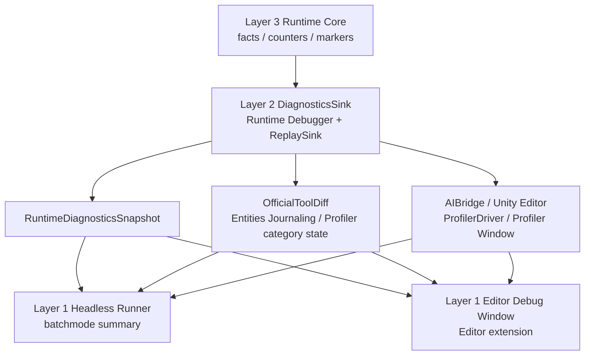
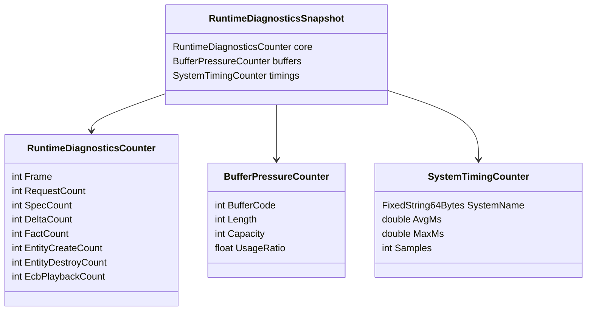
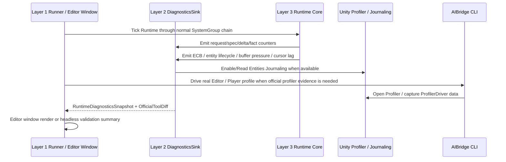

# Runtime Core Debugger Spec

## 目的

Runtime Core Debugger 用于回答“GAS 语义上发生了什么、哪些 Core 计数异常、哪些数据可以和 Unity 官方工具对齐”。在四层架构中，它的 Runtime 采样、snapshot、official tool diff 和 replay/export API 归属 **Layer 2 Runtime Boundary Layer** 的 `DiagnosticsSink` / `ReplaySink`，不是 simulation input，也不是 Unity Profiler 的替代品。

Editor Debugger Window 归属 **Layer 1 Application Shell Layer** 的 Editor Extension；无头 runner、AIBridge CLI 驱动和实机 Editor profile runner 也归属 Layer 1。二者必须消费同一套 Layer 2 `RuntimeDiagnosticsSnapshot` / official diff API，不能把窗口实现放入 Demo，也不能让 Demo 私有化 Debugger 数据链。

性能判断采用 **官方工具优先**：能用 Unity Profiler、Entities Profiler Modules、Entities Journaling、ProfilerRecorder / ProfilerDriver 和 AIBridge 真实 Editor / Player Runtime Bridge 获取的数据，不在项目内重复造完整 profiler。项目内 Debugger 只保留 GAS 语义 counter、thin snapshot、official tool diff 标记、无头可调用导出和必要的 runtime safety gate。

## 数据流图



## UML 类图



## 时序图：x50 性能诊断



## 四层职责边界

1. **Layer 3 Runtime Core**：只产出数值 counter、typed fact、presentation marker、replay marker，不读取 Debugger 结果改变 gameplay。
2. **Layer 2 Runtime Boundary**：维护 `GasRuntimeDebugger`、`RuntimeDiagnosticsSnapshot`、`GasRuntimeOfficialToolDiffCapture` 等采样与导出 API；可读 Unity Entities Journaling，Profiler module 未启用时只能输出 disabled reason。
3. **Layer 1 Editor Extension**：实现 Debugger Window、图表、筛选、导出按钮；窗口不得直接写 Runtime Core component / buffer。
4. **Layer 1 Headless Runner**：复用 Layer 2 API 输出 batchmode log、Mermaid 数据流图、时序图和 CI gate；它不是 Debugger 数据源。
5. **AutoChessDemo**：作为 Layer 1 业务验收 Demo，只消费 DiagnosticsSink，不拥有 Runtime Debugger 模块。
6. **Validation Evidence**：Headless runner、scene runner、AIBridge profile runner 必须把 DiagnosticsSink、OfficialToolDiff、Runtime timing 和业务结果合并成同一个 evidence model；字符串 summary、Mermaid 图和日志文件只是该 model 的导出格式，不是事实源。

## 必备 counters

1. request/spec/delta/fact/cue/presentation 计数。
2. entity create/destroy 与 ECB playback 次数。
3. transient buffer length/capacity/peak。
4. cursor lag / projection lag。
5. group/system timing aggregate（项目内只做薄采样，TopN / Timeline 以 Unity Profiler 为准）。
6. sync point / structural change phase / hot path structural violation。
7. query matched entity / chunk 数。
8. GC alloc per tick 与 managed callback count。
9. ActiveEffectStore owner / slot / capacity / state distribution / legacy-backed / externalized owner 计数。
10. official package version、PackageCache hash path、manifest / lock / actual version skew。
11. Burst AOT / Player 口径：Enable Burst、OptimizeFor、Safety Checks、CPU architecture、warning policy、warmup dropped ticks。
12. Boundary resource / managed component / Baking / prefab load state：managed bridge count、weak resource load state、`RequestEntityPrefabLoaded` / `PrefabLoadResult`、`IncludePrefab` policy。
13. Unity Physics 口径：physics step count、fixed-step cost、query count / batch size、broadphase sync count、collision event / trigger event count、event dropped / converted count。
14. Entities Graphics 口径：presentation marker cost、render proxy count、draw command、instances per draw、BRG marker、material override write count、render disabled reason。
15. bounded reaction pass 口径：pass count、command count、cutoff reason、next-frame seed count。

## Unity Entities 证据对齐

Runtime Core Debugger 是项目内证据源，但必须能与 Unity 官方工具对照：

| Unity 证据 | 项目内对应 |
|---|---|
| Profiler system markers | Unity Profiler / AIBridge-triggered `.data` capture 为主，`SystemTimingCounter` / group timing 只作无头兜底 |
| Entities Structural Changes | entity create/destroy/add/remove / ECB playback counters |
| Entities Journaling | structural event timeline / owner system |
| GC Alloc | `gcAllocBytesPerTick` |
| sync point | `syncPointCount` / `GASStructuralCommitSystemGroup` playback |
| query match | matched chunks / matched entities |

Debugger 不直接替代 Unity Profiler；它负责把 GAS 语义计数与 Unity ECS 机制计数绑定起来。实机 Editor / Player 调试默认通过 AIBridge 驱动 Unity 官方 Profiler 工具链，而不是在 GAS Runtime 内重复实现 profiler UI、timeline 或采样存储。

本轮 PackageCache 官方文档交叉检查后的硬约束：

1. Entities Journaling 可通过 `Unity.Entities.EntitiesJournaling` API 程序化读取，因此是当前无头链路的最小官方差分来源。
2. Unity Profiler / Entities Profiler Modules 是官方性能证据源；batchmode 未启用 module 时只能输出 disabled reason，真实 Editor / Player 则通过 AIBridge 调用 Profiler Window / `ProfilerDriver` 保存官方 `.data` capture。
3. Runtime Debugger 是项目自诊断，不能替代 Profiler / Entities Journaling / Burst Inspector；结论必须保留两套证据的差异。凡是官方工具能直接给出的数据，不在项目内重复造轮子。
4. Entities Journaling 会分配自己的记录内存；Layer 2 无头 official diff 若在 batchmode 中临时开启 Journaling，结束时必须恢复状态并清理本次采样产生的官方工具持久状态，避免污染 Runtime Core leak 验证。

## DOTS API 选型健康指标

Runtime Core Debugger 必须能解释 API 选型是否健康，而不只是记录运行结果：

| 选型维度 | Counter / Snapshot | 用途 |
|---|---|---|
| global buffer pressure | length / capacity / peak / spill / clear phase | 判断全局 DynamicBuffer 是否成为热点 |
| `NativeStream` merge | foreach count / block count / merge ms / allocator | 判断多 job fan-in 是否健康 |
| per-chunk skip | matched chunks / skipped chunks / skip reason | 判断 Chunk Component / chunk precheck 是否减少工作 |
| structural query batch | EntityQuery bulk count / `ComponentTypeSet` count / ECB playback count | 判断是否退化为逐实体结构变化 |
| singleton / system-associated state | singleton access count / dependency completion warning / cursor owner | 判断 singleton 和 system state 是否引入同步 |
| query / lookup | query count / lookup update count / random lookup count | 判断是否过多依赖随机访问 |
| reaction feedback | bounded pass count / next-frame seed count / cutoff reason | 判断 Gameplay Fact 是否形成同帧无界循环 |
| Burst evidence | Burst target count / warmup state / synchronous compile flag | 判断 hot path 是否真的 Burst 化 |
| deterministic output | sort key policy / stream partition / post-sort count / order violation count | 判断 gameplay 并行输出是否可复现 |
| NativeContainer owner | owner system / singleton / allocator / dispose state | 判断 Persistent / sampled container 是否泄漏或隐藏同步 |
| API proof marker | proofOnlyApi / scaleReadyApi / reselectTrigger | 区分 AM proof 承载和目标态承载 |
| query filter health | filtered / unfiltered entity count、changed chunk count、enableable wait | 判断 filter 是否真的降低工作量，是否隐藏同步等待 |
| chunk memory health | archetype count、chunk count、chunk capacity、unused entities、external components | 判断是否出现 chunk fragmentation、shared misuse 或过多 tag |
| DynamicBuffer storage | inline capacity、spill count、externalized buffer count、EnsureCapacity count | 判断 buffer 是否已经从 chunk-local 退化为外置 cache miss |
| allocator / arena | WorldUpdateAllocator、group allocator、TempJob、Persistent、rewind count、dispose handle | 判断 frame scratch 与长期 sink 生命周期是否正确 |
| dependency budget | read/write component set、system dependency wait、manual NativeContainer dependency | 判断 system/job 拆分是否造成无意义等待 |
| content / scene boundary | weak resource load state、SceneSystem structural count、SceneSection metadata count | 判断表现 / streaming 是否污染 Core hot path |
| official package evidence | package name / actual version / PackageCache hash path / manifest-lock skew | 判断官方文档证据是否可复核 |
| Burst AOT evidence | Editor or Player、Enable Burst、OptimizeFor、Safety Checks、CPU architecture、warning suppression、Inspector target | 判断性能数据是否混入 Burst 编译 / 设置差异 |
| managed boundary | managed component count、managed shared count、clone/dispose policy、GC allocation | 判断 Boundary / Presentation 是否反向污染 Core |
| prefab / baking boundary | embedded prefab count、EntityPrefabReference load state、PrefabLoadResult missing count、IncludePrefab query count | 判断 Demo / Cue / Summon 的资源和生命周期边界是否完整 |
| Unity Physics | physics step count / fixed step ms / query count / event count / broadphase sync | 判断物理输入是否成为热点，或是否错帧消费 |
| Entities Graphics | draw command / instances per draw / material override writes / BRG marker / render cost | 判断真实表现层是否健康，或是否污染 Core tick |

长期 cursor、phase state、sample sink owner 优先存 system-associated entity 或明确 singleton。Debugger hot path 只能写 numeric、FixedString、小型 counter 或 sampled stream；托管字符串 export 放 Boundary。

## AutoChess Validation Evidence Model

AutoChessDemo 是 Runtime Core、Debugger、Luban/SourceGenerator 和官方工具证据的交叉验收点。后续不再允许 headless runner、scene runner、Profiler pass、official diff pass 各自拼接不同字段。它们必须共享一个 `AutoChessValidationEvidence` 或等价结构，至少包含：

| 字段族 | 必填字段 | 目的 |
|---|---|---|
| battle result | completed、winner、expectedWinner、battleTicks、totalTicks、units、scale、summaryHash、factsHash | 验证业务闭环和确定性 |
| core counters | commandCount、specCount、deltaCount、factCount、cueCount、presentationCount | 验证 GAS 语义链 |
| timing split | coreTickMs、observationTickMs、presentationTickMs、debuggerTickMs、exportMs、bootstrapMs | 防止把 Boundary / export / Editor 成本混入 Core |
| API health | proofOnlyApi、scaleReadyApi、reselectTrigger、globalBufferPressure、randomLookupCount、lookupUpdateCount、nativeStreamMergeMs、deterministicOrderPolicy | 证明当前承载不是盲目固化 proof API |
| official evidence | journalingAvailable、journalingCaptured、profilerAvailable、profilerCaptureState、packageCachePath、packageVersion、manifestLockSkew | 与 Unity 官方工具和本地 PackageCache 对齐 |
| world policy | worldTimePolicy、fixedStepRate、fixedStepCount、editorFrameDeltaUsed、warmupDroppedTicks、measurementTicks | 固定步和 performance measurement 口径 |
| boundary profiles | physicsDisabledReason / physics metrics、entitiesGraphicsDisabledReason / render metrics、managedBoundaryPolicy、prefabLoadResultState | 确认无头没有删除表现/资源链路 |
| validation expectation | requiredFactKinds、requiredCueMarkers、thresholdId、thresholdPass、forbiddenWarnings、blockingDebugErrors | 自动验收不依赖人读日志 |

Validation evidence 的生成规则：

1. Headless runner 和 scene runner 只能在 tick pump、Profiler driver、输出路径和资源 bridge 上不同；evidence 字段必须同构。
2. `proofOnlyApi` 不是 warning 文案，而是机器可读字段。若存在 proof-only API，必须同时输出 `reselectTrigger`；否则 x1000 以上 profile 不得通过。
3. Official diff pass 可以与 performance pass 分离，但 evidence 必须记录这是 separate pass，并对比 command / fact / cue 关键计数是否一致。
4. Debugger snapshot 可缺省关闭以避免污染 performance pass；此时 evidence 必须标记 `debuggerEnabled=false`，并由 diagnostic pass 补足 counters。
5. Mermaid 数据流图、时序图、中文战斗日志从 evidence 和 structured log 派生，不反向参与 validation。

## 官方案例对齐

Debugger 的自动验收形态必须吸收官方 PerformanceTests 的写法：固定实体规模、warmup、measurement、allocator cleanup 和按 SampleGroup / TopN 输出，而不是单一平均值。参考 `UnityDOTS官方文档参考/主题/12-官方案例模式.md` 的 `CASE-12`。

Runtime summary 需要额外输出 `casePattern` / `caseViolation` 字段，用来标记当前 hot path 是否符合官方案例模式：

| CASE | Debugger 需要证明 |
|---|---|
| `CASE-01` | hot path 是否仍使用主线程 `SystemAPI.Query` 扫大规模实体 |
| `CASE-04` | enableable / chunk skip 是否用 `ChunkEntityEnumerator` / `EnabledMask`，skip count 是否有效 |
| `CASE-07` | DynamicBuffer 是否有 internal capacity、spill、clear phase 和 Append 目标稳定性 |
| `CASE-08` | ECB 是否只在 `GASStructuralCommitSystemGroup` 播放，是否有 sort key policy |
| `CASE-10` | Definition 是否进入 Blob / Baker / generated lookup，而不是 runtime managed config |
| `CASE-11` | Scene / WeakObjectReference / UnityObjectRef 是否只在 Boundary / Presentation 产生 load marker |
| `CASE-12` | performance summary 是否包含 warmup、measurement、p95/max、TopN、allocator cleanup |

## 官方文档覆盖对齐

Debugger 必须先对齐 `UnityDOTS官方文档参考/README.md`，再吸收 `UnityDOTS官方文档参考/主题/21-官方文档覆盖与流程闭环.md` 的 `ODF-*` 规则。Runtime summary 需要额外输出 `officialDocTopic` / `odfRule` / `unityToolEvidence` 或等价字段，用来标记当前热点是否已经具备官方文档证据闭环：

| ODF / 主题 | Debugger 需要证明 |
|---|---|
| `ODF-01` 官方文档包 | 当前任务是否读取官方文档参考体系主题入口，并引用 `UnityDOTS官方文档参考/主题/*` 中相关文件 |
| `ODF-06` API 选型覆盖 | 当前 proof API 是否存在重新选型触发条件 |
| `ODF-07` 官方工具证据 | 项目 counter 是否能映射到 Systems window、Query window、Profiler、Journaling 或 Binary debugging |
| Sync point / direct reference | 是否存在结构变化后继续读写 buffer / lookup / handle 的风险 |
| System / job 固定开销 | system count、job count、lookup update count、schedule overhead 是否异常 |
| Chunk / buffer 质量 | chunk utilization、unused entities、buffer externalized、shared unique value 是否异常 |
| Allocator rewind | WorldUpdateAllocator / group allocator / Persistent owner / dispose 是否符合生命周期 |
| World time / deterministic | fixed step、world time、warmup dropped tick、battle hash 是否可复现 |
| PackageCache version evidence | official package version、hash path、manifest / lock 差异是否输出 |
| Burst AOT / Inspector evidence | Player AOT 设置、OptimizeFor、warning policy、Inspector target 是否可追溯 |
| Managed / prefab / baking boundary | managed resource clone / dispose、EntityPrefabReference load、Baking world 策略是否被记录 |
| `ODF-15` Unity Physics 时序 | `PhysicsSystemGroup`、FixedStep、`PhysicsWorldSingleton` / `SimulationSingleton`、query broadphase 和 event 有效窗口是否记录 |
| `ODF-16` Physics 配置生成 | collider / body / filter 是否来自 Definition & Generation，runtime 修改 collider 是否说明共享 blob 和时序风险 |
| `ODF-17` Entities Graphics 边界 | URP/HDRP、single render world、`RenderMeshArray` / `MaterialMeshInfo` 和 `RenderMeshUtility.AddComponents` 边界是否记录 |
| `ODF-18` Render evidence | `coreTickMs`、presentation marker cost、Entities Graphics render cost 是否拆分，并有 draw command / BRG / Profiler 证据 |

## 官方工具对照矩阵

项目内 Debugger 必须能和 Unity 官方工具形成最小闭环：

| 项目内问题 | 官方工具 / 文档机制 | 对照方法 |
|---|---|---|
| 结构变化过多 | Entities Structural Changes Profiler / Entities Journaling | 按 world -> system -> create/destroy/add/remove 对照 `structural query batch` 和 ECB playback |
| chunk 利用率差 | Entities Memory Profiler / Archetypes window | 对照 archetype count、chunk count、unused entities、external components |
| query filter 无效 | Query filtered / unfiltered count + change version | 对照 changed chunk count、ignore filter count、enableable wait |
| Burst 未真实生效 | Burst Inspector / warmup marker | 对照 Burst target count、synchronous compile flag、first tick dropped |
| job 调度过碎 | Profiler system marker / job marker | 对照 system count、job count、schedule overhead、TopN |
| allocator 泄漏或生命周期错误 | Collections safety / dispose / rewind marker | 对照 allocator owner、Persistent dispose、TempJob age、rewind invalidation |
| resource / scene 污染 Core | SceneSystem structural count / weak reference load state | 对照 Boundary load marker，不允许 Core tick 等待资源 |
| Player AOT 与 Editor 数据混淆 | Burst AOT Settings / Burst Inspector | 对照 Enable Burst、OptimizeFor、Safety Checks、CPU architecture、warning policy、warmup dropped ticks |
| managed 表现桥污染 Core | Managed component 文档 / GC Alloc | 对照 managed bridge count、GC alloc、clone/dispose policy，Core tick 内必须为 0 |
| prefab 加载状态缺失 | Entity prefab / SceneSystem 文档 | 对照 RequestEntityPrefabLoaded、PrefabLoadResult、IncludePrefab query policy |
| 物理输入错帧或过慢 | Unity Physics pipeline / singleton / event 文档 | 对照 physics step、query broadphase、Simulation event window、event dropped / converted count |
| 渲染成本混入 Core tick | Entities Graphics performance / Frame Debugger / Profiler | 对照 draw command、instances per draw、BRG markers、presentation marker cost 和 render cost |

## 历史 PlayMode 实机证据

2026-05-29 使用 AIBridge 1.4.1 驱动真实 Unity Editor PlayMode，加载当时仍带旧命名的 `Assets/AutoChessDemo/Presentation/Scenes/HeadlessAutoChessDemo.unity`，由历史 `HeadlessAutoChessDemoSceneRunner` 在 MonoBehaviour Coroutine 内控制 Unity Profiler 采集窗口并跑通 x50。该段只保留 warmup-dropped + 30 秒 Runtime-only PlayMode、official diff 和 Profiler `.data` capture 的历史证据口径，不再作为当前 AutoChessDemo 命名、目录或 runner 事实。当前事实以 `AutoChessLogDemo.unity` / `AutoChessDemoSceneRunner` / `AutoChessRuntimeRunner` 以及 `GameRoom -> Battle -> Integration/GasCore -> Battle/Ecs -> Observation/Result -> Presentation` 链路为准。

性能 pass 关闭 Runtime Debugger 和 presentation raw fact 投影，只保留 replay / required facts；Diagnostic pass 再打开完整 Layer 2 观测链，用来输出数据流图、时序图和 Runtime Debugger counters。这是 Debugger 和 Unity 官方工具的差分边界，避免把 Layer 2 presentation / debugger 成本混入 Runtime Core 性能判断。

```text
completed=True, winner=Player, scale=50, units=200,
battleTicks=4130, totalTicks=4131, warmupDroppedTicks=3, measuredTicks=4128,
commands=478300, finishers=244800, attributeChanges=478250,
executionOutputs=244750, cueRequests=233500,
debugEvents=0, debugWarnings=0, debugErrors=0, blockingDebugErrors=0,
coreRequests=0, coreFacts=0, coreDeltas=0, coreCues=0,
peakEventBus=0, replayLag=0, journalingRecords=524288,
processWarmupRuns=1, totalElapsedMs=30004.994,
factsHash=0xEBE6E5B3, summaryHash=0x94F5D7CC, avgTickMs=1.561
```

Timing snapshot：

```text
ecsRuntimeTickOnly=true
GASTickTotal(samples=4128, avgMs=1.548, maxMs=34.517)
GASFramePrepareSystemGroup(samples=4128, avgMs=0.042, maxMs=0.262)
GASCommandResolveSystemGroup(samples=4128, avgMs=0.612, maxMs=2.056)
GASCoreSimulationSystemGroup(samples=4128, avgMs=0.747, maxMs=2.202)
GASStructuralCommitSystemGroup(samples=4128, avgMs=0.020, maxMs=0.169)
GASBoundaryProjectionSystemGroup(samples=4128, avgMs=0.128, maxMs=32.746)
```

Official tool diff：

```text
journalingAvailable=True, journalingCaptured=True, journalingWorldRecords=524288,
runtimeStructuralApprox=0, journalingStructural=0, deltaStructural=0,
runtimeCreates=0, journalingCreates=0, deltaCreates=0,
runtimeDestroys=0, journalingDestroys=0, deltaDestroys=0,
journalingAddComponents=0, journalingRemoveComponents=0,
journalingEnableComponents=80400, journalingDisableComponents=40305,
journalingSetComponentData=0, journalingSetBuffer=0,
journalingGetComponentDataRW=210478, journalingGetBufferRW=193105,
profilerAvailable=True, profilerEnabled=False,
structuralProfilerCategoryEnabled=True, memoryProfilerCategoryEnabled=True,
profilerCaptureState=profiler disabled; Entities profiler modules collect no data
```

Unity Profiler `.data` capture：

```text
Temp/AutoChessDemo-PlayMode-X50-RuntimeProfile.data
saved=True, driverSaved=True, binaryLogBytes=44620948,
firstFrameIndex=3616, lastFrameIndex=4127,
profileEditor=False, profilingEnabled=False
```

解释：

1. `blockingDebugErrors=0` 表示功能 gate 没有非 timing 类诊断错误；`debugErrors=0` 表示慢 timing 事件已经从错误语义中拆出。`SystemTiming` / `TickSummary` 最高只产生 Warning，用 slow timing / TopN 解释性能，不污染功能错误计数。
2. x50 历史证据代表 50 组独立 2v2 并行跑在同一个 ECS World，用数量模拟真实游戏规模；当时的 battle driver / AI 已按 BattleGroup 缓存目标，避免 Demo O(n^2) 全局搜敌污染 Runtime Core 判断。当前文档不再使用 `AutoBattle` 作为业务域命名。
3. 旧 7 tick 数据不符合 DOTS 性能判断要求，根因是采样过短、Profiler 只有 0-1 frame、以及 `RefreshUnits` 在 system 外用 `EntityManager.GetBuffer` 污染 `NoExecutingSystem`。当时胜负判断已改为 battle driver 在 ECS 内写 alive counters，30 秒窗口提供稳定曲线；当前 runner 必须通过统一 battle run loop 产出同构 validation evidence。
4. AIBridge 1.4.1 当时已接入项目并通过真实 Unity Editor PlayMode 跑通：`compile unity` 成功、Error 日志 0、`Window/Analysis/Profiler` 可由 CLI 打开，历史 scene runner 通过 Runtime-only binary log 保存官方 capture 到 `Temp/AutoChessDemo-PlayMode-X50-RuntimeProfile.data`。该文件位于 ignored `Temp/`，作为本机历史证据，不纳入版本控制。
5. 当前 official diff 的 create/destroy/add/remove 结构变化为 0；enable / disable component 是 enableable toggle，不再归入 structural change。`journalingWorldRecords=524288` 已到 Entities Journaling 记录上限，因此只用于 TopN 热点方向，不把绝对值当完整总量。
6. PlayMode capture 必须使用 Runtime-only 模式；若 `profileEditor=True`，`.data` 会混入 Editor / package 样本并导致文件膨胀，不能用于 Runtime Core 归因。
7. 后续 Debugger 不再扩展成自研 profiler UI。Layer 2 保留无头 snapshot 和 official diff；Layer 1 Editor Extension / AIBridge / Unity Profiler 负责可视化、timeline、TopN、Profiler capture 和实机工具差分。
8. 当前剩余性能热点是真实 Runtime/Core 设计问题：generated catalog commit、ability command resolve、ability cleanup、attribute recalculation、stream prepare 和 replay/fact projection 仍有主线程随机访问、enableable 写入与短系统拆分成本；这些应通过 dirty attribute set、chunk-local batch、generated lookup cache 和 command fan-in 架构迭代解决，而不是增加项目自研 profiler。

## Profile Summary 读取分析机制

原始 PlayMode summary / official diff / Debugger 文本不再直接人工阅读。当前统一使用：

```powershell
.\Tools\Diagnostics\Analyze-AutoChessProfile.ps1 -PrintMarkdown
```

脚本输入默认是 `TestResults/AutoChess/T6-CHESS-AF-SceneRuntime/AutoChessPlayModeProfileSummary.txt`，输出 ignored 产物 `TestResults/AutoChess/Analysis/AutoChessProfileAnalysis.json` 和 `.md`。它必须完成以下结构化归因：

1. 解析 performance、timing、Debugger、Diagnostic pass、official tool diff、Profiler capture 六类行。
2. 输出 `CommandResolve / CoreSimulation / StructuralCommit / BoundaryProjection` cost split。
3. 把 `GetComponentDataRW`、`GetBufferRW`、`EnableComponent`、`DisableComponent` 折算为每 measured tick 预算。
4. 解析 Journaling `recordTopN / systemTopN / componentTopN`，把热点落到具体 system 与 component。
5. 计算 Debugger drop rate、Journaling cap、ProfilerDriver frame window，避免把采样工具自身限制误判为 Runtime Core 事实。
6. 输出 `证据 -> 推断 -> 架构失误 -> 下一步 probe`，供 spec 与后续重构直接引用。

本轮脚本反推的架构失误：

1. **随机 lookup 仍是 Runtime Core 形状问题**：x50 为 `GetComponentDataRW=51.0/tick`、`GetBufferRW=46.8/tick`，TopN 集中在 `AbilityCatalogCommitSystem`、`AttributeRecalculateSystem`、`AbilityStateCleanupSystem`。这与 Entities 官方 `systems-systemapi.md` 对 lookup access / sync 的说明、`systems-optimizing.md` 对 lookup 更新和 system 固定开销的说明一致：当前不是缺 profiler，而是 ability commit / cleanup / attribute store 这些模块的 interface 太浅，调用者仍要理解并支付低层 ECS lookup。
2. **Enableable 被正确用于避免 structural change，但被错误用成高频生命周期协议**：当前 create/destroy/add/remove 为 0，enableable toggle 为 `29.2/tick`。官方 `structural-changes-enableable-components.md` 明确 enableable 不产生 structural change，但也会影响访问对应 archetype 的 job / system；`components-enableable-use.md` 也要求 random-access enable/disable 避免和其他 job 竞态。当前问题不是“改回 Add/Remove”，而是减少 per-command `AbilityCommitRequestComponent` / `AbilityEndRequestComponent` flip，改为 owner-local command state 或 chunk batch。
3. **架构优化优先级曾过度盯 structural change**：CommandResolve + CoreSimulation 占 `87.8%`，StructuralCommit 只有 `1.3%`。后续 gate 应优先看 RW lookup budget、dirty-set 大小、command fan-in 成本和 system count，而不是只看 ECB / structural count。
4. **Attribute store 缺少 dirty owner / dirty attribute set**：`AttributeValueBuffer` 是最大 component RW 热点（`95,150` 次，`23.0/tick`）。这说明 AttributeRecalculate 仍接近“广义 owner buffer 重读写”，没有把 attribute delta 压成最小 dirty 集合。
5. **诊断层原先偏 raw event log，不适合 x50 常态**：Debugger `events=4096`、`dropped=18262`，drop rate `81.7%`；Journaling 达到 `524,288` 上限。Layer 2 Debugger 必须默认输出聚合 counters / TopN / official diff，raw trace 只能短窗口 opt-in。
6. **ProfilerDriver metadata 不能单独代表 30 秒全量曲线**：本轮 `firstFrameIndex=3616,lastFrameIndex=4127` 只有 512 frame window；30 秒证据以 `UnityEngine.Profiling.Profiler` binary log 文件存在和大小为主，ProfilerDriver save 只是补充。

## AM-1 baseline 采样口径

1. `runtimeCoreCounters` 输出累计 request/spec/delta/fact/cue/presentation、entityCreates、entityDestroys、ecbPlaybacks。
2. `runtimeCoreCountersPeak` 输出 activeEffectEntities、applyRequestEntities、eventBusBufferLength、presentationCursorLag、replayCursorLag。
3. AM-2 开始接入 EffectCommand / Spec/Delta/Fact 语义链 / AttributeDelta 权威 stream 计数；在 simple instant evaluation 迁移完成前，旧 EventBus 和 GE runtime entity 采样仍作为迁移期近似量级。
4. ECB playback baseline 可以先覆盖主要工具路径；最终验收需要能按 system / phase 定位结构变化预算。
5. AM-5 owner-local ActiveEffectStore baseline 输出 `runtimeCoreActiveEffectStore`，字段包括 owners、slots、capacity、pendingApply、active、inhibited、pendingRemove、legacyBacked、externalizedOwners；compact / cleanup / chunk skip 在对应 store 层实现后继续扩展。

## 禁止方向

1. Runtime system 读取 Debugger 结果改变 gameplay。
2. 在 hot path 拼接托管字符串或调用 `string.Format`（含 Debugger hot path）。
3. 把 Debugger 和 Replay 合并为同一事实流。
4. 只输出 `avgTickMs`，不输出结构变化、sync point、buffer pressure、query match 和语义计数。
5. 只输出 Physics / Graphics enabled 状态，不输出相关 counters 或 disabled reason。
6. 把 Physics fixed-step、Presentation marker 或 Entities Graphics render cost 混入 Runtime Core tick 后直接归因 GAS Core。

## 验收

**性能数据默认采样口径**：所有性能数据默认以 `ecsRuntimeTickOnly` 为采样口径。涉及 Physics / Presentation / Entities Graphics 成本叠加的结论须单独标注污染来源。此声明对应 `90-目标态不变量.md` 第 13 条和 `03-RuntimeCore管线Spec.md` 的 timing budget 定义。

1. x1 默认链路通过且输出 diagnostics summary。
2. x50 能输出热点系统、buffer pressure、entity lifecycle 计数。
3. system timing 报告必须标注是否污染 `ecsRuntimeTickOnly`。
4. Runtime Core Debugger counters 能与 Unity Profiler / Entities Journaling 的结构变化证据对照。
5. Debugger summary 必须输出 `SEL-*` API 选型健康指标：global buffer pressure、NativeStream merge、per-chunk skip、structural query batch、singleton dependency warning。
6. Debugger summary 必须能标记 proof-only API，并输出重新选型触发条件；否则 AM2/AM3 的临时承载容易被误判为最终目标态。
7. Debugger summary 必须输出 `ODF-*` 官方文档覆盖检查结果，并能说明哪些官方工具或文档机制可验证当前热点。
8. 涉及 Physics / Graphics 的验证必须输出 `PHY-*` / `GFX-*` 相关 counters；未启用时必须输出 disabled reason，避免把无头缺省误判为链路缺失。

## 历史方案定位

1. GASDebugger 结构化日志、Mermaid 时序导出和属性变化查询来自 `../历史方案参考/方案15.md:529-622`。
2. 自走棋 Debug 工作流中通过 GASDebugger 排查数值异常来自 `../历史方案参考/方案15.md:1214-1253`。
3. 完整 Debug workflow 和中毒爆发场景时序导出来自 `../历史方案参考/方案15.md:2661-2794`。
4. 固定容量结构化日志 / ring buffer 的参考来自 `../历史方案参考/方案14.md:635-694`。
