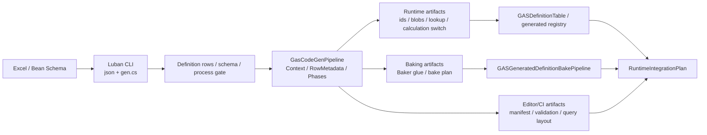
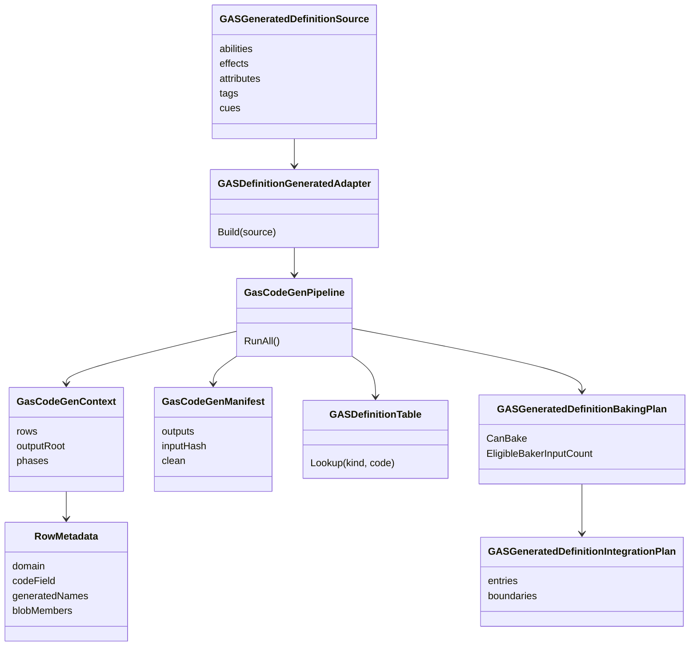
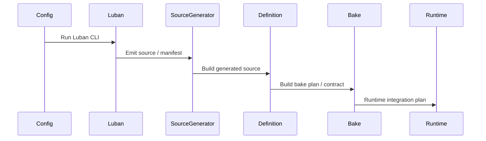

# Luban / SourceGenerator 配置生成链路 Spec

## 目的

定义从 Excel / Luban 到 Definition & Generation Layer、Generated artifact、Bake plan、Runtime static lookup 的完整链路。

## 数据流图

## UML 类图

## 时序图：真实 Luban gate

## 核心契约

1. Luban 和 SourceGenerator 只生成 Definition & Generation Layer 输入和 static lookup glue。
2. Generated adapter 不持有 `Entity`、`BlobAssetReference`、Editor、spec/context/runtime state。
3. Bake plan / contract / pipeline 不生成 gameplay lifecycle。
4. Runtime integration plan 只描述落点和 deferred boundary。
5. 生成链路必须是“输入收集 -> Row metadata 规范化 -> Phase 输出 -> manifest / validation report”的显式管道；不得让多个生成器各自重复扫描程序集、重复推断命名和重复写出 header。
6. Runtime Core 可消费的 static lookup 必须是 Burst 可读的 unmanaged / blob lookup，或带明确 allocator owner / dispose 责任的 Native container；托管数组、`Dictionary`、`Func<>` 只允许留在 Editor / CI / Baking 边界。
7. Ability / GE / Modifier / TagRequirement 的 Blob builder 必须从 Luban row、generated definition 或 Baker 输入直接构建，不从 prototype entity、runtime component 或 active effect state 反推静态定义。
8. Baker glue 必须生成真正的 `Baker<TAuthoring>` 或显式标注的 Baking System plan；静态方法 + `EntityCommandBuffer` 只能作为迁移期工具，不是目标态 Baker 契约。
9. Luban 生成的 C# 必须留在 Unity 编译域内（默认 `Assets/DataGenerated/Luban/CSharp`），因为它是配置事实、row / table API 和后续 baking/source generation 的输入边界。`cfg.*`、`Luban.Runtime`、`SimpleJSON` 的编译错误是表源链路失败，不允许通过挪出 `Assets` 隐藏。
10. GAS Runtime package contract 中不得出现 `cfg.*`、`XLuban`、`SimpleJSON` 或 Luban managed row 直接引用；这些类型只能存在于 Luban compile boundary、Definition / Baking / Editor 侧，SourceGenerator 必须把它们转换成 Runtime Core 可消费的 id、Blob、unmanaged lookup 和 component type set。
11. Runtime Core lookup 必须是 O(1) 或 O(log n) 且可报告数据规模；`GASDefinitionTable` 这类线性扫描表不得进入 hot path。

## Luban 与 SourceGenerator 职责边界

| 环节 | 允许职责 | 禁止事项 |
|---|---|---|
| Luban CLI | 读取 Excel / schema，输出 JSON、bean、表行源码、稳定 id 原始事实和 process gate 结果 | 生成 Runtime Core lifecycle system；让 `cfg.*` 成为 Runtime Core 依赖 |
| Gas CodeGen Pipeline | 收集 DefinitionRow / schema metadata，统一推断 RowMetadata，按 Phase 输出 ids、Blob schema / builder、lookup、Baker glue、query hint、validation graph 和 manifest | 每个 Phase 自行全量反射扫描；硬编码项目名前缀；分散维护 code field / blob type / component type 推断 |
| Baking | 把 generated definition / authoring 输入转换为 `BlobAssetReference<T>`、Baker output、BakingOnly / TemporaryBaking data 和 report | 从 runtime entity 或 prototype component 反推静态定义；在 Baker 中读取其他 Baker 的输出 |
| Runtime Core | 只读取 generated id、Blob、static lookup、generated component type 和 validation 允许的常量 | 运行时反查 JSON、managed Luban row、ScriptableObject 或 Editor-only registry |
| Editor / CI | 输出 config diagnostics、official DOTS coverage、query layout、buffer capacity、Burst AOT / Player evidence、orphan generated file report | 把诊断结构作为 gameplay 决策输入 |

### Luban Unity 编译边界

Luban C# 输出不是临时脚本缓存，也不是应当绕开 Unity 编译的外部产物。当前目标态固定为：

1. `TableClassCodeOutpuPath` 默认指向 `Assets/DataGenerated/Luban/CSharp`，由 Unity 正常编译 `cfg.*` 表行、bean、多态配置和 `Tables` API。
2. `Assets/Plugins/LubanRuntime/Luban.Runtime.dll` 与 `Assets/Plugins/LubanRuntime/SimpleJSON.dll` 是该编译边界的显式依赖；缺失时应让生成/编译失败。
3. `Assets/DataGenerated/Luban/Json/GAS` 是 JSON 数据输出边界；可被 loader / authoring / baking 使用，但 Runtime Core hot path 不直接查询。
4. `Assets/GAS/Generated/CodeGen/Runtime` 是 GAS SourceGenerator Runtime 输出边界，只允许依赖 GAS Runtime 与 Unity DOTS 基础程序集，不引用 `cfg.*`、`Luban.Runtime`、`SimpleJSON`、JSON reader 或 managed row。
5. `Assets/GAS/Generated/CodeGen/Editor` 是 Editor/Baking 输出边界，可引用 row source assembly，把 Luban / row 事实转换为 BlobAsset、Baker 输出和诊断报告。

## 生成器内部架构目标

生成器实现应收敛为 `GasCodeGenPipeline + GasCodeGenContext + RowMetadata + IGasCodeGenPhase` 形态：

1. `GasCodeGenContext` 只构建一次，包含输出目录、命名空间、所有 RowMetadata、按领域分组的 ability / GE / attribute / tag / cue / unit / scenario 行。
2. `RowMetadataFactory` 集中处理 row type 前缀、code field、blob schema、lookup 名称、Baker 名称、component type 和 blob member 映射；新增 DefinitionRow 类型优先新增 provider，而不是修改多个 Phase。
3. `IGasCodeGenPhase` 单一职责输出一个或一组文件；Phase 只消费 context，不自行扫描程序集、不自行推断全局命名、不自行决定输出根目录。
4. `GasCodeGenManifest` 记录所有生成文件、输入 hash、Phase 名称和输出路径，用于清理孤儿 `.g.cs`、检查路径逃逸和支撑 CI diff。
5. `GasCodeGenSettings` 或等价配置承载项目名前缀、generated namespace、输出目录、manifest 策略和是否写入版本控制；禁止在生成器中硬编码 `HeadlessAutoChess` 之类项目前缀。

“SourceGenerator”在本 Spec 中指确定性源码生成子系统。Roslyn `IIncrementalGenerator` 是更长期的理想形态；若当前阶段仍通过 Unity Editor menu / offline tool 触发，也必须满足同一套输入、manifest、Phase、层级归属和 Runtime 依赖隔离契约。

推荐 Phase 切分：

| Phase | 输出 | Runtime 可见性 |
|---|---|---|
| Assembly definition phase | generated runtime/editor asmdef、row source assembly references | asmdef 可见；Runtime asmdef 不引用 row source，Editor asmdef 可引用 row source |
| Id / Tag bit phase | `XAttr`、`XTagBit`、`XGE`、`XAbility`、`XCueCode`、`TagCheck` | 可见；必须 Burst 友好 |
| Attribute component phase | `HealthAttribute`、`ManaAttribute` 等每属性独立 `IComponentData` | 可见；只生成数据类型和访问器，不生成 lifecycle |
| Blob schema / builder phase | `GameplayEffectDefinition`、`AbilityDefinition`、`BuildFromRow` / `BuildFromDefinition` | Blob 可见；builder 多数在 Baking / initialization 使用 |
| Static lookup phase | id -> `BlobAssetReference<T>` / compact lookup | 可见；必须 unmanaged / Burst 可读 |
| Calculation phase | `MmcTypeId`、`MmcEvaluator.Evaluate()` static switch | 可见；禁止托管 delegate / 可变 registry |
| Baker glue phase | `Baker<TAuthoring>`、`DependsOn()`、`AddBlobAsset()`、custom hash | Baking 可见；不进入 Runtime Core tick |
| Scenario / validation phase | build plan、validation expectations、diagnostics report | Scenario 常量可见；validation / report 不参与 gameplay |
| Query / capacity hint phase | query layout、read/write set、buffer capacity、TransformUsageFlags、ODF coverage | Editor / CI 为主；Runtime 只消费经确认的常量 |

## Unity Entities 校准

Definition & Generation Layer 的目标落点必须区分：

| 产物 | Unity 承载 | 进入 runtime hot path |
|---|---|---|
| id / enum / stable code | generated source | 可以 |
| static lookup | generated unmanaged table / blob lookup | 可以 |
| Ability / GE / Modifier / TagRequirement 定义 | `BlobAssetReference<T>` | 可以 |
| Authoring / generated config 转换 | Baker / bake pipeline | 不在运行时执行 |
| runtime integration plan | validation metadata | 不参与 gameplay 计算 |
| Editor / CI diagnostics | Editor / test assembly | 不进入 Runtime Core |

SourceGenerator 可以生成 Blob builder、lookup、validation 和 Baker glue，但不能生成 ActiveEffect lifecycle system 或直接写 `EntityManager` 的 runtime 执行逻辑。

## DOTS API 选型修正

配置生成链不只是把 Excel 行转为 C# 常量。目标态需要把生成产物落到 Unity 官方推荐的 authoring / baking / runtime 数据边界：

| 场景 | 推荐承载 | 适用规则 | 约束 |
|---|---|---|---|
| Ability / GE / Modifier / TagRequirement 静态定义 | BlobBuilder + `BlobAssetReference<T>` | `CASE-07` `CASE-24` `BLOB-01` `BLOB-02` | Runtime Core Burst 可读，不携带 runtime state |
| 大批量 authoring 转换 | Baker / Baking System | `CASE-32` `CASE-39`~`CASE-41` `BAKE-01`~`BAKE-03` | Baker 无状态、只添加不读取；Baking System 需手动维护依赖和回滚语义 |
| generated runtime lookup | unmanaged static lookup / blob lookup / generated id | `CASE-07` `CASE-46` | 不反查 managed Luban row |
| Cue / UI / VFX / SFX 资源引用 | `WeakObjectReference` / `UnityObjectRef` | `CASE-43` `CONTENT-01` `CONTENT-02` | 只属于 Boundary / Presentation，不进入 Core 决策 |
| prefab-like group | LinkedEntityGroup / authoring prefab | `CASE-37` `CASE-42` `PRF-11` | 用于实例化/销毁组合，不作为 gameplay hot path 状态机 |
| Demo / 大世界加载 | SubScene / Streaming | `CASE-43` `CASE-44` | 只负责内容组织和加载边界 |
| Transform 数据 | `TransformUsageFlags` | `CASE-19` `CASE-29` `PRF-18` | 按真实表现需求选择，避免无用 transform component |
| Physics 配置 | `PhysicsCollider` blob、`CollisionFilter`、Physics category、query profile | `PHY-01`~`PHY-05` `CASE-09` | 生成 target / hit / event 输入数据；Runtime Core 不反查托管 physics row |
| Render 配置 | `RenderMeshArray`、`MaterialMeshInfo`、material override schema、render profile | `GFX-01`~`GFX-05` `CASE-10` | 只进入 Presentation / Boundary；无头可生成 log marker binding |

SourceGenerator 可以生成 BlobBuilder、Baker glue、validation graph、query layout hint 和 static lookup，但不能生成 Runtime Core lifecycle system，也不能隐藏结构变化。

## 官方案例校准

本链路必须对齐 `UnityDOTS官方文档参考/主题/12-官方案例模式.md` 中的 `CASE-07`/`CASE-10`/`CASE-11`，以及 `UnityDOTS官方文档参考/主题/16-官方案例模式-高级.md` 中的 `CASE-39`/`CASE-40`/`CASE-41`：

1. `CASE-07`：Baker 只做 authoring / generated config 到 ECS / Blob 的转换，并显式声明外部依赖。
2. `CASE-39`（Baker 只添加不读取）：Baker 之间无依赖关系，**禁止**在 Baker 中读取已有 component 的数据、禁止访问其他 entity。所有依赖通过 `DependsOn()` 表达，数据只通过添加 component 输出。
3. `CASE-40`（Baker 必须无状态）：Baker 是单例实例，`Bake()` 可能被多次调用且无序，**禁止**在 Baker 字段中缓存状态。若需跨 entity 传递信息，使用 `TemporaryBakingType` + Baking System（`CASE-32`）。
4. `CASE-41`（Baking System 必须手动追踪依赖和增量还原）：Baking System 不自动记录依赖，entity 不会进入 baked scene。**必须**通过 `GetEntityQueryBuilder()`、`GetComponentTypeHandle()` 等显式声明依赖；增量 baking 时需手动还原上一批次的 artifacts。
5. `CASE-10`：Baking System 只做 bake-time 批量后处理、校验和 metadata，不生成 runtime gameplay lifecycle。
6. `CASE-11`：BlobBuilder / AddBlobAsset / custom hash 是 Ability / GE / Modifier / TagRequirement / Cue 静态定义进入 Burst Runtime Core 的默认路径。
7. WeakObjectReference / UnityObjectRef / SceneSystem / TransformUsageFlags 只作为 Boundary / Presentation / Authoring 计划输出，不进入 Core 决策。

## 官方文档覆盖校准

本链路还必须先对齐 `UnityDOTS官方文档参考/README.md`，再对齐 `UnityDOTS官方文档参考/主题/21-官方文档覆盖与流程闭环.md` 中的覆盖矩阵和 `ODF-*` 规则：

| 覆盖主题 | 生成链路输出 |
|---|---|
| Baking dependency / output filter | Baker dependency summary、`BakingOnlyEntity` / `BakingType` / `TemporaryBakingType` policy |
| Baking world / phase | conversion world、shadow world、main world、Baker phase、Baking System group policy |
| Content management / weak resource | WeakObjectReference / UntypedWeakReferenceId load / release plan，Boundary only |
| Transform stale-data policy | TransformUsageFlags、LocalTransform / LocalToWorld 读取边界 |
| Entity prefab / LinkedEntityGroup | embedded entity prefab、`EntityPrefabReference`、`RequestEntityPrefabLoaded`、`PrefabLoadResult`、`IncludePrefab`、prefab-like bundle lifetime policy，禁止和 transform hierarchy 混用 |
| Mathematics deterministic state | RNG seed / state / radians 转换生成规则 |
| Burst vectorization / FunctionPointer | generated static switch / FunctionPointer 粗粒度候选和 Burst Inspector target |
| Burst AOT / Player evidence | generated calculation 是否进入 Player AOT target、OptimizeFor、warning suppression policy |
| Query / buffer hint | query layout、read/write set、InternalBufferCapacity、spill trigger |
| Unity Physics | collider primitive / mesh hint、CollisionFilter、PhysicsWorldIndex、event opt-in、query profile、FixedStep policy |
| Entities Graphics | RenderMeshArray / MaterialMeshInfo binding、material override schema、render proxy prototype、draw evidence policy |

## DOTS 深读后的生成产物扩展

Luban / SourceGenerator 目标态要补齐“配置 -> DOTS 承载”的生成上下文，而不是只生成表访问 API：

| 生成产物 | 职责 | DOTS 依据 | 禁止 |
|---|---|---|---|
| Blob schema / builder | Ability / GE / Modifier / TagRequirement / Cue 静态定义 | BlobBuilder、BlobAssetReference、custom hash、BlobAssetStore | Blob 内存 runtime state / Entity / timer |
| Query layout hint | 为 Runtime Core task 生成建议 query shape、读写集合、buffer capacity、change filter 禁止说明 | EntityQueryBuilder、WithPresent / WithDisabled、FilterWriteGroup | 生成 runtime lifecycle system |
| Calculation registry | 生成 calculation id、Burst static switch、function table metadata | Burst static readonly、job/static switch、FunctionPointer 粗粒度候选 | 托管 delegate、可变静态注册表 |
| Baker glue | 把 authoring / generated config 转成 Blob / ECS component | stateless Baker、DependsOn、CreateAdditionalEntity、TransformUsageFlags | Baker 缓存状态、读改其他 baker 的 entity |
| Baking world / phase report | 说明 conversion world、shadow world、main world、Baker phase、Baking System phase 的数据归属 | Baking worlds、Baking phases | 把 live baking 增量复制误当 runtime lifecycle |
| Baking System plan | 批量校验、跨表索引、section metadata、temporary baking data | BakingSystem、BakingOnlyEntity、TemporaryBakingType、Pre/Transform/Baking/Post group | 不维护 incremental dependency / rollback |
| Content reference plan | Cue/UI/VFX/SFX 资源引用和 load/release 边界 | WeakObjectReference、UntypedWeakReferenceId、RuntimeContentManager | Core simulation 依赖资源加载结果 |
| Entity prefab plan | embedded prefab / `EntityPrefabReference` / `RequestEntityPrefabLoaded` / `PrefabLoadResult` / `IncludePrefab` / LinkedEntityGroup 策略 | Entity prefab baking、SceneSystem、LinkedEntityGroup | Runtime Core hot path 拼装 hierarchy 或忽略 load state |
| Scene / Scale plan | AutoChess scale profile、SubScene / SceneSection metadata、headless scene runner | SceneSystem、Scene meta entity、SceneSection | hot path load/unload scene |
| Physics profile plan | 生成 collider category、CollisionFilter、body mode、query profile、collision / trigger event opt-in | Unity Physics `PhysicsCollider`、`CollisionFilter`、`PhysicsWorldSingleton` / `SimulationSingleton` | Runtime Core 读取 managed physics config 或高频创建复杂 collider |
| Render binding plan | 生成 mesh / material binding id、RenderMeshArray pack hint、MaterialMeshInfo default、material override component schema | Entities Graphics `RenderMeshArray`、`MaterialMeshInfo`、MaterialProperty | Core 写 mesh/material/shader property 或 hot path 调 `RenderMeshUtility.AddComponents` |
| Burst AOT evidence plan | generated calculation target、OptimizeFor、warning policy、Burst Inspector target | Burst AOT Settings、Burst Inspector | 只看 Editor `[BurstCompile]` 标记 |
| Official DOTS coverage report | `ODF-*` 规则、PackageCache 证据、采用 / 拒绝 / 暂不相关理由 | `UnityDOTS官方文档参考/主题/21-官方文档覆盖与流程闭环.md` 覆盖矩阵 | 只生成代码不说明官方机制依据 |
| Validation graph | 校验 tag、attribute、modifier、cue、query layout、buffer capacity、Burst target | Editor / CI diagnostics | Runtime Core tick 中反查 managed config |

生成链路输出的每个 artifact 都应标记归属层：Definition、Baking、Runtime Core、Boundary、Editor/CI。未标记层级的 generated artifact 不得进入 Runtime Core。

### ASM-01 生成程序集边界

generated asmdef 也属于 SourceGenerator 输出，不手写维护依赖漂移：

1. Runtime generated asmdef 只允许引用 GAS Runtime 与 Unity DOTS 基础程序集（`Unity.Collections`、`Unity.Entities` 等），不得引用 row source assembly、Editor、Luban、JSON reader 或 Demo assembly。
2. Editor/Baking generated asmdef 允许引用实际 row source assembly，因为 row-based builder、lookup builder 和 Baker glue 只在 Editor / Baking 边界编译。
3. row source assembly 引用必须从 `GasCodeGenContext.Rows` 推导，禁止在生成器代码中硬编码 `HeadlessAutoChess` 或其他项目名前缀。
4. asmdef 必须进入 manifest，且 Runtime asmdef 标记为 Runtime，Editor/Baking asmdef 标记为非 runtime-visible。

## 禁止方向

1. SourceGenerator 生成 Ability / GE active lifecycle。
2. generated 代码进入 simulation 权威决策。
3. 把 `cfg / XLuban / SimpleJSON` 泄露到 runtime package contract。
4. 在 generated artifact 中持有 runtime entity、runtime spec、context instance 或 active effect state。
5. 生成可变托管静态 calculation registry。
6. 生成隐藏结构变化、隐藏 query 或隐藏 system 调度。
7. 让 weak resource / SceneSystem load 状态参与 Core gameplay 决策。
8. 多个 Glue generator 各自执行 `FindDefinitionRowTypes()`、各自维护命名推断和输出策略。
9. 用托管数组 / managed dictionary 承载 Runtime Core hot path lookup。
10. 从 prototype entity、runtime component 或 active effect slot 构建静态定义 Blob。

## 验收

### Core CodeGen 当前验收

1. `GasCodeGenPipeline.RunAll()` 默认只运行通用 Core phases，不运行 AutoChess 专用 phase。
2. 真实 Luban process gate 通过后才导出 artifact。
3. `.g.cs` 和 manifest 输出路径不能逃逸 project root。
4. 生成器必须输出 Phase manifest：输入 hash、输出文件、归属层、是否进入 runtime assembly、是否 version-controlled，以及 orphan `.g.cs` 清理结果。
5. Core generated 默认输出根目录为 `Assets/GAS/Generated/CodeGen`，并通过 generated runtime/editor asmdef 分层；AutoChessDemo 目录不能作为默认 glue 输出位置。asmdef 也由 Core pipeline 生成并进入 manifest：Runtime asmdef 只引用 GAS Runtime / Unity DOTS 基础程序集，Editor asmdef 才允许引用实际 row source assembly。
6. Luban C# 输出必须在 Unity 编译域内通过编译；同时 Runtime assembly 扫描必须证明 GAS Runtime Core 与 generated runtime 不存在 `cfg.*`、`XLuban`、`SimpleJSON`、managed Luban row 或 JSON table reader 引用。
7. Runtime-visible generated artifact 不得出现 `DefinitionRow`、row factory、`IReadOnlyList<*DefinitionRow>` 或 row snapshot。
8. Core generated 命名必须对齐 `12-命名规范Spec.md`：Blob 根类型使用 `{Domain}DefinitionBlob`，lookup 使用 `{Domain}DefinitionLookup`，lookup builder 使用 `GASGeneratedDefinitionLookupBuilder`，框架产物使用 `GASGenerated*` 前缀，通用 component 使用 `GASGeneratedDefinitionBlobComponent<T>` / `GASDefinitionCodeComponent`。
9. 生成报告必须输出 `BAKE-*`、`BLOB-*`、`QRY-*`、`JOB-*`、`SC-*`、`BUR-*`、`PRF-*`、`ODF-*` 规则对照：采用、拒绝、暂缓理由必须明确。
10. Baker 生成物必须能映射到 `Baker<TAuthoring>`、`DependsOn()`、`AddBlobAsset()` / custom hash、Baking System dependency report 中的至少一种官方 baking 模式。
11. Static lookup 必须是 O(1) 或 O(log n) 的 unmanaged / Blob lookup 形态；线性 `GASDefinitionTable` 只能作为 Editor/CI 或迁移期 fallback。

### AutoChess 业务链路后置验收

1. AutoChess generated source 可进入 DefinitionTable。
2. 至少一条 AutoChess Ability / GE 链路证明 Runtime Core 消费 generated Blob / static lookup，而不是运行时反查 managed config。
3. AutoChessDemo 的 Luban 配置链证明至少一条业务链路能从 generated definition 进入 Blob / Baker / static lookup，并在 Boundary 层用 WeakObjectReference / UnityObjectRef 或日志占位表现资源。
4. 生成报告补齐 query layout hint、buffer capacity hint、TransformUsageFlags、WeakObjectReference load plan 和 Baking dependency summary。
5. 生成报告补齐 Baking world / phase report、EntityPrefabReference load plan、IncludePrefab query policy、Burst AOT / Player evidence plan 和 allocator / aliasing 不相关或采用理由。
6. 生成报告补齐 Physics profile 和 Render binding profile：是否启用 Unity Physics / Entities Graphics、使用哪些 PackageCache 官方依据、哪些字段只属于 Boundary / Presentation、哪些字段禁止进入 Core。

## 历史方案定位

1. 当前 Luban 只生成 Tag 常量和表访问 API、GE 仍运行时动态组装的问题信号来自 `../历史方案参考/方案14.md:88-94`。
2. Luban + SourceGenerator 胶水代码生成和 GEFactory 示例来自 `../历史方案参考/方案14.md:525-624`，当前只吸收 definition/static lookup 思路。
3. 自走棋 Luban 配置和 generated 代码示例来自 `../历史方案参考/方案14.md:1138-1269`。
4. 方案15 中 Layer 4 数据配置层与 SourceGenerator 组件/注册胶水来自 `../历史方案参考/方案15.md:94-189`。
5. SourceGenerator 生成查找索引和系统注册价值来自 `../历史方案参考/方案15.md:817-960`、`../历史方案参考/方案15.md:1289-1299`。
