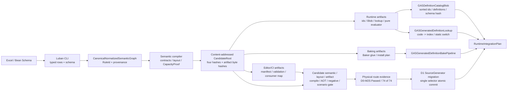
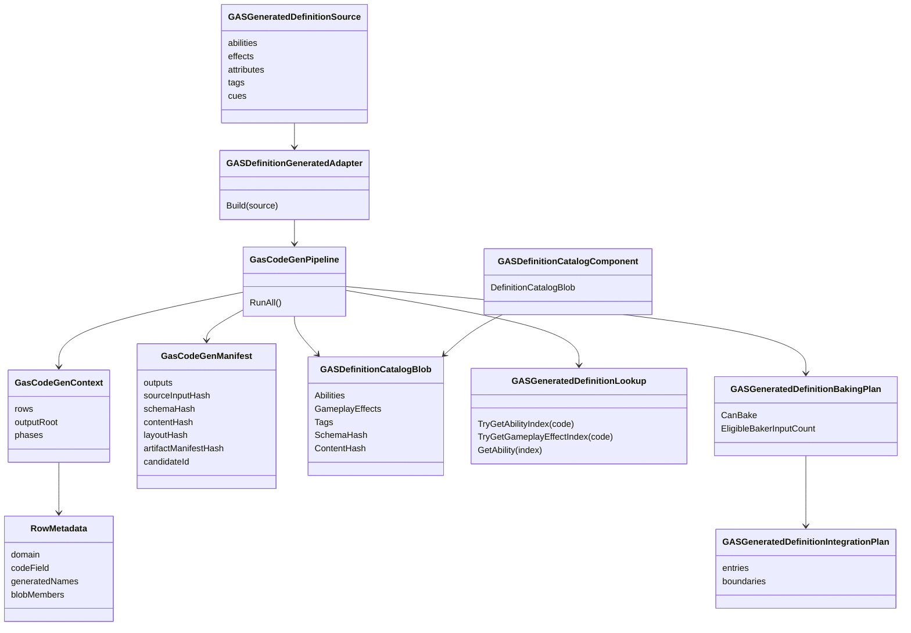

# Luban / SourceGenerator 配置生成链路 Spec

> D0-M2R 当前状态（2026-08-31）：正式 D0-M2S RunId `D0M2S-20260830T180951Z-fe75df12b9a2` 的 terminal 为 `Passed / None`；full-fault、SG-specific X、SG-01～SG-08 与 74/74 evidence closure 全部通过。当前 `AcceptedProductionRoute=StableGraphSourceGenerator`。
>
> 唯一 production selector 为 `Assets/GAS/CodeGen/Selector/Generation.GasCodeGenSourceGenerator.additionalfile`，immutable analyzer authority 为 `Assets/GAS/CodeGen/Analyzers/GasCodeGenSourceGenerator.dll`。当前 `D1Authorized=true`、`ProductionMigrationAuthorized=true`、`ProductionInstallAdmission=NotEvaluated`、`DeclaredFullSemanticEligibility=false`，下一门为 D1 production migration + route-specific E1；`RuntimeV1-Runnable-ClosedWorld` 状态不变。本文后续 tarball 专属段落只保留为 D0-M2F/D0-M2T 历史合同。

## 目的

定义从 Excel / Luban 到 Definition & Generation Layer、Generated artifact、Bake plan、Runtime Definition Catalog / static lookup 的完整链路。

## 相邻 Spec Owner 裁决

`08` 是配置生成与发布链路的端到端 owner，负责定义 Excel / Luban / SourceGenerator / Baker / Bootstrap / Runtime catalog 如何贯通，以及 candidate、四 hash、CI validation、原子 promotion 与 LKG 如何形成唯一发布事务。它不维护 Runtime Core 调用 generated glue 的完整接口正文，也不替 `15` 维护 SourceGenerator 权限门禁第二正文。

| 主题 | 唯一正文 owner | 本文件只维护 |
|---|---|---|
| 生成链路总数据流、Luban 编译边界、SourceGenerator pipeline、asmdef / manifest / process gate | 本文件 | 端到端链路、层级归属、输入输出边界 |
| canonical semantic graph、typed support matrix、RuleId/provenance、CapacityProof | [25 配置语义编译契约与 CapacityProof](25-配置语义编译契约与CapacityProof统一裁决Spec.md) | 只定义这些产物如何进入 candidate/hash/promotion，不复制字段矩阵 |
| Definition CodeGen artifact 责任和 Definition target chain | [14 Definition CodeGen 目标链路](14-DefinitionCodeGen目标链路Spec.md) | 链路中引用 artifact 类别，不复制完整责任表 |
| SourceGenerator 允许 / 禁止生成、lifecycle relocation、validation gate | [15 SourceGenerator 职责边界](15-SourceGenerator职责边界Spec.md) | 链路中引用边界，不维护第二份 gate 正文 |
| Runtime Core 对 generated glue 的纯消费接口 | [03B-03 Generated Runtime Glue 消费接口](03-RuntimeCore管线/03B-业务调用链与配置消费/03B-03-GeneratedRuntimeGlue消费接口Spec.md) | 说明 Runtime 消费入口必须存在，不展开 plan / seed / evaluator 代码 |

## 官方依据与设计论证

配置生成链路的目标是把外部配置压缩成 Runtime Core 可 Burst 消费的不可变数据。`CASE-07` 支持 Baker + Blob 的 definition 承载，`BLOB-02` 要求 `BlobBuilder` 只在 Baking 或初始化期使用，`CONTENT-01` / `PRF-11` 要求静态定义优先 BlobAsset 而不是 prefab 或 runtime entity，`BUR-01` 要求 hot path system / job 无托管依赖。因此 Luban row、JSON、managed registry、`Dictionary` 和 ScriptableObject hot lookup 都不能进入 Runtime Core。

SourceGenerator 必须收权而不是扩权。`SYS-01` 要求 gameplay 权威计算留在 ECS System / Job，`SYS-02` 要求 SystemGroup 拥有 phase，`QRY-04` / `PRF-33` 要求 lookup / query owner 可审查，`SC-01` / `ECB-03` 要求结构变化 phase 明确。因此 generated artifact 只能是 id、Blob schema / builder、static lookup、pure evaluator、Baker / Bootstrap glue 和 validation report；不能生成 Runtime lifecycle system、system registration、hidden query、hidden ECB 或 NativeContainer owner。

这比保守的“只生成配置类”更有必要：GAS 的 Ability / GE / Requirement / Magnitude / TargetRule 有大量重复 glue，手写容易漂移，托管 delegate 又会破坏 Burst。生成 pure glue 可以降低重复并保留 Runtime System 的 query、allocator、dependency 和 profiler 归因。

## 数据流图


```mermaid
flowchart LR
    Excel["Excel / Bean Schema"] --> Luban["Luban CLI\ntyped rows + schema"]
    Luban --> Graph["CanonicalNormalizedSemanticGraph\nRuleId + provenance"]
    Graph --> Pipeline["Semantic compiler\ncontracts / layout / CapacityProof"]
    Pipeline --> Candidate["Content-addressed CandidateRoot\nfour hashes + artifact byte hashes"]
    Candidate --> RuntimeArtifacts["Runtime artifacts\nids / Blob / lookup / pure evaluator"]
    Candidate --> BakingArtifacts["Baking artifacts\nBaker glue / install plan"]
    Candidate --> Reports["Editor/CI artifacts\nmanifest / validation / consumer map"]
    Reports --> Gate["Candidate semantic / layout / artifact\ncompile / AOT / negative / scenario gate"]
    Candidate --> Gate
    Gate --> RouteEvidence["Physical route evidence\nD0-M2S Passed / 74 of 74"]
    RouteEvidence --> Publish["D1 SourceGenerator migration\nsingle selector atomic commit"]
    RuntimeArtifacts --> Catalog["GASDefinitionCatalogBlob\nsorted ids / definitions / schema hash"]
    RuntimeArtifacts --> Lookup["GASGeneratedDefinitionLookup\ncode -> index / static switch"]
    BakingArtifacts --> BakePipeline["GASGeneratedDefinitionBakePipeline"]
    Catalog --> Integration["RuntimeIntegrationPlan"]
    Lookup --> Integration
    BakePipeline --> Integration
    Publish --> Integration
```

## UML 类图


```mermaid
classDiagram
    class GASGeneratedDefinitionSource {
        abilities
        effects
        attributes
        tags
        cues
    }
    class GASDefinitionGeneratedAdapter {
        Build(source)
    }
    class GasCodeGenPipeline {
        RunAll()
    }
    class GasCodeGenContext {
        rows
        outputRoot
        phases
    }
    class RowMetadata {
        domain
        codeField
        generatedNames
        blobMembers
    }
    class GasCodeGenManifest {
        outputs
        sourceInputHash
        schemaHash
        contentHash
        layoutHash
        artifactManifestHash
        candidateId
    }
    class GASDefinitionCatalogBlob {
        Abilities
        GameplayEffects
        Tags
        SchemaHash
        ContentHash
    }
    class GASDefinitionCatalogComponent {
        DefinitionCatalogBlob
    }
    class GASGeneratedDefinitionLookup {
        TryGetAbilityIndex(code)
        TryGetGameplayEffectIndex(code)
        GetAbility(index)
    }
    class GASGeneratedDefinitionBakingPlan {
        CanBake
        EligibleBakerInputCount
    }
    class GASGeneratedDefinitionIntegrationPlan {
        entries
        boundaries
    }

    GASGeneratedDefinitionSource --> GASDefinitionGeneratedAdapter
    GASDefinitionGeneratedAdapter --> GasCodeGenPipeline
    GasCodeGenPipeline --> GasCodeGenContext
    GasCodeGenContext --> RowMetadata
    GasCodeGenPipeline --> GasCodeGenManifest
    GasCodeGenPipeline --> GASDefinitionCatalogBlob
    GasCodeGenPipeline --> GASGeneratedDefinitionLookup
    GASDefinitionCatalogComponent --> GASDefinitionCatalogBlob
    GasCodeGenPipeline --> GASGeneratedDefinitionBakingPlan
    GASGeneratedDefinitionBakingPlan --> GASGeneratedDefinitionIntegrationPlan
```

## 时序图：D0-M2F 历史 tarball 候选 promotion（已 superseded）

下图只保留当时进入 D0-M2T 的候选协议，不代表当前 production 路线；当前 SourceGenerator 时序以本文“production SourceGenerator selector 与线性化点”及 ADR-0001 为准。

```mermaid
sequenceDiagram
    participant Config
    participant Luban
    participant SourceGenerator
    participant Definition
    participant CI
    participant Promotion
    participant Bake
    participant Runtime

    Config->>Luban: Run Luban CLI
    Luban->>SourceGenerator: Typed rows + schema
    SourceGenerator->>Definition: Build canonical graph/contracts/proofs in memory
    Definition->>CI: Materialize content-addressed candidate + four hashes
    CI->>CI: Pre-seal semantic/layout/artifact validation
    CI->>CI: Seal exact content-addressed immutable .tgz
    CI->>CI: Validate exact archive bytes/Unity graph/AOT/negative/scenario evidence
    CI->>Promotion: Submit qualified archive + complete target manifest bytes + audit binding
    Note over CI,Promotion: historical hypothesis only; D0-M2T later rejected this tarball route
    Promotion->>Bake: Install exact promoted artifact manifest
    Bake->>Runtime: Load immutable Catalog with exact install identity
    Runtime->>Runtime: Core lanes read catalog blob + generated code->index lookup
```

## 核心契约

1. Luban 和 SourceGenerator 只生成 Definition & Generation Layer 输入和 static lookup glue。
2. Generated adapter 不持有 `Entity`、`BlobAssetReference`、Editor、spec/context/runtime state。
3. Bake plan / contract / pipeline 不生成 gameplay lifecycle。
4. Runtime integration plan 只描述目标承载和 deferred boundary。
5. 生成链路必须是“输入收集 -> Row metadata 规范化 -> Phase 输出 -> manifest / validation report”的显式管道；不得让多个生成器各自重复扫描程序集、重复推断命名和重复写出 header。
6. Runtime Core 可消费的 static lookup 必须是 Burst 可读的 unmanaged / blob lookup，或带明确 allocator owner / dispose 责任的 Native container；托管数组、`Dictionary`、`Func<>` 只允许留在 Editor / CI / Baking 边界。
7. Ability / GE / Modifier / TagRequirement 的 Blob builder 必须从 Luban row、generated definition 或 Baker 输入直接构建，不从 prototype entity、runtime component 或 active effect state 反推静态定义。
8. Baker glue 必须生成真正的 `Baker<TAuthoring>` 或显式标注的 Baking System plan；静态方法 + `EntityCommandBuffer` 只能作为非目标态兼容工具，不是目标态 Baker 契约。
9. Luban 生成的 C# 必须留在 Unity 编译域内（默认 `Assets/DataGenerated/Luban/CSharp`），因为它是配置事实、row / table API 和 baking/source generation 的输入边界。`cfg.*`、`Luban.Runtime`、`SimpleJSON` 的编译错误是表源链路失败，不允许通过挪出 `Assets` 隐藏。
10. GAS Runtime package contract 中不得出现 `cfg.*`、`XLuban`、`SimpleJSON` 或 Luban managed row 直接引用；这些类型只能存在于 Luban compile boundary、Definition / Baking / Editor 侧，SourceGenerator 必须把它们转换成 Runtime Core 可消费的 id、`GASDefinitionCatalogBlob` / Blob、unmanaged lookup 和 component type set。
11. Runtime Core lookup 必须是 O(1) 或 O(log n) 且可报告数据规模；`GASDefinitionTable` 这类线性扫描表不得进入 hot path。
12. Runtime Core 不直接消费 Luban row、row factory、JSON reader 或 managed registry；唯一合法入口是 generated stable id、`GASDefinitionCatalogBlob`、`GASGeneratedDefinitionLookup`、`BlobAssetReference<T>` 和 generated static switch。
13. 生成 lookup 返回 definition index 或 `BlobAssetReference<T>`，含 `BlobArray` / `BlobString` / `BlobPtr` 的定义数据必须通过 `ref readonly` 读取；禁止把 Blob 元素按值返回给 Runtime lane。
14. 若使用 singleton component 暴露 Definition Catalog，Catalog 在 world/bootstrap 完成后不可写；Runtime system 只能 `RequireForUpdate<GASDefinitionCatalogComponent>()` 后读取 `BlobAssetReference` 并传入 job。禁止 `GetSingletonRW` 修改配置 singleton。
15. Luban authoring row 是 gameplay 语义字段的唯一编辑权威；Runtime compiled Blob 是已通过验证的 Session 运行快照，不是第二编辑源。
16. SourceGenerator 只能规范化 row、生成 pure glue/evaluator/index/validation metadata；不得以 sidecar、override、append 或默认值补丁改变 duration、period、stack、modifier、requirement、capture、target、Cue 或 granted ability 语义。
17. 每个进入 Catalog 的语义字段都必须保留 provenance，至少包含 authoring table/file、row stable id、field path、normalized value 和 generator version。
18. 同一语义字段出现重复 owner、override/append 企图、非法 enum、越界 range、缺失引用或无法解析的 policy 时，bake 必须失败并输出 provenance；禁止 clamp、fallback 或保留旧值继续运行。
19. Catalog 的 schema/content hash 基于验证后的 normalized semantic graph；Session 启动后只持有该不可变快照，不在 Runtime 重新合并 authoring/sidecar。
20. normalized semantic graph 必须在单次调用内直接从 Luban schema/rows 构建；禁止先写 generated row C#，再扫描尚未重编译的 AppDomain factory。
21. candidate 必须在独立 workspace 完整生成并通过 pre-seal semantic/layout/artifact validation，phase 不得逐个直写 active root。当前 emitter 产出的精确 C# bytes 必须封装进唯一 self-contained SourceGenerator selector；ordinary promotion 只原子替换该 selector，不能安装两个 active source root。
22. Runtime install identity 固定为 `{SchemaHash, ContentHash, LayoutHash, ArtifactManifestHash}`；`SourceInputHash` 只用于复现/provenance，不能单独判定兼容。
23. candidate 或 promotion 失败时 active generation 不变；回滚是显式重新 promotion 某个历史成功 manifest，不是 Runtime fallback。

## Luban 与 SourceGenerator 职责边界

| 环节 | 允许职责 | 禁止事项 |
|---|---|---|
| Luban CLI | 读取 Excel / schema，输出 JSON、bean、表行源码、稳定 id 原始事实和 process gate 结果 | 生成 Runtime Core lifecycle system；让 `cfg.*` 成为 Runtime Core 依赖 |
| Gas CodeGen Pipeline | 收集 DefinitionRow / schema metadata，统一推断 RowMetadata，按 Phase 输出 ids、Blob schema / builder、lookup、Baker glue、query hint、validation graph 和 manifest | 每个 Phase 自行全量反射扫描；硬编码项目名前缀；分散维护 code field / blob type / component type 推断 |
| Baking | 把 generated definition / authoring 输入转换为 `BlobAssetReference<T>`、Baker output、BakingOnly / TemporaryBaking data 和 report | 从 runtime entity 或 prototype component 反推静态定义；在 Baker 中读取其他 Baker 的输出 |
| Runtime Core | 只读取 generated id、Blob、static lookup、generated component type 和 validation 允许的常量 | 运行时反查 JSON、managed Luban row、ScriptableObject 或 Editor-only registry |
| Editor / CI | 输出 config diagnostics、official DOTS coverage、query layout、buffer capacity、Burst AOT / Player evidence、orphan generated file report | 把诊断结构作为 gameplay 决策输入 |

### 语义唯一权威与 provenance

```text
Luban authoring semantic row
  -> normalize + validate + provenance
  -> immutable compiled Catalog Blob
  -> Session read-only snapshot
```

- Authoring 字段只在 Luban schema/row 编辑；SourceGenerator 不提供 gameplay override 入口。
- Generated evaluator 可实现 Luban row 引用的 calculation id，但 evaluator 不能暗中替换公式、capture phase 或 ValueView。
- 同一 GE 的 stack type、stack code、duration refresh、period reset、expiration 与 modifier list 必须来自同一受验证 authoring graph。
- Validation report 必须能从 Catalog 字段反查到唯一 row/field provenance；存在两个来源时是生成失败，不是后写覆盖。
- 当前 9203 `StackingType=9203` 与 sourcegen sidecar 修改 modifier/refresh/expiration 的代码事实见 [AutoChess 真实业务链二轮审查事实](../00-当前架构事实/AutoChess真实业务链二轮审查事实.md)；目标链对此必须 bake fail，不保留兼容合并支路。

### Canonical graph 与 single-run consistency

`CanonicalNormalizedSemanticGraph` 的字段、canonical ordinal、typed contract、RuleId/provenance、Live/Grant dependency 与 CapacityProof 由 [25](25-配置语义编译契约与CapacityProof统一裁决Spec.md) 定义。本链路只接受该 graph 的 immutable bytes，不接受 reflection 扫描顺序、generated row factory 或已编译程序集快照。

一次运行必须同时完成：读取 Luban 输入、构图、验证、生成 candidate、计算 hash 与输出 artifact。若生成某个 C# 文件后必须等待 Unity compilation 才能继续，则本次调用必须停在未发布 candidate，待带同一 candidate token 的后续编译 gate 完成；禁止继续读取旧程序集并宣称成功。

### 四 hash 与 artifact bytes

| 身份 | canonical 输入 | 用途 |
|---|---|---|
| `SchemaHash` | schema、FieldOrdinal、typed contract ABI、RuleId domain | 判定 schema/contract 兼容 |
| `ContentHash` | 通过验证的 gameplay semantic graph、program/dependency ordinal | 判定 gameplay 内容身份 |
| `LayoutHash` | Blob/range、AttributeLayout、TagCatalog、slot/payload/CapacityProof schema | 判定物理布局与 admission proof 兼容 |
| `ArtifactManifestHash` | 按 canonical path/kind/owner 排序的每个 artifact byte hash | 判定本次安装是否为完整同代集合 |

`ArtifactManifestHash` 必须覆盖完整受管 generation artifact 集，包括 C#、Blob/catalog、Editor Binding、validation/report、proof 与 required artifact；不得缩窄为 selector bundle 中的 C# source inventory。bundle 另以 `SourceArtifactInventoryHash` 绑定按 target assembly/hint/category/length/source SHA 排序的 C# subset。D1 required set 固定升级为 `EX-GAS-RuntimeV1-RequiredArtifacts-v2`，其 6 项 exact path/kind/owner/visibility/component/target/hint/category、contract hash `63f69551708194359d76c3772fb68983a3632d8994d818d7ec3e8c931ac74565` 与算法以 D0-M2R 接受裁决为准；descriptor 必须封存完整 candidate manifest bytes、`RequiredArtifactSetContractHash`、两个 manifest/inventory hash，并证明 5 个 required C# item 与 bundle entries 双向 bijection。

canonical selector、candidate manifest 文件自身、descriptor、envelope、compile plan 和 generation record 不进入 `ArtifactManifestHash`。任何进入该 hash 的 artifact bytes 禁止反向嵌入 `ArtifactManifestHash` 或 `SelectorSha256`；C# source 还禁止嵌入自身 `SourceSha256` 或 `SourceArtifactInventoryHash` 的 raw/hex 表示。analyzer 与 immutable route scaffold 分别由 `AnalyzerSha256`、`RouteScaffoldSha256` 绑定。`SourceInputHash` 还应覆盖稳定 source identity、Luban/toolchain version 与 provenance 输入，但只用于复现。本链路的 hash 编码固定为版本化 canonical bytes 与完整 cryptographic digest；禁止使用当前 culture 字符串化、`AssemblyQualifiedName`、reflection 自然序或 32-bit 名称 hash 冒充上述身份。

### Luban Unity 编译边界

Luban C# 输出不是临时脚本缓存，也不是应当绕开 Unity 编译的外部产物。目标态固定为：

1. `TableClassCodeOutpuPath` 默认指向 `Assets/DataGenerated/Luban/CSharp`，由 Unity 正常编译 `cfg.*` 表行、bean、多态配置和 `Tables` API。
2. `Assets/Plugins/LubanRuntime/Luban.Runtime.dll` 与 `Assets/Plugins/LubanRuntime/SimpleJSON.dll` 是该编译边界的显式依赖；缺失时应让生成/编译失败。
3. `Assets/DataGenerated/Luban/Json/GAS` 是 JSON 数据输出边界；可被 loader / authoring / baking 使用，但 Runtime Core hot path 不直接查询。
4. `<CandidateRoot>/<RuntimeGenerated>` 是候选 Runtime artifact 边界，只允许依赖 GAS Runtime 与 Unity DOTS 基础程序集，不引用 `cfg.*`、`Luban.Runtime`、`SimpleJSON`、JSON reader 或 managed row；其 source bytes 进入 selector bundle 中 `com.exhard.exgas.generated.runtime` entries。
5. `<CandidateRoot>/<EditorGenerated>` 是候选 Editor/Baking artifact 边界，可引用 row source assembly，把 Luban / row 事实转换为 BlobAsset、Baker 输出和诊断报告；其 source bytes 进入 `com.exhard.exgas.generated.editor` entries，AutoChess entries 固定进入既有 `com.exhard.exgas.autochessdemo`。

当前 Development pipeline 仍写 `Assets/GAS/Generated/CodeGen/{Runtime,Editor}`；这是 D1 必须迁移的 legacy implementation，不具有 release selector 或目标输出 authority。migration 后目录只保留 stable asmdef、`.meta` 与 analyzer-required anchor，不保留 generation-dependent active `.gen.cs`。

### Runtime Definition Catalog 消费链

目标态不把 Luban 输出理解为“Runtime 表访问 API”。Luban row 只是配置事实输入，SourceGenerator / Baker glue 负责把它折叠为 Runtime Core 可读的不可变定义目录：

```
Excel / Luban row
  -> GasCodeGenContext / RowMetadata
  -> generated ids + {Domain}DefinitionBlob schema
  -> stateless Baker / bake plan calls BlobBuilder + AddBlobAsset()
  -> GASDefinitionCatalogBlob or per-domain BlobAssetReference<T>
  -> GASDefinitionCatalogComponent singleton / bootstrap handle
  -> Runtime Core lane reads Blob by ref readonly, uses generated code -> index lookup, then calls Generated Runtime Glue
```

| 链路段 | Runtime 可见 | 约束 |
|---|---|---|
| `cfg.*` / Luban `Tables` / JSON | 否 | 只在 Luban compile boundary、Definition、Baking、Editor/CI 侧出现 |
| generated stable ids / enum-like constants | 是 | Burst 可读、不可变、无 managed dependency |
| `{Domain}DefinitionBlob` | 是 | 只读、unmanaged、含内部指针字段必须 `ref readonly` 访问 |
| `GASDefinitionCatalogBlob` | 是 | 默认按 code 排序；含 `SchemaHash` / `ContentHash`；不保存 runtime state |
| `GASGeneratedDefinitionLookup` | 是 | 小表可生成 static switch；中大表用 sorted array binary search；超大/热表才生成 perfect hash / range table |
| Generated Runtime Glue | 是 | definition index/range -> activation plan / GE seed / modifier record；只生成静态纯函数 |
| `GASGeneratedDefinitionBlobComponent<T>` | 有条件 | 只作为 baking output / bootstrap 收集入口；不作为 hot path 每 tick 查询表 |
| Native lookup container | 有条件 | 只能由 owner system / bootstrap 拥有并显式 Dispose；不得塞进 `IComponentData` 后由 job 随机访问 |

这个链路的关键收益是把“配置查找”从运行时 OOP registry 变成 DOTS 只读数据：Ability grant 阶段可把 `AbilityCode` 解析为 `AbilityDefinitionIndex`，Ability activation / Fan-In / Magnitude Resolve 只拿 index + `ref readonly` definition，并通过 Generated Runtime Glue 得到 contract / application / contribution record，不再每 tick 反查 `Dictionary`、managed row 或线性表。

### Runtime Glue 生成产物

严格按 PackageCache Entities 文档校准后，Runtime 侧真正需要的生成产物不是“表访问 API”，而是一组 Burst 友好的静态 glue，把不可变 definition 变成 tick-local record。它们不拥有状态，只把 Luban 事实压缩为 Kernel 能直接消费的 index、range、mask 和 switch。

| Runtime-visible artifact | 真实职责 | Runtime 消费方式 | 禁止 |
|---|---|---|---|
| `GASDefinitionCatalogBlob` | 聚合 Ability / GE / Modifier / Requirement / TagQueryProgram / AttributeLayout / TagCatalog 等静态定义；按 code 排序并保存 schema/content hash | singleton component 只读取得 `BlobAssetReference<GASDefinitionCatalogBlob>`，传入 job；definition 用 index + `ref readonly` 访问 | nested runtime state、Entity 引用、timer、managed row、JSON reader |
| `GASGeneratedDefinitionLookup` | code -> definition index；小表 static switch，中大表 sorted BlobArray binary search，超热表 perfect hash | Ability grant / bootstrap 把 code 解析为 index；hot path 不重复按 code 查找 | 返回含 `BlobArray` 的 definition 值副本；每 domain 一个 runtime entity query |
| `GASGeneratedRuntimeDefinitionResolver` | 从 `AbilityDefinitionIndex` 读取 Ability contract，从静态 program + target 构造 `EffectApplicationSpec`，从 GE range 计算 Modifier Contribution / AttributeDelta | Kernel 内 Activation / Target / Fan-In / TargetApply Job 调用静态纯函数 | 调用 `EntityManager`、创建/销毁 entity、隐藏 ECB、查询 component、拥有 `NativeContainer` |
| `GASGeneratedRequirementEvaluator` | 生成 tag mask / attribute threshold / cost/cooldown precondition 的静态纯校验 | `OwnerPlanBuild` 对 tick-start snapshot 与同 ASC shadow 前序 CommitPlan 做完整 CanActivate/Commit 复核，输出 typed failure 或 owner-local CommitPlan | 只在 Ingest 校验一次、反查 managed tag tree、运行时拼字符串 tag、跨 entity random lookup 写状态 |
| `GASGeneratedMagnitudeEvaluator` | 生成 MMC / modifier magnitude static switch；同 evaluator 大批量时可生成 FunctionPointer batch 候选 | Magnitude Resolve 遍历 modifier range 时调用；默认 per modifier static switch | 托管 delegate、虚函数策略对象、可变注册表、per-entity FunctionPointer invoke |
| `GASGeneratedTargetRuleTable` | target rule code -> unmanaged target params / sort policy / query hint | Target Resolve 读取 params 后基于 physics snapshot / explicit target 生成 `AbilityTargetRecord` | target strategy class、ScriptableObject target rule、Runtime Core 反查资源 |
| `GASGeneratedRuntimeGlueValidation` | 生成 config -> Runtime glue 的离线报告：缺失 GE、无效 range、orphan tag、Burst evaluator 覆盖 | Editor/CI 诊断；Runtime Core 只消费通过校验后的常量和 Blob | 把诊断结果作为 gameplay 决策输入 |
| Typed Contract / Program | `CostMutationContract`、`CooldownGateContract`、`CaptureProjectionContract`、`StackTemporalContract`、`DirectEffectProgram`、`SpawnInitializationProgram` | Runtime 按 contract/program id 与 pre-resolved range 调用手写 owner | 普通 GE 压平、动态 child、隐藏 lifecycle |
| `CapacityProof` / ConsumerMap | 每 Definition/target/profile 的 expansion、overlay、slot、projection、cleanup、fact/Cue/ECB intent 上界 | `WholeTickInfraAdmission` 与 V7 evidence 逐字段消费 | capacity hint、平均值、只生成不消费的 report |

**生成 glue 的硬约束：**

1. Glue 只生成静态纯函数和 unmanaged record；不得生成 `AbilityLifecycleSystem`、`ActiveEffectLifecycleSystem` 等 Runtime lifecycle。
2. Glue 不隐藏结构变化：不能调用 `EntityManager`、不能创建 ECB、不能在内部 `Schedule()` job。
3. Glue 不拥有 `NativeArray` / `NativeList` / `NativeHashMap`；NativeContainer 的 owner、依赖链、dispose/rewind 由调用 System 显式管理。
4. Glue 不把 `NativeContainer` 塞进 `IComponentData`；若存在非目标态 singleton container，job 只能在主线程提取 container 后直接对 container 调度，不对 singleton component 本身调度 `IJobChunk` / `IJobEntity`。
5. Glue 不按值返回含 `BlobArray` / `BlobString` / `BlobPtr` 的 Blob 元素；所有变长 definition 使用 root array + `Start/Count` range + `ref readonly`。
6. Glue 不保存 per-tick state，不缓存上次 plan，不维护可变静态 registry；同一 SimulationTick 的 command / target / modifier 都是 Kernel 的 tick-local record。
7. Glue 不引用 `cfg.*`、`XLuban`、`SimpleJSON`、managed Luban row、JSON table reader 或 Editor-only assembly。

离线 publish/bake validation 只证明定义图、引用和静态 carrier 合法，不能替代运行时检查。Cost/Cooldown 即使由 GE-like row authoring，也只生成 owner-local invariant seed：`OwnerPlanBuild` 必须在 canonical shadow 上重检，`AscOwnerCommandWave` 才做 no-fail 原子 mutation；禁止把它们降成普通 self GE 投递到 `TargetPrepare/TargetPublish`。

### 为什么必须让 SourceGenerator 收权

SourceGenerator 的价值是批量生成 DOTS 友好的不可变数据、静态索引和纯解析 glue，而不是替 Runtime Core 拥有执行管线。这个结论由 Unity Entities / DOTS 规则共同推出：

| 官方规则 | 对 SourceGenerator 的约束 | 架构收益 |
|---|---|---|
| `BLOB-01` | 静态 Ability / GE / Tag / Modifier 定义进入 immutable `GASDefinitionCatalogBlob`，Runtime 只读 | 配置查找从 managed registry / row API 变成 Burst-friendly 共享只读数据 |
| `BLOB-02` | `BlobBuilder` 只允许在 Baking / Bootstrap / initialization owner 中出现，不能成为 Runtime hot path 可调用能力 | 避免 per-frame / per-event 分配复制成本，并让 runtime-created Blob 有明确 dispose owner |
| `BAKE-01` / `BAKE-02` / `BAKE-03` | Baker glue 只能无状态添加输出，Baking System 必须声明依赖和增量还原 | 生成器可以制造 Baker / bake plan，但不能把 baking 依赖伪装成 runtime lifecycle |
| `SYS-01` | 权威 gameplay 计算必须由 ECS System / Job 数据流承载 | lifecycle owner 必须在手写 Runtime Core System 中可审查、可 profile、可调度 |
| `SYS-03` | system 数量是固定成本源 | 生成器不能按表或按字段批量制造 system；system 数量必须由 Runtime lane 的物理数据流决定 |
| `QRY-01` | hot path 优先 `IJobEntity` / `IJobChunk` + Burst，`SystemAPI.Query` 只限小规模 / debug / proof | generated artifact 不能把主线程遍历包装成“自动生成所以可接受” |
| `QRY-04` | 高频 `ComponentLookup` / `BufferLookup` random lookup 要重构为 owner-local / chunk-local | generated runtime lookup system 只能是 proof-only 示例，目标态由手写 lane system 拥有 query 和 locality |
| `SC-01` / `ECB-03` | hot path 禁止直接结构变化；ECB playback 必须属于明确 SystemGroup phase | SourceGenerator 不能隐藏 `EntityManager` write、ECB 创建或 playback phase 选择 |
| `NAT-03` | NativeStream fan-in 必须定义 deterministic merge 顺序和内存预算 | 生成器可以输出 record schema / sort key hint，不能拥有 NativeStream 生命周期和 merge phase |
| `BUR-01` | hot path system / job 必须 Burst 且无托管依赖 | generated pure glue 易于进入 Burst；generated lifecycle 一旦碰 query、ECB、托管依赖就难以证明 AOT / Burst 质量 |

因此，新架构更优秀的原因不是“代码生成更多”，而是“生成器只生成更稳定、更可验证、更低运行时成本的东西”。它把重复胶水从手写 System 中拿走，却不拿走 System 对 query、dependency、allocator、ECB、NativeContainer 和 phase 的 ownership。这样 Runtime Core 的性能热点能直接落到具体 System / Job / lane 上，Debugger 和 Profiler 也能给出可行动证据。

## 生成器内部架构目标

生成器实现应收敛为 `GasCodeGenPipeline + GasCodeGenContext + RowMetadata + IGasCodeGenPhase` 形态：

1. `GasCodeGenContext` 只构建一次，包含输出目录、命名空间、所有 RowMetadata、按领域分组的 ability / GE / attribute / tag / cue / unit / scenario 行。
2. `RowMetadataFactory` 集中处理 row type 前缀、code field、blob schema、lookup 名称、Baker 名称、component type 和 blob member 映射；新增 DefinitionRow 类型优先新增 provider，而不是修改多个 Phase。
3. `IGasCodeGenPhase` 单一职责输出一个或一组文件；Phase 只消费 context，不自行扫描程序集、不自行推断全局命名、不自行决定输出根目录。
4. `GasCodeGenManifest` 记录所有生成文件、输入 hash、Phase 名称和输出路径，用于清理孤儿 `.g.cs`、检查路径逃逸和支撑 CI diff。
5. `GasCodeGenSettings` 或等价配置承载项目名前缀、generated namespace、输出目录、manifest 策略和是否写入版本控制；禁止在生成器中硬编码 `HeadlessAutoChess` 之类项目前缀。

“SourceGenerator”在本 Spec 的语义层指确定性源码生成子系统；当前 production 物理消费固定为 Roslyn `IIncrementalGenerator`。Unity Editor menu / offline tool 只允许构造和验证 candidate、完整 manifest 与 selector bundle，不得把 generation-dependent `.gen.cs` 直接写回 Unity active source。

推荐 Phase 切分：

| Phase | 输出 | Runtime 可见性 |
|---|---|---|
| Immutable route scaffold validation phase | 验证 stable runtime/editor asmdef、`.meta`、required anchors 与 row-source reference graph，计算 `RouteScaffoldSha256` | scaffold 可见且路线版本内固定；ordinary generation 不生成或替换 asmdef、`.meta`、anchor |
| Stable id / catalog phase | `XAttr`、`XTag`、`XGE`、`XAbility`、`XCueCode`，以及 `AttributeLayout` / `TagCatalog` builder | 可见；必须 Burst 友好；Tag dense index 与 ancestor chain 由 Catalog 确定，不把单个 machine word 当作容量上限 |
| Attribute / Tag projection phase | `AttributeInitValue`、id→layout index、Tag query program、可选派生 presence-word 访问器 | 可见；只生成 metadata、初始化投影和纯访问器；运行时唯一权威仍是固定 `AttributeValueSlot[]` / `TagCountSlot[]`，不得生成 Attribute/Tag component、dirty mirror 或第二套生命周期 |
| Blob schema / builder phase | `GameplayEffectDefinition`、`AbilityDefinition`、`BuildFromRow` / `BuildFromDefinition` | Blob 可见；builder 多数在 Baking / initialization 使用 |
| Static lookup phase | id -> `BlobAssetReference<T>` / compact lookup | 可见；必须 unmanaged / Burst 可读 |
| Runtime glue phase | `GASGeneratedRuntimeDefinitionResolver`、`GASGeneratedRequirementEvaluator`、`GASGeneratedMagnitudeEvaluator`、`GASGeneratedTargetRuleTable` | 可见；只输出静态纯函数和 record，不生成 lifecycle system |
| Calculation phase | `MmcTypeId`、`MmcEvaluator.Evaluate()` static switch | 可见；禁止托管 delegate / 可变 registry |
| Baker glue phase | `Baker<TAuthoring>`、`DependsOn()`、`AddBlobAsset()`、custom hash | Baking 可见；不进入 Runtime Core tick |
| Scenario / validation phase | build plan、validation expectations、diagnostics report | Scenario 常量可见；validation / report 不参与 gameplay |
| Query / capacity hint phase | query layout、read/write set、buffer capacity、TransformUsageFlags、ODF coverage | Editor / CI 为主；Runtime 只消费经确认的常量 |

## Unity Entities 校准

Definition & Generation Layer 的目标承载必须区分：

| 产物 | Unity 承载 | 进入 runtime hot path |
|---|---|---|
| id / enum / stable code | generated source | 可以 |
| static lookup | generated code -> index lookup / blob lookup | 可以 |
| Ability / GE / Modifier / TagRequirement 定义 | `BlobAssetReference<T>` / `GASDefinitionCatalogBlob` | 可以 |
| Authoring / generated config 转换 | Baker / bake pipeline | 不在运行时执行 |
| runtime integration plan | validation metadata | 不参与 gameplay 计算 |
| Editor / CI diagnostics | Editor / test assembly | 不进入 Runtime Core |

SourceGenerator 可以生成 Blob builder、lookup、Generated Runtime Glue、validation 和 Baker glue，但不能生成 ActiveEffect lifecycle system 或直接写 `EntityManager` 的 runtime 执行逻辑。Runtime-visible generated artifact 若包含 `ISystem`、system registration、`OnUpdate`、`ComponentLookup` / `BufferLookup` hot path 或 ECB owner，必须按 `15-SourceGenerator职责边界Spec.md` 归类为职责越界，而不是用单一 forbidden dependency 字符串扫描判定完成。

## DOTS API 选型修正

配置生成链不只是把 Excel 行转为 C# 常量。目标态需要把生成产物归入 Unity 官方推荐的 authoring / baking / runtime 数据边界：

| 场景 | 推荐承载 | 适用规则 | 约束 |
|---|---|---|---|
| Ability / GE / Modifier / TagRequirement 静态定义 | BlobBuilder + `BlobAssetReference<T>` | `CASE-07` `CASE-24` `BLOB-01` `BLOB-02` | Runtime Core Burst 可读，不携带 runtime state |
| 大批量 authoring 转换 | Baker / Baking System | `CASE-32` `CASE-39`~`CASE-41` `BAKE-01`~`BAKE-03` | Baker 无状态、只添加不读取；Baking System 需手动维护依赖和回滚语义 |
| generated runtime lookup | code -> index static switch / sorted BlobArray binary search / generated perfect hash / blob lookup | `CASE-07` `CASE-46` | 不反查 managed Luban row；Blob 元素不按值返回 |
| Cue / UI / VFX / SFX 资源引用 | `WeakObjectReference` / `UnityObjectRef` | `CASE-43` `CONTENT-01` `CONTENT-02` | 只属于 Boundary / Presentation，不进入 Core 决策 |
| prefab-like group | LinkedEntityGroup / authoring prefab | `CASE-37` `CASE-42` `PRF-11` | 用于实例化/销毁组合，不作为 gameplay hot path 状态机 |
| Demo / 大世界加载 | SubScene / Streaming | `CASE-43` `CASE-44` | 只负责内容组织和加载边界 |
| Transform 数据 | `TransformUsageFlags` | `CASE-19` `CASE-29` `PRF-18` | 按真实表现需求选择，避免无用 transform component |
| Physics 配置 | `PhysicsCollider` blob、`CollisionFilter`、Physics category、query profile | `PHY-01`~`PHY-05` `CASE-09` | 生成 target / hit / event 输入数据；Runtime Core 不反查托管 physics row |
| Render 配置 | `RenderMeshArray`、`MaterialMeshInfo`、material override schema、render profile | `GFX-01`~`GFX-05` `CASE-10` | 只进入 Presentation / Boundary；无头可生成 log marker binding |

SourceGenerator 可以生成 BlobBuilder、Baker glue、validation graph、query layout hint、static lookup 和 Generated Runtime Glue，但不能生成 Runtime Core lifecycle system，也不能隐藏结构变化。`Runtime-visible` artifact 中若出现 `ISystem`、system registration、`EntityManager`、ECB、`ComponentLookup` / `BufferLookup` 或 NativeContainer owner，默认说明 SourceGenerator 已越权。

## 官方案例校准

本链路必须对齐 `UnityDOTS官方文档参考/主题/12-官方案例模式.md` 中的 `CASE-07`/`CASE-10`/`CASE-11`，以及 `UnityDOTS官方文档参考/主题/16-官方案例模式-高级.md` 中的 `CASE-39`/`CASE-40`/`CASE-41`：

1. `CASE-07`：Baker 只做 authoring / generated config 到 ECS / Blob 的转换，并显式声明外部依赖。
2. `CASE-39`（Baker 只添加不读取）：Baker 之间无依赖关系，**禁止**在 Baker 中读取已有 component 的数据、禁止访问其他 entity。所有依赖通过 `DependsOn()` 表达，数据只通过添加 component 输出。
3. `CASE-40`（Baker 必须无状态）：Baker 是单例实例，`Bake()` 可能被多次调用且无序，**禁止**在 Baker 字段中缓存状态。若需跨 entity 传递信息，使用 `TemporaryBakingType` + Baking System（`CASE-32`）。
4. `CASE-41`（Baking System 必须手动追踪依赖和增量还原）：Baking System 不自动记录依赖，entity 不会进入 baked scene。**必须**通过 `GetEntityQueryBuilder()`、`GetComponentTypeHandle()` 等显式声明依赖；增量 baking 时需手动还原上一批次的 artifacts。
5. `CASE-10`：Baking System 只做 bake-time 批量后处理、校验和 metadata，不生成 runtime gameplay lifecycle。
6. `CASE-11`：BlobBuilder / AddBlobAsset / custom hash 是 Ability / GE / Modifier / TagRequirement / Cue 静态定义进入 Burst Runtime Core 的默认路径。
7. WeakObjectReference / UnityObjectRef / SceneSystem / TransformUsageFlags 只作为 Boundary / Presentation / Authoring 计划输出，不进入 Core 决策。

## 官方文档覆盖校准

本链路还必须先对齐 `UnityDOTS官方文档参考/README.md`，再对齐 `UnityDOTS官方文档参考/主题/21-官方文档覆盖与流程闭环.md` 中的覆盖矩阵和 `ODF-*` 规则：

| 覆盖主题 | 生成链路输出 |
|---|---|
| Baking dependency / output filter | Baker dependency summary、`BakingOnlyEntity` / `BakingType` / `TemporaryBakingType` policy |
| Baking world / phase | conversion world、shadow world、main world、Baker phase、Baking System group policy |
| Content management / weak resource | WeakObjectReference / UntypedWeakReferenceId load / release plan，Boundary only |
| Transform stale-data policy | TransformUsageFlags、LocalTransform / LocalToWorld 读取边界 |
| Entity prefab / LinkedEntityGroup | embedded entity prefab、`EntityPrefabReference`、`RequestEntityPrefabLoaded`、`PrefabLoadResult`、`IncludePrefab`、prefab-like bundle lifetime policy，禁止和 transform hierarchy 混用 |
| Mathematics deterministic state | RNG seed / state / radians 转换生成规则 |
| Burst vectorization / FunctionPointer | generated static switch / FunctionPointer 粗粒度候选和 Burst Inspector target |
| Burst AOT / Player evidence | generated calculation 是否进入 Player AOT target、OptimizeFor、warning suppression policy |
| Query / buffer hint | query layout、read/write set、InternalBufferCapacity、spill trigger |
| Unity Physics | collider primitive / mesh hint、CollisionFilter、PhysicsWorldIndex、event opt-in、query profile、FixedStep policy |
| Entities Graphics | RenderMeshArray / MaterialMeshInfo binding、material override schema、render proxy prototype、draw evidence policy |

## DOTS 深读后的生成产物扩展

Luban / SourceGenerator 目标态要补齐“配置 -> DOTS 承载”的生成上下文，而不是只生成表访问 API：

| 生成产物 | 职责 | DOTS 依据 | 禁止 |
|---|---|---|---|
| Blob schema / builder | Ability / GE / Modifier / TagRequirement / Cue 静态定义 | BlobBuilder、BlobAssetReference、custom hash、BlobAssetStore | Blob 内存 runtime state / Entity / timer |
| Definition catalog | 聚合各 domain definition、排序 code、schema/content hash、规模元数据 | BlobAssetReference、BlobArray、singleton component 只读读取 | one entity per definition 进入 hot path、Runtime 反查 managed table |
| Runtime definition glue | Ability plan、GE seed、modifier record、requirement decision、target rule params 的静态纯解析 | Blob ref/index/range、IJobChunk job field、NativeStream/NativeList owner system | service manager、runtime lifecycle、hidden query、hidden ECB、托管 strategy/delegate |
| Query layout hint | 为 Runtime Core task 生成建议 query shape、读写集合、buffer capacity、change filter 禁止说明 | EntityQueryBuilder、WithPresent / WithDisabled、FilterWriteGroup | 生成 runtime lifecycle system |
| Calculation registry | 生成 calculation id、Burst static switch、function table metadata | Burst static readonly、job/static switch、FunctionPointer 粗粒度候选 | 托管 delegate、可变静态注册表 |
| Baker glue | 把 authoring / generated config 转成 Blob / ECS component | stateless Baker、DependsOn、CreateAdditionalEntity、TransformUsageFlags | Baker 缓存状态、读改其他 baker 的 entity |
| Baking world / phase report | 说明 conversion world、shadow world、main world、Baker phase、Baking System phase 的数据归属 | Baking worlds、Baking phases | 把 live baking 增量复制误当 runtime lifecycle |
| Baking System plan | 批量校验、跨表索引、section metadata、temporary baking data | BakingSystem、BakingOnlyEntity、TemporaryBakingType、Pre/Transform/Baking/Post group | 不维护 incremental dependency / rollback |
| Content reference plan | Cue/UI/VFX/SFX 资源引用和 load/release 边界 | WeakObjectReference、UntypedWeakReferenceId、RuntimeContentManager | Core simulation 依赖资源加载结果 |
| Entity prefab plan | embedded prefab / `EntityPrefabReference` / `RequestEntityPrefabLoaded` / `PrefabLoadResult` / `IncludePrefab` / LinkedEntityGroup 策略 | Entity prefab baking、SceneSystem、LinkedEntityGroup | Runtime Core hot path 拼装 hierarchy 或忽略 load state |
| Scene / Scale plan | AutoChess scale profile、SubScene / SceneSection metadata、headless scene runner | SceneSystem、Scene meta entity、SceneSection | hot path load/unload scene |
| Physics profile plan | 生成 collider category、CollisionFilter、body mode、query profile、collision / trigger event opt-in | Unity Physics `PhysicsCollider`、`CollisionFilter`、`PhysicsWorldSingleton` / `SimulationSingleton` | Runtime Core 读取 managed physics config 或高频创建复杂 collider |
| Render binding plan | 生成 mesh / material binding id、RenderMeshArray pack hint、MaterialMeshInfo default、material override component schema | Entities Graphics `RenderMeshArray`、`MaterialMeshInfo`、MaterialProperty | Core 写 mesh/material/shader property 或 hot path 调 `RenderMeshUtility.AddComponents` |
| Burst AOT evidence plan | generated calculation target、OptimizeFor、warning policy、Burst Inspector target | Burst AOT Settings、Burst Inspector | 只看 Editor `[BurstCompile]` 标记 |
| Official DOTS coverage report | `ODF-*` 规则、PackageCache 证据、采用 / 拒绝 / 暂不相关理由 | `UnityDOTS官方文档参考/主题/21-官方文档覆盖与流程闭环.md` 覆盖矩阵 | 只生成代码不说明官方机制依据 |
| Validation graph | 校验 tag、attribute、modifier、cue、query layout、buffer capacity、Burst target | Editor / CI diagnostics | Runtime Core tick 中反查 managed config |

生成链路输出的每个 artifact 都应标记归属层：Definition、Baking、Runtime Core、Boundary、Editor/CI。未标记层级的 generated artifact 不得进入 Runtime Core。

### ASM-01 生成程序集边界

generated-code assembly graph 属于固定 `ImmutableRouteScaffold`，不是 ordinary SourceGenerator generation 输出：

1. stable Runtime generated asmdef 只允许引用 GAS Runtime 与 Unity DOTS 基础程序集（`Unity.Collections`、`Unity.Entities` 等），不得引用 row source assembly、Editor、Luban、JSON reader 或 Demo assembly。
2. stable Editor/Baking generated asmdef 允许引用实际 row source assembly，因为 row-based builder、lookup builder 和 Baker glue 只在 Editor / Baking 边界编译。
3. AutoChess generated source 固定加入既有 `com.exhard.exgas.autochessdemo`，不得生成第四个 asmdef/asmref；row source reference graph 在路线迁移时由 `GasCodeGenContext.Rows` 推导并冻结，ordinary generation 只验证，不得动态改写。
4. stable asmdef、`.meta` 与 required anchors 必须进入 `RouteScaffoldSha256` 和 candidate compile-plan identity；ordinary generation 不生成、不替换，也不把它们写入 `CandidateRoot`。

## Candidate、Promotion 与 LKG

### CandidateRoot

每次 publish 生成新的 content-addressed `CandidateRoot`。所有候选 `.gen.cs`、Blob/catalog bytes、Editor Binding、validation report、`CapacityProof` 与 candidate manifest 只写入该 candidate；固定 asmdef、`.meta` 和 required anchors 以只读 `ImmutableRouteScaffold` 身份参与校验，不在 ordinary generation 中生成或替换。candidate 不得覆盖当前 active root，也不得在 validation 前删除 active generation 的 orphan。

Candidate manifest 至少记录：CandidateId、SourceInputHash、四元 install identity、`RequiredArtifactSetContractHash`、生成器版本、每个受管 generation artifact 的 canonical path/kind/owner/byte hash、RuleId summary、CapacityProofHash 和 required evidence id。candidate manifest 文件自身不参与其 `ArtifactManifestHash`；selector source subset 另计算 `SourceArtifactInventoryHash`，并在 descriptor 中与 required C# manifest items 建立双向 bijection。

### D0-M2F 冻结的历史物理候选与角色闭包（已 superseded）

下表是正式 D0-M2T 的实验输入，不是当前 production 选择；D0-M2T 已因 warm `PackageCache` fallback 否决该路线。

| 对象 | 角色 | Unity 消费权限 |
|---|---|---|
| content-addressed immutable `.tgz` | Authority / immutable payload | payload |
| `Packages/manifest.json` | Authority / mutable selector | `SoleUnitySelector` |
| `Packages/packages-lock.json` | Derived | none |
| `ProjectSettings/GasCodeGen/ActiveGenerationRef.json` | Derived | `AuditOnly` |
| `Library/PackageCache/**`、解包目录、Bee/RSP | Cache / compiled projection | never selector |

D0-M2F 没有枚举完整故障实验将产生的事务/恢复对象；D0-M2T 实验曾要求 manifest 临时/备份、publish intent、owner sentinel 等对象统一归类为 Derived transaction/recovery artifact，`UnityConsumerAuthority=0` 且 `NeverFallbackSelector=true`。该要求保留为历史实验合同，不构成 tarball production 授权。

正式 D0-M2T RunId `D0M2T-20260830T163229Z-3191c7b97729` 证明 missing Authority 时 warm `PackageCache` 仍成功消费 B，terminal 为 `RouteRejected / MissingOrCorruptAuthorityAccepted`；immutable tarball production 路线因此否决。随后 D0-M2S RunId `D0M2S-20260830T180951Z-fe75df12b9a2` 已通过完整 SourceGenerator 故障门，并由 D0-M2R 接受路线、授权 D1。

### Unity selector 与 Promotion 线性化点（D0-M2F 历史 tarball 候选）

D0-M2F 候选协议要求 CI 先构造包含目标 package dependency 的完整 manifest bytes，再以单文件原子 replace 提交整个 `Packages/manifest.json`。D0-M2T 已证明该候选无法阻止 Authority 缺失后的 warm cache 消费，所以下列规则只保留为历史实验合同：

1. 任一 gate 失败：candidate 失败，manifest、已选 archive 与 LKG 历史不变。
2. selector replace 失败：旧 manifest bytes 保持可验证；不得让一部分 active 文件来自 candidate。
3. `ActiveGenerationRef` 可以记录 `PromotionId`、四元 install identity 与 archive/manifest binding，但只能作为 audit/promotion record。D0-M2F Probe X 仅证明其在 feasibility fixture 中 `UnityConsumerAuthority=0`；当前 SourceGenerator route-specific audit schema 另由 D0-M2R 冻结。
4. `packages-lock.json`、manifest 临时/备份、publish intent、owner sentinel、PackageCache、解包目录、Bee/RSP 与任何 stable alias/materializer 均不得成为 fallback selector。
5. 成功后 orphan cleanup 只作用于已不再被 active/LKG 记录引用的 Authority/Derived/Cache 对象。
6. 回滚必须通过 manifest 原子选择精确历史 archive，并产生新的 `PromotionId` / audit record。

上述 manifest/audit 写序是已否决 tarball 候选的历史问题。当前 SourceGenerator route 已冻结 selector commit 先于零选择权 audit write；Runtime 仍禁止读取旧 schema、managed row、sidecar、ScriptableObject 或历史 Catalog 做自动 fallback。

### production SourceGenerator selector 与线性化点

| 对象 | 角色 | Unity 选择权 |
|---|---|---:|
| `Assets/GAS/CodeGen/Selector/Generation.GasCodeGenSourceGenerator.additionalfile` | Authority / mutable `SoleUnitySelector` | 1 |
| `Assets/GAS/CodeGen/Analyzers/GasCodeGenSourceGenerator.dll` | Authority / immutable analyzer | 0；路线版本内固定 |
| analyzer `.meta`、stable asmdef、required anchors | ImmutableRouteScaffold | 0 |
| compiler-generated C# / assemblies | Derived compilation projection | 0 |
| `ActiveGenerationRef.json`、generation archive、descriptor、intent | DerivedAudit / evidence | 0 |
| `Library/ScriptAssemblies/**` | Derived | 0 |
| `Library/Bee/**`、RSP、driver/cache | Cache | 0 |

selector 固定为 UTF-8 no-BOM、LF 的 `EX-GAS-SourceSelector-v1` header 加一行 canonical Base64 `GasSourceBundle-v1`。bundle 携带四元 identity、`RequiredArtifactSetContractHash`、`SourceArtifactInventoryHash`、analyzer/scaffold SHA、`FullSemanticEligibility=0` 以及按 target assembly/hint 排序的完整 C# source bytes 与 SHA；不得只保存指向另一份可变 payload 的裸路径。完整 wire 类型、宽度、常量、EOF 与 source-subset mapping 以 D0-M2R 接受裁决为准。

candidate 在独立 Unity project 中用精确 production 相对路径和自己的 Bee 图验证三目标程序集共同 selector、analyzer、required marker 与真实输出。通过后 Store 必须先读取 canonical selector 的完整 previous snapshot，再以 fixed `PublishIntent.json` 的 no-overwrite `FileMode.CreateNew` 将 `CommitAttemptState=NotStarted`、`PreviousSelectorState=Missing|Present`（仅 `Present` 绑定 previous 完整 bytes/SHA）、target 完整 bytes/SHA、`DescriptorSha256`、`InstallEnvelopeSha256` 以及 required-contract/manifest/inventory/selector/analyzer/scaffold/compile-plan 全部 route snapshot 一次性写入并 flush，从而获得单 active `ExclusiveClaimId`；禁止先建不含 previous 的 claim 再补写。取得 claim 后必须重读 selector 与 intent previous 做 CAS 前置复核，漂移则 durable 记为 `Indeterminate`。`Present` 使用同目录 temp + flush + `File.Replace`，`Missing` 使用 no-overwrite atomic create-new/move。commit state 固定为 `NotStarted|Armed|Committed|CompetitionFailed|Indeterminate|NoOp`；只有 durable committed receipt、valid exclusive claim、全部 snapshot 重算与 selector==target 同时成立才补 audit。competition/indeterminate、未证明独占或 Armed 下 target-equal 一律 fail closed，不得冒领 PromotionId；same-target NoOp 不产生新 promotion/audit identity。rollback 必须把精确历史 selector 作为新 candidate 重新提交。

## 禁止方向

1. SourceGenerator 生成 Ability / GE active lifecycle。
2. generated 代码进入 simulation 权威决策。
3. 把 `cfg / XLuban / SimpleJSON` 泄露到 runtime package contract。
4. 在 generated artifact 中持有 runtime entity、runtime spec、context instance 或 active effect state。
5. 生成可变托管静态 calculation registry。
6. 生成隐藏结构变化、隐藏 query 或隐藏 system 调度。
7. 让 weak resource / SceneSystem load 状态参与 Core gameplay 决策。
8. 多个 Glue generator 各自执行 `FindDefinitionRowTypes()`、各自维护命名推断和输出策略。
9. 用托管数组 / managed dictionary 承载 Runtime Core hot path lookup。
10. 从 prototype entity、runtime component 或 active effect slot 构建静态定义 Blob。
11. 把 `GASGeneratedDefinitionBlobComponent<T>` 的 per-definition entity query 当作 Runtime hot path lookup。
12. 使用 sourcegen sidecar override/append 修改 Luban gameplay 语义，或以“生成方便”为由在 glue 中注入 dummy modifier。
13. 对非法 enum/range 执行 clamp/default/fallback，或在 provenance 冲突时使用 last-writer-wins。
14. 先直写 active `.gen.cs` / manifest，phase 失败后继续保存或删除 orphan。
15. 用一次生成写出的 row C# 配合当前 AppDomain 中旧 factory 继续生成 Catalog/hash。
16. 把 `InputHash`、整数 `SchemaVersion` 或 revision 当作完整 install identity。
17. 在 Runtime 保留旧 Catalog、managed row 或 sidecar 自动 fallback。
18. 把 `ActiveGenerationRef`、stable alias、materializer、lock、PackageCache、解包目录或 Bee/RSP 作为第二 selector 或 fallback selector。
19. 让任何 `ProvisionalOnly` 候选或已否决的 immutable tarball 路线进入 production；当前已接受的 SourceGenerator 也必须严格遵守冻结 selector/analyzer/scaffold 协议。

## 验收

### Core CodeGen 目标验收

1. `GasCodeGenPipeline.RunAll()` 默认只运行通用 Core phases，不运行 AutoChess 专用 phase。
2. 真实 Luban process gate 通过后才导出 artifact。
3. `.g.cs` 和 manifest 输出路径不能逃逸 project root。
4. 生成器必须输出 Phase manifest：输入 hash、输出文件、归属层、是否进入 runtime assembly、是否 version-controlled，以及 orphan `.g.cs` 清理结果。
5. Core generated 的候选输出根必须独立于 active root，并保持 runtime/editor assembly routing 分层；production 载体固定为 single selector bundle，`Assets/GAS/Generated/CodeGen` migration 后只保留 stable scaffold。Runtime asmdef 只引用 GAS Runtime / Unity DOTS 基础程序集，Editor asmdef 才允许引用实际 row source assembly，AutoChess generated 必须加入既有 AutoChess 程序集。
6. Luban C# 输出必须在 Unity 编译域内通过编译；同时 Runtime assembly 扫描必须证明 GAS Runtime Core 与 generated runtime 不存在 `cfg.*`、`XLuban`、`SimpleJSON`、managed Luban row 或 JSON table reader 引用。
7. Runtime-visible generated artifact 不得出现 `DefinitionRow`、row factory、`IReadOnlyList<*DefinitionRow>` 或 row snapshot。
8. Core generated 命名必须对齐 `12-命名规范Spec.md`：Blob 根类型使用 `{Domain}DefinitionBlob`，lookup 使用 `{Domain}DefinitionLookup`，lookup builder 使用 `GASGeneratedDefinitionLookupBuilder`，框架产物使用 `GASGenerated*` 前缀，通用 component 使用 `GASGeneratedDefinitionBlobComponent<T>` / `GASDefinitionCodeComponent`。
9. 生成报告必须输出 `BAKE-*`、`BLOB-*`、`QRY-*`、`JOB-*`、`SC-*`、`BUR-*`、`PRF-*`、`ODF-*` 规则对照：采用、拒绝、暂缓理由必须明确。
10. Baker 生成物必须能映射到 `Baker<TAuthoring>`、`DependsOn()`、`AddBlobAsset()` / custom hash、Baking System dependency report 中的至少一种官方 baking 模式。
11. Static lookup 必须是 O(1) 或 O(log n) 的 unmanaged / Blob lookup 形态；线性 `GASDefinitionTable` 只允许作为 Editor/CI inspection artifact，任何 Runtime 消费都阻断 candidate，不能作为 fallback。
12. 至少一条 Runtime 消费链必须证明：`AbilityCode -> AbilityDefinitionIndex -> ref readonly AbilityDefinitionBlob -> GameplayEffectDefinitionIndex -> ref readonly GameplayEffectDefinitionBlob -> modifier/evaluator static switch` 全程无 managed row / JSON / `Dictionary`。
13. 至少一条 Runtime glue 消费链必须证明：`AbilityDefinitionIndex -> AbilityActivationCommand -> EffectApplicationSpec -> ModifierContribution/AttributeDelta` 全程由 generated static pure functions + tick-local record 承载，不生成 lifecycle system、不隐藏结构变化。
14. Runtime-visible generated hard gate 必须扫描并默认阻断以下 token：`: ISystem`、`OnUpdate(ref SystemState`、`CreateSystem(`、`AddSystemToUpdateList(`、`state.EntityManager`、`EntityManager.Create`、`EntityManager.Destroy`、`EntityManager.AddComponent`、`EntityManager.RemoveComponent`、`SystemAPI.Query`、`SystemAPI.GetComponentLookup`、`SystemAPI.GetBufferLookup`、`ComponentLookup<`、`BufferLookup<`、`EntityCommandBuffer`、`NativeList<`、`NativeStream`。
15. 上述 token 在任何可 promotion Runtime candidate 中命中都必须失败；迁移期 proof 只能留在不可 promotion 的事实/任务证据中，不能进入 active manifest。
16. `GASGeneratedDefinitionCatalogBuilder.BuildCatalog()` 或等价 `BlobBuilder` 入口必须归属 Baking / Bootstrap / initialization owner；Runtime Core hot path 只读 catalog，不调用 builder。
17. system registration、ability activation、instant effect、active effect runtime 这类 generated lifecycle artifact 在目标态验收中默认失败；若短期以 proof-only 形式保留，必须进入 P0 收权清单。
18. Runtime-visible generated artifact 必须输出职责边界 gate：`GeneratedRuntimeLifecycleHits`、`GeneratedRuntimeSystemRegistrationHits`、`GeneratedRuntimeStructuralChangeHits`、`GeneratedRuntimeOwnershipHits`、`GeneratedRuntimeRandomWriteLookupHits`、`GeneratedRuntimeManagedConfigHits`。可 promotion candidate 中这些指标必须全部为 0。
19. 配置验证必须包含 enum domain、Start/Count range、引用图、唯一字段 owner 与 provenance 负例；任一失败时不产生可安装 Catalog。
20. 需有一条自动化负例重现“非法 `StackingType=9203`”与“同 GE 被 sidecar override/append”，并断言错误同时报告 effect id、field path、raw value 和来源文件。
21. 相同输入第一次运行、第二次运行、不同 project absolute path 与不同 culture 的 graph bytes、四 hash、artifact byte hash 必须一致。
22. manifest 的每个 runtime-visible artifact 必须有 kind、owner、canonical path、byte hash；任一缺失或 byte mismatch 时 candidate 不可 promotion。
23. 模拟任意中间 phase、isolated compile、AOT、scenario 与 promotion 失败时，active generation byte-for-byte 不变，且没有 orphan cleanup 先行。
24. rollback 必须通过精确历史 `ArtifactManifestHash` 的新 promotion 完成；验证 Runtime 没有自动 fallback 分支。
25. `CapacityProof`、typed contract support result 与固定 RuleId 必须进入 candidate validation snapshot，并能反查到唯一 provenance。
26. D0-M2F tuple 只作为 D0-M2T 历史实验输入保留；D0-M2T `RouteRejected` 后不得再表述为当前 production 选择。
27. 当前固定为 `AcceptedProductionRoute=StableGraphSourceGenerator`、`D1Authorized=true`、`ProductionMigrationAuthorized=true`、`ProductionInstallAdmission=NotEvaluated`、`DeclaredFullSemanticEligibility=false`；下一门为 D1 production migration + route-specific E1，不重复 D0-M2S。
28. D1 必须证明 exact `RequiredArtifactSetContractHash`、完整 `ArtifactManifestHash`、`SourceArtifactInventoryHash` 与 required C#↔bundle 双向 mapping 同时闭合；6 个 required item 任一 managed `.meta` 缺失或 byte-length/SHA 不一致必须失败；参与 manifest 的 artifact 不反向嵌入 manifest/selector hash，C# source 不嵌入自身 source/inventory hash。
29. route-specific E1 必须覆盖 Missing 成功/中断、Present replace/中断、完整 NotStarted intent CreateNew+flush 后而 claim 后重读前的中断、claim 后 CAS previous 漂移、committed receipt 后 audit 失败、same-target NoOp、Present missing、corrupt/unknown、相同/不同 target 竞争、indeterminate target-equal、repeated recovery 与 direct-Unity scaffold missing/byte drift；所有负例断言非零、无 AddSource/promotion 且 selector 不变。

### AutoChess 业务链路后置验收

1. AutoChess generated source 可进入 Definition Catalog 构建链，而不是只进入线性 DefinitionTable。
2. 至少一条 AutoChess Ability / GE 链路证明 Runtime Core 消费 generated `GASDefinitionCatalogBlob` / static lookup，而不是运行时反查 managed config。
3. AutoChessDemo 的 Luban 配置链证明至少一条业务链路能从 generated definition 进入 Blob / Baker / catalog / static lookup，并在 Boundary 层用 WeakObjectReference / UnityObjectRef 或日志占位表现资源。
4. 生成报告补齐 query layout、CapacityProof/consumer summary、TransformUsageFlags、WeakObjectReference load plan 和 Baking dependency summary；capacity hint 只能作为 proof 的派生展示。
5. 生成报告补齐 Baking world / phase report、EntityPrefabReference load plan、IncludePrefab query policy、Burst AOT / Player evidence plan 和 allocator / aliasing 不相关或采用理由。
6. 生成报告补齐 Physics profile 和 Render binding profile：是否启用 Unity Physics / Entities Graphics、使用哪些 PackageCache 官方依据、哪些字段只属于 Boundary / Presentation、哪些字段禁止进入 Core。

## 历史方案定位

1. Luban 只生成 Tag 常量和表访问 API、GE 仍运行时动态组装的问题信号来自 `../历史方案参考/方案14.md:88-94`。
2. Luban + SourceGenerator 胶水代码生成和 GEFactory 示例来自 `../历史方案参考/方案14.md:525-624`，本路线只吸收 definition/static lookup 思路。
3. 自走棋 Luban 配置和 generated 代码示例来自 `../历史方案参考/方案14.md:1138-1269`。
4. 方案15 中 Layer 4 数据配置层与 SourceGenerator 组件/注册胶水来自 `../历史方案参考/方案15.md:94-189`。
5. SourceGenerator 生成查找索引和系统注册价值来自 `../历史方案参考/方案15.md:817-960`、`../历史方案参考/方案15.md:1289-1299`。
