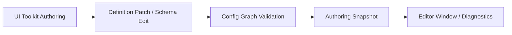

# Authoring / Editor Spec

## 目的

定义 Editor authoring 如何服务 Definition & Generation Layer，而不反向定义 GAS Runtime Core Layer。

## 数据流

## 核心契约

1. Editor 只能产出 definition patch、diagnostics 和 authoring snapshot。（不变量 8, `BAKE-01`）
2. Editor 不持有 runtime lifecycle owner。（不变量 8, `SYS-05`）
3. Odin / Sirenix 不作为 GAS authoring 主模型。**拒绝理由**：Odin/Sirenix 的 Inspector 依赖 managed reflection 和 `[ShowInInspector]` 等特性，不适合作为 DOTS `Baker` / `BlobAsset` 数据配置的主模型；目标使用 UI Toolkit + generated binding layer 实现无反射 authoring，直接对接 `GASDefinitionTable`。
4. Authoring Hub 只读 runtime generated/bake/integration summary。（`CONTENT-01`）

## 验收

1. Editor assembly 不污染 runtime package。
2. UI Toolkit windows 复用 DefinitionTable / diagnostics contract。
3. Authoring snapshot 不暴露 ECS runtime state。
## 历史方案定位

1. 方案15 的 Layer 4 数据配置层、SourceGenerator 标记和 generated component 示例来自 `../历史方案参考/方案15.md:94-189`。
2. 当前 Demo 的 UI / 业务层只消费事件、不进入 ECS 内核的参考来自 `../历史方案参考/方案12.md:713-752`。
3. 配置编辑和业务验证视角可回看 `../历史方案参考/方案14.md:754-779`。
