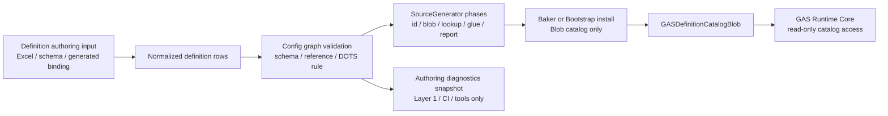

# Definition Authoring 边界 Spec

## 目的

本文件只定义 Definition Authoring 输入面如何服务 Definition & Generation Layer，并约束它不得反向定义 GAS Runtime Core。它不是 Editor UI 实现文档，也不记录窗口、面板、具体控件或当前工具实现。面向业务的短编辑路径和配置链职责见 `19-GAS业务编辑路径与配置链职责Spec.md`。

Authoring 在目标态中的职责只有三类：

1. 产出可被 Luban / SourceGenerator / Baker / Bootstrap 消费的 definition 输入。
2. 产出配置诊断、schema 约束和 authoring snapshot。
3. 证明所有 authoring artifact 都停留在 Definition & Generation Layer 或 Application Shell，不进入 Runtime Core hot path。

## 数据流

## 官方依据与设计论证

| 目标态选择 | 官方规则依据 | 为什么更优秀 | 为什么有必要 |
|---|---|---|---|
| Authoring 只产出 definition 输入和诊断快照 | `BAKE-01`、`BAKE-02`、`SYS-01`、`SYS-05` | 配置编辑、诊断和运行时权威状态分离，Runtime Core 只看不可变数据 | Editor / tool 生命周期不稳定，不能成为 gameplay tick owner |
| Baker / Bootstrap 只安装 catalog | `BLOB-01`、`BLOB-02`、`CASE-07`、`CASE-39`、`CASE-40` | 静态定义进入 immutable Blob，Runtime job 可 Burst-friendly 连续读取 | 官方 Baker 无状态、无序、多次执行；把 gameplay lifecycle 放进 Baker 会破坏 deterministic simulation |
| Authoring 诊断不暴露 runtime state | `ODF-06`、`DBG-01`、`SYS-05` | 诊断输出能复核配置质量和生成边界，但不成为 Runtime Core 输入 | Debugger / validation 若可写回 gameplay，会把观察链路变成隐藏控制面 |
| 拒绝反射式 managed authoring 模型进入核心链路 | `BUR-01`、`QRY-01`、`PRF-07` | Runtime-visible artifact 保持 unmanaged、可审查、可生成 manifest | managed reflection、Inspector 特性或对象图不能进入 Burst/job hot path |

## 核心契约

1. Definition Authoring 输入可以来自 Excel、schema、generated binding 或外部工具，但进入 Runtime Core 前必须被压缩成 immutable Blob / index / range / unmanaged record。
2. Authoring 诊断只输出配置错误、引用错误、schema hash、content hash、DOTS rule coverage 和 generated manifest；不得输出或保存 Runtime Core 可写状态。
3. Baker 必须无状态，只负责 authoring 到 Blob/component 的数据搬运、依赖声明和 Blob 注册；复杂批处理只能进入明确的 Baking System plan，不进入 runtime gameplay System。
4. Bootstrap 只能安装 catalog、World 配置和初始化只读 singleton；不得创建 gameplay lifecycle owner 或隐藏 Runtime Core schedule。
5. 任何 Editor、CI、tooling assembly 都不得成为 Runtime assembly 的 source dependency；Runtime Core 只依赖 generated runtime-visible artifact。
6. Authoring 工具可展示 diagnostics snapshot，但窗口、面板、交互实现属于 Application Shell / tooling，不属于本目标态目录的设计主题。

## 验收

1. Runtime assembly 不引用 Editor/tooling assembly。
2. Generated runtime-visible artifact 可归类为 definition、Blob、lookup、pure glue、validation summary、Baker glue 或 Bootstrap glue。
3. `GASDefinitionCatalogBlob` 的创建来源、hash、owner 和 dispose 策略可复核。
4. Authoring diagnostics snapshot 不包含 Runtime Core 可写 component、buffer、EntityManager handle 或 gameplay lifecycle owner。
5. 任何 authoring 变更进入 Runtime 前都必须重新生成 manifest，并通过 SourceGenerator Ownership Gate 与 DOTS rule coverage gate。

## 历史方案定位

1. 方案15 的 Layer 4 数据配置层、SourceGenerator 标记和 generated component 示例来自 `../历史方案参考/方案15.md:94-189`。
2. Demo 的 UI / 业务层只消费事件、不进入 ECS 内核的参考来自 `../历史方案参考/方案12.md:713-752`。
3. 配置编辑和业务验证视角可回看 `../历史方案参考/方案14.md:754-779`。
