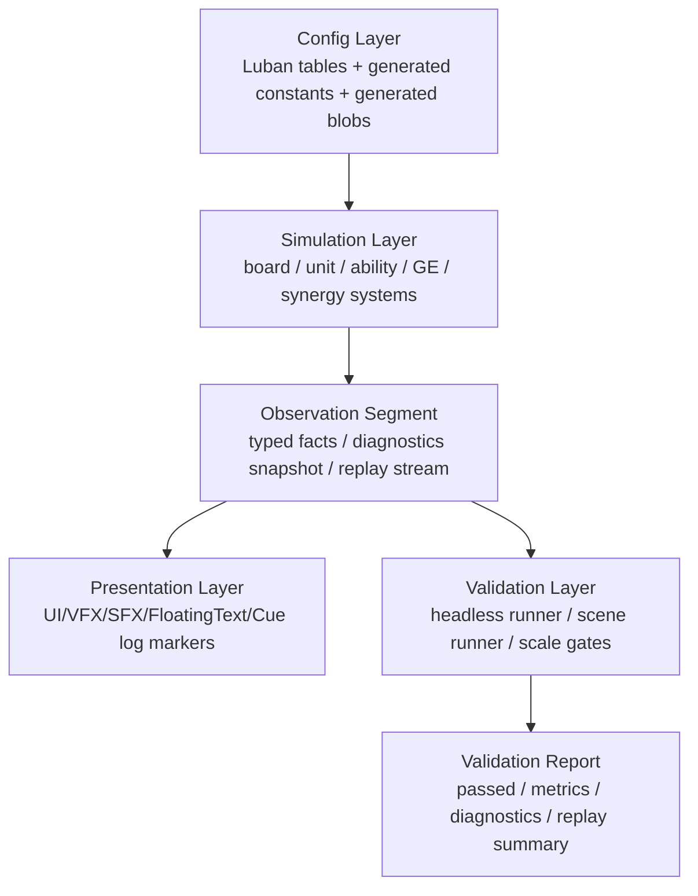
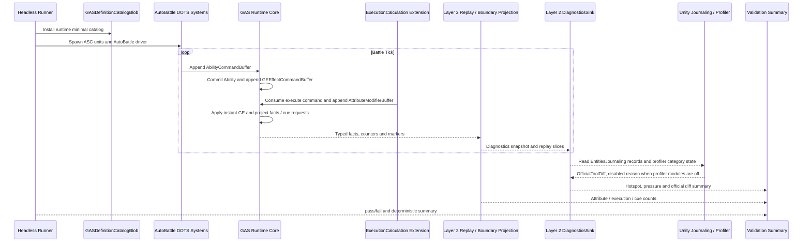
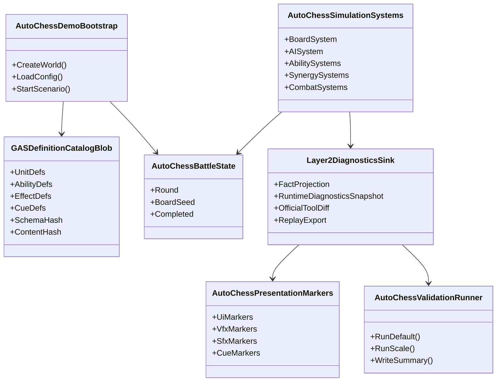

# AutoChessDemo 验收 Demo 目标态 Spec

## 目的

`AutoChessDemo` 是 EX-GAS 2.0 的标准全链路验收 Demo，不是 Runtime Core 的内部样例代码。它必须作为独立 Unity Demo 工程目录存在，用无画面可自动运行、自动结算、自动验证的业务场景，持续验证 Runtime Core、Luban / SourceGenerator 配置链、Debugger、Observation / Presentation / Cue 边界和规模曲线。

无头只表示默认不接真实角色、美术、UI、VFX、SFX 资源，不表示省略真实 Demo 应有的表现交互架构和业务流程。UI、特效、音效、飘字和 GameplayCue 必须通过日志 marker、presentation outbox 或 replay facts 完整占位；后续接入真实资源时只能替换表现桥或资源绑定，不能重写业务链路。

## 当前状态与剩余问题

已完成的旧问题不再保留为当前风险：

1. AutoChess 验收代码已经从 Runtime Core 包边界移出，当前可执行入口位于 `Assets/AutoChessDemo`。
2. 旧 `HeadlessAutoChess*` 配置源、组件堆叠、scale/profile DTO 已从 AutoChessDemo 编译面清除；当前不再把旧 `C*` / `B*` / `S*` Demo 类型作为命名或架构样例。
3. 当前可执行切片收敛为 `AutoBattle` 2v2 最小 Runtime Core 验证链，先证明 AbilityCommand、DefinitionCatalog、GE command stream、Attribute delta、ExecutionCalculation typed fact、Cue / Replay projection 能闭环。

仍然保留的目标态问题：

1. 完整 4v4 自走棋、Luban 表、SourceGenerator 生成 catalog、ScaleProfile、Presentation outbox 和 Physics / Graphics profile 仍未落地。
2. 当前 `AutoBattleDefinitionCatalogBuilder` 是运行时安装的最小 catalog，用于验证 Runtime Core 链路；它不是 Luban / SourceGenerator 的长期替代。
3. 当前最小链路已经具备 x1 functional gate 和 x50 diagnostic gate；x50 通过 AIBridge 驱动真实 Unity Editor，并保存 Unity Profiler 官方 `.data` capture。后续仍缺 x100 / x1000 曲线、allocator / chunk / buffer pressure 更细分统计和 Player / AOT 口径。
4. 官方案例和文档约束仍适用：性能测试要采用 warmup / measurement / allocator cleanup 口径，配置和资源链路目标态必须走 Blob / Baker / Boundary，Simulation hot path 不照搬入门 `SystemAPI.Query` foreach。
5. Unity Physics 与 Entities Graphics 仍是可选 profile；默认无头可以 disabled，但目标 summary 必须输出 disabled reason，启用时必须拆分 physics fixed-step cost、presentation marker cost 和 render cost。
6. Debugger 不再扩展为项目自研 Profiler。Runtime Core 只输出 GAS 语义 counters、Layer 2 diagnostics snapshot 和 official tool diff；性能 Timeline、TopN、结构变化归因和内存视图优先使用 Unity Profiler、Entities Profiler Modules、Entities Journaling 与 AIBridge 驱动的真实 Editor / Player 工具链。

## 目标目录

目标 Demo 根目录：

```text
Assets/AutoChessDemo
```

目标目录结构：

```text
Assets/AutoChessDemo
  Runtime/
    Bootstrap/
    Board/
    Units/
    AbilityLogic/
    Effects/
    Combat/
    PhysicsBridge/
    Synergy/
    AI/
    Observation/
    Presentation/
      Contracts/
      LogOutboxBridge/
      UnityOutboxBridge/
      EntitiesGraphicsBridge/
    Validation/
    Debugging/
  Authoring/
    Baker/
    ScriptableObjects/
    EditorBridge/
  Config/
    LubanTables/
    SourceGenerator/
    GeneratedRuntime/
    GeneratedEditor/
    PhysicsProfiles/
    RenderProfiles/
  Tests/
    EditMode/
    PlayMode/
    Headless/
  Scenes/
    AutoChessDemo.unity
  Content/
    Placeholder/
    ResourceBinding/
  README.md
```

目录边界：

1. `Assets/GAS/Runtime` 只保留 GAS Runtime Core、Definition、Debugger core、Observation core 和通用 Cue contract。
2. `Assets/AutoChessDemo/Runtime` 只写 Demo 业务系统，不成为 GAS Runtime Core 的反向依赖。
3. `Assets/AutoChessDemo/Config/GeneratedRuntime` 保存可审查的 Demo 生成代码；生成产物是否进入版本控制由 `.gitignore` 和生成链路规范决定，但目标结构必须清晰。
4. `Assets/AutoChessDemo/Runtime/Presentation` 只消费 Observation facts / presentation outbox，不直接读写 Simulation state。
5. `Assets/AutoChessDemo/Runtime/Validation` 负责自动运行、自动结算、summary 输出和规模门槛。
6. `Assets/AutoChessDemo/Content/Placeholder` 保存日志占位资源映射，`Content/ResourceBinding` 为未来真实资源接入保留同构入口。
7. `Runtime/PhysicsBridge` 只负责把 Unity Physics query / event 转成 Demo command / fact，不直接改 GAS Core state。
8. `Runtime/Presentation/EntitiesGraphicsBridge` 只消费 presentation outbox，把 marker 映射成 `RenderMeshArray` / `MaterialMeshInfo` / material override 或真实资源 side effect。

## 真实 Demo 架构约束

AutoChessDemo 默认无画面运行，但必须像真实 Demo 一样组织文件和调用链：

1. Bootstrap 负责加载配置、创建 world、创建场景实体、启动 runner。
2. Simulation 只处理 ECS gameplay state，不知道 UI、VFX、SFX 是否真实存在。
3. Observation 只投影 facts、replay、debug counters 和 presentation outbox。
4. Presentation 必须有真实 bridge 分层：默认 `LogOutboxBridge` 输出 marker，后续 `UnityOutboxBridge` 可接入真实 UI / VFX / SFX 资源。
5. Validation 不走特殊捷径，必须通过同一套 Bootstrap、Simulation、Observation、Presentation 链路收集结果。
6. SceneRuntime runner 和 headless runner 只能在启动方式、输出路径和资源 bridge 上不同，不能分裂业务逻辑。
7. PhysicsBridge 是可选 profile。默认精品链路使用纯 ECS target / hit 数据；physics-enabled profile 才用 `PhysicsWorldSingleton` / `SimulationSingleton` 验证空间 query 和 event 转换。
8. EntitiesGraphicsBridge 是可选 rendered profile。默认无头链路输出 marker；rendered profile 才验证 `RenderMeshArray`、`MaterialMeshInfo`、material override、draw command 和 BRG / Profiler 证据。

## Layer 1 业务验收模型

`AutoChessDemo` 整体属于项目四层架构中的 **Layer 1 Application Shell Layer / 业务验收层**。本节的 Config / Simulation / Observation / Presentation / Validation 是 Demo 内部业务链路分段，不是项目主四层的重新命名；Runtime Core 仍属于 Layer 3，Runtime Debugger snapshot / official tool diff 仍属于 Layer 2。



### Config Layer

职责：

1. 维护棋子、职业、阵营、属性、技能、GE、Cue、表现 marker、回合参数和规模参数的 Luban 表。
2. 由 SourceGenerator 生成属性常量、Tag bit、Ability / GE static lookup、Blob builder、Generated Runtime Glue、query glue 和 Demo 专用 validation constants。
3. 生成链路必须服务 Demo 验收，同时反哺 `08-Luban-SourceGenerator配置生成链路Spec.md`。
4. 详细配置表、生成物和验收规则见 `11-AutoChessDemo-Luban配置方案Spec.md`。

禁止：

1. 在 Demo bootstrap 中手写巨量 definition rows 作为长期结构。
2. 在 Simulation hot path 中解析 JSON、查字符串或动态组装 GE component config。
3. 让 SourceGenerator 生成 gameplay lifecycle 逻辑。

### Simulation Layer

职责：

1. 维护棋盘、站位、单位、阵营、AI 选敌、普攻节奏、技能释放、伤害、治疗、护盾、死亡、召唤、羁绊、控制、净化、吸血、毒、处决、狂暴等业务系统。
2. 通过 GAS Runtime Core 的 EffectCommand / Spec/Delta/Fact 语义链 / AttributeDelta / ActiveEffectStore / GameplayFacts 契约表达业务。
3. 业务系统必须是可拆分、可测试的 ECS systems，不允许重新堆出 `Scenario` 式巨类。

禁止：

1. Demo 业务系统直接创建 Runtime Core 内部私有结构。
2. 用全局 EventBus 作为 high-frequency reaction 主输入。
3. 通过 MonoBehaviour / managed callback 驱动 Simulation hot path。

### Observation Segment

职责：

1. 将 Simulation facts 投影为 Replay 片段、validation facts、presentation outbox，并消费 Layer 2 Diagnostics snapshot。
2. 明确 core simulation tick、observation projection tick、presentation marker tick、export / bootstrap tick 的统计口径。
3. 为 x1、x50、x100、x1000 规模门槛提供机器可读 summary。

禁止：

1. Observation 反向修改 gameplay state。
2. 让 Debugger、Replay 或 Layer 2 Diagnostics snapshot 成为业务路由。
3. 用人读日志替代 structured counters。

### Presentation Layer

职责：

1. 在无头模式下使用 log marker 占位 UI / VFX / SFX / FloatingText / GameplayCue。
2. 在有画面模式下允许替换为真实 UI 和资源，但必须消费同一套 presentation outbox。
3. 验证表现逻辑是否完整触发，而不是验证资源是否存在。

禁止：

1. 让表现层读取或写入 Simulation 权威状态。
2. 因为无头运行而删除 Cue、UI、VFX、SFX、FloatingText 链路。

### Validation Layer

职责：

1. 提供 headless runner、scene runner、scale runner 和 deterministic replay runner。
2. 输出统一 summary：`passed`、`completed`、`battleTicks`、`measuredTicks`、`coreTickMs`、`observationTickMs`、`presentationTickMs`、`diagnostics`、`cueMarkers`、`scale`、`entityCount`、`chunkCount`、`factCount`、`commandCount`。
3. 默认 x1 证明业务闭环，x50 放大热点，x100 / x1000 作为早期曲线，x10w / x100w 作为目标架构压力验收设计。
4. 输出 API 选型健康摘要：`globalBufferPressure`、`nativeStreamMerge`、`chunkSkip`、`lookupUpdateCount`、`randomLookupCount`、`structuralQueryBatchCount`、`deterministicOrderPolicy`、`apiSelectionWarnings`。
5. 输出官方案例对照摘要：`casePattern`、`caseViolation`、`case01MainThreadQueryCount`、`case07BufferSpill`、`case08EcbSortKeyPolicy`、`case10BlobBakeCoverage`、`case11BoundaryResourceLoad`、`case12WarmupDroppedTicks`。
6. 输出官方文档覆盖检查摘要：`officialDocTopic`、`odfRule`、`odfViolation`、`worldTimePolicy`、`allocatorRewindPolicy`、`chunkFragmentationScore`、`bufferExternalizedCount`、`weakResourceLoadState`、`transformStaleDataPolicy`、`linkedEntityGroupPolicy`、`deterministicRandomState`、`unityToolEvidence`。
7. 输出官方版本和 Player / AOT 口径：`officialPackageVersion`、`packageCachePath`、`manifestLockSkew`、`burstAotPolicy`、`burstOptimizeFor`、`burstSafetyChecks`、`cpuArchitecture`、`burstWarningPolicy`。
8. 输出 Authoring / Baking / Prefab 边界口径：`bakingWorldPolicy`、`bakerPhasePolicy`、`bakingSystemGroupPolicy`、`entityPrefabReferencePolicy`、`prefabLoadResultState`、`includePrefabQueryPolicy`。
9. 输出 managed / allocator 安全口径：`managedBoundaryPolicy`、`managedBridgeCount`、`managedCloneDisposePolicy`、`allocatorAliasPolicy`、`ecbAllocatorLifetimePolicy`。

## 业务覆盖

业务链路原则：精而不是多。AutoChessDemo 只保留少数能覆盖 GAS 核心概念和工程边界的代表性链路，每条链路都必须贯穿 Demo config、Demo simulation、Layer 2 diagnostics/replay snapshot、presentation marker 和 validation summary。

### 本轮最小 Runtime Core 验证切片

当前 Runtime Core 正在从主线程 buffer/EntityManager 链路迁移到 chunk/job/record 链路，因此 AutoChessDemo 的第一条可执行验收不直接扩成完整 4v4，而是以 `Assets/AutoChessDemo/AutoBattle` 的 2v2 精链路先证明新 Core API 可用。该切片是目标态 AutoChess 的 Functional x1 前置门，不替代完整自走棋业务案例。

本轮实现采用破坏性收敛：旧 `HeadlessAutoChess*` 巨型配置源、旧组件堆叠和 scale DTO 不进入最小链路；当前只保留 AutoBattle、runtime bootstrap、headless runner 和 presentation 占位。

最小切片必须覆盖：

1. Bootstrap：`HeadlessAutoChessRuntimeSystemBootstrap` 把 Demo 专用 system 注册进 GAS 固定步进组，而不是依赖默认 world 自动发现。
2. Definition：`AutoBattleDefinitionCatalogBuilder` 运行时安装最小 `GASDefinitionCatalogBlob`。长期目标仍是 Luban / SourceGenerator 生成 catalog，本 builder 只用于当前 Runtime Core 验证。
3. Command Drive：Functional x1 业务 AI 用 `SystemAPI.Query` 收集 ASC 单位快照，生成 frame-local `AutoBattleUnitTargetStateRecord`，再写入 `AbilityCommandBuffer`；AutoBattle hot path 不再为每个单位指令创建 request entity，也不为 4 单位链路支付 `NativeStream + job schedule + Complete` 固定成本。
4. Ability / GE：Runtime Core 消费 `AbilityCommandBuffer`，继续执行 Ability grant / activate、generated catalog commit、GE command stream、instant modifier、cue request 和 replay projection。
5. ExecutionCalculation：`AutoBattleExecuteDamageCalculationSystem` 在 `GEExecutionCalculationExtensionSystemGroup` 中消费 `GEEffectCommandBuffer` 的斩杀 GE 命令，用 ECS query 顺序扫描目标 ASC 并写入 `AttributeModifierBuffer` 与 `GameplayEventBuffer{ExecutionCalculationOutputUpdated}` typed fact；event bus 只镜像 typed fact，`SourceFactSequence` 必须指向 fact sequence，不能复用 attribute delta sequence。
6. Attribute Projection：属性变化必须进入 `GameplayFactProjectionSystem` / `GameplayFactEventBridgeSystem` / `ReplayLogSystem` 的统一 fact 链路，再由 structured log 汇总。
7. Runner Summary：无头 runner 至少输出 `commands`、`attributeChanges`、`executionOutputs`、`cueRequests`、`battleTicks`、`avgTickMs`、`blockingDebugErrors`、`OfficialToolDiff`，并在失败时抛出包含 summary 的异常。

官方文档约束：

- Functional x1 只有 4 个单位，按 `ecs-workflow-intro.md` / `job-overhead.md`，小数据量 job 调度开销可能超过并行收益；因此当前 x1 使用直接 ECS query。x50+ 如切换回 chunk/job 路径，则必须按 `iterating-data-ijobchunk-implement.md` 通过 `ChunkEntityEnumerator` 安全处理 enableable mask，不能使用裸 chunk for-loop 假设。
- 同一文档说明 `ComponentLookup` / `BufferLookup` 是随机访问且效率最低；当前最小链路的选敌与 execution damage 都优先使用快照 record / chunk scan，暂不引入 random lookup。
- `systems-entitymanager.md` 说明 `EntityManager` 结构变化会产生 sync point，且不能在 jobs 中使用；AutoBattle AI 高频指令必须写 frame-local buffer/record，结构变化只能留在 Runtime Core commit / cleanup phase。
- `systems-time.md` 说明 `FixedStepSimulationSystemGroup` 固定间隔且一帧可多次更新；AutoChess 验收 summary 必须把该 fixed-step policy 作为默认 Simulation 时间口径。

核心链路：

| 链路 | 覆盖目的 | 最小机制 |
|---|---|---|
| 回合与单位链 | 验证场景生命周期、确定性随机、棋盘实体规模 | board、round、unit spawn、team、target selection、win/loss |
| 普攻与 Instant GE 链 | 验证 AbilityCommand、EffectCommand、Instant Spec、AttributeDelta | basic attack、damage、armor / resistance、attribute change facts |
| Duration / Period / Stack 链 | 验证 ActiveEffectStore、period tick、stack policy、tag grant / removal | poison 或 burn 选一种，不同时堆多个同类机制 |
| Passive / Synergy 链 | 验证 typed facts 驱动的 reaction，不依赖全局 EventBus 扫描 | 一个阵营或职业阈值，一个 passive trigger |
| Death / Cleanup 链 | 验证死亡、effect cleanup、cue marker、胜负结算 | death、remove active effects、death cue、result facts |
| Presentation / Cue 链 | 验证无头表现逻辑和未来真实资源接入点 | hp bar marker、damage text marker、skill cue、impact cue、sound cue |
| Debug / Validation 链 | 验证机器可读诊断和自动验收 | counters、facts hash、summary、scale profile |

非核心机制例如 Summon、Cleanse、LifeSteal、Execute、Enrage、DeathBurst、Counter 只能作为后续扩展案例，不进入默认验收链路。默认链路必须小而完整，能持续作为架构回归基准。

## 规模验收设计

AutoChessDemo 从设计上必须考虑十万实体和百万实体压力测试，但不同规模的目的不同：

| Gate | 目标实体级别 | 目的 | 口径 |
|---|---:|---|---|
| Functional x1 | 10-100 | 验证业务闭环和表现 marker | 必须完全启用 Config、Simulation、Observation、Presentation、Debugger、Validation |
| Diagnostic x50 | 1k-5k | 放大日常热点，定位 Runtime Core 和 Demo 架构问题 | 可以降低 presentation marker 采样率，但不能绕过 outbox |
| Diagnostic x100 | 5k-10k | 验证精品业务链路在中等规模下仍保持 `0.X ms` tick | Debugger counters 全开，人读日志关闭 |
| Diagnostic x1000 | 50k-100k | 验证热路径是否仍保持线性扩展 | 只输出结构化 counters、采样 facts 和 marker 汇总 |
| Stress x10w | 100k+ | 验证 chunk 布局、query、buffer、facts、command stream 和 generated lookup | 默认关闭人读日志，只保留结构化 counters 和采样 facts |
| Stress x100w | 1,000,000+ | 验证 ECS 架构上限设计和退化曲线 | 可使用 synthetic unit archetype 和 deterministic workload，但必须走同一 Simulation contracts |

高规模规则：

1. 高规模测试不能通过删除 Ability / GE / Attribute / Facts 链路换取数字。
2. 高规模可以降低表现 marker 采样率，但必须输出 marker dropped / sampled / total counters。
3. 高规模必须区分 config load、bootstrap spawn、core simulation、observation projection、presentation marker、debug export。
4. 十万 / 百万实体测试优先用于架构趋势和热点定位，不要求每轮文档治理或代码提交都运行。

## 实机性能指标参考

本节定义 AutoChessDemo 精品业务链路的目标态性能门槛。这里的数值不是 Unity / DOTS 官方承诺，而是本项目用于判断 GAS ECS Runtime 是否达到目标态的验收阈值。

### 计量口径

1. 性能结论默认只接受 `ecsRuntimeTickOnly` 口径：只统计 AutoChess Simulation Systems、GAS Runtime Core、Boundary Projection、Presentation marker 生成和 Runtime Core Debugger counters。
2. **World Time 配置**：无头 runner 必须使用 `FixedStepTime(1.0f / 60f)` 的独立 World，通过 `ICustomBootstrap` 创建。默认 headless profile 不隐式依赖 Editor 的 `World.Time` 或 `VariableStepTime`。Validation summary 必须输出 `worldTimePolicy`（取自 `autochess.scale_profile.xlsx` 的 `TimePolicy` 字段），并显式标注是否使用了 Editor frame delta。此约束来自 `90-目标态不变量.md` 第 31 条。
2. `config load`、`bootstrap spawn`、Scene 加载、Luban JSON 解析、报告文件写入、人读日志打印、Editor GUI 和 Profiler 窗口刷新必须单独统计，不能混入 `coreTickMs`。
3. `coreTickMs` 只代表 Simulation + GAS Runtime Core；`runtimeTickMs` 代表 `core + observation + presentation + debugger counters`，不包含 export / log flush。
4. `physicsStepMs`、`physicsQueryMs`、`physicsEventConsumeMs` 和 `renderMs` 必须单独统计；默认 headless profile 中这些字段可以为 0，但必须输出 `physicsDisabledReason` / `entitiesGraphicsDisabledReason`。
5. x1 / SceneRuntime 可以保留完整 marker；x50 以上必须关闭逐条人读日志，只保留结构化 counters、采样 facts 和 marker 计数。
6. 每个性能 profile 必须先 warmup，再采样。`avgTickMs` 只能由 measured ticks 计算；bootstrap、ASC 创建、配置加载、首帧 group 初始化、Journaling 启用、Burst / Editor warmup 和 cleanup 只能进入单独的 total / setup / teardown 字段。x1 如果战斗 tick 过短，应重复运行多局汇总；x50 以上建议至少采样 256 个 measured ticks，丢弃前 10% warmup ticks。
7. 性能指标必须同时输出 `avg`、`p95`、`max`、`perSystemTopN`、`entityCount`、`commandCount`、`factCount`、`structuralChangeCount`、`syncPointCount`、`gcAllocBytesPerTick`。
8. idle tick 不参与“优秀”判断。每个 profile 必须满足配置中的 `ExpectedCommandRange`、`ExpectedFactRange` 和核心链路覆盖要求，否则只能说明空转性能，不算 GAS 业务性能验收。
9. API 健康指标必须随性能指标一起输出，至少包含 global buffer spill、NativeStream merge cost、chunk skip ratio、lookup update count、random lookup count、query bulk structural count、ECB per-entity command count。

### 精品业务链路负载基线

用于性能验收的默认业务链路必须小而完整，不能为了跑分删除 GAS 语义：

| 链路 | 最小负载要求 |
|---|---|
| 普攻与 Instant GE | 每个有效战斗 tick 都有稳定 AbilityCommand / EffectCommand / AttributeDelta 产出 |
| Duration / Period / Stack | 至少一种 period effect 在战斗中持续存在，并产生 tick / expire / stack facts |
| Passive / Synergy | 至少一种 typed fact reaction 参与结算，不允许使用全局 EventBus 扫描替代 |
| Death / Cleanup | 必须覆盖死亡、active effect cleanup、death cue 和 result facts |
| Presentation / Cue | x1 完整输出 UI / VFX / SFX / FloatingText / Cue marker；高规模按采样率输出 sampled / dropped / total |
| Physics optional profile | 默认 disabled reason；启用时至少有一次 query / event -> EffectCommand 或 fact 转换 |
| Entities Graphics optional profile | 默认 disabled reason；启用时至少有 render proxy、MaterialMeshInfo 或 material override 统计 |
| Debug / Validation | 必须输出 Runtime Core counters、facts hash、summary hash 和热点 TopN |

### 分档性能阈值

| Gate | 通过线 | 优秀线 | 说明 |
|---|---|---|---|
| Functional x1 | `coreTickAvgMs <= 0.20`, `coreTickP95Ms <= 0.40`, `runtimeTickAvgMs <= 0.50` | `coreTickAvgMs <= 0.08`, `coreTickP95Ms <= 0.15`, `runtimeTickAvgMs <= 0.25` | 默认精品链路必须达到 `0.0X - 0.X ms` 级别；当前 `1.x ms` 仍视为严重异常 |
| SceneRuntime x1 | `coreTickAvgMs <= 0.30`, `coreTickP95Ms <= 0.60`, `runtimeTickAvgMs <= 0.80` | `coreTickAvgMs <= 0.12`, `coreTickP95Ms <= 0.25`, `runtimeTickAvgMs <= 0.40` | Unity 实机场景允许 MonoBehaviour runner 和 scene bridge 少量开销，但不能混入日志打印 |
| Diagnostic x50 | `coreTickAvgMs <= 0.50`, `coreTickP95Ms <= 1.00`, `runtimeTickAvgMs <= 1.20` | `coreTickAvgMs <= 0.30`, `coreTickP95Ms <= 0.60`, `runtimeTickAvgMs <= 0.80` | x50 是日常热点放大门槛；达到优秀可认为常规 Runtime Core 链路已经进入健康区间 |
| Diagnostic x100 | `coreTickAvgMs <= 0.80`, `coreTickP95Ms <= 1.50`, `runtimeTickAvgMs <= 2.00` | `coreTickAvgMs <= 0.50`, `coreTickP95Ms <= 1.00`, `runtimeTickAvgMs <= 1.30` | x100 用于验证中等规模下没有流程级阻塞 |
| Diagnostic x1000 | `coreTickAvgMs <= 2.00`, `coreTickP95Ms <= 3.50`, `runtimeTickAvgMs <= 5.00` | `coreTickAvgMs <= 1.20`, `coreTickP95Ms <= 2.50`, `runtimeTickAvgMs <= 3.50` | x1000 是进入十万级压力前的线性扩展门槛 |
| Stress x10w | `coreTickAvgMs <= 3.00`, `coreTickP95Ms <= 5.00`, `runtimeTickAvgMs <= 7.00` | `coreTickAvgMs <= 2.00`, `coreTickP95Ms <= 3.50`, `runtimeTickAvgMs <= 5.00` | 目标架构压力验收；允许采样 presentation，但必须保留 Runtime Core contracts |
| Stress x100w | `coreTickAvgMs <= 16.00`, `coreTickP95Ms <= 25.00`, `runtimeTickAvgMs <= 33.00` | `coreTickAvgMs <= 8.00`, `coreTickP95Ms <= 12.00`, `runtimeTickAvgMs <= 16.00` | 百万级是架构上限和退化曲线验证，不作为每轮 Goal 的日常前置 |

所有 Gate 还必须满足：

1. `gcAllocBytesPerTick == 0`，否则不能标记优秀。
2. `syncPointCount == 0`，否则不能标记优秀。
3. 热路径 `structuralChangeCount == 0`；结构变化只能出现在明确的 command playback phase 或 bootstrap / cleanup phase。
4. 单个 Runtime Core system 的 `systemTickP95Ms <= 0.25` 才能认为没有局部热点；x10w / x100w 可按 profile 单独放宽，但必须给出热点归因。
5. `managedCallbackCount == 0`，Runtime Core 不能在 simulation tick 内回调 OOP / MonoBehaviour / static C# event。
6. 如果本轮任务声明 API 选型优秀，则对应 `apiSelectionWarnings == 0`，且没有未解释的 global buffer spill、逐实体 ECB 批量结构变化、无序 ParallelWriter gameplay 输出或高频 random lookup。

### DOTS API 健康验收

AutoChessDemo 是 API 选型的自动验收场，不只是业务验收场。每个 ScaleProfile 都必须输出下列 API 健康指标：

| 指标 | 目的 | 异常信号 |
|---|---|---|
| `globalBufferLength/Peak/Spill` | 判断 command/fact/outbox 是否退化为全局队列 | x50 起持续增长或 spill |
| `nativeStreamForEachCount/MergeMs` | 判断多 job fan-in 是否健康 | merge 成本高于主计算或 dispose 缺失 |
| `chunkMatched/Skipped/SkipRatio` | 判断 Chunk Component / chunk precheck 是否生效 | 大量 idle/no-op 仍全量扫描 |
| `lookupUpdateCount/randomLookupCount` | 判断是否过度依赖 `ComponentLookup` / `BufferLookup` | lookup 数随实体数线性爆炸 |
| `structuralQueryBatchCount` | 判断结构变化是否 query bulk | 大批量变化仍表现为 per-entity ECB |
| `ecbPlaybackCount/ecbCommandCount` | 判断 ECB 是否成为主线程热点 | per-hit command 或 playback 分散 |
| `deterministicOrderPolicy` | 判断并行输出是否可复现 | gameplay 输出来自无序 ParallelWriter |
| `systemAssociatedStateCount` | 判断 Debugger / cursor state owner | public system field 或隐式 singleton 不明 |
| `queryFiltered/Unfiltered/EnableableWait` | 判断 Query filter 是否有效且没有隐藏同步 | filter 无效、enableable 写 job 导致等待 |
| `dynamicBufferExternalizedCount` | 判断 buffer 是否已经外置并造成 chunk cache miss | spill 后持续外置且无替代方案 |
| `allocatorOwner/TempJobAge/RewindCount` | 判断 frame scratch 和 sample sink 生命周期 | Persistent 无 owner、TempJob 越界、rewind 后仍引用 |
| `archetypeCount/chunkUtilization/unusedEntities` | 判断是否进入 ECS 优势布局 | archetype 过多、chunk 空洞、shared unique value 爆炸 |
| `burstWarmupDropped/functionPointerBatchSize` | 判断 Burst profile 和 dynamic calculation 是否可信 | 首帧污染、每 modifier 小函数指针调用 |
| `weakResourceLoadState/presentationMarkerCount` | 判断无头表现链路是否完整 | 删除 Cue/UI/VFX/SFX 链路或 Core 等待资源 |
| `officialPackageVersion/packageCachePath/manifestLockSkew` | 判断官方文档证据是否可复核 | 使用不存在的 PackageCache `@version` 路径或版本口径混乱 |
| `burstAotPolicy/OptimizeFor/Safety/CPU/warningPolicy` | 判断性能 profile 是 Editor 口径还是 Player AOT 口径 | Editor JIT / AOT 设置差异污染性能结论 |
| `bakingWorldPolicy/entityPrefabReferencePolicy/prefabLoadResultState` | 判断真实 Demo 的 Authoring / prefab / resource lifecycle 是否完整 | 无头模式删除资源加载状态或 prefab query 口径 |
| `managedBoundaryPolicy/allocatorAliasPolicy/ecbAllocatorLifetimePolicy` | 判断 Boundary managed bridge 与 NativeContainer 生命周期是否安全 | managed component 进入 Core、alias 跨 dispose、ECB data 跨 playback |
| `physicsStepCount/queryCount/eventCount/broadphaseSyncCount` | 判断 Unity Physics profile 是否正确启用并可归因 | 物理成本混入 core tick、event 错帧或 query 全量主线程等待 |
| `entitiesGraphicsDrawCommand/instancesPerDraw/BRGMarker/renderCostMs` | 判断 rendered profile 是否正确拆分渲染成本 | 渲染成本混入 core tick、MaterialMeshInfo / RenderMeshArray 绑定缺失 |

验收规则：

1. x1 / x50 允许 proof API 存在，但必须在 summary 中标注 `proofOnlyApi` 和重新选型触发条件。
2. x1000 以上若仍使用全局 command / fact buffer，必须输出 buffer pressure 曲线和替代方案说明。
3. x10w / x100w 不接受未解释的 random lookup 热点、逐实体 ECB 批量结构变化或全量托管日志。
4. PerformanceExcellent 必须同时满足性能阈值和 API 健康阈值；二者任一失败都不能自动停止 Goal。
5. x10w / x100w 不接受未解释的 chunk fragmentation、DynamicBuffer externalized、enableable wait 或 Burst warmup 污染。
6. x50 以上若没有输出 PackageCache 实际版本、Burst AOT / Player 口径、Baking / prefab load state 和 managed / allocator 安全口径，不得宣布“官方 DOTS 文档体系已进入验收闭环”。
7. 启用 Physics / Graphics profile 时，若没有输出 `ODF-15..18` 对应指标，不得把结果用于目标态验收；未启用时必须输出 disabled reason。

### Goal 自动停止条件

当某个 Goal 的目标是“优化 AutoChessDemo 默认精品业务链路性能”时，只有同时满足以下条件，才可以把“性能指标优秀”作为停止 Goal 循环的依据：

1. Functional x1、SceneRuntime x1、Diagnostic x50、Diagnostic x100 全部达到优秀线。
2. Diagnostic x1000 至少达到通过线，并且曲线相对 x100 没有出现超线性退化。
3. Runtime Core Debugger 能输出分项 counters，并能解释 TopN 热点；不能只依赖 Unity Profiler 或 `systemTiming` 排序。
4. 语义验收全部通过：胜负、facts hash、summary hash、RequiredCueMarkers、RequiredFactKinds 都正确。
5. `gcAllocBytesPerTick == 0`、`syncPointCount == 0`、热路径 `structuralChangeCount == 0`。
6. 没有与当前链路直接相关的 P0 / P1 核心问题仍处于 Active 且无任务入口。

当 Goal 明确声明目标是“十万 / 百万级压力验收”时，停止条件必须额外包含 Stress x10w 达到优秀线；若任务声称已经验证百万级架构上限，则 Stress x100w 至少达到通过线，并提交退化曲线和热点归因。

## 数据流



## 类图



## 当前 Functional x1 跑通证据

2026-05-29 使用 `GAS.AutoChessDemo.HeadlessAutoChessRuntimeRunner.RunHeadlessAutoBattleOnce` 跑通 AutoBattle 2v2 最小链路。该链路属于 **Layer 1 Application Shell Layer / 业务验收层**，只通过 Layer 2 Diagnostics snapshot / official diff 观察 Runtime Core，不把 Demo 或 Debugger 放进 Layer 3。当前性能数据已采用 warmup-dropped 口径；旧 `15ms+` 平均值混入 bootstrap 与 frame 1-3 warmup，已废弃：

```text
completed=True, winner=Player, battleTicks=9, totalTicks=10,
warmupDroppedTicks=3, measuredTicks=7, commands=18, finishers=8,
attributeChanges=21, executionOutputs=5, cueRequests=8,
debugEvents=62, debugWarnings=22, debugErrors=0, blockingDebugErrors=0,
coreRequests=54, coreFacts=96, coreDeltas=34, coreCues=8,
peakEventBus=26, replayLag=0, journalingRecords=2128,
totalElapsedMs=169.515, factsHash=0x7C84FE91,
summaryHash=0x53F70297, avgTickMs=0.599
```

`debugErrors=0` 表示 Runtime Debugger 的错误语义不再被慢 timing 事件污染；`SystemTiming` / `TickSummary` 只用 Warning 暴露当前实现仍有可优化耗时。Functional x1 的阻断失败口径是 `blockingDebugErrors=0`。

```text
HeadlessAutoChessRuntimeTiming:
ecsRuntimeTickOnly=true
GASTickTotal(samples=7, avgMs=0.489, maxMs=0.876)
GASFramePrepareSystemGroup(samples=7, avgMs=0.036, maxMs=0.161)
GASCommandResolveSystemGroup(samples=7, avgMs=0.082, maxMs=0.203)
GASCoreSimulationSystemGroup(samples=7, avgMs=0.227, maxMs=0.321)
GASStructuralCommitSystemGroup(samples=7, avgMs=0.013, maxMs=0.024)
GASBoundaryProjectionSystemGroup(samples=7, avgMs=0.131, maxMs=0.187)
```

```text
HeadlessAutoChessOfficialToolDiff:
journalingAvailable=True, journalingCaptured=True,
journalingWorldRecords=2128, runtimeStructuralApprox=18,
journalingStructural=286, deltaStructural=-268,
runtimeCreates=18, journalingCreates=33, deltaCreates=-15,
runtimeDestroys=0, journalingDestroys=22, deltaDestroys=-22,
journalingGetComponentDataRW=349, journalingGetBufferRW=1493,
profilerAvailable=True, profilerEnabled=False,
structuralProfilerCategoryEnabled=False, memoryProfilerCategoryEnabled=False,
profilerCaptureState=profiler disabled; Entities profiler modules collect no data
```

Native leak trace 复跑结果：

```text
UNITY_JOBS_NATIVE_LEAK_DETECTION_MODE=2
completed=True, summaryHash=0x53F70297, debugErrors=0, blockingDebugErrors=0
Leak Detected: none
```

结论：最小链路已经证明 Runtime Core 可以被 Layer 1 业务 Demo 通过 Layer 2 boundary 打穿，且本轮无头 official diff 不再留下 NativeContainer / Persistent 泄漏。当前 measured hot path 已回落到 `0.X ms`，AutoBattle 业务侧已移除小规模 `NativeStream + Complete` 固定成本，`GASCommandResolveSystemGroup` 回落到 `0.082ms`。x50 规模证据见下一节；后续优化不再依赖自研 Profiler UI，而是用 Unity Profiler `.data`、Entities Journaling 和 Runtime Debugger counters 做差分。

## 当前 Diagnostic x50 实机 Editor 证据

2026-05-29 使用 AIBridge 1.4.1 驱动真实 Unity Editor，调用 `GAS.AutoChessDemo.HeadlessAutoChessRuntimeRunner.RunHeadlessAutoBattleOnce` 跑通 50 组独立 2v2（共 200 units）。AIBridge 只属于 Layer 1 工具链，Runtime Core 不依赖它；Profiler 证据来自 Unity 官方 `Window/Analysis/Profiler` 和 `UnityEditorInternal.ProfilerDriver`。

```text
completed=True, winner=Player, scale=50, units=200,
battleTicks=9, totalTicks=10, warmupDroppedTicks=3, measuredTicks=7,
commands=900, finishers=400, attributeChanges=1050,
executionOutputs=250, cueRequests=400,
debugEvents=62, debugWarnings=27, debugErrors=0, blockingDebugErrors=0,
coreRequests=2700, coreFacts=4800, coreDeltas=1700, coreCues=400,
peakEventBus=1300, replayLag=0, journalingRecords=48288,
processWarmupRuns=1, totalElapsedMs=36.488,
factsHash=0xA5CD85FF, summaryHash=0x69F5175B, avgTickMs=2.646
```

```text
HeadlessAutoChessRuntimeTiming:
ecsRuntimeTickOnly=true
GASTickTotal(samples=7, avgMs=2.628, maxMs=6.696)
GASFramePrepareSystemGroup(samples=7, avgMs=0.061, maxMs=0.100)
GASCommandResolveSystemGroup(samples=7, avgMs=0.853, maxMs=2.055)
GASCoreSimulationSystemGroup(samples=7, avgMs=1.114, maxMs=2.912)
GASStructuralCommitSystemGroup(samples=7, avgMs=0.026, maxMs=0.056)
GASBoundaryProjectionSystemGroup(samples=7, avgMs=0.573, maxMs=1.572)
```

```text
HeadlessAutoChessOfficialToolDiff:
journalingAvailable=True, journalingCaptured=True, journalingWorldRecords=48288,
runtimeStructuralApprox=900, journalingStructural=14202, deltaStructural=-13302,
runtimeCreates=900, journalingCreates=1601, deltaCreates=-701,
runtimeDestroys=0, journalingDestroys=1100, deltaDestroys=-1100,
journalingAddComponents=201, journalingRemoveComponents=0,
journalingSetComponentData=0, journalingSetBuffer=0,
journalingGetComponentDataRW=6791, journalingGetBufferRW=27295,
profilerAvailable=True, profilerEnabled=True,
structuralProfilerCategoryEnabled=True, memoryProfilerCategoryEnabled=True,
profilerCaptureState=profiler enabled; module counter data not exported by headless runner
```

官方 capture：

```text
Temp/AutoChessDemo-AIBridge-X50-EditorProfile.data
```

结论：

1. x50 已从“待输出指标”更新为当前已跑通的日常热点放大 gate；数据量是 50 组互不混敌的独立 2v2，用数量模拟真实游戏规模，避免 Demo 全局 `O(n^2)` 选敌污染 Runtime Core 判断。
2. `blockingDebugErrors=0` 表示功能链路通过；慢 timing 只保留为 Warning / TopN 线索，不进入功能错误计数。
3. 当前 x50 未达到目标态优秀线，热点集中在 `GASCoreSimulationSystemGroup`、`GASCommandResolveSystemGroup` 和 `GASBoundaryProjectionSystemGroup`。下一轮性能归因以 Unity Profiler Timeline / Entities module / Journaling 为准，项目 Debugger 只做 GAS 语义映射。
4. Journaling 记录显著高于项目 `runtimeStructuralApprox`，说明项目 counter 只覆盖 GAS Runtime 自认结构变化，官方记录还包含 bootstrap / cleanup / package 内部读写；结构变化结论以官方工具为主。

## 自动验收门槛

| Gate | 目标 | 必须输出 |
|---|---|---|
| x1 默认链路 | 业务闭环正确 | pass/fail、胜负、关键 facts、Cue marker 汇总 |
| SceneRuntime | Unity 实机场景可运行 | scene runner summary，与 headless runner 结果一致 |
| x50 profile | 放大热点 | core / observation / presentation / export 分项 tick，Runtime diagnostics counters，Unity Profiler `.data` capture，Entities Journaling diff |
| x100 / x1000 | 早期规模曲线 | 规模曲线、实体数、facts 数、buffer pressure、ECB / structural change counters |
| x10w / x100w | 目标架构压力设计 | chunk/query/stream/counter 曲线、采样策略、降级策略、瓶颈归因 |
| PerformanceExcellent | Goal 自动停止参考 | Functional x1、SceneRuntime x1、x50、x100 优秀线，x1000 通过线，0 GC / 0 sync point / 0 hot path structural change |
| deterministic replay | 可复现 | seed、tick、输入、facts hash、summary hash |

验收口径：

1. x1 不通过时不能进入性能讨论。
2. x50 热点不能只靠 systemTiming 排序解释，必须有 Runtime Core Debugger counters。
3. 表现 marker 缺失视为验收失败，即使数值结算正确。
4. x10w / x100w 允许使用采样 presentation 和 synthetic workload，但不能绕过 GAS Runtime Core contracts。
5. `Assets/GAS/Runtime/Demo/AutoChess` 已从当前编译面移除；任何新增 AutoChess 业务都必须进入 `Assets/AutoChessDemo`，并保持 `GAS.AutoChessDemo` 命名空间。
6. “性能指标优秀”必须以 `实机性能指标参考` 的分档阈值为准，不能用单次 `avgTickMs` 或未拆分口径的总耗时替代。

## 迁移规则

1. 已完成破坏性迁出：AutoChess 业务代码位于 `Assets/AutoChessDemo`，命名空间为 `GAS.AutoChessDemo`；Runtime Core 不再包含 Demo 业务。
2. 已完成最小链路收敛：旧手写配置源、旧组件堆叠、scale/profile DTO 退出编译面，当前以 AutoBattle 2v2 跑通 Runtime Core 前置门。
3. 下一阶段恢复目标态 Config / Generated / Validation 时，`HeadlessAutoChessGeneratedDefinitionRows` 必须变成 Luban / SourceGenerator 表驱动入口，不能回到巨类。
4. 下一阶段扩展 Simulation systems：Board、AI、Combat、Synergy、Ability、Effect reaction 独立文件和测试。
5. Observation / Presentation / Debugging 必须继续分层：AutoChessDemo 消费 Layer 2 Diagnostics snapshot 和 presentation outbox；Editor Debugger Window 作为 Layer 1 Editor Extension 单独实现，不放入 Demo。

## 设计预演定位

本 Spec 定义 AutoChess 验收的**基础设施和门槛**，不定义具体业务内容。具体棋子、属性值、技能配置、GE 参数、System 代码、业务走查和交互矩阵见 `10B-AutoChess完整业务案例设计Spec.md`。

10 和 10B 的关系：
- **10（本文件）**：验收 Demo 需要什么样的目录、什么链路覆盖、什么性能门槛、什么规模验证
- **10B**：验收 Demo 用什么棋子、什么属性、什么技能、什么 GE、什么 System、走什么业务流程

10B 同时是一次完整的 GAS 设计预演——用具体业务验证四层架构、Runtime Core 管线、Entity/Component 布局和 Luban/SourceGenerator 配置链能否承载真实 GAS 语义。

## 非目标

1. 不在本 Spec 中设计真实美术资源接入。
2. 不把 Demo 业务规则上升为 GAS Runtime Core 概念。
3. 不为了迁移 Demo 而恢复 OOP runtime 主链。
4. 不把方案12/13/14/15直接当当前实现，所有吸收内容必须经过本 Spec 收口。

## 历史方案定位

1. 方案12 的塔防业务案例、Luban / SourceGenerator 配置链和压力测试思路见 `../历史方案参考/方案12.md:81-148`、`../历史方案参考/方案12.md:621-646`、`../历史方案参考/方案12.md:996-1149`、`../历史方案参考/方案12.md:2017-2055`。
2. 方案13 的当前 Demo 业务拆解、Luban / SourceGenerator、移动 / 闪避 / 死亡 / 引导 / 耐力案例见 `../历史方案参考/方案13.md:941-1215`、`../历史方案参考/方案13.md:1309-2176`。
3. 方案14 的第一版 RPG 自走棋业务案例、Luban 配置、UI 层和四层职责见 `../历史方案参考/方案14.md:705-1038`；完整自走棋业务案例、配置表、ECS 数据、System 链路和 UI 解耦见 `../历史方案参考/方案14.md:1062-1508`、`../历史方案参考/方案14.md:2178-2351`。
4. 方案15 的四层架构、自走棋业务案例、Debugger 实战和完整业务管理器见 `../历史方案参考/方案15.md:35-92`、`../历史方案参考/方案15.md:788-1253`、`../历史方案参考/方案15.md:1330-1437`、`../历史方案参考/方案15.md:1533-1810`、`../历史方案参考/方案15.md:2228-2545`、`../历史方案参考/方案15.md:2661-2843`。
