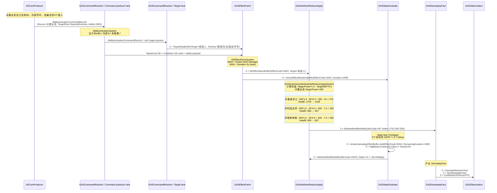
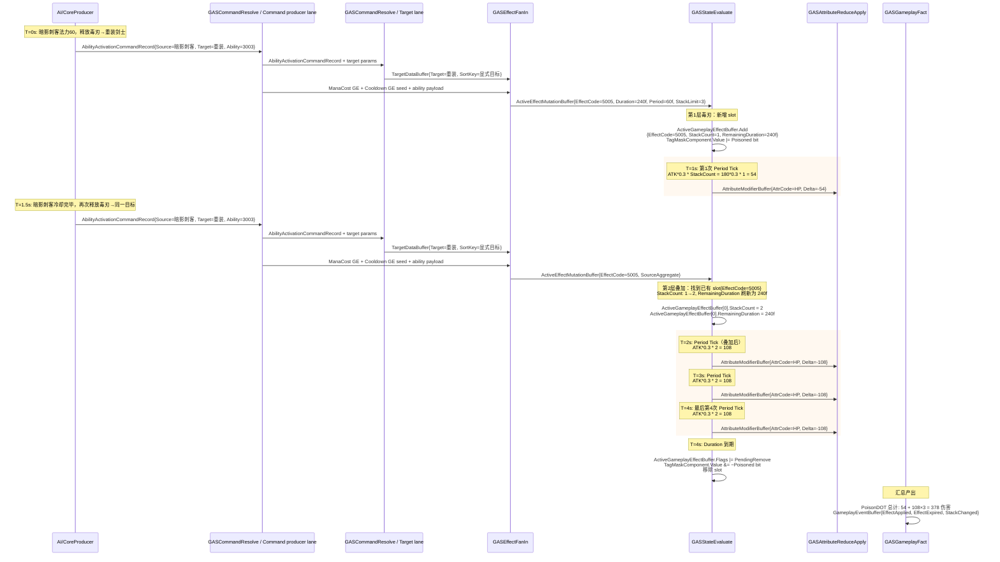

# 10B-06：完整业务流程走查

> Owner：`01-目标态架构共识/10B-AutoChess完整业务案例` | 状态：目标态子 Spec | 拆分来源：`../10B-AutoChess完整业务案例设计Spec.md` | 最近拆分：2026-06-07

本文件只描述 AutoChess 完整业务案例的目标态设计。禁止写入当前代码事实、执行流水、验证数字或下一步任务；现实证据必须回到 `../../00-当前架构事实/`，任务拆分必须回到 `../../02-主线任务树/`。
## 九、完整业务流程走查

### 走查 A：剑士"盾击"眩晕敌方前排

```
场景：己方霜甲剑士（2001）对敌方重装剑士（2005）释放盾击
涉及概念：Ability 激活、Instant damage GE、Duration stun GE、
          Granted tag (Stunned)、ASPD Override、tag 到期移除
```

**时序图（带 Component 写入标注）：**

```mermaid
sequenceDiagram
    participant AI as AI/CoreProducer
    participant Ingest as GASCommandResolve / Command producer lane
    participant Target as GASCommandResolve / Target lane
    participant Spec as GASEffectFanIn
    participant Lifecycle as GASStateEvaluate
    participant Delta as GASAttributeReduceApply
    participant Fact as GASGameplayFact
    participant Obs as GASObservation

    Note over AI: 剑士法力达到40，冷却完毕，选敌重装剑士
    AI->>Ingest: AbilityActivationCommandRecord<br/>{Source=剑士, Target=重装, Ability=3001}

    Note over Ingest: AbilityActivationSystem<br/>检查法力(40≥40✓)<br/>检查冷却(0≤0✓)<br/>检查自身tag(无眩晕✓)
    Ingest->>Target: AbilityActivationCommandRecord + target params
    Target->>Spec: TargetDataBuffer{Target=重装, SortKey=显式目标}
    Ingest->>Spec: ManaCost GE + Cooldown GE seed + ability payload<br/>不在 Ingest 直接写 AttributeSet

    Note over Spec: GEEffectFanInSystem<br/>查 GE BlobAsset: 5001=Instant, 5002=Duration
    Spec->>Spec: GEEffectSpecBuffer{EffectCode=5001, Target=重装}
    Spec->>Lifecycle: ActiveEffectMutationBuffer{EffectCode=5002, Duration=120f, StackLimit=0}

    Note over Lifecycle: State lane PostApply<br/>处理 mutation: 创建 ActiveGameplayEffectBuffer
    Lifecycle->>Lifecycle: ActiveGameplayEffectBuffer.Add<br/>{EffectCode=5002, RemainingDuration=120f, Flags=Active}
    Lifecycle->>Lifecycle: TagMaskComponent.Value |= Stunned bit
    Lifecycle->>Lifecycle: AttributeModifierBuffer{AttrCode=ASPD, Delta=0, Op=Override}

    Note over Delta: GASAutoChessAttributeSetReduceApplySystem<br/>计算盾击伤害: ATK*0.8 = 120*0.8 = 96
    Delta->>Delta: CombatAttributeCurrentSetComponent.Health -= 96<br/>Health(重装): 1800 → 1704
    Delta->>Fact: AttributeModifierBuffer{AttrCode=HP, Delta=-96, Target=重装}

    Note over Fact: GameplayEventDeathCheckSystem<br/>HP=1704 > 0, 未死亡
    Fact->>Obs: GameplayEventBuffer{FactCode=DamageResolved}<br/>PresentationEventBuffer{CueCode=ShieldBashVFX}

    Note over Lifecycle,Tick: 后续每帧 TickActiveSlotsJob<br/>RemainingDuration -= dt<br/>ASPD 维持 Override=0（眩晕中）

    Note over Lifecycle,Tick+120f: 眩晕到期
    Lifecycle->>Lifecycle: ActiveGameplayEffectBuffer.Flags |= PendingRemove
    Lifecycle->>Lifecycle: TagMaskComponent.Value &= ~Stunned bit
    Lifecycle->>Lifecycle: 移除 slot
    Lifecycle->>Fact: GameplayEventBuffer{FactCode=EffectExpired}

    Note over Delta: 眩晕结束后下一帧 AttributeReduceApply 恢复 ASPD
    Delta->>Delta: AutoChessCombatAttributeCurrentSetComponent.AttackSpeed = Base + Modifier<br/>重装剑士 ASPD: 0 → 90
```

**关键数据流步骤：**

```
1. AI/CoreProducer → AbilityActivationCommandRecord；ManaCost / Cooldown 作为 GE command seed 进入 Fan-In，不在 producer 直接写 AttributeSet
2. Effect Fan-In command record ×2 → 分别产出 InstantSpec 和 ActiveEffectMutation
3. Instant GE (5001): MMC ATK*0.8 = 96 → `CombatAttributeCurrentSetComponent.Health -= 96`
4. Duration GE (5002): ActiveGameplayEffectBuffer.Add → TagMaskComponent |= Stunned → ASPD Override=0
5. Duration tick: 每帧 RemainingDuration -= dt，ASPD 保持 0
6. 到期: PendingRemove → TagMaskComponent &= ~Stunned → 下一帧 ASPD 恢复
7. 整个链路产出: DamageResolved fact + EffectExpired fact + ShieldBashVFX cue
```

### 走查 B：法师"冰霜新星"打击 3 个敌人

```
场景：己方冰霜女巫（2002）释放冰霜新星，命中 3 个敌方单位
涉及概念：AoE 多目标、Instant damage GE、Duration slow GE、
          多目标 AttributeDelta、MagicPower MMC
```

**时序图（带 Component 写入标注）：**



**关键数据流步骤：**

```
1. AI/CoreProducer → AbilityActivationCommandRecord；扣 80 法力 / 冷却 300f 均由后续 GE seed 统一进入 Fan-In
2. 3×Effect Fan-In command record(5003) → 3×GEEffectSpecBuffer / resolved modifiers → GASAutoChessAttributeSetReduceApplySystem
3. 每个目标独立计算 MMC: MagicPower*1.5 - TargetDEF*0.3
4. 伤害写入 3 个 target ASC 的 `AutoChessCombatAttributeCurrentSetComponent.Health`（不同 entity/chunk 可并行）
5. 3×Effect Fan-In command record(5004) → 3×ActiveEffectMutationBuffer → 3×ActiveGameplayEffectBuffer
6. 3×TagMaskComponent |= Slowed → 3×AttackSpeed *= 0.7
7. 180f 后 slow 到期 → 3×TagMaskComponent &= ~Slowed → ASPD 恢复
```

### 走查 C：刺客"毒刃"叠加 2 层触发中毒爆发

```
场景：己方暗影刺客（2003）连续 2 次释放毒刃攻击敌方重装剑士（2005）
涉及概念：Duration + Period + Stack GE、Stack overflow、Period tick、
          SourceAggregate 叠加、Poisoned tag
```

**时序图（带 Component 写入标注）：**



**如果叠加到第3层（stack overflow 场景）：**

```
T=3s: 刺客第3次释放毒刃，StackCount 已达 2
检查: StackLimit=3, existingStacks=2 < 3 → 允许叠加
StackCount: 2→3, Duration 刷新为 240f

T=3.5s: 刺客第4次释放毒刃（假设无限法力）
检查: StackLimit=3, existingStacks=3 ≥ 3 → Stack Overflow!
产出: GameplayEventBuffer{FactCode=StackOverflow}
不创建新 slot，不刷新 duration，不增加 StackCount
```

---
