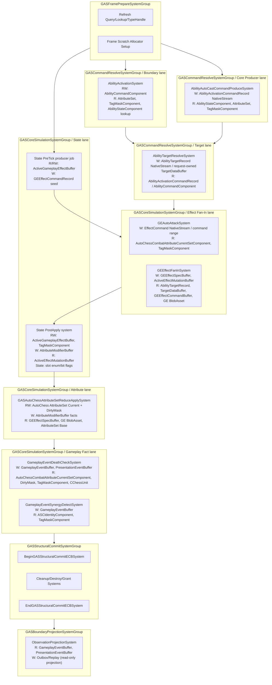

# 10B-07：执行链、交互矩阵、生成物清单与不变量

> Owner：`01-目标态架构共识/10B-AutoChess完整业务案例` | 状态：目标态子 Spec | 拆分来源：`../10B-AutoChess完整业务案例设计Spec.md` | 最近拆分：2026-06-07

本文件只描述 AutoChess 完整业务案例的目标态设计。禁止写入当前代码事实、执行流水、验证数字或下一步任务；现实证据必须回到 `../../00-当前架构事实/`，任务拆分必须回到 `../../02-主线任务树/`。
## 十、System 执行链总览

**各 System 的物理执行域 / Lane 归属与权限：**

| System | Physical Group / Lane | 结构变化 | Enableable Toggle | 写入 Component |
|---|---|---|---|---|
| `GEAutoAttackSystem` | CoreSimulation / Effect Fan-In | 禁止 | 否 | EffectCommand NativeStream / command range |
| `AbilityActivationSystem` | CommandResolve / Boundary Command | 禁止 | 否 | Boundary 低频 request path：AbilityActivationRequestComponent read, AbilityCommandComponent write, AttributeSet read, AbilityStateComponent lookup |
| `AbilityAutoCastCommandProduceSystem` | CommandResolve / Core Producer | 禁止 | 否 | Core 高频 path：AbilityActivationCommandRecord NativeStream |
| `AbilityTargetResolveSystem` | CommandResolve / Target Resolve | 禁止 | 否 | AbilityTargetRecord NativeStream；低量 Boundary path 可写 request-owned TargetDataBuffer |
| `GEEffectFanInSystem` | CoreSimulation / Effect Fan-In | 禁止 | 否 | GEEffectSpecBuffer, ActiveEffectMutationBuffer |
| `GASAutoChessAttributeSetReduceApplySystem` | CoreSimulation / Attribute | 禁止 | 否 | AutoChess AttributeSet Current/Base, AttributeDirtyMask, AttributeModifierBuffer |
| `GASActiveEffectMutationApplySystem` | CoreSimulation / Active Effect Mutation Apply | 禁止 | 否（默认 enum/flags；enableable 仅 profiler 证明后可选） | ActiveGameplayEffectBuffer, TagMaskComponent, AttributeModifierBuffer |
| `GASActiveEffectTickSystem` | CoreSimulation / Active Effect Tick | 禁止 | 否（默认 enum/flags；enableable 仅 profiler 证明后可选） | Gameplay fact `NativeStream`, EffectCommand `NativeStream`, ActiveGameplayEffectBuffer |
| `GameplayEventDeathCheckSystem` | CoreSimulation / Gameplay Fact | 禁止 | 否 | GameplayEventBuffer, PresentationEventBuffer |
| `GameplayEventSynergyDetectSystem` | CoreSimulation / Gameplay Fact | 禁止 | 否 | GameplayEventBuffer |
| Structural cleanup | StructuralCommit | **唯一允许** | 否（默认结构提交，不用 enableable 表达生命周期） | ActiveGameplayEffectBuffer (remove), Entity (destroy) |
| `ObservationProjectionSystem` | BoundaryProjection | 禁止 | 否 | Outbox/Replay buffer |

**World Bootstrap：** 无头 AutoChess 验收的 World 创建必须通过 `ICustomBootstrap`（CASE-17）实现。`ICustomBootstrap.Initialize` + `DefaultWorldInitialization.GetAllSystems` 创建 `FixedStepTime(1.0f / 60f)` 独立 World，不隐式依赖 Editor `World.Time` 或 `VariableStepTime`。各 System 通过 `[UpdateInGroup]` 归属到上述物理执行域 SystemGroup，并在 System 内或文档表中声明 kernel lane；ICustomBootstrap 负责将 System 分发到正确的 World 和 Group。参见 `10-AutoChess无头验收Spec.md` 第 223 行、`CASE-17`、`90-目标态不变量.md` 第 31 条。

---

## 十一、交互矩阵（单位 × GAS 机制）

| 机制 | 霜甲剑士 | 冰霜女巫 | 暗影刺客 | 圣光牧师 | 重装剑士 | 烈焰法师 |
|---|---|---|---|---|---|---|
| **普攻 + Instant damage** | ✓ ATK×1.0 | ✓ ATK×1.0 | ✓ ATK×1.0 | ✓ ATK×1.0 | ✓ ATK×1.0 | ✓ ATK×1.0 |
| **主动技能激活** | ✓ 盾击(3001) | ✓ 冰霜新星(3002) | ✓ 毒刃(3003) | ✓ 圣光治疗(3004) | ✓ 盾击(3001) | — |
| **Duration GE** | — 施加者 | ✓ 减速 3s | ✓ 中毒 4s | — | — 承受者 | — 承受者 |
| **Period GE** | — | — | ✓ 每1s跳伤害 | — | — | — |
| **Stack GE** | — | — | ✓ StackLimit=3 | — | — | — |
| **AoE** | — | ✓ 最多3目标 | — | — | — | — |
| **Heal** | — | — | — | ✓ | — | — |
| **Tag Grant (Stun)** | ✓ 施加 | — | — | — | ✓ 承受 | ✓ 承受 |
| **Tag Grant (Slow)** | — 承受(冰系) | ✓ 施加 | — | — | ✓ 承受 | ✓ 承受 |
| **Tag Grant (Poison)** | — | — | ✓ 施加 | — | ✓ 承受 | ✓ 承受 |
| **ASPD Override** | — | — | — | — | ✓ 眩晕→0 | ✓ 眩晕→0 |
| **Death/Cleanup** | ✓ | ✓ | ✓ | ✓ | ✓ | ✓ |
| **Cue Marker** | ShieldBashVFX | IceNovaVFX | PoisonSlashVFX | HealBeamVFX | VFX 接收 | VFX 接收 |
| **AttributeDelta 产出** | HP,ATK | HP,Mana,ASPD | HP,Mana | HP(Mana) | HP,ASPD | HP,ASPD |
| **GameplayFact 产出** | Damage | Damage,Slow | DOT,Stack | Heal | 承受 | 承受 |

---

## 十二、SourceGenerator 生成物清单

| 生成文件 | 源配置表 | 内容 |
|---|---|---|
| `AutoChessIds.g.cs` | attribute.xlsx, tag.xlsx, ability.xlsx, ge.xlsx, cue.xlsx | `XAttr`, `XTagBit`, `XAbilityId`, `XGEId`, `XCueCode`, `FactCode` 常量 |
| `AutoChessStaticLookups.g.cs` | unit.xlsx, ability.xlsx, ge.xlsx | `UnitLookup`, `AbilityLookup`, `GELookup` — id→BlobAsset 的查找表 |
| `AutoChessBlobBuilders.g.cs` | unit.xlsx, ability.xlsx, ge.xlsx | `UnitConfigBlob`, `AbilityDefBlob`, `GEStaticBlob` 的 BlobBuilder |
| `AutoChessScenarioBuildPlan.g.cs` | scenario.xlsx | 默认战斗的 spawn plan（阵营、位置、种子） |
| `AutoChessValidationExpectations.g.cs` | validation_expectation.xlsx | expected winner, required facts, required cue markers, thresholds |
| `AutoChessConfigDiagnostics.g.cs` | 所有配置表 | Editor/CI 配置完整性检查和引用一致性验证 |

---

## 十三、不变量遵守清单（+ DOTS 规则交叉引用）

本 Spec 的设计遵守 `90-目标态不变量.md` 的全部 37 条不变量，并通过 `UnityDOTS官方文档参考/主题/90-规则编号索引.md` 的 DOTS 规则逐条验证。

### 13.1 不变量映射表

| 不变量 | 本 Spec 遵守方式 | 关联 DOTS 规则 |
|---|---|---|
| 1. 权威只在 ECS 数据 | 所有 gameplay state 在 ASC Entity 的 IComponentData/DynamicBuffer 中 | SYS-01 |
| 2. 外部写入只通过 request entity | `AbilityActivationRequestComponent` + `AbilityCommandComponent` 只作为 Boundary → Core 的低频入口；AI/Core 内部高频触发使用 `AbilityActivationCommandRecord`，单次激活上下文不写回 Ability Entity | — |
| 3. 外部观察只通过 mirror/outbox/replay/debugger/read model | `PresentationEventBuffer`, `GameplayEventBuffer`, Observation outbox | — |
| 5. Runtime state 不反查 managed config | 所有 config 通过 BlobAsset 引用（unmanaged），不查 ScriptableObject | STORE-01 |
| 6. Cue 不决定 gameplay | `PresentationEventBuffer` 只写不读，gameplay 不依赖 cue 状态 | — |
| 7. System 调度显式 | 每个 System 声明 UpdateInGroup，物理执行域与 kernel lane 归属明确 | SYS-02 |
| 16. 高频 reaction 使用 typed facts | 羁绊检测通过 GameplayEventSynergyDetectSystem → GameplayEventBuffer，不走 EventBus | NAT-03 |
| 17-18. Simple instant GE 热路径 + ECB 语义屏障 | Instant GE 走 IJobEntity 直接属性修改；Structural ECB 统一播放 | ECB-01 |
| 21. hot path 禁止直接结构变化 | 结构变化只在 GASStructuralCommitSystemGroup (EndGASStructuralCommitECBSystem) | SC-01, PRF-04 |
| 22. DynamicBuffer 有容量/生命周期/清空策略 | 每个 buffer 有 InternalBufferCapacity 声明，见 7.3 节 | BUF-01, PRF-10 |
| 23. Chunk Component 是性能优化 | NoActiveEffectsChunkComponent 用于 chunk 级跳过，不替代 per-entity 正确性 | PRF-09 |
| 29. 不使用托管 delegate | MMC 通过 MmcEvaluator static switch（Burst 友好），非 delegate | NAT-04 |
| 32. Tag 用 bitmask, Archetype < 10 | TagMaskComponent uint64 bitmask，0 个独立 tag component | PRF-03, EN-01 |
| 33. 每个 Buffer 有 InternalBufferCapacity | ActiveGameplayEffectBuffer(8), GEEffectCommandBuffer(64) 等，见 7.3 节 | BUF-01 |
| 34. Component 明确分类 | 所有 component 标注 Data/Buffer/Enableable/Chunk/Cleanup，见 7.3 节 | — |
| 35. Frame Prepare (allocator / query-lookup budget) | 各 owner `ISystem` 自建 query、刷新 lookup/type handle；fan-in scratch 使用明确 allocator；禁止中央 query/lookup registry | QRY-03, PRF-07, PRF-33 |
| 36. Enableable toggle 只在拥有状态的 kernel | ActiveEffect 默认使用 slot enum/bit flags；`PeriodDueTag` 等 enableable 仅在 profiler 证明 skip 收益时由 `GASCoreSimulationSystemGroup` 维护 | EN-02 / FSM-05 |
| 37. Chunk Component 需 Debugger 一致性验证 | NoActiveEffectsChunkComponent 标记需 GASRuntimeCoreDebugger 验证 | CASE-07 |

### 13.2 DOTS 官方规则适配

本 Spec 必须按 `UnityDOTS官方文档参考/主题/90-规则编号索引.md` 和 `13-DOTS编写规范与性能陷阱.md` 逐条适配，目标处理如下：

| 官方规则 | 风险位置 | 目标处理 |
|---|---|---|
| `SEL-01` / `PRF-01`：临时状态不默认实体化 | 临时 state | 所有 state 在 IComponentData / DynamicBuffer / frame-local record |
| `SC-01` / `PRF-04`：Hot Path 禁止直接结构变化 | State lane, GEEffectFanInSystem, AbilityActivationSystem | 结构变化集中到 `EndGASStructuralCommitECBSystem`；frame command/fact 禁止通过 `ECB.AppendToBuffer` 充当事件总线，必须使用 `NativeStream` / owner-local range 和 deterministic merge |
| `PRF-03` / `EN-01`：高频 tag/status 不使用 tag component add/remove | Tag 表达 | `TagMaskComponent` uint64 bitmask，不创建 tag component |
| `ECB-03` / `SC-01`：Sync Point 集中化 | TickActiveSlotsJob / delta 写入 | 目标态收敛为 `NativeStream` / owner-local range，只在 `GASStructuralCommitSystemGroup` 播放结构变化 ECB |
| `QRY-01` / `JOB-01`：Hot Path 优先 job 化 | GEEffectFanInSystem / State lane | 使用 IJobEntity / IJobChunk / IJobParallelFor 或等价 job 化路径 |
| `QRY-04` / `PRF-19`：高频 Random Access Lookup 改 owner-local / target-grouped | State lane | 静态 lookup 作为 job 注入参数，跨 entity 写入走 target-grouped / owner-local 路径 |
| `SYS-03` / `PRF-07`：避免不必要 System 拆分 | Auto attack / regen / lightweight state | 可在同一 System 内调度多个 job，不按小职责拆成多个 System |
| `PRF-08` / `CASE-35`：禁止 EntityIndexInQuery 在 Hot Path | TickActiveSlotsJob | 使用 chunk/entity local index 或显式 deterministic key |
| `QRY-02` / `PRF-33`：Query contract 与 lookup owner 明确 | State lane buffer 访问 | 缓存必要 buffer / snapshot，避免循环中重复触发同步 query |
| `BUF-01` / `PRF-10`：监控 DynamicBuffer 溢出 | 全局/owner-local buffer | 所有 buffer 有 InternalBufferCapacity + spill 策略说明 |
| `CONTENT-01` / `PRF-11`：控制 Prefab 数量 | CChessUnit | 精链路 archetype 数量受控，不用 prefab 承载静态 definition |
| `PRF-12`：SharedComponent 只用于低频分组 | 共享分组 | 默认不使用 SharedComponent；如使用必须给出 chunk 分裂和 query 成本证据 |

### 13.3 目标限制与扩展路径

| 限制 | 目标基础处理 | 扩展路径 |
|---|---|---|
| SynergyCountAndFactJob 羁绊统计与 fact 产出 | `IJobChunk` chunk-local accumulator + `NativeStream` fact 输出 | x50+: deterministic merge 继续按 chunk / owner sort key 稳定归并，禁止主线程 `Complete()` 后读回 |
| ApplyActiveEffectMutationsJob 遍历所有 target entity 匹配 mutation | IJobEntity per entity 内循环 mutation NativeArray | 高 mutation 数: 先按 TargetAsc 对 mutation 排序，或使用 NativeMultiHashMap |
| ApplyInstantSpecsJob 遍历所有 target entity 匹配 spec | 同上模式 | 同上优化方向 |
| TickActiveSlotsJob 的 MMC source 属性读取 | 精链路可直接计算 magnitude | 在 Magnitude Resolve lane 读取 source/target AttributeSet snapshot；避免 Attribute Apply lane 使用 `ComponentLookup` 随机写 |
| 结构变化 ECB 的职责范围 | 只消费 structural intent，并在 `GASStructuralCommitSystemGroup` 内集中 create / destroy / add / remove / set 结构性数据 | 不扩展成 Gameplay Event Bus；frame command / fact / mutation 继续使用 `NativeStream`、owner-local range 或 target-grouped merge |

---

## 十四、历史方案定位

1. 方案12 的塔防业务案例（具名单位、Luban Excel 表、BurstCompile System、MMC）为本 Spec 提供了"完整案例"的格式模板，见 `../历史方案参考/方案12.md:81-330`。
2. 方案14 的 RPG 自走棋完整案例（场景设定、棋子设计、Luban 配置、System 执行链、逐步走查）是 "AutoChess 预演" 的直接来源，见 `../历史方案参考/方案14.md:1062-1560`。
3. 方案14 的 GE BlobAsset Builder 模式（GEBlobBuilder.Build_Xxx）为本 Spec 的 GEStaticBlob 提供了代码生成模板，见 `../历史方案参考/方案14.md:1272-1362`。
4. 方案15 的四层架构和业务管理边界为本 Spec 的 System Group 归属提供了工程约束，见 `../历史方案参考/方案15.md:35-92`。
5. 本 Spec 的 Component 命名和 Entity 布局遵循 `13-EntityComponent物理布局Spec.md` 的所有约束。
6. 本 Spec 的 SystemGroup 归属遵循 `03-RuntimeCore管线Spec.md` 的精确层级。
