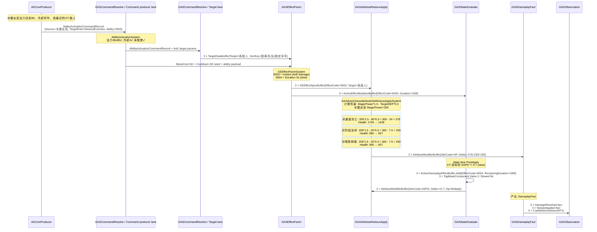
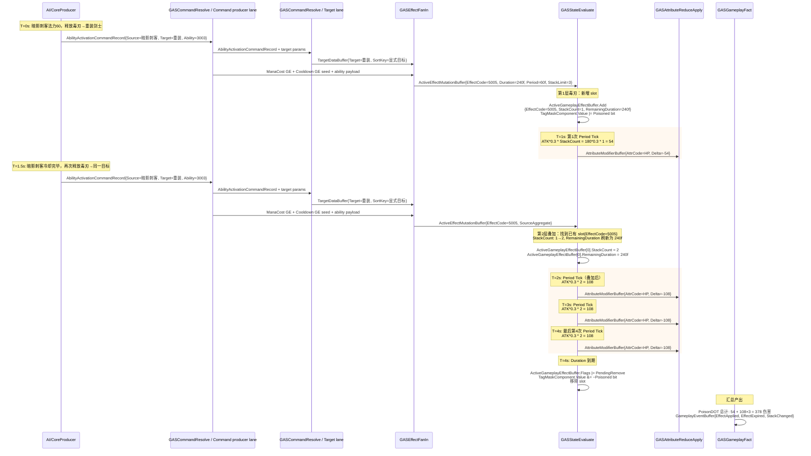
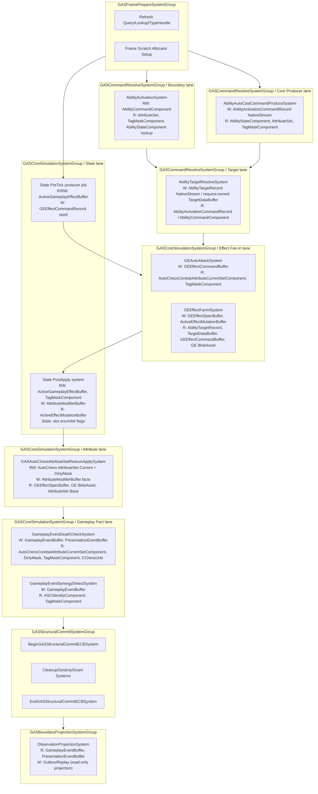

# AutoChess 完整业务案例设计 Spec

## 目的

本 Spec 是 EX-GAS 2.0 的**完整 GAS 设计预演**，以 AutoChess Demo 为载体，用具体棋子、属性、技能、GE、羁绊和 System 实现，验证四层架构、Runtime Core 管线、Entity/Component 物理布局和 Luban/SourceGenerator 配置链能否承载真实 GAS 业务。

本 Spec 的格式对齐历史方案 12/13/14/15 的"完整案例详细设计"风格：包含具名单位、真实 Excel 配置行、完整 C# System 代码、Mermaid 时序图和逐步业务走查。它与 `10-AutoChess无头验收Spec.md` 的关系是：10 定义验收基础设施和门槛，10B 定义验收用的具体业务内容；与 `11-AutoChessDemo-Luban配置方案Spec.md` 的关系是：11 定义配置表结构和生成链路，10B 提供填入这些表的真实数据行。

当前实现状态：`Assets/AutoChessDemo` 已先按破坏性重构落地 `AutoBattle` 2v2 最小 Runtime Core 验证链，旧 `HeadlessAutoChess*` 代码不再作为过渡兼容对象。10B 仍是完整业务案例目标态；它不能被当前 2v2 最小切片替代，也不能要求当前切片保留旧 OOP config registry / scenario 巨类。

## 范围

1. 棋子设计：4 种棋子类型，具名、具属性、具技能
2. 属性系统：6 种属性的 ECS Component 布局、访问器和重算逻辑
3. 技能设计：普攻 + 3 种主动技能 + 1 种被动技能，覆盖 Instant/Duration/Period/Stack/AoE
4. GE 设计：6 种 GE，覆盖 Damage/Heal/Stun/Slow/Poison/AoE
5. 羁绊系统：冰系羁绊 + 牧师职业羁绊，typed fact reaction 驱动
6. 核心 System 实现：C# ISystem + BurstCompile，落到目标态物理 SystemGroup 与 kernel lane
7. 完整业务流程走查：3 条具名走查（盾击眩晕、冰霜新星 AoE、毒刃叠加中毒爆发）
8. 交互矩阵：单位 × 机制覆盖矩阵

## 非目标

1. 不定义棋盘 AI、移动、寻路、选敌逻辑（属于 Demo 业务层，非 GAS 概念验证）
2. 不定义真实 UI/VFX/SFX 资源绑定（走 Presentation outbox marker）
3. 不重复 03-RuntimeCore管线Spec 的 SystemGroup 定义和 13-EntityComponent物理布局Spec 的布局约束
4. 不替代 08-Luban-SourceGenerator配置生成链路Spec 的通用生成规范

---

## 一、场景设定

```
棋盘：4×2 格（己方）vs 4×2 格（敌方），共 8 个单位同时战斗
时间单位：Frame tick（实时战斗，非回合制）
职业：剑士(Swordsman)、法师(Mage)、刺客(Assassin)、牧师(Priest)
种族/阵营：冰系(Frost)、暗影(Shadow)、圣光(Light)
羁绊激活阈值：冰系 ≥ 3 个单位 → 所有攻击附加减速；牧师 ≥ 2 个单位 → 治疗量 +20%
```

**默认验收战斗配置（x1 精链路）：**

| 方阵 | 棋子 | 职业 | 种族 | 星级 | 位置 |
|---|---|---|---|---|---|
| 己方 | 霜甲剑士 | 剑士 | 冰系 | 2星 | 前排左 |
| 己方 | 冰霜女巫 | 法师 | 冰系 | 3星 | 后排左 |
| 己方 | 暗影刺客 | 刺客 | 暗影 | 2星 | 前排右 |
| 己方 | 圣光牧师 | 牧师 | 圣光 | 2星 | 后排右 |
| 敌方 | 重装剑士 | 剑士 | — | 2星 | 前排左 |
| 敌方 | 烈焰法师 | 法师 | — | 3星 | 后排左 |
| 敌方 | 暗影刺客 | 刺客 | 暗影 | 2星 | 前排右 |
| 敌方 | 圣光牧师 | 牧师 | 圣光 | 2星 | 后排右 |

**羁绊触发情况（己方）：**
- 冰系：霜甲剑士 + 冰霜女巫 = 2 个单位，**未满 3，不触发冰系羁绊**（设计意图：x1 不激活羁绊以简化初始验收，羁绊由 x50 profile 单独验证）

**本 Spec 三条完整业务走查：**
> 走查 A — 剑士"盾击"眩晕敌方前排：Ability 激活 → GE 施加 → Duration/Stun tag → 到期移除
> 走查 B — 法师"冰霜新星"打击 3 个敌人：AoE 目标选取 → Instant damage + Duration slow → AttributeDelta
> 走查 C — 刺客"毒刃"叠加 2 层触发中毒爆发：Stack GE → period tick → stack overflow → 额外爆发伤害

---

## 二、棋子设计

### 2.1 棋子 Luban 配置（`autochess.unit.xlsx`）

| ID | Name | Class | Race | Star | HP | ATK | DEF | ASPD | MANA | ManaRegen | AbilityId | SynergyTags |
|----|------|-------|------|------|-----|-----|-----|------|------|-----------|-----------|-------------|
| 2001 | 霜甲剑士 | Swordsman | Frost | 2 | 1500 | 120 | 80 | 100 | 40 | 5 | 3001 | Frost |
| 2002 | 冰霜女巫 | Mage | Frost | 3 | 900 | 70 | 30 | 100 | 80 | 12 | 3002 | Frost |
| 2003 | 暗影刺客 | Assassin | Shadow | 2 | 900 | 180 | 25 | 120 | 60 | 8 | 3003 | Shadow |
| 2004 | 圣光牧师 | Priest | Light | 2 | 700 | 50 | 20 | 100 | 100 | 10 | 3004 | Light |
| 2005 | 重装剑士 | Swordsman | — | 2 | 1800 | 100 | 100 | 90 | 40 | 5 | 3001 | — |
| 2006 | 烈焰法师 | Mage | — | 3 | 850 | 90 | 25 | 100 | 80 | 12 | 0 | — |

### 2.2 棋子 BlobAsset 结构（Generated by SourceGenerator）

```csharp
// ============================================================
// [Layer 4: Definition & Generation]
// 文件: Assets/AutoChessDemo/Config/GeneratedRuntime/AutoChessBlobBuilders.g.cs
// 由 Luban + SourceGenerator 从 autochess.unit.xlsx 自动生成
// ============================================================

public struct UnitConfigBlob
{
    public int UnitId;
    public int ClassId;          // Swordsman=1, Mage=2, Assassin=3, Priest=4
    public int RaceId;           // Frost=1, Shadow=2, Light=3
    public int Star;
    public int AbilityId;
    public FixedString32Bytes Name;

    // 基础属性（星级缩放前的白值）
    public float BaseHP;
    public float BaseATK;
    public float BaseDEF;
    public float BaseASPD;
    public float BaseMANA;
    public float BaseManaRegen;

    // 羁绊 tag bit（用于 SynergyDetect 的 TagMaskComponent 查询）
    public uint SynergyBits;     // bit 0=Frost, bit 1=Shadow, bit 2=Light
}

// 单位 Spawn 时从 BlobAsset 读取并写入 ASC Entity 的 Component
public struct CUnitConfigRef : IComponentData
{
    public BlobAssetReference<UnitConfigBlob> Config;
}
```

### 2.3 单位运行时 Component

```csharp
// ============================================================
// [Layer 3: GAS Runtime Core — ASC Entity 挂载]
// 文件: Assets/AutoChessDemo/Runtime/Units/CChessUnit.cs
// ============================================================

// 棋盘单位状态（纯 unmanaged）
public struct CChessUnit : IComponentData
{
    public int CampId;           // 0=己方, 1=敌方
    public byte BoardCol;        // 棋盘列 0-3
    public byte BoardRow;        // 棋盘行 0-1
    public bool IsAlive;
}

// 单位战斗 AI 状态（每 tick 更新选敌和普攻节奏）
public struct CChessCombat : IComponentData
{
    public Entity CurrentTarget;
    public float AttackCooldownRemaining;  // 剩余冷却秒数，≤0 时可普攻
    public float BaseAttackInterval;        // = 1.0 / (ASPD / 100.0)，ASPD=100 → 1秒一次
}
```

---

## 三、属性系统设计

### 3.1 属性 Luban 配置（`autochess.attribute.xlsx`）

| AttrId | Name | AttrSet | DefaultValue | Min | Max | ClampMin | ClampMax |
|--------|------|---------|-------------|-----|-----|----------|----------|
| 1 | HP | Combat | 0 | 0 | 99999 | true | true |
| 2 | MaxHP | Combat | 0 | 1 | 99999 | true | true |
| 3 | ATK | Combat | 0 | 0 | 99999 | true | false |
| 4 | DEF | Combat | 0 | 0 | 99999 | true | false |
| 5 | ASPD | Combat | 100 | 10 | 500 | true | true |
| 6 | MANA | Resource | 0 | 0 | 200 | true | true |
| 7 | MaxMANA | Resource | 100 | 1 | 200 | true | true |
| 8 | ManaRegen | Resource | 10 | 0 | 50 | true | false |

### 3.2 属性 ECS Component 布局

按照 `13-EntityComponent物理布局Spec` 的更新结论，AutoChess 不再默认“每种属性一个 component type”。这里的真实热路径是攻击/技能/治疗同时读取 HP、ATK、DEF、ASPD、Mana 等字段，因此按 AttributeSet family 生成固定布局：Current 高频写，Base/Max/Config 低频读，DirtyMask 表达本帧具体变化的 AttributeCode。

```csharp
// ============================================================
// [Layer 3: GAS Runtime Core — ASC Entity 挂载]
// AttributeSet family: 按热路径和变更频率分组，而不是按 OOP 属性类拆 type
// ============================================================

public struct AutoChessCombatAttributeCurrentSetComponent : IComponentData
{
    public float Health;
    public float Attack;
    public float Defense;
    public float AttackSpeed;
}

public struct AutoChessCombatAttributeBaseSetComponent : IComponentData
{
    public float MaxHealth;
    public float BaseAttack;
    public float BaseDefense;
    public float BaseAttackSpeed;
}

public struct AutoChessResourceAttributeCurrentSetComponent : IComponentData
{
    public float Mana;
}

public struct AutoChessResourceAttributeBaseSetComponent : IComponentData
{
    public float MaxMana;
    public float ManaRegen;
}

public struct AutoChessAttributeDirtyMaskComponent : IComponentData
{
    public ulong CombatWord;
    public ulong ResourceWord;
}
```

### 3.3 属性访问器（SourceGenerator 生成）

```csharp
// ============================================================
// [Layer 4: Definition & Generation]
// 文件: Assets/AutoChessDemo/Config/GeneratedRuntime/AutoChessIds.g.cs
// 替代运行时 Dictionary 查找，Burst 友好
// ============================================================

public static class XAttr
{
    public const int HP        = 1;
    public const int MaxHP     = 2;
    public const int ATK       = 3;
    public const int DEF       = 4;
    public const int ASPD      = 5;
    public const int MANA      = 6;
    public const int MaxMANA   = 7;
    public const int ManaRegen = 8;
}

// SourceGenerator 生成的属性访问器（static switch，Burst 友好）
public static class AttrAccessor
{
    [BurstCompile]
    public static float GetCurrentValue(
        int attrCode,
        in AutoChessCombatAttributeCurrentSetComponent combat,
        in AutoChessCombatAttributeBaseSetComponent combatBase,
        in AutoChessResourceAttributeCurrentSetComponent resource,
        in AutoChessResourceAttributeBaseSetComponent resourceBase)
    {
        return attrCode switch
        {
            XAttr.HP        => combat.Health,
            XAttr.MaxHP     => combatBase.MaxHealth,
            XAttr.ATK       => combat.Attack,
            XAttr.DEF       => combat.Defense,
            XAttr.ASPD      => combat.AttackSpeed,
            XAttr.MANA      => resource.Mana,
            XAttr.MaxMANA   => resourceBase.MaxMana,
            XAttr.ManaRegen => resourceBase.ManaRegen,
            _ => 0f
        };
    }

    [BurstCompile]
    public static void ApplyResolvedModifier(
        int attrCode,
        float delta,
        ref AutoChessCombatAttributeCurrentSetComponent combat,
        in AutoChessCombatAttributeBaseSetComponent combatBase,
        ref AutoChessResourceAttributeCurrentSetComponent resource,
        in AutoChessResourceAttributeBaseSetComponent resourceBase,
        ref AutoChessAttributeDirtyMaskComponent dirty)
    {
        switch (attrCode)
        {
            case XAttr.HP:
                combat.Health = math.clamp(combat.Health + delta, 0f, combatBase.MaxHealth);
                dirty.CombatWord |= 1ul << 0;
                break;
            case XAttr.ATK:
                combat.Attack = math.max(0f, combat.Attack + delta);
                dirty.CombatWord |= 1ul << 2;
                break;
            case XAttr.DEF:
                combat.Defense = math.max(0f, combat.Defense + delta);
                dirty.CombatWord |= 1ul << 3;
                break;
            case XAttr.ASPD:
                combat.AttackSpeed = math.clamp(combat.AttackSpeed + delta, 10f, 500f);
                dirty.CombatWord |= 1ul << 4;
                break;
            case XAttr.MANA:
                resource.Mana = math.clamp(resource.Mana + delta, 0f, resourceBase.MaxMana);
                dirty.ResourceWord |= 1ul << 0;
                break;
        }
    }
}
```

---

## 四、Tag 系统设计

### 4.1 Tag Luban 配置（`autochess.tag.xlsx`）

按照不变量 32：Tag 状态通过 bitmask（`TagMaskComponent`）表达，不使用独立 tag component。

| TagId | Name | Category | BitIndex | Description |
|-------|------|----------|----------|-------------|
| 1 | State.Stunned | State | 0 | 眩晕，不可行动 |
| 2 | State.Slowed | State | 1 | 减速，ASPD -30% |
| 3 | State.Frozen | State | 2 | 冰冻，不可行动+ASPD=0 |
| 4 | State.Poisoned | State | 3 | 中毒，受到 period 伤害 |
| 5 | Buff.FrostArmor | Buff | 4 | 冰系羁绊护甲 |
| 6 | Buff.HealBonus | Buff | 5 | 牧师羁绊治疗加成 |
| 7 | Ability.ShieldBash | Ability | 6 | 盾击能力标记 |
| 8 | Ability.FrostNova | Ability | 7 | 冰霜新星能力标记 |
| 9 | Ability.PoisonBlade | Ability | 8 | 毒刃能力标记 |
| 10 | Ability.HolyLight | Ability | 9 | 圣光治疗能力标记 |
| 11 | Synergy.Frost | Synergy | 10 | 冰系羁绊单位标记 |
| 12 | Synergy.Priest | Synergy | 11 | 牧师羁绊单位标记 |
| 13 | State.Dead | State | 12 | 死亡标记 |

### 4.2 Tag 生成的 Bit 常量

```csharp
// ============================================================
// [Layer 4: Definition & Generation]
// 文件: Assets/AutoChessDemo/Config/GeneratedRuntime/AutoChessIds.g.cs
// ============================================================

public static class XTagBit
{
    public const ulong Stunned      = 1UL << 0;
    public const ulong Slowed       = 1UL << 1;
    public const ulong Frozen       = 1UL << 2;
    public const ulong Poisoned     = 1UL << 3;
    public const ulong FrostArmor   = 1UL << 4;
    public const ulong HealBonus    = 1UL << 5;
    public const ulong ShieldBash   = 1UL << 6;
    public const ulong FrostNova    = 1UL << 7;
    public const ulong PoisonBlade  = 1UL << 8;
    public const ulong HolyLight    = 1UL << 9;
    public const ulong SynFrost     = 1UL << 10;
    public const ulong SynPriest    = 1UL << 11;
    public const ulong Dead         = 1UL << 12;
}

// Tag 需求检查工具（纯 Burst）
[BurstCompile]
public static class TagCheck
{
    public static bool HasTag(ulong mask, ulong tagBit) => (mask & tagBit) != 0;
    public static bool HasAnyTag(ulong mask, ulong tagBits) => (mask & tagBits) != 0;
    public static bool HasAllTags(ulong mask, ulong tagBits) => (mask & tagBits) == tagBits;
    public static bool IsStunnedOrFrozen(ulong mask) => (mask & (XTagBit.Stunned | XTagBit.Frozen)) != 0;
    public static bool IsDead(ulong mask) => (mask & XTagBit.Dead) != 0;
}
```

---

## 五、技能设计

### 5.1 技能 Luban 配置（`autochess.ability.xlsx`）

| AbilityId | Name | Type | ManaCost | CooldownFrames | TargetRule | MaxTargets | Range | EffectId_Primary | EffectId_Secondary | BlockTags |
|-----------|------|------|----------|----------------|------------|------------|-------|------------------|--------------------|------------|
| 3001 | 盾击 | Active | 40 | 180 (3s@60fps) | NearestEnemy | 1 | 1.5 | 5001 | 5002 | Stunned,Frozen |
| 3002 | 冰霜新星 | Active | 80 | 300 (5s@60fps) | NearestEnemies | 3 | 3.0 | 5003 | 5004 | Stunned,Frozen |
| 3003 | 毒刃 | Active | 60 | 120 (2s@60fps) | NearestEnemy | 1 | 1.5 | 5005 | — | Stunned,Frozen |
| 3004 | 圣光治疗 | Active | 40 | 240 (4s@60fps) | LowestHPAlly | 1 | 4.0 | 5006 | — | Stunned,Frozen |
| 0 | 普攻 | PassiveAuto | 0 | — | NearestEnemy | 1 | 按职业 | 4001 | — | Stunned,Frozen |

**普攻是 default ability**：每个棋子都有，不占 AbilityId 槽位。普攻通过 `AttackAbilityDataComponent` component 配置其伤害 GE 和攻击范围。

### 5.2 技能 BlobAsset 结构

```csharp
// ============================================================
// [Layer 4: Definition & Generation]
// Ability 静态定义 BlobAsset
// ============================================================

public struct AbilityDefBlob
{
    public int AbilityId;
    public FixedString32Bytes Name;
    public byte AbilityType;     // 0=PassiveAuto, 1=Active
    public float ManaCost;
    public float CooldownFrames;
    public byte TargetRule;      // 0=NearestEnemy, 1=LowestHPAlly, 2=NearestEnemies
    public byte MaxTargets;
    public float Range;
    public int EffectIdPrimary;  // 主 GE ID
    public int EffectIdSecondary;// 副 GE ID（如盾击：主=伤害GE，副=眩晕GE）
    public ulong BlockTagBits;   // 自身有此 tag 时禁止释放
}

public enum AbilityRuntimeState : byte
{
    Granted = 0,
    Ready = 1,
    Active = 2,
    Cooldown = 3,
    Ending = 4
}

[System.Flags]
public enum AbilityRuntimeFlags : ushort
{
    None = 0,
    Executable = 1 << 0,
    Activating = 1 << 1,
    Blocked = 1 << 2
}

// Ability Entity 上挂载的跨帧 granted ability 状态
public struct AbilityStateComponent : IComponentData
{
    public Entity OwnerAsc;
    public int AbilityId;
    public int PrimaryGameplayEffectCode;
    public int SecondaryGameplayEffectCode;
    public short Level;
    public AbilityRuntimeState State;
    public AbilityRuntimeFlags Flags;
    public int CooldownEndFrame;
}
```

---

## 六、GE 设计

### 6.1 GE Luban 配置（`autochess.gameplay_effect.xlsx`）

| GEId | Name | Type | DurationFrames | PeriodFrames | StackLimit | StackPolicy | ModifierAttr | ModifierOp | ModifierMmc | GrantedTags | RemoveTags | ApplicationTagReq | ImmunityTags |
|------|------|------|----------------|--------------|------------|-------------|-------------|------------|-------------|-------------|------------|-------------------|--------------|
| 4001 | 普攻伤害 | Instant | 0 | 0 | — | — | HP | Minus | ATK*1.0 | — | — | — | — |
| 4002 | 冰系减速 | Duration | 180 (3s) | 0 | — | — | ASPD | Multiply | 0.7 | Slowed | — | — | — |
| 5001 | 盾击伤害 | Instant | 0 | 0 | — | — | HP | Minus | ATK*0.8 | — | — | — | — |
| 5002 | 眩晕 | Duration | 120 (2s) | 0 | — | — | ASPD | Override | 0.0 | Stunned | — | — | — |
| 5003 | 冰霜新星伤害 | Instant | 0 | 0 | — | — | HP | Minus | MagicPower*1.5-DEF*0.3 | — | — | — | — |
| 5004 | 冰霜减速 | Duration | 180 (3s) | 0 | — | — | ASPD | Multiply | 0.7 | Slowed | — | — | Frozen |
| 5005 | 毒刃 | Duration | 240 (4s) | 60 (1s) | 3 | SourceAggregate | HP | Minus | ATK*0.3 | Poisoned | — | — | — |
| 5006 | 圣光治疗 | Instant | 0 | 0 | — | — | HP | Add | MagicPower*0.8 | — | — | — | — |

**MMC 说明：**
- `ATK*1.0`：取 Source ASC 的 ATK CurrentValue × 1.0
- `MagicPower*1.5-DEF*0.3`：取 Source MagicPower × 1.5 − Target DEF × 0.3
- `ATK*0.8`：取 Source ATK × 0.8
- `ATK*0.3`：取 Source ATK × 0.3
- `MagicPower*0.8`：取 Source MagicPower × 0.8
- `0.7`：固定倍率（Multiply 操作，ASPD × 0.7）
- `0.0`：固定值（Override 操作，ASPD = 0）

### 6.2 GE BlobAsset 构建（SourceGenerator 生成）

```csharp
// ============================================================
// [Layer 4: Definition & Generation]
// 文件: Assets/AutoChessDemo/Config/GeneratedRuntime/AutoChessBlobBuilders.g.cs
// 由 Luban 读取 GE 配置 → SourceGenerator 生成 BlobAsset 构建代码
// ============================================================

public enum GEType : byte { Instant = 0, Duration = 1 }
public enum GEOperation : byte { Add = 0, Minus = 1, Multiply = 2, Override = 3 }
public enum GEStackPolicy : byte { None = 0, SourceAggregate = 1, TargetAggregate = 2 }

public struct GEStaticBlob
{
    public int GeId;
    public GEType GeType;
    public float DurationFrames;       // 0 = Instant
    public float PeriodFrames;         // 0 = 无 Period
    public byte StackLimit;            // 0 = 不可叠加
    public GEStackPolicy StackPolicy;

    public BlobArray<GEModifierBlob> Modifiers;
    public BlobArray<ulong> GrantedTags;   // GE 激活时授予的 tag bits
    public BlobArray<ulong> RemoveTags;    // GE 激活时移除的 tag bits
    public ulong ApplicationTagReqBits;    // 目标必须有这些 tag 才能施加
    public ulong ImmunityTagBits;          // 目标有这些 tag 则免疫
    public FixedString32Bytes Name;
}

public struct GEModifierBlob
{
    public int AttrCode;         // XAttr.HP / XAttr.ATK / ...
    public GEOperation Operation;
    public byte MmcTypeId;       // generated static evaluator code
    public float BaseMagnitude;  // 固定值（如 0.7, 0.0）
}

// ============================================================
// GE_5003: 冰霜新星伤害（Instant，MMC = MagicPower*1.5 - DEF*0.3）
// ============================================================
public static class GEBlobBuilder
{
    public static BlobAssetReference<GEStaticBlob> Build_FrostNovaDamage()
    {
        var builder = new BlobBuilder(Allocator.Temp);
        ref var root = ref builder.ConstructRoot<GEStaticBlob>();

        root.GeId = 5003;
        root.GeType = GEType.Instant;
        root.DurationFrames = 0;
        root.PeriodFrames = 0;
        root.StackLimit = 0;
        root.StackPolicy = GEStackPolicy.None;
        root.ApplicationTagReqBits = 0;
        root.ImmunityTagBits = 0;
        root.Name = "冰霜新星伤害";

        var modifiers = builder.Allocate(ref root.Modifiers, 1);
        modifiers[0] = new GEModifierBlob
        {
            AttrCode = XAttr.HP,
            Operation = GEOperation.Minus,
            MmcTypeId = MmcTypeId.MagicPowerMulDefReduc, // static evaluator code
            BaseMagnitude = 0f,
        };

        builder.Allocate(ref root.GrantedTags, 0);
        builder.Allocate(ref root.RemoveTags, 0);

        var result = builder.CreateBlobAssetReference<GEStaticBlob>(Allocator.Persistent);
        builder.Dispose();
        return result;
    }

    // ============================================================
    // GE_5005: 毒刃（Duration 4s, Period 1s, StackLimit=3, SourceAggregate）
    // ============================================================
    public static BlobAssetReference<GEStaticBlob> Build_PoisonBlade()
    {
        var builder = new BlobBuilder(Allocator.Temp);
        ref var root = ref builder.ConstructRoot<GEStaticBlob>();

        root.GeId = 5005;
        root.GeType = GEType.Duration;
        root.DurationFrames = 240f;   // 4s @ 60fps
        root.PeriodFrames = 60f;      // 1s @ 60fps
        root.StackLimit = 3;
        root.StackPolicy = GEStackPolicy.SourceAggregate;
        root.ApplicationTagReqBits = 0;
        root.ImmunityTagBits = 0;
        root.Name = "毒刃";

        var modifiers = builder.Allocate(ref root.Modifiers, 1);
        modifiers[0] = new GEModifierBlob
        {
            AttrCode = XAttr.HP,
            Operation = GEOperation.Minus,
            MmcTypeId = MmcTypeId.AtkScale03, // ATK * 0.3
            BaseMagnitude = 0f,
        };

        var grantedTags = builder.Allocate(ref root.GrantedTags, 1);
        grantedTags[0] = XTagBit.Poisoned;

        builder.Allocate(ref root.RemoveTags, 0);

        var result = builder.CreateBlobAssetReference<GEStaticBlob>(Allocator.Persistent);
        builder.Dispose();
        return result;
    }

    // ============================================================
    // GE_5002: 眩晕（Duration 2s，Override ASPD=0，授予 Stunned tag）
    // ============================================================
    public static BlobAssetReference<GEStaticBlob> Build_Stun()
    {
        var builder = new BlobBuilder(Allocator.Temp);
        ref var root = ref builder.ConstructRoot<GEStaticBlob>();

        root.GeId = 5002;
        root.GeType = GEType.Duration;
        root.DurationFrames = 120f;   // 2s @ 60fps
        root.PeriodFrames = 0;
        root.StackLimit = 0;
        root.StackPolicy = GEStackPolicy.None;
        root.ApplicationTagReqBits = 0;
        root.ImmunityTagBits = XTagBit.Frozen; // 冰冻免疫眩晕
        root.Name = "眩晕";

        var modifiers = builder.Allocate(ref root.Modifiers, 1);
        modifiers[0] = new GEModifierBlob
        {
            AttrCode = XAttr.ASPD,
            Operation = GEOperation.Override,
            MmcTypeId = MmcTypeId.Flat,         // 固定值
            BaseMagnitude = 0f,                  // ASPD → 0
        };

        var grantedTags = builder.Allocate(ref root.GrantedTags, 1);
        grantedTags[0] = XTagBit.Stunned;

        builder.Allocate(ref root.RemoveTags, 0);

        var result = builder.CreateBlobAssetReference<GEStaticBlob>(Allocator.Persistent);
        builder.Dispose();
        return result;
    }

    // ============================================================
    // GE_5006: 圣光治疗（Instant，HP += MagicPower*0.8）
    // ============================================================
    public static BlobAssetReference<GEStaticBlob> Build_HolyLightHeal()
    {
        var builder = new BlobBuilder(Allocator.Temp);
        ref var root = ref builder.ConstructRoot<GEStaticBlob>();

        root.GeId = 5006;
        root.GeType = GEType.Instant;
        root.DurationFrames = 0;
        root.PeriodFrames = 0;
        root.StackLimit = 0;
        root.StackPolicy = GEStackPolicy.None;
        root.ApplicationTagReqBits = 0;
        root.ImmunityTagBits = 0;
        root.Name = "圣光治疗";

        var modifiers = builder.Allocate(ref root.Modifiers, 1);
        modifiers[0] = new GEModifierBlob
        {
            AttrCode = XAttr.HP,
            Operation = GEOperation.Add,
            MmcTypeId = MmcTypeId.MagicPowerScale08,
            BaseMagnitude = 0f,
        };

        builder.Allocate(ref root.GrantedTags, 0);
        builder.Allocate(ref root.RemoveTags, 0);

        var result = builder.CreateBlobAssetReference<GEStaticBlob>(Allocator.Persistent);
        builder.Dispose();
        return result;
    }
}
```

### 6.3 MMC 静态 Evaluator

```csharp
// ============================================================
// [Layer 3: GAS Runtime Core]
// MMC 默认使用 generated static switch；FunctionPointer 只允许同类型大批量 batch
// 不变量 29: 不使用托管 delegate 或可变静态注册表
// ============================================================

public static class MmcTypeId
{
    public const byte Flat                = 0;
    public const byte AtkScale10          = 1;
    public const byte AtkScale08          = 2;
    public const byte AtkScale03          = 3;
    public const byte MagicPowerScale08   = 4;
    public const byte MagicPowerMulDefReduc = 5; // MagicPower*1.5 - TargetDEF*0.3
}

[BurstCompile]
public static class MmcEvaluator
{
    // GE 施加时调用：计算 modifier 的实际 magnitude
    // source/target AttributeSet snapshot 在 Magnitude Resolve lane 只读采集；
    // Attribute Apply lane 不再通过 ComponentLookup 随机写其他 ASC。
    [BurstCompile]
    public static float Evaluate(
        byte mmcTypeId,
        float baseMagnitude,
        in AutoChessCombatAttributeCurrentSetComponent sourceCombat,
        in AutoChessResourceAttributeCurrentSetComponent sourceResource,
        in AutoChessCombatAttributeCurrentSetComponent targetCombat,
        in AutoChessResourceAttributeCurrentSetComponent targetResource)
    {
        return mmcTypeId switch
        {
            MmcTypeId.Flat                => baseMagnitude,
            MmcTypeId.AtkScale10          => sourceCombat.Attack * 1.0f,
            MmcTypeId.AtkScale08          => sourceCombat.Attack * 0.8f,
            MmcTypeId.AtkScale03          => sourceCombat.Attack * 0.3f,
            MmcTypeId.MagicPowerScale08   => sourceCombat.Attack * 0.8f,  // demo 暂用 Attack 代表法强输入
            MmcTypeId.MagicPowerMulDefReduc => sourceCombat.Attack * 1.5f - targetCombat.Defense * 0.3f,
            _ => baseMagnitude,
        };
    }
}
```

---

## 七、羁绊系统设计

### 7.1 羁绊 Luban 配置（`autochess.synergy.xlsx`）

| SynergyId | Name | Race/Class | Threshold | EffectGE | Description |
|-----------|------|------------|-----------|----------|-------------|
| 1 | 冰系羁绊 | Race=Frost | 3 | 4002 | 3+ 冰系单位在场时，所有攻击附加 ASPD×0.7 减速 |
| 2 | 牧师羁绊 | Class=Priest | 2 | — | 2+ 牧师在场时，所有治疗量 ×1.2 |

### 7.2 羁绊 System 设计

羁绊检测通过 typed fact reaction 驱动，不通过全局 EventBus 扫描。每帧在 `GASCoreSimulationSystemGroup` 中检测羁绊条件变化，产出 typed fact；目标态 fact reaction 默认写 next-frame command seed，避免同帧无界连锁。

```csharp
// ============================================================
// [Layer 3: GAS Runtime Core — GASCoreSimulationSystemGroup]
// 羁绊检测 System：统计场上各种族/职业数量
// 当阈值跨越时产出 SynergyActivated / SynergyDeactivated fact
//
// CASE-02 (IJobEntity) 用于并行统计 — 拒绝 CASE-01 (SystemAPI.Query)
// 原因: 羁绊检测每帧遍历所有存活单位，hot path 主线程 foreach 不可接受
// ============================================================

[UpdateInGroup(typeof(GASCoreSimulationSystemGroup))]
[BurstCompile]
public partial struct GameplayEventSynergyDetectSystem : ISystem
{
    private EntityQuery _aliveUnitsQuery;

    [BurstCompile]
    public void OnCreate(ref SystemState state)
    {
        _aliveUnitsQuery = state.GetEntityQuery(
            ComponentType.ReadOnly<ASCIdentityComponent>(),
            ComponentType.ReadOnly<TagMaskComponent>());
        state.RequireForUpdate(_aliveUnitsQuery);
    }

    [BurstCompile]
    public void OnUpdate(ref SystemState state)
    {
        // 使用 NativeArray 收集 job 结果（2 个 int），避免主线程遍历
        var counts = new NativeArray<int>(2, Allocator.TempJob); // [0]=frost, [1]=priest

        var countJob = new SynergyCountJob
        {
            Counts = counts,
        };
        state.Dependency = countJob.ScheduleParallel(state.Dependency);
        state.Dependency.Complete(); // 迁移期 proof-only：scale-ready 改为 chunk-local accumulator + reduce job，不在 hot path 主线程读回

        int frostCount = counts[0];
        int priestCount = counts[1];
        counts.Dispose();

        // 产出 typed fact — 迁移期 proof-only：通过 ECB AppendToBuffer；目标态改为 NativeStream / per-owner fact range，并写 next-frame command seed
        var ecb = SystemAPI.GetSingleton<EndGASStructuralCommitECBSystem.Singleton>()
            .CreateCommandBuffer(state.WorldUnmanaged);
        var streamEntity = SystemAPI.GetSingletonEntity<GEStreamOwnerComponent>();

        if (frostCount >= 3)
        {
            ecb.AppendToBuffer(streamEntity, new GameplayEventBuffer
            {
                FactCode = FactCode.SynergyFrostActivated,
                Frame = (int)(SystemAPI.Time.ElapsedTime * 60),
                Value = frostCount,
            });
        }
        else
        {
            ecb.AppendToBuffer(streamEntity, new GameplayEventBuffer
            {
                FactCode = FactCode.SynergyFrostDeactivated,
                Frame = (int)(SystemAPI.Time.ElapsedTime * 60),
                Value = frostCount,
            });
        }
    }
}

[BurstCompile]
public partial struct SynergyCountJob : IJobEntity
{
    // x1 精链路规模用互斥锁 NativeArray: 主线程读取结果前 Complete job
    // x50+ 扩展路径: IJobChunk + chunk-local accumulator + final reduce
    // 原因: [WriteOnly] NativeArray 不支持并行无锁写入 (CASE-11)
    [NativeDisableParallelForRestriction]
    public NativeArray<int> Counts; // [0]=frost, [1]=priest

    public void Execute(in ASCIdentityComponent owner, in TagMaskComponent tagMask)
    {
        if (TagCheck.IsDead(tagMask.Value)) return;

        // 冰系羁绊: 通过 SynergyBits bit 0 判断
        if ((tagMask.Value & XTagBit.SynFrost) != 0)
            Counts[0]++;

        // 牧师羁绊: 通过 SynergyBits bit 1 判断
        if ((tagMask.Value & XTagBit.SynPriest) != 0)
            Counts[1]++;
    }
}

// Fact 类型常量（SourceGenerator 生成）
public static class FactCode
{
    public const int SynergyFrostActivated   = 10001;
    public const int SynergyFrostDeactivated = 10002;
    public const int SynergyPriestActivated  = 10003;
    public const int AttributeChanged        = 20001;
    public const int DamageResolved          = 20002;
    public const int HealResolved            = 20003;
    public const int DeathOccurred           = 20004;
    public const int EffectApplied           = 20005;
    public const int EffectExpired           = 20006;
    public const int StackOverflow           = 20007;
    public const int CueMarker               = 30001;
}
```

---

### 7.3 Runtime Core 基础设施 Component 和 Buffer 定义

以下类型是 Runtime Core 管线的通用基础设施，由 GAS Runtime Core 层定义，业务 System 直接引用。

> **目标态校准：** 本节中 `GEStreamOwnerComponent` / 大容量 `GEEffectCommandBuffer` / `GEEffectSpecBuffer` / `AttributeModifierBuffer` 代码是 AM2-AM3 迁移期 proof-only 写法，用于解释 AutoChess 业务链路。新 scale-ready Runtime Core 必须按 `03-RuntimeCore管线Spec.md` 使用 `NativeStream` producer、deterministic merge 和 compact owner-local range，不得把 singleton stream owner 当成最终架构。

```csharp
// ============================================================
// [Layer 3: GAS Runtime Core — Command/Buffer/Singleton 定义（迁移期 proof-only）]
// 每个类型明确标注: Data / Buffer / Enableable / Chunk / Cleanup
// 符合不变量 34: 禁止"ECS component"笼统称呼
// 符合不变量 33: 每个 DynamicBuffer 有 InternalBufferCapacity 声明
// ============================================================

// --- Singleton Tag: Stream Owner（迁移期 proof-only）---
// 标记流式命令缓冲区的宿主 entity（唯一单例）；目标态不依赖它做 scale-ready fan-in
// 类型: Data (IComponentData, singleton)
public struct GEStreamOwnerComponent : IComponentData
{
    // 无字段 — 仅用作 singleton tag marker
}

// --- Ability Activation Request / Command (Boundary → Core) ---
// 类型: Data (IComponentData) — request entity 上的一次激活上下文
public enum AbilityCommandStatus : byte
{
    Pending = 0,
    Valid = 1,
    Rejected = 2,
    Consumed = 3
}

public struct AbilityActivationRequestComponent : IComponentData
{
    public Entity SourceAsc;       // 释放者 ASC entity
    public Entity AbilityEntity;   // granted ability entity
    public Entity ExplicitTargetAsc;
    public int InputSequence;
    public int RequestFrame;
    public int TargetGroupSortKey;
    public byte TargetMode;        // 0=explicit, 1=nearest enemies, etc.
}

public struct AbilityCommandComponent : IComponentData
{
    public Entity SourceAsc;
    public Entity AbilityEntity;
    public Entity ExplicitTargetAsc;
    public int PrimaryGameplayEffectCode;
    public int SecondaryGameplayEffectCode;
    public short Level;
    public int InputSequence;
    public int RequestFrame;
    public int TargetGroupSortKey;
    public byte TargetMode;
    public AbilityCommandStatus Status;
}

[InternalBufferCapacity(4)]
public struct TargetDataBuffer : IBufferElementData
{
    public Entity TargetAsc;
    public int TargetSortKey;
}

public struct AbilityActivationCommandRecord
{
    public int Sequence;
    public int Frame;
    public Entity SourceAsc;
    public Entity AbilityEntity;
    public Entity ExplicitTargetAsc;
    public int PrimaryGameplayEffectCode;
    public short Level;
    public int TargetGroupSortKey;
    public byte TargetMode;
}

public struct AbilityTargetRecord
{
    public int Sequence;
    public int TargetIndex;
    public int TargetSortKey;
    public Entity SourceAsc;
    public Entity SourceAbility;
    public Entity TargetAsc;
    public int GameplayEffectCode;
    public short Level;
}

// --- ASC Owner (来源标记) ---
// 类型: Data (IComponentData) — 挂载在 ASC entity 上，标记所属 player/AI
public struct ASCIdentityComponent : IComponentData
{
    public int PlayerId;           // 0=己方, 1=敌方
    public int CampId;
}

// --- Active Effect Store 标记 ---
// 类型: Data (IComponentData) — 标记此 entity 持有 ActiveGameplayEffectBuffer buffer
// 用于 Query 过滤: WithAll<ASCActiveEffectsComponent> 只匹配持有 active effect 的 entity
public struct ASCActiveEffectsComponent : IComponentData
{
    // 无字段 — query marker，配合 Chunk Component 实现 chunk 级跳过
}

// ============================================================
// GAStaticLookup: ID → BlobAsset 查找表 Singleton
// 类型: Data (IComponentData, singleton)
// 由 SourceGenerator 在 bake 时写入 singleton entity
// ============================================================
public struct GAStaticLookup : IComponentData
{
    // 三种 BlobAsset 查找表的 BlobAssetReference
    // 实际实现使用 BlobMultiHashMap / BlobArray + binary search
    // 此处简化为三字段描述
    public BlobAssetReference<UnitLookupBlob>   UnitLookup;
    public BlobAssetReference<AbilityLookupBlob> AbilityLookup;
    public BlobAssetReference<GELookupBlob>     GELookup;

    // Convenience: 按 GE ID 查找 GEStaticBlob
    public BlobAssetReference<GEStaticBlob> Find(int geId)
    {
        if (GELookup.IsCreated)
            return GELookup.Value.Find(geId);
        return default;
    }
}

// BlobAsset 查找表结构（SourceGenerator 生成）
public struct GELookupBlob
{
    // 按 GE ID 二分查找 BlobArray<(int GeId, int Offset)>
    // 此处为概念示意，实际使用 BlobMultiHashMap 或排序 BlobArray
    public BlobArray<GEStaticBlob> Entries;

    public BlobAssetReference<GEStaticBlob> Find(int geId)
    {
        for (int i = 0; i < Entries.Length; i++)
            if (Entries[i].GeId == geId)
                return default; // 实际返回 index，此处简化
        return default;
    }
}

public struct AbilityLookupBlob
{
    public BlobArray<AbilityDefBlob> Entries;

    public BlobAssetReference<AbilityDefBlob> Find(int abilityId)
    {
        for (int i = 0; i < Entries.Length; i++)
            if (Entries[i].AbilityId == abilityId)
                return default;
        return default;
    }
}

public struct UnitLookupBlob
{
    public BlobArray<UnitConfigBlob> Entries;
}

// ============================================================
// DynamicBuffer 定义（按不变量 33: 必须声明 InternalBufferCapacity）
// ============================================================

// GEEffectCommandBuffer: BoundaryCommandIngest 产出 → EffectFanIn 消费
// 每帧清空，最大容量受 AoE + 多 ability 并发限制
// 容量: x1 精链路 ≤ 32, InternalBufferCapacity = 64
[InternalBufferCapacity(64)]
public struct GEEffectCommandBuffer : IBufferElementData
{
    public int EffectCode;
    public Entity SourceAsc;
    public Entity TargetAsc;
    public int ContextId;         // AbilityId 或 0(=普攻)
}

// GEEffectSpecBuffer: EffectFanIn 产出 → AttributeReduceApply 消费
// 每帧清空，数量 ≤ GEEffectCommandBuffer.Length
// 容量: x1 ≤ 32, InternalBufferCapacity = 64
[InternalBufferCapacity(64)]
public struct GEEffectSpecBuffer : IBufferElementData
{
    public int EffectCode;
    public int ContextId;
    public Entity SourceAsc;
    public Entity TargetAsc;
}

// ActiveEffectMutationBuffer: EffectFanIn 产出 → StateEvaluate 消费
// 每帧清空，数量 ≤ GEEffectCommandBuffer 中 Duration 类型数量
// 容量: x1 ≤ 16, InternalBufferCapacity = 32
[InternalBufferCapacity(32)]
public struct ActiveEffectMutationBuffer : IBufferElementData
{
    public int EffectCode;
    public Entity SourceAsc;
    public Entity TargetAsc;
    public float DurationFrames;
    public float PeriodFrames;
    public byte StackLimit;
    public GEStackPolicy StackPolicy;
    public int ContextId;
}

// ActiveGameplayEffectBuffer: StateEvaluate RW, 挂载在目标 ASC entity
// 持续存在直到 GE 到期, x1 规模 ≤ 8 slots/entity
// 容量: 每 entity 最多约 8-16 个 active slot
// InternalBufferCapacity = 8 (slot 数少，优先 inline 存储)
[InternalBufferCapacity(8)]
public struct ActiveGameplayEffectBuffer : IBufferElementData
{
    public int EffectCode;
    public byte StackCount;       // 最大 255
    public float RemainingDuration;
    public float PeriodAccumulator;
    public int SourceEffectCode;  // 若 stack 合并则指向第一个 GE
    public int ContextId;
    public Entity SourceAsc;
    public Entity TargetAsc;
    public byte Flags;            // EffectSlotFlags bitmask
}

// AttributeModifierBuffer: AttributeReduceApply / Period 产出 → GameplayFact 消费 + 属性重算
// 每帧清空，数量受 active slot period tick + instant spec 限制
// 容量: x1 ≤ 64, InternalBufferCapacity = 64
[InternalBufferCapacity(64)]
public struct AttributeModifierBuffer : IBufferElementData
{
    public int AttributeCode;     // XAttr constant
    public float Delta;           // 正=增加, 负=减少
    public Entity TargetAsc;
    public int SourceEffectCode;
}

// GameplayEventBuffer: 所有 System 产出 → Observation 消费
// 同时写入 replay buffer，不参与 gameplay 决策
// 容量: 大缓冲区, InternalBufferCapacity = 128
[InternalBufferCapacity(128)]
public struct GameplayEventBuffer : IBufferElementData
{
    public int FactCode;
    public int Frame;
    public Entity Source;
    public Entity Target;
    public int SourceEffectCode;
    public float Value;
}

// PresentationEventBuffer: Death/CE 产出 → Boundary outbox
// Cue 不决定 gameplay (不变量 6)
// 容量: InternalBufferCapacity = 32
[InternalBufferCapacity(32)]
public struct PresentationEventBuffer : IBufferElementData
{
    public int CueCode;
    public Entity SourceAsc;
    public byte PositionCol;
    public byte PositionRow;
}

// ============================================================
// Cue 代码常量 (SourceGenerator 生成到 AutoChessIds.g.cs)
// ============================================================
public static class CueCode
{
    public const int DeathVFX       = 1001;
    public const int ShieldBashVFX  = 1002;
    public const int IceNovaVFX     = 1003;
    public const int PoisonSlashVFX = 1004;
    public const int HealBeamVFX    = 1005;
    public const int AttackVFX      = 1006;
}

// ============================================================
// EndGASStructuralCommitECBSystem: 结构变化唯一播放点
// 符合不变量 21: hot path 禁止直接结构变化
// 符合 ECB-01: ECB 集中延迟到指定 SystemGroup 播放
// ============================================================
[UpdateInGroup(typeof(GASStructuralCommitSystemGroup), OrderLast = true)]
public partial class EndGASStructuralCommitECBSystem : EntityCommandBufferSystem { }

// Chunk Component: chunk 级跳过优化（不变量 37 的前置条件）
// 当 chunk 内所有 entity 都没有 active effect slot 时标记
public struct NoActiveEffectsChunkComponent : IComponentData
{
    // 无字段 — chunk component marker
}
```

> **注**: 以上类型是 Runtime Core 基础设施，不属于 AutoChess 业务特有。它们满足不变量 33（每个 buffer 有 InternalBufferCapacity）、不变量 34（明确 Data/Buffer/Chunk 分类）、不变量 22（buffer 有容量、生命周期、清空策略）。

---

## 八、核心 System 实现

> **代码读取方式：** 本章保留 AutoChess 业务链路的完整 Runtime 代码形态，但其中 `GEStreamOwnerComponent`、singleton buffer、`ECB.AppendToBuffer` 生产 frame fact/command 的写法均属于迁移期 proof-only。目标态实现应把这些写入替换为 `03-RuntimeCore管线Spec.md` 中的 `NativeStream` producer、deterministic merge、target grouped range 和只在 `GASStructuralCommitSystemGroup` 播放结构变化 ECB。

### 8.1 普攻 System（GASCoreSimulationSystemGroup / Effect Fan-In lane）

```csharp
// ============================================================
// [Layer 3: GAS Runtime Core — GASCoreSimulationSystemGroup]
// 普攻 System：冷却计时 → 选敌 → 发射 Instant GE command
// ============================================================

[UpdateInGroup(typeof(GASCoreSimulationSystemGroup))]
[BurstCompile]
public partial struct GEAutoAttackSystem : ISystem
{
    [BurstCompile]
    public void OnCreate(ref SystemState state)
    {
        state.RequireForUpdate<CChessCombat>();
        state.RequireForUpdate<GEStreamOwnerComponent>();
    }

    [BurstCompile]
    public void OnUpdate(ref SystemState state)
    {
        var streamEntity = SystemAPI.GetSingletonEntity<GEStreamOwnerComponent>();
        var ecb = SystemAPI.GetSingleton<EndGASStructuralCommitECBSystem.Singleton>()
            .CreateCommandBuffer(state.WorldUnmanaged);

        // 1. 法力自然回复
        var manaRegenJob = new ManaRegenTickJob
        {
            DeltaTime = SystemAPI.Time.DeltaTime,
        };
        state.Dependency = manaRegenJob.ScheduleParallel(state.Dependency);

        // 2. 普攻冷却 tick + 攻击检测 → 发射 GEEffectCommandBuffer
        var attackJob = new AutoAttackTickJob
        {
            DeltaTime = SystemAPI.Time.DeltaTime,
            ECB = ecb.AsParallelWriter(),
            StreamEntity = streamEntity,
        };
        state.Dependency = attackJob.ScheduleParallel(state.Dependency);
    }
}

[BurstCompile]
public partial struct ManaRegenTickJob : IJobEntity
{
    public float DeltaTime;

    public void Execute(
        ref AutoChessResourceAttributeCurrentSetComponent resource,
        in AutoChessResourceAttributeBaseSetComponent resourceBase,
        ref AutoChessAttributeDirtyMaskComponent dirty,
        in TagMaskComponent tagMask)
    {
        if (TagCheck.IsDead(tagMask.Value)) return;
        var oldMana = resource.Mana;
        resource.Mana = math.min(resource.Mana + resourceBase.ManaRegen * DeltaTime, resourceBase.MaxMana);
        if (resource.Mana != oldMana)
            dirty.ResourceWord |= 1ul << 0;
    }
}

[BurstCompile]
public partial struct AutoAttackTickJob : IJobEntity
{
    public float DeltaTime;
    public EntityCommandBuffer.ParallelWriter ECB;
    public Entity StreamEntity;

    public void Execute(
        [EntityIndexInChunk] int chunkIndex,
        Entity attacker,
        ref CChessCombat combat,
        in CChessUnit unit,
        in TagMaskComponent tagMask,
        in AutoChessCombatAttributeCurrentSetComponent combatAttributes)
    {
        if (!unit.IsAlive) return;
        if (TagCheck.IsStunnedOrFrozen(tagMask.Value)) return;

        combat.AttackCooldownRemaining -= DeltaTime;

        if (combat.AttackCooldownRemaining <= 0f && combat.CurrentTarget != Entity.Null)
        {
            // 重置普攻冷却: interval = 1.0 / (ASPD/100)
            combat.AttackCooldownRemaining = 1.0f / (combatAttributes.AttackSpeed / 100f);

            // 发射普攻 EffectCommand (GE 4001 = 普攻伤害)
            // SourceAsc = 攻击者自身(entity), TargetAsc = 当前目标
            ECB.AppendToBuffer(chunkIndex, StreamEntity, new GEEffectCommandBuffer
            {
                EffectCode = 4001,
                SourceAsc = attacker,
                TargetAsc = combat.CurrentTarget,
                ContextId = 0,
            });
        }
    }
}
```

### 8.2 技能激活 System（GASCommandResolveSystemGroup / Boundary Command lane）

```csharp
// ============================================================
// [Layer 3: GAS Runtime Core — GASCommandResolveSystemGroup]
// 技能激活检查：法力足够 + 冷却完毕 + 未眩晕/冰冻 → 发射 EffectCommand
//
// CASE-02 (IJobEntity) — 拒绝 CASE-01 (SystemAPI.Query)
// 原因: BoundaryCommandIngest 是每帧必走的 hot path，x50+ 下 request 数可能很高
// ECB: 使用 GASStructuralCommitSystemGroup ECB (EndGASStructuralCommitECB) 统一播放
// ============================================================

[UpdateInGroup(typeof(GASCommandResolveSystemGroup))]
[BurstCompile]
public partial struct AbilityActivationSystem : ISystem
{
    private EntityQuery _requestQuery;

    [BurstCompile]
    public void OnCreate(ref SystemState state)
    {
        _requestQuery = state.GetEntityQuery(new EntityQueryDesc
        {
            All = new[]
            {
                ComponentType.ReadOnly<AbilityActivationRequestComponent>(),
                ComponentType.ReadWrite<AbilityCommandComponent>(),
                ComponentType.ReadWrite<TargetDataBuffer>()
            }
        });
        state.RequireForUpdate(_requestQuery);
    }

    [BurstCompile]
    public void OnUpdate(ref SystemState state)
    {
        var abilityLookup = SystemAPI.GetSingleton<GAStaticLookup>(); // Ability lookup 单例（BlobAsset 表）

        var ingestJob = new AbilityActivationIngestJob
        {
            AbilityLookup = abilityLookup,
            AbilityStates = state.GetComponentLookup<AbilityStateComponent>(true),
            SourceTags = state.GetComponentLookup<TagMaskComponent>(true),
            SourceResources = state.GetComponentLookup<AutoChessResourceAttributeCurrentSetComponent>(true),
            RequestType = state.GetComponentTypeHandle<AbilityActivationRequestComponent>(true),
            CommandType = state.GetComponentTypeHandle<AbilityCommandComponent>(false),
            Frame = (int)(SystemAPI.Time.ElapsedTime * 60)
        };
        state.Dependency = ingestJob.ScheduleParallel(_requestQuery, state.Dependency);
    }
}

[BurstCompile]
public struct AbilityActivationIngestJob : IJobChunk
{
    [ReadOnly] public GAStaticLookup AbilityLookup;
    [ReadOnly] public ComponentLookup<AbilityStateComponent> AbilityStates;
    [ReadOnly] public ComponentLookup<TagMaskComponent> SourceTags;
    [ReadOnly] public ComponentLookup<AutoChessResourceAttributeCurrentSetComponent> SourceResources;
    [ReadOnly] public ComponentTypeHandle<AbilityActivationRequestComponent> RequestType;
    public ComponentTypeHandle<AbilityCommandComponent> CommandType;
    public int Frame;

    public void Execute(in ArchetypeChunk chunk, int unfilteredChunkIndex, bool useEnabledMask, in Unity.Burst.Intrinsics.v128 chunkEnabledMask)
    {
        Unity.Assertions.Assert.IsFalse(useEnabledMask);
        var requests = chunk.GetNativeArray(ref RequestType);
        var commands = chunk.GetNativeArray(ref CommandType);

        for (var entityIndex = 0; entityIndex < chunk.Count; entityIndex++)
        {
            var request = requests[entityIndex];
            var command = new AbilityCommandComponent
            {
                SourceAsc = request.SourceAsc,
                AbilityEntity = request.AbilityEntity,
                ExplicitTargetAsc = request.ExplicitTargetAsc,
                InputSequence = request.InputSequence,
                RequestFrame = request.RequestFrame,
                TargetGroupSortKey = request.TargetGroupSortKey,
                TargetMode = request.TargetMode,
                Status = AbilityCommandStatus.Rejected
            };

            if (!AbilityStates.HasComponent(request.AbilityEntity) ||
                !SourceTags.HasComponent(request.SourceAsc) ||
                !SourceResources.HasComponent(request.SourceAsc))
            {
                commands[entityIndex] = command;
                continue;
            }

            var ability = AbilityStates[request.AbilityEntity];
            var tagMask = SourceTags[request.SourceAsc];
            var resource = SourceResources[request.SourceAsc];
            var abilityDef = AbilityLookup.FindAbility(ability.AbilityId);

            if (!abilityDef.IsCreated ||
                ability.OwnerAsc != request.SourceAsc ||
                ability.State != AbilityRuntimeState.Ready ||
                ability.CooldownEndFrame > Frame ||
                TagCheck.IsStunnedOrFrozen(tagMask.Value))
            {
                commands[entityIndex] = command;
                continue;
            }

            ref var def = ref abilityDef.Value;
            if (resource.Mana < def.ManaCost)
            {
                commands[entityIndex] = command;
                continue;
            }

            command.PrimaryGameplayEffectCode = def.EffectIdPrimary;
            command.SecondaryGameplayEffectCode = def.EffectIdSecondary;
            command.Level = ability.Level;
            command.Status = AbilityCommandStatus.Valid;
            commands[entityIndex] = command;
        }
    }
}
```

### 8.3 Effect Fan-In System（GASCoreSimulationSystemGroup / Effect Fan-In lane）

```csharp
// ============================================================
// [Layer 3: GAS Runtime Core — GASCoreSimulationSystemGroup]
// Effect Fan-In: 读取 GEEffectCommandBuffer → 查 GE BlobAsset → 分别产出:
//   Instant GE → GEEffectSpecBuffer (→ AttributeReduceApply 消费)
//   Duration GE → ActiveEffectMutationBuffer (→ StateEvaluate 消费)
//
// CASE-02 (IJobEntity) — 拒绝 CASE-01 (SystemAPI.Query foreach)
// 原因: GEEffectCommandBuffer 数量在 AoE 场景可达数十，主线程 foreach + 多次 Buffer.Add
//       产生多重 sync point，应以 job 批量转换
// 实现: 主线程将 GEEffectCommandBuffer 拷贝为 NativeArray → EffectFanInJob 并行消费
//       → 结果分别写入 GEEffectSpecBuffer / ActiveEffectMutationBuffer buffer
// 迁移期 proof-only: buffer 写入通过 ECB AppendToBuffer；目标态用 NativeStream / target grouped range
// ============================================================

[UpdateInGroup(typeof(GASCoreSimulationSystemGroup))]
[BurstCompile]
public partial struct GEEffectFanInSystem : ISystem
{
    [BurstCompile]
    public void OnCreate(ref SystemState state)
    {
        state.RequireForUpdate<GEStreamOwnerComponent>();
    }

    [BurstCompile]
    public void OnUpdate(ref SystemState state)
    {
        var streamEntity = SystemAPI.GetSingletonEntity<GEStreamOwnerComponent>();
        var geLookup = SystemAPI.GetSingleton<GAStaticLookup>();

        // 读取本帧 commands → NativeArray（一次 sync point）
        var commandsBuf = SystemAPI.GetBuffer<GEEffectCommandBuffer>(streamEntity);
        if (commandsBuf.IsEmpty) return;

        var commands = new NativeArray<GEEffectCommandBuffer>(commandsBuf.Length, Allocator.TempJob);
        for (int i = 0; i < commandsBuf.Length; i++) commands[i] = commandsBuf[i];

        var ecb = SystemAPI.GetSingleton<EndGASStructuralCommitECBSystem.Singleton>()
            .CreateCommandBuffer(state.WorldUnmanaged);

        var buildSpecJob = new EffectFanInJob
        {
            Commands = commands,
            GeLookup = geLookup,
            ECB = ecb.AsParallelWriter(),
            StreamEntity = streamEntity,
        };
        state.Dependency = buildSpecJob.Schedule(commands.Length, 1, state.Dependency);
        state.Dependency = commands.Dispose(state.Dependency);
    }
}

[BurstCompile]
public struct EffectFanInJob : IJobParallelFor
{
    [ReadOnly] public NativeArray<GEEffectCommandBuffer> Commands;
    [ReadOnly] public GAStaticLookup GeLookup;
    public EntityCommandBuffer.ParallelWriter ECB;
    public Entity StreamEntity;

    public void Execute(int index)
    {
        var cmd = Commands[index];
        var geBlob = GeLookup.Find(cmd.EffectCode);
        if (!geBlob.IsCreated) return;

        ref var ge = ref geBlob.Value;
        int sortKey = index; // IJobParallelFor 的 index 天然唯一，替代 ECB sortKey

        switch (ge.GeType)
        {
            case GEType.Instant:
                ECB.AppendToBuffer(sortKey, StreamEntity, new GEEffectSpecBuffer
                {
                    EffectCode = ge.GeId,
                    ContextId = cmd.ContextId,
                    SourceAsc = cmd.SourceAsc,
                    TargetAsc = cmd.TargetAsc,
                });
                break;

            case GEType.Duration:
                ECB.AppendToBuffer(sortKey, StreamEntity, new ActiveEffectMutationBuffer
                {
                    EffectCode = ge.GeId,
                    SourceAsc = cmd.SourceAsc,
                    TargetAsc = cmd.TargetAsc,
                    DurationFrames = ge.DurationFrames,
                    PeriodFrames = ge.PeriodFrames,
                    StackLimit = ge.StackLimit,
                    StackPolicy = ge.StackPolicy,
                    ContextId = cmd.ContextId,
                });
                break;
        }
    }
}
```

### 8.4 Attribute Reduce/Apply System（GASCoreSimulationSystemGroup / Attribute lane）

```csharp
// ============================================================
// [Layer 3: GAS Runtime Core — GASCoreSimulationSystemGroup]
// Resolved AttributeModifierBuffer → target grouped AttributeSet apply
// Magnitude Resolve 在 Fan-In/Spec lane 只读 source/target snapshot 完成；
// 本 lane 只写当前 chunk 内 target ASC 的 AttributeSet 和 dirty mask。
//
// 官方依据:
// - systems-data-granularity.md: Current 与 Base/Config 分离
// - systems-optimizing.md: 不为每个属性生成一个同形 system
// - systems-looking-up-data.md: Apply lane 禁止 ComponentLookup 随机写
// - iterating-data-ijobchunk-implement.md: 无 enableable mask 走普通 for；有 mask 才用 ChunkEntityEnumerator
// ============================================================

[UpdateInGroup(typeof(GASCoreSimulationSystemGroup))]
[BurstCompile]
public partial struct GASAutoChessAttributeSetReduceApplySystem : ISystem
{
    private EntityQuery _targetQuery;

    [BurstCompile]
    public void OnCreate(ref SystemState state)
    {
        _targetQuery = state.GetEntityQuery(new EntityQueryDesc
        {
            All = new[]
            {
                ComponentType.ReadWrite<AutoChessCombatAttributeCurrentSetComponent>(),
                ComponentType.ReadOnly<AutoChessCombatAttributeBaseSetComponent>(),
                ComponentType.ReadWrite<AutoChessResourceAttributeCurrentSetComponent>(),
                ComponentType.ReadOnly<AutoChessResourceAttributeBaseSetComponent>(),
                ComponentType.ReadWrite<AutoChessAttributeDirtyMaskComponent>(),
                ComponentType.ReadWrite<AttributeModifierBuffer>(),
                ComponentType.ReadWrite<GameplayEventBuffer>()
            }
        });

        state.RequireForUpdate(_targetQuery);
    }

    [BurstCompile]
    public void OnUpdate(ref SystemState state)
    {
        state.Dependency = new ApplyAutoChessAttributeSetJob
        {
            CombatCurrentType = state.GetComponentTypeHandle<AutoChessCombatAttributeCurrentSetComponent>(false),
            CombatBaseType = state.GetComponentTypeHandle<AutoChessCombatAttributeBaseSetComponent>(true),
            ResourceCurrentType = state.GetComponentTypeHandle<AutoChessResourceAttributeCurrentSetComponent>(false),
            ResourceBaseType = state.GetComponentTypeHandle<AutoChessResourceAttributeBaseSetComponent>(true),
            DirtyMaskType = state.GetComponentTypeHandle<AutoChessAttributeDirtyMaskComponent>(false),
            ModifierBufferType = state.GetBufferTypeHandle<AttributeModifierBuffer>(false),
            FactBufferType = state.GetBufferTypeHandle<GameplayEventBuffer>(false)
        }.ScheduleParallel(_targetQuery, state.Dependency);
    }
}

[BurstCompile]
public struct ApplyAutoChessAttributeSetJob : IJobChunk
{
    public ComponentTypeHandle<AutoChessCombatAttributeCurrentSetComponent> CombatCurrentType;
    [ReadOnly] public ComponentTypeHandle<AutoChessCombatAttributeBaseSetComponent> CombatBaseType;
    public ComponentTypeHandle<AutoChessResourceAttributeCurrentSetComponent> ResourceCurrentType;
    [ReadOnly] public ComponentTypeHandle<AutoChessResourceAttributeBaseSetComponent> ResourceBaseType;
    public ComponentTypeHandle<AutoChessAttributeDirtyMaskComponent> DirtyMaskType;
    public BufferTypeHandle<AttributeModifierBuffer> ModifierBufferType;
    public BufferTypeHandle<GameplayEventBuffer> FactBufferType;

    public void Execute(in ArchetypeChunk chunk, int unfilteredChunkIndex, bool useEnabledMask, in Unity.Burst.Intrinsics.v128 chunkEnabledMask)
    {
        var combatValues = chunk.GetNativeArray(ref CombatCurrentType);
        var combatBaseValues = chunk.GetNativeArray(ref CombatBaseType);
        var resourceValues = chunk.GetNativeArray(ref ResourceCurrentType);
        var resourceBaseValues = chunk.GetNativeArray(ref ResourceBaseType);
        var dirtyMasks = chunk.GetNativeArray(ref DirtyMaskType);
        var modifiersByTarget = chunk.GetBufferAccessor(ref ModifierBufferType);
        var factsByTarget = chunk.GetBufferAccessor(ref FactBufferType);

        if (!useEnabledMask)
        {
            for (var entityIndex = 0; entityIndex < chunk.Count; entityIndex++)
            {
                ApplyEntity(
                    entityIndex,
                    unfilteredChunkIndex,
                    combatValues,
                    combatBaseValues,
                    resourceValues,
                    resourceBaseValues,
                    dirtyMasks,
                    modifiersByTarget,
                    factsByTarget);
            }

            return;
        }

        var enumerator = new ChunkEntityEnumerator(true, chunkEnabledMask, chunk.Count);
        while (enumerator.NextEntityIndex(out var entityIndex))
        {
            ApplyEntity(
                entityIndex,
                unfilteredChunkIndex,
                combatValues,
                combatBaseValues,
                resourceValues,
                resourceBaseValues,
                dirtyMasks,
                modifiersByTarget,
                factsByTarget);
        }
    }

    private static void ApplyEntity(
        int entityIndex,
        int unfilteredChunkIndex,
        NativeArray<AutoChessCombatAttributeCurrentSetComponent> combatValues,
        NativeArray<AutoChessCombatAttributeBaseSetComponent> combatBaseValues,
        NativeArray<AutoChessResourceAttributeCurrentSetComponent> resourceValues,
        NativeArray<AutoChessResourceAttributeBaseSetComponent> resourceBaseValues,
        NativeArray<AutoChessAttributeDirtyMaskComponent> dirtyMasks,
        BufferAccessor<AttributeModifierBuffer> modifiersByTarget,
        BufferAccessor<GameplayEventBuffer> factsByTarget)
    {
        var combat = combatValues[entityIndex];
        var combatBase = combatBaseValues[entityIndex];
        var resource = resourceValues[entityIndex];
        var resourceBase = resourceBaseValues[entityIndex];
        var dirty = dirtyMasks[entityIndex];
        var modifiers = modifiersByTarget[entityIndex];
        var facts = factsByTarget[entityIndex];

        for (int i = 0; i < modifiers.Length; i++)
        {
            var modifier = modifiers[i];
            var beforeHealth = combat.Health;
            var beforeMana = resource.Mana;

            AttrAccessor.ApplyResolvedModifier(
                modifier.AttributeCode,
                modifier.Magnitude,
                ref combat,
                in combatBase,
                ref resource,
                in resourceBase,
                ref dirty);

            var delta = modifier.AttributeCode switch
            {
                XAttr.HP => combat.Health - beforeHealth,
                XAttr.MANA => resource.Mana - beforeMana,
                _ => modifier.Magnitude
            };

            facts.Add(new GameplayEventBuffer
            {
                Sequence = ((unfilteredChunkIndex & 0x7FFF) << 17) | (entityIndex << 8) | (i & 0xFF),
                EventCode = GameplayEventCodes.AttributeChanged,
                SourceAsc = modifier.SourceAsc,
                TargetAsc = modifier.TargetAsc,
                Value = delta
            });
        }

        combatValues[entityIndex] = combat;
        resourceValues[entityIndex] = resource;
        dirtyMasks[entityIndex] = dirty;
        modifiers.Clear();
    }
}
```

### 8.5 Active Effect Lifecycle System（GASCoreSimulationSystemGroup / State lane）

```csharp
// ============================================================
// [Layer 3: GAS Runtime Core — GASCoreSimulationSystemGroup]
// Duration GE 生命周期管理，分两个阶段：
//   阶段1: ApplyActiveEffectMutationsJob (IJobEntity)
//     处理 ActiveEffectMutationBuffer → 创建/刷新 ActiveGameplayEffectBuffer + 授予 tag
//     拒绝: 主线程 foreach + SystemAPI.GetBuffer (sync point per mutation)
//   阶段2: TickActiveSlotsJob (IJobEntity)
//     Duration tick → Period trigger → 到期标记
//     拒绝: EntityIndexInQuery (P1-04), buffer copy 后忘记写回,
//           DeltaBuffer[0] 覆写, geBlob = default
// 迁移期 proof-only：本示例为了保持业务链完整，把目标态的
//   GASActiveEffectPreTickSystem / GASActiveEffectPostApplySystem
// 合在一个 StateEvaluateSystem；目标态必须按 03 Spec 拆回 PreTick / PostApply。
// ECB: 所有 ECB 通过 EndGASStructuralCommitECBSystem 统一播放
// ActiveEffect 状态默认写 slot enum/bit flags；PeriodDueTag/enableable 仅作为 profiler 证明后的 skip 优化
// ============================================================

[UpdateInGroup(typeof(GASCoreSimulationSystemGroup))]
[BurstCompile]
public partial struct StateEvaluateSystem : ISystem
{
    private EntityQuery _mutationQuery;
    private EntityQuery _activeSlotQuery;

    [BurstCompile]
    public void OnCreate(ref SystemState state)
    {
        // mutation buffer 在 GEStreamOwnerComponent singleton 上
        state.RequireForUpdate<GEStreamOwnerComponent>();
        // active slot query：所有挂有 ActiveGameplayEffectBuffer 的 entity
        _activeSlotQuery = state.GetEntityQuery(
            ComponentType.ReadWrite<ActiveGameplayEffectBuffer>(),
            ComponentType.ReadWrite<TagMaskComponent>());
        state.RequireForUpdate(_activeSlotQuery);
    }

    [BurstCompile]
    public void OnUpdate(ref SystemState state)
    {
        var deltaTime = SystemAPI.Time.DeltaTime;
        var streamEntity = SystemAPI.GetSingletonEntity<GEStreamOwnerComponent>();
        var geLookup = SystemAPI.GetSingleton<GAStaticLookup>();

        // Structural phase ECB — apply 和 tick 两个阶段共用
        var structEcb = SystemAPI.GetSingleton<EndGASStructuralCommitECBSystem.Singleton>()
            .CreateCommandBuffer(state.WorldUnmanaged);

        // 阶段1: Apply mutations → 创建/刷新 slot + 授予 tag
        var mutationsBuf = SystemAPI.GetBuffer<ActiveEffectMutationBuffer>(streamEntity);
        JobHandle applyHandle = state.Dependency;

        if (!mutationsBuf.IsEmpty)
        {
            var mutations = new NativeArray<ActiveEffectMutationBuffer>(mutationsBuf.Length, Allocator.TempJob);
            for (int i = 0; i < mutationsBuf.Length; i++) mutations[i] = mutationsBuf[i];

            var applyJob = new ApplyActiveEffectMutationsJob
            {
                Mutations = mutations,
                GeLookup = geLookup,
                ECB = structEcb.AsParallelWriter(),
                StreamEntity = streamEntity,
            };
            applyHandle = applyJob.ScheduleParallel(state.Dependency);
            applyHandle = mutations.Dispose(applyHandle);
        }

        // 阶段2: Tick 所有 active slot（duration 递减 + period 触发）
        var tickJob = new TickActiveSlotsJob
        {
            DeltaTime = deltaTime,
            GeLookup = geLookup,
            ECB = structEcb.AsParallelWriter(),
            StreamEntity = streamEntity,
        };
        // 若没有 mutations，tickJob 直接跟在 state.Dependency 后
        // 若有 mutations，tickJob 在 applyHandle 后（保证 mutations 已处理）
        state.Dependency = tickJob.ScheduleParallel(_activeSlotQuery, applyHandle);
    }
}

// [已修复] goto skipMutations 改为 if/else — 消除作用域问题

[Flags]
public enum EffectSlotFlags : byte
{
    None          = 0,
    Active        = 1 << 0,
    Inhibited     = 1 << 1,
    PendingRemove = 1 << 2,
}

// ============================================================
// 阶段1 Job: 处理 ActiveEffectMutationBuffer
// 遍历 mutation NativeArray → 对每个 target ASC 进行 slot 增/改/tag授予
// ============================================================
[BurstCompile]
public partial struct ApplyActiveEffectMutationsJob : IJobEntity
{
    [ReadOnly] public NativeArray<ActiveEffectMutationBuffer> Mutations;
    [ReadOnly] public GAStaticLookup GeLookup;
    public EntityCommandBuffer.ParallelWriter ECB;
    public Entity StreamEntity;

    // 遍历所有持有 ASCActiveEffectsComponent 的 target entity
    public void Execute(
        [EntityIndexInChunk] int chunkIndex,
        Entity targetEntity,
        ref DynamicBuffer<ActiveGameplayEffectBuffer> slots,
        ref TagMaskComponent tagMask)
    {
        for (int m = 0; m < Mutations.Length; m++)
        {
            var mutation = Mutations[m];
            if (mutation.TargetAsc != targetEntity) continue;

            // 检查 stack overflow
            int existingStacks = 0;
            int existingIndex = -1;
            for (int j = 0; j < slots.Length; j++)
            {
                if (slots[j].EffectCode == mutation.EffectCode)
                {
                    existingStacks = slots[j].StackCount;
                    existingIndex = j;
                    break;
                }
            }

            if (mutation.StackLimit > 0 && existingStacks >= mutation.StackLimit)
            {
                ECB.AppendToBuffer(chunkIndex, StreamEntity,
                    new GameplayEventBuffer
                    {
                        FactCode = FactCode.StackOverflow,
                        Frame = (int)(UnityEngine.Time.time * 60),
                        Source = mutation.SourceAsc,
                        Target = mutation.TargetAsc,
                    });
                continue;
            }

            if (existingIndex >= 0)
            {
                // 叠加: StackCount++, 刷新 duration 为 max(remaining, new)
                // 注意: 通过 ElementAt 获取 ref 后修改已有 buffer element
                ref var slot = ref slots.ElementAt(existingIndex);
                slot.StackCount = (byte)(slot.StackCount + 1); // clamp byte
                slot.RemainingDuration = math.max(slot.RemainingDuration, mutation.DurationFrames);
                // 不重复授予 tag
            }
            else
            {
                // 新 slot：写已存在的 owner-local DynamicBuffer，不是结构变化。
                // 若目标 entity 尚未拥有该 buffer，首次 AddComponent<ActiveGameplayEffectBuffer>
                // 必须由 StructuralCommit ECB 完成；已有 buffer 的 Add/Remove 属于 State lane 写入。
                slots.Add(new ActiveGameplayEffectBuffer
                {
                    EffectCode = mutation.EffectCode,
                    StackCount = 1,
                    RemainingDuration = mutation.DurationFrames,
                    PeriodAccumulator = 0f,
                    SourceEffectCode = mutation.EffectCode,
                    ContextId = mutation.ContextId,
                    SourceAsc = mutation.SourceAsc,
                    TargetAsc = mutation.TargetAsc,
                    Flags = (byte)EffectSlotFlags.Active,
                });
            }

            // 授予 tag: 从 GE BlobAsset 读取 GrantedTags
            var geBlob = GeLookup.Find(mutation.EffectCode);
            if (geBlob.IsCreated)
            {
                ref var ge = ref geBlob.Value;
                for (int t = 0; t < ge.GrantedTags.Length; t++)
                    tagMask.Value |= ge.GrantedTags[t];
            }
        }
    }
}

// ============================================================
// 阶段2 Job: Tick 所有 ActiveEffectSlot
// Duration 递减 → 到期标记 → Period 周期触发
//
// DOTS 合规要点（每项均对照 PRF/JOB/ECB 规则修复）:
//   [ChunkIndexInQuery] int chunkIndex — 替代 [EntityIndexInQuery] (P1-04)
//   slot 写回策略明确 — 替代 copy 后忘记写回
//   GeLookup 注入 — 替代 geBlob = default(永假)
//   ECB.AppendToBuffer — 替代 DeltaBuffer[0] 覆写 (数据丢失)
// ============================================================
[BurstCompile]
public partial struct TickActiveSlotsJob : IJobEntity
{
    public float DeltaTime;
    [ReadOnly] public GAStaticLookup GeLookup;
    public EntityCommandBuffer.ParallelWriter ECB;
    public Entity StreamEntity;

    public void Execute(
        [EntityIndexInChunk] int chunkIndex,
        ref DynamicBuffer<ActiveGameplayEffectBuffer> slots,
        ref TagMaskComponent tagMask)
    {
        // 注意: 从后往前遍历以支持 RemoveAt
        // 通过 ElementAt 获取 ref 修改已有 buffer element
        for (int i = slots.Length - 1; i >= 0; i--)
        {
            // 修改已有 slot（不是复制后忘记写回）
            ref var slot = ref slots.ElementAt(i);

            if ((slot.Flags & (byte)EffectSlotFlags.Active) == 0)
                continue;

            // --- Duration tick ---
            slot.RemainingDuration -= DeltaTime;

            if (slot.RemainingDuration <= 0f)
            {
                slot.Flags |= (byte)EffectSlotFlags.PendingRemove;

                // 移除 granted tag — 从 GE BlobAsset 读取原本授予了哪些 tag
                var expiryGe = GeLookup.Find(slot.EffectCode);
                if (expiryGe.IsCreated)
                {
                    ref var ge = ref expiryGe.Value;
                    for (int t = 0; t < ge.GrantedTags.Length; t++)
                        tagMask.Value &= ~ge.GrantedTags[t];
                }

                // 记录 expire fact → 迁移期 ECB AppendToBuffer；目标态写 GameplayFact range
                ECB.AppendToBuffer(chunkIndex, StreamEntity,
                    new GameplayEventBuffer
                    {
                        FactCode = FactCode.EffectExpired,
                        SourceEffectCode = slot.EffectCode,
                        Target = slot.TargetAsc,
                    });

                slots.RemoveAt(i);
                continue;
            }

            // --- Period tick ---
            slot.PeriodAccumulator += DeltaTime;
            var geBlob = GeLookup.Find(slot.EffectCode); // 注入的 GE lookup，非 default

            if (geBlob.IsCreated && geBlob.Value.PeriodFrames > 0)
            {
                float periodSec = geBlob.Value.PeriodFrames / 60f; // frames → seconds

                while (slot.PeriodAccumulator >= periodSec)
                {
                    slot.PeriodAccumulator -= periodSec;

                    // Period 触发: 写入 AttributeDelta × StackCount
                    // 使用 ECB AppendToBuffer 而非直接数组覆写
                    // 注意: MMC 需要 source/target 属性，此处 source 简化为 slot.SourceAsc
                    // 实际实现需在 Magnitude Resolve lane 读取 source/target AttributeSet snapshot
                    ref readonly var mod = ref geBlob.Value.Modifiers[0];
                    float magnitude = mod.BaseMagnitude * slot.StackCount;

                    ECB.AppendToBuffer(chunkIndex, StreamEntity,
                        new AttributeModifierBuffer
                        {
                            AttributeCode = mod.AttrCode,
                            Delta = -magnitude, // Minus = 负数 delta
                            TargetAsc = slot.TargetAsc,
                            SourceEffectCode = geBlob.Value.GeId,
                        });
                }
            }
        }
    }
}
```

### 8.6 死亡检测 System（GASCoreSimulationSystemGroup / Gameplay Fact lane）

```csharp
// ============================================================
// [Layer 3: GAS Runtime Core — GASCoreSimulationSystemGroup]
// 死亡检测：HP ≤ 0 → 写入 Death fact → Structural Commit 清理
//
// CASE-02 (IJobEntity) — 拒绝 CASE-01 (SystemAPI.Query foreach)
// 原因: 每帧遍历所有存活 ASC，hot path 主线程遍历不可接受
// ECB: 使用 GASStructuralCommitSystemGroup ECB
// ============================================================

[UpdateInGroup(typeof(GASCoreSimulationSystemGroup))]
[BurstCompile]
public partial struct GameplayEventDeathCheckSystem : ISystem
{
    private EntityQuery _aliveQuery;

    [BurstCompile]
    public void OnCreate(ref SystemState state)
    {
        _aliveQuery = state.GetEntityQuery(
            ComponentType.ReadOnly<AutoChessCombatAttributeCurrentSetComponent>(),
            ComponentType.ReadOnly<AutoChessAttributeDirtyMaskComponent>(),
            ComponentType.ReadWrite<TagMaskComponent>(),
            ComponentType.ReadWrite<CChessUnit>());
        state.RequireForUpdate(_aliveQuery);
    }

    [BurstCompile]
    public void OnUpdate(ref SystemState state)
    {
        var streamEntity = SystemAPI.GetSingletonEntity<GEStreamOwnerComponent>();
        var ecb = SystemAPI.GetSingleton<EndGASStructuralCommitECBSystem.Singleton>()
            .CreateCommandBuffer(state.WorldUnmanaged);
        var currentFrame = (int)(SystemAPI.Time.ElapsedTime * 60);

        var deathJob = new DeathCheckJob
        {
            StreamEntity = streamEntity,
            ECB = ecb.AsParallelWriter(),
            CurrentFrame = currentFrame,
        };
        state.Dependency = deathJob.ScheduleParallel(_aliveQuery, state.Dependency);
    }
}

[BurstCompile]
public partial struct DeathCheckJob : IJobEntity
{
    public Entity StreamEntity;
    public EntityCommandBuffer.ParallelWriter ECB;
    public int CurrentFrame;

    public void Execute(
        [EntityIndexInChunk] int chunkIndex,
        Entity asc,
        in AutoChessCombatAttributeCurrentSetComponent combat,
        in AutoChessAttributeDirtyMaskComponent dirty,
        ref TagMaskComponent tagMask,
        ref CChessUnit unit)
    {
        if (!unit.IsAlive) return;
        if ((dirty.CombatWord & (1ul << 0)) == 0) return;
        if (combat.Health > 0f) return;

        // 标记死亡
        unit.IsAlive = false;
        tagMask.Value |= XTagBit.Dead;

        // 产出 Death fact
        ECB.AppendToBuffer(chunkIndex, StreamEntity,
            new GameplayEventBuffer
            {
                FactCode = FactCode.DeathOccurred,
                Frame = CurrentFrame,
                Target = asc,
            });

        // 产出 Cue marker（表现层消费）
        ECB.AppendToBuffer(chunkIndex, StreamEntity,
            new PresentationEventBuffer
            {
                CueCode = CueCode.DeathVFX,
                SourceAsc = asc,
                PositionCol = unit.BoardCol,
                PositionRow = unit.BoardRow,
            });
    }
}
```

---

## 九、完整业务流程走查

### 走查 A：剑士"盾击"眩晕敌方前排

```
场景：己方霜甲剑士（2001）对敌方重装剑士（2005）释放盾击
涉及概念：Ability 激活、Instant damage GE、Duration stun GE、
          Granted tag (Stunned)、ASPD Override、tag 到期移除
```

**时序图（带 Component 写入标注）：**

```mermaid
sequenceDiagram
    participant AI as AI/CoreProducer
    participant Ingest as GASCommandResolve / Command producer lane
    participant Target as GASCommandResolve / Target lane
    participant Spec as GASEffectFanIn
    participant Lifecycle as GASStateEvaluate
    participant Delta as GASAttributeReduceApply
    participant Fact as GASGameplayFact
    participant Obs as GASObservation

    Note over AI: 剑士法力达到40，冷却完毕，选敌重装剑士
    AI->>Ingest: AbilityActivationCommandRecord<br/>{Source=剑士, Target=重装, Ability=3001}

    Note over Ingest: AbilityActivationSystem<br/>检查法力(40≥40✓)<br/>检查冷却(0≤0✓)<br/>检查自身tag(无眩晕✓)
    Ingest->>Target: AbilityActivationCommandRecord + target params
    Target->>Spec: TargetDataBuffer{Target=重装, SortKey=显式目标}
    Ingest->>Spec: ManaCost GE + Cooldown GE seed + ability payload<br/>不在 Ingest 直接写 AttributeSet

    Note over Spec: GEEffectFanInSystem<br/>查 GE BlobAsset: 5001=Instant, 5002=Duration
    Spec->>Spec: GEEffectSpecBuffer{EffectCode=5001, Target=重装}
    Spec->>Lifecycle: ActiveEffectMutationBuffer{EffectCode=5002, Duration=120f, StackLimit=0}

    Note over Lifecycle: State lane PostApply<br/>处理 mutation: 创建 ActiveGameplayEffectBuffer
    Lifecycle->>Lifecycle: ActiveGameplayEffectBuffer.Add<br/>{EffectCode=5002, RemainingDuration=120f, Flags=Active}
    Lifecycle->>Lifecycle: TagMaskComponent.Value |= Stunned bit
    Lifecycle->>Lifecycle: AttributeModifierBuffer{AttrCode=ASPD, Delta=0, Op=Override}

    Note over Delta: GASAutoChessAttributeSetReduceApplySystem<br/>计算盾击伤害: ATK*0.8 = 120*0.8 = 96
    Delta->>Delta: CombatAttributeCurrentSetComponent.Health -= 96<br/>Health(重装): 1800 → 1704
    Delta->>Fact: AttributeModifierBuffer{AttrCode=HP, Delta=-96, Target=重装}

    Note over Fact: GameplayEventDeathCheckSystem<br/>HP=1704 > 0, 未死亡
    Fact->>Obs: GameplayEventBuffer{FactCode=DamageResolved}<br/>PresentationEventBuffer{CueCode=ShieldBashVFX}

    Note over Lifecycle,Tick: 后续每帧 TickActiveSlotsJob<br/>RemainingDuration -= dt<br/>ASPD 维持 Override=0（眩晕中）

    Note over Lifecycle,Tick+120f: 眩晕到期
    Lifecycle->>Lifecycle: ActiveGameplayEffectBuffer.Flags |= PendingRemove
    Lifecycle->>Lifecycle: TagMaskComponent.Value &= ~Stunned bit
    Lifecycle->>Lifecycle: 移除 slot
    Lifecycle->>Fact: GameplayEventBuffer{FactCode=EffectExpired}

    Note over Delta: 眩晕结束后下一帧 AttributeReduceApply 恢复 ASPD
    Delta->>Delta: AutoChessCombatAttributeCurrentSetComponent.AttackSpeed = Base + Modifier<br/>重装剑士 ASPD: 0 → 90
```

**关键数据流步骤：**

```
1. AI/CoreProducer → AbilityActivationCommandRecord；ManaCost / Cooldown 作为 GE command seed 进入 Fan-In，不在 producer 直接写 AttributeSet
2. Effect Fan-In command record ×2 → 分别产出 InstantSpec 和 ActiveEffectMutation
3. Instant GE (5001): MMC ATK*0.8 = 96 → `CombatAttributeCurrentSetComponent.Health -= 96`
4. Duration GE (5002): ActiveGameplayEffectBuffer.Add → TagMaskComponent |= Stunned → ASPD Override=0
5. Duration tick: 每帧 RemainingDuration -= dt，ASPD 保持 0
6. 到期: PendingRemove → TagMaskComponent &= ~Stunned → 下一帧 ASPD 恢复
7. 整个链路产出: DamageResolved fact + EffectExpired fact + ShieldBashVFX cue
```

### 走查 B：法师"冰霜新星"打击 3 个敌人

```
场景：己方冰霜女巫（2002）释放冰霜新星，命中 3 个敌方单位
涉及概念：AoE 多目标、Instant damage GE、Duration slow GE、
          多目标 AttributeDelta、MagicPower MMC
```

**时序图（带 Component 写入标注）：**



**关键数据流步骤：**

```
1. AI/CoreProducer → AbilityActivationCommandRecord；扣 80 法力 / 冷却 300f 均由后续 GE seed 统一进入 Fan-In
2. 3×Effect Fan-In command record(5003) → 3×GEEffectSpecBuffer / resolved modifiers → GASAutoChessAttributeSetReduceApplySystem
3. 每个目标独立计算 MMC: MagicPower*1.5 - TargetDEF*0.3
4. 伤害写入 3 个 target ASC 的 `AutoChessCombatAttributeCurrentSetComponent.Health`（不同 entity/chunk 可并行）
5. 3×Effect Fan-In command record(5004) → 3×ActiveEffectMutationBuffer → 3×ActiveGameplayEffectBuffer
6. 3×TagMaskComponent |= Slowed → 3×AttackSpeed *= 0.7
7. 180f 后 slow 到期 → 3×TagMaskComponent &= ~Slowed → ASPD 恢复
```

### 走查 C：刺客"毒刃"叠加 2 层触发中毒爆发

```
场景：己方暗影刺客（2003）连续 2 次释放毒刃攻击敌方重装剑士（2005）
涉及概念：Duration + Period + Stack GE、Stack overflow、Period tick、
          SourceAggregate 叠加、Poisoned tag
```

**时序图（带 Component 写入标注）：**



**如果叠加到第3层（stack overflow 场景）：**

```
T=3s: 刺客第3次释放毒刃，StackCount 已达 2
检查: StackLimit=3, existingStacks=2 < 3 → 允许叠加
StackCount: 2→3, Duration 刷新为 240f

T=3.5s: 刺客第4次释放毒刃（假设无限法力）
检查: StackLimit=3, existingStacks=3 ≥ 3 → Stack Overflow!
产出: GameplayEventBuffer{FactCode=StackOverflow}
不创建新 slot，不刷新 duration，不增加 StackCount
```

---

## 十、System 执行链总览



**各 System 的物理执行域 / Lane 归属与权限：**

| System | Physical Group / Lane | 结构变化 | Enableable Toggle | 写入 Component |
|---|---|---|---|---|
| `GEAutoAttackSystem` | CoreSimulation / Effect Fan-In | 禁止 | 否 | GEEffectCommandBuffer (via ECB, proof-only) |
| `AbilityActivationSystem` | CommandResolve / Boundary Command | 禁止 | 否 | Boundary 低频 request path：AbilityActivationRequestComponent read, AbilityCommandComponent write, AttributeSet read, AbilityStateComponent lookup |
| `AbilityAutoCastCommandProduceSystem` | CommandResolve / Core Producer | 禁止 | 否 | Core 高频 path：AbilityActivationCommandRecord NativeStream |
| `AbilityTargetResolveSystem` | CommandResolve / Target Resolve | 禁止 | 否 | AbilityTargetRecord NativeStream；低量 Boundary path 可写 request-owned TargetDataBuffer |
| `GEEffectFanInSystem` | CoreSimulation / Effect Fan-In | 禁止 | 否 | GEEffectSpecBuffer, ActiveEffectMutationBuffer |
| `GASAutoChessAttributeSetReduceApplySystem` | CoreSimulation / Attribute | 禁止 | 否 | AutoChess AttributeSet Current/Base, AttributeDirtyMask, AttributeModifierBuffer |
| `StateEvaluateSystem`（proof-only；目标态拆 PreTick/PostApply） | CoreSimulation / State | 禁止 | 否（默认 enum/flags；enableable 仅 profiler 证明后可选） | ActiveGameplayEffectBuffer, TagMaskComponent, AttributeModifierBuffer |
| `GameplayEventDeathCheckSystem` | CoreSimulation / Gameplay Fact | 禁止 | 否 | GameplayEventBuffer, PresentationEventBuffer |
| `GameplayEventSynergyDetectSystem` | CoreSimulation / Gameplay Fact | 禁止 | 否 | GameplayEventBuffer |
| Structural cleanup | StructuralCommit | **唯一允许** | 否（默认结构提交，不用 enableable 表达生命周期） | ActiveGameplayEffectBuffer (remove), Entity (destroy) |
| `ObservationProjectionSystem` | BoundaryProjection | 禁止 | 否 | Outbox/Replay buffer |

**World Bootstrap：** 无头 AutoChess 验收的 World 创建必须通过 `ICustomBootstrap`（CASE-17）实现。`ICustomBootstrap.Initialize` + `DefaultWorldInitialization.GetAllSystems` 创建 `FixedStepTime(1.0f / 60f)` 独立 World，不隐式依赖 Editor `World.Time` 或 `VariableStepTime`。各 System 通过 `[UpdateInGroup]` 归属到上述物理执行域 SystemGroup，并在 System 内或文档表中声明 kernel lane；ICustomBootstrap 负责将 System 分发到正确的 World 和 Group。参见 `10-AutoChess无头验收Spec.md` 第 223 行、`CASE-17`、`90-目标态不变量.md` 第 31 条。

---

## 十一、交互矩阵（单位 × GAS 机制）

| 机制 | 霜甲剑士 | 冰霜女巫 | 暗影刺客 | 圣光牧师 | 重装剑士 | 烈焰法师 |
|---|---|---|---|---|---|---|
| **普攻 + Instant damage** | ✓ ATK×1.0 | ✓ ATK×1.0 | ✓ ATK×1.0 | ✓ ATK×1.0 | ✓ ATK×1.0 | ✓ ATK×1.0 |
| **主动技能激活** | ✓ 盾击(3001) | ✓ 冰霜新星(3002) | ✓ 毒刃(3003) | ✓ 圣光治疗(3004) | ✓ 盾击(3001) | — |
| **Duration GE** | — 施加者 | ✓ 减速 3s | ✓ 中毒 4s | — | — 承受者 | — 承受者 |
| **Period GE** | — | — | ✓ 每1s跳伤害 | — | — | — |
| **Stack GE** | — | — | ✓ StackLimit=3 | — | — | — |
| **AoE** | — | ✓ 最多3目标 | — | — | — | — |
| **Heal** | — | — | — | ✓ | — | — |
| **Tag Grant (Stun)** | ✓ 施加 | — | — | — | ✓ 承受 | ✓ 承受 |
| **Tag Grant (Slow)** | — 承受(冰系) | ✓ 施加 | — | — | ✓ 承受 | ✓ 承受 |
| **Tag Grant (Poison)** | — | — | ✓ 施加 | — | ✓ 承受 | ✓ 承受 |
| **ASPD Override** | — | — | — | — | ✓ 眩晕→0 | ✓ 眩晕→0 |
| **Death/Cleanup** | ✓ | ✓ | ✓ | ✓ | ✓ | ✓ |
| **Cue Marker** | ShieldBashVFX | IceNovaVFX | PoisonSlashVFX | HealBeamVFX | VFX 接收 | VFX 接收 |
| **AttributeDelta 产出** | HP,ATK | HP,Mana,ASPD | HP,Mana | HP(Mana) | HP,ASPD | HP,ASPD |
| **GameplayFact 产出** | Damage | Damage,Slow | DOT,Stack | Heal | 承受 | 承受 |

---

## 十二、SourceGenerator 生成物清单

| 生成文件 | 源配置表 | 内容 |
|---|---|---|
| `AutoChessIds.g.cs` | attribute.xlsx, tag.xlsx, ability.xlsx, ge.xlsx, cue.xlsx | `XAttr`, `XTagBit`, `XAbilityId`, `XGEId`, `XCueCode`, `FactCode` 常量 |
| `AutoChessStaticLookups.g.cs` | unit.xlsx, ability.xlsx, ge.xlsx | `UnitLookup`, `AbilityLookup`, `GELookup` — id→BlobAsset 的查找表 |
| `AutoChessBlobBuilders.g.cs` | unit.xlsx, ability.xlsx, ge.xlsx | `UnitConfigBlob`, `AbilityDefBlob`, `GEStaticBlob` 的 BlobBuilder |
| `AutoChessScenarioBuildPlan.g.cs` | scenario.xlsx | 默认战斗的 spawn plan（阵营、位置、种子） |
| `AutoChessValidationExpectations.g.cs` | validation_expectation.xlsx | expected winner, required facts, required cue markers, thresholds |
| `AutoChessConfigDiagnostics.g.cs` | 所有配置表 | Editor/CI 配置完整性检查和引用一致性验证 |

---

## 十三、不变量遵守清单（+ DOTS 规则交叉引用）

本 Spec 的设计遵守 `90-目标态不变量.md` 的全部 37 条不变量，并通过 `UnityDOTS官方文档参考/主题/90-规则编号索引.md` 的 DOTS 规则逐条验证。

### 13.1 不变量映射表

| 不变量 | 本 Spec 遵守方式 | 关联 DOTS 规则 |
|---|---|---|
| 1. 权威只在 ECS 数据 | 所有 gameplay state 在 ASC Entity 的 IComponentData/DynamicBuffer 中 | SYS-01 |
| 2. 外部写入只通过 request entity | `AbilityActivationRequestComponent` + `AbilityCommandComponent` 只作为 Boundary → Core 的低频入口；AI/Core 内部高频触发使用 `AbilityActivationCommandRecord`，单次激活上下文不写回 Ability Entity | — |
| 3. 外部观察只通过 mirror/outbox/replay/debugger/read model | `PresentationEventBuffer`, `GameplayEventBuffer`, Observation outbox | — |
| 5. Runtime state 不反查 managed config | 所有 config 通过 BlobAsset 引用（unmanaged），不查 ScriptableObject | STORE-01 |
| 6. Cue 不决定 gameplay | `PresentationEventBuffer` 只写不读，gameplay 不依赖 cue 状态 | — |
| 7. System 调度显式 | 每个 System 声明 UpdateInGroup，物理执行域与 kernel lane 归属明确 | SYS-02 |
| 16. 高频 reaction 使用 typed facts | 羁绊检测通过 GameplayEventSynergyDetectSystem → GameplayEventBuffer，不走 EventBus | NAT-03 |
| 17-18. Simple instant GE 热路径 + ECB 语义屏障 | Instant GE 走 IJobEntity 直接属性修改；Structural ECB 统一播放 | ECB-01 |
| 21. hot path 禁止直接结构变化 | 结构变化只在 GASStructuralCommitSystemGroup (EndGASStructuralCommitECBSystem) | SC-01, P0-02 |
| 22. DynamicBuffer 有容量/生命周期/清空策略 | 每个 buffer 有 InternalBufferCapacity 声明，见 7.3 节 | BUF-01, P1-06 |
| 23. Chunk Component 是性能优化 | NoActiveEffectsChunkComponent 用于 chunk 级跳过，不替代 per-entity 正确性 | PRF-09 |
| 29. 不使用托管 delegate | MMC 通过 MmcEvaluator static switch（Burst 友好），非 delegate | NAT-04 |
| 32. Tag 用 bitmask, Archetype < 10 | TagMaskComponent uint64 bitmask，0 个独立 tag component | P0-03, EN-01 |
| 33. 每个 Buffer 有 InternalBufferCapacity | ActiveGameplayEffectBuffer(8), GEEffectCommandBuffer(64) 等，见 7.3 节 | BUF-01 |
| 34. Component 明确分类 | 所有 component 标注 Data/Buffer/Enableable/Chunk/Cleanup，见 7.3 节 | — |
| 35. Frame Prepare (allocator / query-lookup budget) | 各 owner `ISystem` 自建 query、刷新 lookup/type handle；fan-in scratch 使用明确 allocator；禁止中央 query/lookup registry | QRY-03, PRF-07, PRF-33 |
| 36. Enableable toggle 只在拥有状态的 kernel | ActiveEffect 默认使用 slot enum/bit flags；`PeriodDueTag` 等 enableable 仅在 profiler 证明 skip 收益时由 `GASCoreSimulationSystemGroup` 维护 | EN-02 / FSM-05 |
| 37. Chunk Component 需 Debugger 一致性验证 | NoActiveEffectsChunkComponent 标记需 GASRuntimeCoreDebugger 验证 | CASE-07 |

### 13.2 DOTS P0/P1 合规检查结果

本 Spec 经 `UnityDOTS官方文档参考/主题/13-DOTS编写规范与性能陷阱.md` 逐条审查，修复结果如下：

| 规则 | 严重级别 | 问题位置 | 状态 |
|---|---|---|---|
| P0-01: 禁止用 Entity 表示临时状态 | P0 | — | 通过（所有 state 在 IComponentData/DynamicBuffer） |
| P0-02: 禁止 Hot Path 直接结构变化 | P0 | State lane, GEEffectFanInSystem, AbilityActivationSystem | 结构变化集中到 `EndGASStructuralCommitECBSystem`；frame command/fact 的 ECB AppendToBuffer 仍是迁移期 proof-only，目标态改 `NativeStream` / owner-local range |
| P0-03: 禁止 Tag Component | P0 | — | 通过（TagMaskComponent uint64 bitmask，0 个 tag component） |
| P0-04: Sync Point 集中化 | P0 | TickActiveSlotsJob (DeltaBuffer[0]) | 迁移期已避免直接覆写；目标态继续收敛为 `NativeStream` / owner-local range，只在 `GASStructuralCommitSystemGroup` 播放结构变化 ECB |
| P1-01: Hot Path 禁止主线程遍历 | P1 | GEEffectFanInSystem (foreach), State lane (foreach mutations) | **已修复** — 全部改用 IJobEntity / IJobParallelFor |
| P1-02: 禁止高频 Random Access Lookup | P1 | State lane (SystemAPI.GetSingleton in loop) | **已修复** — GAStaticLookup 提取为 job 注入参数 |
| P1-03: 避免不必要 System 拆分 | P1 | GEAutoAttackSystem + ManaRegenTickJob 合并 | 通过（两个 job 在同一 System 内调度，不拆分 System） |
| P1-04: 禁止 EntityIndexInQuery 在 Hot Path | P1 | TickActiveSlotsJob | **已修复** — 改用 [EntityIndexInChunk] |
| P1-05: 注意 Query Sync 触发 | P1 | State lane (SystemAPI.GetBuffer 多次) | **已修复** — 单次 GetBuffer + NativeArray 拷贝 |
| P1-06: 监控 DynamicBuffer 溢出 | P1 | 全局 | 通过（所有 buffer 有 InternalBufferCapacity + spill 策略说明） |
| P1-07: 控制 Prefab 数量 | P1 | CChessUnit | 通过（x1 精链路 archetype < 10） |
| P1-08: 审核 SharedComponent | P1 | — | 通过（未使用 SharedComponent） |

### 13.3 已知限制与扩展路径

| 限制 | 当前处理 | 扩展路径 |
|---|---|---|
| SynergyCountJob 并行写入 NativeArray（无锁） | x1 规模用 `[NativeDisableParallelForRestriction]` | x50+: IJobChunk + chunk-local accumulator + reduce |
| ApplyActiveEffectMutationsJob 遍历所有 target entity 匹配 mutation | IJobEntity per entity 内循环 mutation NativeArray | 高 mutation 数: 先按 TargetAsc 对 mutation 排序，或使用 NativeMultiHashMap |
| ApplyInstantSpecsJob 遍历所有 target entity 匹配 spec | 同上模式 | 同上优化方向 |
| TickActiveSlotsJob 的 MMC source 属性读取 | 当前简化（直接计算 magnitude） | 在 Magnitude Resolve lane 读取 source/target AttributeSet snapshot；避免 Attribute Apply lane 使用 `ComponentLookup` 随机写 |
| Structural ECB 的 AppendToBuffer | 在 job 内使用 ECB ParallelWriter | 迁移期可接受；目标态不把 ECB 当 Gameplay Event Bus，只保留结构变化和已存在 buffer 的低频追加 |

---

## 十四、历史方案定位

1. 方案12 的塔防业务案例（具名单位、Luban Excel 表、BurstCompile System、MMC）为本 Spec 提供了"完整案例"的格式模板，见 `../历史方案参考/方案12.md:81-330`。
2. 方案14 的 RPG 自走棋完整案例（场景设定、棋子设计、Luban 配置、System 执行链、逐步走查）是 "AutoChess 预演" 的直接来源，见 `../历史方案参考/方案14.md:1062-1560`。
3. 方案14 的 GE BlobAsset Builder 模式（GEBlobBuilder.Build_Xxx）为本 Spec 的 GEStaticBlob 提供了代码生成模板，见 `../历史方案参考/方案14.md:1272-1362`。
4. 方案15 的四层架构和业务管理边界为本 Spec 的 System Group 归属提供了工程约束，见 `../历史方案参考/方案15.md:35-92`。
5. 本 Spec 的 Component 命名和 Entity 布局遵循当前目标态 `13-EntityComponent物理布局Spec.md` 的所有约束。
6. 本 Spec 的 SystemGroup 归属遵循当前目标态 `03-RuntimeCore管线Spec.md` 的精确层级。
