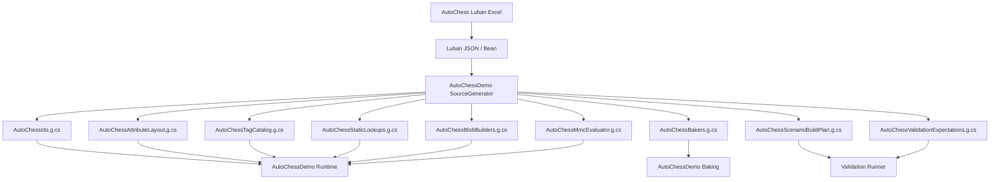
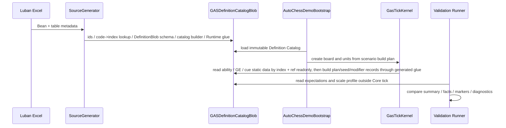

# AutoChessDemo Luban 配置方案 Spec

## 目的

本 Spec 定义 AutoChessDemo 的 Luban 配置链路。它是 `10-AutoChess无头验收Spec.md` 的配置方案切片，负责回答：AutoChessDemo 如何配置业务、如何生成运行时定义、如何支持自动验收、如何为十万 / 百万实体压力测试提供稳定数据输入。

本 Spec 只定义 Demo 配置方案，不替代通用 `08-Luban-SourceGenerator配置生成链路Spec.md`。通用 Spec 约束 Luban / SourceGenerator 的工程边界；本 Spec 约束 AutoChessDemo 具体表结构、生成物和验收使用方式。

本 Spec 同时必须对齐 `UnityDOTS官方文档参考/主题/12-官方案例模式.md` 的 `CASE-10/CASE-11/CASE-12`：配置链应生成 Blob / Baker / validation graph，资源引用只进入 Boundary / Presentation，ScaleProfile 必须承载 warmup / measurement / allocator cleanup 等官方 performance case 口径。

AutoChess 的策划配置验收样例见 `21-AutoChessDemo策划配置验收样例Spec.md`。`11` 负责表结构和生成物；`21` 负责把核心测试能力包映射到这些表，并定义每个样例的 row projection、trace preview、impact analysis 和 scenario validation expectation。

## 相邻 Spec Owner 边界

| 相邻 Spec | 唯一职责 | 本 Spec 消费方式 |
|---|---|---|
| `10-AutoChess无头验收Spec.md` | runner / evidence / scale gate / Goal 停止参考 | `11` 提供 ScaleProfile、DiagnosticsThreshold、ValidationExpectation schema 和 generated artifacts；不重复维护 runner pass / diagnostic pass 规则 |
| `10B-AutoChess完整业务案例设计Spec.md` | 具名棋子、属性、技能、GE、System 链路和业务流程走查 | `11` 只把 10B 的业务样例投影成表结构和默认配置数据；不重复维护完整业务流程 |
| `21-AutoChessDemo策划配置验收样例Spec.md` | 策划测试能力包、row projection、trace preview、impact analysis、scenario validation binding | `11` 维护表结构和生成物字段，`21` 维护样例如何消费这些字段 |

重复维护规则：ScaleProfile / ValidationExpectation / DiagnosticsThreshold 的 schema 和 generated artifact 名称只在 `11` 维护；runner pass、performance / diagnostic split 和 evidence output 只在 `10` 维护；业务样例、Change Set、Impact Analysis 和 Runtime Trace Preview 只在 `21` 维护。

## 官方依据与设计论证

AutoChessDemo 配置不是 demo 常量表，而是目标态 Definition & Generation 链路的业务样本。`CASE-07`、`BLOB-02`、`CONTENT-01`、`PRF-11` 要求静态 definition 进入 Baker / Blob / catalog，而不是 prefab 数量膨胀、runtime entity definition 或 managed config registry；`BUR-01` 要求 hot path 只消费 Burst-compatible lookup / evaluator。

ScaleProfile 和 ValidationExpectation 也不是测试脚本私有字段。`QRY-01` / `JOB-01`、`SC-01` / `ECB-03`、`BUF-01` / `PRF-10`、`NAT-03`、`PRF-33` 都需要可配置阈值和证据字段，否则 AutoChessDemo 只能验证语义能跑，不能验证目标态承载是否优于 OOP 中间层或全局总线。

表现资源引用必须停在 Boundary / Presentation。`SYS-05` 要求 Demo / Presentation 只观察 Core，`CONTENT-01` 也要求资源和静态 gameplay definition 不混在同一个 prefab 承载里。因此 `cue`、`physics_profile`、`render_profile` 生成的是 marker、binding key、profile policy 和 disabled reason，不是 Runtime Core gameplay 依赖。

## 目标目录

```text
EX_GAS_Config/ProjectConfigTable/exgas_config
  Datas/
    AutoChessDemo/
      autochess.unit.xlsx
      autochess.attribute.xlsx
      autochess.ability.xlsx
      autochess.gameplay_effect.xlsx
      autochess.tag.xlsx
      autochess.tag_requirement.xlsx
      autochess.cue.xlsx
      autochess.physics_profile.xlsx
      autochess.render_profile.xlsx
      autochess.scenario.xlsx
      autochess.scale_profile.xlsx
      autochess.validation_expectation.xlsx

Assets/AutoChessDemo/Config
  SchemaDocs/
    autochess.unit.xlsx
    autochess.attribute.xlsx
    autochess.ability.xlsx
    autochess.gameplay_effect.xlsx
    autochess.tag.xlsx
    autochess.tag_requirement.xlsx
    autochess.cue.xlsx
    autochess.physics_profile.xlsx
    autochess.render_profile.xlsx
    autochess.scenario.xlsx
    autochess.scale_profile.xlsx
    autochess.validation_expectation.xlsx
  SourceGenerator/
    AutoChessDemoGenerator.asmdef
    AutoChessDemoGenerator.cs
  GeneratedRuntime/
    AutoChessIds.g.cs
    AutoChessAttributeLayout.g.cs
    AutoChessTagCatalog.g.cs
    AutoChessStaticLookups.g.cs
    AutoChessBlobBuilders.g.cs
    AutoChessMmcEvaluator.g.cs
    AutoChessScenarioBuildPlan.g.cs
    AutoChessValidationExpectations.g.cs
  GeneratedBaking/
    AutoChessBakers.g.cs
    AutoChessBakePlan.g.cs
  GeneratedEditor/
    AutoChessConfigDiagnostics.g.cs
    AutoChessConfigReport.g.cs
```

配置权威源表放在 `EX_GAS_Config/ProjectConfigTable/exgas_config/Datas/AutoChessDemo`。`Assets/AutoChessDemo/Config` 只保存 schema 文档、SourceGenerator 工程和可审查生成代码。生成缓存、临时 JSON 和本地导出文件按 `.gitignore` 处理；manifest 必须生成并参与路径审计 / orphan `.g.cs` 清理，但是否进入版本控制由 `08-Luban-SourceGenerator配置生成链路Spec.md` 的 manifest 策略决定。进入版本控制的生成物必须是源码契约，而不是缓存。

## 配置表职责

| 表 | 职责 | 热路径约束 |
|---|---|---|
| `autochess.attribute.xlsx` | HP / ATK / DEF / ASPD / Mana 等属性定义、clamp、显示名、validation 采样口径 | 生成 attribute id、layout、访问器 |
| `autochess.tag.xlsx` | State / Ability / Faction / Class / Cue tags 和层级关系 | 生成 stable id、dense catalog index 与 ancestor chain |
| `autochess.tag_requirement.xlsx` | 可复用 Tag requirement/query；只引用 stable TagId 外键 | 生成 RequirementId→Catalog-sized query program |
| `autochess.unit.xlsx` | 单位 archetype、阵营、职业、基础属性、能力列表、表现 id | 生成 unit blob、spawn archetype、static lookup |
| `autochess.ability.xlsx` | Ability id、类型、冷却、范围、目标规则、关联 GE / Cue | 生成 ability blob、command build data |
| `autochess.gameplay_effect.xlsx` | Instant / Duration / Period / Stack、modifier、granted tags、application / removal / immunity tags | 生成 GE blob builder、spec static data |
| `autochess.cue.xlsx` | UI / VFX / SFX / FloatingText / GameplayCue marker 映射 | 生成 cue id、log marker template、future resource binding key |
| `autochess.physics_profile.xlsx` | 可选 Unity Physics 目标获取 / 命中确认 / event profile，包含 collider category、CollisionFilter、query type、event opt-in、FixedStep policy | 生成 physics profile blob / constants；默认 headless 可 disabled，但必须输出原因 |
| `autochess.render_profile.xlsx` | 可选 Entities Graphics 表现 profile，包含 mesh/material binding、RenderMeshArray pack hint、MaterialMeshInfo default、material override schema、render evidence policy | 生成 render binding / marker mapping；只进入 Presentation / Boundary |
| `autochess.scenario.xlsx` | 默认战斗、回合数、棋盘、单位布阵、seed、胜负期望 | 生成 scenario build plan |
| `autochess.scale_profile.xlsx` | workload 类型、规模、bounded TickBatch、capacity/high-water、采样率、关闭项、输出项 | 生成 typed scale profile constants |
| `autochess.validation_expectation.xlsx` | expected winner、tick range、facts hash、cue marker count、diagnostics thresholds | 生成 validation expectations |

## 精链路配置原则

AutoChessDemo 的配置必须服务“精链路”，不能靠堆机制证明完整性。

默认配置只保留：

1. 2-4 种单位 archetype。
2. 1 条普攻链。
3. 1 条主动技能链。
4. 1 条 Duration / Period / Stack 链。
5. 1 条 Passive / Synergy 链。
6. 1 条 Death / Cleanup 链。
7. 1 套 UI / VFX / SFX / FloatingText / Cue marker 映射。

新增机制必须说明它覆盖哪个 GAS 概念验收点；不能只是”让 Demo 更丰富”。

## Runtime Core 验证 Catalog 目标链路

目标态 AutoChessDemo 不使用非目标态 `HeadlessAutoChess*` 手写配置源，也不由 demo builder 手写 Ability/GE/Modifier catalog。目标验证链路是：

```text
EX_GAS_Config Excel
  -> Luban JSON/C# export
  -> LubanDefinitionRowProvider normalized rows
  -> GasCodeGenPipeline / DefinitionCatalogPhase
  -> GASGeneratedDefinitionCatalogBuilder.BuildCatalog()
  -> validation + provenance bake gate
  -> immutable GASDefinitionCatalogBlob snapshot
  -> AutoChessGeneratedDefinitionCatalogInstaller.Install()
  -> GASDefinitionCatalogComponent
  -> GasTickKernel generated glue/static evaluator
```

默认精链路的 runtime catalog 示例 code：

| Code | 类型 | 目的 |
|---:|---|---|
| `9101` | Ability | 己方普攻，primary GE 指向 `9201` |
| `9102` | Ability | 敌方普攻，primary GE 指向 `9202` |
| `9103` | Ability | 己方斩杀，primary GE 指向 `9207` |
| `9104` | Ability | 主业务毒 application，primary GE 指向 `9203` |
| `9201` | Instant GE | 己方普攻扣 Health `12`，进入 generated instant spec / attribute delta |
| `9202` | Instant GE | 敌方普攻扣 Health `8`，进入 generated instant spec / attribute delta |
| `9203` | Duration/Period/Stack GE | 主业务毒；精确 stack/capture/period 语义见下文和 `10B-02` |
| `9207` | Instant Execution GE | pure evaluator 读取显式 `Base/Current ValueView`，直接输出 attribute delta，不建立 ActiveEffect marker |
| `9301` | Cue | 最小 hit cue code，用于验证 cue request 投影 |

Application / Boundary 侧 catalog installer 只能负责把 generated catalog 安装到 Runtime World、声明 Blob owner / Dispose 规则和低频 catalog entity 定位策略。它不是 unit / scenario / scale / validation expectation 的权威配置源。

Spec 11 的目标范围是 unit / scenario / scale profile / validation expectation / runtime authoring / Baker / BlobAssetStore 的完整配置化。本段只能定义“Luban/sourcegen catalog 必须贯通到 AutoChess Runtime Core”的验收口径，不能扩展成“Application installer 可以替代 AutoChess 全部配置链”。

## 配置权威边界

Luban row/schema 是 AutoChess authoring 语义唯一权威。SourceGenerator 只负责类型、ID、builder、lookup、evaluator dispatch 与 provenance glue，不拥有也不得 override/append gameplay 字段。Runtime Core 只读 Session install 时固定的 immutable compiled Blob snapshot。任何实现不能把 generated sidecar、managed row array、代码构造的默认房间、runner 常量、serialized fields 或手写 switch 误判为语义权威。

- 同一语义字段出现两个来源、非法 enum/range、引用缺失或 evaluator ValueView 未声明时，bake 必须 fail-closed。
- 诊断至少包含 `Workbook/Table/RowId/Column/RawValue/NormalizedValue/GeneratorRule` provenance，不允许 clamp、默认值或 dummy modifier 掩盖输入错误。
- SourceGenerator 不得像 current overlay 一样注入虚构 Energy modifier、重写 duration/expiration/refresh 或修补非法 `StackingType=9203`。

| 配置域 | 禁止替代源 | 目标生成物 | 约束 |
|---|---|---|---|
| unit / room authority | managed row array、GameRoom 组装常量 | `AutoChessUnitLookup.g.cs` / unit blob / spawn archetype plan | GameRoom 只做业务展示 adapter，不做数据权威来源 |
| scenario authority | 代码构造默认房间和单位布阵 | `AutoChessScenarioBuildPlan.g.cs` | scenario 表输出 deterministic spawn plan、seed、player seat、board group |
| scale profile authority | runner/options/serialized fields 分散维护 scale、health multiplier、measurement | `AutoChessScaleProfile.g.cs` | workload kind、规模、warmup、measurement、采样率和 disabled reason 来自 typed profile |
| validation expectation | runner 只比较少量 count / expected winner | `AutoChessValidationExpectations.g.cs` | required facts、required cue markers、threshold、proof-only API trigger 必须机器可读 |
| execution calculation | Demo ECS system 中硬编码 GE code 与公式 | `AutoChessExecutionEvaluator.g.cs` / `AutoChessMmcEvaluator.g.cs` | calculation code -> generated static switch；system 按 calculation type batch |
| validation evidence model | summary 字符串作为唯一机器依据 | `AutoChessValidationEvidence` runtime model + generated threshold constants | headless / scene runner 共享，同一模型导出 log / json / markdown |

目标态验收中，任何新增业务机制如果继续写入 managed row array、runner 常量或手写 switch，必须在 validation evidence 中标记为 proof-only，声明允许 profile、退出条件和重新选型触发；不得被视为 scale-ready 配置链路。

## 默认精链路配置数据示例

以下配置分层消费：9101–9104/9201–9203/9207 是 Tier A legacy characterization 与 Tier B 主业务语义的发布必选行；后续 3001–3004/4001–5006 的盾击、冰霜、治疗与羁绊仅是 Tier C 扩展示例，不得作为当前覆盖证据。Luban 行经 bake 后生成 BlobAsset 和 static lookup；SourceGenerator 不修改其语义。完整业务逻辑见 `10B`。

### autochess.attribute.xlsx（属性定义）

| AttrId | Name | AttrSet | DefaultValue | Min | Max | ClampMin | ClampMax |
|--------|------|---------|-------------|-----|-----|----------|----------|
| 1 | HP | Combat | 0 | 0 | 99999 | true | true |
| 2 | MaxHP | Combat | 0 | 1 | 99999 | true | true |
| 3 | ATK | Combat | 0 | 0 | 99999 | true | false |
| 4 | DEF | Combat | 0 | 0 | 99999 | true | false |
| 5 | ASPD | Combat | 100 | 10 | 500 | true | true |
| 6 | MANA | Resource | 0 | 0 | 200 | true | true |
| 7 | MaxMANA | Resource | 100 | 1 | 200 | true | true |
| 8 | ManaRegen | Resource | 10 | 0 | 50 | true | false |

**生成物**：`XAttr.HP=1`, `XAttr.ATK=3`, ... stable id 常量、stable id→`AttributeLayout` dense index、clamp/default metadata、`AttributeInitValue` projection，以及显式接收 `DynamicBuffer<AttributeValueSlot>`/layout index 的 Burst 纯访问器。访问器不得按 AttributeId 切换到不同 component。

### autochess.tag.xlsx（Tag 定义与 Catalog 顺序）

| TagId | Name | Category | CatalogOrder | Description |
|-------|------|----------|----------|-------------|
| 1 | State.Stunned | State | 0 | 眩晕，不可行动 |
| 2 | State.Slowed | State | 1 | 减速，ASPD -30% |
| 3 | State.Frozen | State | 2 | 冰冻，不可行动+ASPD=0 |
| 4 | State.Poisoned | State | 3 | 中毒，受到 period 伤害 |
| 5 | Buff.FrostArmor | Buff | 4 | 冰系羁绊护甲 |
| 6 | Buff.HealBonus | Buff | 5 | 牧师羁绊治疗加成 |
| 7 | Ability.ShieldBash | Ability | 6 | 盾击能力标记 |
| 8 | Ability.FrostNova | Ability | 7 | 冰霜新星能力标记 |
| 9 | Ability.PoisonBlade | Ability | 8 | 毒刃能力标记 |
| 10 | Ability.HolyLight | Ability | 9 | 圣光治疗能力标记 |
| 11 | Synergy.Frost | Synergy | 10 | 冰系羁绊单位标记 |
| 12 | Synergy.Priest | Synergy | 11 | 牧师羁绊单位标记 |
| 13 | State.Dead | State | 12 | 死亡标记 |

**生成物**：`XTag.StateStunned=1`, `XTag.StateSlowed=2`, ... stable id 常量 + `TagCatalog` 的 dense index / ancestor chain + 预编译 `TagQueryProgram` 与纯查询访问器。`CatalogOrder` 只是确定性布局输入，不是运行时身份，也不直接等于 machine-word bit 位。

**关键约束**：每个 ASC 的唯一 Tag 权威是固定长度 `TagCountSlot[] { ExactCount, InclusiveCount }`；可选 `TagPresenceWord[]` 仅是由 revision 重建的多 word 派生缓存。Catalog 可按 profile 选择多个 word 或关闭缓存，不存在 64 Tag 的语义上限，也不得为单个 Tag 生成独立 `IComponentData` 或第二套 mask 权威。

### autochess.tag_requirement.xlsx（Tag 查询定义）

| RequirementId | Name | QueryOp | MatchMode | TagIds |
|---|---|---|---|---|
| 7001 | BlockedWhileDisabled | Any | Inclusive | 1,3 |
| 7002 | ImmuneWhileFrozen | Any | Inclusive | 3 |

`TagIds` 是指向 `autochess.tag.xlsx.TagId` 的 typed 外键列表：7001 编译为 `State.Stunned OR State.Frozen`，7002 编译为 `State.Frozen`。生成器必须拒绝未知/重复 TagId、空的非法 query、suffix alias（如裸 `Stunned`）和无法解析的 path，并携 table/row/column provenance；Runtime 只消费 `TagRequirementId -> TagQueryProgram`。

### autochess.unit.xlsx（单位配置）

| ID | Name | Class | Race | Star | HP | ATK | DEF | ASPD | MANA | ManaRegen | AbilityId | InitialTagIds |
|----|------|-------|------|------|-----|-----|-----|------|------|-----------|-----------|-----------------|
| 2001 | 霜甲剑士 | Swordsman | Frost | 2 | 1500 | 120 | 80 | 100 | 40 | 5 | 3001 | 11 |
| 2002 | 冰霜女巫 | Mage | Frost | 3 | 900 | 70 | 30 | 100 | 80 | 12 | 3002 | 11 |
| 2003 | 暗影刺客 | Assassin | Shadow | 2 | 900 | 180 | 25 | 120 | 60 | 8 | 3003 | — |
| 2004 | 圣光牧师 | Priest | Light | 2 | 700 | 50 | 20 | 100 | 100 | 10 | 3004 | 12 |
| 2005 | 重装剑士 | Swordsman | — | 2 | 1800 | 100 | 100 | 90 | 40 | 5 | 3001 | — |
| 2006 | 烈焰法师 | Mage | — | 3 | 850 | 90 | 25 | 100 | 80 | 12 | 0 | — |

**生成物**：`UnitConfigBlob` BlobAsset（含 `BlobAssetReference<UnitConfigBlob>` builder），`UnitLookup[id]` static lookup table。每个单位输出按 stable `AttributeId` 排序的 `AttributeInitValue[]` 与 typed initial TagId range；`SpawnInitializationTransaction` 通过 Session `AttributeLayout` / `TagCatalog` 投影到同一 ASC 的 `AttributeValueSlot[]` / `TagCountSlot[]` shadow，禁止 suffix alias、未知 TagId或 generated per-attribute component。

**关键约束**：不使用 Prefab 承载 GE/Ability 定义（不变量 13.6）。Prefab 仅限 optional Entities Graphics profile 的 render proxy entity。

### autochess.ability.xlsx（技能配置）

| AbilityId | Name | Type | ManaCost | CooldownFrames | TargetRule | MaxTargets | Range | EffectId_Primary | EffectId_Secondary | BlockTagRequirementId |
|-----------|------|------|----------|----------------|------------|------------|-------|------------------|--------------------|-------------|
| 9101 | 己方普攻 | Primary | 0 | 0 | FrozenEnemyAsc | 1 | Legacy | 9201 | — | — |
| 9102 | 敌方普攻 | Primary | 0 | 0 | FrozenEnemyAsc | 1 | Legacy | 9202 | — | — |
| 9103 | 斩杀 | Finisher | 0 | 0 | FrozenEnemyAsc | 1 | Legacy | 9207 | — | — |
| 9104 | 毒 | ActiveDue | 0 | 0 | FrozenEnemyAsc | 1 | Legacy | 9203 | — | — |
| 3001 | 盾击 | Active | 40 | 180 | NearestEnemy | 1 | 1.5 | 5001 | 5002 | 7001 |
| 3002 | 冰霜新星 | Active | 80 | 300 | NearestEnemies | 3 | 3.0 | 5003 | 5004 | 7001 |
| 3003 | 毒刃 | Active | 60 | 120 | NearestEnemy | 1 | 1.5 | 5005 | — | 7001 |
| 3004 | 圣光治疗 | Active | 40 | 240 | LowestHPAlly | 1 | 4.0 | 5006 | — | 7001 |
| 0 | 普攻 | PassiveAuto | 0 | 0 | NearestEnemy | 1 | 按职业 | 4001 | — | 7001 |

**TargetRule 枚举**：`0=NearestEnemy`, `1=LowestHPAlly`, `2=NearestEnemies`（AoE 多目标）, `3=FrozenEnemyAsc`。主业务 Frozen target 同时要求稳定 `ScenarioUnitId`、`AliveOnly` 与 no-self-fallback policy。
**BlockTagRequirementId**：typed 外键引用 `autochess.tag_requirement.xlsx.RequirementId`；7001 表示 Source ASC 命中 `State.Stunned` 或 `State.Frozen` 时禁止释放。Ability row 不内嵌 Tag path/list，更不内嵌单 word bits。

**生成物**：`AbilityDefBlob` BlobAsset，`AbilityLookup[id]` static lookup table。

### autochess.gameplay_effect.xlsx（GE 配置）

| GEId | Name | Type | DurationFrames | PeriodFrames | StackLimit | StackPolicy | ModifierAttr | ModifierOp | ModifierMmc | GrantedTagIds | RemoveTagIds | ApplicationTagRequirementId | ImmunityTagRequirementId |
|------|------|------|----------------|--------------|------------|-------------|-------------|------------|-------------|-------------|------------|-------------------|--------------|
| 9201 | 己方普攻 | Instant | 0 | 0 | 0 | — | HP | Minus | Fixed12 | — | — | — | — |
| 9202 | 敌方普攻 | Instant | 0 | 0 | 0 | — | HP | Minus | Fixed8 | — | — | — | — |
| 9203 | 主业务毒 | Duration | 8 | 2 | 3 | AggregateBySource | HP | Minus | SourceAttackSnapshot*0.3*StackCount | 4 | — | — | — |
| 9207 | 斩杀 | InstantExecution | 0 | 0 | 0 | — | HP | Minus | Finisher9207 | — | — | — | — |
| 4001 | 普攻伤害 | Instant | 0 | 0 | 0 | — | HP | Minus | ATK*1.0 | — | — | — | — |
| 4002 | 冰系减速 | Duration | 180 | 0 | 0 | — | ASPD | Multiply | 0.7 | 2 | — | — | — |
| 5001 | 盾击伤害 | Instant | 0 | 0 | 0 | — | HP | Minus | ATK*0.8 | — | — | — | — |
| 5002 | 眩晕 | Duration | 120 | 0 | 0 | — | ASPD | Override | 0.0 | 1 | — | — | 7002 |
| 5003 | 冰霜新星伤害 | Instant | 0 | 0 | 0 | — | HP | Minus | MagicPower*1.5-DEF*0.3 | — | — | — | — |
| 5004 | 冰霜减速 | Duration | 180 | 0 | 0 | — | ASPD | Multiply | 0.7 | 2 | — | — | 7002 |
| 5005 | 毒刃 | Duration | 240 | 60 | 3 | SourceAggregate | HP | Minus | ATK*0.3 | 4 | — | — | — |
| 5006 | 圣光治疗 | Instant | 0 | 0 | 0 | — | HP | Add | MagicPower*0.8 | — | — | — | — |

**列名约束**：使用 `ModifierMmc`，与 `10B-AutoChess完整业务案例设计Spec.md` 行392 对齐。Tag contribution 列只接受 typed `TagId[]` 外键，query列只接受 typed `TagRequirementId` 外键；默认示例没有值时填 "—"，禁止用 `Poisoned/Frozen` 一类 suffix alias冒充引用。

**9203 必填语义列**：`StackKey=(Definition,TargetASC,SourceASC)`、`StackPayloadPolicy=ReplaceLatest`、Source Attack `CapturePhase=SourceSpecProjection`、`ExecuteOnApply=false`、`ReapplyRefreshDuration=false`、`ReapplyResetPeriod=true`、`DueEqualsEndOrder=PeriodThenExpiry`、`ExpiryPolicy=RemoveOneRefreshDurationResetPeriod`、`InhibitPolicy=DurationContinuesPeriodSkipNoCatchUp`、`TargetLifePolicy=AliveOnly`。每次成功 application（包括 cap reapply）用本次 `SourceSpecProjection` snapshot 替换 active payload 与 provenance；任何列缺失都 bake fail。Legacy 9204 固定 `-1` child 不进入目标 catalog。

**9207 ValueView 契约**：`HealthBefore=Target.AttributeValueSlot[HealthLayoutIndex].Base`，`HealthMax=AttributeDefinition.MaxValue`，`MissingHealth=Max(0,HealthMax-HealthBefore)`，`Damage=Clamp(16+0.5*MissingHealth,12,42)`，写回同一 slot 的 Base 后由 Aggregator 重算/Clamp Current；缺少 layout-resolved ValueView 时 bake fail，禁止回退到 `BHealth` 一类 generated component。

**GE 类型覆盖**：
- 4001/5001/5003/5006 = Instant（直接修改属性，不创建 slot）
- 5002 = Duration（创建 slot，授予 Stunned tag，到期移除）
- 5004 = Duration（创建 slot，授予 Slowed tag，到期移除）
- 5005 = Duration + Period + Stack（创建 slot，每 1s 跳伤害，最多 3 层 SourceAggregate）

**ModifierMmc 映射到 MmcTypeId**：由 SourceGenerator 解析表达式 → 生成 `MmcTypeId` 常量和 `MmcEvaluator.Evaluate()` 的 switch case。例如 `ATK*0.8` → `MmcTypeId.AtkScale08`，`MagicPower*1.5-DEF*0.3` → `MmcTypeId.MagicPowerMulDefReduc`。

**生成物**：`GEStaticBlob` BlobAsset（含 modifiers、granted TagId ranges 与 TagRequirement query program refs），`GELookup[id]` static lookup table。

### autochess.cue.xlsx（Cue Marker 映射）

| CueId | Name | Category | LogMarker | ResourceBindingKey |
|-------|------|----------|-----------|--------------------|
| 1001 | ShieldBashVFX | VFX | `[CUE:VFX:ShieldBash]` | `VFX_ShieldBash_Hit` |
| 1002 | IceNovaVFX | VFX | `[CUE:VFX:IceNova]` | `VFX_IceNova_AoE` |
| 1003 | PoisonSlashVFX | VFX | `[CUE:VFX:PoisonSlash]` | `VFX_PoisonSlash_Impact` |
| 1004 | HealBeamVFX | VFX | `[CUE:VFX:HealBeam]` | `VFX_HealBeam_Cast` |
| 1005 | DeathVFX | VFX | `[CUE:VFX:Death]` | `VFX_Death_Common` |
| 2001 | DamageText | FloatingText | `[CUE:FT:Damage]` | `UI_DamageText` |
| 2002 | HealText | FloatingText | `[CUE:FT:Heal]` | `UI_HealText` |
| 3001 | ShieldBashSFX | SFX | `[CUE:SFX:ShieldBash]` | `SFX_ShieldBash_Whoosh` |
| 3002 | IceNovaSFX | SFX | `[CUE:SFX:IceNova]` | `SFX_IceNova_Crack` |

**生成物**：`XCueCode` 常量，cue marker 的 `FixedString32Bytes` 模板。

### autochess.scenario.xlsx（默认战斗场景）

| ScenarioId | Name | BoardWidth | BoardHeight | Seed | MaxBattleFrames | ExpectedWinner | ProfileId |
|------------|------|------------|-------------|------|-----------------|----------------|-----------|
| 1 | 默认4v4精链路 | 4 | 2 | 12345 | 3600 (60s) | Team0 | x1 |

| ScenarioId | Team | UnitId | BoardCol | BoardRow |
|------------|------|--------|----------|----------|
| 1 | 0 | 2001 | 0 | 0 |
| 1 | 0 | 2002 | 0 | 1 |
| 1 | 0 | 2003 | 2 | 0 |
| 1 | 0 | 2004 | 2 | 1 |
| 1 | 1 | 2005 | 1 | 0 |
| 1 | 1 | 2006 | 1 | 1 |
| 1 | 1 | 2003 | 3 | 0 |
| 1 | 1 | 2004 | 3 | 1 |

**生成物**：`AutoChessScenarioBuildPlan.g.cs` — `BuildPlan` 只保存 scenario id、seed 与 immutable Blob 中的 `SpawnEntry[]` range；数组长度由表行数构建并在 publish 前受 ScaleProfile 逻辑上限准入，不用固定字节 `FixedList` 冒充可扩展容量。

### autochess.scale_profile.xlsx（规模配置）

| ProfileId | WorkloadKind | BattleCount | UnitsPerBattle | MaxFixedTicksPerBatch | MaximumDeltaTimeTicks | 主要压力 | 必须报告 |
|-----------|--------------|-------------|----------------|----------------------|-----------------------|----------|----------|
| semantic_x1 | ReplicatedGroups | 1 | 4 | 64 | 64 | Tier A/B 精确语义 | full trace/hash/audit |
| replicated_groups_50 | ReplicatedGroups | 50 | 4 | 64 | 64 | 50 个隔离战局横向复制 | per-battle + aggregate hash |
| hot_target | HotTarget | 1 | 配置化 | 16 | 16 | 同 target fan-in | command range/canonical order |
| period_burst | PeriodBurst | 配置化 | 配置化 | 16 | 16 | 同 tick period due | slot/scratch high-water |
| mass_death_teardown | MassDeathTeardown | 配置化 | 配置化 | 8 | 8 | death/final drain/cleanup | teardown audit/high-water |
| boundary_burst_retry | BoundaryBurstRetry | 配置化 | 配置化 | 8 | 8 | ring full/retry | accepted/retry/drop counters |
| wait_fanout_cancel | WaitFanoutCancel | 配置化 | 配置化 | 16 | 16 | wait recipient/cancel | wait capacity/order |
| cross_asc_live_dirty | CrossAscLiveDirty | 配置化 | 配置化 | 16 | 16 | destination regroup | dirty iteration/bound |

**生成物**：`ScaleProfileConstants`，含 `PresentationSampleRate`, `DebuggerSampleRate`, `ExpectedEntityCount` 等，供 Validation 和 Runner 读取。

`x50` 若作为 legacy alias，只能映射 `replicated_groups_50`，其语义是 50 个相互隔离的 4 单位 BattleInstance，不是一个 50 单位热战局。

### autochess.validation_expectation.xlsx（验收期望）

| ExpectationId | ScenarioId | ProfileId | ExpectedWinner | MinBattleFrames | MaxBattleFrames | RequiredFactKinds | RequiredCueMarkers | DiagnosticsThresholdId |
|---------------|------------|-----------|----------------|-----------------|-----------------|--------------------|--------------------|------------------------|
| 1 | 1 | x1 | Team0 | 60 | 3600 | DamageResolved,DeathOccurred,EffectApplied,EffectExpired | ShieldBashVFX,IceNovaVFX,PoisonSlashVFX,HealBeamVFX,DeathVFX | x1_pass |

**RequiredFactKinds 语义**：战斗中必须至少出现这些 fact code 各一次。缺失任何一项 → 验收失败（即使数值结算正确，说明某条 GAS 链路未触发）。
**RequiredCueMarkers 语义**：无头模式下 log marker 必须出现；有画面模式下 presentation outbox 必须包含。

### 配置示例与 10B 的关系

以上示例数据与 `10B-AutoChess完整业务案例设计Spec.md` 基本对应：
- 10B 提供业务解读（为什么选这些棋子、为什么这个 GE 参数、走查中的数值如何计算）
- 本文件（11）提供 Luban 表结构定义和 SourceGenerator 生成链路
- 两文件合在一起 = 一份完整的 AutoChess Demo 配置方案（字段定义 + 具体数据 + 业务逻辑 + 生成链路）

> **目标归一规则**：(1) 仅依赖 Tag 层级/存在性的羁绊条件默认通过 `autochess.tag.xlsx` 的 `Synergy.*` stable Tag 与 Catalog-sized requirement query 表达；只有需要棋盘邻接、计数分段或其他非 Tag 数据时才允许独立 `autochess.synergy.xlsx`，并必须声明其独立数据语义，不能以“超出单 word”作为理由。(2) 配置诊断生成物统一命名为 `AutoChessConfigDiagnostics.g.cs`；`Report` 只作为人读导出后缀，不作为 runtime-visible artifact 名称。




生成物职责：

| 生成物 | 职责 | 禁止事项 |
|---|---|---|
| `AutoChessIds.g.cs` | 属性、Tag、Ability、GE、Cue、Unit、Scenario、ScaleProfile 常量 | 不包含 gameplay 逻辑 |
| `AutoChessAttributeLayout.g.cs` | `XAttr`、stable id→dense index、`AttributeLayout` builder、`AttributeInitValue` projection 与纯 slot accessor | 不生成 Attribute `IComponentData`、Base/Current mirror、dirty mirror 或生命周期 system；运行时只写同一 `AttributeValueSlot[]` |
| `AutoChessTagCatalog.g.cs` | `XTag`、dense index / ancestor chain、`TagRequirementId -> TagQueryProgram` 与可选派生 presence-word 访问器 | 不生成独立 Tag component，不接受 suffix alias，不把单 word mask 变成权威或 64 Tag 上限；运行时只写同一 `TagCountSlot[]` |
| `AutoChessStaticLookups.g.cs` | id -> blob / compact lookup；Runtime Core 只读 | 不读取原始 JSON；不使用托管数组 / dictionary 作为 hot path lookup |
| `AutoChessBlobBuilders.g.cs` | Unit / Ability / GE / TagRequirement / Cue marker blob 构建，输入来自 row / generated definition | 不从 prototype entity 或 runtime state 构建静态 definition |
| `AutoChessMmcEvaluator.g.cs` | `MmcTypeId` 常量和 `MmcEvaluator.Evaluate()` static switch | 不生成托管 delegate、`Func<>` 或可变 registry |
| `AutoChessExecutionEvaluator.g.cs` | execution calculation code、公式参数、输出 fact/reason code 的 static switch 和 batch evaluator | 不把 calculation formula 写死在 ECS system；不生成托管 delegate 或 runtime strategy object |
| `AutoChessBakers.g.cs` | `Baker<TAuthoring>`、`DependsOn()`、`AddBlobAsset()` / custom hash glue | 不生成静态 ECB Baker 方法；不读取其他 Baker 输出 |
| `AutoChessBakePlan.g.cs` | bake-time 依赖、BlobAssetStore、Baking world / phase 输出计划 | 不参与 Runtime Core tick |
| `AutoChessScenarioBuildPlan.g.cs` | 根据 scenario 表生成 spawn plan、board plan、seed | 不直接操作 Runtime Core 私有结构 |
| `AutoChessScaleProfile.g.cs` | typed workload profile、规模参数、warmup/measurement、采样率、Physics/Graphics disabled reason | 不把 workload、性能阈值和采样策略硬编码在 runner / scene serialized fields |
| `AutoChessValidationExpectations.g.cs` | expected summary、facts hash、thresholds | 不把测试结果写死为实现逻辑 |
| `AutoChessValidationEvidence.g.cs` / runtime model | 统一 headless / scene runner evidence 字段、proof-only API、reselect trigger、world time policy、official tool diff 摘要 | 不替代 Runtime Core Debugger；不把字符串日志作为唯一机器依据 |
| `AutoChessConfigDiagnostics.g.cs` | Editor / CI 配置诊断 | 不参与 runtime hot path |

## ScaleProfile 设计

`autochess.scale_profile.xlsx` 是高规模验收的关键配置表。

| 字段 | 含义 |
|---|---|
| `ProfileId` | `semantic_x1` / `replicated_groups_50` / `hot_target` / `period_burst` 等稳定 ID |
| `WorkloadKind` | ReplicatedGroups / HotTarget / PeriodBurst / MassDeathTeardown / BoundaryBurstRetry / WaitFanoutCancel / CrossAscLiveDirty |
| `BattleInstanceCount` / `UnitsPerBattle` | 明确战局复制与单战局规模，禁止只给一个 x 倍数 |
| `MaxFixedTicksPerBatch` | runner允许的 bounded TickBatch上限；batch切分不参与语义 |
| `MaximumDeltaTimeTicks` | `World.MaximumDeltaTime` 的整数 tick配置；安装时换算为 `MaximumDeltaTimeTicks / TickRate`，必须 `>0 && <= MaxFixedTicksPerBatch` |
| `CommandCapacity` / `SlotCapacity` / `BoundaryCapacity` / `WaitCapacity` | profile 启动前完成 infra 容量预检 |
| `MaxAllocatorHighWaterBytes` | allocator high-water 机器阈值 |
| `BoardCount` | 棋盘副本数，用于横向扩展实体数量 |
| `UnitsPerBoard` | 每棋盘单位数 |
| `AbilitySet` | 使用默认能力集、精简能力集或 synthetic ability set |
| `PresentationSampleRate` | 表现 marker 采样率 |
| `DebuggerSampleRate` | Debugger facts 采样率 |
| `ExpectedEntityCount` | 期望实体数量 |

`MaxFixedTicksPerBatch` 与 `MaximumDeltaTimeTicks` 都进入 ScaleProfile/content hash。前者限制一次 runner调用的工作量，后者限制 Unity fixed-rate catch-up可积累的 delta；缺少任一字段都必须 publish validation失败，禁止 runtime使用隐藏默认值。
| `ExpectedCommandRange` | 每 tick command 数量范围 |
| `ExpectedFactRange` | 每 tick facts 数量范围 |
| `MaxCoreTickAvgMs` | 目标 core simulation tick 平均上限 |
| `MaxCoreTickP95Ms` | 目标 core simulation tick P95 上限 |
| `MaxRuntimeTickAvgMs` | `core + observation + presentation + debugger counters` 平均上限 |
| `MaxObservationTickAvgMs` | observation projection 平均上限 |
| `MaxPresentationTickAvgMs` | presentation marker 生成平均上限 |
| `MaxSingleSystemP95Ms` | 单个 Runtime Core system P95 热点阈值 |
| `MaxGcAllocBytesPerTick` | 每 tick GC 分配上限；优秀线必须为 0 |
| `MaxSyncPointCount` | 每 tick sync point 上限；优秀线必须为 0 |
| `MaxHotPathStructuralChangeCount` | 热路径结构变化上限；优秀线必须为 0 |
| `MaxGlobalBufferSpillCount` | 全局 command / fact / outbox buffer spill 上限 |
| `MaxDynamicBufferExternalizedCount` | DynamicBuffer 外置数量或近似 pressure 上限 |
| `MaxRandomLookupCountPerTick` | 每 tick 随机 lookup 上限 |
| `MaxEnableableWaitCount` | enableable 写 job 导致同步等待的上限 |
| `MinChunkUtilization` | chunk 利用率最低要求 |
| `MaxUnusedEntitiesPerArchetype` | archetype chunk 空洞上限 |
| `RequireQueryFilterReport` | 是否要求 filtered / unfiltered query count |
| `RequireAllocatorReport` | 是否要求 allocator owner / TempJob age / rewind count |
| `RequireBurstWarmupReport` | 是否要求丢弃 Burst warmup tick 并输出 Burst target |
| `MinChunkSkipRatio` | 对 idle/no-op 压测期望的 chunk skip 比例 |
| `MaxNativeStreamMergeMs` | NativeStream / sampled stream merge 成本上限 |
| `MaxPerEntityEcbCommandCount` | 大批量结构变化中逐实体 ECB command 上限 |
| `RequireDeterministicOutputOrder` | gameplay 相关并行输出是否必须声明确定性策略 |
| `PerformanceTier` | pass / excellent，用于自动验收和 Goal 停止判断 |
| `CasePatternReport` | 是否输出 `CASE-*` 官方案例对照 |
| `WarmupDroppedTicks` | 参考官方 PerformanceTests，性能统计前丢弃的 warmup tick 数 |
| `MeasurementTickCount` | 参考官方 PerformanceTests，正式测量 tick 数 |
| `AllocatorCleanupPolicy` | WorldUpdateAllocator / group allocator / TempJob / Persistent 的 cleanup 策略 |
| `PhysicsProfileId` | 可选 Unity Physics profile；默认 `disabled`，启用时必须输出 query/event counters |
| `RenderProfileId` | 可选 Entities Graphics profile；默认 `headless_log`，启用时必须输出 draw / BRG / render counters |
| `ProofOnlyApiPolicy` | 该 profile 允许的 proof-only API 列表和解释 |
| `ReselectTrigger` | 触发 API 重选型的 command count、fact count、lookup count、buffer pressure 或 scale gate |
| `WorldTimePolicy` | FixedStep / variable step / Editor frame delta 的显式策略 |

高规模 profile 允许 synthetic workload，但必须满足：

1. 使用同一套 Ability / GE / Attribute / Facts contract。
2. 不绕过 `GasRuntimeSession`、`GasTickKernelSystem` 与 target-owned transaction。
3. 不删除 presentation outbox，只能采样或批量汇总。
4. 输出 dropped / sampled / total counters。
5. 输出 TickBatch、allocator、scratch、slot、boundary、wait 的实际 high-water 与显式 overflow/retry outcome。
6. semantic hash 不得包含 profile batch 切分、raw Entity、wall-clock、Profiler sample 或 allocator 地址。

推荐性能阈值必须与 `10-AutoChess无头验收Spec.md` 的 `实机性能指标参考` 对齐。配置表可以按机器或平台维护不同 threshold row，但修改目标阈值必须写入 Spec 或 ADR，不能只在 Excel 中静默放宽。

## DiagnosticsThreshold 设计

`autochess.diagnostics_threshold.xlsx` 维护自动验收阈值。ScaleProfile 通过 `DiagnosticsThresholdId` 引用它，避免业务规模配置和性能判定混在同一张表里。

最低字段：

| 字段 | 含义 |
|---|---|
| `ThresholdId` | 阈值 ID，例如 `semantic_x1_pass`、`replicated_groups_50_excellent` |
| `ProfileId` | 对应 ScaleProfile |
| `Tier` | pass / excellent |
| `MaxCoreTickAvgMs` | core tick 平均上限 |
| `MaxCoreTickP95Ms` | core tick P95 上限 |
| `MaxRuntimeTickAvgMs` | runtime tick 平均上限 |
| `MaxSingleSystemP95Ms` | 单 system 热点上限 |
| `MaxGcAllocBytesPerTick` | GC 分配上限 |
| `MaxSyncPointCount` | sync point 上限 |
| `MaxHotPathStructuralChangeCount` | 热路径结构变化上限 |
| `MaxGlobalBufferSpillCount` | 全局 DynamicBuffer spill 上限 |
| `MaxDynamicBufferExternalizedCount` | DynamicBuffer 外置数量或近似 pressure 上限 |
| `MaxRandomLookupCountPerTick` | 随机 lookup 上限 |
| `MaxEnableableWaitCount` | enableable dependency wait 上限 |
| `MinChunkUtilization` | chunk 利用率最低要求 |
| `RequireQueryFilterReport` | 是否要求 filtered / unfiltered / change filter / enableable wait 报告 |
| `RequireAllocatorReport` | 是否要求 allocator owner / dispose / rewind 报告 |
| `RequireBurstWarmupReport` | 是否要求 Burst warmup / FunctionPointer batch size 报告 |
| `RequirePhysicsReport` | 是否要求 physics step / query / event / broadphase sync 报告 |
| `RequireRenderReport` | 是否要求 draw command / instances per draw / BRG / render cost 报告 |
| `MinChunkSkipRatio` | chunk skip 最小比例；不适用时设为 disabled |
| `MaxNativeStreamMergeMs` | NativeStream / sampled stream merge 上限 |
| `MaxPerEntityEcbCommandCount` | 逐实体 ECB 命令上限 |
| `RequireApiSelectionHealth` | 是否要求输出完整 API 健康指标 |
| `RequireZeroManagedCallback` | simulation tick 内是否要求 0 managed callback |
| `RequireDebuggerCounters` | 是否要求 Runtime Core Debugger counters 完整输出 |
| `GoalStopEligible` | 是否允许作为 Goal 自动停止依据 |

目标态推荐阈值：

| ThresholdId | Tier | GoalStopEligible | 核心指标 |
|---|---|---|---|
| `semantic_x1_pass` | pass | false | `coreAvg <= 0.20`, `coreP95 <= 0.40`, `runtimeAvg <= 0.50` |
| `semantic_x1_excellent` | excellent | true | `coreAvg <= 0.08`, `coreP95 <= 0.15`, `runtimeAvg <= 0.25` |
| `scene_semantic_x1_excellent` | excellent | true | `coreAvg <= 0.12`, `coreP95 <= 0.25`, `runtimeAvg <= 0.40` |
| `replicated_groups_50_excellent` | excellent | true | `coreAvg <= 0.30`, `coreP95 <= 0.60`, `runtimeAvg <= 0.80` |
| `hot_target_pass` | pass | true | profile row 冻结 fan-in 数与 core/buffer 阈值 |
| `period_burst_pass` | pass | true | profile row 冻结 due 数与 slot/scratch 阈值 |
| `mass_death_teardown_pass` | pass | true | profile row 冻结 death 数、FinalDrain/cleanup/high-water 阈值 |
| `boundary_burst_retry_pass` | pass | true | profile row 冻结 ring 容量、retry 与 zero-silent-drop 阈值 |
| `wait_fanout_cancel_pass` | pass | true | profile row 冻结 wait recipient/cancel/capacity 阈值 |
| `cross_asc_live_dirty_pass` | pass | true | profile row 冻结 dirty destination/iteration bound 阈值 |

`GoalStopEligible = true` 不表示单个 profile 通过即可停止 Goal。默认性能优化 Goal 必须同时满足 semantic/scene、replicated groups、hot target、period burst、mass death+teardown、boundary burst/retry、wait fanout/cancel 与 cross-ASC live dirty 的冻结门，并满足 `10-AutoChess无头验收Spec.md` 中的 Goal 自动停止条件。

## ValidationExpectation 设计

ValidationExpectation 用于自动验收，不用于驱动 gameplay。

最低字段：

| 字段 | 含义 |
|---|---|
| `ScenarioId` | 对应 scenario |
| `ScaleProfileId` | 对应 scale profile |
| `ExpectedWinner` | 期望胜方 |
| `MinBattleTicks` / `MaxBattleTicks` | 合法 tick 范围 |
| `RequiredFactKinds` | 必须出现的 facts |
| `RequiredCueMarkers` | 必须出现的 UI / VFX / SFX / FloatingText / Cue marker |
| `ForbiddenRuntimeWarnings` | 禁止出现的 runtime warning |
| `SummaryHashPolicy` | strict / sampled / disabled |
| `ValidationTier` | LegacyCharacterization / TargetSemanticConformance / Extension |
| `SemanticHashSchemaVersion` | 稳定 hash schema 版本 |
| `SemanticHashIncludedFields` | stable identity、tick、canonical sequence、typed outcome、state/fact/outcome |
| `SemanticHashExcludedFields` | batch split、raw Entity、chunk/job order、wall-clock、Profiler、allocator address、teardown fact |
| `TeardownAuditPolicy` | cleanup audit 必须项与零残留阈值 |
| `ReturnValidationResultAfterAudit` | 必须为 true；最终结果在 teardown audit 后返回 |
| `DiagnosticsThresholdId` | 关联诊断阈值 |
| `ExpectedPhysicsDisabledReason` | 默认无头 profile 下必须出现的 Physics disabled reason；启用 Physics 时设为 disabled |
| `ExpectedEntitiesGraphicsDisabledReason` | 默认无头 profile 下必须出现的 Entities Graphics disabled reason；启用 rendered profile 时设为 disabled |
| `AllowedProofOnlyApis` | 本 expectation 允许存在的 proof-only API，空表示必须全 scale-ready |
| `RequiredReselectTriggers` | 若 proof-only API 存在，summary 必须输出的重选型触发条件 |
| `RequiredWorldTimePolicy` | 期望的 world time / fixed-step 策略 |

## 配置到运行时链路



## 验收标准

1. AutoChessDemo 默认链路不再依赖手写巨量 definition rows。
2. 配置表能生成 Unit / Ability / GE / Cue / Scenario / ScaleProfile / ValidationExpectation 的 Definition Catalog / runtime lookup。
3. `semantic_x1` 与七类 typed workload profile 能从配置生成，不在测试代码里硬编码业务数据；legacy x50 只能作为 replicated-groups alias。
4. 每类 workload 可独立扩大规模，且不会因 raw 倍数改变 workload 语义。
5. DiagnosticsThreshold 能生成 pass / excellent 性能阈值，并被 ValidationExpectation 引用。
6. 生成链不生成 gameplay lifecycle，只生成 Definition & Generation Layer 输入、runtime static lookup 和 Generated Runtime Glue。
7. PhysicsProfile / RenderProfile 能生成可选 profile，默认无头输出 disabled reason，启用时能把 Physics / Graphics 指标纳入 validation summary。
8. Runtime assembly 中不存在 `cfg.*`、`XLuban`、`SimpleJSON` 或 Luban managed row 依赖；AutoChess runtime 只消费 generated ids、`GASDefinitionCatalogBlob` / Blob、code->index lookup、Generated Runtime Glue、`AttributeLayout` / `TagCatalog` metadata、初始化投影、可选派生 presence words 和 MMC static switch；`AttributeValueSlot[]` / `TagCountSlot[]` 始终是唯一运行时权威。
9. AutoChess lookup 必须证明 O(1) 或 O(log n)，并在生成报告中输出数据规模、排序/哈希策略和 Burst / Player AOT 可见性。
10. `AutoChessBakers.g.cs` 必须能映射到 `Baker<TAuthoring>` / `DependsOn()` / `AddBlobAsset()` / custom hash 规则；不得用静态 ECB helper 冒充 Baker。
11. 生成 manifest 必须能清理删除表行后遗留的 `.g.cs`，并证明输出路径没有逃逸 `Assets/AutoChessDemo/Config` 或约定 generated root。
12. `AutoChessGameRoomFactory`、headless runner 和 scene runner 不得长期持有 unit/scenario/scale/validation 的权威常量；它们只能消费 generated build plan / profile / expectation。
13. execution calculation system 不得长期硬编码 calculation code 与公式；公式、输出 fact code、reason code 和 batch policy 必须来自 generated evaluator。
14. headless runner 与 scene runner 必须导出同一 `AutoChessValidationEvidence` 结构；字符串 summary 只是展示格式，不能作为唯一机器依据。
15. Luban 是 authoring 语义唯一权威；SourceGenerator 只能生成 glue，针对同字段 override、dummy modifier、非法 enum/range 的负例必须携 provenance bake fail。
16. 9203 和 9207 的全部必填语义列能进入 immutable compiled Blob；legacy 非法 `StackingType=9203`、固定 `-1` periodic child 和无限 ActiveEffect marker 均不得通过 bake。
17. ScaleProfile 必须按七种 `WorkloadKind` 出证据，并报告 bounded TickBatch 与 allocator/capacity high-water；不得用 x50 总量替代 workload 类型。
18. Legacy characterization 与 target semantic conformance 使用不同 expectation；semantic hash 明确 include/exclude，BattleOutcome 冻结后 teardown 只能更新 audit，不能改写 battle hash。
19. Unit/Ability/GE 的 Tag 字段全部为 typed `TagId[]` 或 `TagRequirementId` 外键；未知、重复、suffix alias 或未定义 requirement 必须带 provenance bake fail，默认示例本身必须完整通过引用解析。

## 历史方案定位

1. 方案12 的 Luban + SourceGenerator 配置链、属性 / GE 示例、压力测试场景见 `../历史方案参考/方案12.md:81-148`、`../历史方案参考/方案12.md:621-646`、`../历史方案参考/方案12.md:996-1149`、`../历史方案参考/方案12.md:2289-2320`。
2. 方案13 的 Tag bit、Ability / Effect blob、真实 Demo 业务配置链见 `../历史方案参考/方案13.md:153-170`、`../历史方案参考/方案13.md:696-818`、`../历史方案参考/方案13.md:1164-1215`、`../历史方案参考/方案13.md:2053-2176`。
3. 方案14 的自走棋 Luban 配置表、GEBlobBuilder、ECS 数据和 UI 事件链见 `../历史方案参考/方案14.md:1138-1368`、`../历史方案参考/方案14.md:1446-1508`、`../历史方案参考/方案14.md:2178-2351`。
4. 方案15 的四层架构、SourceGenerator、完整自走棋配置、业务管理和 Debug workflow 见 `../历史方案参考/方案15.md:35-92`、`../历史方案参考/方案15.md:788-960`、`../历史方案参考/方案15.md:1437-1533`、`../历史方案参考/方案15.md:2228-2545`、`../历史方案参考/方案15.md:2661-2843`。
