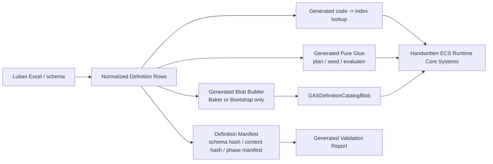

# Definition CodeGen 目标链路 Spec

## 目的

定义 EX-GAS 2.0 中 Definition & Generation Layer 的目标态链路：Luban 提供配置事实，SourceGenerator / CodeGen 生成不可变 definition、Blob、lookup、纯胶水和 validation artifact，Runtime Core 只消费 ECS/DOTS 友好的不可变输入。

本文件只描述目标态设计，不记录当前实现状态、迁移进度、已生成文件或缺陷清单。当前链路事实写入 `../00-当前架构事实/Definition配置事实.md`、`../00-当前架构事实/CodeGen链路复审事实.md` 和 `../00-当前架构事实/SourceGenerator链路复审事实.md`。

## 非目标

1. 不记录当前 `.gen.cs` 文件清单。
2. 不作为任务计划或迁移进度表。
3. 不证明 Baker、Bootstrap、catalog 或 generated runtime 已落地。
4. 不讨论 Editor UI 操作流程。

## 目标态数据流

## 官方依据与设计论证

| 目标态选择 | 官方规则依据 | 为什么更优秀 | 为什么有必要 |
|---|---|---|---|
| 静态配置进入 `BlobAssetReference<GASDefinitionCatalogBlob>` | `BLOB-01`、`BLOB-02`、`CASE-07`、`CASE-24` | Blob immutable、unmanaged、Burst-friendly，Runtime job 可通过 `ref readonly` 连续访问 definition range | Runtime Core hot path 不能依赖 managed row、JSON、Dictionary 或 per-definition entity query，否则无法满足 `SYS-01` / `BUR-01` |
| Baker / Bootstrap 只安装 catalog，不拥有 gameplay lifecycle | `BAKE-01`~`BAKE-03`、`CASE-39`、`CASE-40`、`SYS-01` | Authoring / 初始化职责与每帧 simulation owner 分离，避免配置链路反向控制 gameplay tick | Unity Baker 是 Editor/Baking 机制，官方要求 Baker 无状态、只产出 baked data；把 lifecycle 放进生成器会绕过 SystemGroup 和 API 选型 |
| generated lookup 只返回 index / range / Blob ref | `QRY-04`、`PRF-06`、`PRF-19`、`SEL-01` | Runtime lane 可按 owner-local、chunk-local 或 stream merge 组织访问，不被模板固定为 random lookup | 高频跨 entity lookup 是 scale 风险；lookup 若隐藏在 generated glue 内，任务无法提供拒绝理由和重选型触发条件 |
| generated glue 是纯函数或 unmanaged record builder | `QRY-01`、`JOB-01`、`BUR-01`、`SYS-03` | 手写 Runtime System 继续拥有 query、dependency、NativeContainer 和 profiler 归因；generated 只减少重复胶水 | SourceGenerator 若生成 System / OnUpdate，就会把调度、依赖和生命周期隐藏在模板里，破坏 Runtime Core 可审查性 |
| validation report 检查职责边界和 API 健康 | `ODF-06`、`ODF-18`、`20-GASRuntimeCore-API选型基线.md` | 报告能解释 artifact 是否适合进入 Runtime，而不只是“没有 forbidden dependency 字符串” | `RuntimeForbiddenDependencyHits = 0` 不能证明没有 generated lifecycle、hidden query、hidden ECB 或 random lookup |

## Artifact 责任边界

| Artifact | 允许职责 | 禁止职责 |
|---|---|---|
| Normalized Definition Row | 承载配置事实、schema/content hash 输入 | 进入 Runtime hot path |
| Definition Manifest | 输出 schema hash、content hash、phase manifest、orphan cleanup 规则 | 表达 gameplay schedule |
| Catalog Blob Builder | 在 Baker / Bootstrap 阶段构建不可变 Blob | 每帧创建 Blob、隐藏 Dispose owner |
| Generated Lookup | code -> index、index -> ref readonly definition、range lookup | Runtime random write、跨 entity state lookup |
| Generated Pure Glue | ability activation plan、GE command seed、requirement evaluator、magnitude static switch、target rule pure evaluator | `ISystem`、`OnUpdate`、system registration、ECB owner、EntityManager write、NativeContainer owner |
| Validation Gate | 扫描职责越界、API 选型、依赖边界、hash、orphan artifact | 把当前实现状态写成完成证明 |

## Runtime 消费契约

1. Runtime Core System 通过只读 `GASDefinitionCatalogComponent` 获取 `BlobAssetReference<GASDefinitionCatalogBlob>`。
2. Ability grant 可缓存 `AbilityDefinitionIndex`；Ability activation 不扫描 per-definition entity。
3. Effect Fan-In 使用 generated `GECommandSeedRecord` / definition index，而不是 managed `GameplayEffectConfig`。
4. Magnitude / requirement / target rule 的 generated evaluator 必须是 Burst 可用的 static switch、function id 或 batch FunctionPointer 候选。
5. 所有 frame-local record 的 NativeContainer owner 属于手写 Runtime System；generated code 只能填充 record。

## 禁止方向

1. SourceGenerator 生成 Runtime Core lifecycle system。
2. SourceGenerator 注册 system 或控制 SystemGroup update order。
3. generated glue 内部调用 `EntityManager`、ECB playback、`ComponentLookup` / `BufferLookup` 写入或创建 NativeContainer owner。
4. Runtime Core hot path 读取 Luban row、JSON、managed registry、`Dictionary` 或 `ScriptableObject`。
5. 用 per-definition entity / prefab 表达 Ability / GE / Attribute / Tag 静态定义。
6. 用 validation report 的单一字符串命中数替代 API 选型表。

## 验收

1. 每个 generated runtime-visible artifact 都能归类为 definition、Blob、lookup、pure glue、validation、Baker glue 或 Bootstrap glue。
2. Runtime-visible generated 文件中 lifecycle/system/ownership 越界命中为 0：`ISystem`、`OnUpdate`、system registration、hidden ECB、hidden `EntityManager` write、NativeContainer owner。
3. 每个 Runtime Core 消费点都有 API 选型表，说明采用 Blob / lookup / record / NativeStream / owner-local buffer 的理由和拒绝项。
4. Validation evidence 包含 schema hash、content hash、orphan artifact、generated boundary gate、Burst/API health。
5. 目标态文档不得引用当前 `.gen.cs` 文件作为完成证明；实现事实只能进入 `00-当前架构事实/`。
