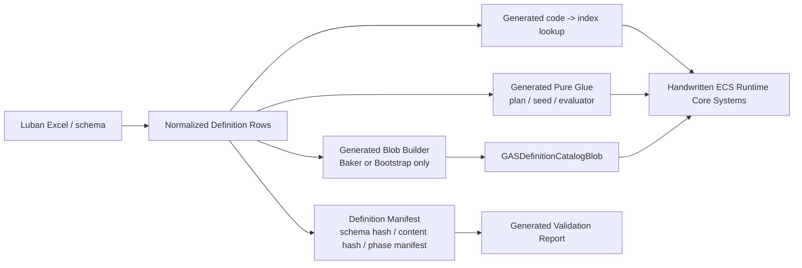

# Definition CodeGen 目标链路 Spec

## 目的

定义 EX-GAS 2.0 中 Definition & Generation Layer 的目标态链路：Luban 提供配置输入，SourceGenerator / CodeGen 生成不可变 definition、Blob、lookup、纯胶水和 validation artifact，Runtime Core 只消费 ECS/DOTS 友好的不可变输入。

本文件只描述目标态设计，不记录实现状态、迁移进度、已生成文件或缺陷清单。实现链路事实写入 `../00-当前架构事实/Definition配置事实.md`、`../00-当前架构事实/CodeGen链路复审事实.md` 和 `../00-当前架构事实/SourceGenerator链路复审事实.md`。

## 相邻 Spec Owner 裁决

`14` 是 Definition CodeGen target chain 和 artifact 责任边界 owner。它定义哪些 generated artifact 可以进入 Runtime-visible 层、每类 artifact 负责什么、Runtime Core 如何按 Definition catalog / lookup / pure glue 消费。它不维护 Luban 端到端生成流程、SourceGenerator 权限门禁第二正文，也不展开 Runtime lane 调用 glue 的完整代码。

| 主题 | 唯一正文 owner | 本文件只维护 |
|---|---|---|
| Excel / Luban / SourceGenerator / Baker / Bootstrap 端到端流程 | [08 Luban / SourceGenerator 配置生成链路](08-Luban-SourceGenerator配置生成链路Spec.md) | Definition CodeGen 在该流程中的 artifact 责任 |
| Definition manifest、Blob、lookup、pure glue、validation artifact 的目标链路 | 本文件 | artifact 责任边界、Runtime 消费契约和验收 |
| SourceGenerator 权限边界、lifecycle relocation、validation gate 字段 | [15 SourceGenerator 职责边界](15-SourceGenerator职责边界Spec.md) | 引用边界，避免把权限门禁扩成第二正文 |
| Runtime Core lane 调用 generated glue 的具体 plan / seed / modifier record 代码 | [03B-03 Generated Runtime Glue 消费接口](03-RuntimeCore管线/03B-业务调用链与配置消费/03B-03-GeneratedRuntimeGlue消费接口Spec.md) | 只定义消费契约，不维护完整调用代码 |

## 非目标

1. 不记录现实 `.gen.cs` 文件清单。
2. 不作为任务计划或迁移进度表。
3. 不作为 Baker、Bootstrap、catalog 或 generated runtime 完成状态证明。
4. 不讨论 Editor UI 操作流程。

## 目标态数据流



## 官方依据与设计论证

| 目标态选择 | 官方规则依据 | 为什么更优秀 | 为什么有必要 |
|---|---|---|---|
| 静态配置进入 `BlobAssetReference<GASDefinitionCatalogBlob>` | `BLOB-01`、`BLOB-02`、`CASE-07`、`CASE-24` | Blob immutable、unmanaged、Burst-friendly，Runtime job 可通过 `ref readonly` 连续访问 definition range | Runtime Core hot path 不能依赖 managed row、JSON、Dictionary 或 per-definition entity query，否则无法满足 `SYS-01` / `BUR-01` |
| Baker / Bootstrap 只安装 catalog，不拥有 gameplay lifecycle | `BAKE-01`~`BAKE-03`、`CASE-39`、`CASE-40`、`SYS-01` | Authoring / 初始化职责与每帧 simulation owner 分离，避免配置链路反向控制 gameplay tick | Unity Baker 是 Editor/Baking 机制，官方要求 Baker 无状态、只产出 baked data；把 lifecycle 放进生成器会绕过 SystemGroup 和 API 选型 |
| generated lookup 只返回 index / range / Blob ref | `QRY-04`、`PRF-06`、`PRF-19`、`SEL-01` | Runtime lane 可按 owner-local、chunk-local 或 stream merge 组织访问，不被模板固定为 random lookup | 高频跨 entity lookup 是 scale 风险；lookup 若隐藏在 generated glue 内，任务无法提供拒绝理由和重选型触发条件 |
| generated glue 是纯函数或 unmanaged record builder | `QRY-01`、`JOB-01`、`BUR-01`、`SYS-03` | 手写 Runtime System 继续拥有 query、dependency、NativeContainer 和 profiler 归因；generated 只减少重复胶水 | SourceGenerator 若生成 System / OnUpdate，就会把调度、依赖和生命周期隐藏在模板里，破坏 Runtime Core 可审查性 |
| validation report 检查职责边界和 API 健康 | `ODF-06`、`ODF-18`、`20-GASRuntimeCore-API选型基线.md` | 报告能解释 artifact 是否适合进入 Runtime，而不只是“没有 forbidden dependency 字符串” | 单一 forbidden dependency 字符串扫描不能证明没有 generated lifecycle、hidden query、hidden ECB 或 random lookup |

## Artifact 责任边界

| Artifact | 允许职责 | 禁止职责 |
|---|---|---|
| Normalized Definition Row | 承载配置输入、schema/content hash 输入 | 进入 Runtime hot path |
| Definition Manifest | 输出 schema hash、content hash、phase manifest、orphan cleanup 规则 | 表达 gameplay schedule |
| Catalog Blob Builder | 在 Baker / Bootstrap 阶段构建不可变 Blob | 每帧创建 Blob、隐藏 Dispose owner |
| Generated Lookup | code -> index、index -> ref readonly definition、range lookup | Runtime random write、跨 entity state lookup |
| Generated Pure Glue | ability activation plan、GE command seed、requirement evaluator、magnitude static switch、target rule pure evaluator | `ISystem`、`OnUpdate`、system registration、ECB owner、EntityManager write、NativeContainer owner |
| Validation Gate | 扫描职责越界、API 选型、依赖边界、hash、orphan artifact | 把实现状态写成完成证明 |

## Generation Artifact Responsibility Matrix

目标态中，每个 generated artifact 必须先被分类，再决定能否进入 Runtime-visible assembly。分类不是为了美化报告，而是为了确定谁拥有 lifecycle、query、allocator、dispose、validation 和性能归因。

| Artifact kind | 第一 owner | Runtime visible | 允许 API / 数据 | 禁止 API / 数据 | 验收证据 |
|---|---|---|---|---|---|
| `DefinitionId` | Definition CodeGen | 是 | stable code、schema hash、content hash、unmanaged constants | managed row、字符串 tag lookup、runtime registry | schema/content hash、orphan report、duplicate id gate |
| `BlobSchema` | Definition CodeGen | 是 | unmanaged struct、`BlobArray` range、`ref readonly` access | runtime state、`Entity`、timer、managed string decision | Blob layout review、Burst compile target、range validation |
| `BlobBuilder` | Baker / Bootstrap | 有条件 | `BlobBuilder`、`AddBlobAsset`、initialization-only install | hot path 构建、per-event 分配、隐藏 dispose owner | materialization owner、dispose owner、Baking / Bootstrap phase |
| `DefinitionCatalog` | DefinitionCatalogLifetime | 是 | `BlobAssetReference<T>`、sorted code arrays、index/range lookup | mutable singleton config、per-definition entity hot query | revision、schema/content hash、install/dispose evidence |
| `StaticLookup` | Definition CodeGen | 是 | code -> index、binary search、perfect hash、small static switch | random write lookup、live ECS state access | O(1) / O(log n) 说明、deterministic order |
| `PureRuntimeGlue` | Definition CodeGen + Runtime Core caller | 是 | static pure function、unmanaged record、catalog ref、snapshot input | `ISystem`、`OnUpdate`、query、ECB、NativeContainer owner | caller lane owns query / writer / allocator；glue boundary gate 为 0 |
| `BakerGlue` | Baking | 否 | stateless `Baker<T>`、`DependsOn()`、`AddBlobAsset()`、BakingOnly / TemporaryBaking data | Baker instance cache、读其他 Baker output、runtime lifecycle | Baker rule scan、incremental baking dependency report |
| `ValidationArtifact` | Editor / CI | 否 | manifest、rule hit、API health、query/capacity hint、DOTS coverage | gameplay 决策输入、runtime mutable state | validation report、official rule coverage、failure mode |
| `RuntimeLifecycle` | Hand-written Runtime Core | 否，由生成器禁止 | 只能由手写 `ISystem` / Job 拥有 | SourceGenerator 输出 lifecycle、system registration、hidden query / ECB | generated lifecycle gate 为 0，Runtime lane API 选型表 |

`MigrationProofOnly` 不是目标态 artifact kind。它只能作为实现阶段的临时报告 disposition；release-ready 验收时不允许用 migration category、helper wrapper、generated assembly 或目录迁移替代 owner 接管。

## 目标代码骨架：Artifact Manifest Contract

目标态 manifest 要表达“这个 artifact 可以由谁消费、为什么能进入 Runtime、谁承担生命周期”。消费方不应从文件名推断职责。

```csharp
namespace GAS.Generation
{
    public enum GeneratedArtifactKind : byte
    {
        DefinitionId,
        BlobSchema,
        BlobBuilder,
        DefinitionCatalog,
        StaticLookup,
        PureRuntimeGlue,
        BakerGlue,
        ValidationArtifact,
    }

    public enum GeneratedArtifactOwner : byte
    {
        DefinitionCodeGen,
        Baking,
        Bootstrap,
        DefinitionCatalogLifetime,
        RuntimeCoreCaller,
        EditorCi,
    }

    public readonly struct GeneratedArtifactManifestEntry
    {
        public readonly GeneratedArtifactKind Kind;
        public readonly GeneratedArtifactOwner Owner;
        public readonly bool RuntimeVisible;
        public readonly bool MayAllocate;
        public readonly bool MayOwnLifecycle;
        public readonly bool MayOwnStructuralChange;
        public readonly bool MayOwnNativeContainer;

        public GeneratedArtifactManifestEntry(
            GeneratedArtifactKind kind,
            GeneratedArtifactOwner owner,
            bool runtimeVisible,
            bool mayAllocate,
            bool mayOwnLifecycle,
            bool mayOwnStructuralChange,
            bool mayOwnNativeContainer)
        {
            Kind = kind;
            Owner = owner;
            RuntimeVisible = runtimeVisible;
            MayAllocate = mayAllocate;
            MayOwnLifecycle = mayOwnLifecycle;
            MayOwnStructuralChange = mayOwnStructuralChange;
            MayOwnNativeContainer = mayOwnNativeContainer;
        }

        public bool IsRuntimePureGlue =>
            RuntimeVisible
            && Kind == GeneratedArtifactKind.PureRuntimeGlue
            && !MayAllocate
            && !MayOwnLifecycle
            && !MayOwnStructuralChange
            && !MayOwnNativeContainer;
    }
}
```

这段骨架的设计约束：

1. Runtime-visible 不等于 Runtime lifecycle；是否拥有 lifecycle、结构变化和 NativeContainer 必须显式声明。
2. Pure glue 必须同时满足 runtime-visible、无 allocator owner、无 lifecycle owner、无 structural owner、无 NativeContainer owner。
3. Blob builder 可以分配，但 owner 只能是 Baking / Bootstrap / DefinitionCatalogLifetime，不能由 Core tick 调用。
4. Validation artifact 可以描述失败原因，但不能参与 gameplay 决策。
5. 如果某类 artifact 无法填出 owner 和禁止项，它不能进入 Runtime-visible 层。

## Runtime 消费契约

1. Runtime Core System 通过只读 `GASDefinitionCatalogComponent` 获取 `BlobAssetReference<GASDefinitionCatalogBlob>`。
2. Ability grant 可缓存 `AbilityDefinitionIndex`；Ability activation 不扫描 per-definition entity。
3. Effect Fan-In 使用 generated `GECommandSeedRecord` / definition index，而不是 managed `GameplayEffectConfig`。
4. Magnitude / requirement / target rule 的 generated evaluator 必须是 Burst 可用的 static switch、function id 或 batch FunctionPointer 候选。
5. 所有 frame-local record 的 NativeContainer owner 属于手写 Runtime System；generated code 只能填充 record。
6. GE command seed 的 lane 分类必须按业务语义判定：duration、period、stack、granted tags、remove query、granted ability 等跨帧/状态语义进入 `ActiveMutation`；execution-only / cue-only / instant delta GE 进入 instant spec 链。`ModifierCount == 0` 不能推断 `ActiveMutation`。

## 禁止方向

1. SourceGenerator 生成 Runtime Core lifecycle system。
2. SourceGenerator 注册 system 或控制 SystemGroup update order。
3. generated glue 内部调用 `EntityManager`、ECB playback、`ComponentLookup` / `BufferLookup` 写入或创建 NativeContainer owner。
4. Runtime Core hot path 读取 Luban row、JSON、managed registry、`Dictionary` 或 `ScriptableObject`。
5. 用 per-definition entity / prefab 表达 Ability / GE / Attribute / Tag 静态定义。
6. 用 validation report 的单一字符串命中数替代 API 选型表。
7. 用 `ModifierCount`、`HasModifier` 或空 modifier 列作为 GE lifecycle lane owner 的隐式分类规则。

## 验收

1. 每个 generated runtime-visible artifact 都能归类为 definition、Blob、lookup、pure glue、validation、Baker glue 或 Bootstrap glue。
2. Runtime-visible generated 文件中 lifecycle/system/ownership 越界命中为 0：`ISystem`、`OnUpdate`、system registration、hidden ECB、hidden `EntityManager` write、NativeContainer owner。
3. 每个 Runtime Core 消费点都有 API 选型表，说明采用 Blob / lookup / record / NativeStream / owner-local buffer 的理由和拒绝项。
4. Validation evidence 包含 schema hash、content hash、orphan artifact、generated boundary gate、Burst/API health。
5. 目标态文档不得引用现实 `.gen.cs` 文件作为完成证明；实现事实只能进入 `00-当前架构事实/`。
