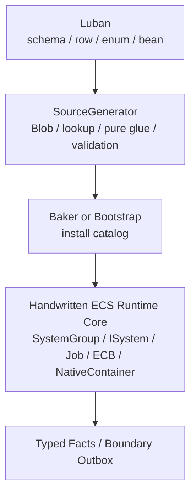

# SourceGenerator 职责边界 Spec

## 目的

定义 Luban + SourceGenerator 在目标态 EX-GAS 2.0 中的权限边界。核心结论：SourceGenerator 负责把配置输入压缩成 Runtime Core 可消费的不可变数据和纯胶水；Runtime Core 的生命周期、调度、查询、NativeContainer、结构变化和性能归因必须由手写 ECS System 拥有。

本文件是目标态 Spec，不记录实现生成文件、gate 结果或任务状态。实现链路事实写入 `../00-当前架构事实/SourceGenerator链路复审事实.md`。

## 分层边界



## 官方依据与设计论证

| 边界选择 | 官方规则依据 | 为什么更优秀 | 为什么有必要 |
|---|---|---|---|
| SourceGenerator 不生成 `ISystem` / `OnUpdate` | `SYS-01`、`SYS-02`、`SYS-03`、`PRF-07` | Runtime lifecycle owner 保持显式，System 数量、TypeHandle、Lookup、Dependency 成本可由架构统一预算 | generated system 会把调度决策分散到模板，业务实现无法判断是 gameplay 需要还是模板惯性 |
| SourceGenerator 不拥有 query / lookup refresh | `QRY-01`、`QRY-02`、`QRY-04`、`PRF-33` | 每个 `ISystem` 在 `OnCreate` / `OnUpdate` 拥有自己的 query contract 和 handle refresh，Debugger 可归因 | 中央生成 query 或 hidden lookup 会绕开 query contract，并可能把 random access 固化进 hot path |
| SourceGenerator 不拥有 ECB / 结构变化 | `SC-01`、`SC-03`、`ECB-01`、`ECB-03`、`PRF-04` | 所有结构变化进入 `GASStructuralCommitSystemGroup`，Profiler/Journaling 能定位来源和 playback phase | generated ECB owner 会让 structural change 的相位、sortKey 和 sync point 不可审查 |
| SourceGenerator 不拥有 NativeContainer 生命周期 | `NAT-01`、`NAT-03`、`NAT-05`、`PRF-14`、`PRF-34` | allocator owner、dispose/rewind、merge 顺序由 Runtime System 明确记录，validation 可检查泄漏和预算 | generated Persistent/TempJob container owner 隐藏后，job dependency 和 dispose 责任无法被 ECS 安全系统完整追踪 |
| SourceGenerator 可生成 pure evaluator / static switch | `BUR-01`、`BUR-02`、`CASE-11` | 重复公式与配置分支由生成代码消除托管分发，仍由 Runtime job 批处理调用 | GAS 的 requirement、magnitude、target rule 需要大量胶水；手写会重复，managed delegate 会破坏 Burst |
| SourceGenerator 可生成 Baker / Bootstrap glue | `BAKE-01`~`BAKE-03`、`CASE-39`、`CASE-40`、`BLOB-02` | 配置 materialization 集中在初始化/烘焙期，Runtime 只看不可变 catalog | Blob 内部指针和 Baker 无状态规则要求构建期与运行期职责分离 |

## 允许生成

| 类别 | 示例 | 要求 |
|---|---|---|
| Definition Blob 类型 / builder | `GASDefinitionCatalogBlob` builder | 只在 Baker / Bootstrap 使用；Blob owner 和 Dispose 规则明确 |
| code -> index lookup | AbilityCode / GameplayEffectCode / AttributeCode lookup | 只读、确定性、无 runtime state |
| Pure Runtime Glue | `BuildAbilityActivationPlan`、`BuildGECommandSeed`、`EvaluateRequirement`、`EvaluateMagnitude` | static / Burst-compatible / unmanaged record 输入输出 |
| Validation Gate | boundary hits、schema hash、orphan artifacts、API health | 检查职责越界，不宣称实现完成 |
| Baker / Bootstrap glue | authoring rows -> Blob install | Baker 无状态，只添加/声明依赖；Bootstrap 只做初始化 |

## 禁止生成

| 禁止项 | 原因 |
|---|---|
| Runtime Core lifecycle `ISystem` / `SystemBase` | 生命周期 owner、query、dependency、Profiler 归因应在手写 Runtime Core |
| system registration / `world.CreateSystem()` / `AddSystemToUpdateList()` | SystemGroup 是物理 phase owner，不能由生成模板隐式扩展 |
| `OnUpdate(ref SystemState)` runtime 执行逻辑 | 会隐藏 query、dependency、sync point、job schedule 策略 |
| `state.EntityManager` / `EntityManager` 写入 | 结构变化和组件写入必须进入明确 phase 和 owner system |
| ECB 创建、playback 或隐藏 append | ECB 是 structural mutation 工具，不是 generated gameplay event bus |
| `ComponentLookup` / `BufferLookup` hot path 写入 | 高频 random lookup 需要任务级 API 选型和重选型触发条件 |
| NativeContainer owner | allocator、dispose/rewind、dependency chain 应由 Runtime System 管理 |
| 读取 Luban row / JSON / managed registry 的 Runtime path | 破坏 Burst/job 和配置不可变边界 |

## Runtime Registration Owner Contract

目标态中，Runtime Core schedule registry 是手写 ECS 架构 contract，而不是 SourceGenerator 输出。任何 generated glue 进入 Runtime tick 前，必须先由手写 Runtime Core 明确声明：

1. 所属物理 `SystemGroup` 和 lane。
2. 读写 component / buffer / blob / NativeContainer 集合。
3. query ownership、dependency policy、allocator owner 和 structural mutation permission。
4. frame budget、Debugger counter 和 validation gate。
5. 缺失 generated artifact、类型不匹配或 assembly 不可用时的 fail-fast 规则。

SourceGenerator 可以输出供 registry 校验的静态 metadata，但不能生成自注册 helper，不能把 generated artifact 静默挂入 update list，也不能把“类型存在”当成架构验收。系统数量、执行相位和 update order 属于 Runtime Core 预算；generated code 只能被手写 owner 调用或验证。

## Generated Glue 调用形态

目标调用形态必须是“Runtime System 拥有数据流，generated glue 只填 record”：

```csharp
// 手写 Runtime System / Job 拥有 query、BlobRef、writer 和 allocator。
var plan = GASGeneratedAbilityPlanBuilder.Build(
    ref abilityDefinition,
    sourceAsc,
    abilityEntity,
    frameIndex,
    sequence);

commandWriter.Write(new AbilityActivationCommandRecord
{
    SourceAsc = sourceAsc,
    AbilityDefinitionIndex = plan.AbilityDefinitionIndex,
    PrimaryGameplayEffectIndex = plan.PrimaryGameplayEffectIndex,
    ContextId = plan.ContextId,
    Sequence = plan.Sequence
});
```

这段形态的关键不是具体类型名，而是职责方向：generated code 不查 entity、不建 query、不写 ECB、不拥有 writer 生命周期，只做纯解析。

## Validation Gate

Runtime-visible generated artifact 必须通过下列门禁：

| Gate | 目标值 | 说明 |
|---|---:|---|
| `GeneratedRuntimeLifecycleHits` | 0 | `ISystem`、`SystemBase`、`OnUpdate`、runtime lifecycle owner |
| `GeneratedRuntimeSystemRegistrationHits` | 0 | `CreateSystem`、`AddSystemToUpdateList`、registration helper |
| `GeneratedRuntimeStructuralChangeHits` | 0 | `EntityManager.Create/Destroy/Add/Remove`、ECB playback |
| `GeneratedRuntimeOwnershipHits` | 0 | NativeContainer owner、Persistent allocation、hidden dispose |
| `GeneratedRuntimeRandomWriteLookupHits` | 0 | `ComponentLookup` / `BufferLookup` write in generated hot path |
| `GeneratedRuntimeManagedConfigHits` | 0 | `cfg.*`、JSON、managed registry、`Dictionary` hot path |

## 验收

1. SourceGenerator 输出清单只包含允许类别。
2. 任何需要 gameplay lifecycle 的新增功能先在 `03-RuntimeCore管线Spec.md` / `04` / `05` 中定义 lane owner，再由手写 ECS System 实现。
3. 生成代码可被 Burst job 调用，不要求 Runtime job 反向依赖 managed object。
4. 失败报告能说明“为什么越界”，而不是只输出裸命中数。
5. 目标态文档只描述这些边界；现实命中、迁移状态和文件清单只进入 `00-当前架构事实/`。
