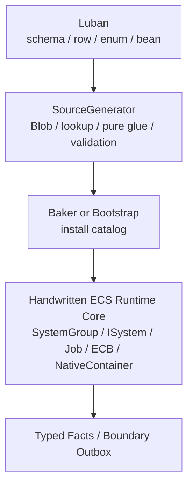

# SourceGenerator 职责边界 Spec

## 目的

定义 Luban + SourceGenerator 在目标态 EX-GAS 2.0 中的权限边界。核心结论：SourceGenerator 负责把配置输入压缩成 Runtime Core 可消费的不可变数据和纯胶水；Runtime Core 的生命周期、调度、查询、NativeContainer、结构变化和性能归因必须由手写 ECS System 拥有。

本文件是目标态 Spec，不记录实现生成文件、gate 结果或任务状态。实现链路事实写入 `../00-当前架构事实/SourceGenerator链路复审事实.md`。

## 相邻 Spec Owner 裁决

`15` 是 SourceGenerator 权限边界 owner。它只回答“SourceGenerator 可以生成什么、禁止生成什么、generated lifecycle relocation 如何判定、validation gate 必须检查什么”。它不维护 Luban 端到端流程、Definition artifact target chain 或 Runtime lane 调用接口第二正文。

| 主题 | 唯一正文 owner | 本文件只维护 |
|---|---|---|
| Excel / Luban / SourceGenerator / Baker / Bootstrap 端到端生成链路 | [08 Luban / SourceGenerator 配置生成链路](08-Luban-SourceGenerator配置生成链路Spec.md) | SourceGenerator 在链路中的权限边界 |
| Definition artifact 责任、Blob / lookup / pure glue target chain | [14 Definition CodeGen 目标链路](14-DefinitionCodeGen目标链路Spec.md) | 判定这些 artifact 是否越权 |
| Runtime Core 对 generated glue 的纯消费接口 | [03B-03 Generated Runtime Glue 消费接口](03-RuntimeCore管线/03B-业务调用链与配置消费/03B-03-GeneratedRuntimeGlue消费接口Spec.md) | 要求调用方是手写 Runtime Core lane，不展开 plan / seed / evaluator 代码 |
| SourceGenerator 允许 / 禁止、lifecycle relocation、validation gate | 本文件 | 权限门禁和验收边界 |

## 分层边界



## 官方依据与设计论证

| 边界选择 | 官方规则依据 | 为什么更优秀 | 为什么有必要 |
|---|---|---|---|
| SourceGenerator 不生成 `ISystem` / `OnUpdate` | `SYS-01`、`SYS-02`、`SYS-03`、`PRF-07` | Runtime lifecycle owner 保持显式，System 数量、TypeHandle、Lookup、Dependency 成本可由架构统一预算 | generated system 会把调度决策分散到模板，业务实现无法判断是 gameplay 需要还是模板惯性 |
| SourceGenerator 不拥有 query / lookup refresh | `QRY-01`、`QRY-02`、`QRY-04`、`PRF-33` | 每个 `ISystem` 在 `OnCreate` / `OnUpdate` 拥有自己的 query contract 和 handle refresh，Debugger 可归因 | 中央生成 query 或 hidden lookup 会绕开 query contract，并可能把 random access 固化进 hot path |
| SourceGenerator 不拥有 ECB / 结构变化 | `SC-01`、`SC-03`、`ECB-01`、`ECB-03`、`PRF-04` | 所有结构变化进入 `GASStructuralCommitSystemGroup`，Profiler/Journaling 能定位来源和 playback phase | generated ECB owner 会让 structural change 的相位、sortKey 和 sync point 不可审查 |
| SourceGenerator 不拥有 NativeContainer 生命周期 | `NAT-01`、`NAT-03`、`NAT-05`、`PRF-14`、`PRF-34` | allocator owner、dispose/rewind、merge 顺序由 Runtime System 明确记录，validation 可检查泄漏和预算 | generated Persistent/TempJob container owner 隐藏后，job dependency 和 dispose 责任无法被 ECS 安全系统完整追踪 |
| SourceGenerator 可生成 pure evaluator / static switch | `BUR-01`、`BUR-02`、`CASE-11` | 重复公式与配置分支由生成代码消除托管分发，仍由 Runtime job 批处理调用 | GAS 的 requirement、magnitude、target rule 需要大量胶水；手写会重复，managed delegate 会破坏 Burst |
| SourceGenerator 可生成 Baker / Bootstrap glue | `BAKE-01`~`BAKE-03`、`CASE-39`、`CASE-40`、`BLOB-02` | 配置 materialization 集中在初始化/烘焙期，Runtime 只看不可变 catalog | Blob 内部指针和 Baker 无状态规则要求构建期与运行期职责分离 |

## 允许生成

| 类别 | 示例 | 要求 |
|---|---|---|
| Definition Blob 类型 / builder | `GASDefinitionCatalogBlob` builder | 只在 Baker / Bootstrap 使用；Blob owner 和 Dispose 规则明确 |
| code -> index lookup | AbilityCode / GameplayEffectCode / AttributeCode lookup | 只读、确定性、无 runtime state |
| Pure Runtime Glue | `BuildAbilityActivationPlan`、`BuildGECommandSeed`、`EvaluateRequirement`、`EvaluateMagnitude` | static / Burst-compatible / unmanaged record 输入输出 |
| Validation Gate | boundary hits、schema hash、orphan artifacts、API health | 检查职责越界，不宣称实现完成 |
| Baker / Bootstrap glue | authoring rows -> Blob install | Baker 无状态，只添加/声明依赖；Bootstrap 只做初始化 |

## 禁止生成

| 禁止项 | 原因 |
|---|---|
| Runtime Core lifecycle `ISystem` / `SystemBase` | 生命周期 owner、query、dependency、Profiler 归因应在手写 Runtime Core |
| system registration / `world.CreateSystem()` / `AddSystemToUpdateList()` | SystemGroup 是物理 phase owner，不能由生成模板隐式扩展 |
| `OnUpdate(ref SystemState)` runtime 执行逻辑 | 会隐藏 query、dependency、sync point、job schedule 策略 |
| `state.EntityManager` / `EntityManager` 写入 | 结构变化和组件写入必须进入明确 phase 和 owner system |
| ECB 创建、playback 或隐藏 append | ECB 是 structural mutation 工具，不是 generated gameplay event bus |
| `ComponentLookup` / `BufferLookup` hot path 写入 | 高频 random lookup 需要任务级 API 选型和重选型触发条件 |
| NativeContainer owner | allocator、dispose/rewind、dependency chain 应由 Runtime System 管理 |
| 读取 Luban row / JSON / managed registry 的 Runtime path | 破坏 Burst/job 和配置不可变边界 |

## Runtime Registration Owner Contract

目标态中，Runtime Core schedule registry 是手写 ECS 架构 contract，而不是 SourceGenerator 输出。任何 generated glue 进入 Runtime tick 前，必须先由手写 Runtime Core 明确声明：

1. 所属物理 `SystemGroup` 和 lane。
2. 读写 component / buffer / blob / NativeContainer 集合。
3. query ownership、dependency policy、allocator owner 和 structural mutation permission。
4. frame budget、Debugger counter 和 validation gate。
5. 缺失 generated artifact、类型不匹配或 assembly 不可用时的 fail-fast 规则。

SourceGenerator 可以输出供 registry 校验的静态 metadata，但不能生成自注册 helper，不能把 generated artifact 静默挂入 update list，也不能把“类型存在”当成架构验收。系统数量、执行相位和 update order 属于 Runtime Core 预算；generated code 只能被手写 owner 调用或验证。

## Lifecycle Relocation 不变量

目标态禁止把 generated lifecycle owner 通过“拆到另一个 generated 文件、generated assembly、migration category 或 helper wrapper”伪装成职责收权。判定 owner 的依据是数据流职责，而不是文件名或目录：

1. 只要 generated runtime-visible artifact 拥有 `ISystem` / `OnUpdate`、query / lookup refresh、ECB、NativeContainer allocator、structural mutation 或 gameplay lifecycle 调度，它仍是 generated lifecycle owner。
2. 这类 artifact 即使被 validation report 分类为 migration、proof、owner wrapper 或 generated owner lane，也只能作为 `MigrationProofOnly`；release-ready mode 必须归零，或由手写 Runtime Core lane 明确接管。
3. 合格的 SourceGenerator pure glue 只能被手写 System / Job 调用，并且输入来自 immutable catalog、owner-local data、frame-local record 或明确的 snapshot record；它不解析 live ECS identity，不持有 writer 生命周期，不创建结构变化。
4. 验收时必须同时检查 generated helper 文件和任何 generated lifecycle owner 文件；不能只扫描 pure glue 文件或只看 artifact 分类。

## Pure Glue 与手写 Core Helper 的职责不变量

目标态允许手写 Runtime Core lane 拥有 query、writer、allocator、dependency 和 evidence，也允许它通过小型 helper 组织 lane-local record；但配置语义的唯一来源必须保持清晰，不能让 generated pure glue 和手写 helper 双重解释同一份 definition。

1. SourceGenerator 生成的 pure glue 负责把 immutable definition、lookup index、requirement range、magnitude rule 和 target rule 折叠成 unmanaged record / evaluator。
2. 手写 Runtime Core helper 可以负责 lane-local 输入规整、frame sequence、owner-local writer 调用、failure fact 投影和 evidence counter，但不得重新解释 Luban row 字段或复制 generated evaluator 的业务分支。
3. 如果手写 helper 必须替代某个 generated pure glue，目标态要求 manifest / validation 明确标记该 glue 已退役或只保留 compatibility marker；不能同时保留两套 active semantic owner。
4. hand-written owner 通过 deletion test 验收：删除 generated pure glue 时，配置语义不得散落到多个 lane；删除 hand-written helper 时，query / writer / allocator / evidence 责任不得回流到 generated artifact。

## Compatibility Marker Contract

目标态允许保留轻量 compatibility marker，但 marker 只能证明生成链路、manifest、校验报告和兼容引用仍能对账，不能被当作 gameplay 语义 owner。

1. Marker 不包含 lifecycle、query、lookup refresh、ECB、NativeContainer、writer lifecycle、managed config 读取或 live ECS identity 解析。
2. Marker 不参与 Runtime Core tick，不被任何 job 当作语义输入；它只服务于兼容编译、artifact 对账和迁移期防回流扫描。
3. 如果某条 gameplay 语义已由 hand-written Runtime Core owner 接管，marker 必须在 manifest / validation 中表达为 compatibility / pure-glue-adjacent 证据，而不是第二套 active resolver。
4. Release-ready gate 中，所有 `MigrationProofOnly` 都必须迁出、归零或转为 blocking；compatibility marker 不能替代 owner 迁移证明。
5. 删除 marker 时最多影响兼容入口或验证索引，不应改变 gameplay 结果；如果删除 marker 会改变 Runtime 行为，说明它不是 marker，而是伪装的 generated owner。

## Generated Glue 调用形态

目标调用形态必须是“Runtime System 拥有数据流，generated glue 只填 record”：

```csharp
// 手写 Runtime System / Job 拥有 query、BlobRef、writer 和 allocator。
var plan = GASGeneratedAbilityPlanBuilder.Build(
    ref abilityDefinition,
    sourceAsc,
    abilityEntity,
    frameIndex,
    sequence);

commandWriter.Write(new AbilityActivationCommandRecord
{
    SourceAsc = sourceAsc,
    AbilityDefinitionIndex = plan.AbilityDefinitionIndex,
    PrimaryGameplayEffectIndex = plan.PrimaryGameplayEffectIndex,
    ContextId = plan.ContextId,
    Sequence = plan.Sequence
});
```

这段形态的关键不是具体类型名，而是职责方向：generated code 不查 entity、不建 query、不写 ECB、不拥有 writer 生命周期，只做纯解析。

## TagRequirement / Query Evaluator 边界

TagRequirement 是 SourceGenerator 与 Runtime Core 配合最典型的胶水场景。目标态允许 SourceGenerator 生成不可变 tag query 数据和 pure evaluator，但不允许生成任何读取 live ECS state 的 lifecycle owner。

允许生成：

1. tag taxonomy 展开的 immutable query mask，例如 all / any / none 三段 mask。
2. Ability / GameplayEffect / removal / immunity requirement 在 catalog 中的 range、kind、failure code 和 validation metadata。
3. Burst-friendly pure evaluator，输入只能是 immutable catalog definition、requirement range 和调用方传入的 owner-local tag snapshot / frame-local tag record。
4. Editor / CI validation graph，用于证明 requirement 引用存在、taxonomy 展开一致、空 query 语义明确。

禁止生成：

1. 为了评估 requirement 而创建 `ISystem`、`OnUpdate`、query、ECB 或 NativeContainer owner。
2. 在 generated lifecycle 内通过 `ComponentLookup` / `BufferLookup` 临时读取 source / target tag。
3. 将 tag requirement evaluation 与 ability commit、instant GE spec build、active effect tick / removal lifecycle 绑定在同一个 generated system 中。
4. 通过 managed tag tree、字符串 tag、JSON row、`Dictionary` 或 runtime registry 参与 hot path 判断。

目标调用形态是：handwritten Runtime Core lane 先取得 owner-local tag snapshot 或 target-grouped tag record，再把 snapshot 传入 generated evaluator。SourceGenerator 的性能价值来自“配置分支被编译成纯函数”，不是替 Runtime Core 持有 query / lookup / lifecycle。

## Validation Gate

Runtime-visible generated artifact 必须通过下列门禁：

| Gate | 目标值 | 说明 |
|---|---:|---|
| `GeneratedRuntimeLifecycleHits` | 0 | `ISystem`、`SystemBase`、`OnUpdate`、runtime lifecycle owner |
| `GeneratedRuntimeSystemRegistrationHits` | 0 | `CreateSystem`、`AddSystemToUpdateList`、registration helper |
| `GeneratedRuntimeStructuralChangeHits` | 0 | `EntityManager.Create/Destroy/Add/Remove`、ECB playback |
| `GeneratedRuntimeOwnershipHits` | 0 | NativeContainer owner、Persistent allocation、hidden dispose |
| `GeneratedRuntimeRandomWriteLookupHits` | 0 | `ComponentLookup` / `BufferLookup` write in generated hot path |
| `GeneratedRuntimeManagedConfigHits` | 0 | `cfg.*`、JSON、managed registry、`Dictionary` hot path |

## Gate Disposition Policy

目标态 gate 需要同时回答三件事：命中是什么、谁允许它存在、什么时候必须失败。单纯输出命中数不足以作为框架 Spec。

| Disposition | 目标态语义 | Runtime-visible 是否允许 | 退出条件 |
|---|---|---|---|
| `Pass` | 未发现越界命中，artifact 符合允许生成类别 | 允许 | 保持 validation gate 覆盖 |
| `Blocking` | 命中生成器禁止项，例如 lifecycle、registration、managed config、hidden structural owner | 不允许 | 生成失败或 CI fail-fast |
| `BootstrapOwner` | artifact 只在 Baking / Bootstrap / initialization materialization 中拥有分配或 install/dispose | 有条件允许 | 必须绑定 materialization owner、dispose owner、hot path 禁用证据 |
| `HandwrittenCoreOwner` | 命中来自手写 Runtime Core owner，而 generated artifact 只是纯函数 / schema / metadata | 允许 | 交还 API 选型表、query / allocator / dependency / evidence owner |
| `MigrationProofOnly` | 临时迁移证明，表示当前实现还没有目标态 owner | 不属于目标态允许类别 | release-ready gate 必须归零、迁到 hand-written owner，或转为 `Blocking` |

生成器的 release-ready 规则：

1. `MigrationProofOnly` 不能被计入完成度，不能作为目标态 artifact kind。
2. system registration、managed config runtime dependency、runtime lifecycle owner 默认 `Blocking`，不能通过 category 豁免。
3. catalog / Blob materialization 只有在明确属于 Baking / Bootstrap / initialization owner 时才允许；Core tick 不能调用 builder。
4. pure glue 的调用方必须是手写 Runtime Core lane；如果 pure glue 只能被 generated lifecycle 调用，该链路仍未完成收权。
5. gate 报告必须能从 artifact kind 追溯到 owner、允许 API、禁止 API、验证方式和退出条件。

## 目标代码骨架：Runtime Core 调用 Pure Glue

目标态不是让生成器“生成更多 System”，而是让手写 Runtime Core lane 拥有数据流，再调用 generated pure glue。

```csharp
using Unity.Burst;
using Unity.Collections;
using Unity.Entities;

namespace GAS.Runtime
{
    public struct AbilityActivationInputRecord
    {
        public Entity SourceAsc;
        public Entity AbilityEntity;
        public int AbilityDefinitionIndex;
        public int Frame;
        public int Sequence;
        public TagMaskComponent SourceTags;
        public AttributeSnapshotRecord SourceAttributes;
    }

    public struct AbilityActivationOutputRecord
    {
        public Entity SourceAsc;
        public Entity AbilityEntity;
        public int PrimaryGameplayEffectDefinitionIndex;
        public int CostGameplayEffectDefinitionIndex;
        public int CooldownGameplayEffectDefinitionIndex;
        public int FailureReasonCode;
        public byte Succeeded;
    }

    [BurstCompile]
    public struct AbilityActivationResolveJob : IJobChunk
    {
        [ReadOnly] public BlobAssetReference<GASDefinitionCatalogBlob> Catalog;
        [ReadOnly] public NativeArray<AbilityActivationInputRecord> Inputs;
        public NativeStream.Writer OutputWriter;

        public void Execute(
            in ArchetypeChunk chunk,
            int unfilteredChunkIndex,
            bool useEnabledMask,
            in Unity.Burst.Intrinsics.v128 chunkEnabledMask)
        {
            OutputWriter.BeginForEachIndex(unfilteredChunkIndex);

            for (var i = 0; i < Inputs.Length; i++)
            {
                var input = Inputs[i];
                if (!GASGeneratedRuntimeDefinitionResolver.TryBuildAbilityActivationPlan(
                        Catalog,
                        in input,
                        out var plan))
                {
                    OutputWriter.Write(new AbilityActivationOutputRecord
                    {
                        SourceAsc = input.SourceAsc,
                        AbilityEntity = input.AbilityEntity,
                        FailureReasonCode = plan.FailureReasonCode,
                        Succeeded = 0,
                    });
                    continue;
                }

                OutputWriter.Write(new AbilityActivationOutputRecord
                {
                    SourceAsc = input.SourceAsc,
                    AbilityEntity = input.AbilityEntity,
                    PrimaryGameplayEffectDefinitionIndex = plan.PrimaryGameplayEffectDefinitionIndex,
                    CostGameplayEffectDefinitionIndex = plan.CostGameplayEffectDefinitionIndex,
                    CooldownGameplayEffectDefinitionIndex = plan.CooldownGameplayEffectDefinitionIndex,
                    FailureReasonCode = 0,
                    Succeeded = 1,
                });
            }

            OutputWriter.EndForEachIndex();
        }
    }
}
```

这段骨架的关键点：

1. Query、chunk iteration、`NativeStream.Writer` 生命周期、allocator 和 dependency 都属于手写 Runtime Core job / system。
2. Generated glue 只接收 immutable catalog 和 frame-local input record，返回 plan；它不解析 live ECS identity。
3. 失败 reason 是稳定 code，不是日志字符串。
4. 输出 record 进入后续 fan-in / spec / delta / fact lane，而不是由 generated glue 直接写 ECB 或 DynamicBuffer。
5. 这类代码才是 SourceGenerator 与纯 ECS Core 的正确协作方式。

## 验收

1. SourceGenerator 输出清单只包含允许类别。
2. 任何需要 gameplay lifecycle 的新增功能先在 `03-RuntimeCore管线Spec.md` / `04` / `05` 中定义 lane owner，再由手写 ECS System 实现。
3. 生成代码可被 Burst job 调用，不要求 Runtime job 反向依赖 managed object。
4. 失败报告能说明“为什么越界”，而不是只输出裸命中数。
5. 目标态文档只描述这些边界；现实命中、迁移状态和文件清单只进入 `00-当前架构事实/`。
