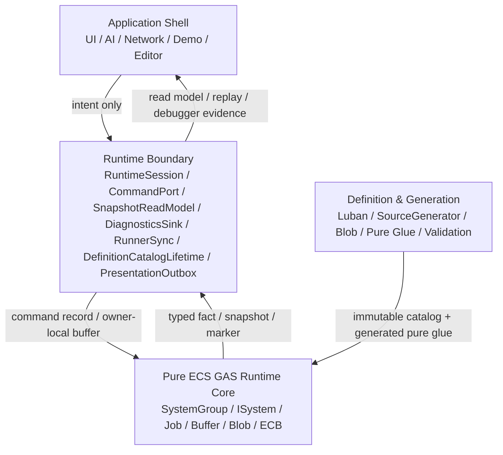

# 16-01A：目标分层与官方依据

> Owner：`01-目标态架构共识/16-纯ECS内核与边界重划分/16-01` | 状态：目标态 Spec 子页 | 拆分来源：`../16-01-目标分层官方依据与不变量Spec.md` | 最近拆分：2026-06-08

本文件只描述纯 ECS 内核与边界重划分的目的、DOTS 官方依据、目标分层图和分层不变量。Owner Map、验收表、消息流协议和完整代码骨架分别由相邻子页维护。

## 目的

定义 EX-GAS 2.0 的理想目标态：Gameplay 权威状态和热路径计算必须落在纯 ECS Runtime Core；OOP 只作为 Application Shell 和 Runtime Boundary 的外壳；Debugger / 日志是证据系统；Luban + SourceGenerator 只生成不可变定义、静态 lookup、pure glue 和 validation artifact。

本 Spec 是对 `00-总览Spec.md`、`02-四层架构Spec.md`、`03-RuntimeCore管线Spec.md`、`07-RuntimeCoreDebuggerSpec.md` 和 `08-Luban-SourceGenerator配置生成链路Spec.md` 的一次收口，不替代它们的细节。官方 DOTS 复核门槛以 `18-DOTS官方规范复核与性能红线Spec.md` 为准；本文件中的代码骨架必须能通过该门槛。

## 官方依据

| 规则 | 本 Spec 采用结论 |
|---|---|
| `SYS-01`、`SYS-02`、`SYS-05` | Core 权威计算落在 ECS System / Job；SystemGroup 是 phase owner；Debugger / Demo / Presentation 只能通过 Boundary 观察 Core |
| `SEL-01`、`SEL-02`、`SEL-04` | 先按数据性质选 API；proof-only carrier 不能固化为 scale-ready；每个选择必须有重选型触发条件 |
| `QRY-01`、`QRY-04`、`JOB-01` | hot path 默认 job 化，避免高频 random lookup；主线程 query 仅限 debug / low-scale / boundary |
| `SC-01`、`ECB-03`、`PRF-04` | hot path 结构变化集中到明确 `GASStructuralCommitSystemGroup` playback |
| `BUF-02`、`NAT-03`、`MAT-05` | singleton DynamicBuffer 只能 proof；并行 fan-in 必须 deterministic merge |
| `DBG-01..05` | Debugger 是 counter / official diff / evidence owner，不是 runtime 控制层 |
| `BLOB-01`、`BLOB-02`、`BUR-01` | 静态定义进入 Blob / generated lookup；SourceGenerator 不生成 runtime lifecycle owner |

## 目标分层

### 分层不变量

1. Application Shell 不持有 `EntityManager`、`EntityQuery` 或可写 `DynamicBuffer`。
2. Runtime Boundary 可以是 OOP，但只能翻译 command、导出 snapshot、转发 presentation / diagnostics；不做 damage、cooldown、tag requirement、stack、period 等 gameplay 计算。
3. Runtime Core 不调用 `GameObject`、`MonoBehaviour`、UI、VFX、SFX、日志字符串或 managed config registry。
4. Debugger 只读 Core facts / counters，不反向驱动 simulation。
5. SourceGenerator 只生成数据和纯函数，不生成 gameplay lifecycle system、hidden query、hidden ECB 或 hidden `EntityManager` write。
